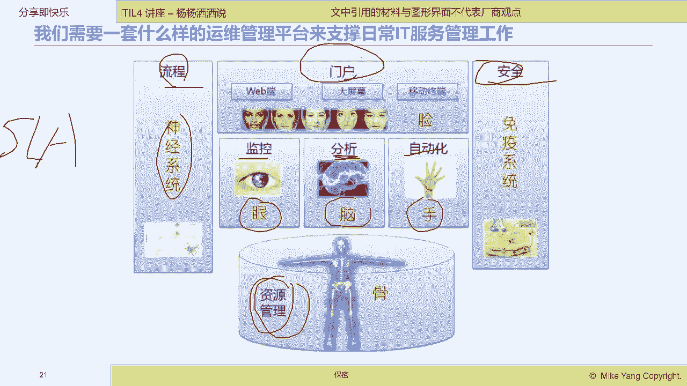
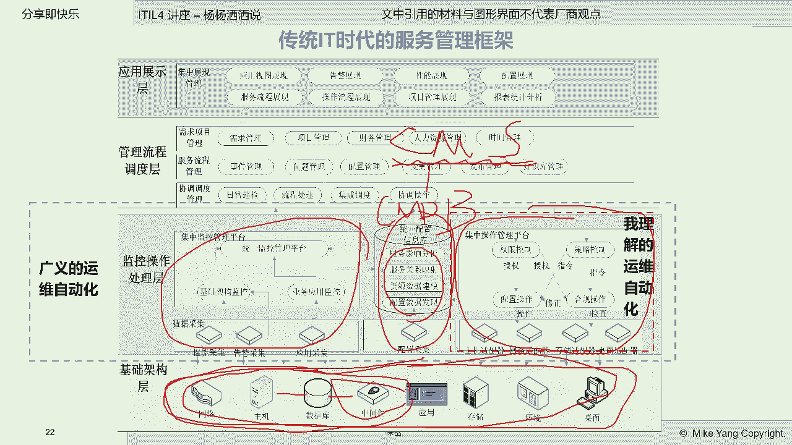
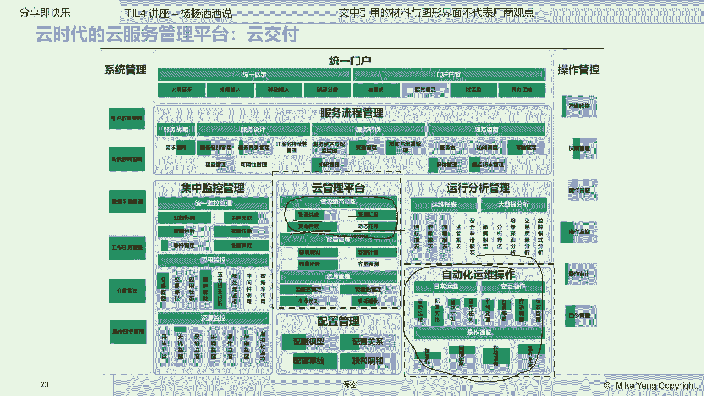

# IT服务管理的十八般武器之自动化运维管理平台 - P2：2.自动化运维管理平台在IT服务管理工只框架中的定位与作用 - 清晖Amy - BV1KD421A7dZ

啊好，那么我们看一看这个自动化平台哈，自动化平台在整个it服务，管理框架中的一个定位和作用。

那么我们都知道要去完成一个IT服务的管理，IT服务的交付就需要有一套完完整整的，就像我们企业里的什么ERPERP系统，进销存你都得管是吧，那么对于我们it部门也需要有一套TERP，那么这套系统呢。

这套系统呢，那我们一般叫做T服务管理工具平台是吧，it服务管理工具平台通常包含什么呢，通常包含兼空管理分析自动化，还有信息管理以及安全管理哇，可能诶我看是不是今天来听课的，有很多小伙伴是可能是非T的哈。

非T的，你们会会觉得T需要这么复杂的一套系统，给it部门自己去用吧，我不知道大家有没有这个认知啊，it部门需不需要有这么复杂的系统，去给it部门自己去用，其实我自己经历过很多这个呃这个企业哈。

他们it部门往往自己没有，他们不停的在给业务部门去这个生产，去开发信息系统，但是it部门自己的信息化很落后啊，他们it部门很多时候都在用手工的方式进行，各种信息的流转审批啊。

那我们就感觉这个是什么鞋匠的孩子，没鞋穿是吧，这个，但是现在这种情况呢已经发生了很大的变化，那么我们也需要it部门自己去生产，自己用到的信息系统，那么这套信息系统呢，就是我刚才给大家圈定的这些内容啊。

这些确定的内容，那么通常我们叫做监管空隙，监管控析分析的析哈，那么这是典型的，那么除了这个监管空隙呢，还有一个就是信息资源，就是核心的数据的管理以及对外的展示门户啊，对外的展示门户以及我们的安全系统。

那么就如同人的身体啊，监控呢就如同我们人的眼睛啊，空呢就是我们的手，我们的分析就是我们的脑子，我们的流程就是我们的神经系统啊，我们的门户就是我们的脸，我们的资源管理，所谓的资源管理就是IT的各种信息。

比如说你的嗯数据库的配置啊，网络的连接拓扑关系，这些信息我们就叫资源管理啊，资源管理，还有就是安全，怎么保护我们整个企业不受外界的攻击，嗯不会产生信息泄露，那么我们的整个安全体系，我们的免疫系统啊。

免疫系统，所以说呢这个就构成了我们一套完整的it服务，管理平台来保障我们的服务交付是高效的，是这个可以能够达到给用户承诺的服务级别，我们通常会在学apple的时候，我们会提这个概念叫SLA。

我相信很多做业务的小伙伴也会提到这个啊，概念哈，这个服务级别管理，那服务级别管理就是我们it部门给业务部门，这个叫做内部客服，甚至你们的外部客服提供了各种IT服务，比如说你们的人力资源服务。

你们的这个财务服务，人事服务，这些系统本身的可靠性，稳定性，安全性，可恢复性，你们是有质量要求的，这个质量要求是在SLA里面的，那么这个SLA怎么能够算出来，实际上是不是按照这个承诺的指标去执行的。

那你要靠我们说的这套系统去衡量啊。

这套系统去衡量，那么这套系统我们来看看真实的，在我们的传统的IT，也就是说我们还没有进入云化大数据时代，我们这个这个it整个it服务管理平台有哪些呢，大家看很复杂对吧，我但是从大块上来分也是比较简单啊。

大块来分大家可以看一下啊，那么首先是这个首先是监监控的概念啊，监控的概念，那么监控的概念呢是在最左边啊，最左边，那么我们可以看一下最左边啊，最左边就是尖，这边是空，这边是管，这边是信息平台。

这边是门户啊，跟前面刚才说的那个人的这个骨骼是一致的啊，人的骨骼是一致的，那么呃我们自动化平台，因为我们今天讲的是讲自动化平台对吧，讲自动化平台，那么我们自动化平台呢，其实在这个不同人的眼里。

他的理解是范围是不一样的，那么通常兼控和信息的收集和对比，其实在很多人眼里，这都是属于自动化，都是替代人去操作的啊，替代人去操作什么呢，人如果没有监这个，他就会去定时的去查看主机的状态，中间件的运行的。

那么现在有了监它就实现了自动化，人不用去看了，让机器啊，让我们的监控系统自动去看啊，替代的人，这个就是自动化嘛啊，那么监控你可以认为是监视的自动化，还有呢控这个是我们传统理解上的自动化啊。

或者狭义理解这个自动化，那么这个自动化呢，主要是对我们的被管对象进行什么操作啊，这些操作就有好多种啊，比如说配置操作合规操作啊，还有像什么呃命令发送命令的操作啊，发送命令的操作。

那么这个就是我们通常所说的这个，自动化运维平台，那么我们前面讲监控，我们已经跟大家讲过了啊，我们就不再重复，那么还有一块就是这中间这一块，中间这一块呢我们叫做配置自动化，也就是说大家可以看得到哈。

这底下的这些信息啊，这些被管对象的信息，他们和谁和谁联系在一起啊，联系在一起哪个应这个应用有多少，台中有多少呃，中间件有多少，服务器运行在哪个网络上的这些关联关系，你必须保存起来，给我们的it运维人员。

it服务人员去使用，那么这个信息的收集配置呃，发现这都是需要有一套工具的啊，我们通常这个工具叫什么，在大家如果熟悉的话，就应该知道啊，CMDB对吧，CMDB学过idol的同学都知道哈，这个叫cm。

光一个数据库不行，我们如果要说你要自动发现这些信息的配置，关联关系，以及他们是否发生了变化，那你是需要有一套软件工具的，这套软件工具就叫configuration management system。

配置管理系统对吧，他把所有的信息都会存在这个库里面，这个库叫统一配置信息库，就是我们所说的CMDBCMDB，那么这个就是我们在传统IP时代。

整个的自动化平台，那么我们到了云时代啊，云时代大家看云时代的自动化哈，这个操作平台呢跟前面比较类似啊，比较类似，那么但是它其实增加了对云的管理，这也是属于自动化领域的。

那在这里大家看这个其实也是属于自动化的，大家如果做过云的管理操作的话，那么云的资源的供给回收，扩容迁移都是靠自动化工具来做的，人根本没法手工的人，如果手工的去做，那就太落后了。

因为云已经让我们底层的资源，不是一个物理对象，而是可以像代码一样进行什么调用操作。

那么这个现在比较流行的概念，我不知道大家听说过没有啊，叫IAC，infrastructure as coinfrastructure啊，这个不拼写了，Infrastructure as co。

就是云的底层的数据库中间件啊，服务器存储，它们都像代码一样，可以被什么可以被操作，那么被操作，那么就是自动化，我们就是自动化，这个就是啊我们在云的时代，我们看到我们的自动化平台的扩展啊。

云云是在我们的扩展，那么我们再来看一看嗯，我们引入了敏捷，引入了微服务，引入了容器，我们的自动化在传统的这些操作上面，又有什么新的变化呢，在云的上面有什么新的变化呢，就出现了什么DIOS。

什么自动软件发布，我们通常称为CR什么continuous release，或者叫continuous deployment，我相信很多现在来听课的，今天来听课的小伙伴们。

你们现在企业里已经在实现DIOS了吗，我不知道实现了没有，实现了，可以打个一，我看看有多少呃，小伙伴里面你们企业在做这个divers，那么这个divers就是在，随着我们底层的信息技术的成熟哈。

那么它的自动化水平就会越来越高啊，从传统的只能发命令去操作这些设备，到现在可以像代码一样去编排我们的基础架构，以及去对我们的软件的发布过程进行全自动化，从软件代码啊。

源代码code开始到生成test case去自动跑测试案例，到最终你们软件被发布到生产环境，测试环境，开发环境，整个过程全部自动化，这个就是我们所说的软件生产流水线啊，软件生产流水线。

这个就是在出现了容器，出现了微服务，出现了这个微服务架构以后，我们的自动化的能力又升级了，我们自动化的范畴又扩展了啊，我就希望大家能够知道，我们的自动化是一种管理手段。

这种管理手段是随着我们的技术的发展，我们的管理手段去提升了啊。