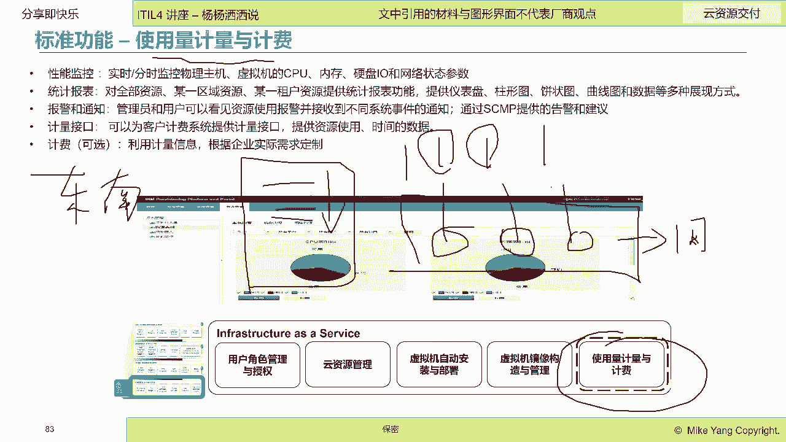
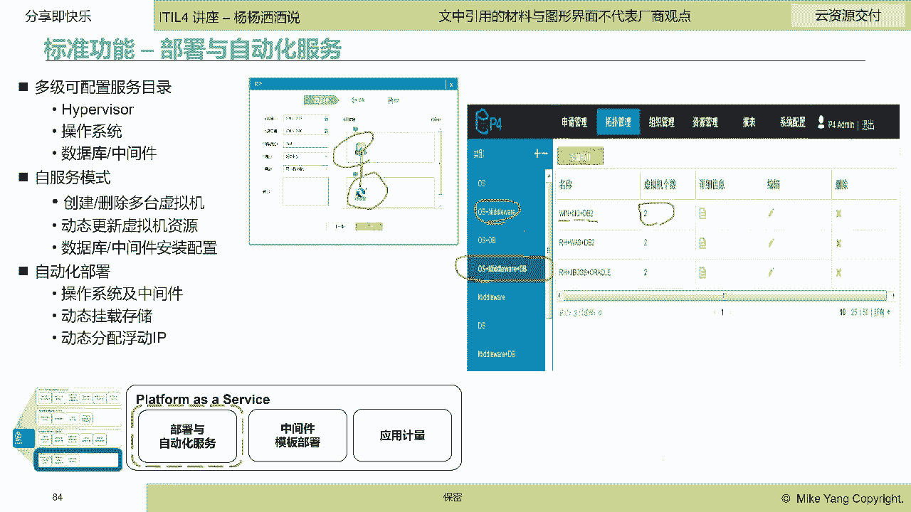

# IT服务管理的十八般武器之自动化运维管理平台 - P3：3.自动化运维管理平台的基本功能和分类 - 清晖Amy - BV1KD421A7dZ

好那我们刚才给大家讲了这个嗯，快速的给大家讲了一下啊，在传统时代，语音时代，敏捷时代啊，敏捷时代，他们这个自动化的功能和内涵，进行了变化和扩展啊，变化和扩展，那么我们接下来呢来跟大家去分享一下。

自动化平台它们的基本功能啊，以及分类，那么这个基本功能呢呃呃我是在上次课啊，已经给大家分享了，就不再重重复，那么接下来呢我们就开始讲这个分类，那分类呢我们在上一次上一次的讲座里面。

已经讲了两种自动化平台，一个叫自动作业调度，一个叫自动巡检啊，也给大家介绍了智能巡检啊，智能巡检，那么今天给大家讲的内容呢，大家看一下啊，比较多啊，给大家讲五个自动化的工具平台啊，工具平台再被切换。

配置信息管理，云资源交付应用部署批量变更啊，我不知道在座的小伙伴们，你们现在在日常的工作当中哈，有多少已经在使用这些自动化工具了，一和二是最常用的工具，但是34567并不是所有企业都会有的工具。

可能很多还是你们自己手工在操作啊，手工在操作，那么我们今天呢就是给大家看一看，拓宽一下知识面诶，在这些领域，其实可以用自动化工具来进行操作啊。

自动化工具来操作好，首先我们来看看第一个我们叫做叫做什么呢，叫做栽培，指栽培管理自动化或者灾备切换自动化。

这个需要真的需要大家有点T的知识啊，呃非T的人员理解起来可能会比较痛苦，但是大家要知道，其实发生灾难以后啊，特别是像地震火灾水灾，其实整个切换灾难恢复不单单包括it部门啊，其实还有业务部门一样的聚会。

参与到什么灾难恢复的过程，所谓灾难恢复就是让不能进行的业务，可以继续操作，就像汶川大地震，地震完了以后，银行要重新开业，要让老百姓可以去存取款，那就是要it部门和业务部门去配合对吗。

光有业务部门也不行对吧，因为我们所有的钱，都是存在后台的IT系统里面去，地震完了，首先IT系统要恢复，然后他有什么，然后就有现金对吗，然后还要有柜台，老百姓能去取钱，那么这个是业务部门要干的事对吧。

所以说栽培不是it部门的独角戏，是业务部门和it部门一起面对灾难发生时，进行快速的进行灾难恢复，让业务可以快速的持续进行啊，持续进行，那么呃我不知道有今天来听课的同学，有多少经历过哈这个灾备演练。

因为灾难是很难，就是发生的频率是很低的啊，嗯这种大型的灾难，火灾水灾啊，这个瘟疫炸弹啊，这种灾难发生的概率低，但是很多企业里都有灾备演练，特别是银行的同学，金融行业的同学，这都是有明确要求。

你们一年要做多少次栽培切换，又是从生产中心切到栽培中心啊，栽培中心，那么你们可能会接到一个栽培演练的，这个通知啊，比如说凌晨开始啊，一般都是凌晨，那么呃你们开始做准备，那要召集所有的it部门和业务部门。

一起来做栽培啊，那么栽培从生产中心切到栽培中心，可能这个时间会很长哈，呃两个小时，三个小时，四个小时啊，然后切完了以后，那么业务部门就开始用新的，在栽培环境里面运行的it系统进行工作。

好过了一段时间以后啊，可能是像我知道的，像有的银行半年会在生产中心，半年在栽培中心去运行，那也就是180天以后，那么他们会倒回来再进行回切啊，啊对应急在应急演练，对这个亚美说的对哈。

那么在这个过程当中大家看一下啊，其实参与的人很多，这是第一个，第二个系统很多，因为从一个生产中心切到栽培中心，IT系统可能有几十套，每一个步骤有很多啊，你可能要进行机器的切切换，应用的切换。

然后你可能是切到同城，也可能切到异地哇，这个工作很复杂，如果用手工作带来的后果就是太痛苦了啊，效率太低，呃人的执行是不可靠的，然后呃这个你对照的这个文档去执行这个操作，很容易出错啊，很容易出错。

而且这个人嗯执行这么复杂的，有关联关系的操作，很难拷贝不走样，你第一次操作正确了，并不代表你第二次再做一遍的时候，你不出错啊，所以说它是有风险的，他的操作风险是很高的，他不演练成功。

并不能保证你最后到真实的时候你能成功啊，认证成功，还有呢就是整个栽培切换的过程啊，或者是应急演练的过程，实际上这里面有大量的信息要记录，要人要去协调，要去通知信息要去同步。

那么这个如果没有工具平台去进行管理，与这种自动化平台进行控制的话，一定是忙中出错，因为在发生灾难的时候，人是很恐慌的，要急着要进行这个系统的切换，心情是很焦急的，你可能在平时演练的时候不出错。

到底真是碰到灾这个灾难的时候，你的操作很可能就会出错，而且不利于你去进行什么调整，统计分析啊，在这个灾备切换的过程中，有哪些失误需要去弥补，需要去预防啊，所以说我们看到传统的这个啊。

灾备切换是有很多不足的啊，大家可以看一下啊，在很多企业里，这种栽培切换会设计要画很多的流程图去规定，不同的人干不同的事儿是吧，一线干什么，二线干什么，请求人干什么啊，还有呢。

比如说呃实施这个栽培计划的这个过程讨论，然后人员召集啊，切换演练，如果切换失败的回切啊，然后这个嗯回去失败了以后要进行啊，这个这个这个就是修正，修正完了以后再再一次上线去切啊。

有很多很多流程需要大家去啊遵循啊，比如说要填很多呃电子工单啊啊，要去记录很多这个事件啊，问题啊，知识啊啊也有很多政策组织啊要去进行啊，这个协同，所以说其实一致灾备切换犹如一次战争啊，需要充分的准备。

然后有严格的槽点流程啊，才能够保证我们能够去进行切换成功，那么这个依赖于文，如果用文档啊啊就是用文档啊，用日志啊，用纸质记录啊。

那是不可能的，基本上啊，所以说呢我们需要有一套什么，我们要有一套啊这个灾备切换管理系统，或者叫有的企业叫这个啊，叫做啊业务持续性管理系统啊，持续管理系统去管理什么，我们整个切换的过程啊。

灾备中心和生产中心的切换过程啊，那么这样一套系统啊，这样一套系统它需要具备什么功能呢，才可以帮助到大家呢，那么第一个首先它具有这些能力啊，那么这些能力呢，就像我右边给大家看到的，是一些系统的真实界面啊。

它比如说它有栽培组织的定义啊，它能发生灾难的时候呃，向定义好的栽培委员会，栽培的切换小组，技术小组，协调小组去发通知啊，然后呢，所有栽培的过程，就像刚才大家看到的这些流程啊，这些流程全部都要工单化。

流程化电子化啊，那样的话，而且还需要因为不同的人去操作不同的数据库，中间件应用系统的切换，它要有权限控制啊，而且像银行里面因为要接触到生产环境，它是涉及到这个经济，这些数据都是记录着账号。

还有像这个交易金额，这都是需要有安全控制的啊，安全控制的，还有就是像你的这个整个，栽培资源切换的进度需要进行什么监控的啊，需要监控监控的，还有就是所有的兼呃，这个栽培的过程里面，你们带有审计功能。

因为切换是一次大的变更，这些变更是需要走审批流程的，是需要有相关权限的人进行审批，进行风险评估和确认以后，在平台里给你做审批，然后你拿到审批单以后，你才开始做具体的切换，这个是第一个。

你们需要在你们的灾备切换管理系统里面。

就有这样的功能，第二个功能需要有什么功能呢，我们都知道在被在切换的过程中，大家看一下啊，这是一个顺序的过程啊，那么这些过程呢它中间可能会失败，那你们要去记录这个过程当中，你们很多数据。

比如说栽培中心是什么，生产中心是什么，这个栽培中心，还有同城灾备异地栽培啊，那这个就可能会跟大家如果不做IT的人，可能就会听的很很很很很很绕啊，或者是说很很难啊，这个的确是需要有一些IT的技术背景哈。

还有就是你们要切换哪些业务系统，然后这些业务系统依赖的哪些设备啊，这个设备包括网络设备，存储设备，还有你们要去定义啊，切换的流程，先切换什么，后切换什么，然后呢脚本指令啊，你们需要统一的管理和分发。

这个是在我们的灾备切换管理平台里面，需要具备的功能，我们叫基础资源管理啊。

基础资源管理，第三个我们要去管理切换操作，大家可以看得到右边啊，右边是比较直观的，你不用看左边的字，如果左边的字呢的确是比较空洞的，那么你们可以看得到最简单的，你们的生产中心是什么状态。

栽培中心是什么状态，哪些呃，切换的进度是什么，就是说它切换到哪儿了是吧，这个执行完了，这个执行完了，这个执行完了，这个执行完这个哦，当前还在执行，它，后面的还没有开始执行啊。

你就能看得到实时的他的切换的操作，你们的脚本的下滑速度，执行进度啊，所以说呢你能够很快的去执行操作这些操作呢，实际上你们都以前演练过啊，演练过，所以说呢执行的时候呢，如果只要你的配置对象没有发生变化。

它都是能够顺利执行啊，这个就是要进行啊切换操作，当然在这个切换操作里面，你不可能做到全自动啊，很多企业你现在还做不到全自动，特别是啊我自己经历过的话，他可能执行到某一个地方，它就要输入一个什么口令。

因为银行是高像金融行业，它是高监管的呃，有些数据你留到别的地方呢，它一定是需要有一个口令的啊，那这个时候呢它就会中断，在那等待你的口令的输入，这个就是在切换操作的时候，需要去啊这个手工执行的啊。

手工执行的，那么第四个功能呢就是一个切换过程的监控啊，切换过程的监控大家都知道，在这个生产和灾备中心进行主备切换的时候啊，那么每一步你们其实以前都演练过，你们是需需要明确的知道这个步骤切换成呃。

做成功了没有，执行成功了，没有执行的时间，对不对，比如说平，就是你们演练的时候是3分钟就切换完了，但是现在呢切换了13分钟，那么这个是不是就有问题了呢，所以说呢你们要可视化的去监控到什么。

你们切换的过程，帮助你判断这次切换是否还正常执行者，是不是需要去进行人工干预啊，人工干预，所以说呢我们需要去这个进行这个这个这个嗯，切换过程的实时监控啊，通过监控发现切换过程当中出现的故障。

然后我们快速的进行调整啊，那么在这个切换的过程当中呢，大家可以去啊，嗯如果大家参加过这种切换的话，你们就一般就会有个大屏对吧，有个大屏叫应啊应急演练指挥中心啊，他会在大屏上去把这些整个切换状态打出来啊。

打出来让你去什么，这个，去实时的去观察进度状态，当然嗯有的企业里还会针对技术组切换组，就像这种啊，很多企业里，它的切换是很多人在一个指挥中心里面对吧，去指挥啊，去应急啊，这个就是我们看到的。

你要提供这样一个切换过程监控啊，切换过程监控，那么第五个功能呢，你们需要保证你们整个的这个栽培切换的过程，你们需要有这个操作管理和啊报表审计啊，报表审计，你们呢切换整个的呃这个流程的时间的记录。

然后处理的结果的输出，异常的处理啊，应对情况，还有操作历史的查询都需要有迹可循，可以追踪，可以回溯啊，这个呢一个是帮助我们的切换小组，发现我们切换的不流畅的地方，有瓶颈的地方。

有助于我们下一次的切换的时候去改进，第二个呢呃因为切换是从生产切到栽培，栽培里面，整个切换过程有没有出现数据泄漏啊，数据泄漏或者是有啊这种嗯一些不合规的操作，那么这个需要有一个审计的平台啊。

审计的平台，那么我们就要操啊切换操作管理与报表审计啊，学院审计，那么第六个啊，大的功能呢就是在呃在被切换的这个自动化呢，包括你们需要对整个切换过程，要进行加密管理啊，加密管理还有权限管理。

然后打出各种日志，生成各种报表，也可以进行数据导出，与其他运维工具做集成，这个都是我们通常去理解一个这个啊，在被切换啊，这样一个自动化平台的一个基本功能啊。

一个基本功能好，那么差不多花了20分钟给大家讲了，第今天讲座的第一个自动化运维工具，叫灾备切换管理平台，那么接下来给大家分享，第二个我们常见的这个管理平台，自动化管理平台，我们叫配置信息管理自动化。

那么这个呢通常呢会单独起一个话题来讲哈，就叫CMDB对吧，那CMDB和我们今天要讲的这个，有什么不同呢，我们今天讲的，你可以是认为是CMD这个数据库里面的数据，是从哪里来的，这些数据准不准确。

如何进行比对校验审计，这个要是需要自动化，这是需要自动化的，因为CMDB它只是一个数据库，它只是记录了数据中心，所有配置对象的信息和关联关系，这些数据你是必须要去，要么就是人输进去。

要么你就是通过自动化工具给它导入进去，啊导入进去，那么我们今天给大家分享的呢，就是这个CMDB这些数据是如何来的，那么常见的第一个需求点就是资源的自动发现，我不知道今天来听课的小伙伴呃。

你们企业比现在已经有CMDB了吗，有CMDB，大家打个一好吗，打一个一看看有多少小伙伴里面，现在企业里面已经有CMDB了，没有啊，看来今天来听课的很多不是做做T的吗，啊还没有是吗，嗯没有。

那就需要去建设你们的这个这个，这个配置管理系统啊，哎呦嗯又又看到熟人了哈好，那么我们首先是要讲这个嗯资源自动发现，那么资源自动的发现呢，实际上主要就是帮助大家去见CMDV，是去比对CMDG。

去保证你们的配置信息的完整性啊，完整性和准确性，那么所以说他第一个需求点是资源的自动发现，对吧，这时发现你能够通过一定的协议是吧，自动发现相关的这个配置信息啊，收集相关的配置信息。

然后配置信息发现了以后，你们还要做数据调和啊，数据调和，嗯嗯嗯包括比如说啊您您发现的数据不准确，不完整，你需要可能手工的去去这个这个这个去啊，去人工的调整，第二个呢，比如说啊你们最简单的。

你们可能从网管系统上抓了一些配置数据哈，然后你们也从这个配置管理系统里面，自动扫描了网络的数据诶，这两个数据其实不太一样，你们要去做调整啊，要去做调整，那么这个也是我们通常所说的这个配置信息啊。

配置信息的这个管理的自动化的一部分啊，一部分，还有像这个基线管理基线对比变更历史对比，那么这个也是我们通常所说的，配置信息的这个管理哈，那建立了配置信息，你们就需要什么。

你们就需要去啊了解你们的配置信息准不准啊。

特别是像我们后面看到的准不准是什么呢，就像这样，你们得到的配置信息，可能会形成你们的一个什么，你们的一个业务拓扑，那么这个业务拓扑大家都知道，实际上这是逻辑的概念是吧，在你配置库里发现出来的。

然后建立了他们的配置关系，这些配置关系在物理上它会发生变化，可能管理人员随着业务的需求，它进行了调整，那调整完了以后，你实际的配置和逻辑，现在这张图上看到的逻辑的配置，是不是一致的呢，是不是一致的呢。

是不是撕布了呢，你们就需要去管理，这个要靠人工去管理，基本上是不可能实现的啊，基本上是不可能实现的，一定是需要配置信息自动比对对吧，需要有这种功能啊，他会去比如说去扫描这台虚拟服务器。

配置发生变化了没有啊，它上面运行的实力是不是已经被移走了，啊所以说很多企业里建立CMDB一次性的工作，建立CMDB不难，难是难在后续的持续的校对和匹配审计的工作，那么这个如果没有工具自动化平台来做。

基本上最后你的库就很快变成垃圾库，没有用了啊，我自己亲身经历过的，2006年在交通银行做CMDB的时候啊，人工三个月输入的所有数据，过了三个月，基本上物理和逻辑这个思步率是非常高的。

因为那个时候在2006年，业界还没有什么自动化的配置，信息发布与比对工具，在2007年左右，业界才有嗯，像BMC啊，IBM啊才推出了配置自动发现工具和比，比对工具啊，比对工具。

所以说呢如果大家将来在企业里要建立CMDB，我建议大家一定需要去用工具来做啊，用自动化平台来做，不能用手工去做，那基本上是不可实现的啊，呃当然除了大家建立这样一个配置，信息库以外哈。

我自我曾经经历过一个项目啊，是干什么呢，还获得了嗯这个银行的一个进步大奖，他是去比对的，生产中心，就是我们刚才讲的啊，灾备切换的时候，生产中心和栽培中心里面的配置，如果要切换成功。

这里面的配置要应该是一模一样，差一点都不行，但是大家都知道，很多生产做了变更灾备环境的信息，其实没有对应的发生变化，那就导致会切换失败，刚才说的执行脚本就会失败，栽培就不成，栽培切换不成功。

那我们当时去做了一个解决方案，就是定期去比对生产环境的配置信息，和栽培环境的配置信息是不是一致的，如果不一致，赶快去修正，否则会影响在被切换，这是一个配置信息自动化啊，配置信息自动化的一个使用场景。

也是非常有意思的一个场景。

可能很多企业现在都还没有去做这样的事情啊，这样的事情好，那呃配置信息的自动化呢，主要就是帮助大家干嘛呢，主要是帮助大家去啊，几个大功能吧，我们嗯讲讲大功能哈，一个是自动发现，第二个就是配置信息的管理啊。

配置信息的管理，当然还有像配置文件的管理，所谓配置文件的管理，就是很多配置信息要下发到，比如说网络设备，这个服务器设备，我们的配置的统一下发这个配置，大家要了解哈，这个配置不是我们通常所说的。

这个这个配置信息，不是这个configuration item哈，这个可能是个配置文件啊，配置文件比如说你们的这个呃防火墙的策略啊，你们的这个要批量下发，比如说某个系统啊，它有前置机。

前置机里面的呃某些参数要统一的去修改，那么它这个配置文件，一个配置文件要发发给50个前置机，那么这个配置文件的统一下发啊，历史版本比较，这个也是配置信息啊，配置信息自动化平台的一个功能啊，一个功能。

那么这个配置发现嗯，据我所知国内企业做的还不是特别完整，但是在进步中在进步中，我自己在2007年的时候啊，进啊用了IBM的，叫CCMDB的这个配置管理系统，那个时候他能支持200多种厂商。

这个各种协议已经非常完整了啊，非常完整了，所以说呢呃就是嗯他们那种软件系统的兼容性，还有对这种呃不同型号，不同品牌设备呃，配置信息的接口的这个适配性和覆盖性啊，国内企业可能现在也还没有达到哈，这个。

所以说呢这个嗯，我们国内的企业还在努力的追赶当中啊，追赶当中，所以说呢他会自动的去发现啊，这个发现不是不只是第一次会发现，我们说还有什么，还有就是这个这个这个就是啊定期的去搜集。

现在的物理的配置信息和逻辑配置信息，进行比对啊，进行这种这种比对同步啊同步，那么如果大家有兴趣的，可以去学习这个啊CMDB的相关的课程哈，将来我有机会跟大家讲讲，CMDB的课程也会讲到这一块。

那么所有的信息发现回来呢，实际上最主要的就是要去构建什么，构建这个拓扑图啊，拓扑图这个拓扑图呢其实啊物理的关系，像这种关系啊，部署关系是比较容易获得的啊，通讯关系也比较获得的，还有物理关系也比较获得的。

比较容易拿得到，通过自动发现工具，其实最重要的是逻辑关系，很难发现得了啊。

什么逻辑关系呢，就像很多企业里哈，比如说这个应用组件，应用系统，它是一种逻辑的概念，这种逻辑的概念怎么和instance，就是这种物理的概念去建立关系，这个就需要有比较好的这个发现技术啊。

比如说这个应用组件，它所有的文件它下发下去以后，下发到这里面以后，他是不是都打了一个统一的标签，我在发现的时候，我可以去配置抓什么什么文配置文件，我就能够知道这A应用部署在这个容器上面。

B应用在这个中间件上面，C应用在这个服务器上面，能不能自动发现，还是要靠人，要靠人，这个工作量又大啊，要大，所以说呢这个就需要我们的这个国内厂商哈，嗯当然国际厂商我用的时候，他们已经支持了哈。

他可以去通过这种远程的SSH呃，这个这个这个啊还有这个希尔脚本啊，谢尔脚本登到这个服务器上去抓脚本，你只要按照规范去写，它就能够把逻辑关系给你抓出来啊，逻辑关系抓出来去构建我们的什么top啊。

构建我们的top，那这个拓扑构建完了以后是非常有用的啊，嗯我不知道在座的小伙伴觉得，这个自动发现出来的这个拓扑，对做it服务管理有什么用吗，有什么用，没有人知道吗，看看大家对配置管理这一块熟不熟啊。

这个配置拓扑有什么用，能帮大家在日常的服务管理中，用在什么场景底下，帮大家干什么，没人知道，哼哼哼好，那我给大家说第一个它可以做RCA啊，RCA所谓RCA就是这个root cost analysis啊。

当你某一个服务啊，比如说银行里面的取款储户去取款，这个服务现在很缓慢，有失败啊，那怎么去拍照呢，嗯你可以从上到下追溯是吧，从上到下追溯嗯，你可以看得到他的依赖关系，然后你可以去去查询啊。

那么现在有的国内有的厂商呢，把这个叫做台账数，我不知道大家听说过没有排障数啊，这就是结合了空间和时间关系啊，空间关系就是这个依赖关系啊，时间关系呢告警他的状态正不正常，他有没有事件产生，告警事件产生啊。

去判断推论哪一个root cause，这是第一个应用场景，第二个应用场景呢我们叫Impact analysis，Ra impact alysis，什么叫Impact analysis呢。

比如说我的这个物理服务器要做一个变更，它到底会影响哪些服务是吗，它会影响哪些服务，我能看出来评估这个服务的重要性啊，这个配置项的重要性啊，就是刚才秦洪林说的变更影响分析，这是变更的一个影响场景啊。

影响的一个场景，这个就是我们看到的一个配置信息。

自动发现的功能好，接下来呢我们来讲第三个自动化管理平台啊。

我们叫做云，在云的时代里面，由于我们的基础架构，已经可以像代码一样被调用，所以说我们有了云管平台是吗，大家知道云管平台cloud manager platform是吧。

那么这个主要我把它归在叫云子云资源交付，英文单词就叫provision provision啊，crowd resource provision啊，那么它主要是干什么呢。

它主要就是把我们企业运行使要使用到的系统，运行需要使用到的计算资源，存储资源，网络资源，能够快速的按照使用者的要求进行供应，所谓供应就是操作系统装好数据库，装好，中间就装好。

开发人员直接可以在上面开发程序部署应用，这个就叫云资源交付，当然云资源交付只是云管平台的一个功能哈，现在云管平台可以做很多事，但是最核心的功能还是，至少我在自己在开发云管平台的时候。

最主要的功能就是这个云，云管平台的这个资源交付啊，云管资源，今天给大家分享的，也主要就是这个云资源的交付啊，云资源的交付，那么云资源能交付呢，大家看一下它的功能很多啊，一个云资源交付平台的功能是很多的。

那么呃时间关系。

我也不会给大家一个一个的来讲啊，讲几个最重要的功能。

第一个功能哈，第一个功能就是这个呀。

第一个功能就是啊，这个这个资源的权限管理和角色，这个在其实在我们的自动化平台里面嗯，只有这个平台，我认为他对资源的呃，他对权限和角色和租户，这个概念会分得特别清楚，为什么呢，因为我们有了云网平台以后。

我们会对所有的资源会进行计价，计价因为我在云之前的那个时代哈，嗯数据中心或者是提供这个服务的这些啊，部门就是it部门，他们买服务器，买网络，他不会把它分摊到每一个项目小组，每某一个应用上去。

很少这么做的，但是到了云的时代，由于我们资源可以进行定价，可以分配动态分配，所以说我们提出了什么租户的概念啊，租户的概念，租户是可以获得不同领域地域的资源，而不同云资源池的资源啊。

这些租户的概念在很多企业里，可以是来自于一个项目组啊，可以是来自于一个业额业务部门啊，业务部门，那么同时有了这个云管平台，我们就真正的实现了什么，我们it is not freely，不是免费的啊。

有了云管平台，我们可以把资源的价格打到什么，打到嗯，嗯每一个项目上去，每一个应用系统上去，每一个业务部门上去啊，所以说我们会去干什么，我们会去华租户啊。

华租户华这个使用者啊，华子用者，然后第二个核心的功能呢，就是要去提供什么云资源管理啊，云资源管理，那么很多企业里的云资源呢，可能来自于公有原因，也来自于私有云是吧，我们叫混合云是吧，混合云。

那我们很多企业里的呃，这个平台软件可能前端是放在公有云上面的，后端是放在私有云上面的，我们现在一个项目组或者一个应用，要既要用到公有云的资源，又要用到私有云的资源呃，公有云要用五台服务器，五台虚机呃。

这个私有云要用六台虚机，能不能一下子就能给我分配到位，如果没有云管平台，没有这种自动化的手段，嗯我知道的哈，一个企业基本上要花一个星期，才能把这些虚机啊，呃虚机啊，网络啊，存储啊才能够配好。

交给我们的开发人员，或者是交给我们的这个啊发布人员，这在敏捷的时代，在divers的时代，这个就是不可接受的啊，不可接受的，那怎么办呢，我们就可以使用云的统一的交付管理平台，去自动化的一件事。

进行什么资源的分配，资源的申请，资源的供应啊，他可以去供应不同类型的资源，然后从操作系统就是虚拟机，网络存储镜像一件事获得所有的资源，可以在小时级分钟级获得你想要的资源。

大大提高我们资源供应的速度啊，配合我们的什么敏捷，配合我们的DIOS，好那么很多企业里除了蓄积以外。

很多企业里还有物理机对吗，有的项目还用物理机的，特别是像一些这种啊高内存的，高计算量的并不适合用虚机，那物理机能不能也快速的交付呢，可以那么我们称为bell metal。

这个bell metal它可以直接在，就通过我们的云资源交付，可以去安装操作系统，就是在物理机上安装操作系统，绑定IP开机关机进行回收，同时它还可以跟虚机一同部署，就说你生不单单申请云资源。

你还可以申请裸机资源，二裸机资源，当然这个是有前提的，比如说你的这个物理机必须支持IPMI网卡啊。

那么这个是裸机的管理，那么还有呢，就是我们的这个虚拟机的自动部署啊，虚拟机的自动部署，那么这个虚拟机的自动部署就是刚才说的哈，就是呃不单单是给你提供虚机，还可以让你什么手自动化的自助化的启动。

停止虚机批量的去啊操作虚机，还有就是支持虚机的备份恢复，还有就是支持虚机的延期和注销，什么叫延期呢，大家都知道你在深你们在用公有云的时候，你们去买公有云的时候，你们是需要知道这个虚机你可以用三个月。

五个月，你们是有期限的，在这个期限你是要收费的，你不用了，你想省钱，你最好就把它注销掉，这就是云的特性对吧，它可以动态伸缩啊，动态伸缩，如果你买了三个月，哎呀，这个项目还没有做完，我还要延期两个月。

你可以提出延期申请，那么这个都是可以通过自动化做啊，不需要这个这个这个这个人手工的去操作，你的鼠标一点它就可以做延期，当然延期的背后就是可以要给你重新计费了啊，重新计费了。

所以说我们看得到一个云资源的交付，其实涵盖了资源的申请审批，自动部署，启停资源更新，快照恢复。

延期注销的全生命周期啊，原生命周期，当然你如果是说你们企业里除了这个啊，这个这个呃做这个续集以外，你们还可以去啊，通过构造你们的镜像啊，就是image啊，这个就看你们企业里现在做不做哈。

不是直接生成一个操作系统，你还可以直接在操作系统里把对应的啊，这个中间件啊，数据库直接给你配在你的镜像里面，你生成的直接就给你生成一个镜像，直接带有操作系统，数据库中间件的一个镜像给你拉起来。

给你分配好，那么是这个呢也是有缺陷的哈，它会就会生成很多组合，比如说linux red hat56G在什么啊，WEBLOGICLINUXREDHT6。516G这个red head呃。

这个这个tom CAT7。0就有好多好多的组合，这个镜像就会镜像库就很大，那么这种方式呢适合那种小企业啊，比较标准化的企业，那么是可以采用这种啊。

虚拟机通过镜像来构造的啊，还有就是在这个云管平台里面。

在这个云资源交付的时候，还要考虑就是计量计费哈，计量计费我们需要通过这个啊去通过自动开通，自动销毁去啊，对资源的使用时间使用的纪律，这是分量要进行这个计费啊，计费，那么就让我们的使用部门。

业务部门可以去啊，感知到他们的IT使用是有成本的，也让他们去嗯，有意识的去节约它的这个IT的使用量啊，这种例子很多啊，我啊在做项目的时候，我在东南大学，当时他们有一个实验室啊。

他们每个实验室可以到校园网里面去申请，这个叫科研云，这个科研云里面他们申请完了以后就不释放，然后这个资源越用越多，但是这些资源不释放呢，他们又不用，所以说这个嗯这个这个网络云。

这个校园云的这个管理者很头痛，然后就用了我们的云管平台，那么这个云管平台会做什么事呢，会去定期的去把这些资源最空闲的虚积排名，然后最空闲的时间多长，会把这个报告发到这个校办校校长办公室，校长办公室会去。

可能责令这些实验室要去把这些虚机注销掉。

让资源得到最大化的利用，最大化的利用，当然刚才说了，其实啊，这个呃，我们可以通过镜像来去自动化的安装数据库，中间件是吧，但是那个会由于版本啊组合太多，那通常呢我们会用另外一种方式，什么方式呢。

我们会让我们的云资源交付可以去选装，就是在你的虚机里面啊，我们可以去选装什么，选装windows加MQ加dB two生成两个，然后呢它们之间是什么关系，通过什么端口去对接，我们可以通过什么可视化的配置。

形成一个什么我们的拓扑，比如说我这回要的是操作系统加中间加，加数据库的这样一个组合啊，或者是操作系统加中间件的组合啊，而且是数量是多少。

我可以进行什么，就像这样进行编排啊，进行编排，我们只要一次设置就可以重复使用，避免了什么这个反复配置提高了效率啊，所以说呃，如果现在你们的企业里，还没有使用这个云管平台的啊。

我也建议哈从这个这个自动化的角度，提高生产效率的角度，那么我也建议大家可以去啊，在市场上去选择对应的云管平台工具啊。

好，那么接下来呢呃我们给大家讲一讲，这个应用的交付，刚才是讲的是云资源的交付对吗，叫provisioning，现在呢我们来看看应用的教辅，应用的交互比这个资源的交互会更复杂，资源的交付会更复杂。

大家看一看啊，一个应用系统，它如果要上线，要发布，他要做很多动作，大家看一下，我不知道在座的各位，今天来听课的各位哈，有多少人参加过应用的发布，软件发布，应用的软件发布是一个，具有庞大工作量的。

也是需要这个多团队开发运维业务，甚至管理层一起来参与的，因为我们的一个发布啊，这个可能是需要这个嗯，有大量的手工工作需要做啊，安装包的下载，任务的启停程序的更新，配置文件的修改，数据文件的创造。

然后还有呃新老系统的数据的迁移，然后上线以后你的这个呃系统运行状态的检查，如果这些都靠人来做，这个工作量是非常大的啊，非常大的，而且效率非常低啊，效率非常低，那么嗯同时呢这个发布呢。

由于这个这个这个重复性工作比较多，那么它会占用大量的人力物力，然后呢，还有就是你发布呢不是一台机器上去做的操作，你可能是嗯像银行里有些大的版本的发布，都是几十台机器要同时要批量的进行操作啊。

这种关系很难控制，然后还有就是整个发布过程呢，多人参与了这个协同性，协调性啊，协同也是一个大问题，然后呃整个发布过程，软件的发布过程，部署过程呃无法可视化，都会导致我们什么，导致我们的发布失败啊。

发布失败，那么我们可以看得到哈，整个一个软件的发布要做的动作，技术动作是非常多的，投产前的准备，这个发布的过程中间的操作，还有这个头啊，这个上线以后的这个检查嗯，在IOE的时代哈。

它基本上都是手工操作啊，都是敲命令嗯，我参加过啊，这个这个这个发布那都是半夜开始干，两个人坐在一起，一个人敲，一个人，看有没有出错啊，有没有出错，这个但是我们想用应用交付这个平台，主要就是要做到自动化。

要做到自动化啊，包括现在这边写的手动，从管理平台获取投产程序，现在都做到自动化啊，都做到自动化，那么这个基本上，现在这个在DIOS这个提倡的这个理念下，应用交付是他其中的一个环节哈，持续交付是一个环节。

那么在这个环节里面，现在互联网企业应该基本上可以做到，百分之百啊，做的全自动化哈，人工干预极少，那么在银行业还是有部分的工作，可能需要采用手动的方式啊，手动的方式，那么像这些，以前基本上都会。

可能是需要这个这个这个自动化的，现在自动化率哈，这个还是比较早的，数据可以达到63%了啊，就是在这外圈的都可以自动化了，只有什么怎么介质转移，介质核对，我不知道这个大家有没有。

因为可能你们很多人没经历过哈，像银行里他的那些呃备份的介质，它是是用磁盘，是呃是用这种离线的磁带库存起来的，那个他是在做这个发布的时候，他可能是需要去调磁带的，调介质的，还要做业务验证的。

他这个是输入口令的，这个是没办法没做到自动化的啊。

其他的基本上都可以自动化啊，自动化，那我们说这个如果有了这个应用交付自动化，和前面谈到的资源交付的自动化，我们就可以实现所有的整个应用上线，上线的全栈自动化，我不知道大家理解这个概念吗。

全栈自动化是什么呢，大家可以看一下这个流程哈，当我们的运维人员，要去发布一个软件平台的时候，这个软件平台是需要新的操作系统，数据库中间件，它就是是在空的零零环境去发布你的软件系统。

那这个时候他就需要是什么，需要去产生从存储网络服务器数据库中间件，应用运行环境的所有的创造，以及应用软件介质的安装，以及参数配置的自动化，以及你们在系统发布以后要去自动更新，我们前面讲的什么CMDB啊。

你要做到自动化，全程不需要人去参与，啊全程不需要有人去参与，这个就是真正的实现我们的这个持续部署，持续监控，持续配置，啊我原来最早学divers的时候，它是叫6C对吧，60持续规划，持续集成，持续测试。

持续部署，持续监控，持续反馈feedback，所以说没有自动化平台，你基本上是不可能做到这样的，一个全在全流程的自动化啊，全程全在全流程的自动化，那么这个它实际上它的工作呢，在我们讲这个应用交付的时候。

主要是在这一块对吧，主要是讲应用的自动部署啊，用的自动部署，那么对主要是在安装介质，然后还有就是部署后验证，以及配置库的信息的自动更新，这个是我们应用交付自动化想去达到的效果啊。

那应用交付的自动化，其实嗯不只是在生产环境啊，在生产环境需要做这个自动部署，自动的软件的部署，那我们在测试环境，生产环境，栽培环境一样的需要自动化部署，而且我们也强调。

所有的环境的部署应该是使用同样的部署脚本，只是配置参数不一样而已，所有环境的差异是通过配置参数的差异，来进行变化的，不影响它的执行逻辑，这样就能确保你在测试环境的自动化脚本，能够在生产环境执行。

提高什么软件部署的成功率，啊两年正是问题，那么这种自动部署它实际上就会做哪些动作呢，比如说文件的自动分发，自动安装，然后配置信息，配置文件的自动读取与配置的更新，然后还有就是支持你的多服务器的自动部署。

同时部署或者串行部署，嗯还有呢还有通过你的这个编排，你可以做到，配置失败了以后，发布失败了以后怎么回滚啊，怎么回滚，所以说我们可以看得到自动部署，可以帮助我们完成我们人原来手工做的，所有的工作啊。

所有的工作，那么我们在做这个自动部署的时候，我们最主要的是要去看我们要部署什么啊，部署什么，如何部署，部署到哪，我们要去完成对这些部署啊。

动作的一个配置和一个执行啊，首先来看我们要部署什么啊，部署什么，我们就会对单个组件，补丁包的部署对象进行配置，比如说我们对这样一个程序，我们的部署动作是什么，我们先要下载脚本的数据库的脚本包。

然后要对这个脚本包进行解压，然后要去执行这个脚本，然后创建数据库，然后通过脚本里的数据灌入初始配置数据，这样的动作，原来是完全要靠手工敲命令人去做的，现在你可以通过拖拉拽就给它部署，都给它定义好。

都给它定义好，作为一个组件去增加起来啊，你可能去增加一个app的一个部署过程，dB的一个部署过程，一个touch的部署过程，好这个定义好了，接下来就是定义如何部署，主要就是部署的先后次序逻辑关系。

比如说得先创建数据库，再去部署app，就是你的这个应用程序，因为你的应用程序在部署的时候，要去连接数据库的端口，你的部署成功以后，你的数据库和应用程序已经自动连接好了啊，自动连接好了。

所以说呢我们就可以看得到啊，我们就可以配置所有组件，完成一个整体应用，所有组件的这个部署逻辑啊，部署逻辑，然后还要复用单个组件的部署逻辑，因为你某一个公共组件你只要创建好了。

你在多个应用里面可以重复引用啊，重复运用，然后你还要定义什么目标环境配置参数啊，因为你的各个部署环境，配置是可能是一样的，但是它的环境参数会不一样，你会对每一个参数你可以可视化的进行配置。

这边叫8080，下面一个可能叫8085，你需要去通过对于目标环境的这个参数的设定，实例化，你可以屏蔽环境的差异，使用统一的什么统一的这个安装配置，前面的什么这个流程啊，流程好。

这个就是我们谈到的这个应用交付自动化啊，这个也现在是我认为在这个divers里面，经常会谈到的，但是他不会谈谈到的这么细哈，因为在divers里面可能会更多的给大家谈CI。

那么在IT服务馆里会更多的跟大家谈，CD就是持续部署啊，那我用的名字叫应用交付啊，应用交付就是把你的应用程序部署上限啊，部署上线，然后呢能让业务正常访问，那我们对业务部门来说，这个就是应用可用。

那么在就叫我们就叫啊application delivery，delivery好，这个是应用交付好，接下来我们来看下一个这个自动化平台，我们叫批量变更啊，批量变更大家都学过idol哈。

变更是大家作为IT服务团队，IT服务人员的高频动作之一，高频动作啊，高频动作嗯，因为这个世界唯一不变的就是变化是吧，it人员现在面临着很多变化，新技术啊，业务部门提新需求，新需求就导致快速的应用应用。

为了满足需求那种不确定的需求，就会不停的发布补丁，打版本啊，所以说这个变更是非常多的啊，应该是非常多的，但是由变更导致的故障又是居高不下的啊，我最近我的朋友圈我发了两篇文章，在分布式环境下。

这个有的企业里，竟然这个变更的，这个导致的故障的这个这个占比啊，有70%，我听到的就是我经历过的一些企业，是40%到50，我觉得是比较正常的，他说他的这个变更导致的故障有70%，我有点这个叹为观止啊。

那就说明变更对企业带来的危害是很大的是吗，特别是大家是保障服务质量的，你如果有变更导致服务的中断，那就是s la什么下降是吧，用户要投诉，要抱怨的咋办，那我们就要说什么，用自动化变更是吧啊自动化变更。

那么这个自动化变更呢，我们有时候也叫批量变更啊，批量变更，那么主要就是我们需要对这个常见的啊，高频的变更作业，常见高频的变更作业啊，变更作业啊要进行模板化啊，要进行模板化嗯，大家学过流程啊。

变更管理流程是吧，但是大家都知道流程啊，它是一个管理性的工作，我们流程要进行固化对吧，要进行固化，减少流程执行的人带来的差异，自动化平台就是在干这个事啊，那么这个固化就是要把这个流程。

把你什么什么变更给你做成什么，给你做成自动化脚本，可以自动化平台，大家学变更管理的时候，大家我给他经常会给大家讲一个词叫change your model，大家还记得吗，Change model。

change model是什么呢，change model就是对于常见的经常做的一些变更，你们要写你们的变更手册是吧，这个变更手册里面会记录变更的步骤，顺序变更的啊，每个步骤执行的时间阈值啊。

exhalation就是你的升级流程是吧，那这些东西其实都可以，如果你的文档能写下来，那就说明可以标准化，标准化完了就是什么自动化，这个逻辑在IPHONE4里面大家还记得吗，第七个原则就是讲这个。

第七个原则叫优化与自动化，optimization and any啊，Optimization and automation，那么在automation之前要STANDALIZATION，要标准化。

标准化前提我认为就是要要这个文档化，要要把它change model要写出来啊，写出来，那么你就可以进行什么批量这个可视化去呃，设置你的这个常见变更的，执行的这个啊这个流水线啊，流水线你可以去编排。

然后呢，你可以说呃去比如说这个文件传输过程中，如果没收到，那你可以进行重做啊，重传，然后呢还有就是对整个执行过程进行统计啊，进行统计，那所以说呢我们可以看得到我们整个的啊，多次执行啊。

而且可以针对不同的节点去执行，同样的变更操作，所以说呢这个就防止了你去重复操作啊，嗯而且对于整个过程呢你可以进行监控是吧，对于这个设备的变更，这个配置的下发完全没有操作成功，没有状态是什么。

然后我发了多少，然后成功了多少，失败了多少。

