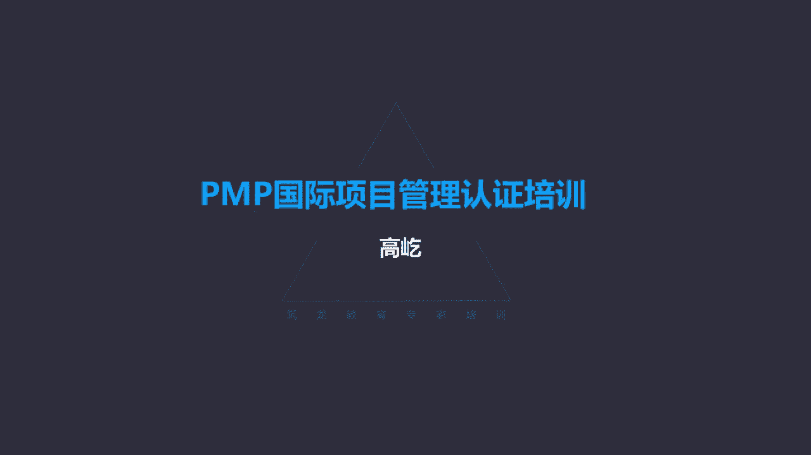
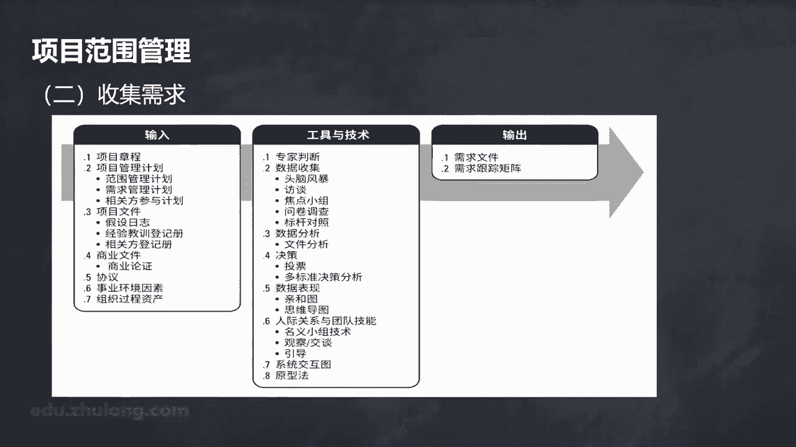
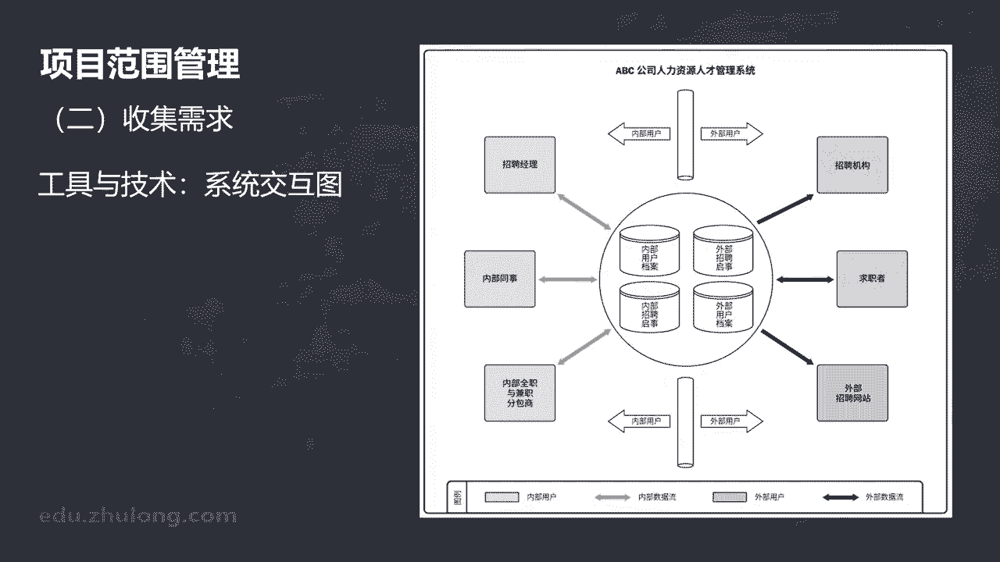

# K003-PMP项目管理认证培训 - P10：10.项目范围管理：如何收集需求？ ▲ - 与君共造价 - BV1eu4nerEJF

第二个过程收集需求，收集需求过程哎，这是为实现目标，要确定记录，并且管理相关方的需要和需求的过程，那么这个过程的主要作用为定义产品范围，还有项目范围奠定基础，刚才我们在规划范围管理的时候。

我们有了高层次方向指南的文件，我们得到了范围管理计划，得到了需求管理计划，那我们就知道了如何管理范围，如何来管理需求好，那接下来我们就要正式的收集需求了，什么是需求呢。

按照我们项目管理知识体系指南的定义哎，需求根据特定协议或其他强制性的规范，产品服务成果必须具备的条件或者能力需求，在我们书上有一个特点叫以量化的，而且要得到书面记录的需要和期望，一定是能够量化下来。

也就是清晰的记录表达，而且呢还有书面化，让它规范起来，这个叫做需求收集，需求过程啊，这里面的主要一些概念集中在工具技术上，怎么去收集需求呢。

我们用到一些特定的工具，比如头脑风暴，这个大家不陌生，我们前面前面哪个过程提到过这个工具呢，你想一想，创建工作呃，创建项目章程哎，这是创建项目章程的工具之一，头脑风暴哎，咱们那会儿说过哈。

这个工具的特点，它的关键词就是创意，为了获得有创意的信息，我们应该优先选的工具就是头脑风暴，它的特点，大家面对面公开的把自己的想法，毫无保留地表达出来，而且头脑风暴的过程中一个重要的原则，不点评不质疑。

这是头脑风暴，这可以收集需求，还有呢访谈，这咱们也提到过，也是在制定项目章程过程中用到的，访谈的特点，一对一面对面，那么在收集需求过程中，还有另一个突出的特点就是获取机密信息，这个信息或者这个需求。

具体的息需求啊，涉密了他是隐私性质的，那么他当然就不适于公开了，那因此如果题目里面涉及到了哎信息，涉密是机密类的信息，那么咱就不能用头脑风暴了，头脑风暴面对面的嘛，公开的，这不合适了。

那么我们就用用访谈的方式一对一面对面，这样这些机密信息更容易获得收集，还有焦点小组，这个也提到过，同样也是制定项目章程的工具之一，它的特点由主持人，他是讨论的焦点，小组一定围绕某个焦点问题。

大家来讨论这个讨论，头脑风暴里面是不允许出现的，头脑风暴不点评，不质疑，不许讨论，还有新的工具出现了，叫问卷调查哎，问卷调查什么时候会有问卷调查呢，这个工具的特点，第一书面问题，当这种书面可能是纸质的。

也可能是电子版，总之他要写下来，而且在需要快速完成调查的时候，我们应该优先用问卷调查的方式，问卷调查一般提一些问题，通过简单的选择啊，选取啊，打打勾就可以了，我们就能够得到我们想要的这些信息。

所以呀它满足快速完成调查的需要，另外呢接受问卷调查的这些个人啊，主体对象不一定集中在一个地儿，地理位置可以分散，我们可以用邮件的方式来问卷调查，也可以用邮寄邮件的方式对吧，除了电子邮件。

还可以邮寄邮件的方式嗯，还可以呢，变化啊都可以，所以啊对受访者的地理位置没有约束，并且因为我们问的是相同的问题，不同的人对相同问题的反馈态度，那么这样可以用统计的方法。

用统计学的一些手段来得到最后的结论，比如最后形成一个柱状图，或者形成一个类似饼图啊这种方式，这也是问卷调查他最终得到的一个结论啊，经常用这种方式来表达问卷调查的结果，所以问题书面化啊，需要迅速得到结果。

被调查的对象地理位置不集中，而且还能得到统计的啊这样一个结论，这都是问卷调查这个工具的特点，如果题目里面涉及到了上述这些特点，或者说为了满足这些个需要的话，那么这个工具我们就应该选择问卷调查。

还有呢标杆对照，什么是标杆对照啊，就是对比目的呢啊，通过这种比较形成叫识别出最佳实践，我们跟别人做标杆对照，我们向别人学习，找出人家的优势，对应我们的不足，找到差距，我们还要找到改进的方法。

最终弥补我们的差距，甚至还要超越对方，这个过程叫标杆对照，另外决策技术也是收集需求过程需要用到的，决策技术，我们这里分了三种，第一种叫一致同意，一致同意指的是被问及呃，需要参与决策的人，每个人都同意。

百分之百都同意了，那才认为这个结果是可接受的，换句话说，一致同意代表每个人都有否决权，只要有一个人不同意，这件事就不能通过，还有一种呢叫大多数同意，大多数同意，一定要超过50%，如果不能超过50%。

这是不能通过，不能被接受的，有大多数同意，那就有相对多数同意，相对多数同意，群体中相对多数的人，根据他们的意见来做出决策，也可能啊这样一个最终的结果没有过半，但是在不同的观点意见里面。

哎这是得到支持最多的一种，那么这种方式叫相对多数同意，这是决策的三种情况，另外还有一些数据表现的工具，比如亲河图，什么是亲河图啊，亲河图对大量创意进行分组，既然是对创意分组。

所以亲河图一般是用在头脑风暴这个工具以后，先是头脑风暴，我们得到了大量的信息，那么为了让这些信息得到有效的应用，我们要对它进行分类了，把相同相似的观点放到一起归类啊，这便于后期对信息的整理，包括应用哎。

亲河图这里有个例子，你看这就是一个亲河图，如何开设一家受欢迎的快餐店，我们要自己创业了啊，开个小的餐饮店，好，大家头脑风暴啊，这个时候要注意这些，那个时候要注意那些，我们得到了很多信息。

接下来头脑风暴结束了，我们要对这些个相对杂散的这些个凌乱的，没有排序的信息，我们要分类啊，相同相似的观点把它放在一类，比如涉及人员的，包括什么旅游服务专业的，要有大专文凭的。

英语要过四六级的哎这些我们放在一起，比如涉及服务态度的，包括着装的，包括什么微笑服务啊等等，包括什么主动帮助客户哎，与服务和态度相关内容，这些信息再放到一起，这个就叫亲河图。

所以它是对头脑风暴这个工具的进一步，深化应用，那后续的具体方式把信息把创意分组分类，另一种工具叫思维导图，思维导图这个工具特别有用，还有一些专用的软件可以做思维导图，很多人呀也愿意这个画思维导图。

思维导图他也是在头脑风暴以后，通过头脑风暴得到了这些个创意信息之后呢，把这些个杂散的没有什么规律的信息梳理，这回不是什么相同相似的分类了，相同相似放在一起，那叫亲和图，彼此相信咱们就亲和嘛。

而思维导图呢还有反映不同的信息，这些创意之间的关联性，思维导图我们这里看一个样子，有一个主题一般放在中间，那么这一个主题分出不同的分支，与主题相关的，这叫一级分支，那么每个一级分支呢。

又可以派生出若干个二级分支，二级分支还可能衍生出三级分支哎，不断的细分分类，但是在他们彼此之间是有这种共性啊，包括啊这种关联性，思维导图的特点，就是能够让我们把与某个概念相关的，它的周边信息进行梳理。

进行归纳，这样能够帮助我们对某个问题的认识，更加的全面，并且呢更加的清晰诶，有规律，比如说我们复习的时候就可以用一下思维导图，以咱们前面讲过的项目章程为例，那我的主题就是项目章程。

那么一级分支就包括这样几方面，比如它的输入工具，技术输出，另外呢还有项目章程的作用，我们把它当做一级分支啊，它的输入有什么呀，有协议，有商业文件，有事业环境因素，有组织过程资产。

那么这里面商业文件又可以分出另外两个分支，包括商业论证，还有效益管理计划，进一步深入把它再分解哎，商业论证里面我们会看到什么呢，清晰明确的目标，效益管理计划里面呢，实现目标的方式方法和时间好。

这个分支我们分到底了，我们再看另一个啊，另一个分支，比如它的输出啊，制定项目章程，这个过程的输出输出，一个叫项目章程，还有一个叫假设日志，那么项目章程哎，这里面又包括的内容，有明确的目标啊。

有总体的概述，还有清晰明确的权利，那么这里面目标里面哎，又包括啊具体的信息等等，高层达成的共识，所以啊通过思维导图的方式，我们能把某一个概念，它的周边涉及到的各个方方面面的。

有关联的信息都用一张图整合起来，这样有助于我们对这个概念有一个更全面，更深入的理解，所谓思维导图哎，这个工具其实在复习，包括在工作里面都能发挥特别好的作用，您记住他也是头脑风暴之后啊。

继续使用的一种图一种数据表现工具，体现这种创意之间的共性差异，另外在人际关系与团队技能里面，还包括名义小组技术，名义小组，记住，这是促进头脑风暴的一种方式，其实也就是在头脑风暴之后，我们要进行排序。

我们看看民意小组怎么做的，首先我们提出一个明确的问题，那么之后大家根据这个问题，根据自己的理解，想出自己的一个想法，要把这个想法写出来之后呢，主持人要把所有人的想法都记录出来，比如我们写在便利贴上。

都贴到前面去，现在贴的过程是杂乱的，是不排序的，这就像一个头脑风暴的过程，都贴完了，我们现在要集体讨论了，某个想法是不是可靠啊，某个想法是不是有价值啊，有价值的保留，没有价值的，没有价值。

我们就删除不要了，那么最后我们再通过大家的投票来对各个想法，我们贴到前面的，每个人的这些个观点排列出优先的顺序，所以名义小组技术，它是对头脑风暴的一种深入应用，它的特点就是排序，怎么来排序呢，通过讨论。

但是头脑风暴这个过程过程，头脑风暴的过程中是不讨论的，这个大家注意凝义小组技术，这个可以讨论，头脑风暴结束以后，我们再来讨论，通过讨论得到明确的顺序，还有一种工具叫观察和交谈，有时候也叫观察法。

观察和交谈，这个工具怎么用呢，唉这是直接查看每个人在各自环境中的工作，实施情况，什么情况下我们会用这个工具呢，产品使用者说，难以或不愿清晰的说明他们的需求，这时候我们就要用观察法，为什么会有这种情况呢。

为什么自己不愿意说，或者自己说不出来需求呢，哎俗话说不圆庐不识庐山真面目，只缘身在此山中，为什么你说不出你的明确需求啊，因为你是当局者，哎，当局者迷，我为什么就能知道你的需求呢，因为我是旁观者。

旁观者清，所以观察法的特点哎，它又叫旁站观察，也叫工作，跟随你干你的，我不打扰你，通过我对你工作流程，你工作具体环节的观察，我来发现你在工作过程中存在的问题，包括操作的问题，包括流程制度的问题等等。

这叫旁站观察，还有一种方式呢叫参与观察，参与观察，我是观察者，我不是光用眼睛看了，我亲自动手，按照你的流程，你的工作方式，我来体验一下，根据我客观的体验，那我自己来感受你的工作过程，我来发现其中的问题。

这叫参与观察，这种观察法，它最有价值的就是通过体验流程或者体验程序，来挖掘隐藏的需求，你自己不知道有什么样的需要了，哎你已经习惯了，你不觉得是问题了，我我作为观察者。

我从更加客观的角度来理解你的真实需要，这就是观察法哎，它的特点，客观的来理解你主观的需要与观察法类似，另一种工具叫圆形法哎，原型法跟观察法不一样了，它的特点实际自制造出这个预期产品之前。

我们先要先给出一个模型，并且呢根据这个模型来提供反馈，哎这个反馈什么呀，哎这就是客户的真实需求，原型法跟观察法类似，这种镜像关系，什么叫镜像关系呀，你刚才说了，观察法什么时候用的呀。

哎你自己不知道有什么需求，你说不清楚，或者你不愿意说，不想说的时候，哎我作为旁观者，我从客观的角度来理解你的主观需要，而圆形法正好相反了，我先给你一个圆形，让你先用着，这个原型可能是不完善的。

可能是不完整的，但是它先有一个实物在这，根据你的具体应用诶，你在应用过程中，你对他的认识加深了，哎这样呢能够反馈出你的真实需求，原型法，那么比如包括咱们软件行业里边叫叫demo，我要做一个软件。

我一开始先提供一个叫demo版，比如说一个应用软件我先做好了啊，做一个一个demo版的软件，我交给用户了，你来体验一下吧，他一看哎哟你这个颜色太刺眼了，这个背景颜色能不能改一改呀，哎好我给你改哎。

颜色背景我给你变成淡绿色的，眼睛看着比较舒服，改完了你再看看诶，你这字体太小了呀，能不能把字体调大点啊，可以我把字体给您改正了好，您再试试，哎，这个菜单我觉得有点不合理啊，这个逻辑结构不清楚啊。

好我给您优化菜单，菜单也改好了，您再看看还有什么需求吗，那你这个运算速度有点慢呀，好我打开半天了，我还以为死机了呢，半天半天，那不能正常进入，能不能快点啊，好我给您优化结构，提高运算效率。

开机时间从原来的30秒，现在变成了九秒，你感觉怎么样，哎不错哎，这这个差不多，我就想要这个，所以原刑法的特点唉，它就是通过这种渐进明细的方式，通过这个客户主观的不断反馈，逐步逐步最后达到他的真实需要。

这叫原型法，这跟刚才咱们说的观察法正好相反，观察法是客观的角度理解主观的需求，而原型法呢是根据主观的反馈，我们来明确客户的真实需要，这是两种不同的工具，注意区分，那么接下来另一个工具叫引导，引导。

有时候也叫引导式研讨会，这也是开会了，但是注意引导式研讨会他这个会议的特点，参会的人一定要跨职能部门，也就是我们强调参加引导式研讨会的人，一定是来自不同部门的，这种跨部门的人员来开会有什么作用呢。

那既然是跨部门的，我们就有机会听一听别人的观点，我们听听别人的意见是什么，我们能听到更多不同的声音，那这样呢有利于这些不同的相关方，达成一致意见呃，那引导式研讨会在实际中的应用。

比如叫联合应用开发JAD，有的呢也叫质量功能展开啊，比如说功能屋叫QFD等等，还有的在敏捷里面我们提到叫用户故事哎，用户故事也是来描述客户需求的一种工具，哎这是敏捷里边的一种特定的方法。

唉咱们后面再详细给您介绍，另外还有系统交互图啊。

系统交互图，它是范围模型的这样一个例子啊，对产品范围进行可视化的描绘，他把一些个系统用方块或者特定的图形来表达，各系统之间的数据呀啊，彼此的这种信息的往来呀啊，或者这种关联性啊啊用图形的方式连接起来。

显示出彼此之间的这种交互方式，所以它是也是啊一种叫系统的一种简图方式，通过这样一个简图，我们能够更直观，那更及时的了解到系统之间，各子系统之间的关联性，这叫系统交互图，那么收集需求过程输出哎。

输出的东西，一个叫需求文件，需求文件里面说描述各种单一需求，如何满足与项目相关的业务需要，这时候这就是具体需求了，咱们前面讲到的那个叫需求管理计划，那需求管理计划里面，那里面记录的是如何管理需求的方向。

指南性质的内容，那是高层次的宏观的政策要求，而需求文件这是收集需求过程的输出了，那么这里面描述的就是各种具体的单一需求，包括怎么来满足相关方的要求，这些需求也可能是需要叫逐步细化的。

刚开始只有高层的需求，那么随着信息的增多，需求不断的明确，那比如可以通过原型法啊，可以通过观察法，让需求逐步逐步的得到一个细化，收集需求得到的需求文件啊，可以是一个简单的文件，也可以是一个详细的文件。

总之这里面记录的是客户真正的，那些真实的具体需求，这是一个文字版的需求描述，具体的需求文件，同时我们还输出一个表格，这个表格叫需求跟踪矩阵，矩阵吧，这是个表格了啊，这个表格记录些什么呢，说把产品需求。

从来源连接到需求成果的一种表格，也就是连接需求和需求源，谁提出的什么样的需求，在这个表格里面有清晰的记录，记录这种信息有什么用呢，呃记录需求和需求源，这有什么用呢，有用处。

它的作用可以帮助我们确定这个成果的归属，比如题目里面说了，两名相关方对某个产品都提出了这个叫嗯，应该叫提出什么呢，呃提出了占有的要求，那AA说了，那这个产品是我的，B说了呃不对，这个产品应该是我的。

那我们应该怎么判断，我们得到这个产品到底是A的还是B的呢，我们就可以用需求跟踪矩阵，因为这里面它记录的从需求的来源，连接到具体成果的这种表格，你看比如这个成果拿出来了啊。

这个是一个白颜色的方形的塑料质地的成果好，那看看吧，A你说是你的哈，你当时的需求是什么呀，唉A的需求需求跟踪矩阵里面看到了，他要的就是方形的白颜色的塑料质地的，那那个B呢你说是你的，咱们再看看。

你在需求跟踪矩阵里面提出的需求是什么呢，唉你要的是一个圆的，是一个黑色的金属质地的产品，那你看那显然，现在我们得到的这个与这个方的白颜色，塑料质地的成果，这跟你没关系了，你别争了，这不是你的。

所以需求跟踪矩阵里面记录了来源，到成果这些信息，所以他就能够帮助我们来，确定这个成果的最终归属，这是一个作用，那么另外需求跟踪矩阵还可以叫明确，这里面记录的每个需求都有商业价值。

有商业价值的需求才应该被实现，或者说才应该被满足，被记录，那么凡是记录在需求跟动矩阵里面的啊，都能够确保每个需求都有商业价值，那换句话说，如果没有商业价值的，这种需求是不会被我们接受，不会被我们采纳的。

这里的商业价值也可能是有形的，也可能是无形的，总之记录在需求跟踪矩阵里面的这些需求，都能够确保有商业价值，还有一个作用，对需求跟踪矩阵提供了，在整个项目生命周期里面叫跟踪需求的方法啊，需求跟踪矩阵嘛。

我们要时刻跟踪这些个需求，这些需求最终是不是都能够得到实现呢，那么需求跟踪矩阵起到这个作用了，他确保凡是被记录在需求跟踪矩阵里面的，每个需求，等到项目结束的时候，都能够得到圆满的交付，没有遗漏唉。

避免需求出现遗漏，都能够得到实现，这是需求跟踪矩阵的又一个作用，另外还有一个作用，需求跟踪矩阵为管理产品范围的变更，提供了框架，注意它的作用叫框架的作用，什么的框架呢，范围变更，为什么。

需求跟踪矩阵现在提供的是一个变更，提供的框架作用，而不是依据呢，产品范围注意产品范围指的是什么呢，啊产品范围具体的功能特性，但是这些个功能特性是靠什么实现呢，怎么才能完成这些功能特性呢，咱们前面讲了。

要靠项目范围的完成，具体的项目范围，指的就是为了得到有特定功能特性的产品，服务或成果，需要完成的具体工作，所以这些个产品范围，它是通过具体的工作活动得以实现的，产品范围如果发生改变了。

那么最直观的检验靠什么呀，靠范围，靠他的工作范围或者叫项目范围，那么需求跟踪矩阵里面记录的呢，哎它是具体的需求，或者说那些个最底层的要求，而这些要求在产品中，它的表现。

往往是通过他的项目范围来体现出来的，因此说需求跟踪矩阵为管理产品范围的变更，它提供的是一个框架，它不是依据，什么是依据呢，我们后面会提到的范围说明书或者叫范围基准，那个视为范围的变更提供依据啊。

提供一个基准，而我们这里边的需求跟踪矩阵呢，因为它记录的只是最原始啊，最低层次的具体需求，所以啊它为管理产品范围的变更，提供的只是一个框架，它不是基准啊，他是框架作用。

我们回过头来看一下需求跟踪矩阵的作用，连接来源到成果，能够表达成果的归属权，这是一个作用，第二个能够确保记录在需求跟踪矩阵里面的，每个需求都有商业价值啊，或者反过来说，有商业价值的需求。

才能够被记录在需求跟踪矩阵里面，另外为整个需求，那在整个生命周期里面提供需求的跟踪，确保项目结束的时候，这些需求都能得到实现，另外为管理产品范围的变更提供了一个框架，注意啊，它只是框架，不是依据。

什么是依据啊，要想查看范产品范围变更的依据，我们要看范围说明书，要看范围基准，这是需求跟踪矩阵的这样一个作用，那么这里面书上给出了一个表格哎，这就是具体的需求跟踪矩阵的样式。

