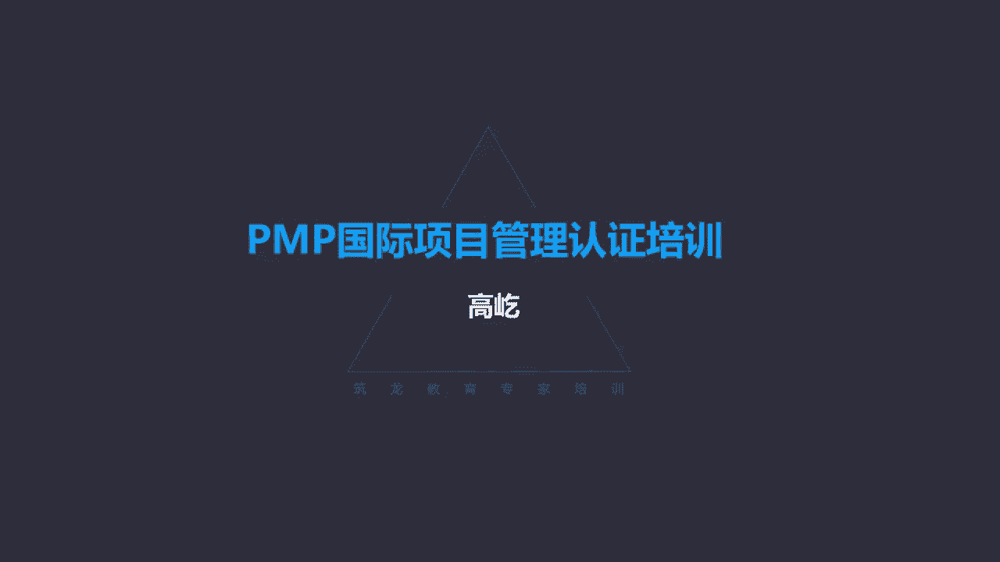
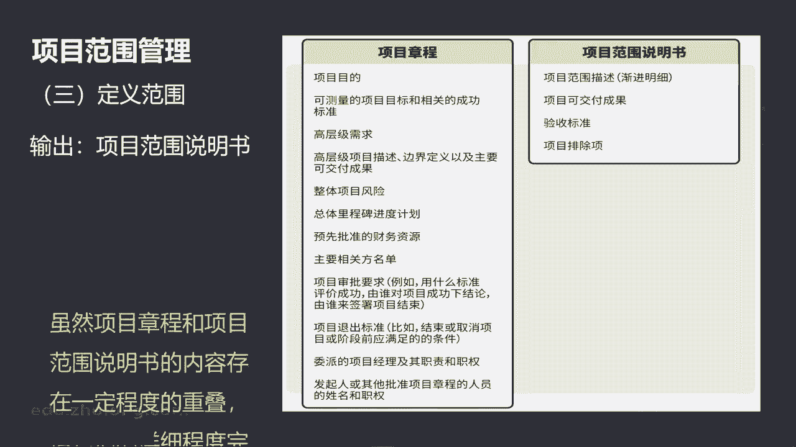

# K003-PMP项目管理认证培训 - P11：11.项目范围管理：范围说明书和WBS结构 ▲ - 与君共造价 - BV1eu4nerEJF

第三个过程叫定义范围，定义范围啊，这样一个过程，制定项目和产品详细描述的过程啊，作用就是描述产品复货成果的边界，包括验收标准，定义范围，这里面有明确的范围了，我们要得到一个叫范围说明书，哎。

范围说明书里面是详细记录具体的产品范围，项目范围，前面在规划范围管理里面，我们得到的那个范围管理计划，看那里没有范围，没有具体的范围，具体范围在哪呢，定义范围过程输出的范围说明书。

这里面是完整详细的具体范围了，那么在迭代型生命周期的时候，我们可能先给项目确定一个高层级的啊，叫一个愿景吧，或者叫一个高层级的目标，在每次针对一个迭代周期来详细确定范围。

这跟敏捷管理每次在迭代前才明确的规划，这个迭代周期需要做的具体工作内容，这是类似的，那么随着当代那当前迭代周期的项目范围，成果的这样一个推进，我们获得了更多的信息。

我们再来进行下一个迭代期的一个工作规划，这是迭代型生命周期它的一个特点，定义范围过程有这样的输入工具技术，还有输出这个过程最重要的一个概念，或者叫考点，就是他输出的范围说明书，输出的范围。

说明书里面记录些什么呢，包括项目范围啊，包括主要可交付成果的描述，还有制约条件，制约呃，假设条件和制约因素，你注意它记录了整个范围，那么这里范围就既包括产品范围，也包括项目范围。

而且是详细地描述了项目的可交付成果，这个对成果的描述就不是高层次的啊，不是概述了高层次达成的一致共识，唉这个信息记录在哪呢，关于可交付成果的高层次共识，这还记得吗，咱们前面讲的那叫项目章程。

项目章程里面也有关于主要可交付成果的描述，但那个是高层次的共识，而范围说明书这是详细描述了可交付成果哎，这会儿再达成的共识，这就是具体的内容了，所以这里边既要明确指出哪些是该干的。

同时还要指出哪些是不该干的，也就是我们说的叫除外责任，那么为了让团队能够进行更详细的规划，定义范围说明呃，项目的范围说明书，能够在评价变更的时候提供一个明确的叫基准，刚才我们讲的收集需求过程。

得到的那个成果叫叫需求跟踪矩阵，需求跟踪矩阵，那个在评价范围变更时候提供的叫什么作用呢，叫框架唉，框架作用，因为它只是最底层最基础的需求，而涉及到具体的范围发生改变。

我们应该用范围说明书作为评估的一个基准，这个两个区别大家注意，那么范围说明书的内容，这是考试里面经常可能涉及到的，我们要知道啊，这里面都记录什么呢，唉有产品范围的描述，有项目范围的描述。

包括可交付成果唉，验收标准，制约因素，假设条件，还有除外责任，这些都记录在项目的范围说明书里面，那我们发现项目的范围说明书跟项目章程，这里面确实有些内容是相同相似的，甚至有些重叠。

但是啊他们这种详细程度是完全不同的。

咱们前面说了，项目章程什么时候编制的呀，刚刚开始项目工作刚刚启动的时候，我们编制这样一个文件，它标志着项目正式开始了，所以那个时候项目的早期信息不足，对产品对服务的成果的理解。

包括对他的描述不可能特别的准确完整，所以说那是达成重要相关方高层次的共识，而范围说明书呢，这个时候我们要详细严谨的规划了，描述出具体的产品范围，具体的成果描述等等，这时候再与相关方达成了共识一致。

这就是具体严谨的，所以啊跟章程完全不一样好，那么下面的这个过程啊，第四部分就是创建工作分解结构，我们有了范围说明书了，哎接下来我们还要创建WBS，我们先看这样一个照片，各位您能看出来吗。

这是个什么东西啊，没错这是个汽车唉这确实是个汽车，但是这个汽车别的地方咱们一般可看不到，这是我去这个嗯，广州的花都东风日产公司啊，在他们的展厅里面看到我自己用手机拍下来的，这是一辆完整的天籁汽车。

天籁为什么叫完整啊，这辆车一个零部件都不缺，就是一辆完整的整车，但是它的表现形式很奇怪哈，他把这辆车拆分了，完整的拆分了，那我们看到这辆车，它所有的零部件按照它所在的位置，一个一个的把它悬挂起来了。

照片里面这上面啊，这个有点模糊的一根一根的细线，这是什么呀，这是一根一根的细钢丝，超过了7000根的细钢丝，悬挂起了3300多个零部件，这是一个展品啊，固定的展品，这不能移动了。

它有个特别好听的名字叫天马行空，如果有机会哈，未来您要到那去看看的话，你能看到哎这个天马行空哎，第一次看到整个汽车内部什么样子，这确实对我来说也很震撼啊，我也不是汽车行业的，咱是个外行啊。

第一次看到发动机里边什么样充分解体了啊，我第一次看到变速箱里边这个齿轮，又一个一个亮晶晶的，真的很好看，换个角度哎，我又拍了一张照片，为什么专门在这个角度拍呢，这个门拉手这个位置有点出乎我意料。

你看咱们车门上那个拉手多简单呀，可是没想到把它拆分出来以后，出了这么多的东西，由我们能够看到手摸到这个拉手，有密封的橡胶垫，有传动的电机马达，还有各种导线，我一大堆全都在这挂着，单摆浮歌。

每个零部件都悬挂起来了，车钥匙比较轻啊，一根钢丝在那挂着呢，唉蓄电池比较沉，这是四根钢丝悬挂着，全都挂在天花板上，那这确实看着挺震撼的，绕着他走了两圈，哎我发现这汽车虽然我不懂，虽然我不是汽车行业。

咱是外行哈，可是我发现这里面也有一些零件，我是懂的，哎我理解我看明白了，不但说我懂这个零件我还做过呢，哎我怎么还有机会做汽车零件呢，这可能跟我这上学的经历有关，我上的是工科院校。

我们在大一的时候有这么一门课，两周的时间叫金工实习，我估计各位啊，可能您也有这个经历，精工实习，这两周时间我们要把车模洗爆前，哎机加工的这套流程啊，这些个工序我们都要体验一遍，有的还要自己动手做。

特别是这个课还要考试的，怎么考啊，哎我们两个人一组，两个人一组发一块铁，又锯又锉，还得打孔，哎最后做个什么呀，没错，做个锤子，做个锤子头啊，我估计大家可能都做过哈，好多人都金融时期都是做个锤子头。

哎你别小看这小锤子头，他要求还很高的，他的尺寸精度啊，包括角度啊等等的，这也不那么好做啊，难得呀，我们哪个同学心灵手巧，我这人做的是真好啊，这得打分啊，我们都偷偷拿这个找老师打分。

反正上来不签名哈啊老师这是我们做的，老师这是我们做的，其实老师也是睁一眼闭一眼，后来实在受不了了，得换一个啊，这锤子我见六回了，哎你看当时在那个阶段呃，我们接触过各种机加工的设备。

我说我做过汽车零件的什么的，我做过呀，垫片我就做过啊，这个垫片最简单了，铁板铺好了，冲压机床，一按电钮康，当一个就冲压出来不到一秒钟，你看这个汽车确实很复杂，现代化大工业的产品，但是当他把它拆分以后。

把它拆分成零部件了，这时候我们发现它虽然很复杂，但是零部件的复杂程度大大降低了，这车我确实不懂，但是你这个零件这个垫片我懂啊，螺丝我懂啊，还有螺母削丁这些我清楚啊。

车上的螺丝螺母垫片销钉在生产制造行业哎，这类零件有一个统一的名字叫什么呢，叫标准件，标准件啊，他的这个标准化程度特别高，可以互换，这是国际通用的，有标准，有有规矩要求哎，借这个天马行空，我们说明什么呢。

车虽然复杂，但是当把它拆分成零部件的时候，它的每个零件的复杂程度大大降低了，因此啊借天马行空，我们引出了项目管理过程中最重要的工具，或者说最重要的内容吧，就是工作分解结构，什么是工作分解结构呢。

把项目的成果，还有项目工作拆分，把它分解成更小的，更易于管理的组建的这样一个过程，这就是工作分解结构，那么工作分解结构哎，它的特点自上而下层级展开，它最上面是需要完成的工作或者叫目标，通过他的完整分解。

最终他表达了项目的总范围，以天马行空为例，把它分解成了所有的零部件，但是这些个零部件如果组合起来，我就能得到一辆完整的天籁汽车，一个零件也不多，一个零件也不少，所以工作分解结构来组织。

并且定义了项目的总范围，那么它也代表着经过批准的当前范围，说明书中所规定的工作，那么这有个问题了，我们工作分解结构代表了项目的总范围，而刚才我们说的那个范围说明书，它也代表了项目的总范围啊。

嗯详细严谨准确地描述了范围啊，有产品范围，有项目范围，可交付成果啊，制约因素，假设条件，验收标准除外，责任你看这些内容也是很严谨很全面的，既然有了范围说明书了，那我们为什么还要再做一个工作分解结构呢。

哎目的在于这两样，他们的作用不同，应用的场景不一样，什么时候我们会用范围说明书呢，当范围发生了改动，或者说客户提出了变更要求，我们要来判断，来确定这个范围到底是不是发生了调整啊。

作为范围变更的一个依据的时候作为基准判断，我们要用这种更严谨，更准确的文字版的范围说明书，那什么时候用工作分解结构呢，工作分解结构，因为它的形式啊相对更加的简洁，更加的清晰明确，可能是树形图的方式。

从上到下层层展开，也可能是这种列表的方式啊，逐层的对范围进行分解，它看起来更加的清晰，更加的直观，所以我们工作，我们项目团队在工作过程中，我们会把工作分解结构作为一个工具来使用。

所以啊这是给我们团队自己工作中来提醒我们，或者作为一个范围来评判的一个边界，一个依据来使用的，所以团队自己使用工作分解结构用的会更多，简洁清晰，一目了，然而当我们要把它当作一个评判范围。

是否发生改变的依据的时候，我们就要用更严谨的文字版的范围说明书了，那么在工作分解结构最底层哎，最底层的组成部分有个专有名词，我们一定要记住叫工作包。

这里的工作包英文直译过来的就叫work package，就是工作包，那么这个最底层的才叫工作包，最上面的叫目标或者叫待分解的成果，中间这些呢啊，中间那些总的来说没有具体的名称了。

我们统一把它叫做工作分解结构的组成部分，工作分解结构最底层叫工作包，那么这里面包括着说计划完成的工作，也就是需要完成的一个一个的零部件，像天马行空的每个汽车零件一样，这就是工作包了，最底层不能再分解了。

也不需要再分解了，但是书上这还特意强调这样一个描述哈，说在工作分解结构这个词语里面，它虽然叫工作分解结构，但是这里面的工作它指的是什么呢，作为活动结果的工作产品或者可交付成果，而不是活动本身。

什么意思呢，工作分解结构最底层的工作包，就类似于这个天马行空，每一个被分解出来的零部件，工作包是什么呀，工作包就是零部件每一个零件，而不是这个零件的制造过程，这个垫片，这是汽车一个零件，这是一个工作包。

工作包描述的是垫片，它本身，而不是说怎么得到这个垫片，我怎么备料，怎么冲压啊，怎么去打磨，然后怎么检测，合格了，一个垫片生产出来了，哎那个活动那个活动是什么呢，是我们后面在进度管理知识领域。

那个时候我们的工作包进一步拆分，我们得到的具体活动，而现在在创建工作分解结构这个过程里面，最底层的就叫工作包了，这个工作包虽然叫工作分解结构，但是这里的工作指的是成果，这您记住。

所以工作包理论上都应该是名词，你就想想这个天马行空，这辆被分解的天籁车，每个被拆分的零件，这就是工作包，所以工作包对应的都应该是名词，这是理论上的哎，这个过程这个过程中最重要的工具就是分解，通过分解。

我们把每个成果都分解成了，叫最基本的组成部分，最基本的组成部分，工作分解结构的最底层就是工作包，那么分解有什么用呢，哎化繁为简，化整为零，什么叫化繁为简呢，目标任务非常的复杂，你说你怎么做，从哪开始做。

这个不太好说，通过分解把它拆分为简单的零部件了，就像天籁车很复杂，你怎么做出来呀，这说不好，但是我把它拆分成零件了，它的复杂程度大大的降低了，车虽然我做不出来，但是这个零件我是能做出来的。

如果把这些个相对简单的零部件，一个一个的都完成，那么上面最复杂的这辆车理论上我们就得到了，所以这叫化繁为简，让工作简化了，再有一个呢叫化整为零，整体的复杂性高啊，天籁车完整的天籁车怎么做出来。

别说咱不是一个行业的，您就是汽车行业的，我估计也很难说准确，说完整太复杂了，那么通过必要的分解，我们把它拆分成工作包层面了，它从一个复杂的整体变成了哎零部件的集合，但是工作分解结构又有这个特点。

它代表了完整的范围边界，所以我可以用这些所有工作包的集合，来代表这个复杂的范围目标，因此啊通过这样的方式能让工作变得清晰，把复杂的工作变成简单要素的集合，便于工作开展了，所以分解的作用一个叫化繁为简。

一个叫化整为零，而在敏捷的方法里面啊，他也是用分解的手段说，将长篇故事分解成用户故事，还是啊关于敏捷的概念，我们留到后面单独有一个章节再给您详细介绍，那通过工作分解结构这种较低层次的组建完成。

来满足上一层的需要，我们把这个叫做叫百分之百原则，也就是一个工作分解既充分且必要，分解出来的要素集合，成果要充分的，而且呢还是必要的，也就是既不多也不少，分解的原则来，不同的成果可以分解到不同的层次。

我们对具体的层次没有明确的要求，说只有分解到五层才达到工作包，或者分解到八层才到工作包吗，不一定，这是由成果本身的复杂程度决定的，成果越复杂，分解的层次可能就越多，哎这个成果本身相对简单。

那么它分解的层次也会相对减少，唉所以不同的成果可以分解到不同的分解层次，那么工作分解结构在创建的时候，也不一定一次性充分，百分之百的都完成，那些个在时间上比较靠后的工作内容。

那比如说现在项目在启动的这个过程中哎，启动阶段，那么我们就应该把当前启动阶段，需要完成的工作做一个充分的分解，达到工作包，那至于说半年以后这个项目要验收了，验收的时候，我们需要完成什么工作内容，唉。

那些活动我们暂时可以先不分解工作，分解结构保持在较高层次就行了，什么时候分解呢，临近验收了，快验收的时候，我们再把验收环节需要完成的工作内容，做一个充分分解啊，这个方式又叫滚动式规划，也叫渐进明细。

这是工作分解结构的一个方法，也是它的一个重要原则，那么书上给出了这样两个，具体的工作分解结构的例子啊，一个软件产品，还有一个呢一个飞机系统，所以工作分解结构应用范围非常广，泛。

各个行业领域里面都可以使用到，工作分解结构有个原则，在分解的时候不需要过细分解，我把它分解的更仔细啊，这个颗粒度越小，这不是越简单吗，但是如果过细的分解了，可能会造成说管理的这种叫无效耗费。

工作分解也不是简单的过程，不是拍拍脑袋就可以得到的，他也要我们投入必要的资源，消耗精力，所以过多过细的分解还可能导致效率降低，没有必要适可而止，满足要求就可以了，那么另外工作分解结构的另一个原则叫。

百分之百原则，刚才咱们提到了，我们分解的过程要保证既充分且必要，既不多余，也不能缺少，不能遗漏，比如题目里面说项目执行过程中，团队发现有一些测试任务被遗漏了，这个测试任务必须要得到完成。

后面的工作才能继续，结果呢，由此项目延期了，那么问什么原因是项目延期呃，什么是导致项目延期的根本原因，什么原因呢，没有满足百分之百原则，因为题目里说了，做到一半，做到中途的时候。

发现有些测试任务被遗忘了，那说明我们做工作分解结构的时候不充分了，这里面有工作遗漏了，那么遗漏了就没有满足百分之百原则哎，百分之百既不多也不少，要保证工作分解结构。

这个工作包的集合代表完整的项目的范围哎，这是工作分解结构的另一个一个原则，那么在输出得到的就叫范围基准，创建工作分解结构输出的范围基准，范围基准有点特殊，它不是一个内容，它是三部分构成的。

这里面包括被批准的范围说明书，工作分解结构，还有相应的工作分解结构词典，什么是工作分解结构词典，我们一会就会看到这三样都要得到批准，才能形成范围基准，被谁批准呢，那当然是被领导，被客户，被发起人唉。

这些重要的相关方得到他们认可了，确定下来，形成了范围基准，那么一旦行程基准了，咱们前面讲过行程基准了，能不能改呢，可以改，基准可以调整，但是要想调整，必须要通过严格规范的变更流程唉，那个复杂的变更流程。

通过它才能进行调整的，所以有了范围基准了，再有变更必须走流程哎，范围基准也是项目管理计划的组成部分之一，里面一共有三个基准，除了范围，还有进度基准和成本基准，我们后面会看到，那么书上啊。

还单独又给出一个叫规划包的概念啊，这个特别注意一下，规划包实际没有更多实际的意义啊，书上说了，就是工作工作包，以上层面的工作分解结构的一个组成部分，叫做规划包，规划包再分解分解出来就叫工作包了。

您记住最底层叫工作包就可以了，那么这个得到的叫工作分解结构词典，什么是工作分解结构词典呢，它是对工作包的一个详细说明，你看它的内容啊，这里包括唉账户编码标识啊，什么工作的描述，假设条件制约因素。

还有负责的组织啊，相关的进度，里程碑所需的资源质量要求，验收标准等等，这个指的是每一个工作包具体应该怎么来完成，唉，工作分解结构词典是对工作包的详细说明，为什么叫词典呢，因为啊它的内容。

它的特点跟词典很接近，什么时候咱们会查词典呢，这个词我不知道什么意思了，或者说这个字我不知道该怎么念了，我翻翻词典吧，我查查字典，那么工作分解结构词典什么时候用呢，这是告诉团队成员。

具体的工作包应该怎么来完成，这个词典有个好处，你看他通过提前的规划，明确下了这个工作包的具体获得过程，也就是让这个工作内容变得规范了，明确下来了，那么这样你要对这个工作包内容有疑问了，你甭问项目经理了。

哎你别问我，你干嘛去啊，你查词典去，你去看看工作分解结构词典是怎么写的，那里面怎么写的，你怎么做就行了，他让工作包任务变得具体了，变得清晰，而且规范了，不管什么人，你都按照这个规范来完成。

那么这有助于工作的这个规范推进，所以啊工作分解结构词典，对于工作的执行特别有帮助，起到一个很好的指导作用，另外它的形式它的样子也很像词典，你看词典一般都很厚的，一本工作分解结构词典呢。

哎原则上也应该很厚的，你看一个简单的项目，可能就会分解出几十个工作包，复杂的项目可能成百上千甚至上万个工作包，每个工作包的描述不用多一页纸，那把它加起来那几十上百上千上万页，那真是一本厚厚的词典子。

所以啊工作分解结构词典，通过对每个工作包的具体描述，能够让具体的工作过程变得清晰，变得规范，有助于工作活动的落地执行，它也是范围基准的一部分，另外范围基准里面还有一个概念叫控制账户，什么是控制账户呢。

各位想想，一提到账户，您首先想到的是什么呢，是钱对吧，账户吗，当然跟钱相关没错，控制账户哎，注意啊，它是一种叫管理控制点，它是个虚拟的存在，控制账户并不是工作分解结构的实体的一部分。

并不是说我做工作分解结构从上到下分解分解，来分解到某个阶段了，得到的这个阶段的成果，这个就叫控制账户，没有控制账户，是借助工作分解结构，进行成本绩效管理的一种控制点，它的特点它是在工作包以上的位置啊。

它来确定哪个具体的工作包所花出的钱，他的成本归口应该怎么算，也就是哪个公德包花了钱了，这笔钱应该算到谁的头上，比如说研发部门完成了两个工作包，那这两个工作包花的钱，比如说花了1万块钱。

这1万块钱就应该计入研发部门的成本账户上，另外两个工作包是市场部门花的，花了2万块钱，那么这2万就要算到市场部门的账户上，这就是控制账户，所以每个控制账户可以包括一到多个工作包。

但是每个工作包只能属于一个控制账户，这个概念很好理解，谁花的钱就算到谁的账上，每个人只能有一个账户。

