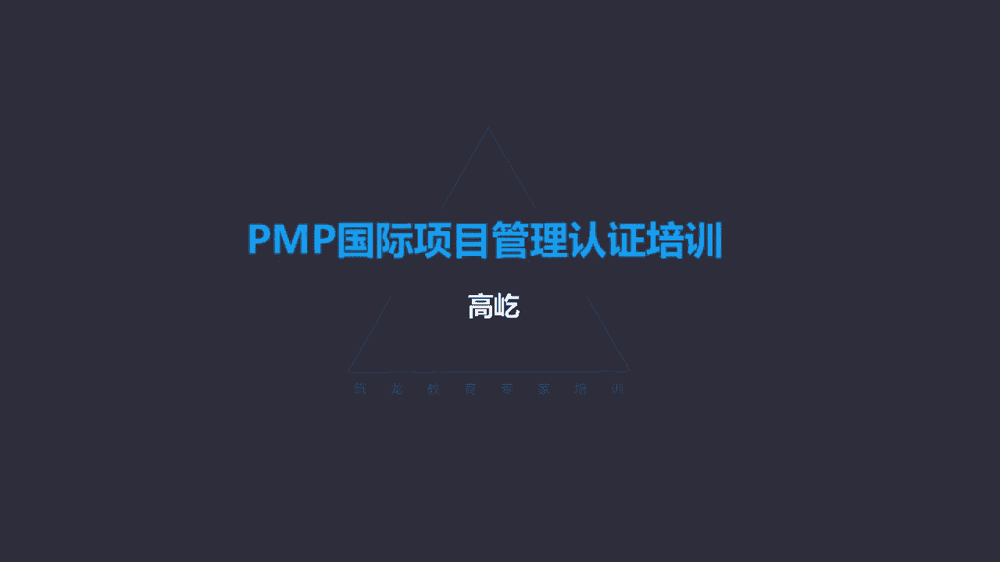

# K003-PMP项目管理认证培训 - P18：18.项目成本管理：如何规划成本管理？ ▲ - 与君共造价 - BV1eu4nerEJF

项目成本管理，成本管理的本质啊就是管钱啊，所以啊他就是要确保项目在批准的预算内完工，不能超支，那么哪些成本需要关注呢，一方面为了完成活动所需要的资源唉，人力资源呀，物品资源呀，资源的成本。

另外呢关于产品服务或成果的使用成本，维护成本，还有支持成本唉，这些都可能影响项目的预算啊，那我们管好成本，就是要确保被批准的预算，在项目的过程中能够得到充分的应用，并且呢不超支。

唉这是成本管理的一个核心概念，对于敏捷型或叫适应型的这样的项目哎，那么因为它的范围是很难一次性确定的，并且过程中还经常会发生一些改变，那显然过细的这种成本规划，那没有太大的意义。

所以通常啊叫轻量级估算的办法，轻量级也就是大致的估算啊，产生一种叫高层次的预测，出现变更的时候呢，我们在随时的调整，而实际上敏捷哎这套管理办法呀，最早是应用于开发过程的，所以啊在成本管理过程里面。

敏捷没有特别明确的一些具体的方法工具好，那我们接下来看一些成本的补充概念哎，这些书上啊，项目管理知识体系指南里面并没有明确的记录，或者呢呃一句带呃，一句带过，没有详细的介绍，我们这把它简单的再再说一下。

考试里面如果出现了，我们要知道是什么意思，比如直接成本，直接成本，那就是项目工作引起的成本，直接用于项目工作本身的，为了项目工作发生的差旅费，项目团队成员的工资。

包括为了完成项目工作采购的这种物料的费用，这都属于项目的直接成本，有直接就有间接，那么间接成本呢，企业一般管理人员的工资税金，比如那些平台部门，财务啊，办公室啊，包括我们办公场地的租金费用，水电费。

通信费，大家需要均摊的，这都属于项目的间接成本，那么还有一个概念呢叫机会成本，什么是机会成本呢，当出现项目需要选择的时候，就会出现机会成本，同时有两个项目可以做A项目，如果做A项目了。

我们可以盈利100万元，如果做B项目呢，可以盈利80万元，但是我们的这个资源有限，我们的精力能力有限，我们只能选择其中一个来做，那我们应该优选哪个呢，唉显然应该做那个哎，预期能获得更大收益的项目。

应该做A项目，也就是我要挣，那100万，因为我们做了A项目就不能再做B项目了，那个我们选择了A而为我们放弃的那个B项目，B项目预期可能盈利的那80万，这就叫机会成本。

所以说如果选择了一个项目而放弃另一个项目，那个被放弃项目的可能收益，我们就叫机会成本，大家记住这个概念，下面呢叫沉没成本，沉没成本好理解，沉没了，沉底儿了，要不回来了。

所以啊那些已经发生的已经支出的成本支出了，要不回来了，那么对项目的选择是否投资不再产生收益了，已经是过去时了，唉这些花出去的钱，我们就叫做沉没成本，还有一种叫固定成本，固定成本既然叫固定的。

那就不是反复发生的，比如嗯咱们项目过程中，比如一些固定资产，办公用具啊，办公的家具，办公用的一些器材，一些仪表工具，也不可能每做一个项目，我们就采购一套，所以不是反复发生的，成本不随着产量工作量变化的。

这就叫固定成本，有固定的，那就有可变的可变成本，那就要随着产量工作量而发生变化了，比如生产一天就要消耗一天的电费，那今天不开工，机器没有运转，这个电费就没有支出，那这里边的用于机器设备的电费。

这就属于可变成本，哎，这是一些成本的补充概念，那么再有现值，这是财务上的概念了，什么是现值呢，就是未来的钱在今天的价值，大家可以想一下未来的钱在今天的价值，这是个什么意思呢。

哎比如说10年以后的100块钱放在今天，那你想想这10年以后的100块钱，和今天的100块钱相比，哪个更值钱呢，啊或者说哪个100块钱的购买力会更强呢，那显然是当下哎。

今天的100块钱一定比10年后的100块钱唉，相对更值钱，因为这个钱有一个贬值的过程，通货膨胀，其实啊我们想以后的事不好想，我们可以想想以前的哎时间段，咱们平移一下。

你看今天的100块钱跟10年前的100块钱，您觉得哪个购买力更强呢，那一定是10年前，10年前100块钱，觉得那还是个钱是吧，还能买点东西，放到今天这100块钱，说实话你买不了什么了。

这钱呐这个贬值这个趋势没有办法改变，所以现值就是未来的钱在今天的价值，用今天的价值来衡量10年以后的钱，比如说10年以后的100块钱，用今天一衡量的话，也许也许只值80块钱了，甚至更少吧，这就是限制。

那么另一个概念呢叫净现值，净现值，什么叫净现值啊，用收入的现值减去支出的现值，这个得到的就叫净现值，收入收入减支出是什么呀，是利润，所以啊我们用净现值来表达这个项目的收益，他的利润。

那么这个概念咱们考试里面有什么机会遇到，或者应该怎么应用呢，主要是用于选择项目，两个不同的项目，A项目预计它的净现值，比如说300万，B项目它的净现值200万，那么应该优先选哪个项目做呀。

显然选那个净现值大的利润越高越值得做，所以在选择项目的时候，如果出现了净现值的概念，您记住，一定选择那个数大的，净现值越高，这样的项目越值得做，应该优先选择，下面的概念叫投资回收期。

投资回收期这个好理解啊，投资投出去了，那么把所有的投资额度收回来，这个时间段这就叫投资回收期，比如说我投了100万，投资100万用于生产建设，那么建设过程用了两年的时间。

接下来呢每年可以收回20万的投资，问投资回收期是几年，你想一想啊，哎我投了100万，建设用了两年，两年后建成投产了，每年可以盈利20万，那么几年完成这样一个投资回收呢，或者说投资回收期是几年呢。

是5年还是7年呢，哎应该是7年，注意应该是7年，投资回收期，它包括建设时间，唉，其实这个好理解，投资回收期嘛，我只要把钱花出去，我开始花钱了，就开始计时了，所以就算你不盈利，你是建设周期唉。

前面那两年建设时间是不盈利的，但是我已经投资了，你是用我的投资来完成的建设，所以这时候就应该计时，要计入他的投资回收期了，两年后建成，每年盈利20万啊，5年这100万回来了，这5年不算。

还要加上前面那两年的建设周期，所以投资回收期应该是7年，所以您记住这样一个特点啊，投资回收期包括前面的建设时间，下面的概念叫内部报酬率，内部报酬率啊，当然一看这个报酬率，那显然这个比率应该是越大越好。

两个项目，一个项目的内部报酬率，比如百分之百分之20，另一个呢15%嗯，那我们一定优先选择，那个20%的项目去做，所以啊内部报酬率越大越好，另一方面，内部报酬率啊这样一个指标有个特点。

它能体现项目抵御风险的能力，换句话说内部报酬率越高，这个项目抵御风险的能力就越强，因此如果题目里面出现这样的一个表达来说，比如说项目经理，项目经理的领导啊，对风险特别的敏感。

他要求项目经理在选择项目的时候，一定要充分考虑风险的影响，那么项目经理应该优先考虑，用什么样的指标来衡量选择项目呢，嗯是净现值啊，是投资回收期呀，还是内部报酬率呢，当然这时候应该选择内部报酬率。

因为内部报酬率这样一个指标，它就能够体现项目抵御风险的能力，内部报酬率越大，地域风险能力就越强，当然具体为什么怎么他就能抵御风险了，这个咱不用深究了，在项目管理考试里面，如果涉及到的话。

仅仅涉及到这一点皮毛，您知道内部报酬率越大越好，内部报酬率能够体现抵御风险能力，这就够了，所以啊啊这是内部报酬率的这样一个概念啊，注意额，如果需要选择项目的时候，选择大的，下面要补充的概念叫学习曲线。

学习曲线其实特别简单，也就是说一件事重复做的时候，那么完成这件事情的时间就会缩短，业绩呢也会有一定的提高，这个事情其实特别好理解，为什么重复做他的时间就短了，业绩能提高啊，熟练了吗，我第一次做不熟练。

我可能用的时间就会比较多，好随后我再做这件事，再做这件事，越做越熟练了，那当然时间就会大大的缩短，那当然你的业绩也会有所提升，所以啊随着事情呢不断被重复，那么完成的时间会有缩短，而且呢业绩会得到提升。

这样一种表现我们就叫做学习曲线，下一个概念叫收入递减规律，咱们前面介绍过了，也叫收益递减规律，也就是随着你投入的增加，产出的幅度会越来越小，当投入再增加的时候，达到某个临界值了，产出的增加幅度变为零了。

不再增加了，你要继续投入资源呢，它的产出反而会减少，这叫收入递减规律，哎咱们前面在时间管理的时候啊，进度管理章节里面提到过这个概念，应该回忆一下好，那接下来我们看看第一个过程，就是规划成本管理。

每个知识领域第一个过程都类似，都是规划范围管理，就是规划范围，进度管理，就是规划进度，现在到成本管理了，那就是规划成本管理，规划成本管理干什么呢，确定如何估算预算，包括管理监督，还有控制项目的成本。

在整个项目期间，要为如何管理成本提供指南方向，哎又出现了啊，指南方向什么意思啊，高层级的唉，高层级的政策性指导性的文件，所以规划成本过程很简单，一定的输入，通过工具技术加工输出的是成本管理计划。

哎我们看看成本管理计划里面记录些什么，成本管理计划也是项目管理计划的一个子计划，描述如何规划安排，还有控制成本，你看这里边，它规定它记录的计量单位是人民币呀，是美元呀，还是日元呀。

它的精确度准确度是万元为单位，还是百万元为单位呀，还有控制临界值，超支超过了1万块钱，就要马上采取措施，还是超支，只要不超过10万块钱，都认为是可接受的，包括报告的格式，用什么样的格式。

是文字数字的方式，还是用图形表格的方式来汇报成本的状况，包括一些成本管理的其他细节，唉我们发现了在成本管理计划里面，并没有明确的告诉我们能花多少钱，该花多少钱，工作到什么时候了，还有多少钱。

还能还能用多少钱，你看真正与钱与成本相关的信息，在成本管理计划里面我们是看不到的，所以成本管理计划，继续服从我们之前讲过的规律，成本管理计划里没有成本，有的是什么呀，有的是如何管理成本的原则。

政策是高层级的，是方向指南好了，有了这种高层级的方向指南，有了相对明确的政策要求了，那我们就要正式的开始成本的管理了，唉下一个过程叫估算成本，估算成本，这是对完成项目工作所需要的资源成本。

做近似估算的这样一个过程，我得先明确的知道为了完成这个工作，我要花多少钱，或者说多少钱能够完成这个工作，哎所以估算成本，它的主要作用就是要确定项目所需要的资金，我们在确定项目所需资金的时候。

这个项目工作开始了吗，没用哎，项目工作并没有开始，在项目工作开始之前，我们就要提前明确哎这个项目啊需要多少钱，需要多少资金，那当然既然你是估算的，你要明确的知道需要多少钱，那你估算的这个内容啊。

一定是一个可以量化评估的结果，我要好多钱，我用我我用一点钱就行了，这不叫估算，一定要量化下来到底需要多少钱，所以它是一个预测，预测成本，这个工作现在并没有开展，那么这个预测的工作估算成本谁来做的呢。

谁来完成估算呢，项目经理和团队注意啊，很多同学一到这时候谁干这个事啊，项目经理您别把团队给忘了，在项目管理过程中，大量的工作谁来完成啊，项目经理和团队都是项目经理和团队，不要把团队忘掉。

那么既然是项目经理跟团队，我们自己完成的估算，那得到的是什么结果呢，那得到的一个可能所需资源的量化的成本信息，既然是项目经理和团队做的，所以这个钱就算量化下来了，比如我认为要完成这个项目需要100万。

我们算出来了需要100万，那么这100万是不是真的就是你能花的钱呢，不是啊，不是说你你想要多少钱就有多少钱，我们根据自己的经验，我们用各种工具方法，我们估算出一个相对准确的一个量化的结果。

但是这个结果是想花的钱，注意我们估算得到的结果，它的特点啊，他是想花的钱，因为是我们项目经理跟团队，我们自己算出来的，我们认为要想完成这个项目工作，需要这么多钱，那什么才是我们能花的钱呢。

预算经过领导批准以后变成了预算，才是我们能花的钱，所以现在估算成本过程，是要得到一个想花的钱的过程，在启动阶段，项目刚一开始，我们能够得到的叫粗略量级估算，粗略量级估算它的特点，你看他都明确告诉你了。

就是粗略的大致的，所以说它的区间是多少呢，负25%到正75%，这怎么理解呀，什么叫负25%到正75%啊，哎如果用零点作为一个真实的成本需求的话，比如说这个项目就是需要100万。

理论上这个项目100万可以完成，那我们自己粗略量级估算，我们认为大致需要多少呢，啊75万到175万之间，这就是负25%到正75%，这个百分比是相对于完成这个工作，真正需要的钱，因为是启动阶段嘛。

项目的早期，所以啊这个估算过程可能不是特别的准确，那么之后随着信息越来越详细，咱不能满足于粗略量级估算呀，我们还让它更准确哎，最后得到的叫确定性估算，到确定性估算了，那这个区间就变小了。

负5%到正10%了，从这两个百分比的区间来看呀，这个项目管理知识体系，这套理论确实在不断的更新，因为在以前的版本里面，之前这个区间分别是多少呢，粗略量级估算叫正负50%，确定性估算是正负10%。

这看起来特别对称哈，左右对称，这也好记，但是不合理哎，他有不合理的地方，大家可以想一想哎，我们在跟领导要钱的时候，我们通常会多要还是会少要呢，一般情况下我们会多要一些宽打窄用嘛是吧，万一钱不够了呢。

所以啊我们通常都会多要，有没有可能是药少了呢，也有可能，但是那种情况不多，所以啊你写个正负50%，正负10%，虽然看起来挺好看，左右对称，但是不合理，我们多数情况下是倾向于多要。

少数的时候我们确实自己考虑不周，也可能要少了啊，正常情况都会多要一些，所以咱们第六版，你看这个区间更准确，更合理了，负25%，正75%，多数情况会倾向于多要，就算到确定性估算了，还是负5%到正10%。

比较准确的预估了，还是倾向于多要哎，多要一些比这个少要的这个比例要高，虽然说区间偏了啊，记起来相对可能也稍微麻烦一点，看起来没有那么完美了，但是更合理了，这是估算成本我们得到的一个区间。

那么这个过程里面，主要的考点概念还是在工具技术，这些估算的工具，咱们在进度管理里面基本都见过了，哎，类比估算，用过去类似的项目来得到当前我们需要的结果，咱们说过这个结果不用算，不是算出来的，哎。

这是直接把结果拿过来用，所以呢他可以快速得到什么时候用啊，项目的早期信息有限，信息不足的时候啊，特别时间在相对短的时间内要得到结果的时候，我们要用类比估算精度不一定太高，但是什么时候精度就高了呢。

用于类比的项目要本质相似，提供估算的人要有专业知识，类比估算就是可靠的，下面的参数估算咱们也见过了，这个是实打实算出来的，但是虽然是算出来的，不代表天然准确，唉要保证参数模型准确。

还有呢用于计算的数据要准确，满足这两个条件了，参数估算才是准确的，那么下面自下而上估算唉，这个这个是针对每个工作包进行合理的预估，之后呢，把各个工作包估算的结果汇总哎，向上滚动。

最终得到一个总的需要的成本哎，这个自下而上估算理论上它是相对更准确的，因为每个工作包活动啊，它的规模相对更小，更易于管理，易于掌握，所以对工作包的估算呀准确性相对会更高，每个工作包都能够相对准确的预估。

那么得到的结果来它的准确性也会越好，所以如果题目里面提到了，为了获得更准确的估算结果，优先选择自下而上估算三点估算，咱们也讲过，考虑不确定性和风险的时候，优先用三点估算法，如果题目里面看到了最悲观。

最乐观，最可能或者最大最小中间值啊，最多最少，通常类似这样的描述，我们就要考虑用三点估算两个公式，一个贝塔分布的除以六的公式，一个三角分布的除以三的公式，如果考试里面出现了默认默认选择贝塔分布。

就是这个除以六的公式，那么另外储备分析，储备分析在进度管理里面也提到过，他的意思是，为了应对项目过程中可能出现的风险，我们要提前留出一些必要的储备，这种储备应对的风险有两种，一种，一种是应急储备。

一种是管理储备，那么这里面储备分析，特别是应急储备，应急储备针对已经识别的叫已知的未知风险，这一类应急储备应该属于成本基准的一部分，那当然是成本基准的一部分，也就是项目整体资金需求的一部分。

成本基准包括资金需求，我们后面再详细给您介绍，这个时候输出估算成本过程，输出我们得到的叫成本估算，我们看到了成本估算里面包括什么呢，这里面有需要的成本，也就是为了完成这样一个工作。

我们认为正常情况下该花的钱，这是需要的成本，还有呢应对已识别风险的那个叫应急储备，成本估算里面要包括应急储备，我们要意识到，未来项目工作中可能出现什么样的风险，那么这个风险发生了，我们得有钱去应对。

这叫应急储备，另外呢注意还要包括应对计划外工作的，叫管理储备，储备分析包括两部分，应急储备和管理储备，应急储备是针对已经识别的风险，我们已经知道了未来可能发生这件事情，这件事情一旦发生。

会对我的工作造成不利影响，那么这个应对不利影响的这笔钱，我们就叫应急储备，因为这件事已经被提前识别了，但是它到底发生不发生，究竟什么时候发生，我们不能准确确定，所以这叫已知的未知。

那么还有呢计划外的工作，也就是未知的未知，既然是计划外的工作，唉这种风险完全无法预知，我们很难准确地确定，在未来这个事情究竟出现还是不出现啊，甚至说什么事情我们都不知道，无法提前预判。

但是就算不能预判这种事情，如果一旦真的发生了，那么我们的项目工作一定会受到影响，那怎么办呀，我们要解决，要应对呀，要花钱呀，唉应对这种未知的未知风险，这个储备我们叫管理储备啊，管理储备唉。

他在成本估算的时候就要考虑到了，这个特别要注意，后面我们还会详细的介绍到唉，管理储备谁说了算呀，领导说了算管理者嘛，所以叫管理储备，虽然是最后领导说了算的，但是我们在自己项目经理和团队。

我们自己在估算成本，我们在考虑想花的钱的时候，就要考虑到这一部分钱，那当然具体能不能花，这是在听领导的哎，我们自己要意识到，所以成本估算里面包括项目所需要的全部资源，所造成的成本。

直接的成本包括间接的成本等等，所以在成本估算过程中，项目经理跟团队我们自己算出来的，这个想花的钱里面，应该包括了所有可能用到的资金唉，既有该花的钱，也有应对风险的钱，既有针对已识别风险的钱。

