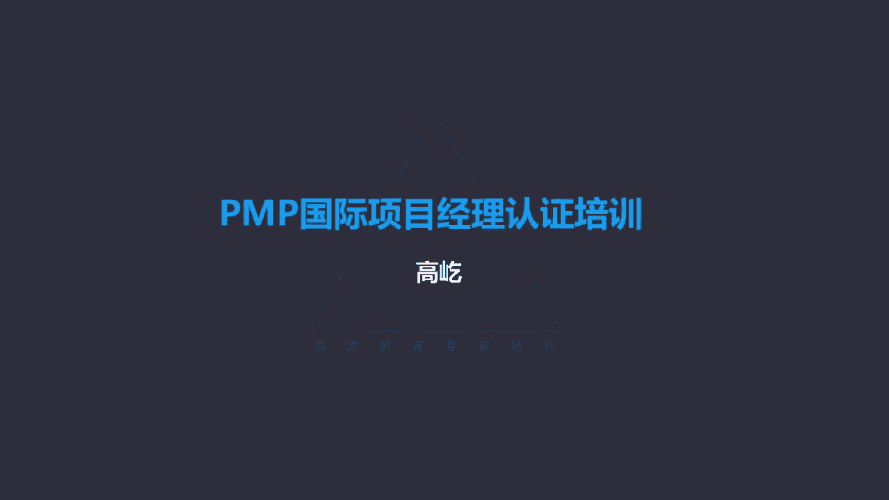

# K003-PMP项目管理认证培训 - P22：22.项目质量管理：如何规划质量管理？ ▲ - 与君共造价 - BV1eu4nerEJF

项目质量管理，质量管理唉，这里面我们强调了质量，既包括成果的质量，也包括项目管理唉，这个工作本身的质量，所以质量管理要兼顾这两方面，那么质量管理对所有的项目都是重要的，不管大项目还是小项目。

不管什么样的行业背景，质量管理对所有项目都适用，那么因为不同的项目有不同的背景，不同的行业，所以具体的一些质量测量的方法技术啊，这在各个行业领域里面是不一样的，但是呢他们的原则，他们的目的是相同的。

所以说不管什么样的项目，如果没有达到必要的质量，要求满足质量标准，那这样的结果都是不可接受的，所以质量管理的核心概念啊，最突出的就是质量偏低永远是个问题，只要质量低就是不可接受的。

但是跟质量类似的另一个概念呢是等级，等级低不一定是问题，质量低不可接受，但是等级如果低的话是可以被接受的，我们这里边举个例子，比如你看还是拿手机做例子哈，这是个苹果手机，苹果手机我们怎么给他定位呢。

它相对于就是一个高质量高等级的手机，高质量苹果手机确实没有出过什么明显的，重大的这种质量缺陷，它的质量是满足要求的，是好的哎，高质量水平，同时呢等级也是很高的，功能特别的强大是吧，设计又很时尚。

很多人特别喜欢果粉啊，所以苹果手机诶就是高等级高质量，那当然这是能够被接受的，那有没有高质量低等级的手机呢，也有你看这就是高质量低等级的手机，什么手机呀，老年机专门有这么一种手机啊。

你看现在大家都在用智能手机了哈，这老年机首先它不是智能机，他也不能上网，但是这个手机虽然连上网的功能都没有，但是它满足了老年人这个特定群体的需要，三大是吧，哎字也大，按键也大，还有什么呀，声音也大。

老年人嘛耳朵背了听不清，那么声音就很大，平平显是吧，这个字特别的大啊，老年人可能眼花看不准了，另外呢按键也很大，老年人拿着这个手机可能手也不太稳是吧，哎剑要小了，按着不方便诶，那这个老年人手机。

就充分满足了老年人特定的需要，只要它的质量没问题，这个手机也是受欢迎的，你看他不能上网，所以它的耗电量就特别低，充一次电你用一星期没问题唉，所以啊高质量低等级也是可以被接受的，只要质量满足要求。

那有没有所谓的叫叫高等级低质量的手机呢，也有你看这就是例子，这是什么手机呀，山寨机这两年少了，前些年山寨机曾经特别流行过一阵，著名的发源地啊，深圳这华强北什么样的山寨机都有，看着确实挺有意思，挺好看的。

哎也是什么功能都有，有的还有外带的光学变焦镜头，八个喇叭立体声，一来电话一圈小灯直闪，诶，挺有意思，这等级是不低哈，但是什么问题呀，质量太低，确实这质量成问题，哎我自己我都买过一个，觉得挺好看啊。

跟玩具似的，哎，买过来用，可是没用几天出问题了，充不上电，好人家某品牌手机，人家广告说得好，充电5分钟通话两小时，我这手机充电俩小时，通话5分钟没打，一会儿断了，你修你找谁修去啊，连厂家都没有。

所以这种山寨机也是风光，一时，迅速的被市场淘汰了，被消费者抛弃了，为什么不喜欢它呢，质量低，所以说质量偏低永远是个问题，但是等级低不一定是问题，只要满足质量要求，就是可以被接受的。

这是质量管理的核心概念之一，那么再有哎精确度和准确度，我们要知道它们的区别是什么，什么叫准，什么叫精确度啊，重复测量的结果呈现聚合，而非离散的这种一致程度，这个就是精确度哎，所以精确度的特点聚集不离散。

那什么是准确度啊，啊准确度是测量值与真实值非常接近，这叫准确，但是呢精确跟准确这是两个概念，所以精确不一定准确，准确也不一定精确，比较典型的例子打靶啊，用枪打靶，这个特别能说明问题。

你看我们自己的特色哈，我们只要上大学都有军训的经历啊，有的中学都有军训的，都要有这个过程，我记得我们当时上大学的时候，还真这机会不错哈，我们拉到野战部队去了，我们训了两周的时间，还真有机会让大家摸摸枪。

五颗子弹，这个握姿啊，50米打这个胸靶，这教官一声令下，我当当当当当一片枪声，把这把纸拿过来哟，嚯有的同学成绩真好啊，五枪这把纸上打了60多环，这怎么打出来的呀，你想想这帮学生哈，95%都戴眼镜。

一个一个都近视眼，哪儿看得准靶子呀，闭着眼睛搂吧，子弹乱飞呀，所以不定这打到谁的靶纸上，真是有的同学那把指展展心一个枪眼都没有，连上靶都难，但是你说这打不准吗，啊教官我这枪有问题，枪有问题吗。

这教官趴地上瞄着靶子，当当当当当砸锅一看嚯枪枪上靶，人家到底是训练有素啊，什么叫精确呀，你看五枪五枪基本上打在一个弹孔上，这把枪特别的精确，什么叫准确呢，每一枪距离靶心的位置都很近，哎几乎打在十环上。

哎这把枪就是准确的，但是精确一定准确吗，这不一定，虽然这五枪很聚集，几乎从一个弹孔里打过去，但是这五枪离着靶心都差着一眨呢，都快脱靶了，打到靶纸的边上了，哎你这个枪确实精度不错，很聚合不离散。

但是准确性太差，同样准确就一定精确吗，也不一定，确实我每枪跟这个靶心的距离都很近，但是你围着靶心打了一圈，它不聚合，它是离散的，哎所以啊准确也不一定精确，什么叫又精确又准确呀，五枪打出去啊。

一个弹孔里面钻出去了，而且正从靶心里边打过去，这个就是又精确又准确，所以精确准确，这是两个不同的概念，那么还有一些比如说啊预防跟检查啊，刚才质量等级咱们说过了高质量才是可接受的，低质量不可接受哎。

等级不一样，那么预防跟检查的区别，什么叫预防啊，保证过程中不出现错误，这就是预防，什么是检查呢，保证错误不落到客户手里边，这是检查，还有属性抽样，变量抽样要注意它们的区别，属性抽样哎，这个结果要么正确。

要么不正确，所以说合格或者不合格，非黑即白，这就叫属性抽样，那什么是变量抽样呢啊一个批次的产品里面唉，我抽出比如1万件产品里面，我抽出100件，随机抽出100件。

那么这100件的合格率就代表了这1万个产品，这个批次的合格情况，所以说他是在连续的量表上，标明结果所处的位置，它表明合格的程度，合格率是95%啊，还是98%呀，唉这个是变量抽样。

变量抽样代表的一个合格的程度，而属性抽样呢要么合格，要么不合格，还有一些质量管理的发展趋势，新兴实践，比如质量管理越来越看重客户的满意，什么叫好的质量啊，让客户满意就是好的质量啊。

所以说符合要求适于使用唉，这个就是能够被接受的质量，可能以前我们不这么认为，以前认为质量质量是生命追，求，质量无止境，这才是好的质量态度，那么现在不这样认，为了客户满意，符合要求，适于使用就可以了。

那这就是好的质量，咱们生活里面特别典型的这种例子啊，你看家用电器，家用电器，现在的家用电器跟10年，20年前甚至30年前的电器，在质量上有了本质的区别，我们家1985年的时候买过一个老电视，日立的啊。

日历这个20寸大彩电啊，85年买个大彩电，哎呦当时这个不便宜哈，哎这个彩电85年买的，你看到现在不夸张，那电视还能看吗，好家伙，这都看多少年了，哎那个按键都已经不好使了，老电视嘛当时只有八个频道按键的。

没有遥控器，老按老摁那一按键，后来都失效了，我正好上高中的时候啊，我这人比较好鼓捣啊，我那会儿特别喜欢无线电呃，喜欢这些个小制作，有本杂志嘛，就叫无线电杂志哈，哎那个杂志上说有这个老电视加装遥控的。

有这样一个电路板，我当时还专门花钱邮购啊，买了那么一个电路板，自己胆子也大，真把这彩电就拆开了，连焊带接诶，我给他加了个遥控，从原来八个台，现在99个台了，现在好了，那个按键不受影响了。

那电视还能看声音啊，图像啊都不错，老古董了，你看这个质量是真好啊，这都快传背了，现在的电视不一样了，你还能看30年，20年，你想都别想啊，这个电视差不多67年七八年到头上就坏了，现在还有修电视的吗。

估计没有，因为电视本身卖的也便宜了，现在我看广告里边2000多块钱，我能买50寸的电视，你要赶上个什么节日促销，可能还便宜，这个家用电器，特别是电视为代表的这种家电价格大大的降低。

而且呢还有一个特点就是更新快了，原来的彩电啊，黑白的变成彩色的，这个显示屏大鼓包的变成平面的啊，平面直角，后来呢有背头等离子液晶不断不断的更新，所以不断有新的产品推出新的功能推出。

现在的电视基本上自带机顶盒了，你直接只要能上网，有WIFI1连哎，电视节目都有了，所以越来越多的新产品不断的推出，如果还像原来那种质量，30年不出问题，怎么更新啊，新产品卖给谁去啊，我家里有一个电视。

看着挺好的，啥毛病没有，我就换新的，这可能大家也得心里琢磨琢磨，所以你看现在这厂家呀，在质量方面他做出了调整，质量变得可控，什么叫可控啊，这个电视到你手里边，基本上67年，那头上该坏就坏坏了。

正好那我我就换一个吧是吧，又有新的产品，新的型号了，价格也不贵，我又有新的，大家现在对这种电视的质量有明显的这种不满，抱怨吗，哎呦我不行了，我们家这电视这刚看几年怎么就坏了呀，这还不到8年。

不到10年就坏了，没有人这么说了，我们能接受，所以说符合要求，适于使用，我们现在对家电的更新速度加快了，对家电的各种功能啊，它的性能的改善提升要求我们也提高了，所以在这样的大背景下，及时的更换。

不断的更新换代，满足我们更好的这种要求，哎这个质量做出了特别好的一个调整，可控确实就在那么多的年头上，唉，该坏该坏就坏了，但是这种坏了，他不会引起我们过度的这种反感抵触，我觉得唉正好我正好也该换了啊。

那就换一个新的吧，所以符合要求，适合使用，满足了客户的需求，赢得了客户的满意，这就是好的质量，那再往下说持续改进啊，这个也是质量管理的趋势，质量啊，质量的更新，质量的完善，这是没有止境的啊。

所以你pd ca我们都比较熟悉的啊，戴明环以它为标志的这个持续改进，在各个行业领域都得到了广泛的应用推广，那么另外呢更加看重管理层的职责了，或者说质量缺陷上唉，要承担更多的责任，85%。

这个比例从哪儿来的呢，是算出来的吗，这不是算出来的，这是专家观点，我们一会就会看到质量专家，这是代明他提出的PDCA代名环，同时他也提出了管理层在质量方面的职责啊，要承担85%的责任。

那么剩下那15%这谁承担呀，员工员工具体的操作者，只承担15%的责任，他把更多的质量责任，管理者应该从管理的角度重视领导，重视了他才能推广质量管理的各种方法，各种工具。

所以管理层在质量中要承担更大的责任，另外质量管理也更加强调，与供应商的这种互利合作关系，现在很多产品都是一个完整的产业链，很多都是过程中的一个环节，很多企业你做的虽然很大啊。

但是你只是这条产业链中的一环，如果我们跟供应商之间，能够有这种互利合作的关系，就可以营造一种特别好的这种叫产业生态，全流程，每个环节大家都能互相支持，互相配合，互利合作。

那这样整个行业的质量就能得到有效的提升，改善，反之啊，供应商，我们对供应商之间缺乏这种互利合作的关系，我为了保证我的利润是吧，竞争激烈了，那怎么办呀，唉我就让我的供应商降价，我靠压榨供应商的利润来保持。

维持我自己的收益，你看如果这种方式的话，那就不存在所谓的互利合作了，如果一味的压榨供应商，那供应商降价给你的价格降低，让他的利润减少，那你的供应商怎么办，人家也得活呀，他只能再往他的下游供应商身上去。

找自己的生存空间，一级压一级，那么最后你得到的供货是价格是低了，但是只能提供给你哎质量更差的产品了，那这样会形成恶性循环，整个产业链产业环境如果恶化了，那么不可能有好的质量。

其实啊还可能影响到这个产业环境里面，每个环节的生存了，所以从质量管理的角度来看，更加的提倡与供应商的互利合作关系，大家要彼此支持，要达到这种共赢多赢的这样一种状态，在敏捷环境里面。

我们怎么来管理质量的呢，敏捷的特点短周期，每个迭代每个迭代的时间是固定的，两周或者四周，所以啊它的特点就是循环回顾，要定期检查，不断的对我们当前所做的工作进行质量的检验。

发现问题我们要及时的找到根本原因啊，通过找到根本原因，采取有效的措施，让质量问题，质量缺陷得到及时有效的处理，这是敏捷环境中的一些特点，质量管理这个章节里面，在考试中可能涉及这样一类题目，就是专家观点。

我们要明确的知道啊，在质量管理领域里面有哪些专家，包括这些专家，他们突出的贡献成就，包括他们有代表性的言论是什么，这么多的专家哎，我们不需要都知道，我们也不需要了解他们更多详细的内容，我们挑一些重点。

以往考试里面出现过的，比如戴明哎，代名代名是质量专家啊，他的主要贡献是什么呢，代名环就是PDCA啊，这大家都比较熟悉，持续改进，这是戴明的观点，另外他还提出一个很有代表性的这个观点，就是刚才看到了。

85%的质量问题是管理层承担，那15%呢那是团队负责的，这是戴明的观点，另一位专家叫克劳斯比，有的时候翻译的名字啊，把它翻译成叫克鲁斯比，这说的是一个人，他说过很多话，他有很多的成就贡献啊。

但是我们只要记住最主要的叫零缺陷，克鲁斯比或叫克劳斯比，他的主要观点就是零缺陷，他认为可以做到零缺陷，下一位下一位是日本的质量专家，叫田口红一，哎，有的时候也翻译成叫田口悬疑，就不管它了。

哎甜口那么舔狗，它主要的质量观点是什么呢，一句话质量是设计出来的，而非检查出来的，田口宏一认为，好的质量一定在前面要多下功夫，通过前面认真仔细的设计，这样呢能够避免未来出现问题。

所以好的质量一定是设计出来，是前端的努力导致的，而不是检查出来的，检查这个事情已经完成了，该有的缺陷已经发生了，你想靠检查把所有的缺陷隐患都发现识别出来，这不太可能，所以啊好的质量不能靠后面的检查。

而应靠前面的提前的好的规划设计，这是田口宏一的观点好，那接下来我们看第一个过程就是规划质量管理，规划质量管理，识别项目和可交付成果的质量，要求以及标准，还有呢书面描述项目如何证明。

符合质量要求及标准的过程，这个过程干什么呢，它的作用，这句话我们又熟悉了在整个项目期间，为如何管理和核实质量提供指南方向，指南方向哎又出来了，什么意思啊，高层次的方向指南，高层次政策性的内容。

但是规划质量有点特殊，你看他说除了有这个指南方向，这种高层次的以外，还有呢还有标准，要识别出项目以及成果的质量要求以及标准，还要书面描述怎么来证明符合质量要求和标准，也就是这里既有高层次的。

又有精确仔细的具体的内容分别是什么呢，我们再看一看啊，在规划质量管理过程里面，其中有一个工具哈，我们前面提到过叫标杆对照，标杆对照就是与最佳实践进行比较，通过比较呢，哎我们找到差距。

采取措施弥补自己的不足，哎让自己跟比较的对象能够看齐，甚至超越对方，这叫标杆对照，那么标杆对照可以是内部的，也可以是外部的，同一领域的，也可以，其他领域的都可以，比如现在很多行业，很多单位啊，学谁啊。

学华为，学阿里，这都是各自行业里的领军型的企业，我们向他们学习，这其实就是标杆对照，那么另外还有一个概念叫质量成本哎，质量成本你看首先它发生在什么期间之内呢，这个概念咱们前前面讲过叫产品生命周期。

产品生命周期中为预防不符合要求，评价产品服务是否符合要求，以及因为没有达到要求而发生的所有成本啊，这些成本我们叫叫质量成本，什么是产品生命周期呀，这个我们不陌生了，产品生命周期跟项目生命周期不一样。

咱们讲过它的时间跨度最大，从产品的概念构思到它的设计，生产制造形成，项目生命周期结束了，但是它投入市场的运营，依然是它产品生命周期的延续，包括版本的不断更新，产品新的替代唉。

这个产品生命周期一直在延续到什么时候啊，一直到整个产品退出市场报废了，不再维护了，产品生命周期彻底终结了，所以在这么长的时间范围里面，所有与质量相关的成本上面这种几种情况啊，预防不符合要求。

评价产品服务是否符合要求，以及因为没有达到要求而发生的所有成本啊，所以说与质量相关的所有成本都叫质量成本，质量成本分了两大类，一致成本和非一致成本，那么一致成本里面又分两类，预防和评估。

不一致成本里面呢又分成了内部失败，外部失败，咱分别看看哎什么是一致，什么是不一致，哪些是预防评估，哪些是内部失败，外部失败，比如预防成本，预防成本，比如培训培训，这就是典型的预防成本。

比如我们要参加这个考试了，要参加PMP的考试，我们前面听课，我们上这样一个辅导课，你看这就是典型的预防成本，你书也有了是吧，显性知识吗，你自己自学不行吗，你干嘛要听课呀，这个书啊，有的地方比较晦涩。

把理解的不透彻啊，不太好懂，哎我听听课吧，帮助我理解记忆，预防避免我因为复习的不彻底，或者说有些概念不理解，未来考试出问题，唉所以预防成本培训就是典型的预防成本，再有呢什么是评估成本呀。

后期后期我们学完了前面的课程了，我们要做练习，前面我们讲过，要想顺利通过考试，必须要做一定量的练习题，模拟考试，你看我们书看完了，这些概念，我们看起来都掌握了，但是我们真的都掌握了吗，哎没关系啊。

我们相框做题来检验一下啊，通过做模拟题来发现哪个概念掌握了，哪个概念还没掌握错了，为什么错呀，哎我们看一看，那么这个就是叫评估成本，所以测试这是评估成本，还有破坏性的实验，你看汽车行业里边的碰撞测试。

这都属于评估成本，预防和评估都属于一致性成本，那么还有非一致成本，什么是非制成本呢，包括内部失败和外部失败，内部失败项目中发现的失败，在项目过程中唉，返工了，报废了，由此导致的成本，这叫内部失败成本。

还说咱们这考试吧，哎考试我在考试的过程中，我发现错题了哟，这题我怎么做错了，这公式用错了，这公式原来应该是加的，我怎么记成减了呀，诶被我发现了，我赶紧把它改过来了哟，嚯这道题幸亏改过来了。

哎哟吓我一身汗，你看你出了一身汗哈，你很紧张，诶，这个就叫内部失败成本，你及时发现了，改正了，哎这个错误没有落到最终判卷老师的手里面呢，你已经改了，这就叫反攻了，所以这个属于内部失败。

那什么是外部失败呀，客户发现的失败啊，保修啊，维修啊，别人发现问题找你了，你要处理，那这时候这个成本就叫外部失败成本了，考试这件事，什么是外部失败成本呢，没考过，已经交了卷了啊，最后我们得到了一个通知。

也没有通过这个考试啊，你还得再花钱补考，那么这个就是外部失败成本，所以对于质量成本来说，质量成本合理的质量成本应该是怎么构成的呢，首先质量成本必须要有，因为我们要管理质量，管理质量就必须要投入成本。

那么质量成本的划分是一致成本更多好，还是不一致成本更多好呢，一定是一致成本多一些，多花点预防评估，这个没问题，这种失败的甭管内部外部最好减少，唉所以呀书上给我们一个原则。

说最优的质量成本它的特点是什么呢，能够在预防和评估之间找到恰当的投资平衡点，规避失败成本，甭管内部失败，外部失败，原则上啊应该规避，最好别发生，非要发生唉，可以内部失败，最好应该让外部失败成本为零。

别等产品落到客户手里找你来了啊，这晚了，一致成本什么应该更多一些呢，预防哎尽量预防别出问题，合理适当的评估，所以说应该在预防和评估之间，找到合理的平衡点啊，最好不要出现失败成本。

