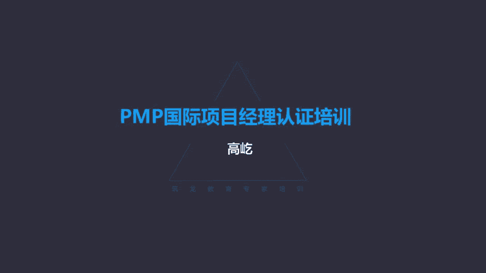
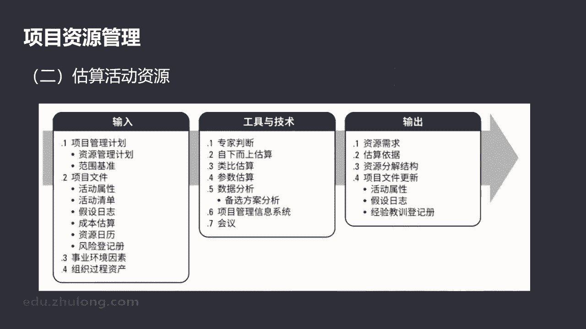

# K003-PMP项目管理认证培训 - P25：25.项目资源管理：如何规划资源管理？ ▲ - 与君共造价 - BV1eu4nerEJF

项目资源管理，资源管理的核心概念啊，包括识别获取，还有管理所需的资源，那目的呢要确保项目经理和团队，能够在正确的时间和地点使用正确的资源，要让资源得到有效的管理和控制，满足工作的要求，书上说了。

虽然咱们团队成员有特定的角色职责，但是大家都应该参与到，这个项目的规划过程里面来，包括咱们前面也提到过什么什么事情谁来做呢，项目经理和团队唉，另一件事情应该谁来做呢，项目经理和团队别忘了团队啊。

大家一起来完成，这是我们资源管理的一个核心理念，那么另外项目经理你毕竟是团队的负责人，不同于一般团队成员，唉所以啊他既是领导者，又是团队的一个管理者，并且呢他要负责诶建设高效的团队，后面专门有一个过程。

就叫团队建设，怎么让团队的工作积极性得到提升，让大家的工作绩效水平得到提高，这个责任负责人，这是项目经理，另外项目经理除了对项目的目标负责以外，还要提高保持团队的满意度和积极性。

并且呢项目经理还应该留意，支持职业与道德行为，换句话说，我们做项目有可为有可不为啊，不是什么事情都能做，不是只要有利于相公的事情就能做，哎这个事情首先不能违背法律，不能违反道德这些事情啊。

对他的一个管理控制，这都是项目经理应该承担的责任，那么资源管理的发展趋势，还有新兴实践，这里面提到啊，开始强调，比如资源管理的更多方法，精益管理，J i it kon，还有呢TPM等等。

很多都是日本在生产制造领域得到的，这些个理论嘛，那么还有另外呢强调了情商，看重团队的效率，包括要降低团队成员的离职率，随着工作的压力越来越大，如何能让团队稳定，这也是我们资源管理里面应该高度关注的。

包括在敏捷环境下哎，自组织团队，这个时候所谓的项目经理不再是管理的角色了，应该创造环境，提供支持，信任团队，自组织嘛，不需要领导安排工作，自己主动完成应该完成的这个工作内容。

这是敏捷环境下应该使用这种方式，另外虚拟团队开始大量的应用，什么是虚拟团队呢，平时不见面，整个项目过程中从来不见面，或者呢只有短时间，有可能面对面的时候，偶尔出差见一面。

大多数我们都分散在各地远程完成工作，这也是越来越多的项目，越来越多的团队采取的方式，那么当然后面还会专门讲到啊，虚拟团队最主要的问题，沟通沟通不畅可能影响虚拟团队的效率，在敏捷环境下，因为变更更多了。

那么所以最得益于集中协作的这种团队结构，所以啊敏捷团队原则上应该是面对面的方式，要求叫集中办公，而且敏捷团队对每个人都提到了要求，哎这个在未来的考试里边还是一个考点，什么样的人能够加入敏捷团队呢。

叫通才啊，通才什么意思啊，就是我的工作我自己能够胜任完成以外，我对别人的工作岗位也有所了解，通才嘛，为什么强调是通才，而不是专家呢，因为敏捷强调叫自组织团队，自组织不需要领导安排。

我们能够主动的来承担完成自己的工作，并且当别人遇到困难的时候，我们能主动地提供帮助，那同理，我遇到问题了，别人也能给我有效的支持，帮助你，怎么能够给别人必要有效的帮助呢，当然你要了解。

你要掌握他那个工作特定的技能，所以说我们强调的是通才，而不是专家，唉专家他只对自己个别领域，这个知识有更深入的理解，有更独特的见解，有很强的能力水平，但是你自己都搞清楚了，别人的东西你不知道。

那么当别人需要帮助的时候呢，你就不能提供这种有效的支持了，所以啊敏捷环境下团队成员的特点叫通才啊，能够做到彼此的协作配合，我有问题了，别人给我帮忙，唉我别人有问题了，我也能主动给别人来提供有效的支持。

那么靠的就是这种自组织的，这种通才形成的团队好，那下面我们看第一部分叫规划资源管理，规划资源管理定义，如何估算获取管理和利用团队，包括利用实物资源唉这样一个过程，那么目的呢根据项目的类型复杂程度。

我们要确定适用于项目资源的，管理方法和管理程度，所以啊规划资源管理最终明确的是什么呢，是资源的管理方法，管理程度，我们看看规划资源管理的这样一个输入，工具与技术，还有输出，这里面有一项技术叫图表。

技术分成了三种层级型的组织结构图，还有矩阵型的职责图，还有文本型的岗位描述，我们分别看看什么是层级型的，层级型的组织分解结构，又叫OBS，那么它的特点把参与项目工作的各个组织部门，像工作分解结构一样。

从大到小，从粗到细啊，逐个展开，目的呢，能够清晰明确的表明出哪些具体部门，参与到项目工作里面来，但是我们这里也提到了哈，不管用什么方法来记录目的，我们的目的是什么呀。

哎就是要确保每个工作包都有明确的责任人，有人去负责了，而且呢大家要清楚明白，自己在工作过程中的角色，还有职责层级型的哎，相对表示高层级的角色，而这个文本型的呢，那就详细表达某一角色应该承担什么样的工作。

唉，层级型的层级型，首先工作分解结构在这里面要发挥作用，我们虽然做的是组织分解结构啊，O b s，但是按照组织现有的部门单元排列以外，我们还要在每个部门下，罗列出对应的活动或者工作包，所以层级型的啊。

这种组织分解结构，不光有简单的参与项目工作的组织部门，同时呢还要有该部门具体负责的工作任务，一般用工作包来表达，那么这样我们让具体的工作任务，指派到了部门相对比较小的部门，这是层级型的。

那么层级型的这种组织啊，层级型的这种组织分解结构，明确了哪个部门承担哪些工作包任务，可是这一个部门来说，那可能里边有多个人呢，可能部门里面还有小组，那具体这个工作包任务，应该由什么样的人来承担呢。

从层级型里面我们看不出来了，没关系，我们还有矩阵型，矩阵型，他把具体的工作包责任指派到了个人，它显示的是分配给每个工作包的这个项目资源，那么我们就能知道了，具体的工作包或者活动与这些资源之间的关系。

每个人应该承担什么责任，咱们书上给了一个例子叫RACI责任矩阵，RACI哎，这里边用四个字母分别表达了四种不同的职责，这里的R代表的是具体执行啊，对这个工作承担责任，执行的责任，A呢A代表负全责。

也就是问责的这样一个责任，哎A决定通过了，满足了这个工作就可以完成，A说有问题还要继续执行，那么工作就不能结束，所以A是问责的这样一个角色，对整个这件事情承担最终的决策权，而C呢C叫辅助咨询。

提供配合支持的作用，还有一个爱爱是知情，这件事情不归我具体做，但是作为团队成员，我要了解他的当前状态，这是RACI责任矩阵，我们看到这个例子啊，左侧的啊，这就是具体的工作任务，也可以叫工作包任务。

创建章程，收集需求，提交变更请求，还是制定测试计划，那么每项活动里面，右侧的这就是每项活动里有不同的人，承担不同的责任了，上面的安本卡洛斯狄娜艾德，这是待分配职责的资源，团队成员在具体活动里面。

每个人有自己独特的具体责任，比如在创建章程这件事情里边，安唉他是A他是负全责的啊，问责的这样一个角色，而本呢啊，那么他是具体执行的章程，创建这件事应该由本来写，安呢是作为批准的这样一个角色。

后面的那卡洛斯迪娜和艾德呢都是爱，这代表什么呀之情，创建章程这件事跟他们三个没有关系，但是他们三个要了解这个创建章程，活动的进展情况，你看通过责任分配矩阵，每个具体活动里面。

我们明确的划分出了谁是具体执行的，谁是承担责任的啊，谁是辅助咨询的，谁是知情的，让责任呀明确落实到了人的头上，那我们看一下下面这样一个责任分配矩阵，哎也是RACI这个表格对责任的划分。

哎有问题各位找找问题在哪呢，确实有问题，哪个活动出现问题了呢，测试活动出问题了，测试活动的问题在哪呢，你注意哎，这里面小张是A的角色，同时孙悟空也是A的角色，在测试这项任务里面同时出现了两个A。

这就是问题了，责任分配矩阵RACI责任矩阵，那这里面不同的字母代表不同的职责，角色咱们说了，R代表的是执行哎，具体执行这件事情，那么一项工作能不能有多人执行呢，当然可以，工作任务复杂啊，多人一起来做。

这是可以的，这个AA是负责问责的，这样一个角色承担总的责任，这个角色能不能有多人呢，这个不行了，咱们工作中都有这样的体会，某件事情具体的负责人只能是一个，如果两个人甚至多人都对这件事负责。

那最后谁负责呀，一定是没人负责了，所以呀RACI责任矩阵里面A必须是唯一的，那么C辅助咨询配合的角色，这可以多人吗，这没问题，这个可以知情爱这更可以了，所以啊责任分配矩阵RACI里面。

只有A的角色必须为一，这各位一定记住，以前呀曾经出过类似的考题，就给你这样一个表格，然后问哪个任务的分配是有问题的，有什么问题呢，A重复了啊，A的这个角色在每项具体活动里面，必须为一这种图形的方式。

表格的方式啊，通过责任分配矩阵让责任明确到了个人，那么还有一种办法哎，那么我们就是用文本的方式，用文本可以详细描述团队成员的职责了啊，有的时候唉这种文本型的这种责任描述，我们也把它叫做比如职位描述。

或者呢叫角色职责职权表，比如说在一个测试活动里面，配合的角色应该干什么呢，这个C的角色，比如说我需要提前打开实验室的门呃，我负责搭建好实验环境，测试的过程中，我要负责记录中间数据，等完成测试了。

那我们要负责，我要负责把所有的仪表归位，你们先走，你们的我收拾完了，最后关灯锁门，把这些工作具体的1234文字的方式写下来，这就是文本型的责任描述，我们发现啊，通过刚才的三种不同方式。

从层级型把具体的工作责任指派到部门，接下来呢用矩阵表格的方式，让工作职责指派到了个人，进一步我们可以通过文本型的方式来，把对应的这个岗位职责再做更具体的描述，所以啊这种数据表现的方式。

从层级型到矩阵型到文本型，层层递进，表达的越来越清晰，目的呢，就是为了让每个人明确的知道自己，在工作中应该承担什么责任，唉这个工具请大家记住，那么规划资源管理输出的就叫资源管理计划。

资源管理计划什么内容呢，提供了关于如何分类分配管理和释放，项目资源的指南，注意啊是个指南，那我们现在能够警醒了指南什么特点呀，高层次的哎方向，政策性的内容，资源管理计划。

根据具体情况又包括了团队管理计划，这是针对人的，还有呢食物资源管理计划，这是针对物的，那么不管人还是物，它都是一个高层次的方向指南的内容，所以这里面给出了哈资源管理计划，可能包括的比如识别资源哎。

识别资源的方法，获取资源呢，如何得到所需实团队实物资源的指南，所以这里边给出的也是方法，也是指南，那么包括里面涉及到的某人应该承担的职务啊，他的职权是什么，有什么样的权利。

那还有呢他的职责包括项目组织图，团队资源管理，培训，团队建设等等等等，虽然内容很多，但是我们发现在资源管理计划里面，并没有明确的说明需要什么样的资源，比如需要什么样的人，包括需要什么样的物品，设备啊。

环境啊，场地啊，工具啊，仪器仪表啊，这些都没有描述，所以资源管理计划诶，继续遵循这样一个原则，资源管理计划里没有资源哎，有的是如何管理资源，如何获取资源的方法原则，这是我们得到的资源管理计划。

那么另外还会输出一个叫团队章程，我们前面有过一个章程了，叫项目章程，首先咱要明确团队章程不同于项目章程，我们先看看内容唉，团队章程，团队章程为什么要创建呢，为团队创建价值观共识。

还有工作指南的这样一个文件，他是专门给团队提供的，对团队成员可接受的行为确定期望，所以这一点它不同于项目章程，项目章程是什么呢，重要相关方就项目包括成果高层次达成的共识，那是为了达成共识。

是为了高层次的在各相关方之间达成共识，而团队章程呢，这是为我们团队成员之间哎就价值观共识，还有工作来形成一个大家都能接受的啊，这样一个共同的准则，比如这里面包括啊大家都要遵守的规则，有组织要有纪律。

有了团队章程，我们能够协同工作，谁来编写章程呢，这个问题上跟项目章程又不一样了，项目章程是谁写的呢，重要的客户，项目以外的重要相关方啊，他们有职务，有权利，有资源，另外呢还有项目经理。

得到授权的项目经理也可以编写项目章程，而团队章程不是了，团队章程谁写的呢，要团队参与制定，既然是针对团队的啊，可遵守的明确的规则啊，大家共同的价值观，大家的行为准则，因此啊应该由团队共同参与制定。

大家都参与了，那么制定的条款得到每个人的承诺，接受这样的团队章程，才能真正起到一个哎就大家的价值观，工作指南形成共识的这样一个目的，所以团队章程跟项目章程是不一样的，那么它的内容。

团队的价值观包括沟通的指南，那么特别注意啊，这里的沟通指南不同于沟通管理计划，那后面沟通管理章节，我们再看什么是沟通管理计划，包括决策标准和过程啊，冲突处理的过程，还有呢开会的行为要求等等。

所以他是对团队成员行为的一个约束，或者说大家共同接受的一个准则，有组织有纪律了，有助于团队工作的顺利开展，这是团队章程的内容，好的，接下来我们看看估算活动资源，估算活动资源，我们什么时候见过呢。

在进度计划哎，别忘了啊，进度计划我们说过，特别强调顺序，首先应该先叫规划，进度管理，有了进度管理，计划高层次的方法原则，接下来呢叫定义活动，通过分解把工作包拆分成活动任务，然后把那些杂乱的任务排序排列。

活动顺序，形成初步的网络图，接下来的过程就是估算活动资源，只有先明确了资源的可得性，我们才能做出后面的环节，就是估算活动持续时间，制定进度计划，所以那时候我们就讲过，排列完活动顺序。

应该优先考虑估算活动资源哎，估算活动资源，那也就是来执行啊，估算我们项目所需的团队资源，包括物品资源，只有先明确了资源的可得，接下来才能有更准确的时间预估，当时说过了，在以前的版本里面。

估算活动资源过程是放在进度管理知识领域的，那么咱们现在第六版了啊，把它拿回到资源管理章节了，从这个活动的性质来说，它确实应该属于资源管理的范畴，但是从他的逻辑关系来说。

唉别忘了在进度管理里边一定有这样一个过程，插入估算活动资源，这里边的工具我们前面都见过多次了啊。

不陌生了，既然是估算吧，自下而上估算呀，类比估算参数估算都可以使用，通过这样的估算，我们输出的叫资源需求，同时呢我们还会输出另一个成果，叫资源分解结构，什么是资源需求呢，资源需求通过对各个工作包啊。

或者工作包中，每个更小的活动所需的资源进行一个汇总，那么得到的是为了完成工作包任务所需要的，整个项目所有资源，这个叫资源需求，那另一个资源分解结构叫RBS，什么是资源分解结构呢。

资源分解结构是把资源按照资源所一类的呃，它所资源所分的这种类别，还有类型来层级展示，比如我把资源分成了人力资源和设备资源，人力资源里面又分成了专家资源和普通资源，专家资源又按不同的专业来划分哎。

不同的专家资源，设备资源，我们又可以把它分解成，比如软件资源和硬件资源，软件资源又把它分解成应用软件和系统软件啊，应用软件又包括不同的应用软件，哎这个是资源分解结构，资源需求和资源分解结构。

你看他们都是估算活动资源过程的输出，但是这两个输出的成果之间既有联系，又有区别，资源需求它的特点呢他是站在工作的角度，它是以整个工作分解结构，所有的工作包作为依据。

为了完成这些工作包任务所需要的所有资源，人力资源呀，设备资源呀，都要算上对所有资源进行一个汇总啊，这是资源需求，它是站在工作的角度来，识别出每个工作活动所需要的资源，那么资源分解结构呢。

哎他不是站在工作的角度了，他是站在资源本身，从资源角度出发，我们要明确哎，按照资源的类别类型来层级展现，那么其实资源分解结构，我们分解的这些个对象对象是谁呢，哎就是资源需求，从资源角度来说。

资源需求跟资源分解结构唉，它的内容应该说是一致的，资源需求是完成工作的所有资源的一个汇总，但是这种汇总可能相对来说有些杂乱，或者说没有什么顺序，没有什么逻辑关系，我就是根据工作包的需要。

来把所有的资源梳理出来，各个工作包，这是工作分解结构的最底层要素，我们当时也讲过，工作包之间连顺序关系都没有，不用考虑顺序，说先有哪个工作包，然后才有哪个工作包，用不着考虑顺序，什么时候考虑顺序呀。

进度管理了，我们在管理进度的时候，专门有一个过程叫排列活动顺序，工作包被打开拆分了，把它分解成具体的活动，动词加名词的结构了，哎这些个活动有逻辑关系，先做哪个再做哪个，哪些串行，哪些并行。

所以工作包是没有顺序的，诶，那我们的资源需求呢，就是为了完成所有的工作包所需要的各种资源，我们把它汇总收集起来，它的特点完整，那确实是完整的，没有丢漏，但是呢不排序，没有任何的顺序，也没有什么逻辑关系。

只要有需要的，我就把它拿过来汇总起来，这是资源需求，而资源分解结构不是资源分解结构，对资源要进行一个整理了，刚才说了，按照它的类别，按照它的类型层级展开，哎，既包括人，也包括物，那么这样的目的是什么呢。

呃我们虽然是站在资源的角度，对资源进行一个再次的梳理，其实它的内容就是资源需求，那为什么还要再梳理一遍呢，我们的目的为了让这些个资源变得更加的清晰，我们能够更准确地去获取资源，包括去管理资源。

如果只有一个简单的资源需求，它可能是杂乱的是吧，人呀物啊都混在一起，但是我们如果通过资源分解结构，把它们合理的分类，合理的排序，能让资源变得更加的清晰明确，而且呢还能避免出现资源的遗漏，同一类型的资源。

我们把它归类到一起，用这种资源分解结构，类似工作分解结构的方式来整理来表现，所以资源需求和资源分解结构，它们都是估算活动资源过程的输出，从它的内容来看，内容原则上也是相等的，但是表现形式这是不一样的。

资源需求只是简单的罗列完整，但是无序，而资源分解结构呢唉更加规范的整理清晰，更加的准确，另外资源需求是站在工作的角度进行的啊，这样一个汇总，而资源分解结构呢，这是站在资源本身，站在资源本身。

从资源的特性角度来来进行一个必要的分类，所以把这个资源需求和资源分解结构，它们的区别跟它们的相同点。

