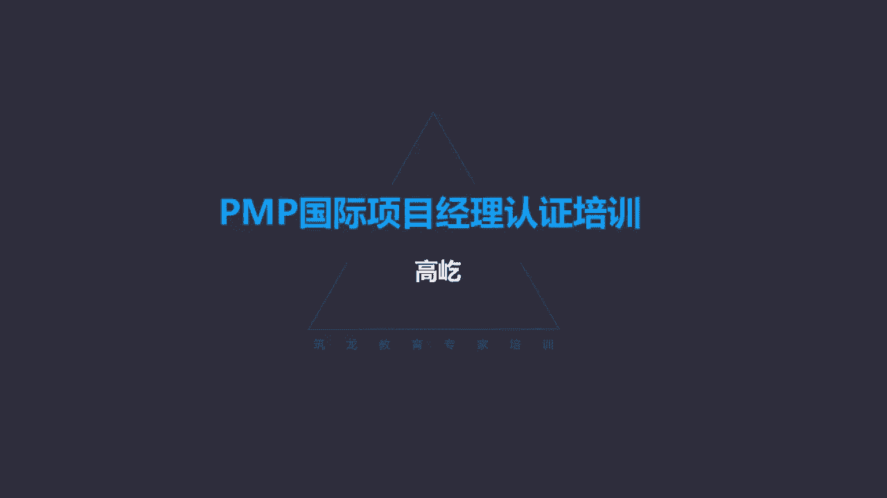

# K003-PMP项目管理认证培训 - P27：27.项目资源管理：如何建设团队？ ▲ - 与君共造价 - BV1eu4nerEJF

下一个过程是建设团队，建设团队做什么呢，哎建设团队这个过程提高工作能力，促进团队成员互动，改善团队整体氛围，哎注意以提高项目绩效的过程，前面说的都是建设团队的手段，那么最后呢是它的根本目的。

建设团队通过提高了团队成员的工作能力，通过促进了他的互动，包括改善了团队整体氛围，最终目的呢哎是提高项目的整体绩效，这是建设团队的根本目的，大家可能还记得我们在一开始的时候，有三道测试题。

其中有一道就是啊你的这个团队啊，长时间的工作哎，压力很大呃，那么你决定拿出一个周末做海滨的团队活动，垂钓啊，烧烤啊，冲浪啊等等，问的是你这样做的根本目的是什么，当时我们在选择的时候。

有的同事可能选错了啊，啊提高个人工作绩效，为了融洽氛围，为了让大家得到放松，哎对不对呢，啊要说也没问题，但是不是它的根本目的，建设团队的根本目的，是为了提高整体的项目绩效，哎这是我们建设团队的目的啊。

请大家一定要记住，建设团队谁来负责呢，一开始这个章节开头我们就提到了，建设高效团队是项目经理的主要职责，这件事情是由项目经理负责的啊，他要来通过各种各样的活动，各种各样的方法和手段。

让来让项目的整体绩效得到一个提升，这是建设团队的一个作用，我们下面介绍一个叫塔克曼阶梯理论呃，这是关于一个团队建设发展过程的一种理论，这个概念在考试里面经常出现，根据塔克曼阶梯理论啊。

那他认为一个团队一般要经历一系列的阶段，首先啊首先是形成阶段，团队刚刚组建啊，那么这个时候团队的特点说，团队成员倾向于独立，不一定开诚布公，那具体什么表现呢，团队组建了团队成员。

彼此之间呀气氛还是很融洽的啊，大家没有什么冲突，矛盾氛围很好，但是这个阶段大家想想工作绩效水平会很高吗，不会形成阶段的特点哎，就是表面看团队氛围不错，没有什么冲突，但是工作绩效水平并不高，这是为什么呢。

团队刚刚形成，大家彼此之间还比较陌生，我们说了平衡矩阵，团队成员来自不同的职能部门，我们临时组成这样一个项目团队，所以这时候大家对工作的内容，包括彼此之间的配合还不是非常的熟悉，包括也不是很默契。

因此在团队的形成阶段，工作绩效水平不会很高啊，他处在一种比较低的水平，那既然工作绩效水平不高，那为什么团队的氛围还不错呢，彼此之间看起来没有什么冲突矛盾，这个呀源于我们成年人哎这种礼节性的克制，你想啊。

大家本来就不太熟悉，我们现在到一起了，我们形成了一个团队哎，接下来要在一段时间之内互相配合来完成工作，我们彼此成了同事了，这样的环境下，即使我们现在在配合过程中会出现一些问题，互相不太熟悉。

包括彼此的工作方式也不太适应，那么这时候我们会把自己这种不满啊，这种对别人的这种意见直白的表达出来吗，一般不会，所以叫礼节性的克制，咱们说的通俗点啊，大家还装着呢，唉彼此都有点装，唉，为什么呀。

不好意思，确实我对你其实有点想法，有点看法，你怎么哎呀，怎么跟你配合这么费劲呢，啊第一件事说好几遍也不给动，哎呀真是头疼，虽然我对你心里有不满，但是不好意思表达出来，大家都是成年人了是吧。

你说直接就撕破脸啊，互相指责不太好，所以形成阶段的特点，就是工作的绩效水平并不高，互相不熟悉嘛，但是呢团队氛围表面看起来还挺好哎，冲突水平比较低，因为基于这种叫礼节性的克制，这是形成阶段。

那么形成阶段一段时间的推进，随着工作的开展，哎我们会进入震荡阶段，震荡了，那咱们已经相互配合一段时间了得了，甭装了，我对你的不满呀，对你的意见呀，这回都爆发出来了，咱们第一次都已经比较熟悉了嘛。

所以那种礼节性的克制没有了，在震荡阶段啊，大家开始互相指责，互相埋怨，互相批评，那当然这样的氛围下，我们的工作绩效水平会很高吗，肯定不会净忙着打架了啊，觉得问题都是别人的，也都觉得自己委屈别人。

对不起自己，所以在这种阶段，在震荡阶段里面，唉团队的冲突水平提升了啊，大家互相埋怨，互相指责，那么在这样的背景下，工作绩效水平不会很高的，那么当然我们彼此之间的这种意见，这种矛盾源于什么呢。

就是源于工作工作彼此的不适应，互相配合上出现的问题，所以出现了震荡，所以呢这个阶段有时候也叫磨合阶段，正是因为有了互相的不适应，我们还要相互配合完成工作，那么需要磨合，那么磨合的阶段哎开始有冲突。

同时呢绩效水平并不高，那当然咱不能一直磨合呀，我们一起来，我们在一起，我们是未完成工作的，咱们不是为了互相来打架的，所以一段时间的震荡以后，我们会进入规范阶段，到规范阶段了。

这个特点大家开始能够相互的配合工作，你们刚才说了，我们震荡，我们有冲突，矛盾为什么呀，就是因为工作中的配合出现了失误，彼此互相不适应，包括方式，包括习惯哎，大家还不能彼此互相的，特别好的这种配合写作吗。

那么所以我们要互相的做出一些调整，每个人都在主动的调整自己，以适应对方，通过必要的调整，那么我们中间的这种冲突矛盾减少了，甚至说没有了，那么我们就进入了规范阶段，所以这个时候。

团队成员开始能够相互的协调配合，共同一起工作，哎，这个时候团队成员哎，彼此之间的冲突矛盾减少了，能够互相的信任了，那当然有了这样的一个大的环境背景下，有了信任的这样一个前提条件，能够互相支持工作了。

冲突减少了，那么工作绩效水平开始提升了，大家真正能够以目标为导向，互相支持，互相配合，相互理解，相互体谅，我们团队啊开始进入这种啊叫规范的一个状态，所以叫规范阶段，那么随着工作的推进。

规范阶段时间越来越长，我们就会进入下一个叫成熟阶段，成熟阶段了，团队成员经过相当长时间的这种配合了啊，在这种彼此信任的情况下，我们相互配合，相互依靠，那我们就会进入成熟阶段，那他的特点。

团队的绩效水平达到最高，团队中没有冲突了，我们互相配合的非常默契啊，彼此大家都能够相互支持，相互理解，那这个时候团队绩效水平达到了顶峰，团队的冲突水平呢降到了最低，我们都能以目标为导向，高效地完成工作。

这是成熟阶段的表现，那么最后最后团队随着工作的完成，也进入了解散阶段，来完成所有工作了，团队成员离开了项目，一般情况下大家经过这么长时间的合作啊，从开始的不熟悉不了解，到最后的非常熟悉，配合默契。

那么在解散的时候可能会依依不舍，我们希望下次继续友好配合，这个就叫塔克曼阶梯理论，那么塔克曼阶梯理论他告诉我们，一个团队在建设的过程中要经历一系列的阶段，我们可以用一个图形曲线来概括。

这个各个阶段的特点，你看形成阶段这个橙色的虚线代表团队的士气，刚一开始哎大家都信心满满，士气很高，我们加入了这个团队，但是因为彼此之间不熟悉不了解，所以啊在工作的配合上不会很默契的，因此啊虽然士气挺高。

但是工作绩效水平哎，这根蓝线你看他在比较低的位置上，刚开始工作嘛，工作绩效水平不会很高的，那么随着时间的推进，我们就进入了叫磨合，也叫震荡阶段，到这个阶段了，开始出现冲突，刚才咱们说了啊。

彼此之间这个矛盾呐啊这个互相的抱怨呀，指责呀，开始出现，不用装了是吧，大家都熟悉了，那当然士气一下就低落了，净打架了嘛，士气低落了，在这样的环境下，那我们的工作绩效水平不会很高。

还是在比较低的水平向前推进，那么当然我们我们磨合也好，我们震荡也好，并不是我们彼此之间个人有什么样的意见，都是源于工作工作的不适应，彼此的不熟悉，不了解导致的，所以啊工作绩效水平缓慢增长。

但是一直是低位状态，经过了这样一个磨合阶段啊，走出震荡期了，那不就进入规范阶段，规范阶段了，大家彼此能够互相适应了，互相主动的做出调整，相互信任了，那当然士气开始提升，没有那么多冲突了，随着士气的提高。

工作绩效水平进一步提升，能够互相配合了，经过一段时间的规范合作，我们进入这里叫表现，也叫成熟阶段，这是一回事，在这个阶段里面，我们看这两条曲线的特点都达到了最高点，团队士气高涨。

因为我们取得了明显的成绩了啊，所以啊大家的这个士气很高，同时呢工作绩效水平也达到了最高点，最终团队在这种高士气的状态下走完了啊，整个项目的生命周期最后解散了，这是团队建设的塔克曼阶梯理论。

那么按照理论来说，一个团队的建设发展应该经历这些个过程，并且呢应该是按顺序来经历，先形成，然后震荡磨合，磨合好了，进入规范阶段，一段时间的规范啊，进入成熟这种表现阶段，最后团队解散。

所以理论上应该是按顺序一个阶段一个阶段，但是在实际的这个团队形成过程中，团队的建设过程中，这一个一个的阶段呀，有的时候还可能出现回退，有的时候呢也可能出现跨越，哪个阶段可能回退呢，比如规范和磨合。

我们团队成员通过一段时间的磨合，唉大家已经能够基于这种信任相互配合工作了，我们已经进入规范阶段了，但是如果在这个时候，又有又有了两位新同事加入了，你看我们原来的团队，刚刚经历了这样一个震荡磨合的过程啊。

步入规范的这样的阶段了，唉这个时候又有两个新同事加入了好，那可能我们这个团队啊，短时间内又会回退到这种震荡磨合的状态，大家又开始有些冲突了，有新人加入了吗，啊又有不熟悉的人啊。

不适应的这种工作方式习惯了，所以可能又会反过来再次震荡，这是一个回退的情况，那什么时候可以跨越呢，这种磨合震荡期有的时候是可以跨越的，比如我们形成团队的这些团队成员诶，大家很熟悉。

我们在以往有过合作的经历了，我们多次在一起配合，彼此已经很默契了，那么随着团随着这个新的团队建立了啊，大家对新的工作可能需要一个熟悉的过程，工作熟悉了，我们迅速的就进入了规范阶段。

我们又能够大家一起互相默契的配合工作，所以啊这种情况下，哎这个磨合震荡阶段是有可能被跨越的，不是每个团队必须都要震荡，都得打一架吗，这也不一定，所以震荡阶段是有可能被跨越的。

但是这里面的规范阶段是不能被跨越的，不可能昨天还还震荡，还打得不可开交呢，唉今天一上班，哎呦大家就成熟了，就高效的配合了，互相默契的配合了，这个不太可能这种高绩效的表现，成熟阶段一定要经过长时间的规范。

在这样的配合情况下，我们才能达到最高的绩效水平，所以啊规范阶段是不可跨越的，这个要特别注意，另外我们在做题的时候，要特别注意各个阶段的特点，结合它的特点，我们做出正确的选择，我们来判断这是一个什么阶段。

比如形成阶段的特点，那就是团队成员彼此之间哎这个关系都不错，没有什么冲突，团队里没有明显的冲突，但同时呢工作绩效水平又不高，表面上看起来没有冲突，同时绩效水平又不高，这就是典型的形成阶段的特点。

基于成年人礼节上的克制，不是没有意见，没有矛盾，是没有直接表示出来，不好意思嘛是吧，礼节性的克制，这是形成阶段的特点，而震荡阶段的特点呢冲突频发，他最突出的特点就是冲突水平高，这是震荡磨合了。

那么规范阶段的特点，注意题目里面一般提到规范阶段，往往用这样的关键词叫开始相互配合，团队成员开始相互配合了，哎强调的是开始，那么这种情况，这就是规范阶段的一个特点，我们走出了磨合，震荡的阶段。

我们彼此之间不再打架了啊，不再有这种冲突了，所以啊开始相互配合，相互信任，那么成熟或者表现阶段，这个阶段的特点呢一般叫做出重大成果，取得了重大成果，哎做出重大的进步，或者说团队以最高效的水平来完成。

他强调团队高效工作这个特点，记住这样几个阶段的特点，我们就能够从背景里面情景题嘛，通过描述的背景，我们就能准确的判断出，当前团队处于一个什么水平，什么阶段，唉这是塔克曼阶梯理论啊，大家一定要把它掌握。

这是考试的一个重点概念好，那我们看一看建设团队过程的输入工具技术，还有输出这个过程的主要工具啊，比如集中办公，集中办公，你看集中办公这种方式很简单，就是把大量的团队成员，或者全部的团队成员集中在一起哎。

他强调的是同一个物理地点，大家面对面的工作，哎，这就是集中办公，那么只要面对面的工作了，就能达到团队建设的目的，什么目的啊，提高团队整体的工作绩效，因为面对面的这种方式啊，沟通的效率是最高的。

沟通效率高了，那么我们的工作绩效水平就能得到提升，所以集中办公是一种特别简便，同时呢也特别有效的团队建设方式手段，哎这种办法可以是临时的啊，一些关键期遇到一些重大问题的时候，我们集中办公也可以呢。

全程比如像敏捷敏捷管理里边就强调，要求团队成员全程集中办公，大家必须面对面的在一起，这种方式有利于提高团队的工作绩效，那么考试里面在针对集中办公哎，这个团队建设的方式手段的时候。

有时候会给我们设定一些场景，也就是让我们来判断什么情况下，就应该集中办公了，注意集中办公是为了提高工作绩效，所以大的前提要提高工作的绩效水平，我们才会集中办公，那么再有要注意他的条件。

什么情况下可以集中办公呢，比如说团队成员分布在一座大楼的不同楼层，你在三楼，他在五楼，他在11楼，大家在一个楼的不同楼层办公，你说这个有条件集中办公吗，有条件就一个楼嘛是吧，我们怎么就不能到一起呢。

当然这时候您别想多了啊，你到一起没有会议室，没有位置，工位不够，你们单位工位紧张，人题目里边的有的是这你不用操心，只要在一个相对接近的物理位置上就可以了，所以在一个大楼的不同楼层，这个一定可以集中办公。

或者说在不同的楼里面，在公司不同的楼里面，你看你在A栋，他在B栋，这能集中办公吗，可以没问题，不就俩楼吗，走两步就到了，这个也可以集中办公，还有的时候描述，他说大家的距离不超过10分钟的车程。

你看开车开10分钟，这种情况可以集中办公吗，当然可以呀，不就开10分钟车吗，说明什么，说明离得不远，哎既然离得不远，那么为了提高团队的工作绩效，就应该集中办公到一起最好。

甚至还有的题目里面提到说团队成员啊，分布在城市的两端，在一个城市的两端，一个在东边，一个在西边，这种情况能集中办公吗，可以集中办公，他不就一个城市吗，哎一个城市的两个，你城市有多大呀，没有多大。

那你还是有条件集中办公的，那什么情况就没有条件集中办公了呢，比如题目里面说团队成员分散在不同的城市，这个太难了，在不同的城市了，甚至说分布在不同的国家，那显然这个集中办公不现实了。

所以啊只要有可能你看一个城市的两端，都应该尽可能的集中办公，集中办公是一种又简便又高效的团队建设方式，所以只要有可能就应该集中办公，唉它的作用提高工作的这个整体的工作绩效，所以这个工具大家要把它用起来。

那下一个工具呢叫虚拟团队，前面咱们说过虚拟团队啊，借助现代的通信手段，网络技术，让那些从来没见过面或很少见面的人，也能大家以目标为导向，共同完成一个项目组成的这种不见面的团队，这就叫虚拟团队。

那么虚拟团队既然成为建设团队的一个工具，一种方法，那显然虚拟团队是有它的价值的，能够提高工作绩效，这里说了啊，虚拟团队的好处，比如能让更多技术熟练的资源加入团队，能够有效的降低成本，减少差旅费。

这个太好理解了是吧，咱们不用老出差碰面了啊，打个这个电话或者呢会议电视的方式，用网络社交媒体，大家就能够沟通，能够联系了，所以虚拟团队有这样那样的好处，但是虚拟团队也有问题啊，虚拟团队最大的问题。

沟通咱们已经讲过了是吧，缺乏这种高效的沟通，没有什么样的沟通方式比面对面更高效了，大家不见面，只通过这些网络技术来沟通，唉它的效果呀不一定太好，而且呢容易缺乏团队意识，容易忽略，说哎我是某个团队的成员。

我就做我的工作，你把活交给我吧，交给我完成就是了，至于说我怎么去配合别人，那别人是不是需要我的支持帮助，这个可能考虑的就比较少啊，所以啊这也是虚拟团队的问题，那么另外还需要各种人际关系与技能啊。

特别像什么冲突管理哎，这个我们一会留在管理团队，我们再来再来详细介绍，另外团队建设呀要通过各种各样的活动来完成，很多人一提到团队建设，什么是团队建设呀，我们出去玩去吃饭聚餐啊，K歌去，我们打打球。

运动运动哎，这些都是团队建设，确实这些都是有效的团队建设方式，但是团队建设仅限于这种吃吃喝喝吗，仅限于这种休闲娱乐吗，这个不是因为啊，团队建设的根本目的告诉我们了，为什么团队建设呀是为了提高工作绩效哎。

提高团队的整体工作绩效，那换句话说，只要能提高团队工作绩效的，都是团队建设手段，哎所以啊他就不包括这种吃吃喝喝呀，哎娱乐呀，开心别的方式，只要能提高团队绩效的，都是团队建设手段，那就广义了。

哎我们这里面简单的介绍这几种，比如启动会，你看正常的启动会就是工作的一部分，但是开好一个启动会，咱前面讲过，让领导给我们讲讲话，鼓鼓劲儿，让领导重视我们的项目，那么未来我们就有可能获得更多的支持。

有了更多的资源支持了，那当然有助于工作高效的完成，所以启动会开好了，就是团队建设集中办公，刚才说了，这就是典型的团队建设工具是吧，就是大家聚在一起哎，只要面对面就能提高效率了，作战室。

这是一种特殊的团队建设方式啊，特殊的集中办公还是面对面，但是更小的房间了，这种房间很小，那么大家在小房间里面讨论问题，有个特点，空间环境一小人会感觉到压迫感，在压迫感下思路不会发散啊，不容易跑题儿。

所以啊在遇到一些重大紧急问题需要马上讨论，马上决策的时候，应该去小的房间去协商，这就是作战室提高效率，包括庆典活动啊，当然开个年会是吧，大家出去玩儿，那这个确实我们愿意参与，但是啊花钱占时间啊。

不能经常开展哎，但是接下来远离工作现场的会议，你看这又是一种有效的团队建设方式，开会相信大家都开过会啊，项目中会很多，但是呢多数人又不愿意开会，觉得它效率低，浪费时间，那我们现在开会，我们不去会议室了。

我们去哪呢，去自然环境，去休闲娱乐的环境，我们楼层里面有一个咖啡座，咱们在那坐一坐，开个会，天气不错，我们楼下有片绿地，咱们去那儿坐一坐，开个会，单位边上啊有家咖啡厅，咱们在那儿开个工作上的会议。

你看远离工作现场了，离开工作现场，您的心情先放松了，心情放松，脑子更好用了，有助于提高开会的效率，所以远离工作现场的会议，是一种特别有效的团队建设方式，包括团队章程，有组织有纪律，提高效率。

包括奖励和表彰啊，奖励和表彰，这是一种有效的团队建设方式，那么但是请注意啊，在我们这套理论里面，哎什么样的行为才应该得到奖励呢，我们强调双赢或者叫多赢那种突出重点的方式，比如呃什么先进工作者。

什么销售明星明星员工这种方式，我们不认为这是好的认可与奖励手段，应该是每个人都能做到，也应该做到的行为得到奖励，也就是让大多数人，尽量让所有人都能受到激励，受到鼓励，唉这个是有效的建设手段。

所以啊不要突出重点了，哎这个要注意在奖励的过程中，这是一个原则，另外还有培训，提高团队成员的能力，咱们前面讲过了，哎这是一种项目经理重要的责任，项目经理负责培训，当然并不是说他手把手去教啊。

他要安排团队成员的培训，而且培训的这个成本呢要算在项目预算里面，那当然如果你是有利于未来的项目，与我当前的项目没有关系，那这个费用项目经理就不承担了，所在的职能部门来承担。

所以培训提高团队成员的业务能力，技术水平，唉这也是一种常见的有效，也是高效的团队建设工具，输出的叫团队绩效评价，哎，团队绩效评价是对项目团队有效性的，这种正式或非正式的评价。

它针对的是啊个人个人能力改进，团队能力改进，包括离职率的降低，包括凝聚力的加强，总之团队绩效评价评价的什么呢，唉是团队是人人主观的一些表现。

