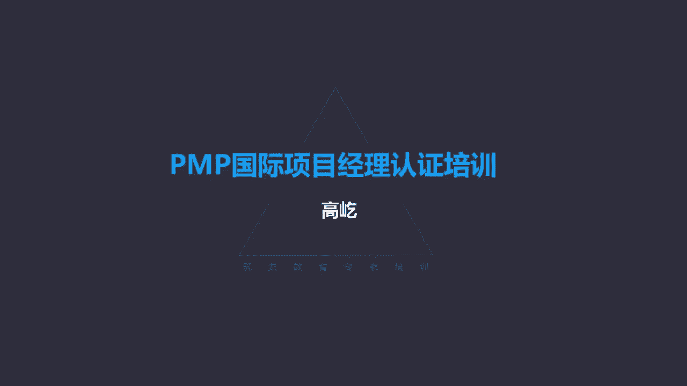

# K003-PMP项目管理认证培训 - P29：29.项目沟通管理：沟通模型与工具技术 ▲ - 与君共造价 - BV1eu4nerEJF

项目沟通管理，沟通管理啊，主要强调的是确保项目相关方的信息需求，得到各种满足，沟通沟通，这里强调的是信息传递，那么我们这个项目管理知识体系指南里面，他认为什么是沟通呢，叫有意或无意的信息交换。

他认为哈无意的信息交换也属于沟通，那么可以是想法，可以是指示，包括情绪哎，情绪也是沟通的内容之一，当然沟通的对象很多了啊，有团队，有这个其他的相关方，有内部的，有外部的等等，这些参与项目的相关方。

都是我们需要沟通的对象内容，这也是项目经理最主要的工作内容之一，咱们前面讲了，说一个优秀的项目经理用于沟通的时间，应该占他整个经历的占了百分之多少呢，还记得吗，90%，所以啊。

沟通工作是项目过程中最重要的一个环节，也是项目经理最重要的工作职责，那么在书上，专门提出了一个关于书面沟通的5C原则啊，说这个5C原则可以减轻，但是呢没有办法彻底消除理解的错误啊，能够减轻错误。

包括和正确的语法拼写啊，你字不能写错了，还有呢简洁的表述清晰的目的啊，包括连贯的思维以及受控的语句，想法承接等等，这也很好理解呃，不多解释了，这5C原则也不需要您背下来，您多看两遍。

知道大致这五方面内容就可以了，那么沟通管理的发展趋势，新兴实践，那么这里面包括哎，相关方纳入了项目的评审范围，包括呢让相关方参加项目的会议，在以往我们传统的项目管理过程中，我们通常把这些相关方。

我们主要认为是项目以外的那些个，比较重要的啊干系人，利益相关者，比如客户啊啊，比如最终的用户啊，发起人等等，那么他们在项目中的作用，可能在我们不能决策的时候，我们需要这个变更啊。

最终要确定是否能够接受或者拒绝的时候，他们要发挥作用，包括他们可能给我们提出一些新的要求，而更多时候呢是我们自己，我们项目团队自己来完成具体的工作任务，按照人家的要求得到成果，获得最终的满意。

但是我们现在不这样认为了，相关方应该全过程的参与到项目过程当中来，包括说要随时及时的了解我们的项目状态，项目进展，所以说他们应该参与项目的评审，包括要参加项目的每天的这种会议，什么叫站会呀。

平时咱们开会都是坐着的，但是这一坐时间太长了，容易发散，影响大家这个开会的效率，那么敏捷开会都是站着开，没有座位啊，所以叫每日战会，那么相关方也应该参与进来，包括用更多的这种社交工具，比如社交媒体。

让这种沟通啊变得越来越方便，随时随地都能传达信息，不光语音，还有文字，包括这种图像等等多媒体的方式，另外这种多面性的沟通方法，唉，这些都是沟通的这个发展趋势和实践，在敏捷环境里面啊。

本身就是高度不确定性的，那为了让工作能够得到有效的推进，及时的确认，那在沟通方面就强调更加频繁和快速了，而且呢要尽量简化团队成员获取信息的通道，最迅速最这个高效的得到信息，而且是准确的信息。

所以最有效的办法是什么呢，咱们前面讲的团队建设的手段之一，就是集中办公，敏捷团队强调全过程都要面对面的集中办公，这样能够最高效的传递信息，另外呢还要及时与这种高级管理层和相关方，进行沟通。

在咱们传统项目管理里面，哎，这种高层级的高级别的管理层，一般不会参与具体项目工作，如果参加，那通常也就是以CCB成员的身份，来对一些重大变更作出判断，做出决策，在敏捷，在适应性环境里面，哎那我们强调啊。

团队还要及时的与这些高层管理者，及时的沟通啊，随时获取他们的最新需要，因为敏捷呀，是站在满足客户需求的角度来完成工作的，那么这样呢，便于我们工作的准确开展，这是敏捷环境的一些沟通特点好。

那我们看看下一个部分叫规划沟通管理，又到规划了每个知识领域，第一个过程都是规划，那咱们再看看规划沟通管理有什么特点，规划沟通管理，基于每个相关方或群体的信息需求，包括可用的组织资产。

具体的项目需求为项目沟通活动，唉，注意啊，制定恰当的方法和计划的过程，他是一个明确编制方法和计划的过程了，这里可没有说提供方向指南了，规划沟通过程是为了及时向相关方提供信息。

而编制书面的沟通计划的这样一个过程，通过规划沟通，我们就应该形成书面的正式的沟通计划哎，在规划沟通管理过程中，我们用到的工具，这里面包括一个叫沟通需求分析，沟通需求分析涉及到一个小小的计算题。

计算题很简单，就是计算潜在的沟通渠道数量，公式就是二分之N乘以N减1N是什么呢，就是参与沟通的相关方数量，只要是相关方有几个算几个都得加入进去，看起来公式很简单，但是这里面有个问题，我们在做题的时候遇。

如果遇到啊涉及到沟通渠道计算的时候，往往啊会出现这样一个困惑，就是项目经理该怎么算呢，比如题目里面说说，项目经理带领着五人团队为两名客户完成工作，那么问沟通渠道数是多少，你想一想。

项目经理带领着五人团队为两名客户提供服务，那这里边NN是多少呢，首先N相关方是相关方的数量，参与沟通的相关方数量，那也就是所有所有的人都应该算进去客户，这是两个没问题，团队五个5+2，现在七了。

那么项目经理呢，项目经理算不算这五人团队呢，因为题目里面说的是项目经理管理着，或者带领着五人团队，所以啊这个团队里面显然不包括项目经理，那既然不包括他，那么整个团队应该是多少人啊，应该是六个人。

团队成员是五个，你别忘了还有个项目经理呀，因为题目里说了，说项目经理带领着五人团队，那当然他把自己给单挑出来了，因此完整的团队，团队成员加项目经理就应该是5+1，是六六个人，再加上两名客户。

所以这时候参与沟通的所有相关方的数量，应该是八是八个人，而不是七个人，所以啊如果题目里面出现这样的描述，说项目经理带领了多少人的团队，或者说项目经理管理了多少人的团队。

这个时候唉这个团队里面是不包括项目经理的，那么当然我们就要再额外的加上一个项目团队，加上一个项目经理，那就是团队成员的基础上再加一，那再换一种说法，说项目有十名相关方，问沟通渠道数是多少。

你看这个题目背景给的很简洁，他就说了这个项目有十名相关方，那这时候这个N应该是多少呢，唉N呐就是十这十个人，十个人里有团队吗，有团队，有项目经理吗，有项目经理，客户呢有啊，有没有发起人啊。

肯定也有职能经理，唉，只要跟项目有关联的，有利益关联的，这些个相关方都包括进去了，所以如果题目背景里面，他简单的说项目有多少名相关方，而没有再提及什么团队呀，项目经理呀等等。

那么参与沟通的所有人就是这个相关方的数量，所以说多少人就多少人了，第三种情况，这个说的更直白了，项目经理带领着包括他自己在内，共十人的团队来完成工作，那这个时候这项目经理还用再单独加一吗。

显然不用人家直白的告诉你了，项目经理啊，带领着包括他本人在内的多少人团队，那说明这个团队里面已经算上项目经理了，那就不用单独再加一了，所以啊项目经理到底怎么算，怎么确定这个N哎，这是我们计算的一个关键。

上面说的这三种情况，考试里面是可能出现的，哎基本也就这三种方式了，所以啊这个N其实也好确定，那么另外在涉及沟通渠道计算的题目里面，还有一个小的细节要注意，就是看他最后问的是什么。

如果最后问的是沟通渠道数增加到多少，沟通渠道数增加到多少，比如这个项目原来有十名相关方，后来又增加了两人，问沟通渠道数增加到多少，你看增加到多少，这个你是算一遍是算两遍呀，算一遍就可以了，原来是十个人。

后来又加入两个，变成12个了，那么增加到多少啊，你就算一下N等于12的时候，哎N等于12的时候是多少，你一算12×11除以二六十六啊，沟通渠道数是66就可以了，那么如果另一种问法就不一样了。

他问沟通渠道数增加了多少，原来是十个人，后来又增加了两个人，沟通渠道数增加了多少，你看增加了多少啊，这个跟刚才的增加道就不一样了，增加乐你原来的先得算一遍，十个人的时候，十个人的时候是多少呢。

哎10×9除以二四十五，原来是45，后来又增加两个人，变成66了，那么你就得1-66，减去四十五二十一，沟通渠道数增加了21条，所以注意啊他问的是什么，当然如果您要直接看英文。

这题目背景里面不会有这样的歧义了是吧，英文增加L增加到它不是一个字母，一个单词的问题了，而中文是吧，就是一字之差，但是我相信大多数同学啊还是以看中文为主，所以涉及到沟通渠道计算的时候。

您就要留意看他最后问的是什么，是增加了多少还是增加到多少，别选错了，有的要计算一次，有的是计算两次，那么在这个过程里面用到一些工具，包括沟通的技术啊，沟通的技术有什么呢，哎比如对话呀，开会呀。

包括书面的文件，包括这种数据库，社交媒体网站等等，有各种各样的技术手段，那根据什么来选择这些个技术，不同的技术手段呢，比如可能涉及信息需求的紧迫性，这个事情特别着急，那可能我就选择最直接的方式面谈呀。

或者打电话，还有呢这个技术的可用性，可靠性啊，这个事情非常重要，那可能我就要用书面的方式，我就不能简单的打个电话，或者找人带个话传一下啊，或者说你自己去查看去，这都不合适了，那么另外还会考虑到易用性。

你跟这个比如跟年轻人，咱们可能有邮件的方式，自己上网站查吧，这可以你要跟老年人，他可能不太方便什么上网啊，用手机，那可能我们要用更简便的手段适合他们的需要，包括项目特定的环境，信息的敏感性和保密性是吧。

敏感性的保密性的啊，这些个特点信息，那我们可能就要用更私密的方式，咱就不能用公开的手段啊，公开的这种开会，这就不合适了，所以啊下属都是影响沟通技术的一些因素，在规划沟通中还有一个重要的概念叫沟通模型。

沟通模型啊，他把一个沟通的过程简化了，包括三个方面，就是信息的发送方，接收方，还有中间的媒介啊，传输到每一介，那么沟通模型这个考点这是个重要的考点啊，它的考察内容是什么呢，主要就是确认信息的发送方。

接收方各自的职责，在一个信息的传递过程中，信息发送方与接收方通常都有不同的职责，规范的来说，咱们信息的流动来一路看下去，比如发送方发送方的第一个责任，要确保信息完整准确地被发出。

但是也仅限于完整准确的发出，至于说这个信息对方是不是收到了，包括是不是理解了，这个跟发送方没有关系了，发送方只要保证信息完整准确的发出就可以了，这是他的第一个责任，那么信息通过媒介，现在到了接收方了。

接收方的第一个责任来了，就是要完整准确地接收信息，并理解你不但要收到完整准确的收到，你还要理解，所以理解信息的责任是在接收方，这不是发送方，接收方收到了并理解了信息了，他的第二个责任来了，叫反馈。

他收到理解信息不算完，还要给发送方一个信息的反馈，他要告诉发送方，我已经收到并理解你的信息了，那么发送方接收到了接收方发过来的反馈，信息不算完，他还有一个责任叫确认，也就是他还要再告诉接收方好。

我知道你已经收到并理解我的信息了，发送方一个是确保信息完整准确的发出，再一个呢他要对接收方收到并理解信息，给的反馈进行确认，第一要保证信息完整准确地接收并理解，另外还要让接收并理解信息的这件事啊。

要及时反馈给发送方，所以他们各司这两个职责，大家一定要记住，要搞清楚啊，别混了，按照信息的流向比较好，记忆什么，发送方首先要保证信息完整准确的发出，到了接收方了，接收方要完整准确地接收并理解。

理解不算完，马上还要给发送方一个反馈，告诉他我已经收到并理解你的信息了，发送方马上还要给一个确认，告诉接收方，我已经知道你已收到并理解我的信息了，哎这把他搞清楚了，下面的工具叫沟通方法。

沟通方法分成了三类，分别叫互动沟通，推式沟通，还有拉式沟通，什么是互动沟通呢，哎互动沟通，那就是两方或多方之间叫实时的信息交换，有来有往，有问有答，咱们打电话，这就是典型的互动沟通，推式沟通呢。

这是把信息主动的推送给需要接收信息的一方，但是推式沟通有个特点，只负责把信息发出，至于你收到没有，你是不是理解了，我不管了啊，这我不关心了，那么另外还有一个特点，推式沟通把信息推出去。

接收的对象是明确的，明确的知道谁需要这个信息，最典型的例子就是群发邮件，你看群发邮件你要发给谁呀，你必须得把他的邮件地址写上，或者一个一个的写，或者是一个邮件群组啊，群组也是特定的群组，所以推式沟通。

虽然我并不保证信息被对方准确的收到，并且理解了，这我不用管了，但是我要明确的把信息推送给对应的接收方，我知道谁需要这个信息，我再推给他，这个叫推式沟通，那么还有一个呢叫拉式沟通，拉式沟通的特点。

信息量大，信息量大，而且受众广泛，信息的发送者，我并不清楚谁需要这个信息，这个跟拉跟这个推式沟通不一样了，推式沟通我知道谁需要信息，我再推送给他，那么拉式沟通呢，我不知道谁需要这个信息，而且信息量又大。

那怎么办呀，我干脆把这些大量的信息，放到一个公开的位置上，谁需要谁需要谁过来索取查询，那这个就叫拉式沟通，需要接收方自行访问啊，最典型的例子，比如在线的课程，我们把课程录制成音频，录制成视频。

我们放到网站上，放到一个平台上，到底谁来听啊，这不知道您自己啊，登录您就可以收听，比如你看我自己啊，哎我在喜马拉雅上，我有一个小的栏目啊，叫向古人学项目管理，我特别喜欢历史故事，哎我从左传呀，史记呀。

包括战国策呀，啊我找了一些与项目管理相关的一些小故事，自编自导自演自排哎一共是52期啊，当时啊我是每周五更新一期，我坚持了一年，这个小栏目就叫向古人学项目管理，每期大概就是十二三分钟，有声的。

您可以听一听，那么另外还有一个小栏目呢，叫不懂心理学怎么管项目，我也在不断的学习过程中，我在中科院的心理所读的心理学研究生课程，我觉得咱们项目经理啊，应该掌握了解一些心理学知识，我觉得特别有帮助。

这算现学现卖了，唉我也是每周五更新一期，坚持了一年，52个心理学的小故事，我觉得对我们项目经理在管理项目过程中，如何去激励团队，管理团队，我觉得挺有帮助的，你也可以听一听，也是每期十二三分钟。

你看这个广告插入哈，毫无痕迹，唉这个就叫拉式沟通，关键词，您只要一搜向古人学项目管理，或者不懂心理学怎么管项目，哎喜马拉雅一搜你就搜到了，你愿意听，你就可以听一听啊，当然还有更完整的内容哈。

我们最后再给大家介绍到底谁要听，我也不知道，信息量大，受众广，我就放到平台上，有兴趣你就可以听去，哎这个就叫拉式沟通，所以沟通的方法根据需求，根据它特点确定需要双方互动的唉，就叫互动沟通。

明确知道信息受众的，就用推式沟通，信息量大，不知道谁需要，那么我让需要信息的人自己来访问，自己索取相关的内容信息，这就叫拉式沟通啊，注意沟通方法的这种区别，哎在输出的输出的就叫沟通管理计划。

沟通管理计划强调的是如何规划，结构化执行与监督沟通，提高沟通的有效性，这是沟通管理计划，咱们前面有各个管理计划范围管理计划，成本管理计划，进度管理计划啊，包括质量管理计划等等，那么咱们前面说了。

那各个管理计划都遵循一个相同的特点，就是某某管理计划里没有某某，唉，这是个特点，那都有什么呀，有的是高层次的方向指南的内容范围，管理计划里没有范围，他告诉我们如何管理范围，进度管理计划里也没有进度。

他有的是怎么去管理进度，同理成本管理计划没有成本哎，质量管理计划没有明确的质量标准要求，那些个质量标准要求记录在哪啊，另一个文件叫质量测量指标，那个是某某管理计划的特点，但是沟通管理计划变了。

我们发现哈沟通管理计划里面，你看都有什么呀，相关方的沟通需求，包括需要沟通的信息是什么啊，语言形式内容包括详细程度，包括上报的步骤，发布信息的原因啊，负责沟通的人员啊，什么沟通的术语啊。

包括信息的流向图，法律法规的约束等等，所以沟通管理计划里面，详细全面地描述了所有与沟通相关的内容，它的特点详细具体，沟通的对象，沟通的内容，沟通的方式方法，沟通的频率等等，都记录在沟通管理计划里面。

所以沟通管理计划特殊了，哎，沟通管理计划里全是沟通，这跟咱们前面说的说某某管理计划就没有某某，正好相反了唉，沟通管理计划里全是沟通，因此如果在考试的题目里面，出现沟通信息方面的需求了。

或者说在信息的传递上，沟通上出现了问题了，那么我们应该优先查看的查看什么呢，或者说应该优先更新的是什么呢，沟通管理计划哎，这个时候第一时间要看的就是沟通管理计划了，因为沟通管理计划里面。

详细全面地介绍了与沟通相关的所有信息，而且是具体信息详细信息，因此啊沟通需求全部记录在沟通管理计划里面，这是个特例，好那下面第二部分管理沟通，管理沟通，咱们前面有个管理质量啊，什么是管理啊。

管理就是执行，就是实施，所以管理沟通就是确保项目信息，及时恰当地收集生成，发布存储等等，最终处置的过程，因此啊它是一个实时沟通啊，落实沟通活动的过程，在这个过程里面涉及到一些技巧啊，沟通的技巧。

人际关系，团队技能，比如积极的倾听，什么叫积极的倾听啊，你看我们打个比方，用汉字来说，左边就是积极的倾听，繁体字听，当然也离不开耳朵，用耳朵听，但是呢还有眼睛目，就是眼睛还有眼睛看，还要心里想亡。

你还要尊重对方，像王者一样看待耳朵，听眼睛看，心里想，还要尊重对方，合起来哎这就是一个听，这叫积极有效的倾听，那么现在我们简化字了啊，简化了字好写了，含义丢掉了，你看就剩一个嘴了，我们就拿嘴去听了。

什么叫拿嘴去听啊，嗯我们在与别人交流沟通的过程中，可能会不断的去打断别人，可能去争辩，唉这就不是积极有效地倾听了，可能会降低沟通的效率，所以啊应该努力地做到左边，这样积极有效认真的倾听。

能够提高沟通的效率，沟通过程中有一个重要的形式，最正式的沟通就是会议，怎么去开一个高效的会议呢，我们有这些要求了，首先要有明确的议程，开会的内容目标要提前准备，明确之后要确保会议规定的时间开始结束，唉。

别晚，有人迟到，就等等等半天，最后会迟迟不能结束哎，这个影响会议的效率了，所以按时召开，按时结束，包括确保适当的参与者受邀，不是人越多越好，有关的参加，无关的，无关的不要参加。

还有呢切题开会最怕的是什么呀，最怕就是跑题，一跑题一发散，这个会议的效率降低了，另外还要及时的处理会议中的期望问题，包括冲突需要什么呢，需要主持人诶，开会一定要有一个主持人，主持人可以不是观点的权威。

但一定是流程的权威，这什么意思啊，会议上讨论的内容到底对还是错，谁有道理，谁没有道理，主持一方唉，会议主持人不需要做出明确的判断，但是他一定要保证会议的流程，按计划一步一步执行，要控制住会议。

所以要及时解决问题，那么最后还要有一个记录，要有明确的会议纪要，有了明确的纪要了，才能让会议中的发言唉真正落地，会议上说了口头承诺的，如果没有明确的书面记录，那事后啊不一定能得到执行落地，他不认账了。

或者说忘记了，我们有明确的文字记录，形成会议纪要，大家要签字，这样形成了他的责任感了，他意识到了，有了责任感了，那么会议上承诺的事情，才能更好的得到落地实施，所以啊要想开好一个会议。

还少不了最后的这种文字记录，那么下面监督沟通过程，监督沟通唉，这就是确保满足项目相关方的信息需要哎，按照沟通管理计划，包括相关方参与计划的方式来保证沟通的有效，那么这里主要强调了几个正确，正确的时间。

正确的渠道，把正确的信息内容传递给正确的受众，唉，这就是监督沟通的作用，监督沟通里面没有什么太多更新的考点了。

