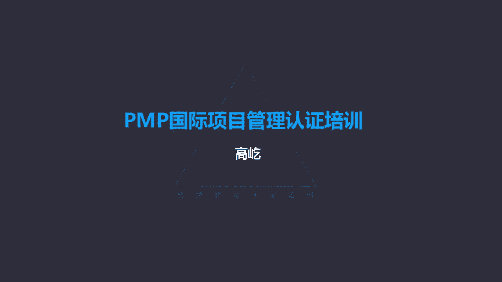
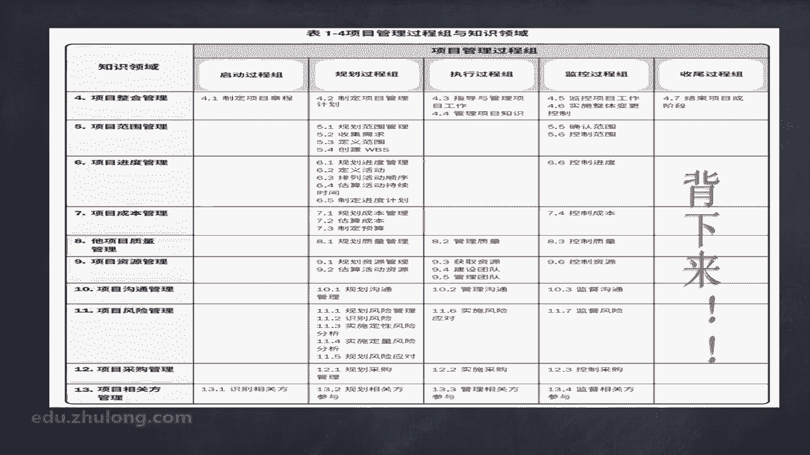

# K003-PMP项目管理认证培训 - P2：02.引论：项目十大知识领域等基本要素 ▲ - 与君共造价 - BV1eu4nerEJF

阶段和过程组在逻辑关系上的区别，我们搞清楚了唉，阶段是按顺序排列的，而过程组呢是交叠的关系，不要光从它的名称来判断启动规划，执行监控收尾是彼此交叠的，而不是顺序，那我们再看看他们分别要执行多少次呢。

诶我们看下面那个图，上面呢，还是一个项目的通用生命周期的一个结构，分成了开始项目，组织与准备执行项目工作和结束项目啊，这每一个都相当于一个阶段，阶段与阶段中间这个菱形，下面图例告诉我们了。

这就是阶段关口呃，每个阶段执行一次，按顺序执行，开始项目哎，这个阶段完成了，经过阶段关口的判断没问题，就进入组织与准备阶段，组织准备阶段完成了，经过阶段关口的评估审核没问题，进入执行项目工作阶段。

这个阶段再执行完了，又进入阶段关口审核再没问题，唉，最后结束项目，所以每个阶段原则上呢只执行一次，按顺序排列，那我们来看看过程组，从图里面看出了五个过程组，启动规划执行监控收尾，唉。

这个过程组被分布到了每一个阶段里面，你看开始项目这个阶段里面要用到启动规划，执行监控收尾，五个过程组唉，这一个箭头指过去了，那么到了组织与准备这个阶段呢，哎又会用到启动规划执行监控收尾五个过程组。

同理执行项目工作，还有结束项目，这两个阶段也会用到启动规划，执行监控收尾所有五个过程组，那么通过这个图我们就知道了，过程组执行几次呢，在一个项目生命周期里面要多次反复执行。

也可以说这个生命周期划分了几个阶段，那么他就应该执行几次啊，几个周期的这五个过程组，那么这五个过程组其实上啊，在每个阶段都要充分的得到一个执行，我们也可以把每个阶段看成是一个相对独立。

相对完整的小项目或者叫子项目，那么这个时候既然它是一个单独，相对独立的子项目或者叫小项目了，当然会用到所有过程组，可能用到的所有过程哎，所以这个时候，我们就不能从这个阶段的名称来判断了。

比如哎题目里面说项目进入规划阶段，注意啊，进入的是规划阶段，那么应该应用哪些过程和哪些过程组呢，你只用规划过程组的相应的这些个过程吗，不对了，虽然这个阶段的名字叫规划过程，但是唉这个规划过程单独来看。

它就是一个相对完整的小项目，也有明确的开始，明确的结束，它既然是一个相对独立的项目了，那么就应该用到从启动到规划到执行，监控到收尾，所有过程组可能用到的所有过程，唉同理不管这个阶段叫什么名字啊。

跟阶段的名字没有关系，只要是一个阶段，那么就可能用到所有过程组用到的所有过程，唉所以呀我们要搞清楚项目阶段，项目管理过程组，还有呢项目生命周期，他们的这个区别跟联系哎，要搞清楚嗯。

那下面我们看看呃项目管理的知识体系框架，我们用一个房子的示意图来看范围，进度成本质量，这就像一个房子的基础一样，地基也很重要，任何一个项目要想实现目标，要想顺利的完成范围，进度成本质量这四方面。

这是硬指标，这是必须要满足的，但是仅有这四方面，这是不够的，我们还需要资源管理，及时获取到所需要的必要资源，既包括人，也包括物，包括合理的管理，合理的应用，包括及时的释放资源。

唉资源管理对于目标的达成非常重要，还有呢相关方管理，相关方在以前的版本里面又叫干系人，咱们现在第六版项目管理知识体系指南，这里面把他的名字改成了叫相关方，那些与项目有利益关联的个人群体或组织。

因为有利益关联了，那么当他们的利益受到项目过程或结果，正面的影响的时候，他们就会积极主动地帮助项目实施啊，帮助项目得到推进，实现目标，反之如果他们的利益在项目的过程或者结果中，受到损害了。

受到不利影响了，这些人啊，那也会积极主动的来抵制甚至破坏我的项目，所以对相关方如果失去了必要的管理和控制，那么这个项目要想顺利的达成目标，顺利完成很难了，所以啊对相关方要做好管理工作，还有呢采购管理。

我们要对外采购，采购产品，采购服务，采购原材料，虽然有采购就会有合同，有合同就可能会有罚则，但是如果我们仅仅依靠项目里的罚则，来对供应商进行约束的话，就算你罚他了啊，他已经造成了不良的后果了晚了。

所以啊我们要提前介入，在采购的全过程，对我们的供应商做好必要的规划管理和控制，采购管理也很重要，还有沟通管理，与人打交道就少不了沟通，上级呀，下级平级同事，客户啊，供应商团队成员。

所有这些相关方都是我们需要沟通的对象，如果有一个高效的沟通，那么项目工作进展呢就会更顺利，反之如果沟通出现了问题，项目工作也会受到不利的影响，就像房子的屋顶一样，项目的全过程每时每刻都可能遇到风险。

那么对风险管理如果做的及时做的到位，这个项目啊就能够更好的得到实施啊，更好地实现目标，反之如果风险管理出现了疏漏，随时随刻这个项目都可能遭受到重大的打击，甚至直接导致失败，项目工作又是一个整体。

叫牵一发动全身，你比如说我关注进度，工期很重要，但是如果我们只关注进度，那你就可能导致范围出现了问题，偷工减料了，范围不完整了，可能成本超支了，可能质量也不能满足要求，那另一方面，若高度关注质量。

质量是生命啊，质量最重要，重视质量没问题，但是如果只重视质量，那也可能出现进度延误，成本超支的情况，所以一个项目要想最终顺利的实现目标，项目要想真正达成一个成功的一个结果，那么方方面面还要协调整合。

那么我们把这整合范围，进度成本质量资源沟通风险采购，还有相关方，这十个方面就叫做十大知识领域，那么这十个知识领域也构成了项目管理，知识体系的框架，那么接下来这也是我们要学习的一个重点内容。

在咱们大后书上书的25页有这样一个表格，这个表格的横坐标是五个管理过程组，启动规划执行监控收尾，纵坐标是对应的十个知识领域，那么表格里面分布着一共49个过程，这个表格各位您呀一定要把它背下来。

得能把它默写下来，为什么呀，因为后期啊那我们在做做题目的时候，你就会发现这个顺序关系特别重要，每个知识领域有多少个过程，这些过程是按什么样的顺序执行的，这帮助我们来判断正确答案特别有价值。

所以啊强烈建议您啊，这个表格一定把它背下来，怎么背呀，横着背，也就是你得知道每个知识领域对应的，这些个过程是按什么顺序执行的，先做什么过程，再做什么过程哎，最后做什么过程，一定按顺序把它记下来。

这个背其实也不难，您每天把它抄一遍，这个表格抄一遍，花10分钟的时间也不用多，每天抄一遍，每天抄一遍，用不了一个月，您肯定把它背下来，这也是咱们整个这本书，项目管理知识体系指南的唉，这样一个讲解顺序。

就是按照对应的这些个过程依次来展开的，所以这个表格特别重要，你一定重视。

我们再往下看，这样三个重要的概念叫工作绩效数据，工作绩效信息，还有工作绩效报告，什么是绩效数据呢，啊绩效数据执行活动中收集到的原始观察结果，测量值啊，注意绩效数据有这个特点，它是原始的。

是没有经过任何加工的，看到什么就记录些什么，发现了什么哎就把它记录下来，所以绩效数据是最基础啊，最原始的信息数据，这叫工作绩效数据，还有呢叫工作绩效信息，进球信息就不是原始的数据了，它是在对原始的数据。

这个工作绩效数据进行归纳整理，合理归类的情况下，在完成的也就是经过了一定的加工归纳整合，唉，这样得到了这个绩效信息，而绩效报告呢绩效报告是一个相对正式的文件，他要让我们那些重要的相关方领导啊，客户啊。

来了解我们项目当前以及整体的一个工作状态，工作绩效情况，工作绩效报告一般有固定的格式，里面记录项目的绩效状况，那么这样三个概念，绩效数据，绩效信息，还有绩效报告，注意它们的区别，首先来说谁来用。

或者说给谁看的绩效数据，绩效信息，这是我们团队使用的，我们自己可以查阅这个数据，这个信息不能给相关方看，不能给客户领导看，要么太原始，太初级了，要么呢这里面可能有一些敏感的啊，不需要他们知道的一些情况。

那么绩效报告哎，这个是专门给这些个领导啊，客户啊，发起人啊，这些重要的相关方给他们看的，来向他们汇报我们工作的当前状况，绩效水平，而绩效数据呢是对原始初级的绩效，报告呢是最后加工整理的一个成品。

所以注意它们的不同，那么下面我们有个概念叫裁剪，什么叫裁剪呢，也就是选择适当的项目管理过程，包括输入工具，技术输出，咱们刚才说了一个项目生命周期里面，可能划分很多的阶段，那么每个阶段。

我们可以把它看成是一个相对完整的小项目，或者叫子项目，在这些完整相对完整的小项目，子项目工作执行过程中，那我们就可能用到所有过程组，可能包括的所有过程，那当然并不是49个过程都要用到，用哪些不用哪些。

谁来决定呢，项目经理和团队我们自己决定，包括哎这一组一组的标准动作啊，这所谓的过程，这个过程里面用到的所有输入，所有工具与技术和所有输出，是不是在每一个具体工作环节里面，都要得到体现，得到运用呢。

唉也不是用与不用谁决定啊，项目经理团队，那么这还包括发起人或者组织管理层，合作进行裁剪，也就是选择的意思，所以这里说的裁剪诶，指的就是我们来根据具体的工作需要，选择合理的啊，必要的这些个过程。

输入工具技术和输出，这个选择的过程我们就叫做裁剪，下面的概念叫商业文件，项目管理，商业文件，商业文件分成两部分，一部分叫商业论证，还有一部分呢叫效益管理计划，我们先得明确这个商业文件的构成，哎记住啊。

这两部分一个是商业论证，一个是效益管理计划，那么商业论证和效益管理计划，这个商业文件是什么时候出现的，是谁来完成的呢，通过书上那个题这个截图哈，我们发现了，你看通过需求评估，我们得到了商业论证。

那进而呢我们获得了效益管理计划，但是我们发现，这个具体工作是什么时候完成的呢，项目前期准备工作，注意啊，他是前期准备工作，所以哎这个前期的准备工作，不属于项目生命周期的范畴。

按照美国项目管理协会这套理论啊，根据他的观点，项目的生命周期从什么时候开始呢，从章程的签发开始，那么前面的论证评估过程，这个项目到底可做不可做呀，在商业上是否可行啊，值不值得做呀，唉这种评估论证的工作。

那么PMI认为这个工作肯定是有的，任何一个项目不能拍脑袋，凭经验啊，说做就做，说不做就不做，一定前面有一些论证评估的过程，但是这个论证评估项目是否可以得到执行，确立这些具体活动，它叫项目以外的工作。

或叫项目前期的准备工作，这些工作应该有，但是它不属于项目生命周期，项目生命周期从什么时候开始呢，这个项目已经决定要做了，接下来我们要任命项目经理，给项目经理授权，项目正式开始了。

所以这个时候生命周期才正式启动，因此啊商业文件啊，无论是商业论证还是效益管理计划，我们发现了它都是项目前期就有了啊，它不是项目生命周期内部来完成编写的，之前就有了，那我们分别看看他们有什么内容。

商业论证，商业论证就是文档化的经济可行性研究报告，刚才说了，任何一个项目在执行之前，一定要有这样一个可行性研究的过程，只不过这个过程，我们不属于项目生命周期的范畴，但是他一定会有那么这个过程得到的结果。

结论啊，结果就是商业论证，所以商业论证里面我们能够看出什么呢，列出了项目启动的目标和理由，我们要有明确的目标，包括为什么做这个项目啊，这些信息从哪能得到呢，商业论证，商业论证里面记录了项目的目标。

还有理由，那我们再看看效益管理计划，效益管理计划也是项目前期完成的，商业文件的一种，这里面描述了项目实现效益的方式和时间，注意他描述了实现效益的方式和时间，但是啊不能把效益管理计划和项目管理计划。

等同起来，换句话说，现在得到的效益管理计划，这个时候项目还没有开始，并没有得到执行，这是我们评估阶段，论证阶段得到的结果，我们得知道我们的这个效益是怎么去实现的啊，包括什么时候能够实现效益。

比如说我能挣100万，能挣100万，这是个目标，这个信息在哪去找呢，刚才说的商业论证，商业论证里面有目标，那么效益管理计划就会告诉我们，怎么去挣到这100万，什么时候能够挣到这100万。

这是一个效益管理计划，虽然它里面告诉我们了哎怎么去得到的，什么时候能够实现这个目标，但是我们在具体的项目执行过程中，是不能以效益管理计划作为指导作为依据的，要靠什么呢，要靠项目管理计划哎，这是区别。

要注意再有项目的成功标准，按照传统的观点来说，什么叫项目的成功啊，那就是刚才我们看到那个小房子的模型，房子的基础范围，进度成本质量，这四方面如果都满足要求了，这样的项目你就要成功了。

但是成功的标准现在复杂了，因此说确定项目是否成功，这便成了我们项目管理过程中啊，常见的挑战之一了，你看没有那么简单了，不是那样非黑即白了，它变得复杂了，当然时间成本范围质量唉，这些个所谓的硬指标唉。

他一定是确定项目是否成功的重要因素，甚至叫最重要因素，你都超期了，成本超支了是吧，该实现的功能都没有，质量有缺陷，那显然这样的项目是不可能称之为成功的，但是如果仅仅做到了时间满足要求，成本没有超支。

该有的功能都具备了，质量也满足要求，那这样的项目就等同于成功吗，没有，这时候我们还会有其他更多的角度来衡量了，那比如说有可能一个项目啊，从范围进度成本哎，包括这个呃预算等等这几个方面来看是成功的。

但是商业角度并不成功，什么叫商业角度并不成功啊，别忘了我们前面讲了一个项目得以确立，这个项目得到实施，他的原因，他的依据是什么呢，要创造商业价值，他只有能够创造商业价值，这样的项目才应该能得到被执行啊。

得到执行了，这样的项目才能够算作成功，虽然没有超期，没有超支，满足要求了，功能都有了，但是如果没有实现商业价值的提升，那么这样的项目也不能称之为成功，所以咱们书上啊给出了项目成功的一些标准。

哎你看这里面包括一些，比如叫商定的财务测量指标，这属于叫有形的商业价值净现值啊，投资回报率怎么样，内部报酬率达到多少，回收期多长，包括效益，成本比率等等这些个具体概念。

我们在后面成本管理章节还会再给大家做介绍，但是另一方面，那还有其他的这种衡量标准，比如说达到组织的战略目的和目标，比如是不是让相关方满意了，包括是否遵循了企业组织的治理规则等等。

总之啊项目的成功标准现在变得更加复杂，那么这也是对我们项目经理，包括项目团队顺利完成项目工作，最终实现目标提出的一个刚才说的挑战。

