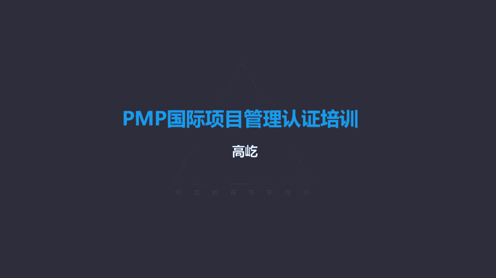
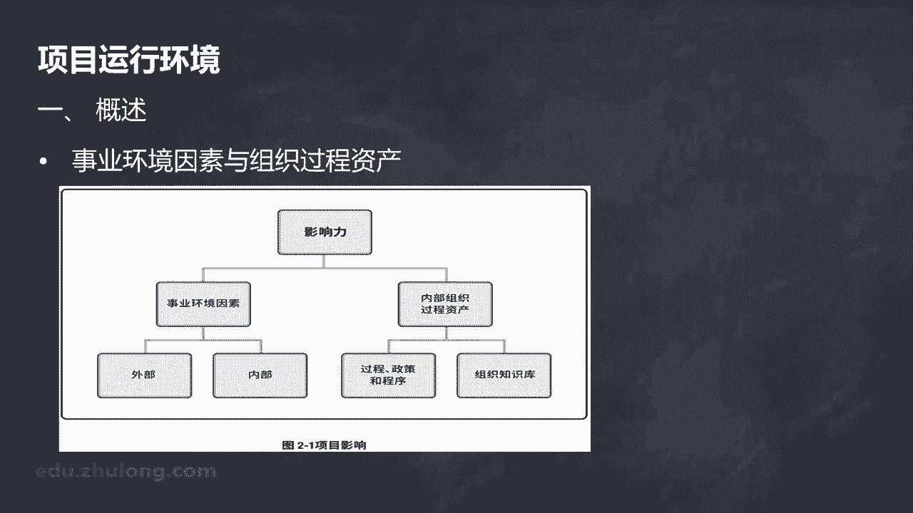
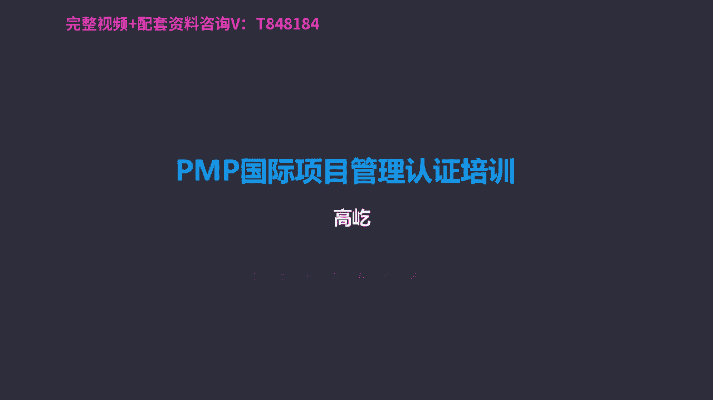

# K003-PMP项目管理认证培训 - P4：04.项目运行环境及组织结构 ▲ - 与君共造价 - BV1eu4nerEJF

这个章节我们主要介绍一下，在具体项目工作以外，对项目可能产生影响的各种要素，首先我们看到的是，事业环境因素和组织过程资产，从这个示意图上我们可以看出来，事业环境因素和组织过程资产。

都能够产生这种所谓的影响力啊，他们是影响力的不同表现，而事业环境因素呢，又分为内部的环境因素和外部环境因素，组织过程资产包括两部分，过程政策和程序，还有组织知识库，具体内容我们下面仔细来看。

首先啊事业环境因素，什么是环境因素呢。

它的特点是团队不能控制的，这是它最本质的一个特点，我们项目经理和团队只能接受接受他的影响，在他的影响下，在他的约束下来完成对应的工作啊，不可控，这是事业环境因素最大的一个特点。

那么这些不可控的环境因素从哪来呢，啊包括内部的，也包括外部的，那么当然这个内部跟外部相对于什么而言呢，相对于项目活动，相对于项目活动以内的，比如我们项目所在的组织，所在的单位公司，这属于内部环境因素。

而以外的我们公司，我们组织之外的啊，更大的这种社会环境，他们产生了这种制约，叫做外部事业环境因素，既然是不可控的，那么这种环境因素对我们的工作，一定会起到这种约束限制作用。

但是这里的限制不要把它单纯的理解为阻碍，它也可能起到促进的作用，所以这里面也提到了，事业环境因素对项目结果可能产生积极，也可能产生消极的影响，我们看看哎他的环境因素的具体组成，比如内部事业环境因素啊。

组织的文化呀，哎结构治理，咱们单位，咱们公司当前的比如基础设施，我们的资源可用性，目前现阶段我们既有员工的自己客观能力表现，这都是内部的环境因素，这些因素我们很难去改变，它只能接受，还有外部的。

比如市场条件，这个范围就比较大了，再比如法律的限制，不光我们自己项目团队要遵守，我们所在的组织单位，公司要遵守，全社会整个行业都要遵守的，所以这属于外部的事业环境因素，还有政府行业标准啊。

包括这里专门提到的叫商业数据库，什么是商业数据库呢，一看看到商业两个字啊，我们能够理解，简单的来说，面向公众的，不是专门为你这个项目量身定做的，换句话说，花钱就能买到的这些个信息，这些个数据。

这就叫商业数据库，比如有一些行业，每年会专门出版，发行一些类似叫行业年度研究报告，它是针对整个行业的，它不是针对具体某一个单位，某一个公司，甚至说某一个具体项目是在更大的范围里面唉。

对这个行业他所在的呃，这个环境进行一个研究评估，所以这些信息他不是专门为某个项目准备的，面向公众，我只如果有需要的话，我花钱就可以买到这些内容，我们就叫商业数据库，它属于外部的事业环境因素。

那我们现在看到了啊，什么是内部的，什么是外部的，哎这种只能接受不能改变的制约哎，那我们就能理解了，这种制约既可能是负面的，也可能是正面的，比如对我项目可能产生这种阻碍，限制和负面作用影响的环境因素嗯。

我们公司是一个生产这种高能耗产品的企业，现在国家对环保要求很严格啊，都要求节能减排降耗，在这样的大环境下，我们生产呢又是一种高能耗的产品，那显然你就要受到一些制约，比如生产的配额数量是有限的。

比如说不断的对你进行检验测试啊，甚至呢有一些超过排放标准的，是禁止生产销售的，那当然这对你的工作，对你的项目就是制约，就是负面的阻碍作用，那反之也可能是正面积极的促进作用，还是这样一个大的背景下。

当前国家倡导节能减排，绿色环保，正好我们就是生产一个节能产品的，这种降低能耗，降低污染的产品，那么这类的产品就可能得到相应的政策扶持啊，包括补贴，你看同样是环境因素，对我的项目工作既可能是促进的。

也可能是阻碍的，但是促进也好，阻碍也好，它的本质是一样的，也就是不可改变，对于我们团队来说是只能接受的，这是一种限制因素，说完事业环境因素，我们再来看看组织过程资产，组织构成资产它的特点了。

这是执行组织特有并且使用的计划过程，政策程序，还有知识库，诶，这里又出现知识库了，刚才我们刚刚看到的事业环境因素，里面有一个叫叫商业数据库，唉，商业数据库刚才说了，那个是面向公众的。

不是专门针对某个具体的项目，某个具体的企业组织商业嘛是吧，花钱就能买来的，所以它体现的是一种工具的属性，而我们这里提到的组织过程资产，这里的知识库，这里是我们执行组织特有并使用的。

那换句话说是专门为我们这个项目啊，为我们这个组织量身打造的，或者说叫私人定制的，这些个知识库里面包括什么呢，啊主要包括经验教训，历史信息，以往的项目成功的经验，包括失败的教训，对我当前的项目。

包括我未来项目的阶段，能起到很好的参考借鉴作用，这些信息我们都属于叫组织过程资产啊，组织过程资产相对于事业环境因素而言，那么它存在于组织内部啊，这是内部的，能够对我们的项目工作有直接的指导帮助作用。

因此说在整个项目期间，项目团队成员要对组织过程资产，进行必要的更新补充，也就是为后续的工作环节继续提供提供支持，提供帮助，那么刚才说的事业环境因素，更多体现的是一种制约限制，虽然这种限制可能是正面的。

也可能是负面的，总之呢它是一种约束的力量，而组织过程资产因为它体现的是经验教训，因此呢对我们项目工作，更多起到的是积极的推动，它是正向的作用，这是组织过程资产的一个概念，唉组织过程资产包括两部分。

一个是过程政策和程序，一个是组织知识库，组织知识库刚才说过了哎，以经验教训为代表，能给我们当前的工作提供有益的参考借鉴价值，那么另一部分过程程序政策，你看刚才我们说的事业环境因素里面，也会涉及一些政策。

一些程序唉，但那些政策程序，它不是专门针对我们当前具体项目的，它针对更多的项目，甚至是针对行业，针对公众的更高层次的，更刚性的哎，那就是事业环境因素，而专门为我们这个项目打造制定的唉。

这个叫组织过程资产，比如举个例子，公司的考核制度，考勤管理，你看这是针对公司上上下下，所有人都有约束力的，那么这个属于什么呢，这就是视野环境因素，那么组织过程资产，什么是组织过程资产的例子呢。

你看我们以前公司哈就有这样的考勤要求啊，早上08：30必须打卡，08：30以后你再打卡，那就算迟到了，如果一个月有三次迟到，你在考核里边就会有体现扣工资啊，啊扣绩效等等，那么这个要求上对领导。

下对员工大家都要遵守，那显然这就属于事业环境因素，哎但是我们自己这个部门有点特点，我们是用服部门，我们负责设备系统的交付，因为我们的工作特点决定的，经常啊要后半夜工作，客户的系统出现故障了，要处理。

或者说系统需要升级，这时候我们经常要晚上，比如夜里12点开始操作，到早上凌晨凌晨大概4。4点以前要恢复，你看我们是后半夜工作，如果我们还得早上08：30就来打卡，这个有点有点太疲劳了。

哎那么领导很关心我们，领导专门给我们制定了一个一个一个制度啊，就是如果我们头天晚上加班了，晚上去处理故障也好啊，系统升级也好，那么第二天早上你就不用08：30打卡了，只要不晚于中午12点，不算你迟到。

但是这个制度只要不晚于12点打卡，也不算迟到，这个只适用于我们这个交付部门，只有我们部门享受这个待遇，因为我们工作特点决定的，其他部门你就得早上08：30晚了，晚了就算迟到，那你看针对我们自己部门。

制定的这样一个考勤管理办法，如果头天晚上加班了，那么第二天只要中午12点前打卡，唉就不算迟到了，这个制度这个政策就相当于组织过程资产，这是专门为我们定制的，跟别人没有关系，而那个每个人都要遵守的啊。

08：30不能再晚了，再晚算迟到，这个就属于事业环境因素啊，再严格的说呢，这叫内部的事业环境因素啊，这是公司的政策，好说完事业环境因素，组织构成资产，我们接下来再看看组织系统。

组织系统这里面包括内容比较多哈，什么管理要素啊，治理框架呀啊，更重要的考试里面一个重要的考点，就是组织结构类型啊，组织结构类型在在我们书上给出了很多，这个表格里面，你看各种各样的组织考试里面。

我们没有那么复杂，您只要掌握以下三种三大类就可以了，分别是职能型，矩阵型，还有项目型，而矩阵型组织这里面又包括了三类弱矩阵，平衡矩阵和强矩阵，我们分别要知道，不同的组织结构有什么样的特点，包括他的优点。

包括它的缺点，还有呢它对应什么样的具体工作工作内容，我们先看一看职能型组织，职能型组织又叫直线型组织，这也被认为是最传统的组织结构，他的特点，每个职能部门下面有若干的员工，那么职能部门的领导。

我们这里边叫职能经理，有时候也叫直线经理，这两个说法是一样的，哎这种组织结构的特点就是职能部门划分清晰，每个部门谁来负责呢，职能经理负责，所以所有权力都集中在职能经理身上，唉这样的组织结构。

我们看到项目的协调，上面的红的虚线框是在职能经理这个层面上，这是什么意思啊，你看下面啊，黄颜色的这个职员代表项目组成员哎，每个项目成员完成自己对应的工作，如果只完成自己部门的领导安排的工作还好。

那么如果要跨部门问题就来了，比如说最左侧的唉这位员工A部门，A部门的员工诶，他的工作里面需要隔壁啊，他右边这个部门里面B部门的某位员工的支持，需要他配合，那么他找的这位员工去了，比如哎小张小张。

你看能不能帮个忙啊，啊这个工作能完成吗，那各位想想，小张听了他的这样一个请求会怎么反馈呢，他会怎么表达呢，没错你呀，你找我领导去，你别跟我说，你得跟我领导说，我领导同意了，我才能做好。

那么A部门的这位员工，会直接找到B部门的职能经理去吗，显然不行，那他找谁啊，找自己的领导啊，找自己部门的领导，通过自己部门领导在跟这个B部门的部门领导，这两个领导之间在协调再沟通。

那如果两个部门领导之间通过这样一个沟通，能把问题解决，那么这个工作安排下来了，可是如果部门领导不能协调解决不了，那怎么办呀，问题还要继续升级，还要找领导的领导，所以我们看到哎项目里面工作的问题。

协调员工之间是不能直接沟通的，都要通过自己的部门领导哎，有事了，你找我领导去吧，我领导答应了，我就干，我得听领导的，这是职能型组织的一个突出特点，所以职能型组织啊，首先职能划分清晰。

每个部门就专门负责每个部门自己的工作，跟别人没关系，再有呢职能经理负责所有的部门工作，在这种组织结构里面，我们看不到所谓的项目经理，你看这里没有项目经理这个称呼，有问题有问题，要通过领导才能协调。

跨部门沟通难度很大，这是他的缺点，那么当然他也有优点，职能型组织最突出的优点是什么呢，上传下达部门内的执行力比较强，既然大家都听部门领导的，那么领导让我干什么，我就干什么，你怎么这么听话呀。

那当然得听话呀，包括对员工的考核啊，所以啊员工的工作表现，员工的评价都在部门领导手里攥着，你当然得听领导的，所以这种情况下唉，我们应该能让这种相对简单的问题，得到一个高效的解决。

这是职能型组织的一个特点，那我们再看看，再往后叫弱矩阵，弱矩阵组织，既然是矩阵组织了啊，那显然要跨部门了，虽然是跨部门哎，项目协调下沉了，团队成员之间可以交流了，但是既然叫弱矩阵。

那显然更多的权力还是集中在部门经理的身上，职能经理说了算，因此啊我们在这样的组织里面，依然看不到所谓的项目经理，那有问题要找谁呀，还得找部门经理，找职能经理解决，但是呢他能做一些简单的跨部门的工作。

进一步发展叫平衡矩阵了，哎平衡矩阵组织有特点了，首先他跨部门工作，另一方面我们终于看到了项目经理的身影，在平衡矩阵组织里面哎，有了有了专门的项目经理，但是这个时候的项目经理是专职的，还是兼职的呢。

他的身份是什么情况呢，注意平衡矩阵下项目经理是兼职的，你看这个示意图哎，最左侧最下面这位项目经理，他是属于某个职能部门的，在具体项目里面他是项目经理了啊，他得到正式的任命，有明确的身份了。

但是他是属于某个职能部门，项目结束了，他又恢复了他普通职员的身份，只是在某个具体项目里面，他被任命为项目的负责人，所以平衡矩阵下项目经理是兼职身份，唉这个要注意，另一方面。

既然有明确的项目经理的这样一个身份了，那么他就得到了对应的授权，因此平衡矩阵下项目经理有了明确的身份，有了明确的权利，而且按照我们项目管理，知识体系的这套理论来说，权利相等，原则上是平级关系。

所以既然是平级关系了，那么项目经理跟职能经理他们两个人之间，如果有什么问题怎么来解决呢，注意这个原则叫友好协商，咱俩平级关系，既然平级，谁也命令不到谁，谁也不能要求谁，当然谁也不用请求谁。

哎这些个字眼儿都不代表是平衡矩阵，平衡矩阵，项目经理，职能经理，他们两个人之间一定是友好协商，有问题了，商量着来，甚至通过叫谈判，通过谈判的方式来让问题得到解决，这是平衡矩阵的特点。

那么既然我有权利得到授权了，好，我就可以直接给各个部门的团队成员下达任务，安排工作，这时候我让你干什么，你别再跟我说去找领导了，你你跟我领导说去吧，我不用跟你领导说了，我就是你的领导。

我现在是你的项目领导，因此在平衡矩阵下，项目经理能够直接把要求，把任务传递给不同部门的团队成员啊，所以说他的沟通效率大大的提升了，叫组织结构扁平化了，没有中间那么多层级了，项目经理可以一竿子捅到底。

沟通效率提高了，而且更突出的特点，因为他有了正式的权利身份诶，他可以打破部门间的壁垒，让跨部门的沟通变得可行，能够跨部门沟通了，那么这里要注意跨部门沟通，各位想想是简单呢还是复杂呢，一定是复杂的。

因为部门与部门之间啊，咱们有各自的利益，有各自的职责，因此这种跨部门沟通虽然变得可能了，但是一定不轻松啊，跨部门沟通是个复杂的活动，另外平衡矩阵组织还有一个特点，那就是每个员工他出现了两位领导。

我们叫双重领导，什么叫双重领导啊，你看既有职能经理，你的部门领导，同时呢你还有项目经理的项目领导，这种双重领导是平衡矩阵组织特有的一个特点，因为二位领导评级，所以对于员工来说。

有的时候就可能哎出现一些比较尴尬的情况，两个领导如果不能沟通协调好喽，那可能员工不知道自己该做什么了，职能经理让我干这个，项目经理让我干那个，那我听谁的呀，两边都是领导，所以这也是平衡矩阵的一个特点啊。

那么再有平衡矩阵组织，特别适用于解决那种叫跨部门复杂的项目工作，由多个部门共同配合完成的，比如需要研发的测试的，生产的，物流的，交付的，市场的，财务的各个部门，大家要相互支持，相互协调。

这样才能共同完成的工作，我们优先考虑用平衡矩阵组织，咱们在PMP考试里面，有这样一个默认的潜规则，如果题目背景里面没有明确说明，什么样的组织结构，默认就是平衡矩阵啊。

这个组织结构是在平衡矩阵下来完成工作的啊，所以这个请大家记住，再往后发展叫强矩阵组织这样一个组织结构，我们发现呀，在职能部门里面出现了项目经理部门负责人，那也就意味着现在的项目经理变成什么了呢。

变成专职了，刚才的平衡矩阵唉，项目经理虽然得到了任命，但是他的身份是兼职状态，本质上它就属于某个职能部门的，在具体项目里面，他是项目的负责人，被任命为项目经理了，但是项目结束了，他又变成了普通的职员。

而在强矩阵组织里面有了专门的项目经理部门，所以啊这时候的项目经理专职了，哎这个项目我是项目经理，到了下个项目，我还是项目经理，我的身份就是专职的项目经理，那么在强矩阵下。

项目经理的权力开始大于职能经理了，那么项目经理可以直接给职能经理，提出具体的要求啊，甚至说命令，因为我权力比你大了，这是强矩阵型组织，那么再后往后发展发展到极致了哈，叫项目型组织了。

我们发现项目型组织它的特点，这里边没有职能部门了，我们找不到职能经理了，各个项目为单位，唉这样的组织结构下，每个项目经理都拥有了足够大的权力，那么在项目过程中，它可以调动使用理论上它所需要的所有资源。

能够集中资源了，那么就能够解决更这个重大更复杂的项目工作，所以项目型组织，解决什么样的具体问题比较合适呢，叫急难险重，时间紧迫，意义重大，风险高啊，责任大，这样的项目我们应该应该优先用项目型组织。

因为项目型组织项目经理的权力最大了，那么通过权力就可以获得资源，有了资源的支持，工作能得以开展，比如题目里面说雨季就要到了，仓库的房顶修缮工作还没有开始，领导把这个责任交给你了。

那么你应该组建一个什么样的团队呢，一定是项目型的，你看雨季马上就要来了，时间紧迫，在这样的情况下，应该最高效的完成工作，所以啊项目经理要体现他更大的权力了，能够协调资源，整合资源。

才能完成这样紧急的工作，所以项目型组织优先解决急难险重的任务，项目经理全职工作，不光项目经理了，连项目成员也必须是全职的，不能兼职，那这样的情况下，它的缺点也出体现出来了，就是可能造成资源的浪费。

包括可能对别的项目造成伤害，这怎么理解呀，哎你看你有权利，你通过你的权利，把有限的资源都集中到你的项目上来了，那别的项目可能没有资源可用了，所以啊还可能影响到其他项目啊，这个也要注意。

这是项目型组织的特点，那我们最后总结一下啊，不同组织结构的一个特点的比较，当项目简单，不需要多部门跨部门协调的时候，我们就要优选职能型，如果项目非常重要，要最大限度集中资源的时候，优选项目型啊。

如果没有项目型，我们就选择强矩阵型，如果涉及多部门跨部门的时候，要高度协调，优先选择平衡矩阵组织，那么默认的我们的组织结构就是平衡矩阵，这个请大家要记住，那么最后我们讲一点啊，项目管理办公室啊。

项目管理办公室有三种类型，支持型，控制型和指令型，那么它的特点支持型给项目提供支持，这是一种参与力度最小的组织方式，哎我给你方法工具了，给你的建议用不用在你自己，而控制型呢控制型的PMO。

我给你的方法工具，你就必须使用控制力度加大了，而指令型呢会直接派出项目经理，任命项目经理，包括参与具体的项目工作，哎这个对项目的管控力度最大，这是项目管理办公室的三种类型，那么它的主要作用是什么呢。

哎我们看提出了这些呃，管辖全部项目的共享资源识别，开发新的方法工具，最佳实践啊，包括辅导培训给项目经理，提升他的项目管理能力等等，包括开发一些必要的方法工具模板，还有重要的协调项目之间的沟通。

哎这都是项目管理办公室的啊，这样一个重要作用，那么但是大家一定要注意，如果题目里面出现了这样的问题，说项目经理遇到什么什么情况了，选择选项里面有一个向PMO求助，由项目管理办公室协调解决。

注意这个选项是错的，哎，不能选，有问题，为什么不能找PMO呢，注意啊，我们答题有一个原则，也就是项目经理不管遇到了任何问题，第一时间一定要自己想办法解决，自己解决不了了，再去找PMO啊。

所以说不是不能找的，可以找，但是第一时间不能去找PMO，因此如果选项里面出现了啊，遇到什么问题了，求助PO这个选项就错了啊，不是不能找，而是不能第一时间去找他，应该首先自己想办法解决。

包括跟团队开会协商等等，唉那些才是正确的选项，这个特别要注意，项目管理办公室是一个职能部门，它是个常设机构，不要因为是项目管理办公室就认为有临时性哎。

