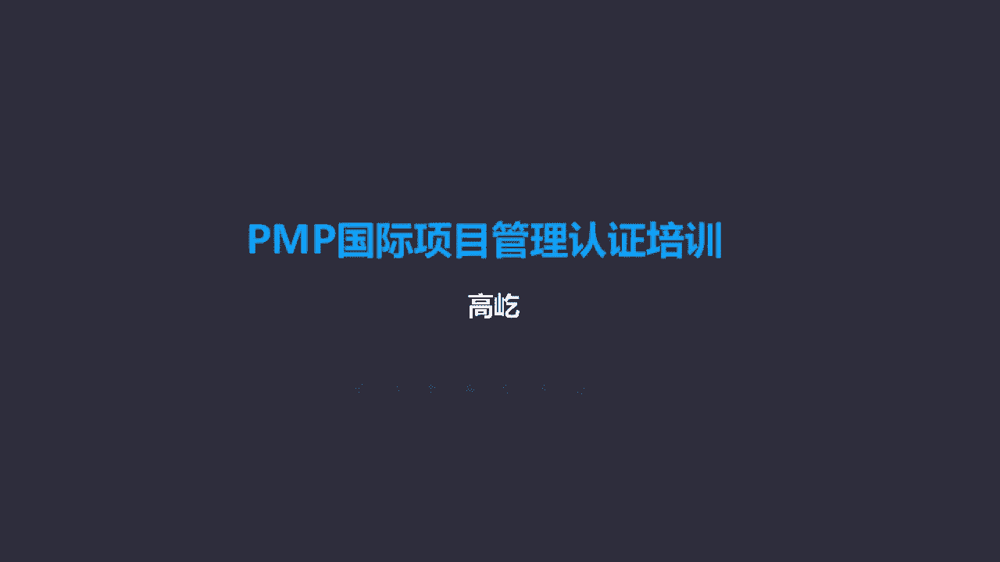
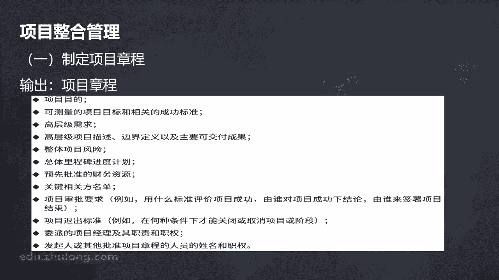
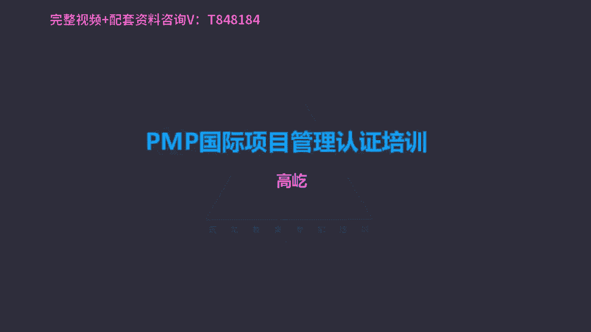

# K003-PMP项目管理认证培训 - P6：06.项目整合管理：制定项目章程 ▲ - 与君共造价 - BV1eu4nerEJF

整合管理，从这个章节开始，我们将把项目管理知识体系指南里面，涉及的十个知识领域逐一做一个讲解，我们先看到的是整合管理，整合管理干什么的呢，书上说了，包括对隶属于项目管理过程组的各种过程。

和项目管理活动进行识别，定义，组合统一和协调的各个过程，哎这个是整合，所以咱们前面也讲过了，整合整合的本质就是协调，那么具体要协调哪些呢，比如协调资源的分配，资源有限，在有限的资源下。

怎么让项目能够得到必要充分的满足，再有平衡竞争性的需求，各种备选方法的一个使用，还有为项目目标而裁剪过程哎，裁剪也就是选择哪些过程，包括哪些具体的工具方法可用哎，这个活动我们叫做裁剪。

它也属于整合的范畴，那么还包括各个管理，知识领域之间的这种依赖关系，咱们前面讲到十个知识领域的时候，用过一个小房子的模型，那时候说过各个方面我们都要协调，要整合，你不能光关注其中的某一方面。

只关注进度或者只关注质量，包括只关注成本都是不对的，各方面要协调起来，把它当作一个整体唉，这就是整合管理的这样一个作用，整合管理的核心概念，那么首先谁来负责整合呢，项目经理哎这个责任。

或者说整合这件事情谁来做，唉，这是项目经理要承担的，那么特别强调的是，整合管理这个责任是不能被授权或转移的，这个挺特殊，咱们项目管理知识体系里面，其实特别强调的就是授权，项目经理要得到授权。

团队成员在执行项目过程中啊，在完成具体的工作的时候，也应该得到充分的授权，但是唉整合这件事是不能被授权的啊，换句话说整合协调啊，这是谁的工作呀，这是项目经理的工作，应该由项目经理负责到底啊。

对整个项目的这个整合工作要承担最终责任，这是我们的项目管理知识体系的这样一个观念，因为项目经理有他自己特殊的这样一个身份，包括他得到的任命，他被授予的权利，通过这些特定的身份权利来完成整合工作。

而这些身份权利是别的这种相关方没有的，这是项目经理自己特有的，那所以整合这件事情就要由他来负责了，那么另外各个过程之间呀，整合工作是要反复进行的，不是一次完成，所以随着工作的推进。

这种整合协调工作要随时开展，要贯穿项目始终，那么整合管理具体指什么呢，书上给出了这些整合工作的一些内容，比如确保产品服务或成果的交付日期，生命周期效益管理计划保持一致，包括编制项目管理计划，实现目标啊。

测量监督项目进展，采取必要的措施实现目标，包括管理可能需要的阶段过渡等等，整合啊，这都是项目经理应该负责完成的，那么整合管理的发展趋势和新兴实践，这里面提到了它的趋势是什么呢，整合工作变得日益复杂了。

因此啊可能需要更多的自动化工具，一些特定的软件，包括一些电子表格，通过可视化的这种方式，让复杂的整合工作能够看得见，当然看什么呀啊看的就是图表文档，看的就是一些信息，把它落实下来，转化成可视的方式。

能够有助于提高这个工作的效率，包括更加重视知识的管理，在项目的过程中，随时可能产生新的知识，新的经验教训，那么就要及时的总结，及时的应用，而且呢整合管理也开始增加了项目经理的职责，像刚才说了。

这种整合工作，这种协调的责任是项目经理自己特有的，是不能被授权的，包括其他一些这种混合的方法，这是他的一个发展趋势，还有新兴实践，那么刚才我们讲的是这种传统项目管理啊，这样的嗯。

一种特定环境下我们采取的方法，比如说整合由项目经理来完成，那么在敏捷或者适应型环境中，这个整合的责任变了，敏捷方法能够促进团队成员，以及呢啊相关领域的专家参与整合管理，你看在敏捷环境里面。

整合工作不再是项目经理自己的事情，因为敏捷团队更强调的是授权啊，叫自组织管理方式，不需要项目经理的这种所谓的管理，指导了团队成员自己来决定计划，包括整合的这种方式，所谓适应性环境下要对项目经理呃。

要项目经理要对团队成员充分的授权，那么项目经理这个时候他的责任，他主要做什么呢，他的关注点在于营造一个合作型的决策氛围，合作型的大家彼此支持，彼此配合，所以叫自组织方式，那么在这样的环境下。

就特别要求团队成员具有广泛的这种技能基础，所以啊，这也是咱们考试里的一个小小的一个考点，从第六版开始，咱们考试的过程中，开始加入了一些与敏捷相关的内容，具体信息这个敏捷的这些概念呀。

啊他的一些所谓的考点呀，我们留在最后，再单独作为一个章节给大家来详细介绍啊，敏捷团队强调的，每个团队成员都应该是全才或者叫通才，所以说有广泛的技能基础唉，这有助于大家彼此自发地来完成工作，包括互相支持。

完成了前面的这些内容，我们看看后面啊开始具体过程的讲解了，后面每个章节都是这个特点，章节一开始啊都是啊一些重点概念啊，发展的趋势，新兴实践包括在适应性敏捷环境下的一些特点。

那么接下来就是具体49个过程逐一讲解，第一个过程就是制定项目章程，制定项目章程过程啊，它是一个编写正式批准项目，并且授权项目经理，在项目活动中使用资源的这样一个文件啊，这样一个过程制定项目章程。

那么它也是一个项目活动的起点，咱们前面说过项目生命周期，它的开始是什么呢，什么标志着项目正式启动呢，章程文件的签发，所以啊没有章程，任何工作是不能开始的啊，项目章程有了这个项目才得到了批准。

因此这也是整个项目生命周期的第一个过程，看它的作用，它标志着项目正式启动，有了章程的签发批准，项目生命周期才正式开始，所以如果题目里面提到啊，这个第一件事干什么啊，或者说呃一个项目开始了。

那么项目经理首先应该干什么啊，首先比如这里面有组建团队，有编写项目管理计划，有识别风险，还有得到章程的批准，如果这样的题目的话，我们一定要选择章程，章程签发，批准了项目才开始，他是第一件事情。

章程的一个作用，标志正式启动了，那么还有另一个作用，要任命项目经理，虽然这套理论项目管理知识体系是源自西方的，但是在任命项目经理这件事上，东西方其实大家的观点是一致的，俗话说叫出师有名，你让我干什么。

可以你得给我一个名分，我是谁啊，我是项目经理，我是领导任命的领导，被批准的项目负责人，有了这样一个正式的身份了，那么后续在项目过程中，我在管理团队，我在完成工作，最后实现目标，这叫名正言顺，顺理成章。

所以项目章程的另一个作用，他正式的任命项目经理，给项目经理这样一个明确的身份还不算完，他的另一个作用，给项目经理授权，项目经理咱们前面讲过，在组织结构里面默认的背景叫平衡矩阵，平衡矩阵下。

项目经理是专职的还是兼职的呢，各位回忆一下兼职的哎，他是兼职状态的，在某个具体项目里面，你是项目的负责人，但是项目结束了，你又变成了某个职能部门的团队成员了，所以这种情况下的项目经理。

他的本质就是某职能部门的团队成员，那显然他自身不会有太高的行政权力，行政职务什么是行政职务啊，哎我们部门的领导，我们科室的主任啊，我们部门的部长，企业的CEO，我们公司的副总裁，你看这些这些是行政职务。

行政职务会带来真正有效的权利，大家敬畏这种权利，但是项目经理，特别是这种兼职的项目经理，您的本质就是某部门的一位团队成员，某部门的一位职员啊，因为你呢比如能力比较突出，你的经验比较丰富，领导又信任你。

那么你被任命为某个项目的负责人了，所以啊这样的项目经理本质上权力有限，权力不足，但是要想管理好工作，项目经理又离不开必要的权利，那所以要得到授权，在哪记录授权呢，项目章程里面。

所以啊它这个作用也特别重要，哎章程里面正式给项目经理授权了，什么样的权利呢，那就是使用资源的权利，有了资源了，工作才能得以开展，哎这是项目章程的突出的三个作用，第一标志项目正式启动。

章程签发了项目才开始，第二正式任命项目经理，给项目经理一个明确的身份，第三给项目经理授权，有了授权了，有了权利了，开展工作更加便利，这是它的作用，那么项目章程应该谁来谁来编写的呢，来我们看看项目章。

项目章程应该是项目以外的这些个机构啊，比如发起人呀，PMO啊，那么这些人他们特点就是有职务，有权利，有资源，因此啊他们能够决定一个项目的开始，所以说启动者发起人有一定的职权，并且呢能够为项目提供资源。

那因此说项目章程谁来写呀，就是这些项目以外的这些重要的相关方，有职务，有权力，有资源，但是现实工作里面，这些个有职务，有权力，有资源的重要相关方，他们会经常亲自来起草啊，来编写这样一个项目启动文件吗。

通常不会，那所以章程文件啊更多的是谁来写呢，项目经理，项目经理应该参与制定项目章程，那么当然项目经理他所谓的参与，一定是在得到允许的情况下，你不能自己我自己写一个，这叫章程了，不可能一定得到了允许。

或者说得到了认可的情况下，项目经理来起草项目章程，起草完章程了，那么由这些重要的相关方，他们来批准，他们来签发，唉这样这个章程文件就得到了，那么另外我们这里给大家一个提示哈，提醒说不要把章程看作合同。

章程跟合同有相似的地方，一会我们会看到章程的内容里面有很多的信息，感觉啊那跟合同有相关性，但是在章程里面是不存在任何所谓的报酬的，也没有任何这个钱的概念啊，所以说章程与合同完全不同，而且就算有合同了。

用合同来作为工作的一个约束，或者说作为工作启动的一个标志，就算有合同了，也应该有章程，章程跟合同是不矛盾不冲突的，那么换句话说，每个项目一定都有合同吗，不一定啊，这一定是个重要的一个概念哈。

大家要记清楚啊，不是每个项目都有合同，但是每个项目必须都有章程，因为根据我们的理论，没有章程工作，不能开始章程的签发，才意味着或者说才标志着项目正式开始，所以说章程跟合同之间，没有任何必然的这种关联性。

那我们看一看制定章程这个过程，它的输入工具技术还有输出分别都是什么，这也是我们这本书项目管理知识体系指南，它的一个主要的主体结构，49个过程就是逐一介绍每个过程的输入，工具技术，还有输出。

我们会从里面挑一些重点，来做一些详细的解释说明，比如制定项目章程唉，这个过程首先我们看它的输入里面，包括商业文件，商业文件不陌生，我们前面讲过了，商业文件，包括啊商业论证，还有效益管理计划。

商业论证里面记录什么呢，项目的目标，效益管理计划呢，实现效益的方式，还有时间唉，这个商业论证和效益管理计划，他们都属于商业文件，那么既然是商业文件了，那它就不是项目文件，不是项目文件。

说明他就不是项目经理和团队一起来编写的，前面的啊这个商业文件部分咱们看过了，什么时候出现的呢，项目生命周期之前，前面的论证阶段，有的商业文件，那么当然既然它不是项目文件，不是我们团队自己来编写的。

那因此项目经理就不能随意的更新或者修改，商业论证已经确定了，效益管理计划已经制定好了，那么项目经理是不能随便更新的啊，当然它可以应用，可以提出建议啊，这是一个比较特殊的一个文件。

因为它不属于项目的生命周期范畴，另外还要输入一个内容，就是协议，哎注意啊，说协议协议有多种形式，包括包括什么呢，有合同，还有备忘录啊，什么服务水平协议啊，意向书，口头协议，邮件等等等等。

我们注意协议他说有多种形式，包括合同，因此各位一定记住，协议不等于合同啊，不要把协议等同于合同，合同只是协议的一种，它的特点呢，那有最高的法律效力，在咱们整个项目管理知识体系这个过程中啊。

这里面有大量的文件，各种文件，文档计划唉，其中合同是有最高法律效力的文件，哎所以说协议不等于合同，合同只是协议的一种，另外还是哈再强调一遍，不是每个项目都必须有合同，比如题目说了，项目收尾了。

对于项目经理来说，最重要的文件是什么，A合同B项目章程C，项目管理计划还是D进度计划，你看这样一个题目，你怎么选呢，在收尾的时候呃，什么文件对项目经理来说最重要呢，是合同最重要呢，还是章程呢。

还是项目管理计划还是进度计划啊，这时候可能有人会选择合同嗯，合同合同得完成啊，是把项目收尾了，我们得检查是不满足了合同条款呀，是不是满足了合同要求啊，错了这道题的答案应该选择章程，为什么选择章程啊。

因为章程里面记录了什么呢，有目标，章程里面清晰详细的记录了项目的目标，收尾的时候，我们要用章程来检验来核对一下，是不是所有的目标都达成了，那为什么不能选合同呢，哎就是这个道理，不是每个项目都必须有合同。

而且就算有合同，一定，这个合同要到项目最后收尾的时候才完成吗，也不一定啊，所以啊合同啊，合同与项目与项目生命周期之间，没有必然的关联，这个请大家一定记住，制定项目章程用的工具有这么几种，首先专家判断啊。

什么是专家判断呢，基于某应用领域知识领域，学科行业的专业知识，作出的关于当前活动的合理判断，谁能做专家判断呢，唉这些人可以有具有专业学历，有知识，有技能经验，任何小组或过人都可以做专家判断。

那么所以问题来了，团队成员是不是可以提供专家判断呢，当然可以，只要它具有必要的专业知识，有特定的技能经验，那么他就能提供专家判断，来这里的专家判断，这里的专家它并不是我们传统意义上的啊。

那种所谓的专家了，因此说这里的专家判断，跟专家权力的专家不一样，前面咱们讲项目经理权利的时候，专门提到过叫专家权利，什么样的项目经理才有专家权利呀，你得有丰富的经验，得有突出的业绩成绩啊。

在某个领域里面有突出的贡献成就，您是专家了，鉴于您这种专家的身份大不大，大家钦佩于您的成就，那进而呢信任您，您说什么，大家不会质疑这个形成了一种权利叫专家权利，但是我们这里的专家判断跟这个专家权利。

这两个专家不一样了，那个专家权利哎，那个得真是有突出的成就贡献才能称之为专家，而专家判断呢，我只要有必要的知识技能，我只要有相应的经验，我就能提供自己的一些观点，那这个就叫专家判断，所以打个比方来说。

谁可以做专家判断呢，老张就可以做专家判断，老张一听这名字啊，这个人我们普通的团队成员，老张能专家判断，那么什么人有专家权利呢，张老哎嗨，张老才有专家权力，听这称呼是吧，张老我一听德高望重。

这样的人才能做，才能有专家的权利，所以注意啊，不要把专家判断想的呃，这个太高大上了，其实是一个特别简单的工具，我们每个人都可以提供，所以他说谁能提供啊，任何小组或个人都可以做专家判断。

专家判断也可以成为我们项目管理知识体系，49个过程里面，任何一个过程的工具都可以用到，好下面的工具啊，数据收集技术，其中提到头脑风暴，头脑风暴的特点，它是短时间内获得大量的创意。

这种工具在考试里边是专门的一类题目，就是考工具与技术，那么这类题目他的考察有个特点，一种方式呢问的比较直白，比如说这个工具问是哪个过程的工具技术，或者反过来啊，某某过程以下哪个是某某过程的工具与技术。

或者说以下都是某个过程的工具与技术，除了哪个这种问法，那比较简单，那就是考您的记忆力，你记住了你就知道了，那还有一种呢，那考的方式相对要难一些，他给你一个背景项目经理。

管理一个项目工作过程中遇到了什么样的问题，出现什么情况了，问你应该用什么样的工具与技术来解决啊，或者说应该应用什么样的工具与技术，那么这种题目，那就要求我们的这个工具本身，有一个清晰的认识啊。

要有一个深刻的理解，你能够把这个工具用起来，你知道它有什么特点，什么时候用，什么特定场景下用，包括能解决什么样的问题，那不过这种题目啊也有一个技巧，什么技巧呢，就是你要记住一些关键词，比如头脑风暴。

头脑风暴哎，这个工具的特点，关键词比如快速啊，短时间还有呢创意，如果题目里面涉及到我要获得什么样的创意了，那么优先选择头脑风暴这个工具，这就是它的一个特点，除了头脑风暴，我们还用焦点小组。

焦点小组这个工具，它的特点啊，就是讨论讨论风险，讨论成功的标准，其他议题啊涉及到讨论了，我们围绕某个问题，大家坐在一起讨论，这是焦点小组，而头脑风暴注意不讨论，头脑风暴是面对面的哎。

在短时间内获得大量创意，怎么就能获得大量创意呢，不点评不质疑别人表达的时候，我们不能有任何的质疑的语言，包括神态，把自己能想到的都说出来，所以头脑风暴是一个单纯表达的过程，是不允许讨论的。

如果出现讨论的这样的字眼儿，或者这样的描述啊，那他肯定就不是头脑风暴了，而焦点小组强调的是讨论，另外更直接的一种方式叫访谈，访谈的特点，面对面一对一啊，通过与相关方直接交谈，了解高层次的需求啊。

假设条件，制约因素等等，也是面对面的方式啊，但是更强调的呢直接交谈，而且多数是一对一的情况，这叫访谈，通过这些工具技术的加工整理，我们最终得到一个成果就是项目章程。

项目章程是由启动者或发布人或发起人发布的，正式批准项目成立，而且呢授权项目经理使用资源，开展活动的文件来，这是项目章程的一个概念，一个定义，项目章程里面记录什么呢，注意高层级信息。

关于项目和项目预期成果的高层级信息，为什么是高层级呢，你注意项目章程是什么时候来编写的呢，刚刚启动的时候，因此这个时候项目的大量工作并没有开展呢，所以具体的内容它的范围呀，它的进度成本质量啊。

它的资源需求啊，包括风险等等，哎这些内容啊，我们不会有太准确的一个了解，因此它只能记录高层级信息啊，他是在确保相关方总体上就这个可交付成果，包括里程碑等等达成共识，它是一个高层级的信息。

强调的是达成共识，总体上达成共识就可以了，这里并没有更多的细节，也就是说不要把章程当作计划，怎么开展工作呀，我们的依据是什么呀，我们以计划为依据，而不是而不是章程，这里面给出的是项目章程的内容。

你看项目章程大致分成三个结构，第一唉目的包括可测量的目标，成功标准，目标成功标准是必须要详细描述的，虽然项目工作还没有开始呢，但是项目的目标必须是清晰的，为什么做这个项目啊。

做这个项目将得到什么样的结果呀，这个是必须准确描述的，章程里面记录了目标，接下来第二部分就是高层级框架性的内容啊，高层级需求，高层级的项目描述，边界定义主要成果，整体风险，总体里程碑啊。

关键相关方名单等等等等，所以中间部分项目章程的主体，是对项目过程的框架性介绍，因为刚才咱们说了，这个时候项目工作还没有开展呢，有的信息可能清楚，有的信息不太清晰，所以啊对项目的整体概述就可以了。

知道的可以多写点，不知道的少写点也没问题，它的作用，让这些重要相关方就高层级的这些个问题啊，达成一致，达成共识就可以了，接下来第三部分哎，就是项目经理的任命和授权，项目经理的权利必须是清晰的。

必须是明确的，因为这是得到的授权，而且这个权利只用于项目生命周期以内，在项目期间，项目经理得到这样的授权，带领团队完成工作，那么因此他的权利必须明确记录，那么还要有发起人或批准章程的人签名哎。

章程得到了，那么另外我们还会得到一个叫假设日志哎，假设日志项目启动之前编制商业论证的时候，我们就应该识别出假设条件制约因素啊，这些内容有的也要纳入章程里面，同时较低层次的活动任务，那还有假设条件。

包括项目期间随时生成的唉这些个假设条件，制约因素，我们也都要记录在假设日志里面，这个文件记录整个生命周期里面，所有假设条件和制约因素，这是伴随章程同时输出的另一个成果。

