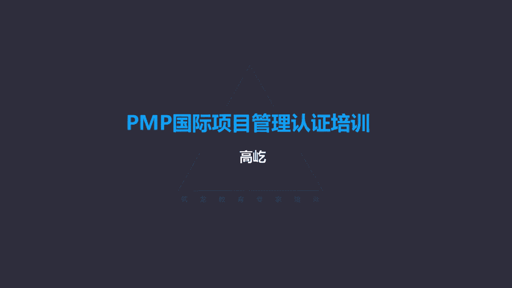
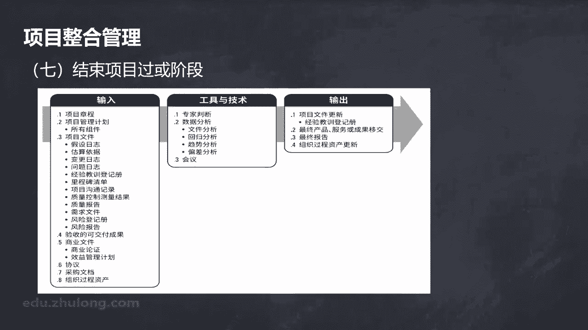
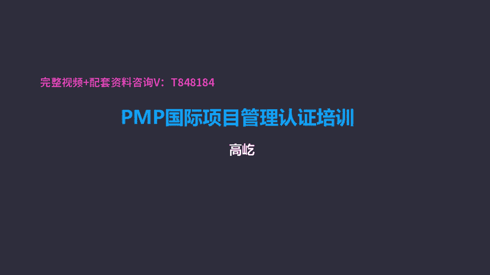

# K003-PMP项目管理认证培训 - P8：08.项整合管理：监控项目、变更控制及结束项目 ▲ - 与君共造价 - BV1eu4nerEJF

第五个过程监控项目工作，监控项目工作，这个过程跟踪审查，还有报告整体的项目进展，实现项目管理计划中确定的绩效目标，哎这样一个过程，我们监控项目除了要了解项目的真实状况以外。

同时呢我们还要让相关方那些个领导啊，客户啊，发起人呀，唉这些重要的相关方，他们要对项目当前的具体状况，有一个明确的了解，而且呢还要认可我们所采取的必要的行动，所以监控项目工作是贯穿项目始终的。

这样一个活动，那么监控项目工作，输入输入之一叫工作绩效信息，绩效信息我们知道了啊，是经过绩效数据初步的加工整理而形成的，合理的归类呀，存档啊，数据变成了信息，数据是在哪产生的，你还记得吗。

刚刚那个过程指导与管理项目工作啊，在做项目的过程中出现了最原始的数据信息，我们记录下来，那叫工作绩效数据，所以在执行过程中收集的数据，再由这个控制过程进一步分析，把它变成了信息，虽然是信息了加工整理了。

但是依然是我们项目经理团队，我们内部使用的这个信息也好，数据也好，不能直接传递给外部的客户，这个过程输出的呢叫绩效报告，输出绩效报告了，这是基于工作绩效信息，再进行合理的加工整理编制。

形成一个正式的文件，叫工作绩效报告，绩效报告，这是我们向外部相关方来告知当前的工作状态，工作绩效水平，绩效情况的一个正式文件，那么问题来了，我们能不能把绩效报告发给所有相关方呢，注意如果有这种说法。

这是错的，记住啊，一定是错的，错在哪了呢，给相关方没错，错在了所有所有相关方，这个范围太大了，相关方知识领域，这是最后一个，咱们后面会讲到的，与项目有利益关联的个人群体或组织，它的数量特别的大。

分布特别广泛，所以我们不可能把这样一个绩效报告，发给所有相关方，推而广之，如果题目里面出现了什么，召集所有相关方来开会，向所有相关方征询需求意见，涉及到所有相关方的，您就得谨慎了，这种情况一般都是错的。

为什么说错呀，难度太大，做不到也没有必要，不应该，那么如果他说发给所有关键相关方，唉，这就可以了，关键的相关方，重要的相关方，这个可以加个所有啊，加一个定语，但是如果就说比如把绩效报告发给所有相关方。

这是不对的，这是发给相关的重要的相关方，这是工作绩效报告，这个是给外部的客户领导发起人给他们看的，一般工作绩效报告都会有相对标准规范的格式，有一些具体的内容要求啊，工作完成了哪些正在做。

哪些遇到什么问题，需要什么样的支持，资源帮助等等，这个信息是反馈给这些相关方，让他们来了解当前的工作状态的，那么绩效数据，绩效信息跟绩效报告的区别，再给大家提个醒啊，注意区分数据。

最原始的执行过程中产生的信息呢，监控过程中加工整理了，归纳了分类了，这个变成了信息，报告呢，在信息的基础上，我们选择必要的内容，通过适当的格式反馈给这些外部的重要相关方，让他们了解当前项目的真实状态。

所以啊数据信息是我们项目经理，团队内部查看使用的，而报告呢唉这是对外的，注意它们的区别，那么再输出的还可能有变更请求，在监督项目的过程中，我们在比较实际情况与计划要求的时候。

那么一旦出现了偏差或预期要出现偏差的时候，就可能提出变更请求，刚才我们讲到的纠正措施，预防措施包括缺陷补救啊，特别留意啊，缺陷补救一般只针对质量缺陷啊，这个是输出变更请求，下一个过程叫实施整体变更控制。

这个过程特别重要，为什么说重要呢，因为在以往的PMP考试里面啊，几乎没有例外啊，每一次考试与变更控制相关的题目，都在20道以上，一共考试200道题，与变更相关的就超过了20道，这个比例非常的高。

所以啊这里面的概念，这里边的原则一定一定要掌握，要记清楚实施整体变更控制这个过程干什么呢，审查变更请求，要批准变更管理，对可交付成果文件，包括项目管理计划的变更，而且呢还要对变更处理的结果进行沟通。

在整个项目期间，实施整体变更控制过程都要不断的开展，谁为这件事负责呢，注意项目经理，项目经理承担最终责任，但是说到最终责任哎，最终责任这件事要澄清一下，什么是最终责任啊，并不是项目经理最终来决定。

某个变更请求是合理的还是不合理的，能接受还是应该拒绝，这不是项目经理承担的责任，他承担的最终责任，指的是任何变更都要遵循整体变更控制流程，也就是项目经理要确保变更是合规，按照规范的方式来完成。

对变更的过程啊，要进行规范化的操作，这件事是由项目经理负责的，那么具体决策项目经理决策不了唉，他会找别人，有人对此承担相应的责任，项目经理承担的最终责任是整体变更，控制必须规范。

那么什么时候可以提出变更，谁能够提出变更呢，书上给了我们说法了，整体变更控制过程要贯穿始终，项目经理承担最终责任，刚才说了，这个责任指的是规范的执行，这样一个过程的责任，那么当然它可能影响方面很广是吧。

范围啊啊包括项目管理计划的任何一个方面，任何一个文件都可能受到影响，什么人能提出，什么时候能提出呢，整个生命周期的任何时间都可以提出变更请求，参与项目的任何相关方都可以提出变更请求。

所以提出变更没有门槛，虽然没有门槛，但是对变更这件事情我们也是有要求的，首先基准如果没有确定呢，啊基准确定之前，这个变更不用遵循这个变更流程，那提出变更怎么办呀，我接受记录就可以了。

但是一旦有了项目的基准范围，进度成本确定了，这基准有了，那么任何变更不论大小，都要通过实施整体变更控制，在这个过程或者说一套规范的流程来执行，这是个重大的一个原则，并且变更请求虽然任何人都能提出。

任何时候也都可以提出，但是对于变更请求的形式是有要求的，所有变更请求必须书面记录，也许啊在我们实际工作里面，这显得有点教条了，但是作为一个理论，所有的变更请求，或者说要想成为变更请求。

那么它的前提条件必须先书面化，可以口头提出，但是必须记录下来，换句话说没有书面记录的就不成为变更请求，这个请大家一定记住啊，那么既如在案了，成为变更请求了，那就必须有一位人要负责批准或者叫否决。

谁负责呢，通常是发起人或项目经理，但是特别注意这里面说的发起人或项目经理，项目经理他要负责批准或者接受或者拒绝，而发起人呢他也可以，但是发起人在参与变更的批准过程中，通常不是以个人名义来执行的。

以什么名义呢，以群体的名义，我们这里看到的叫变工控制委员会，什么是变更控制委员会呢，这是一个正式的团体，他们负责的就是审查评价批准，包括推迟或者否决项目变更，为什么专门要成立这样一个组织呢。

或者说什么人能够成为这个组织的团队成员呢，那当然一定是有职务，有权力，有资源，这些重要的相关方，他们成为变更控制委员会CCB的成员，其实很好理解，小的变更请求项目经理自己就能决定了，经过分析评估。

这个变更可以被接受或者被拒绝，但是如果这个变更影响比较大，影响到基准了，那么项目经理自己没有权利决定了谁来决定呢，那这会儿就要依靠变更控制委员会，因为这里面的成员刚才说了，他们有职务，有权利，有资源。

这些重要的相关方，他们来决定这个影响比较大的变更，是接受还是拒绝，哎，他们的角色，他们的职责啊，什么时候要负责对变更进行评估，进行决策，应该记录在变更管理计划里面，变更管理计划是什么的一部分呢。

别忘了是项目管理计划的一部分，那个表格项目管理计划包含什么要素，其中就有变更管理计划，实施整体变更控制，那输入当然一定是变更请求，有了书面的变更请求了，那么我们来执行这样一个整体变更的过程。

那么当变更不影响基准的时候，变更是由项目经理来决定的，接受还是拒绝，反之，如果影响了基准，刚才已经说了，那就是CCB来负责审批，前面提到了，除了项目经理，还有谁要对变更请求的决策承担责任呢，发起人哎。

这个时候发起人的作用体现出来了，在哪体现呀，CCB发起人作为重要的相关方，他一定是CCB的成员之一，那么他在CCB项目的变更控制委员会，在这个组织里面，发起人他要承担，或者说他要完成这个变更请求决策的。

这样一个责任，唉，所以啊，发起人不会随随便便的对普通的变更做出决策，那种小的变更，这个决策的责任是谁呀，是项目经理，而作为重要的相关方，他会以cc比成员的身份来判断，或者说来决策一个变更最后的一个结果。

注意他的这个具体职责的划分，小的变更项目经理决定，大的变更是CCB来决定，在完成变更控制的这个工具里面呀，提到了两种，一个叫配置控制，还有一个呢叫变更控制，注意这两个不一样了。

配置控制他重点关注的是什么呢，是成果各个过程的技术规范，也就是必须严格按规范来完成，而变更控制呢变更控制它强调的是识别记录，批准或者否决对这些基准成果影响的变更，所以他们的着眼点是不一样的。

配置控制强调过程的规范和规，而变更控制呢，他更专注的是变更活动本身，也就是变更活动必须在满足规范的要求下啊，不违规的完成变更活动，比如刚才说了，必须书面换，如果变更请求没有被书面记录下来。

那显然它不能成为一个正式的变更，也就不会执行变更过程了，因此说哎，变更控制要在合规的基础上来完成对应的活动，那什么是变更的流程呢，哎变更流程，这是一套严格规范的变更活动，这些活动特别强调的是顺序。

一定按顺序执行，先做什么，再做什么，然后做什么，接下来做什么，最后做什么，每个环节环节与之间必须按顺序执行的，整体变更控制第一步哎，就是要正式提出变更，首先要成为一个变更，才能触发这个变更流程。

这个变更流程很复杂的，要占用一定的时间，消耗一定的精力，那么为了让我的资源精力用于严肃的项目工作，那所以啊变更请求本身就必须是严肃的，是正式，什么是正事啊，就是书面记录。

所以任何变更请求必须被书面的写下来，文字化，这是变更请求流程的第一步，写下来了，写下来不代表就可以接受了，接下来第二步叫全面的分析影响，全面分析评估，谁来分析评估呢，项目经理和团队。

项目经理是接收变更请求的第一责任人，收到了变更请求了，书面化正式的变更请求，接下来就要分析这个变更可能造成的影响，不是项目经理一个人，项目经理跟团队一起来分析评估，那么特别注意我们这里的要求叫全面分析。

什么叫全面呀，不能有遗漏，如果你说我分析了对进度造成的影响，对成本的影响，对范围和质量的影响，这都不全面了，你只分析这几个方面，你不分析别的吗，不管你说出多少，都存在叫挂万漏一的情况，你说的再全。

也可能有没有提到的，所以啊我们要求叫全面分析，如果题目里面说对什么什么，哪一方面进行分析评估，这样的选项你要小心，因为啊它本身就已经不全面了，第二步，变更流程的第二步就是全面分析。

变更影响项目经理跟团队来分析好，根据分析我们得出结果了，我们知道他的影响了，那么根据这样一个影响，第三步我们要做出判断，也就是这个变更请求是接受还是拒绝，谁来决策呢，刚才说了小的影响影响不大。

小的变更项目经理就可以决定了，但是如果大的什么叫大的呀，影响基准了，影响到基准的变更，就要由CCB来负责决策，所以项目经理做出决策，或者提交的CCB来决策好，那么接下来已经批准了啊，这个变更可以被接受。

那接下来是不是要执行这个变更了呢，不是虽然有了做出的决策，我们接下来的环节叫更新项目管理计划，依据变更的情况来调整对应的项目管理计划，既然变更被采纳了，那么这个变更就可能对项目的至少某一个方面。

造成影响，那既然有影响了，那么之前我们编制的这个项目管理计划，就不准确了啊，因此啊我们要优先更新项目管理计划，把被接受的变更纳入项目管理计划，把它包含进去，成为项目管理计划的一部分。

接下来我们就可以用它来指导工作了，好了，项目管理计划也更新了，那么接下来是不是就可以去执行了呢，还不是接下来要反馈给相关方，把变更的结果反馈给提出变更的相关方，你看我们前面走了这么多的流程了。

证实了书面记录了啊，全面的分析影响了在分析的基础上，我们又做出决策了啊，有了决策不算完，还有更新计划，哎，这些工作都完成了，时间也过去了一段时间了啊，那因此啊我们要把更新的。

我们要把变更的结果及时的告知，提出变更的相关方，您提出的变更请求，我们经过全面分析评估，我们最后决定采纳了啊，接下来会按照您的要求来执行，这是一类相关方要告知，还有一类相关方我们也要告知。

就是受变更影响的相关方，原来的计划，某位相关方呃，某位专家，他可能是下个月要参与到项目工作里面来，因为提出变更了，变更影响了工期被压缩了，那可能他这个月的月中就要到项目里边来了。

那当然这件事情你也要及时告知，所以把变更的结果要反馈给对应的相关方，包括提出变更的，包括受变更影响的，告诉他们了，哎接下来我们可以执行这个变更活动了啊，实时被批准的变更，当然如果前面这个变更被拒绝了。

被拒绝怎么办呀，没有被接受，没有被采纳，那我们就按原计划执行，当然变更请求没有被接受，没有被采纳，这件事我们也应该及时告知提出变更的相关方，我们经过全面的分析评估，我们认为您的变更请求。

可能会危及到目标的实现，唉所以我们决定拒绝了，那么当然如果您要坚持继续变更的话，那怎么办呀，您再给我写一份变更申请，更充分详细的说明您的理由，要求我们再评估，再走一遍流程，这个时候我们可以执行了。

执行完了还不算完，我们还有一个工作要做叫记录在变更日志里面，变更日志啊，什么是变更日志啊，就是记录变更活动的，一个简单的一个记录文件呃，日志文件我们it行业对这点比较熟悉哈，什么是日志啊。

log文件就是日志，简单的说就是流水账，某年某月某日我们做过什么什么事情，简单一句话记录一下，我们对这个变更也要做这样的记录，哎，这才是一个完整的整体变更流程，我们看到啊。

首先要正式的提出变更书面化题目里面，有时候它也叫记录这个变更，或者叫要求提出变更申请，哎，这都是正式提出变更的不同表达，这说的一回事，接下来要全面分析影响项目经理跟团队来分析，评估，评估的基础上。

接下来我们做出判断，项目经理可以做出决策，不影响基准的影响，基准的重大变更由CCB来决策，根据决策，我们要把变更的情况哎，要调整对应的项目管理计划，项目管理计划要得到及时的更新，更新完了不算完。

还要把更新的结果，变更的结果告知相关方，接下来实时变更，最后还要记录在变更日志里，你看这个流程特别的复杂，这个流程您一定一定要记住，你考试的时候大量的变更题目，考的就是顺序。

题目里面一定按照这个顺序来选择正确答案，在给出的选项里面，选出时间顺序上排在最前面的这件事儿，这就是正确答案，所以如果选项里面有要求提出变更请求，或者正式的记录这个变更唉，这个一定是正确选项。

那么当然也再提醒一下啊，整体变更控制流程什么时候有用啊，第一形成基准以后，什么时候才能形成基准啊，这个怎么来判断呢，我们可以通过通过题目的描述来判断，比如题目里面说了项目的早期，你看早期这时候有基准吗。

没有基准，再比如说在收集需求的时候，收集需求，收集需求还没有形成基准呢，我们后面会讲到，收集需求还要定义范围，有了范围说明书之后才会形成基准，所以在获取需求的时候，唉，没有基准的。

或者说在评审项目管理计划的时候，计划还在评审过程中有基准吗，显然也没有，所以这时候我们提出变更，直接接受就可以了，不用走流程，那什么时候就有基准了呢，这样的表达具有基准了，项目执行过程中。

项目在实施的时候，在临近收尾的时候，你看这时候就告诉我们一定有基准了，所以啊这个请大家特别要记住，整体变更控制流程，这个复杂的过程适用于有基准以后，有基准以后，我们按照流程来执行好。

那么接下来第七个过程，结束项目或阶段，结束项目或阶段，包括终结项目，还有终结具体的某个阶段，以及合同所有活动的这样一个过程，结束项目或阶段收尾了，这时我们干什么呢，这跟我们自己工作里边的习惯或者理解。

可能有些偏差，我们一般认为结束项目了，这个项目要收尾的时候做什么呀，最重要的工作验收哇啊项目不验收怎么结束啊，但是在我们理论里面，项目管理知识体系指南告诉我们，结束项目或阶段不验收。

验收不是这会儿做的工作，这会儿的主要作用，存档项目阶段信息，完成计划的工作，释放团队资源，验收呢前面已经完成验收了，我们后面看诶，行政收尾这个概念在咱们书上出现过，行政收尾其实是一个特别老的概念了。

最早在第三版，项目管理知识体系指南里面出现过，那么后来这个概念没有了，现在又出现了，那么您注意所谓的行政收尾指的是什么呀，指的就是结束项目或阶段，这两个说的是一回事，哎我们把行政收尾又叫结束项目或阶段。

这个过程里面我们输入结束项目或阶段。

我们要参考什么呢，要参考项目章程，章程里面有项目成功的标准，有审批要求，包括什么人可以来签署项目的结束，因此啊在结束项目或阶段的时候，章程很重要，哎特别注意提醒一下，前面已经说了。

不是每个项目结束的时候都有合同，但是呢一定都有项目章程，所以结束项目的时候优先，我们应该参考什么文件呢，参考项目章程，而不是参考合同，不一定有合同，但是每个项目都必须有章程，同时我们还要参考商业文件啊。

商业论证效益管理计划，项目已经结束了，或者阶段结束的时候，我们要确定这个项目，是否达到了经济可行性研究的预期结果呢，用商业论证来对照，我们还要检查哎，测量一下我们的项目工作。

是不是达到了计划的效益与效益，管理计划里面哎，具体如何和什么时候实现效益，这种要求是不是满足，所以还要参考商业文件，另外他的输入里面，还有一个叫验收的可交付成果，你看验收的可交付成果。

说明在结束项目或阶段之前已经完成验收了啊，这是我们跟实际工作里面，可能出现点小小的偏差，我们工作里面往往把验收作为结束项目，收尾项目最重要的工作，但是咱们在理论上不是这样的，他把验收的可交付成果。

已经完成的成果作为输入项，也就是说之前已经完成验收，那么具体哪个过程验收的呢，我们后面会讲到的叫确认范围，它属于监控过程组的一个过程，在那个过程里面，我们要完成产品服务和成果的验收。

完成了以后进入结束项目或阶段，那所以他成为了结束项目或阶段的输入之一，在输出这个过程，最终输出的叫最终报告，最终报告里边记录些什么呢，书上给出的内容啊，项目或阶段的概述范围的目标范围。

评估标准以及证明达到完工标准的证据，质量的目标项目，产品质量的评估标准啊，成本的目标，可接受的成本区间，以及最终产品服务结果的确认信息总结等等，唉其实也可以说，最终报告也是绩效报告的一种表现形式。

只不过呢它表达的是某个阶段彻底完成，或者整个项目最终结束，它的总体绩效状况，这些都是最终报告的啊，这些内容它是结束项目或阶段过程的输出之一，那么另外再输出的就是最终的产品复货，成果移交。

项目结束了或者阶段结束阶段结束，那么进入下一个阶段，整个项目结束了，成果交给另一个团队，那么这个团队通常是运营团队或叫维护团队，由他们来完成整个项目生命周期就结束了，那我们最后看看成果哈。

一路走来从哪儿来呢，刚一开始指导与管理项目工作唉，输出了可交付成果，完成的成果，进入后面会讲到的控制质量过程叫核实，也就是检验这个成果是否满足要求，是否符合验收的规范标准，内部自检完成了，要外部验收了。

就是确认范围，确认范围是正式验收成果的一个过程，发起人相关方对成果的可接受性表示确认，那么完成验收了，我们进入结束项目或阶段啊，经过最终产品复货成果的移交，移交给下一个阶段，移交给另一个团队。

最终项目完成或者阶段结束了。

