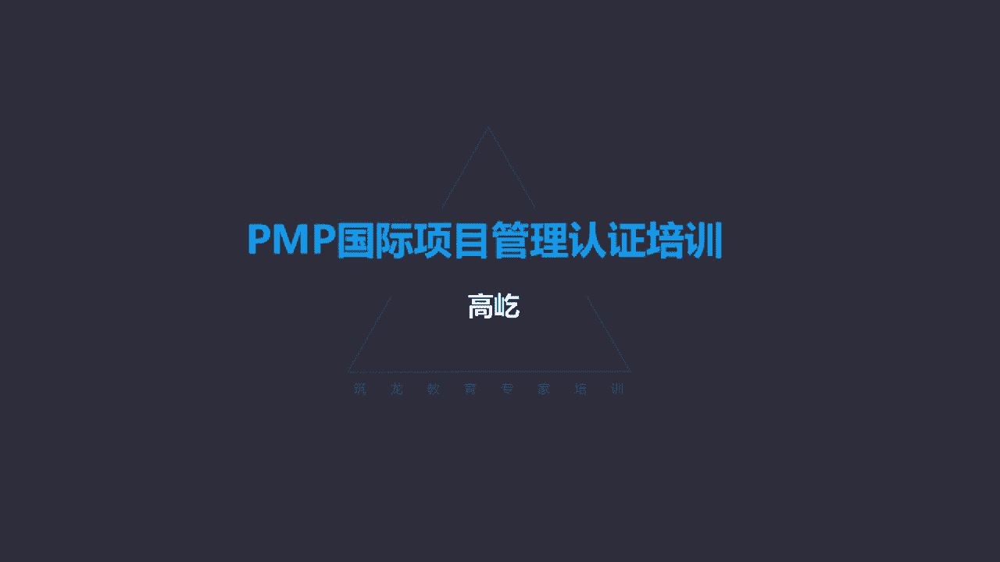

# K003-PMP项目管理认证培训 - P1：01.引论：什么是项目、项目集、项目组合 ▲ - 与君共造价 - BV1eu4nerEJF

好下面我们开始第一个章节项目管理引论啊，一开始啊我们看到了哎这里很多的项目，比如古代的项目啊，金字塔5000多年历史了，万里长城，我们自己的春秋战国时期修建的右上角，这个这景点有人去过吗，这是都江堰。

成都边上的也是兴修的，战国时期的水利工程已经超过2000年了，但是到今天依然发挥着防洪排涝，灌溉的一个作用，一个水利设施啊，连续2000年发挥作用，这在人类的水利史上，这也是绝无仅有的奇迹。

哎我们说这都是一些伟大的遗迹，也可以说是一些伟大的项目，那么下面的这些是现代的项目特点了啊，比如08年的奥运会，让全世界人民都特别的惊讶啊，给出的评价叫无与伦比啊，给出了很高的一个评价。

我们国家自己也开始研制大飞机了，登月啊，这也被认为是人类所做过的最复杂的项目，没有之一，他把人送到另一个星球上去，包括新药的研发，互联网，手机软件的开发，包括出版，这些都是典型的项目，那我们看一看呃。

项目管理知识体系哎这是个什么样的概念呢，书上说了，他是一个普遍认可的良好实践，怎么来理解这个普遍认可和良好实践呢，这些知识做法，说大多数时候适用于大多数的项目，而且在实践检验中被证明是有效的。

另外项目管理知识体系，这里面介绍的方法工具这些个思路，他不是拍脑袋拍出来的，它是源自于实际工作，它是从成千上万个真实项目工作，项目案例里面提炼总结形成的，来把项目的经验把它升华成了理论。

所以说它源自一个良好的实践，那么在我们的项目实践工作当中，如果能够正确地运用项目管理知识体系，里面介绍了各种方法工具模板啊，去贯彻他的思想，那么这样的项目获得的成功概率就能得到提升。

这是我们说的项目管理知识体系，那我们看看下面啊项目的定义了，我们要参加的是项目管理考试，我们就要明确什么是项目，按照项目管理协会PMI给出的说法，哎，项目为创造独特的产品服务或成果，进行了临时性工作。

哎这是项目的一个定义，那这里面有一些概念我们要澄清啊，首先成果嗯，可交付成果，在某个过程或者某个阶段完成的时候，能够产出的，可以是有形的，也可以是无形的啊，产品啊，服务能力呀，哎包括这种成果。

所以每个阶段每个项目在完成的时候，必须要得到的这样一个结果，这个就是可交付成果，那么另外项目创造的是独特的产品，还有呢哎独特的服务能力，包括独特的成果，刚才说了啊，他的这个可交付成果可以是有形的。

我们做出一个产品来，生产出一个零部件，开发出一个软件，这都是有形的，还可以呢，哎无形的这种能力我们参加培训了，大家的能力水平得到提升了，哎这也是一个输出的成果，这是成果的一个特点啊，另外项目的特点。

项目有两个突出的特点啊，一个叫独特性，什么是独特性呢，每个项目创造的产品，服务或者成果都是独特的哎，换句话说，不可能有两个完全相同的项目，这个项目可能高度相似，但是一定有区别，包括成果。

包括过程本身一定有独特的因素，举个例子，比如说盖房子，相同的图纸，相同的材料，相同的施工工艺，相同的施工队伍，连施工的时间都一样，你看高度相似哈，但是我再建另一个房子的时候，位置不可能完全一样。

你不能在同一个地方盖两个房子，哎，你离开了5米远，不用多哈，隔开5米远，那可能上一个房子在修建的时候，地下都是松软的粘土，很容易开挖地基，我离开5米远了，我修建第二个房子的时候。

也许那底下出现了大块的花岗岩，两个项目出现了差别，唉这就是项目的独特性啊，所以说任何两个项目不可能完全相同啊，它有它的独特性特点，那么另外唉这种项目的独特性，又是我们后面会重点讲到的叫风险的重要来源。

因为项目有独特性，所以就算你的经验再丰富，做过再多的项目，你也会遇到从来没遇到过的问题，所以这是由于它独特性而产生的啊，这是他一个特点，另一个特点呢叫项目的临时性哎，项目的临时性表达。

表现为他要有明确的起点和终点，也就是要有明确的开始和结束，什么是项目的开始呢，我们一会儿会讲到的章程文件的签发，项目章程被签字了，被批准了，项目开始了，那什么是项目的终点呢，什么是项目的最后一件事呢。

很多同事一提到终点，结合您的工作一想诶，是不是验收啊，或者说成果的移交，或者双方解除合同关系，都不是啊，按照我们书上的理论说法，什么是他的终点呢，释放资源，解散团队，项目本身是临时性的。

不可能持续的存在，所以最后一件事您记住啊，可不是验收，什么是验收啊，咱们后面会讲到过啊，后面讲到范围管理里面有一个过程叫确认范围，确认范围过程才是正式的验收，而项目的终点是指的解散团队释放资源。

哎这是他的临时性，那么临时性跟项目持续的时间长短有关系吗，没有关系，因为刚才说了，只要有明确的开始结束，就是临时的，这跟它的持续时间没有关系，有的时间可能很长，三峡项目十几年的时间，南水北调啊。

东线11年的时间，你看这时间都超长哎，有开始有结束，他是临时的，还可能很短，我们平时自己做的小项目，也许个把月的时间甚至更短的啊，比如我们给朋友办一个婚礼，可能就是一天的时间，甚至半天的时间完成了。

只要有开始有结束，就是项目的临时性，这跟它的持续时间长短是没有关系的，那么另外哎项目的临时性只是针对项目的过程，或者说项目的本身，项目的成果是没有临时性特点的，咱们这本大厚书项目管理知识体系指南里面。

难得的给了一个小例子，就是国家纪念碑，国家纪念碑的修建，你看从设计选址到施工到最后竣工揭幕，唉整个纪念碑的修建过程，这是个项目，有开始有结束，这是临时性的，而作为这个项目的成果落成的国家纪念碑。

哎这个纪念碑本身是没有临时性的，我们希望他千秋万代的矗立在这，供我们缅怀先烈，所以项目的成果没有临时性，临时性指的是项目的过程，哎项目的本身，那么项目结束的标志，刚才说了是解散团队释放资源。

那么哪些事情，或者说哪些因素会导致一个项目释放资源，解散团队呢，也就是它结束的标志是什么呢，书上给出了这样几个呃，几种方式哈，或者几种状态，这个项目就要结束了，比如说达成目标，这是最好的一个结果。

项目目标实现了，当然团队解散资源释放，项目完成，还有呢不会或者不能达到目标啊，这个目标已经不可能实现了，那咱们就别硬撑着了，那就应该适时的结束项目，还有哎项目资金缺乏了，没钱了，没有钱了，工作不能开展。

那当然这是一种不好的情况，但是如果这种情况发生了，那么也就意味着项目要结束，要收尾了，另外还有项目的需求不复存在了，特别这里边注意提到了，说战略或者优先级的变更导致项目终止。

哎我们的项目工作一定要符合战略的要求，要符合战略目标的要求，比如有这样一个题目，大家可以来试着做一做哈，说你的项目啊，你你所在的单位被另一家大企业并购了，而你现在正在做的一个项目已经临近收尾。

但是当前的项目与你新公司的战略要求，就不一致了，那么接下来你该怎么做，A继续完成手下的工作，完成这个项目，第二终止项目进入收尾阶段，不做了，第三调整，主动调整项目的战略方向，与新公司的战略要求保持一致。

还有第四个选项啊，请求领导指示，听领导的，让怎么干就怎么干，那你看那这种情况下你应该选什么呢，你的项目马上就要结束了，但是你的公司被新的公司并购了，你现在的项目与新公司的战略不一致。

那么你这种情况下应该怎么做，注意正确答案只有一个正确答案就是终止项目，进入收尾阶段，可能有人会选择说哎，我能不能主动的调整我的战略方向，跟新公司的方向保持一致呢，注意不行，听起来好像挺合理啊。

既然与战略方向不一致了，我就调整一下呗，与新的战略方向一致，满足要求不就行了吗，别忘了您的身份，您就是项目经理，您是没有权利，也没有资格，或者说没有能力来调整一个项目的战略方向，谁来调整战略。

谁来修改啊，所以如果您的项目与公司的战略不一致了，您记住这个原则，不管当前项目执行到什么状态，只要与战略不一致的，唯一能做的就是马上停下来，进入收尾阶段，不管你是这个项目刚刚开始还是执行过程中。

还是说临近收尾，马上就要结束了，不管到什么时候，只要与战略不一致，这个项目必须要停下来，换句话说，所有项目都必须要与公司，与组织的战略保持一致，项目经理是没有资格修改所谓的战略方向的。

这个原则大家一定记住，那么再有比如说无法获得必要的资源啊，包括法律的原因，终止项目等等，唉这些都会导致一个项目结束，那么结束了最后一件事就是解散团队释放资源，这是项目的临时性的一个特点。

那么项目有什么作用呢，我们为什么要把工作把它当做项目来看待呢，哎有这么几个作用，第一叫驱动变更，书上给出了这样一个示意图，通过这个图我们可以来理解，你看这个图横坐标是时间，纵坐标叫商业价值。

看左边的当前状态哎，他的商业价值处在这个中等水平，时间早期，那么后面将来状态右侧唉，这个组织的这个一个示意图，你看时间推移了，随着时间的推移，你注意商业价值怎么样呢，提升了哎，商业价值得到提升了哎。

所以随着时间的推移，要让商业价值得到提升，得到增加，这是项目的作用，我们为什么要把工作当做项目来做呢，啊或者说我们做项目的目的是什么呢，我们是为了增值啊，保值增值，咱不能败家是吧，项目越做商业价值越低。

那这是不能被允许，不能被接受的，所以啊项目叫驱动变更，也就是要确保呃我们组织的价值，或者说商业价值得到提升，这是项目的一个作用，另外项目的另一个作用，那就是明显的啊，告诉我们叫创造商业价值。

什么是商业价值呢，项目管理协会定义的说，从商业运作中获得的可量化的净效益，唉可以量化的净效益，那么商业价值一定能够给相关方，带来必要的效益，但是这种效益呢又有特点，可能是有形的。

也可能是无形的有形的效益，特别好理解哎，货币资产，我们公司今年盈利多少，我们在去年的基础上，我们的利润水平得到多大的提升，这是有形的效益，包括固定设施是吧，公司的固定资产，我们占有的市场份额。

这些看得见的，摸得着的有形效益，这属于商业价值，同时呢还有无形效益，比如商誉啊，公共的利益，品牌认知度等等，无形的效应，无形的效益也是效益，也是商业价值的一种，新冠肺炎，那么发生了，随着疫情的严重。

要紧急修建这种定点医院，雷神山火神山医院，咱们从媒体里面看到了，那么联想公司承诺为医院提供，全套的所有it设备，而且是无偿提供，你看他一个企业无偿提供，它没有价格是吧，他在这里面没有获利，有形的效益。

货币资产并没有得到增加，但是他获得的是什么呢，无形的效益，商誉得到提升了，唉大家一提诶，这家企业有良心是吧，这是中国人的企业，关键时刻啊，他能够为公共利益着想啊，啊能够捐赠，你看提高他的商誉了。

那当然这对他未来的市场份额也好啊，他的这种市场行为也好，都是有正面积极促进作用，所以无形的效益这种商誉哎，也是商业价值的一种，那么另外项目启动的背景，我们为什么要做一个项目呢，书上给出来这样四种情况啊。

符合法律法规或者社会要求的，满足相关方需求的，还有呢执行变更啊或者技术的战略，另外创造改进修复产品过程或者服务哎等等，基于这些原因，我们都可能启动一个项目，但是这里有个总的原则，不管什么因素。

最终都要与组织的战略目标相保持一致，来包括与各个项目的商业价值相关联啊，所以我们知道了，项目要想得到启动，首先要与战略方向，战略目标一致，另外呢你做的这个项目啊，要确保能够获得商业价值。

这种商业价值可以是有形的，也可以是无形的，那么项目管理是什么呢，刚才我们知道项目了，为创造独特的产品服务或成果，进行了临时性工作，那是项目，那么项目管理是什么呢，来把知识技能工具用于项目活动。

满足项目要求，这就是项目管理，项目管理有了项目管理，我们有了这些个工具方法的应用啊，所以他就能够提高项目成功的一个概率，我们能让项目的过程变得更加顺利，那项目最终实现目标的概率得以提升。

唉这也是项目管理的价值所在，所以啊项目是创造价值和效益的主要方式，那么通过项目管理呢，我们就能够提高项目达成目标的可能啊，让项目工作进展的更加顺利，所以啊项目管理也能够被认为是啊。

这个有效高效的项目管理啊，说被视为组织的战略能力，因为我们组织获得的利益，商业价值通过什么呀，通过项目活动，通过项目的活动来获得提升价值，那么项目管理能够帮助项目目标的一个达成。

所以项目管理被视为组织的战略能力，项目管理能力越强，唉这样的企业它的生存力也越强，抗打击能力，它的盈利能力就提升了啊，书上给出了这些项目管理的重要性啊，说将项目与成果目标联系起来啊，更有效地开展竞争。

支持组织发展啊，包括应对商业环境给项目带来的影响，项目管理越成熟，项目管理的能力水平越高，唉刚才说了，这样的组织，它的存活能力强，他的应变能力强，所以呢能够应对商业环境的改变，来带给项目的影响。

包括带给企业的影响啊，反之呢，如果你项目管理的比较差，比较混乱，我们都是人质是吧，完全凭经验拍脑袋，凭经验来做的话，那么有可能比如市场的一些波动，影响大的环境的一些调整啊，包括随着竞争的加剧激烈。

都可能会影响你项目的成功，包括你组织的盈利能力，那甚至威胁到你的生存能力，所以我们看出项目管理的重要性，那我们接下来看看啊，这里有个概念叫项目集和项目组合，虽然我们未来要参加的是项目管理考试。

PMP考试，但是啊在考试的过程中，有可能在题目里面哎作为背景会涉及到，比如项目集，包括项目组合的这种说法，这个概念我们得知道什么是项目集，什么是项目组合，什么是项目集呢，一组相互关联。

而且被协调管理的项目子项目集，还有项目集活动，你看他是一个集合，是一组项目活动，什么子项目集活动，但是这一组活动有个特点，什么特点呢，相互关联，彼此有联系，我们把这样一组彼此有联系，有关联的项目活动。

子项目进行活动统一协调起来管理，为什么呢，我们为了获得更大的利益啊，为了获得更大的收益，每个项目单独管理啊，都可能达成目标，达成单个单个项目的目标，但是那个总体目标不一定能够实现，你看项目集活动是吧。

比如典型的例子啊，咱们这个示意图哈，航天发射唉，航天发射就是典型的一个项目集，我们发射的最终目的是什么呢，要让卫星啊，要让运载火，让这个飞船准确的进入预定的轨道，怎么能够实现这件事呢。

又通过多个项目的相互配合协调，比如卫星的设计生产制造，运载火箭的啊，生产制造包括运输，包括测控，你不要小看运输是吧，像运载火箭的运输就是一个很复杂的项目啊，既涉及到安全，还涉及到保密啊。

沿途的啊这些个安保工作路线的选择等等，很复杂，这是一个完整的项目，包括测控，也是我们有地面的测控站，还有远望号，还有海上的测控船，你看每个项目如果只是自己执行的话，我的卫星我生产出来了。

也都满足卫星的设计指标要求，但是如果你忽略了运载火箭的需求，可能装配不上，火箭生产出来了，卫星也有了，但是运输如果出现了问题，你也没有办法发射，一切都准备就绪了，已经点火升空了。

结果远望号测控船还没出港呢，那显然你的卫星想准时进入轨道也不可能了，唉所以啊，我们要把这些彼此有关联的这些个项目，单独的项目要把它组合起来了，要把它当做一个项目集，因为他们彼此之间有关联。

当做一个项目级协调来管理，这样我们就能够实现这个更复杂更大的目标，这是项目集的一个作用，那么可见项目集从体量上来说哎，它要比项目要大，因为这里面可能包含多个项目，包括子项目及其他项目活动等等。

但是呢这些活动彼此有关联，这是项目集的概念，那么特别要注意啊，项目集不是大项目，刚才咱们说了体量上来说呃，它比项目要大，因为这里面包含多个项目活动，但是项目集又不是单纯的大项目，什么是大项目啊。

咱们书上给出这种概念了，说大项目首先成本特别高，比如10亿美元及以上的这种成本影响还大，影响上百万人，而且时间周期特别长，要持续数年甚至数10年，唉这是大项目，比如最典型的药品研发一款新药。

从实验室最终能进入这个临床使用，通过这样一个认证，这个过程特别复杂，一个高额的投资啊，再一个呢持续的时间中间环节特别的多啊，药理实验，毒理实验，动物实验，人体实验，任何一个环节出现问题。

那么可能前面所有的工作都被清零了，所以这样的总体来说相对简单，这个简单不是工作简单哈，它的结构相对简单，但另一方面呢它的持续时间又特别长，它的花费成本又特别的高，我们把这样的活动叫做大项目。

它不是项目集唉，项目集的特点，一定是有多个要素组合在一起的啊，多个要素彼此之间还有关联，被协调管理目的呢，为了获得更大的利益，获得更大的收益，这个叫项目集，知道了项目急了，还有一个概念叫项目组合。

什么是项目组合呢，来项目组合为实现战略目标而组合在一起，管理的项目，项目及子项目组合和运营工作，这是它的定义哈，所以从定义上来看，首先它的体量更大了，它里面要包括项目，还有项目集哎，什么子项目组合。

所以规模更大，另一方面它的特点实现战略目标哎，什么是战略目标啊，特别高远的，理论上来说能看到，但是不能轻易达到的，这叫战略目标，那么对于企业来说，什么是你的战略目标啊，盈利啊，获得更大的利润。

这就是战略目标，我们今年盈利多少钱，明年能有10%的增长，后年有20%的增长，这就是战略目标，挣钱挣更多的钱，这有购物吗，不行不能再挣了啊，挣钱太多了，没有你挣钱少，你这才有问题呢。

所以像挣钱获得更大的利润，这件事就类似于咱们企业的战略目标，那么项目组合就是为了实现战略目标而完成的，这是它的一个特点，那么再有他要负责排列优先级了，组合里面这些个要素项目集呀，什么项目啊。

在相对资源有限的情况下，应该优先做哪个呀，我们当然目的是为了实现战略目标，那当然应该优先做那些对实现战略目标，贡献更大的项目，这些活动它的优先顺序排列，它的资源分配，项目组合有这样的职责。

另外还有一个特点，就是组建彼此之间不一定有关联，刚才说了，项目集，项目集的要素之间一定是有关联的，相互有关联的活动放到一起来管理，哎我们实现更具体的更大的目标，而项目组合呢不一定相关联。

你像集团化的企业是吧，它有主业，也有各种的副业，不管干什么，彼此之间没有什么联系，但我们的目标是一样的，盈利呀，所以啊项目组合实现战略目标，放在一起管理的这些个活动，彼此之间没有关联。

我们看看这样一个示意图，哎我们看到了在战略下形成了组合，组合要满足战略，要实现战略，那么通过什么实现呢，通过各个的项目集，包括啊不同的项目，这些个项目项目及共享资源，大家在有限的资源下合理的排序哎。

最终完成组合，实现战略的目标，那么所以说项目集啊和项目叫从术的层面，让这个工作活动得到更有效的规划管理和控制，所以说正确的做事来提高成功的概率，而项目组合呢，从道德高度来指明工作活动的方向，什么方向啊。

战略方向也就是做正确的事情啊，什么是正确的事情呢，实现战略目标，这就是正确的事情唉。

