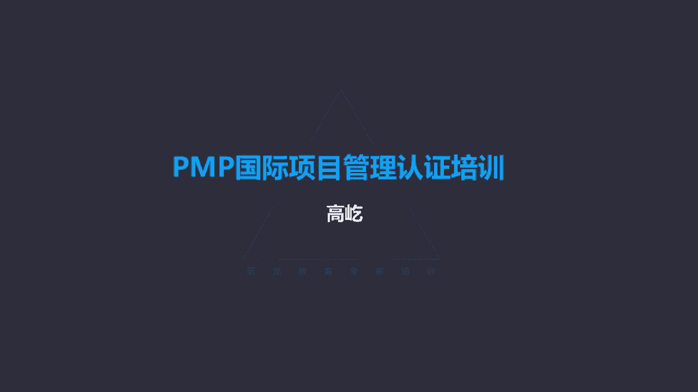

# K003-PMP项目管理认证培训 - P12：12.项目范围管理：控制项目范围及变更 ▲ - 与君共造价 - BV1eu4nerEJF

第五个过程是确认范围，确认范围哎这个名字啊听着并不陌生啊，咱们前面提到过确认范围干什么的呢，我们看到确认范围就是一个正式验收的过程，是不对，可交付成果验收的这样一个过程叫确认范围。

那我们再注意一下确认范围，它是哪个过程组的呢，监控过程组唉，这又跟我们说平时工作里面的习惯，认知不太一样了，前面就说过，我们一般会认为项目结束的时候，收尾的时候应该验收了，现在我们看到啊，收尾不是验收。

收尾前要先完成验收哪个过程呢，就是这个确认范围啊，确认范围，它的股这个过程的内容，就是要完成对可交付成果的正式验收，所谓的正式验收谁来参与呢，一定有发起人，一定有客户这种正式的外部验收。

所以这个过程应该在每个阶段结束的时候，都要执行，阶段成果也要验收，那么最终项目完成的时候还要完成验收，所以这是一个正式验收的过程，确认范围是客户发起人啊，审查从控制质量过程输出的，叫核实的可交付成果。

这个过程呢我们要确认这些成果已经圆满完成，并且正式通过验收，唉所以啊确认范围，这种正式验收之前还有一个活动，就是控制质量，控制质量，控制质量过程得到的叫核实的可交付成果，这个控制质量谁来做呢。

项目经理和团队，这是我们内部完成的，这跟我们的实际工作经验有相似的地方，我们正式外部验收之前，我们先要做什么呢，所内部的自检自己检查，看看我们完成的这个阶段成果或者整体的项目。

最终成果是不是满足了验收的标准，验收要求满足了，我们再提请外部验收，所以确认范围这种正式的外部验收之前，一定先有一个内部自检的过程，这个内部自检我们这套理论里面叫做控制质量，我们后面会再讲到，确认范围。

这种正式验收强调的是什么呢，强调的是成果的可接受性，能不能验收相关方发起人，客户对完成的这样一个阶段成果，或者总体项目成果，他的认可程度怎么样，是不是接纳了，所以他强调的是成果的可接受性，而控制质量呢。

控制质量是内部的自检，我们要根据验收的标准啊，包括产品本身的啊，这些个测量指标来检验是否满足验收的要求，那个时候我们更强调的是成果的正确性，或者叫合规性，是不是满足质量要求，是不是满足验收条件。

这是确认范围和控制质量的区别，那么当然从顺序上来说，一般是先有控制质量，也就是先内部自检，自检完了没问题了，我们在外部验收，在确认范围哎，这是一个顺序关系，可能同时开展是吧，我们检验一部分。

我们就让客户验收一部分，但是啊不会反过来，不会先外部验收，再内部自检，这是不可能的啊，所以啊两个过程的顺序要搞清楚，这个过程再得到的输出啊，输出就是验收的可交付成果已经通过验收了。

得到了客户发起人签字批准，这个签字批准的正式文件，我们工作里面可能很熟悉啊，验收证书，这个验收证书连同可交付的成果，我们再进入什么过程呢，结束项目或阶段，那个时候是正式的收尾了，哎所以啊再给您提个醒。

验收不是收尾确认范围，就是验收完成，验收了，得到了验收的成果，得到了验收报告了，这时候才能进入结束项目或阶段，好这个过程没有更多的工具技术了，我们看看接下来的第六部分就是控制范围，控制范围过程。

这是监督项目产品的范围状态，管理范围的基准，变更范围基准，咱们前面讲了，这是制定工作分解结构过程的输出范围，基准通常是三部分构成的，范围说明书，工作分解结构，还有工作分解结构词典，这三样合起来被批准了。

被谁批准呢，被发起人领导客户，这些重要的相关方得到他们的认可，批准以后，成为范围基准，那么范围基准的改变调整，这个活动是在控制范围来完成的，那么当然既然成为了基准，那么原则上基准不应该轻易改变。

因此说在整个的项目期间，都应该保持对范围基准的一个维护，尽量不要变，那么如果要改变，那怎么办呀，通过变更流程，通过规范的变更，让范围受控，范围基准不是不能改，可以改。

但是要改动要经过规范的流程来修改来调整，不能随意，道理上说，应该确保所有变更请求，都通过实施整体变更控制过程处理了，因为这个时候有基准了啊，已经形成了范围基准，有了范围基准以后。

不管大的变更还是小的变更，都应该通过变更流程来执行，不影响基准的，项目经理自己来批准改变基准或影响基准了，那么由CCB来决定，这是一种叫正确的或者叫规范的办法，让范围得到了有效的控制。

范围基准得到了维护，那么接下来我们看看，如果没有经过控制，未经控制的产品或者项目的范围改变了，那么通常是范围扩大，那这种情况我们有一个说法叫范围蔓延，范围蔓延了。

这个蔓延就是让范围没有经过正规合理的控制，没有经过变更流程，什么会引起范围蔓延呢，通常范围蔓延唉，这是来自客户方的一些特别要求，一般情况下会导致范围蔓延发生的，唉都是一些小的要求，客户主动提出的。

这能不能再稍微改一改呀，这能再增加一点点呢，唉这边做出一点小的改动就行，唉这点事儿既不多花你多少钱，也不多占你多少时间，你看很简单的举手之劳能不能做呀，在这种情况下。

我们项目经理团队有的时候就可能放松了警惕，没有走变更流程，直接就接受了，当然如果他提出一个大的变更要求，这个变更要求甚至可能影响基准了，这种情况下，我们一定会认真对待，我们会要求走变更流程。

你给我书面写下变更申请吧，我们按照变更流程来执行，但是如果这种小的要求，刚才说的做一点事，举手之劳啊，既不消耗你更多的时间，也不占用你更多的精力，那能不能做呢，哎如果没有经过规范的变更流程。

我们就直接就答应了，哎呀就这么点要求，这个还走流程太麻烦了，或者说人家客户都这么说了，这再不答应，这不好意思啊，就这么点小的要求，还还还还要拒绝吗，还要走所谓的流程吗，这太死板了吧。

如果你忽略了一个这个控制范围的原则，小的变更要求没有经过变更流程，你就直接接受了，那这就可能导致范围蔓延，可能有人说他要求确实很小啊，就这点事，我在这大动干戈的走流程，这犯不上啊，没必要吧，不是没必要。

虽然他提出的要求看起来很小，举手之劳，但是这个变更的影响真的就很小吗，我们如果没有经过全面的分析评估，我们就根据自己的经验判断，根据他的描述啊，主观上就直接就接受就答应了。

那很可能这样看起来不大小的变更啊，它可能对项目的某一方面，其他方面造成更大的影响，比如说它在时间上确实消耗不多，一会儿就可以完成，但是不影响进度的这个变更，难道不会影响质量吗，它不影响成本吗。

他会不会带来新的风险吗，所以没有经过这样全面的分析评估，我们直接就接受就答应了，那就可能导致后期出现更大的问题，留下隐患，那么当然更重要的问题是什么呢，你一次答应了，那就可能一而再再而三的继续出现。

这种看起来不大小的要求，你看上次我那个要求我这么一说，你就接受了，那怎么这次还得什么走流程，还得写变更啊，太麻烦了，你上次都答应了，为什么这次不答应啊，上次可以做，这次这次为什么不做呀。

哎结果一而再再而三，不断的会出现这种看起来不大小的要求，那么结果等你发现的时候，也可能啊这种变更影响啊，已经由量变导致质变，唉最终导致严重的后果，所以范围蔓延，这是一种不可接受的行为，呃不允许范围蔓延。

通过什么呢，哎通过严格规范的变更流程，别管他这个变更要求看起来是大是小，不管他自己表达的这个影响是大还是小，甚至说我愿意承担，那比如超支的成本，我允许你适当的延长工期等等，我给你提供必要的资源。

即使这样，我们也不能直接盲目地接受，其实这种情况在考题里面也经常出现，比如说客户提出了一个不大的变更请求，并且啊同意为这个变更提供相应的成本啊，或者为这个变更提供资源的支持等等。

或者说客户保证啊不改变什么项目的呃，呃成本或者质量，尽管这样说，那么如果没有经过规范的变更流程，没有全面的分析评估就接受，那显然这已经违背了控制范围的原则，所以如果题目背景里有这样的描述。

客户提出个不大的小的变更，要求客户承诺提供资金，客户愿意啊提供这个资源，而且保证不影响什么什么，看到这样的描述，你就要特别的警惕，越是这样说，越要坚持走变更流程，选项里面凡是直接接受。

包括直接拒绝的都是错误选项，只要是变更，我们就应该按照规范的变更流程执行，这是一个特别重要的原则啊，请一定记住这种源自客户方的主客户，主动提出看起来不大的小的变更要求，一而再再而三导致范围的失控。

这叫范围的蔓延，还有一种没有经过规范的变更控制，而导致的这种范围失控，我们叫做镀金，镀金哎，这回他的这个发起方便了，刚才咱们说到范围蔓延，谁引起的呀，那是客户引起的哎。

客户主动的提出一些看起来影响不大的，所谓的小的变更啊，那这样我们思想放松了，我们直接就接受结果呢，可能导致范围的失控，那叫范围蔓延，客户主动提出，而镀金不是了，镀金反过来了。

这是我们团队我们主动提出的范围改变，客户并没有要求我们自己，主动的给人家增加功能，提高性能，改善质量，这种行为我们就叫镀金，所以说给客户提供高于他们要求的产品和服务，为什么要镀金呢。

这种情况在咱们现实工作里面其实并不少见，客户没有要这样，你为什么给他更好的，给他更高的标准，给他更多的功能呢，其实很简单，为什么呀，为了客户满意嘛，各个行业竞争都很激烈啊。

为了能够在竞争中处于这种优势地位，我们除了提供必要的产品服务和成果以外，我们还要特别高度的关注客户满意度，客户满意了，我们下次才继续有合作的机会，在竞争中才能处于优势地位，所以啊我们在工作过程中。

在项目里面哎，给客户提供一些超出他们需求的，更好的更多的产品服务成果，这也很正常，咱们自己在淘宝上买点东西是吧，你打开包装，你看里边可能还有个小赠品的，其实这不就是镀金吗是吧，道理确实很正常，很应该。

那么我们在项目管理知识体系里边，认为镀金这种行为是不可接受的，不应该这样做啊，不能这样做，这是一种范围失控的，或者说影响范围稳定的一种行为，那难道项目管理知识体系，就不考虑客户的满意吗。

哎不是我们这里说的镀金，他有个前提，什么前提条件呢，就是在你该做的项目范围还不能充分保证圆满，按要求满足的情况下，我们还要做一些额外的东西，我们总希望做一些锦上添花的东西。

但是前提你要先把该做的工作做好，做充分，该做的做好了，做充分了，如果这种情况下，我们的资源精力还有富裕，那当然我们可以我们给客户提供一些额外的，更好的产品，更全面的功能，这样呢能够提升客户的满意。

这种方式我们不叫镀金，镀金指的是用有限的资源和精力，在该做的工作范围，还没有得到充分保证的情况下，我们还拿出有限的资源，精力去做范围以外的事情，我们的目的呢是为了讨好客户，为了获得所谓的满意度。

甚至包括唉，可能包括自己的炫耀心理，你看你们做不到，我可以做到，这种行为是不能被接受的，没有经过规范的变更控制，没有经过全面的分析评估，没有把该做的工作做好做充分，在这种情况下。

我们还在做项目范围以外的东西，没有经过变更流程，这些范围以外的功能也好，特性也好，没有被纳入项目管理计划，我们就直接执行这种行为，叫镀金，这是不可接受的，那么所以如何来提高客户满意度呢，最本质的做法。

把该做的一定要做好，项目范围要做到充分充分满足要求，在这个前提下，如果我们经过分析评估，我们还有资源，还有时间和精力，这时候我们可以适当的做一些啊，比如说额外的能够给客户带来惊喜的啊。

更多的产品或者更好的功能服务，这种情况是能够提高客户满意度的，反之该做的工作还没有充分做好呢，我们反而拿出有限的资源精力做一些表面文章，希望通过这些表面的文章来提高客户的满意度，显然这与满意度没有关系。

这种做法是错误的，这就好比说我们在网上网购一个产品是吧，买的产品让你很失望啊，它的功能也不行，它的质量也不行，哎那这时候你说它里面，包装盒里附带的那几个小的赠品能让你满意吗，显然不可能。

因此在控制范围的过程里面，最大的原则就是要让变更受控，任何范围的改动，原则上都要经过规范的变更流程，不是不能改，唉，不是不能增加功能，不能增加这个范围，提高质量，而是说要在全面评估的基础上。

不影响目标的，在这个背景下，我们该做的可以做，否则如果忽略了变更流程，忽略了对变更可能造成的影响，进行全面的分析评估，我们就盲目地接受，无论是客户提出的看起来影响不大的小的要求。

还是说我们主观上为了单纯的讨好客户，甚至为了自己表现而做一些额外的工作，那么这些行为都是不能被接受的，这都会导致范围的失控，因此控制范围是管理范围变更的这样一个过程，要保证项目的范围基准。

在整个的项目生命周期内保持相对的稳定，如果发生调整，通过规范的变更流程来执行，通过变更流程了，那么范围基准可以得到更新，这样能够保证项目的过程是稳定的。

