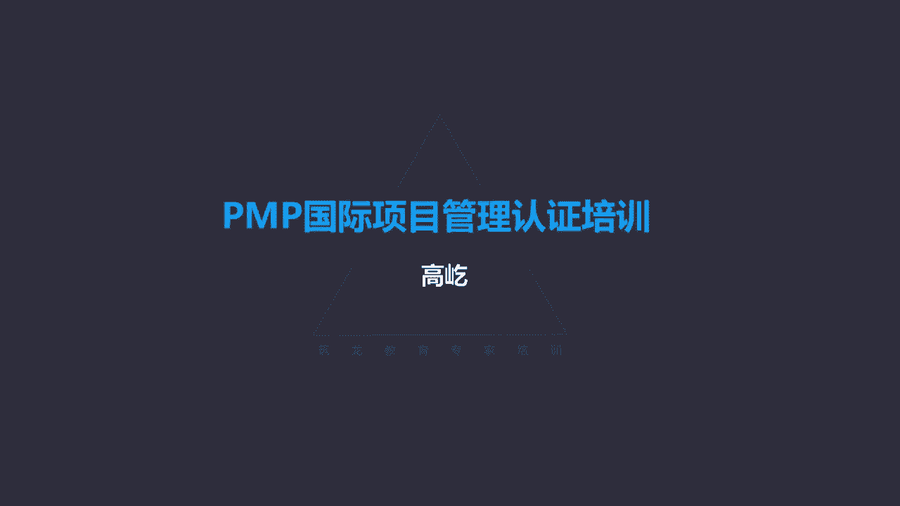

# K003-PMP项目管理认证培训 - P13：13.项目进度管理：如何规划进度管理？ ▲ - 与君共造价 - BV1eu4nerEJF

项目进度管理，进度管理，我们的目的就是通过提供一个详尽的进度计划，来对项目的进展情况，进行全面合理的管理和控制，所以进度管理是说明项目如何，以及何时交付范围中定义的产品服务和成果啊。

这为了最终绩效报告里面提供一些信息，我们的进展情况如何，那么谁来负责完成进度计划的这种方式选择呢，团队项目经理和团队我们自己来决定，用什么样的计划方法，使用传统项目管理里边的。

比如我们后面会讲到的关键路径法，还是用敏捷的办法来管理进度，包括进度模型的创建唉，这些都是由项目经理跟团队我们自己来决定的，关于进度计划方法的一些新兴实践，书上简单介绍了一些。

比如说用未完项的迭代型进度计划，这是基于适应性生命周期，也就是敏捷啊，在敏捷管理思想里面，把用户故事按照优先级排序，在规定的一个时间范围内啊，我们把它这个规定的时间范围，叫时间和一个时间盒。

通常就是一个一个迭代的周期啊，这些具体与敏捷相关的内容呢，我们后面单独作为一个章节再来介绍，另外呢还有按需进度计划方法啊，这个主要用于叫看板体系，看板看板来自精益生产的这样一个呃，指导管理思想里面。

精益是源自丰田制造，丰田制造最早提出的啊，那么他认为在相同的时间范围内，或者说同时手里面的工作，最少完成的工作效率会更高，换句话说呢，完成了一项工作，再做另一个工作，这样有利于效率的提升。

如果把大量的工作都堆在手里面，同时几个工作一起做，这样不但质量难以保证，它的效率也会降低，这是精益思想里面看板体系的一些观点啊，那么在适应型生命周期里面，因为它的变化多变更多。

因此更多采用这种短周期的方式来开展工作，也就是所谓的快速反馈，我们每次编的计划周期都相对短，打个比方说叫小步快跑啊，用这种方式来完成进度计划的一个编制，包括具体工作的向前推动执行前面的基本概念。

了解以后，我们看一看进度管理章节的各个过程，第一个过程就是规划进度管理，规划进度管理为编制规划管理和执行，控制项目进度，制定政策程序和文档的过程，我们注意到了这个过程的作用。

来为整个项目期间管理进度提供指南方向，看到指南和方向了，我们应该意识到有什么特点呢，高层次的啊，高层次的概括性的是一个原则性的内容，因此规划进度管理在这个过程，你看他最后输出的叫进度管理计划。

咱们前面在规划范围管理的时候，已经着重的讲过了，得到的那个范围管理计划，包括需求管理计划，他有管理两个字了，那么得到的这两个文件啊，它的特点呢，范围管理计划里没有范围，需求管理计划里也没有需求。

没有具体的范围，也没有具体的需求，那么同样我们看看进度管理规划，进度管理得到的进度管理计划，那他为编制监督和控制项目进度，建立准则和明确的活动，它的内容你看有进度模型，进度计划的发布迭代长度啊。

准确度计量单位组织程序链模型的维护控制，临界值，绩效测量规则，报告格式等等，进度管理计划里面告诉我们什么呢，比如我是用天做单位还是用小时做单位呢，是超过了一天就要马上采取措施，还是延误的时间。

只要不超过一周都是可以接受的，用什么样的方式来编制进度计划，是网络图啊，是里程碑图还是甘特图，唉这是进度管理计划里面描述规定的内容啊，所以啊它是方向指南性质的，是高层次的，因此我们得出这样一个结论。

进度管理计划里面没有进度，这里说的没有进度，这指的什么呢，具体的进度信息，进度要求，比如哪天开始，哪天结束啊，这些活动什么样的逻辑关系，哪些是串行的，哪些是并行的，每项活动要持续多久。

这些具体的进度信息，在进度管理计划里面是看不到的，唉，这跟刚才咱们前面讲过的，范围管理计划和需求管理计划是一样的，进度管理计划里面也只是一个高层次的方向，指南的内容，这里没有明确具体的进度信息。

好有了明确的进度指导方法了，我们知道如何来管理进度了，那么接下来第二个过程叫定义活动，定义活动，这是识别和记录未完成项目可交付成果，而必须采取的具体行动的过程，也就是我们得明确，为了完成项目工作。

需要具体做哪些活动，这些活动我们要把它提前识别出来，怎么来识别呢，分解通过分解的办法，将这些活动逐一的识别出来，那么分解的对象呢，分解的对象就是工作包，工作包，这是制定工作分解结构这个过程得到的输出。

他也是范围基准的内容之一，工作包代表工作分解结构的最底层要素单元，在那个时候我们讲过工作包不能再分解了，也不需要再分解了，他是工作分解结构里的最底层，但是在范围管理里面不需要再分解了，到定义活动过程。

我们要继续拆分，因为在工作分解结构里面，当时还特意讲过工作分解结构，我们分解的对象原则上不是工作本身是什么呢，是成果，还记得吗，那个天马行空，那辆被拆分的天籁汽车，每一个零部件代表对应的工作包。

那么现在我们就要把这些工作包再拆分了，也就是通过哪些具体的活动能得到这个工作包，工作包是名词，而现在活动呢哎这就是具体的任务了，我们看他的输入工具技术，还有输出这个过程里面用到的工具唉，还是分解。

这在制定工作分解结构的时候就用过，他的道理是一样的，把范围成果逐步划分成更小，更易于管理的组成部分，并且工作包作为工作分解结构的最底层，他表达的是成果，那现在我们要把这个成果进一步拆分成。

具体的工作活动了，我们通过叫滚动式规划的方式来完成这个工具，我们在制定工作分解结构的过程中也用到过，它的特点就是迭代式的规划技术，也就是不是一次完成，逐步逐步完成，所以也叫渐进明细。

在项目早期信息有限的时候，我们只能把工作分解结构，分解到相对高层的位置，很难一次达到工作包，那么随着工作的推进，信息越来越多，越来越明确了，我们能够把这些比较高层次的呃成果，我们继续分解拆分。

最后达到工作包的层面，包括在较远期才开展的工作，我们也可以暂时先放在较高的层面，随着工作推进，远期的工作临近了，这时候我们可以再把它逐一的拆分，达到工作包，这也叫渐进明细啊，也叫滚动式规划。

在定义活动的时候，我们同样可以遵循这样一个原则，定义活动过程输出得到的叫活动清单，这里面活动清单，活动清单包含的是什么呢，是项目所需的进度活动，这时候这里已经这里面已经变成明确的活动，是工作任务了。

而不再是名词，不再是成果要素了，那么另外还请注意，凡是叫做清单的内容，你看这里叫做活动清单清单，在咱们项目管理知识体系啊，这套理论里面啊，它有一个特定的一个特点，凡是被叫做什么清单的。

一般都是杂乱不排序，有这样一个特点，比如我们现在看到的活动清单后面还会有啊，比如风险清单，相关方清单需求啊，识别的时候我们得到的需求清单等等，哎所有这些个清单一般都有个特点，就是不排序。

比如我们通过类似头脑风暴的方式，我们得到的大量的信息，这些信息只是简单的嗯，这个堆积在这放到这里了，并没有经过更多的整理加工，所以啊清单的特点就是不排序，活动与活动之间目前没有顺序关系。

那么这些清单因为刚才说过了，滚动式规划，我们很难保证一次把项目工作中，所有可能用到的工作活动都全部分解出来，唉所以啊这个活动清单也是需要不断更新，不断维护的，随着工作的推进。

那么后期的工作任务会得到进一步的分解，拆分活动清单也会不断地得到补充，清单里面有什么呢，活动清单包括每个活动的标识，还有呢工作范围的详述，工作范围的详述，详细表达目的呢，让团队成员知道需要完成什么工作。

一般来说我们要想表达一个明确的活动，通常用动词加名词的结构，这就是一个详述了对吧，比如啊我如果光说文档，你看文档，文档是个名词，它没有办法表达成一项活动，一项任务，我得给它加上一个动词。

比如编写文档或者审教文档，或者打印装订文档，包括邮寄文档，你看不管什么样的动词，你加上一个动词以后，哎它的内容清晰了，明确了，所以啊进度活动通常表达哎明确详细的范围，详细描述，让他知道要完成什么工作。

我们一般都用动词加名词的方式来表达，这个跟咱们前面讲的工作分解结构，里边的工作包，这是不一样的，工作包工作包都是名词啊，因为它是成果的要素单元，除了输出活动清单，还会输出活动属性，这里面的活动属性。

指的是清单里边的每一项活动，所具有的多重属性，这是扩充对活动的描述，比如刚才我们说到的编写文档，编写文档，这是一个活动了，但是如何编写文档呢，怎么让编写文档的工作得到充分的一个执行呢。

那我们要看活动属性了，唉活动属性里面包括活动本身的描述，怎么做这件事，包括锦钱活动，这个活动之前应该干什么，还有紧后活动，接下来是什么，其他的活动逻辑关系，提前量，滞后量，包括资源的需求。

强制的日期制约因素，假设条件等等，所以活动属性是对每项具体活动的一个，多重属性描述，它可以用于编制进度计划，我们后面也可以看到，那么活动属性类似于什么呢，我们前面讲的什么跟这个活动属性有相似性呢。

没错就是工作分解结构词典，那个WBS词典，跟我们这个活动属性有相似的地方，什么地方相似呢，工作分解结构词典是对工作分解结构，底层的工作包，对工作包的一个具体说明，如何得到这个工作包啊。

完成工作包的这样一个任务，那么活动属性，这个是对活动的一个这个多重属性的一个扩充，描述来具体描述啊，这样呢能让我们执行这个具体任务，具体活动的团队成员更加清晰，准确的知道如何来执行这项活动。

所以呀它跟工作分解结构词典有相近的地方，通过这样提前的一个描述，它能让这个工作，让这个活动本身变得更加的规范，另外还要输出一个叫里程碑清单，什么是里程碑呢，里程碑这个说法我们并不陌生。

那么按照项目管理知识体系指南的说法哈，里程碑这是项目中的重要时点或者事件，什么时间要达到什么样的状态，什么时间什么事件要发生或者要结束，这个叫里程碑，里程碑虽然是一些时点或者事件。

但是里程碑它本身它不是活动，所以里程碑的持续时间为零，它只是某一个时间节点的标志，里程碑清单里面列出了说所有的项目里程碑，而且呢指明了哪个里程碑是强制性的，哪些呢是选择性的啊，也就是哪些是可以改动的。

哪些是不可以更改的里程碑信息，大家想一想，我们在哪还见到过里程碑信息呢，哎最早啊在章程里面，项目章程里面就有里程碑信息，但是那个里程碑信息有什么特点呢，高层次的那是一些特别大的重要的里程碑。

其他哪还有里程碑呢，在工作分解结构词典，WBS词典里面也有里程碑信息，那个是针对工作包的，这个工作包在完成的过程中，有哪些重要的里程碑事件，而这里面我们讲到的里程碑清单。

注意它的特点是罗列出了所有的项目里程碑，每个里程碑项目生命周期里边的所有重要事件，重要的时间节点在这里面都可以找到，所以啊里程碑信息你要想看完整的所有的，你就要去里程碑清单里面看。

你要想看高层次的或者说重大的里程碑，这个信息，重要的里程碑事件去哪找呢，去项目章程里面，当然里程碑清单里面肯定也有，因为这里面记录了所有的项目里程碑事件呀，所以它一定包括那些重大的。

但是你要想直接的看到那些主要的，高层次的里程碑信息，比如题目里面这样描述的，那么我们优先还是查看项目章程，项目章程里面直接给出的就是那些高层次的，重大的里程碑事件，所以注意同样一个概念。

