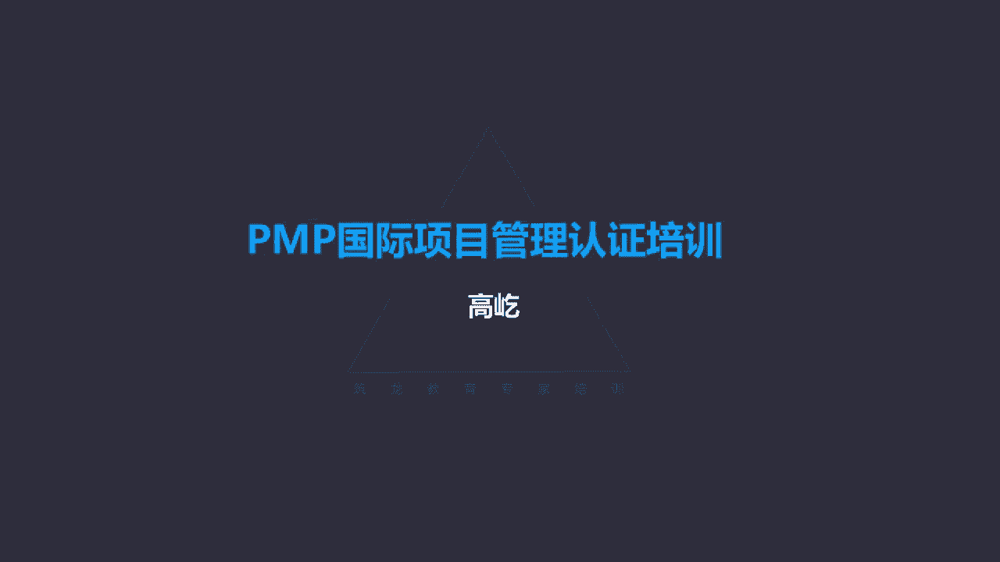

# K003-PMP项目管理认证培训 - P14：14.项目进度管理：排列活动顺序 ▲ - 与君共造价 - BV1eu4nerEJF

进度管理知识领域的第三个过程叫排列，活动顺序，排列活动顺序，这是识别和记录项目活动之间的关系，的这样一个过程，要定义工作之间的逻辑顺序关系，咱们前面在讲工作分解结构的时候。

我们说分解出来的工作包要满足百分之百原则，也就是不能缺漏，既不多也不少，但是在那个过程中，我们并不强调顺序，也就是先有哪个工作包，再有哪个工作包，不强调工作包彼此之间没有顺序关系。

但是我们现在在做进度计划了，我们的工作经验告诉我们，需要完成的这些工作，彼此之间一定是要有顺序关系的，有的活动可能必须要先执行，有的必须要之后才做，有的活动之间是串行关系，有的活动之间是并行关系。

因此我们在编制进度计划的时候，我们必须首先要明确这些活动，我们已经梳理出来的活动清单，接下来需要完成的这些个具体工作任务，在具体执行的时候是按什么样的顺序来做的，所以这个过程的名字排列，活动顺序。

就是要搞清楚活动与活动之间的这种逻辑关系，这个过程里面最重要的工具就是紧钱关系，绘图法又叫PDM，也叫单代号图，这个名字有点多哈，说的是一回事，它的特点是用一个节点，用节点来表示活动啊。

用节点与节点之间连接的顺序关系来表示啊，这种逻辑依赖关系，颈肩关系绘图法有四种逻辑顺序关系，最常见的叫完成到开始，也叫FS的关系，就是finish to start，前面的结束了，后面的才能开始。

这是最常见的串行活动，在我们的工作中，在生活中，这种串行关系是最常见的，前面的工作完成了，后面的工作才能开始，但是还有其他的顺序关系，比如开始到开始，SSS也就是两件事要一起开始做。

有哪些活动可以互不影响，一起开始启动呢，我们生活中有没有这样的例子呢，有这样的例子，比如炒菜和做饭，两个灶眼，一个灶眼上，咱们炒菜，另一个灶眼上呢，比如蒸饭，你看这两件事互不影响，互不干扰。

可以同时开始，这是比较典型的开始到开始的关系，另一种呢叫完成，完成到完成是FF的关系，也就是这两件事要共同结束，这两件事都结束了，才能开始后面的第三件事，或者说这两件事都结束了，整个工作活动才算完成。

这就是完成到完成的关系，那么有没有完成到完成的这种具体的例子呢，这个也有，还是接着刚才说做饭的事，饭也好了，菜也好了，我们可以开始吃了，你看这时候这两件活动哎，做菜跟做饭哎。

这两件事又变成了完成到完成的关系，饭也有了，菜也有了，都完成了，可以开始吃饭了，这是完成到完成的顺序关系，那么还有一种比较奇怪了，叫开始到完成，也就是前面的工作开始了，后面的工作才能完成。

这关系有点怪啊，这个说实话确实不太好找，呃，特别典型的例子啊，你不信你可以自己试一试，你找诶，它很容易就变成了完成到开始了，但这不是完成到开始，这是开始到完成前面的事情要开始，后面的事情就完成了。

唉这个实际的例子不太多，唉但是有一次啊，有一次我上那个线下课的时候，有一位同事给了一个特别好的例子，我觉得挺恰当的，他说了哎我这孩子小，每天睡觉的时候啊，都得给他讲故事啊，妈妈讲故事讲故事。

不讲故事不睡觉好吧，给他讲哎，讲讲讲，这孩子开始睡觉了，那么我讲故事这件事就完成了，诶你看这个例子很恰当哈，孩子开始睡觉了，那么妈妈讲故事这件事就结束了，哎这就是开始到完成啊。

当然如果咱们自己具体的工作里面有哪个环节，他也挺别扭，哎，他也符合这个开始到完成这种方式，没问题哈，我们也支持，这也是紧前关系绘图法提供了一种顺序关系，光有顺序关系不够，我们还要考虑依赖关系。

什么是依赖关系呢，咱们书上一共给出了四大类强制依赖关系，选择性依赖关系，内部依赖关系和外部依赖关系，我们分别看一下啊，首先什么是强制依赖关系呢，强制依赖关系又被叫做硬逻辑关系，也叫硬依赖关系。

这种活动的依赖关系特点，这是活动本身的特性决定的，比如先挖沟，然后才能买管道，比如先打地基，然后才能盖房子，你看这两件事，这就是强制依赖关系，你只有先挖好了沟，你才能买管道，你说我反过来试试。

我先埋管道，埋好了，我挖沟这事这事咱做不了，这是活动本身的内在性质决定的，是咱们改变不了的，所以说它有客观的限制，这种限制这种制约咱们没有办法改变，只能遵守的唉，这叫强制依赖。

这是一种强制依赖关系的特点，哎活动的内在特性决定的，还有一种呢是由法律或者合同的要求决定的，法律或者合同都有强制力，咱们前面说过啊，在咱们项目管理知识体系里面涉及的各种文档，各种计划。

这里面合同是有最高法律效力的，这样一个特殊文件已经签订了，那么就要承担法律责任，唉这个法律的责任是必须要要承担的，是改变不了的，所以这种来自于法律或者合同的这种强制要求，我们把它称作强制依赖关系。

合同规定的合同条款描述的改变不了，但是注意这里面说到法律的条款，法律的约束，这里一定是与合同工作密切相关的，你看合同，这是最典型的例子是吧，合同是我们项目工作中的一部分，虽然说不是每个项目都有合同。

但是一旦有合同了，那么他就是我工作中不可缺少的一部分了，必须得到遵守，得到履行啊，他要受法律的保护，要承担对应的法律责任和义务，所以由法律或者合同要求确定的这种依赖关系，唉这个也叫强制依赖。

这种法律或者对应的合同条款带来的约束，与项目本身有密切的关联，这是强制依赖，那么另外我们在考虑强制依赖关系的时候，要注意一点啊，说不要把进度制约因素当作强制依赖关系，什么是进度的制约因素呢。

比如客户提出了，他说下周啊，下周一要完成这个项目，要交付时间不能改，唉这就是进度的制约因素，但是我们把这种禁毒制约因素，不认为是强制依赖关系，首先它并不是活动内在特性决定的，什么叫内在特性啊。

啊这个工作必须在下周一完成啊，周日周二不行，完成不了，做不到，那显然不存在这种问题，这种禁毒制约是客户主观上的要求，唉他要求我们，他希望在什么时候完成这个时间，日期就叫进度的制约因素。

它不是活动本身的这种内在特性决定的，所以他不是强制依赖，那么另一方面，只要没有形成合同条款，没有形成法律文件这种要求，这种需要它不是强制依赖，它只是个禁毒制约因素，那么当然如果客户的这样一个要求。

明确地体现在了合同条款里面，比如合同条款里面规定的具体项目完成日期啊，必须在某年某月某日完成，如果晚了，这就算延误，那这种情况下，那他就变成强制依赖关系了，因为它表现为了法律法规的强制性。

它成为了合同条款，因此说只要没有形成合同，不受到法律的约束，它仅仅是个人意愿的表达需要，它只是一个简单的进度制约因素，我们应不应该遵守啊，我们应该遵守，但是他还不是强制依赖关系啊，这点请注意。

那么再有一种也是源自于法律法规的强制力，这叫外部依赖关系哎，外部依赖关系也是法律法规的约束，但是这种法律法规，它体现在项目活动和非项目活动之间，换句话说，这种法律法规是来自于项目工作以外的啊。

当然既然体现为法律法规的约束力，那显然我们团队是无法控制的，我们只能接受，举个例子，比如我们的项目在实施过程中，由于操作不当，结果把当地一条河水给污染了，那么村民不干了，把我们告上了法庭。

最后法院判决了判决，说，我们必须在十个工作日之内，完成污染水体的清理工作，你看这个法院的判决，这就是典型的外部依赖关系，首先它表现为法律法规的约束，法院判决结果他当然有法律的强制力。

这是我们必须要遵守的，但是它并不是我项目工作的一部分，这个是与强制依赖关系要明显区分的，强制依赖关系的法律法规，强制力唉主要表现为合同条款的要求，而合同这是与项目密切相关的，它是项目工作的一部分。

而外部依赖关系，这种法律法规他也有强制力，因为它表现为法律法规嘛，他自己有强制力，我们要接受，要遵守，但是它与我的项目活动没有关联，它是我项目工作以外的，那就像刚才我们举的这个例子，污染水源的清理。

你说这件事是原来你项目计划的一部分吗，这是你项目范围的一部分吗，当然不是我们项目计划，我们的范围里面没有这件事，我们应该按照自己的计划一步一步往下做，但是因为我们把水源污染了，因为村民告我们了。

因为法院判决了，要求我们必须在十个工作日之内清理，那我们不得不接受，虽然它不是项目工作的一部分，但是我们也要接受，为什么接受啊，因为它是法律法规的约束，唉所以啊这种叫做外部依赖关系啊，外部依赖关系。

这种法律法规的约束来自于项目以外，它不是我项目原计划的一部分，这个是跟强制依赖关系明显不同的，唉这个请您注意区分，另外还有两种依赖关系啊，叫选择性依赖关系，什么是选择性依赖呢，它又叫首选依赖关系。

或者叫优选依赖关系，也叫软逻辑关系，你看既然是选择性了，唉有的可选了，因此啊，这种活动与活动之间的依赖关系是完全自由的，到底应该谁先做谁后做啊，究竟是并行还是串行，没关系，随意谁来决定呢。

我们项目经理和团队，那当然我们应该也不能随意的决定哈，应该基于具体应用领域叫最佳实践，怎么做，效率最高，怎么做，最能满足工作的要求，我们就怎么来做，所以这个选择权在我们项目经理，在团队自己哎。

所以说如果这几件事之间没有任何的啊，这种顺序要求我们自己来决定的，哎这就叫选择性依赖关系，最典型的例子，你看中餐啊，中餐就是典型的选择性依赖关系，你看那个图片里边哈，或摆了一桌子，好丰盛的鸡鸭鱼肉。

什么都有，荤的素的都有，哎，中餐的特点，他就是得把菜上齐了，哎上齐了，大家开始吃了，那么吃中餐的时候有没有明确具体的要求，说必须先吃哪道菜，然后才能吃哪道菜呢，没有吧，咱们中餐没有这个规矩。

那不是说必须先吃什么，然后再吃什么都给你上齐了，你爱吃什么吃什么，这第一块的加哪个，这是我们自己决定的，我爱吃肉，我先来口肘子，哎，这解馋，我想吃素的，这西兰花，我先盛这个北方人，我就愿意吃饱了。

我来碗汤，这叫溜溜缝儿，我是南方人，我愿意先喝汤，这个相对更健康哈，诶你看这个选择选择权，主动权完全在我们自己手上，唉我想加哪个加哪个，我想吃哪个吃哪个，所以没有明确的要求，具体的约束。

这个就叫选择性依赖关系，根据我们自己的呃，需要我们自己来决定，那么还有一种呢叫内部依赖关系，内部依赖关系就不一样了，这是项目活动之间的一种紧钱关系，也就是有顺序，有明确的顺序要求，但是这种顺序要求。

是在我们项目团队的控制之内的，这跟咱们前面讲过的那个强制依赖关系，就不一样了，强制依赖关系也是项目活动之间的这种约束，但是那种约束是不能改变的，那比如哎先挖沟，然后埋管道，你看这两件事。

这就是项目活动啊，那么这种项目活动的顺序关系，咱们团队没法控制它，你只能接受，只能先挖沟，然后埋管道，而内部依赖关系呢，这个不是了，我们可以控制，我们自己能够决定，当然前提是活动与活动之间有关系。

你看这个又是，区别于刚刚我们看到的那个叫选择性依赖关系，如果是选择性依赖关系，那么活动与活动之间就没有关联了，随意谁先做谁后做，是串行，是并行都行，我们自己决定，但是内部依赖关系前提有一定的依赖关系。

有顺序，但是呢这个顺序又不是死的，是我们团队可以控制的，比如典型的例子，你看换菜吧，哎这回啊这回是西餐了，吃西餐，你看这个就是比较典型的内部依赖关系的例子，吃西餐，这我没有太多的研究啊。

哎据说这个西餐上菜啊是一道一道上的人，这就是有规矩的，先上什么再上什么是先上汤啊，呃是是先上肉啊，哎有顺序一道一道上，这跟咱们中餐不一样啊，中餐是先摆满了菜，上齐了诶，大家开始吃西餐呢。

上一道吃一道吃完就撤撤了，再上下一道菜，桌子上总是干净的，那你看吃西餐哈，都是小桌，很小一个桌子唉，这顿饭也能吃的很好，中餐不行了，中餐桌子小，你摆不下了，我们讲究我们习惯就是把菜上齐了再吃。

那么西餐呢它是一道一道的上，这我确实不太清楚哈，具体先上什么再上什么，哎但是我知道最后一道菜，西餐最后一道菜上什么呀，上甜品，冰激凌啊，小蛋糕啊，哎全部都吃完了，哎咱们最后咱们来一个甜品，吃完了哎。

这西餐这顿饭结束了，你看这是他的文化也好，你说是他的习惯，传统也好，反正吃西餐他就有顺序哎，先吃什么再吃什么，那么这个顺序关系能不能改变呢，当然可以改变呀，哎我们几个朋友，我们一起家人聚会。

我们出去咱们吃西餐吧，哎有大人有孩子，你看这小孩紧着闹，哎别让他影响大人吃饭哈，来先把那个小蛋糕给他上上来，把那个冰淇淋给他盛一来，照理说这个甜品是最后一道菜，大家吃完了最后一道上甜品。

那么我现在要求你现在就给我上，能不能上啊，当然可以，没有说哪个服务员，那不就不行，你没吃呢，不给上，等你吃完再给你上，没这么倔的，你让上让上就给你上，哎，来宝贝儿，你别闹了啊，来先吃吧。

小蛋糕你先吃着哎，孩子不闹了，大人踏踏实实一道一道的吃，你看西餐，这就是典型的内部依赖关系，内部依赖，首先活动与活动之间有顺序关系，不是没关系哈，有这样一个顺序，但是这个顺序又不是死的，我们自己可控。

适当的我们可以调整，在一些特定的情况下，我们自己又能决定它的真正顺序，唉这个叫叫内部依赖关系，另外排列活动顺序的时候，我们还要考虑到提前量和滞后量的关系，什么是提前量呢，说相对于紧前活动。

这个紧后活动可以提前开始的时间，简单的说前面的工作没有充分完成呢，后面的工作就能提前开始的时间，这就是提前量时间，提前量时间，但一般在这个图里面用正数呃，说错了啊，用负数来表示提前量。

比如我们看到示意图A活动，B活动，这是完成到开始的关系，A结束了，B开始，但是你看横线上写着两天，这个两天代表的就是提前量时间，也就是A活动还没有结束呢，A活动结束前两天诶，后面B活动就开始了。

这个叫提前量时间，还有一个呢滞后量时间，滞后量，这是相对于紧前活动，紧后活动要推迟的时间，那也就是前面的活动已经完成了，但是后面的活动不能马上开始，要推迟等待一段时间。

这个推迟等待的时间我们就叫滞后量时间，提前量也好，滞后量也好，各位想想这两个时间会影响什么，同时不影响什么呢，影响一定影响的什么呀，影响的是工期，有提前量时间了，工期会怎么样呢，会缩短有滞后量时间了。

那工期会怎么样呢，工期会延长，所以啊有提前量，有滞后量了，那么活动的工期会发生改变，那么提前量滞后量影响的是工期，它不影响的是什么呢，不影响的是活动的持续时间，你看下面说了，持续时间。

估算里面不包括任何的提前量和滞后量，这怎么理解呢，比如说我们就用那个图作为例子，A活动B活动就两个活动，A活动两天，B活动三天，加起来五天完成了，在没有提前量滞后量的情况下，A活动两天，B活动三天，哎。

当B活动结束的时候，哎整个的工期是五天时间，那么加入了提前量了，比如加入了两天的提前量，A活动两天，B活动三天，加入两天的提前量，那么总工期变了，变成了三天时间提前两天嘛。

那相当于A跟B同时开始了B活动三天，B活动结束了，项目就完成了，那同样加入滞后量时间哎，A活动两天加上两天的滞后量时间，然后B活动有三天，那么工期变了，变成了七天，唉所以啊加入提前量滞后量，工期变了。

但是虽然加入了提前量滞后量，A活动该两天还是两天，B活动该三天还是三天，活动的持续时间并没有发生改变，并不能因为加入了提前量哎，某个活动的时间就缩短了，加入了滞后量，某个活动的持续时间就延长了。

这个不会，所以提前量滞后量时间影响的是工期，不影响的是活动本身的持续时间，它该多久还多久，那么通过前面我们考虑顺序关系，完成到开始，开始到开始开始到完成，还有完成到完成，我们又考虑了活动的依赖关系。

哎有强制依赖关系，有选择性依赖关系，有内部依赖关系，还有外部依赖关系，另外我们还要考虑啊活动的提前量和滞后量，有了这些信息以后啊，通过这些个工具，我们现在得到的叫进度网络图，我们现在看到了哎。

这是一个进度计划的雏形，注意啊，它仅仅是一个雏形，现在活动的顺序关系排列出来了，唉A结束了是B啊，B跟C同时开始，C结束了是D活动，我们把之前是这个定义活动，这个过程我们得到的活动清单。

那些个相对杂乱的不排序的活动，唉现在啊我们把它逐一的排列好了，活动顺序了，但是现在我们说它只是一个进度计划的雏形，就是因为进度计划，这个在我们现在看到的网络图里面，还没有任何的时间信息，进度计划吗。

哎这里面一定要告诉我们，什么工作活动哪天开始，什么活动哪天结束，但现在我们还看不到，所以我们现在有的只是一个简单的逻辑关系，一个进度网络图，有多个紧前活动的网络图，我们叫做路径汇聚。

也就是前面多项活动都完成了，这个活动才能开始这样的活动，叫做路京汇聚，同样呢有多个紧后活动，代表的叫路径分支，也就是某个活动完成了，后面有多个活动会开始哎这样的特定活动，我们叫做路径分支。

那显然无论是路径汇聚还是路径分支，都可能要么受到多个活动的影响，要么会影响后续的多个活动，因此说这样的活动通常都会有更大的风险，比如说路经汇聚，多个活动都完成了，才能开始这项活动，这是一个路径汇聚。

那么他就受到前面多项活动的影响，其中有任何一项活动不能完成，那么这个活动就不能按时开始了，同理路径汇聚某个活动完成，后面要开始启动多项活动，如果这项活动延期了，不能按计划执行。

那么后面这个活动也不能按时启动开始了，哎所以啊这都属于风险比较大的节点，这在未来我们风险管理的时候，还会继续的提到好，我们现在看到的排列活动顺序啊，得到的叫进度网络图，我们距离进度计划又往前推进了一步。

进度计划的编制有这样一个特点，按步骤按顺序执行，一定是先完成了某项工作，然后才能开始后面的活动，那么按照项目管理知识体系的这套理论来说呢，那就是过程之间有明确的顺序关系，一定是先做哪个过程。

然后是哪个过程，什么过程完成了才能开始什么样的过程，所以又要提一下咱们项目管理知识体系指南，25页哎，有一个大的表格，横坐标代表五个过程组，纵坐标左边这一列是十个知识领域，表格里面分布着49个过程。

前面咱们就说过这个表格啊，您一定一定把它背下来，为什么背下来呢，就是因为过程与过程之间，是有严格的顺序关系的，特别是我们进度管理活动如何去管理好进度，怎么去编制一个进度计划。

各个过程之间就有这种明确的顺序关系，完成一个过程以后才能开始后面的过程，最终我们能够得到一个能够指导管理项目进度，活动的进度计划好，那我们现在排列好活动顺序了。

