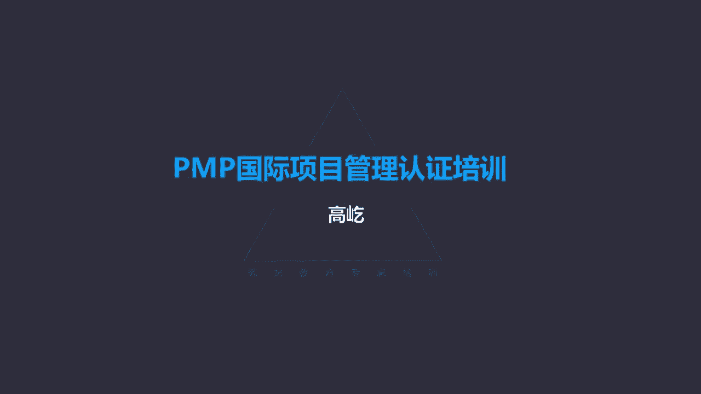

# K003-PMP项目管理认证培训 - P17：17.项目进度管理：资源优化与控制进度 ▲ - 与君共造价 - BV1eu4nerEJF

我们正推逆推，找到了网络图里面，每项活动的最早时间和最晚时间，那么现在得到了一个哎相对完整，完善的进度计划，但是这个进度计划真正就能切实可行吗，我们这里还需要资源优化技术，什么是资源优化技术呢。

唉资源优化是调整活动的开始完成日期，什么目的呢，唉调整计划使用的资源，要让它等于或少于可用的资源，其实也就是来调整工作与资源之间的，这种矛盾冲突，让资源变得切实可行，资源优化要根据资源的供需情况来调整。

进度模型的技术啊，那么包括了两种，一种叫资源平衡，还有呢一种叫资源平滑，我们分别来看看什么是资源平衡，什么是资源平滑，第一种，第一种叫资源平衡，资源平衡说，为了在资源需求与资源供给之间取得平衡。

要根据资源的制约因素，对开始日期和完成日期进行调整，什么情况下需要资源平衡呢，一种三种，一共是三种情况，第一种情况，这个共享的资源或者关键资源，只有在特定时间可用，第二种情况，这个资源数量有限。

不能充分满足，第三种情况哎资源被过度分配，如果出现了这三种情况，那么就需要通过资源平衡的方式来调整，资源需求与资源供给之间的唉这样一个矛盾，什么叫特定时间可用呢，比如我在项目工作中需要某种特定的工具啊。

比如一种专业的仪表，这种仪表还挺昂贵，他不可能每个项目团队都配这样一台，按照我的工作安排，比如说我明天我用这个仪表的话，一天时间有24小时就用完了，我的工作就可以继续往下推进了，这是我的工作安排。

明天我用一天的仪表，但是因为这个仪表是昂贵的，是稀缺的，我能用的时间不是明天了，是三天以后，因为明天明天那个表还在别人那用着呢，还没轮到我这个特定资源只能在特定时间可用，我倒想早用，没有啊，别人用着呢。

那表还没没过来呢，那么这种情况下我怎么办呢，那我就等呗，我只能等三天，三天以后我再来用，这个是特定时间可用，还有一种叫数量有限，比如说按照我的工作计划，我星期一明天明天我就需要十个人。

十个人来完成我的工作，可是资源部门告诉我了，抱歉，没有那么多资源，我最多只能给你五个人，你看我有十个人的资源需求，但是只能得到五个人的满足，他最多就给我五个人，数量有限，那怎么办呀，那你给我五个。

我就用五个呗，那工作工作完不成，完不成就往后推呗，那明天做不了，那就后天做，所以这是数量有限，那只能做有限的工作了，再一种情况呢叫过度分配，什么是过度分配呢，同一个资源被要求同时完成多项工作。

这就是过度分配，比如年底了啊，咱们单位啊要开个年会啊，开个联欢会啊，大家热闹热闹，那么布置会场这件事安排给我来做了，布置会场，比如说有三件事情，第一要调试灯光，第二要调试音响，第三还要安排座椅啊。

大家想想这三件事情能不能同时做呢，调试灯光，调试音响，安排座椅能同时开始吗，当然可以互相不影响嘛，哎灯光有一个小时搞定了，音响有一个小时也完成了，安排座椅一个小时完成。

那么我们就会安排这三个工作同时进行，并行执行，那么这样一个小时这个会场就完成了，就布置好了，诶，可是资源就我一个人，没有别的人，就是我自己，那你说那我怎么办呀，这不就是过度分配了吗，哎好遇到这种情况。

那我我只能我先调试灯光吧，搭好梯子，一个一个灯都试好了啊，坏灯泡换下来，调和室完灯光收起梯子，我到调音台，这我弄音响来啊，这这个扩音呀啊话筒啊啊这个音乐呀，我都调好了，哎又一个小时过去了，我喝口水。

喘口气儿，上个厕所回来，我再安排桌椅，等我桌椅都摆摆好了，我一看表，半天过去了，原本计划是一个小时就完成的，可是因为只有我一个人，我只能把这些逻辑关系上可以并行的活动，唉把它改成串行执行。

你咋没有人嘛是吧，只有我来做，你不能让我同时做几件事啊啊，那这种情况下过度分配了，那我只能一样一样的干，把并行改为串行啊，这个也叫资源平衡嗯，那我们看出来了，资源平衡其实啊它有个特点就是相对消极被动。

有资源就用，没资源呢，没资源就等有多少资源干多少活，没有资源，没有资源就不干了，延误怎么办呀，那就往后推迟呗，所以资源平衡，那为了保持资源的使用处于均衡水平，我们相对于被动地屈服于资源的配置。

有多少资源就干多少活儿啊，当然这种情况带来的直接后果，那就是关键路径可能发生改变了，关键路径改变意味着什么呢，工期延长了啊，工期可能会推迟，这是资源平衡的特点，我们看这就是一个资源平衡的例子啊。

书上给出的，你看原计划活动A活动B是并行执行的，哎汤姆八小时同时休也干八小时，这是活动A活动B呢休干八小时都完成了，开始活动C唉汤姆再干八小时，按照这样的计划，唉，第一天第二天两天就可以完成了。

但是我们注意了，这里边资源被过度分配了，哪个资源被过度分配了呢，哎这里边的修，他既要在A活动里面工作八小时，同时还要在B活动里面也工作八小时啊，那显然他没有办法既在A里，同时又在B里完成工作了。

那么因此这样的计划显然不具有可行性了，怎么办呢，哎我们要资源平衡了，来通过资源平衡，我们得到了下面这样一个图，第一天汤姆八小时休八小时A活动，第二天呢哎A活动结束了，B活动休再干八小时，第二天结束了。

第三天开始C活动，汤姆在干八小时，这就是资源平衡了，把这个被过度分配的资源修啊，让他的时间从并行改成了串行，唉这样这个资源与工作相吻合，满足要求，所以啊资源平衡，那它的特点是相对于被动啊。

比较消极的屈服于资源的配置，有多少资源就干多少活儿，那资源不足呢，那就工期延长，所以啊资源平衡往往导致关键路径改变延长了，这是资源平衡，那么还有一种技术呢叫资源平滑，资源平滑一字之差哎，内容变了。

资源平滑的特点，让资源需求不超过预定的资源限制，它的特点呢不改变关键路径，我们先看看结论啊，结论就是资源平滑不改变关键路径，那也就是不影响工期诶，那他是怎么做到的呢，很简单。

资源平滑相对于资源平衡来说更加积极主动了，平衡刚才说比较消极被动，给我多少资源就干多少活，有资源就干，没有资源，没资源就等，那结果工期延误了，而平滑呢这是主动积极主动的来调整工作活动。

去满足资源的限制要求，比如说我向资源部门提出了需求，明天我就要十个人完成工作，那人家告诉我了，那还是我最多就给你五个人，没有十个人，如果是资源平衡，那我就你给我五个人，我就干五个人的活呗，剩下的活呢。

那我就后天干，工期推迟了，这回咱们平滑了，我先看一看这十个人分别干什么，我是怎么分配的，哎我发现啊，这里面有三项活动要做，ABCA是关键路径活动，五个人完成，B活动呢非关键路径三个人完成。

C活动也是非关键路径，要两个人，唉，这样加起来一共需要十个人，共完成这ABC3项任务，那么现在他只给我五个人，那怎么办呀，好我让这五个人都去做A活动，A活动A是关键路径活动啊。

关键路径活动时间得到了保证，那么工期就不受影响了，因为关键路径决定工期，那那个B活动跟C活动怎么办呢，没关系，因为它是非关键路径活动，非关键路径活动会有什么呀，会有浮动，时间有总浮动，有自由浮动。

那么既然有浮动时间了，原则上不影响工期，所以啊B活动C活动你不是没资源吗，那正好不干了，哎，B活动C活动推迟唉，明天你看我要十个人，你就给我五个人，但是没关系，我让这有限的五个人都去做关键路径。

那个B跟C是非关键路径，那我就晚一天，我推迟推迟到后天再说，它既然是非关键路径了，那么它这个浮动时间就可以保证，就算推迟在一定范围内吧，他的工期是不受影响的唉所以虽然资源有限。

但是因为我优先保证了关键路径的资源使用啊，所以啊工期不受影响，哎这个就是资源平滑，你看资源平滑，它就相对积极主动了，主动调整工作的安排序列，该推迟的就要推迟，推迟什么呀，推迟非关键路径活动哎。

这时候总浮动时间自由浮动时间就变成资源了，变成一种呃资源使用的灵活性，通过合理的推迟，那么让更高的资源需求降下来，让资源与工作啊这种对应关系得到很好的满足，而且呢还不改变工期，那当然听起来是挺好。

但是资源平滑技术也不能保证，每次都让所有资源都得到优化，那比如说可以推迟是吧，推迟时间也是有限的，不能无限制的推演这个推迟非关键路径，但是在一定范围内唉，这种资源平滑的办法确实能够有效地缓解。

或者说解决资源与工作，资源需求之间的这样一个矛盾啊，这是一种特别好的资源优化技术，哎叫平滑，不改变关键路径，不影响工期，还有一种技术叫进度压缩，进度压缩技术，进度压缩当然指的就是工期缩短了。

但这里有一个前提，什么前提呢，叫不缩减范围，那换句话说该做的工作都要做，唉不能有偷工减料的情况，说我靠减少工作量，我来缩短工期，哎这个不行，不改变范围，不改变范围的情况下，怎么能让工期得到压缩呢。

我们这里面有两种方式，第一种叫赶工，赶工这种办法大家很熟悉哈，就是加班啊，通过增加资源，或者说呢延长时间，让工期得到一个缩短，唉赶工的特点哎就是增加资源，当然尽量以最小的成本代价来压缩，缩短工期。

最典型的加班是吧，延长工作时间，或者呢哎不延长工作时间，增加额外的资源，原来是五个人做哎，现在给你十个人啊，这样短时间的能完成更多的工作量，所以赶工增加资源的方式或者延长时间的方式。

这是一种进度压缩技术，那么赶工虽然能让工期压缩，但是啊也不能白白压缩，它有风险啊，或者说叫导致成本的增加，赶工最可能引起的负面影响就是成本增加啊，这是一种进度压缩技术，另一种呢叫快速跟进，快速跟进。

哎这个不加班了，这干什么呢，改变逻辑关系，正常情况下应该是顺序执行的，比如说A结束了才是B活动开始，串行的活动在现在啊，我们改了，我们改成部分甚至全部的并行哎，A和B并行开展，那么当然时间缩短了。

单位时间内同时开展更多的活动，快速跟进也有问题哎，快速跟进的负面影响可能造成反攻啊是吧，前面工作没有充分完成呢，你后边就提前开始了，那有可能导致反攻，这样引入风险了，风险增加了。

当然快速跟进也可能造成项目成本的增加，你想返工嘛，成本增加了，但是相比之下，快速跟进更大的负面影响是引入风险，那么类似刚才我们说的赶工，也可能导致成本增加，也可能带来风险。

但是更直接的负面影响就是成本增加，因为你加班了，或者说投入了更多的资源，这两种都是进度压缩技术，那么压缩进度就是改变了总工期，既然压缩了，那么说工期压缩以后，要重新判断项目的关键路径。

哎我们得识别一下哎哪个是最新的关键路径了，也可能工期压缩压缩压的多了，原来的非关键路径现在变成新的关键路径了，所以工期压缩后，要重新判断有没有新的关键路径出现，那么进度压缩技术刚才说了，就这两种。

一个赶工，一个快速跟进，我们这里总结了一下，赶工与快速跟进有四个相同，哪四个相同呢，第一都不改变范围，一开始就说了，这是个前提条件，不能靠偷工减料，减少工作量的方式压缩进度，第二都能压缩压缩工期是吧。

进度压缩技术嘛都能让工期缩短，第三都有负面影响，赶工可能导致成本增加，快速跟进可能引入风险，天下没有免费的午餐是吧，工期缩短了，你就要承担对应的负面影响，第四呢唉只针对关键路径，这是个特别重要的原则。

非关键路径原则上没有资格使用进度压缩，比如题目里面说了，网络图里面有两项任务严重延期了，那么接下来项目经理要怎么做，A马上赶工，B马上快速跟进C啊，听领导安排，那么D呢我想不出D来了，临时编的哈。

没有D了，比如这ABC吧，这时候你应该哎不对不对，说错了啊，说错了得有D没D不行啊，两个任务严重延期应该怎么做，A马上赶工，B马上快速跟进，C听领导安排，D呢，确定当前的进度状态，确定进度状态。

你看这道题应该选什么呀，这道题就得选D，为什么呀，虽然题目说两个活动严重延期，但是他并没有说什么活动延误啊，非关键路径也可能延误，但是非关键路径可能有大量的浮动时间，有总浮动，有自由浮动。

虽然说他没有按照最早时间按计划开始，但是如果哎它由大量的总浮动，时间虽然推迟延误了，但是原则上不影响工期，所以这时候我们不需要马上开始压缩进度，所以您记住啊，进度压缩技术只针对关键路径。

这是它的四个相同，不改变范围，能压缩进度都有负面影响，只针对关键路径，要优先对关键路径使用进度压缩技术，因为关键路径才决定工期，唉，你对它压缩才能产生最直接的这样一个效果。

那么这个过程输出的得到了什么呢，叫进度基准，什么是进度基准啊，书上告诉我们，经过批准的进度模型是进度基准，注意哈，又出现了进度模型，他可不是禁毒计划，是被批准的模型，那么当然已经形成基准了。

那要想改变一个道理，通过正式的变更流程，通过变更流程才能改变，这个没问题，但关键是什么是进度模型啊，下面又说了，进度基准包含了哎基准的开始日期和结束日期，这好理解，几月几号开始，几月几号完成哎。

这个能明白了，那怎么跟这个基准跟这个模型挂上钩呢，来监控的时候，我们既然成为一个基准了，我们要用实际的开始完成日期，与批准的这个基准开始完成日期来比较，看看是否有偏差，有偏差，要采取措施提出变更申请。

通过规范的变更流程再决定是否可以调整，哎，这是进度基准，那么同时还输出一个叫进度计划哎，进度计划，进度计划是什么呢，进度计划是进度模型的输出，它是进度模型的一个输出，各个关联活动标注了计划日期。

持续时间里程碑所需资源等等，唉这是进度计划，那到现在我们就得搞一搞清楚了啊，什么是进度计划，什么是进度模型，我们看这样一个例子啊，能够帮助大家理解什么是进度模型呢，左边这就是进度模型，你看两个活动。

比如分别叫AB吧，A活动三天，B活动两天哎，一共五天完成，这就是个进度模型，哎它的特点您发现没有哪天开始的，您知道吗，不知道哪天结束的呢，也不知道，我们现在能知道的就是每项活动的持续时间，A活动三天。

B活动两天啊，最终5号完成了，到底哪天开始的，这里不知道，比如说我周一开始的哎，A活动周一开始，那么整个唉这样一个两个活动完成的项目，唉，周五下班完成了五天嘛，那你要周二开始呢。

那正常情况下就是下礼拜一完成五天，中间有个6日嘛，双休日休息哈，所以进度模型只有逻辑关系哎，只有每个活动的持续时间，A活动是三天，B活动是两天，这里面没有任何日期的信息，没有明确的开始和结束。

这就叫进度模型，那什么是进度计划呢，嗯它是模型的输出，既然是输出了，你得有输入才有输出啊，输入什么呢，输入明确的开始日期哎，换一个这个就是进度计划了，A活动一号开始到3号完成，转过天，4号开始。

B活动到5号结束哎，这个就是进度计划，所以进度计划里面有明确的开始结束日期，包括每个活动的开始结束日期，包括整个项目的开始结束日期来，现在我们能区分了什么是模型啊，没有明确开始结束日期的。

只有活动的持续时间，这个就叫进度模型，那么回顾刚才我们讲的那个进度基准是什么呀，被批准的模型哎，被批准的模型就是进度基准，但是既然是进度基准了，这个模型要稍微增加点东西，增加了什么呢。

增加了项目的开始和结束时间啊，结束日期，那比如刚才我们做的那个例题是吧，A活动ABCDFGH一共八项活动，那刚才我们说的哎，假如这个活动是一号开始的，最后到18号下班完成，整个过程里面。

每个活动都有明确的开始结束日期，唉A活动一号上班开始，7号下班完成，转过天，8号开始C活动，C活动有六天的工作量，来13号完成C活动，你看每个活动都有明确的开始结束日期，那么这个就是进度计划。

但是进度模型呢，那A活动就是第一天开始到第七天结束，转过天，第八天开始后面的C活动，到第13天完成CA活动，整个项目第18天完成，那这个第18天这是几号啊，不知道没有明确的日期，只有持续时间的。

就是进度模型，那么这样一个模型经过批准以后变成了基准，变成基准以后稍微修改了一下，增加了什么呢，增加了开始结束日期，比如还是刚才那个例子变成基准了，那就是这个项目要一号开始，最终18号完成哎。

开始结束的日期是有的，但是中间每个活动还只是持续时间，到底几号到几号，几号完成，几号开始没有，因为它总体是一个模型模型，只有持续时间，没有开始结束的呃，没有这个每个活动的具体日期，但是成为基准了。

会增加上整个项目的开始日期和结束日期，一头一尾日期定了，但中间的时间没有，所有活动都有明确开始结束日期的哎，那就是进度计划，所以注意计划跟模型的啊这样一个区别，那么输出的进度计划有多种方式，有横道图。

有里程碑图，还有网络图，哎这是三种不同的样式，那么问题来了，什么情况下谁看什么图呢，或者说这个图应该优先给谁使用呢，横道图这个又叫甘特图，这是给谁用比较好呢，唉横道图优先给领导汇报工作比较合适。

因为它的图形特点清晰简洁突出，重点能够表达简单的逻辑顺序关系，每个活动几号开始，几号完成啊，活动之间简单的逻辑并行串行关系，也能表达出来，唉所以啊清晰明确，我们向领导汇报工作，优选甘特图。

里程碑图是给谁看的呢，里程碑图应该给外部客户，外部客户优先看里程碑图，因为里程碑上记录的只是重大的里程碑，节点事件，人家不关心你的过程是怎么样的，哎我不管你怎么做的。

反正到时间你就应该给我拿出对应的结果，人家关注的是里程碑，结果重大的节点，所以里程碑图更加的简洁，更加的突出重点，并且这些重点都是客户自己最关心的啊，所以给他们看最合适，那么进度网络图啊。

这个图表这是给谁看比较好呢，团队我们自己使用，因为这里面信息太丰富了，有逻辑关系，有活动的描述啊，有每个活动的责任人，有开始的最早时间，最晚时间啊，有总浮动时间，自由浮动时间还能找到关键路径。

你看这样一个图里面有大量丰富的信息，而这些信息呢，正好可以指导我们团队来完成进度工作，所以帮助我们的项目按时推进，项目团队使用进度网络图最合适，信息充分，所以啊制定进度计划有不同的输出。

不同的输出形式表现不一样，它们的特点不一样，他们的应用对象也各不相同，这个大家需要注意区分，下一个过程叫控制进度，控制进度过程，这跟咱们前面讲过的控制范围类似啊，控制进度，这是监督状态更新项目进度。

还有管理进度基准变更的过程，控制进度就是管理进度基准的变更啊，在整个项目期间，也要保持进度基准的这样一个维护啊，换句话说，既然形成了基准了，不能轻易改动啊，也可以改，通过什么呀，通过规范的变更流程。

让这个进度基准才能得到调整更新，那么在这个过程里面，那书上给出了一个一个关于敏捷的啊，一个进度计划方式叫迭代燃尽图，哎这是敏捷里面会用到的一种，用于追踪进度的一种图表，它的特点简单介绍一下。

横坐标代表的是时间，纵坐标代表的是对应的工作量啊，工作量通常用叫故事点数来表示啊，这个具体内容啊，咱们最后在关于这个敏捷的一些概念里面，再详细介绍，简单先说一下，那么随着时间的推进啊。

时间零点时候所有的工作没有开展的啊，这个工作量最多，所谓的故事点数最大，随着工作开展了，时间的推进，工作逐步的完成，那么剩余的工作量逐步减少，一直到最终项目完成了，所有的工作量都完成了。

哎这个所谓的燃尽图啊，图线跟横坐标相交了，燃尽图嘛燃烧啊，什么时候把这些工作量打个比方，烧光了，工作任务就完成了，所以啊用这种追踪迭代未完项的工作活动，通过对工完成工作量的这样一种图形化的表达。

唉我们能够知道当前的工作状态怎么样，包括最后剩余这个工作计算，我们可以计算出它一个趋势，来预测剩余工作完成是否能按照计划执行，哎这个叫迭代燃尽图，考试里面一看到迭代燃尽图，那一定您记着这是与敏捷相关的。

它是敏捷概念里的一个工具好，那我们控制进度。