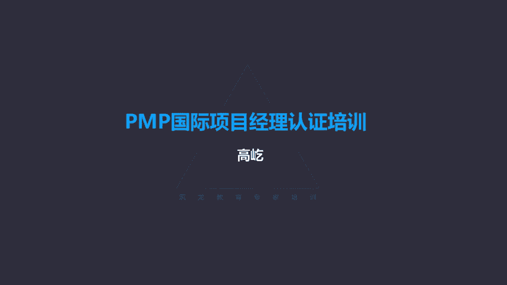

# K003-PMP项目管理认证培训 - P23：23.项目质量管理：流程图、矩阵图等技术 ▲ - 与君共造价 - BV1eu4nerEJF

下面的工具哎是数据表现，数据表现工具里面包括流程图，流程图的特点，显示活动决策点，分支循环并行路径及整体处理顺序，流程图我们并不陌生，哎我们小时候学计算机哈，老师教过我们画流程图，一个圆点代表开始了啊。

数据往下走，碰到菱形，菱形是什么呀，是判断是继续否回来循环，最后整个数据输出结束了，流程图，流程图的作用是什么呢，能够帮助我们确定故障所在的位置，他把一个过程完整的展开了，能够有助于通过流程图。

有助于帮助我们确定问题在哪个环节发现定位，故障哎，这是流程图的一个作用，还有呢矩阵图，矩阵图行列交叉的位置来显示因素原因，还有目标之间的关系强弱，一会儿我们还有例子啊，再给您详细介绍，包括思维导图。

这也是数据表现工具之一，咱们前面讲过这个思维导图，它是对头脑风暴得到的大量有创意的，但是比较杂散的信息进行一个合理的归纳梳理，来体现活动与活，这个呃各个呃各个这个这个得到的啊。

这些个信息彼此之间的依赖关系和彼此的关联，这是思维导图规划质量管理输出的呢，质量管理计划，这是它的输出之一，质量管理计划，遵循了咱们前面的这样一个原则哈，高层次的方向指南性的东西。

所以它描述的是如何实时适用的政策程序，还有指南以实现目标来，这是质量管理计划高层次方向指南的内容，那么还有一个呢质量测量指标，质量测量指标，这不是高层次的了啊，他是专用于描述项目或产品的属性。

什么是属性啊，具体的细节，它的长度啊，尺寸啊，重量啊啊质地啊等等等等，所以啊具体的产品属性，包括如何来验证符合程度，也就是你怎么来测量，测量的方法是什么，所以质量测量指标这个不是高层次的了。

虽然它也是规划质量过程的输出，但是它的内容是特别仔细全面哎，严谨的告诉我们，产品服务或成果应该具备应该满足的质量要求，质量标准包括怎么去测量，如何让它满足质量标准，所以规划质量管理。

跟之前的各个规划过程不太一样了，咱们前面讲过的规划范围，规划进度，规划成本，他们输出的这个某某管理计划，都是高层次方向指南的这样一个作用，而规划质量管理呢既有这种高层次方向指南的，比如质量管理计划。

质量管理计划里面没有明确的质量，没有明确的什么质量呢，没有明确的质量要求，质量标准，那这个质量标准要求在哪呢，同样是这个过程的输出质量测量指标，所以规划质量管理这个过程，既输出高层次的方向指南。

质量管理计划同时呢也有特别具体详细的，特别严谨的质量测量指标，这个跟其他规划过程不太一样，大的方向政策原则，我们看质量管理计划具体的质量要求，质量标准，包括测量的方式方法，我们要看质量测量指标。

他们都是规划质量过程的输出之一，那么下面第二个过程叫管理质量，管理质量，把组织的质量政策用于项目唉，而且呢要将质量管理计划转化为可执行的，质量活动的过程，管理质量，所以管理质量的本质是干什么呢。

管理质量的本质，制定与质量活动密切相关的流程，政策制度，这些个政策制度当然从哪来呀，啊来自于质量管理计划，但是质量管理计划里面是高层次的，是方向指南的要求，那么管理质量这个过程就要把那些高层次的。

高高在上的那些个方向指南的内容具体落地，比如我们质量管理计划里面，我们规定了我们要遵循代名的质量原则哎，PDCA持续改进质量，这个内容是质量管理计划里面记录的，但是在具体实施过程中。

怎么能做到PDCA呢，怎么做到持续改进呢，我们要遵照戴明的管理思想，制定出具体的质量应对办法啊，质量检测的手段啊，质量的方法这些个工具唉，这是管理质量过程来落实的。

所以说他是把质量管理计划那些高层次的方针，政策原则，要把它转化落地，变成可执行的具体质量活动，变成一些测试的要求啊，一些执行质量管理活动中的具体工作哎，这是管理质量的一个作用啊。

那么管理质量还有向相关方展示，项目的总体质量状况，在全项目生命周期里面，都要去开展管理质量过程，哎，这个说法是第六版项目管理知识体系指南，才出现的，在以前第五版集以前。

这个过程有另一个名字叫实施质量保证，质量保证，生产制造领域里面这个说法用的比较多，叫QAQA就是质量保证，那么在第六版了，改了不叫质量保证了，因为质量保证这个说法，它的应用领域相对比较狭窄啊。

生产制造领域这个行业呀，对质量保证比较熟悉啊，易于理解，可是咱们项目管理知识体系，这是有普世性的一套管理思想啊，管理理论，所以不光生产制造领可以用，建筑领域也可以呀，it行业也可以呀，包括医药卫生。

包括金融保险地产，你看各个行业领域里面，都可以运用项目管理的啊，这套方法这套原则，那么其他行业，那可能就对质量保证这个说法就比较陌生，这什么意思啊，不好理解，在我们自己的工作里面找不到必要对应的啊。

这个关联性好，那现在改了，我们不叫质量保证了，叫管理，质量加上管理两个字，什么叫管理质量呢，实际上管理质量指的就是具体做质量，在做质量活动，咱们这套理论里面49个过程啊，其中包括管理质量。

还有呢还有管理沟通，还有管理相关方参与等等，哎其他几个过程也叫管理某某，那我们发现了哎这样几个过程，它们都属于什么过程组呢，执行过程组他们都属于执行过程中，所以啊都是在做哎做具体的工作，管理质量。

这就是做质量管理沟通，具体的落实执行沟通，管理相关方参与，那就是让相关方参与计划里边的那些个啊方法，那些个手段具体落地得到应用，所以管理某某实际指的就是具体在做什么事情，那么管理质量就是做质量了。

具体做什么质量呢，管理质量首先要包括所有的质量保证活动，所以它在原有的基础上，它的内容扩大了以前说的质量保证，那么现在管理质量全都有，也就是制定与项目活动密切相关的流程，政策制度。

这是管理质量这个过程的工作活动之一，那么管理质量是所有人的共同职责，为什么呀，因为质量涉及到每个环节，涉及到每个人，没有人可以置身度外的，所以这里提到啊，包括项目经理，团队发起人啊。

甚至连客户都应该参与到质量活动当中去，在敏捷的项目里面谁来完成啊，质量管理是所有团队成员都要具体执行，但是我们传统的项目里边，这个质量管理活动通常是特定的团队成员，比如质量团队或者叫质量经理。

或者有特定的质量部门来他们来完成，所以质量保证啊，这是所有人的一个职责，那么管理质量除了有刚才我们说的，实施质量保证过程的所有工作责任以外，它还有补充新的内容，什么新的内容呢。

我们一会儿会看到就是发现问题，分析问题，还要解决问题，我们先看看管理质量过程用的一些特定工具，比如核对单，什么是核对单呢，check list就是核对单，核对单叫结构化的工具，什么意思啊。

什么叫结构化呀，提前有设定的一些检查项，唉，这就叫结构化，所以所谓核对单是什么呀，就是一个需要完成需要检查的工作，细目可以避免遗漏，所以它的作用，它可以确保一系列步骤是不是已经得到执行了。

执行完了打个勾标记一下，哎，这就是核对单，核对端看起来很简单，但是作用确实很大，核对单应该包括包括所有的验收标准，满足验收指标了，我就打一个勾，满足了我就打一个勾都打完了，验收通过了，所以核对单。

核对单就是一种确定接下来的工作活动里面，哪些是应该执行，应该做的啊，这些个环节，这些个具体工作内容，它的作用呢避免出现遗漏，这是核对单这种工具的特点，那么另一个工具叫因果图。

因果图这个工具在历次考试里边，几乎每次都会考到，考察的比例特别高，我们就得知道什么是因果图，怎么用因果图哎，他有什么样的作用，因果图另一个名字啊，叫鱼骨图，也叫石川图，还叫YY分析图，还有的呢叫鱼刺图。

这个名字挺多哈，说的是一回事啊，这是一个日本人叫石川，也是一位质量专家，他率先提出来的因果图或叫鱼骨图，最早是用在生产制造领域里面，是用来发现导致这种缺陷，零部件的一个根本原因的这样一个工具。

你看那个图是吧，就像一根鱼刺一样，一般右边是鱼头，鱼头冲右，那么左边鱼身上呢导致原因的各个方面因素，那么从各个方面里面，我们要找到导致问题缺陷的根本原因，你看根本原因这四个字，咱们标红了。

工具类题目特别要注意啊，记住它的关键词，如果题目里面出现了，要找到根本原因这样的字眼，那么你一定优先选择的，就是鱼骨图或者叫因果图，那怎么来找根本原因呢，很好找，你看这个图的名字又叫YY分析图。

什么叫YY分析图啊，就是不断的问为什么哎，为什么为什么多问几个，为什么我们能够找到问题背后的叫深层次原因，深层次原因这就是根本原因了，比如举个例子，线下课程哈，线下课程哎，下午刚一上课。

我就发现有一个同学趴那睡觉了，嚯睡得真香啊，这打呼噜赶紧把他叫醒，哎醒醒醒醒醒醒，怎么了，怎么怎么这么困呢，怎么睡着了，这同学挺不好意思哎呦，不好意思不好意思，我这太困了，哎怎么这么困啊。

我刚才我这中午吃饭吃多了啊，平时平时一碗的饭量，我今天吃了三碗，吃多了，我这血都跑胃里去了，大脑缺氧了，所以我我睡觉了，哎你听他说他中午吃饭吃多了，下午睡觉了，这是原因吗，这当然是原因了。

他说的没错啊是吧，俗话说了，饱了发困，饿了发呆啊，你中午吃多了确实容易下午困倦是原因，但是这不是根本原因，那我就得问了，你为什么中午吃多了呀，嘶我早上没吃饭，饿着肚子来的啊，这还差点迟到呢，所以好。

这不到11点我就开始饿了，一下课，我赶紧跑去吃饭，这一不留神吃多了哦，早上没吃饭，这是根本原因吗，不是还得问你为什么早上没吃饭呀，起晚了啊，不瞒您说，我这早晨都不是闹钟叫醒的，我是做梦把自己吓醒了。

一睁眼，这眼看迟到了，我哪顾得上吃饭呀，赶紧跑来，我上课来了，所以我这就早上没吃上饭哦，起晚了还不是根本原因，为什么起晚了呀，睡晚了啊，我昨天睡的太晚了，靠这都早上03：30快四点了，我这才上床。

这才睡几个钟头啊，睡得太晚还不是根本原因，为什么睡得这么晚呀，嗯我昨天我有一个同学来，大学同学，我们这打毕业也没见过着面，我十多年了，哎他出差到这，我们俩见面，我高兴哈，先是吃喝开心了。

下半场我们俩又唱歌去了啊，这唱完了，这回来可不嘛，到家都快四点了，哎行了，咱们连着问了五个为什么了啊，鱼骨图YY分析图，有时候叫五问法，咱不用再问了啊，够了，我已经找到深层次的原因了。

你为什么下午上课睡觉啊，根本原因是什么，根本原因是你中午吃多了吗，是因为你早上饿肚子了吗，起晚了，睡晚了都不是，根本原因是你昨天没休息好，你看你知道咱们今天要上课是吧，你就应该早点上床睡觉，别太晚。

最好别超过12点，早点睡觉，踏踏实实睡一宿，你早上就能按时起床，早上按时起了，你就能吃上早饭，吃了早饭，中午就不会太饿，中午不会太饿诶，下午你就不困了是吧，你饿你吃多了嘛是吧，不会吃太多，适量进食。

自然下午就不困了，唉我们找到了根本原因，你下午睡觉的根本原因是头天晚上没休息好，其他的呢，其他的不是根本原因，那是中间原因或者叫表面原因，所以我们通过因果图不断的问，为什么。

为什么我们就能找到与这个问题导致，导致问题出现的这个叫根本原因，那么根本原因是不是唯一原因的意思呢，这可不是啊，根本原因跟唯一原因不一样，根本原因只是某一方面的深层次原因，我们通过不断的问为什么。

为什么，来找到问题背后隐藏的，乃更深层次的叫根本原因，那导致这个缺陷的原因可能很多，最初的因果图从五个方面来查找，分别叫人机料法，环就是人员机器材料方法，还有环境这五个方面，通过不断的问，为什么。

为什么都可能找到导致问题的深层次原因，所以啊与古图或者因果图，它的作用是查找根本原因，而且呢根本原因代表的只是深层次原因，它不是唯一原因的意思，哎这个工具啊考试里面出现的概率特别高，一定要记住。

一旦看到题目里面提到了根本原因，唉，您就应该优先考虑，这是因果图了，下一个工具叫流程图，刚才咱们讲过哎，显示一个或多个输入，转化成一个或多个输出的过程里面唉，所有步骤的顺序，还有可能分支。

他把这个完整的过程展开了，所以呢我们能够清晰的看到这个数据也好，业务也好，它的流向他的走动的路径，因此啊它能帮助我们能够准确的定位问题，可能存在的环节在哪，出错了，用流程图来查找啊。

这是一个我们一个流程图的例子，他把一个过程你看完整的展开，我们就能知道它的执行过程了，下一个工具叫直方图，直方图，注意直方图是一种展示原因的工具，唉他是展示原因的工具，直方图不是找原因的。

刚才我们说的呃，那个因果图，因果图是找原因的，通过不断的问，为什么，为什么我们能够找到，导致问题缺陷的深层次原因，叫根本原因，那是查找原因的，而直方图呢这是一种展示原因的工具，原因我都找出来了。

原因有很多，但是如果我只表示成文字的方式，表示成数字的方式不直观啊，不容易被准确地理解，或者说啊他的这种呃，对人们的这种直观的刺激不太强好，那现在我改成图表方式了。

你看我用这种二维或者三维的数道来高高低低，来表示表达它出现的缺陷呀，啊包括数量啊，包括他的啊，这个不合规的次数等等，出现的数量越多，这数道就越高，反之呢哎次数越少，频率越低，这数道就比较矮。

他把数字的方式，文字的方式转换成了图形，更有视觉冲击力了，这对于我们来说能够一目了然，我们能够更准确地看到诶，有哪些方面存在的原因，存在的这种因素，所以直方图它的作用叫展示原因，注意啊，他可不是找原因。

因果图才能找原因，直方图呢是显示是展示原因的工具，再有一种工具叫散点图，散点图的特点，他是展示两个变量之间的关系，显示两个变量之间有没有内在的联系，我们看横坐标代表一个变量，纵坐标代表一个变量。

一个叫自变量，一个叫因变量，那么根据我们的采样落点，我们就能发现啊，这个因变量会不会根据自变量的改动，而发生改动，包括它的改变会不会有规律，所以通过散点图，我们就能够确定两个变量之间。

是不是有内在的联系啊，这是一种简单但是又特别有效的一种图表，但是呢您记住它的特点，它只能显示两个变量之间的关联性，后面啊我们还会介绍，能够显示三个变量之间的关系的那种图表。

现在我们看到的散点图只能展示两个变量，两个变量之间有没有内在的联系，是正相关呀还是负相关呀，也可能是不相关，因变量跟自变量的改动没有关联，也可能我们通过散点图来查看，那么再有叫矩阵图。

矩阵图它的特点在行列交叉位置展示因素原因，还有目标之间的关系强弱，比如我们看右边这个图的例子啊，哎先看他的图例，圆圈代表的是哎这个评价方法是好的，三角呢是一般打个叉字就代表差。

我们着眼点我们看重的是什么呢，我们看重比如时效性，改善效果，投入成本，还有可执行性，同时我们采取的分别什么对策呢，比如啊调整这个这个什么机台的参数，还有呢管控场内温度与落尘量，规范员工作业手法啊。

包括更换一些相关的材料唉等等，还有购买新的检验设备，哎那么这个矩阵图怎么来用呢，比如我们看第二条说管控场内温度与落尘量，这是一个具体的应对策略，那么这个策略在时效性上我们看打了个叉子啊，时效性不太好。

那也就是说你要想管控场内的温度，落尘对问题的解决从时效性来说并不好，不能马上生效，但是对于改善效果，我们看他画了一个圆诶，这是好的，立竿见影，只要能够管控住温度与落尘量，那么马上就能看到改善的效果。

但是投入成本又打了个叉子比较差，那可能成本太高了，那么这件事可执行性怎么样呢，它是个三角，一般也可能就是因为啊它的投入成本过大，虽然效果明显，但是可执行性这是一般的。

那再包括比如最后一个购买新的检验设备，购买新的检验设备，这件事情通过矩阵图我们来看到，在时效性上不太好，不是说买就能买到的，可能说买了你还需要安装，需要调试测试唉，所以时效性并不好，不是立竿见影。

但是在改善效果，投入成本，包括可执行性这几方面都给出了好的评价，所以啊你看这个矩阵图，就是我们要看行列交叉位置，我们来看因素原因，目标之间的这种关系强弱，这也是一种工具叫矩阵图。

另外管理质量过程里面还有一个重要的工具，叫质量审计，质量审计审什么呢，用于确定项目活动是不是遵循了组织的政策，过程与程序，它是一种结构化独立的过程，这书上说了，这样审计啊一般是外部团队来做的。

那么这样审计到底要干什么呢，我们总结一下，哎你看它有这么多的作用啊，质量审计我们总结两方面，一方面要审查质量和管理质量，这个过程制定的那些个流程，政策制度是不是得到了严格认真的执行。

这是质量审计的一个责任之一，题目里面说了啊，咱们这个课前也说了，要识别全部正在实施的良好及最佳实践，识别所有的违规做法差距及不足，我给你制定了政策制度了，你是不是遵守了呀，有没有按照我要求去做呢。

比如说管理质量制定的政策要求，三道质量检验要求抽样率不低于60%，那么这个要求提出来了，真正在执行层面是不是这么去落实去做了呢，我要去检查，要审计了嗯，比如可能我发现他根本没有什么三道质量检验。

检验了两次就完成了，这抽样率根本没达到60%，顶多也就40%，那显然我的政策制度是有的，你在执行过程中，你没有落地实施哎，内制药就要整改了，因此质量审计一方面要审查制定的政策制度，有没有得到正确的执行。

严格的落实，另一方面唉还要去审查什么呢，要求别人遵守的流程政策制度本身是不是合理，你要求别人遵守的制度，这个制度有没有问题呢，如果本身这个制度本身就有问题，那么你再要求别人去执行。

那反而还会影响阻碍了质量的改进，因此啊质量审计审两方面，一方面流程政策是不是得到了严格的落地执行，另一方面要求别人执行的这些个政策，制度本身是不是有问题，有缺陷，如果有要改进，要更新，所谓叫与时俱进。

这是质量审计，另外叫面向X的设计，这个比较简单哈，design for x哎，简单的说关注什么就面向什么而设计，关注质量啊，关注这个成本，那就是面向成本的设计，面向比如可用性呃，关注可用性。

那就是面向可用性的设计，我比较关注啊，这个比如叫舒适性，那就叫面向舒适性的设计，所以这个面向X的设计就是关注什么，就面向什么而设计，另外还有个工具叫问题解决哎，问题解决，发现问题还要分析问题。

还要解决问题，解决了什么问题呢，这是一会儿要讲的，控制质量过程发现的，不满足质量标准要求的那些个质量缺陷，我们要交到管理质量来解决了，咱们前面说了，管理质量以前叫做实施质量保证。

那么现在改了改成管理质量了，名字变了，它的内容责任也变了，一方面所有的质量保证工作他都有哎，制定政策制度，还要检查这些个制度有没有被执行，未完成，包括这些个政策制度本身是不是合理。

另一方面新增加的就是要解决问题啊，解决问题包括控制质量或者质量，审计中发现了发现有缺陷了，哎我们要通过这样一个流程来完成，首先定义问题，还要识别根本原因，还有生成可能的解决方案，然后选择最佳方案。

执行方案，最后还有验证方案的有效性，通过这样一个流程，保证被发现的问题得到彻底有效的解决，解决问题了，满足要求了，我们再由控制质量来重新检验，是否满足验收的标准，满足质量要求唉。

又有问题再来管理质量过程，通过问题解决唉，这样一个工具来逐一的彻底消除唉，这是管理质量过程的工具，问题解决，所以要注意验顺序，按照刚才说的这样一个定义，识别生成选择执行最后验证的顺序，执行。

那么之后我们输出的输出的叫质量报告啊，质量报告类似于什么呀，类似于咱们前面讲过的绩效报告，质量报告主要就是帮助其他过程和部门，采取必要的纠正措施，实现项目的质量期望，满足质量要求。

那么所以这里面包括存在的质量问题啊，包括提出的产品质量的一个改善建议，包括一些必要的纠正措施等等，这个是我们团队编写给领导，给客户，给外部的相关方，来，让他们知道。

