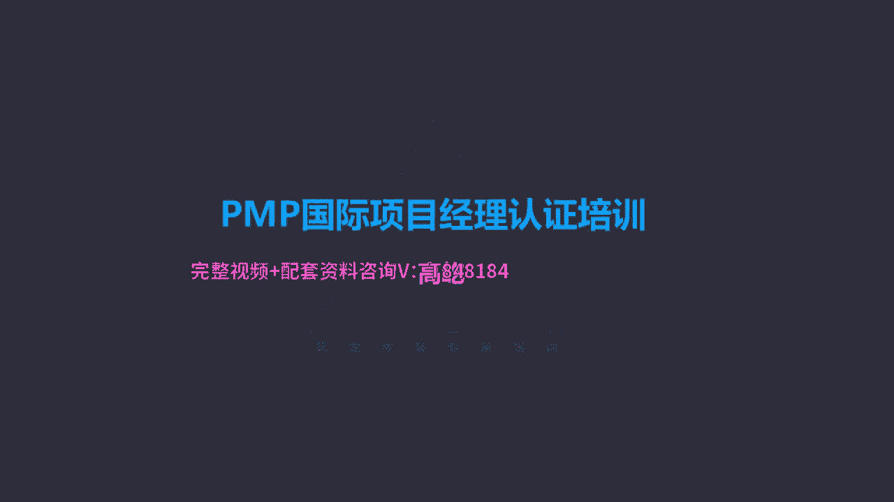

# K003-PMP项目管理认证培训 - P24：24.项目质量问题：因果图、控制图等技术 ▲ - 与君共造价 - BV1eu4nerEJF

第三个过程控制质量，控制质量过程我们并不陌生，前面已经都提到过了，这是干嘛的呢，评估绩效，确保项目输出完整正确且满足客户期望，而监督和记录质量管理活动执行结果的过程，哎这是控制质量过程，我们前面讲过了。

它相当于一个叫内部自检，正式验收，正式验收之前，我们内部自检的过程就是控制质量，正式验收是什么呢，确认范围范围管理知识领域里面确认范围诶，那个过程它的作用是正式的，外部验收，有发起人，有客户参与的。

而在正式验收之前，我们先要做好内部的自检工作，自己来检查核实我完成的这个阶段成果，或者整个的项目成果是不是满足质量要求，是不是满足验收标准，能不能供验收来这个使用，所以啊控制质量啊，他是核实可交付成果。

这个工作已经达到了相关方的要求，可以供最终验收，这是正式验收前的内部自检过程，他强调的成果的正确性，合规性，所以控制质量过程，要确定项目输出是否达到了预期目的，满足必要的标准要求。

法规规范满足了符合规范要求了，那么接下来我们就会进入叫确认范围，正式验收的过程了，控制质量唉，控制质量是用来验收之前，那么他强调的就是成果的叫规范性，所以他强调描制描述规范的一致和合规性。

而前面咱们讲过的确认范围，这个验收他重视的是什么呢，成果的可接受性满足要求了，能不能让客户让发起人接受成果，得到他们的确认验收，所以控制质量在前，确认范围在后，这是这两个过程之间的一些关系。

那么下面我们就看一看控制质量过程，主要有哪些工具可用，首先检查表，检查表很简单，又叫计数表，用于排列统计某项特定的事件发生的次数，发生的频率，哎这是一个检查表，就是把某件事情出现过的次数。

把它依次的记在表格里面，表格化了，变得清晰了，所以啊用核查表收集属性数据特别方便，你像这里面给出的例子啊，关于缺陷数量或者这个后果的这些数据，什么时间出现过多少次，最后合计一共是多少。

用表格的方式来表达，这是检查表，那么另外一个工具，这个在前面啊，咱们在管理质量过程已经出现过的，就是因果图，它的作用是一样的啊，注意啊，是找根本原因，如果题目里面提到了根本原因这样的字眼。

那我们默认首先应该用的工具就是因果图，代表深层次的原因，注意啊，不是唯一原因，下一个工具叫控制图，控制图也是以往考试里面经常出现的，考察几率比较高的这样一个图表，控制图的作用。

它可以确定一个过程是不是稳定，是不是受控，控制图的样式很简单，简单的控制图三条线，中间的叫中线，上下两边的叫上下控制界线，那么复杂一点的呢有五条线的控制图，上下叫规格线，那控制图怎么用呢。

哎控制图我们要看他的落点位置，上下控制界限以礼测量点，如果落在控制界限以里的，那么就认为哎这个过程是正常的，或者叫稳定受控，所以说控制界限代表的是正常的，叫自然波动范围。

我们上学的时候学过这个机械制图啊，那里面提到的叫公差，公差指的就是这里的控制界限，公差就是允许的，可以被接受的一个正常波动范围，比如说某个零部件，他的中线中线比如是十个毫米，控制上限是11mm。

控制下限是9mm，那也就是说你生产出来的这个零件，它的特定尺寸最大不能超过11cm，最小不能小过9cm，只要在九和11之间都认为是可以接受的，那按照我们这个控制图的说法，那这个状态就是稳定的。

就是受控的，所以说控制图最常用来，就是跟踪这种批量生产的重复性活动，某个零部件大量的生产，那么确保这些零部件生产都是稳定受控的，我们就可以用控制图中线的横坐标，代表的就是时间，随着时间的推移。

间隔一定的时间，我们取样，那么取样的测量值只要落在了控制上下限以里，我们认为这个过程就是可控的，这个状态就是稳定可接受的，哎咱们看一下这个图，这就是一个简单的控制图，看中线中线9。4mm，控制上限9。

5mm，控制下线9。3mm，那么随着时间的推进，不同的时间点，我们取不同的测量值，测量值落点只要落在了控制上下限以里，我们就认为哎这个状态是可控的，是稳定的，因为这个测量的值它是随机的状态。

所以只要落在控制界限以里，我们得到的结论就是当前的状态是稳定受控的，这个结果可接受，那么但是跟落点落的具体位置是没有关系的，并不是说哎这个落点越接近中线就越好，远离中线越贴近控制线。

那它的性能就变差了没有，只要是落在控制界限以里的，我们都认为是可以接受的，它叫稳定受控的，这是简单的一个控制图，那么这是稳定的，什么是不稳定的呢，啊不稳定的，当落点我们看图里面出现在了控制上限以外。

那当然也可能出现在控制界限下面，控制下限的下面，这都一样哎，这都代表不受控了，或者叫不稳定了，当落点落在控制界限以外的时候，当前的状态叫不稳定不受控，那这种情况怎么办呢，我们就要停下来。

正常的生产要停下来了，我们要检查找原因了，为什么它的落点落在了外面哎，找到原因还要解决这个原因，保证接下来的落点又能落回到控制接线以里，问题消除了，所以控制图哎我们用在控制质量过程的时候。

如果出现了界线外的点，那接下来这个问题就要交给咱们，刚刚前面讲过的管理质量过程，管理质量过程有个工具叫问题解决，通过问题解决这个工具，我们发现问题，找到根本原因，给出方案，选择最佳方案。

执行方案还要评估方案的结果，通过这一套流程，我们把这种问题彻底消除，然后我们再交回到控制质量过程内部自检，我们再来检查是否满足要求，这是一种情况，落在了控制界限以外，不稳定，不受控了。

那么还有一种情况落点落在了控制接线以里，也有问题，也是不可接受的，哎这个叫七点规则，也就是当中线的同侧连续的出现了七个落点，注意啊，有要求了，中线的同侧，或者在上面或者在下面连续的七个测量点哎。

这是重要的一个条件哈，一定是连续的，你说中线的一边，中线的同侧有七个点，这个不说明什么，中线的同侧可能有1万个点呢，但是如果连续的七个点都落在了中线的同一边，不管是上面还是下面，即使没有超过控制界限。

那么我们也说这个状态叫失控状态，因为落点的位置理论上应该是随机的，随机的落点就是上边落一个，下边落一个，上面落两个，下边落三个哎，随机的落，这个状态是正常是稳定的。

但是如果连续有七个点都出现了中线的一边，那就说明这个状态不稳定，不受控，或者说这个状态不随机了，他一定受到了某种外在力量的影响，被操纵了，那当然这个状态我们是不能接受的，这叫起点规则。

另外起点规则还有一种表现方式，连续的七个点落在中线的两边也不能满足要求，也是不稳定不受控的，这是什么情况呢，连续的七个点有相同的趋势，也就是一个点比一个点落点位置，比如增高，或者呢这七个点连续的七个点。

一个点比一个点的位置降低，连接起来是一条递增或者递减的曲线了，如果这种情况，那么连续的七个点有相同的趋势，我们认为哎这个状态也是不可接受的，不稳定不受控或者说不随机了，哎，所以控制图就是确定某个过程。

某个时刻是否稳定受控，那么刚才咱们也说了啊，简单的控制图是三根线，中线控制上线和控制下线，那么还有一种图呢复杂一些了，有五根线，也就是控制上限和下限的，外面又有两根线，那两根分别叫规格上限和规格下限。

规格上限，规格下限，那显然他的要求比控制界限要宽泛一些了，它落在外面了吗，那为什么还有那两根线呢，它跟控制线有什么区别呢，一般来说规格界限哎，这个是产品本身的特性要求的，或者说这是客户明确提出的要求。

而控制界限呢控制上限下限，这是我们团队我们自己设定的一个标准，一个更严格的标准，那可能有人会问了嘶，这咱们前面讲过讲过一个叫镀金的概念呀对吧，客户没有明确要求，我们自己主动地给人家增加功能，提高性能。

改善质量，咱们说过了，镀金是不被接受的，不应该镀金啊，人家没要求那么严格，你干嘛自己给设一个更严格的界限呢，那你这是不是涉嫌镀金了呢，哎注意啊，咱们控制界限跟规格界限之间的关系，这个不能叫镀金。

我们为什么要设置控制界限呢，在规格界限以里去设置，设置一个更严格的标准呢，我们的目的呀是为了便于提前预警，如果超过了控制界限了啊，或者说没超过控制界限，落点都落在控制界限以里。

那显然当前的状态一点问题没有稳定受控的，但是如果落在了控制界限以外，而且呢他没有超过规格界限，落在控制界限外边了，但是还得规格界限以礼哎，对应的哎，这个产品或者此时的得到的这样一个成果。

这个成果本身是可接受的，他不需要报废，它是有使用价值的，因为它落在了客户要求标准，或这个产品本身要求这个标准以里，所以说它是可用的，但是它落在了控制界限外，说明什么呢，状态不稳定了，这个持续的过程。

状态发生了问题，出现问题了，不稳定不受控，虽然当前得到的结果是可用的，但是它对应的状态已经失控了，那么失控的状态就可能导致更严重的后果，所以我们提前设置一个相对标准，更严格的控制界限。

唉它的好处在于能够及时的发现问题，我们及时发现了不稳定不受控的问题，我们马上停下来修正，让这个过程继续保持稳定受控，那么落在界限外的点，虽然说状态是不稳定不受控的，但是对应的这个产品。

或者说这个成果本身是不需要报废的，是可用的，因此控制图我们有的时候还会在规格界限里边，再加上一个要求更严格的控制界限啊，这是我们为了团队及时的发现潜在的问题，以便呢及时采取措施，消除解决问题。

来保证过程受控，所以这种方式这不是镀金啊，您记住控制图里边还可能有外面的叫规格线，但是只要落在了控制界线以外，就叫不稳定不受控，我们用控制界限作为判断的依据，一个是落点落在外面，再一个起点规则。

连续的七个点落在中线的同侧，或者连续的七个点有相同的趋势哎，一个比一个多，一个比一个高或者一个比一个低，那么这个都属于叫不稳定的状态，我们要纠正调整，就是控制图确定状态是不是稳定受控的。

下面的工具直方图前面讲过了，它的作用是展示原因，通过这种二维或者三维的数道，把文字的，把数字的这种方式统计的结果，更形象地表达出来，唉有更强烈的视觉冲击力，这个有助于我们来引起我们的重视啊。

吸引我们的这个目光焦点，所以啊直方图是展示原因的，那么直方图不光可以展示原因，稍微调整一下，唉他可以来查找原因，之前我们说找原因的只有一个工具，就是因果图，因果图找原因，通过不断的问为什么为什么啊。

一般用连续不超过五个，为什么我们就能找到导致问题缺陷的根本原因，也就是深层次原因，那个是因果图，而直方图呢，我们把直方图我们给它排个序，直方图是高高低低的，我们给它排个顺序。

从低到高或者从高到低这一排序，那么它就变成一个查找原因的工具了，现在现在他的名字也变了，叫做帕累托图，排序以后的直方图叫帕累托图，那么这还特别说明一下，帕累托图在以前以往的各个版本里面都有出现。

而且也是考试中经常要考的一个概念，但是咱们现在第六版，第六版项目管理知识体系指南，从这正文里面确实把帕累托图去掉了，没有了，但是根据前面几次考试第六版考试以来啊，之前的考试里面确实还有同学反映。

考试中又出现了关于帕累托图的概念，这可能也是呃PMI在更新题库的时候，也可能把一些老的题目没有完全剃掉，哎所以啊虽然书上没有了，我们作为一个补充知识，大家还应该知道了解什么是帕累托图，他是怎么用的。

很简单，它就是排序的直方图，通过排序我们能够找到问题的主要原因，你看他的名字吗，叫帕累托图，帕累托图源于帕累托定律，什么叫帕累托定律啊，也就是二八原理，一说二八原理，大家可能都听说过。

相对少量的原因往往造成大多数的问题，这是二八原理啊，也就是20%的主要原因，导致了大多数的这样一个结果，那么所以当问题很多，而且我们时间精力又有限的时候，怎么能够让唉当前的这个局面。

状态得到明显的改观呢，啊得到明显的修正呢，我不可能把所有问题都解决，那么我一定优先解决最重要的唉，最主要的那个原因，所以帕累托图唉根据二八原理，他能够优先发现主要原因，因此啊这种排序的直方图。

帕累托图它也可以用来找原因了，他找的是主要原因，比如我编制了一个应用软件，这个软件马上就要推出市场了，但是在正式上市前，我把这个软件呀先发给了一些一些个人，先做一个测试软件行业哈，这叫贝塔测试。

那么挑了100个人测试，他们给我的反馈，我做了一个统计，这里面有82个人都提到了，说软件的背景颜色太刺眼不好看，另外还有75个人说说运行的速度有点慢，用户名密码填好了一回车啊，等了都快一分钟了。

有的我都以为死机了，我都重启了啊，原来是进入的太慢了，75个人都反馈这个问题，另外还有30个人说说字体太小了，看不清，能不能弄大一点，还有15个人反映我这个软件的菜单不合理，结构不合理。

另外还有两个人说哎，用着用着过程中怎么自己就跳出了，我需要重新登录才能进入，你看反映出这么多问题来，我这个软件下礼拜就要上市了，我要都解决，那不太可能了，那么为了让未来上市以后。

哎这些个用户能有更好的体验，我应该优先解决什么问题呢，很显然优先解决那个提及人数最多的问题哎，颜色背景82个人都说颜色不好看，那么这个问题我就得赶紧解决，我换个颜色，换个浅绿色的眼睛看起来比较舒服。

唉这个问题解决了，再有呢运行速度太慢，75个人都反应打个半天半天的没反应，这个运行速度是个问题，好这个问题我要优先解决啊，我调整它的运算结构，提高它的运算效率，唉从一分钟缩短到了12秒。

12秒就可以正常的打开界面了，你看这两个问题，我要是解决了，预期我推向市场以后，大家的反应应该不错，那其他问题呢啊字体问题呀，菜单问题呀，包括中间突然自己跳出去了，那这种问题这种问题存在不存在呢。

依然存在，我并没有解决，因为时间关系没有时间了，精力也有限，但是虽然没解决，我能够预测未来推向市场，大家的这种满意度应该还不错，为什么呀，因为我把反馈最多的啊，提及人数最多。

什么意见最大的那两个问题优先解决了，颜色刺眼，运行速度太慢，这个是最关键最核心的问题，所以啊我先抓住了主要矛盾，二八原理嘛，我先把那20%的主要原因找到了，这个原因，哎我给予及时的解决，消除了其他问题。

就算依然存在，不影响大局了，所以帕累托图哎，他也是找原因的工具了，他找主要原因审题的时候，咱们就得看清了，如果问的是根本原因，我们一定用因果图哎，也叫鱼骨图，石川图，如果他问的是主要原因。

那我们这回就得用帕累托图排序的直方图唉，用它来找到主要原因，这是一个派托图的实例，你看这个树道是吧，直方图嘛从高到低来排序了，那排序了，我们就把排在最前面的当做主要原因，这样能够优先解决，同样是直方图。

如果单纯的说直方图它是展示原因的工具，而把它排序以后呢，有了高高低低了，我们就能够找到最主要的原因，它就变成了查找原因的工具，另一个名字了，叫帕累托图，哎，这个请大家记住，另外控制质量还会用到的散点图。

前面也提到过，展示两个变量之间的内部联系，自变量改变了，因变量会不会随之而动呢，包括因变量随自变量之间的这种关联，是正相关呀，是负相关呀，还是什么其他这种函数曲线的方式相关，包括不相关的情况。

表现两个变量之间的关系，用散点图，还有一个工具呢叫趋势图，趋势图说相当于没有界限的控制图，控制图有界限，上下控制界限，有的外边还有上下规格界限的，只要超界了，超出控制界限诶，状态就不稳定，不受控了。

但是趋势图没有界限，控制了它的特点，可以反映这种变化的趋势，所以啊趋势图最大的作用是预测，可以把趋势图当做一个预测的工具，根据既有信息，既有的数据落点，我们要找到规律，找到规律以后呢。

我们就可以推测未来这个落点的位置，包括它的走向，这是趋势图的特点，所以它可以预测，但是要想用趋势图预测前提条件，这件事情本身要有规律，有规律的，我们可以用趋势图来预测，根据既有的数据。

我们能够发现规律了，然后用这个规律来指导或者预测未来的方向，未来的走向，你看他们给出的这个图啊，这就是一个典型的趋势图应用的例子，这什么呢，这是股票股票里面那个叫K线K线图，这就是趋势图，根据以往啊。

他这个股票业绩的表现，你看我们就可以一定程度上做出适当的推测，一个走势很好的股票一直在上涨，那么只要没有什么特别极端意外的情况，你就不可能说他马上第二天暴跌，这不太可能业绩平平的一只股票。

一直在往下走呢，也是没有什么极端的情况出现，也不可能突然暴涨，他总是有一个趋势的，所以说有规律的事件，我们就可以用趋势图来判断，那么当然生活里边啊也有用错的，这件事没有规律，但是呢。

有些人还偏偏要用趋势图来试图找到规律，这什么例子呢，估计也能想到哈，彩票那买彩票，你看好多人买彩票，这本来也说这是个就是这叫什么小赌怡情啊，也不能叫赌吧是吧，咱们花两块钱买个彩票啊，万一要中了呢，是吧。

只开心一下，所以买彩票很多人都会买，但是有的人有点过分了，有点走火入魔了哈，希望通过彩票发财这事儿有点奇怪了，彩票本身是没有规律的事情，那个数据那个数字是随机的，虽然你总结了好多好多的历史数据啊。

上一期哪个数中奖了，这期哪个中奖哎，前几期是怎么样，这期如何，你统计再多有意义吗，没有意义，随机的事件没有规律，你再画你画这个图，这个曲线一会儿高，一会儿低，找不出规律来，所以啊你再画。

你也没有办法预测趋势图用于预测的情况，所以前提这件事要有趋势，我们可以用它，那么当然如果题目里面哎涉及到预测了，我们当然优选趋势图，可是如果没有趋势图，那我们应该选择什么工具呢，我们可以选择流程图。

流程图也有一定的预测功能，为什么呢，因为流程图把一个过程完整的展开了，让我们清晰地看到这个数据信息的走向，我们能够提前知道这个数据，接下来进入什么环节，唉接下来往哪个方向去发展。

所以啊流程图一定程度上也有适当的预测功能，但是它的预测功能是没有趋势图好的，如果需要预测优选趋势图，没有趋势图这个选项，那我们的其他选项里面，那我们就可以选择流程图，它也有一定的预测功能。

控制质量过程输出的叫核实的可交付成果，什么是核实呢，确定它的正确性，所以咱们前面讲了，他是一个内部自检的过程，要保证完成的阶段成果或者总体的成果，满足质量标准，质量要求，能够供验收使用。

所以啊这个核实的可交付成果核实的什么呢，核实它的正确性正确，没问题了，我们就交给叫确认范围，确认范围过程那个是外部验收唉，它是一个确定成果的可接受性的环节，所以之前正式验收之前先内部自检，这是控制质量。

它的结果就是核实的可交付成果，管理质量与控制质量，我们现在要做个区别对比了，通过刚才的讲解，我们发现哈很多工作这两个过程是循环的，你比如发现了缺陷了是吧，控制质量。

发现不满足质量标准质量要求的问题怎么办呢，唉要由管理质量来解决，解决完了呢，再交给控制质量，继续检测，又出现问题，还回到管理质量去解决，所以啊他们两个有各自的工作特点，管理质量，组织设计流程，制定目标。

提供资源，改进步骤，制定与质量活动密切相关的流程政策制度，并且呢要求控制质量过程来执行，发现了问题还要到管理质量来解决，而控制质量呢，就是根据管理质量过程制定的流程，政策制度。

对成果进行严格的检测来检查分析，监视汇报满足要求了，共正式的验收，不满足要求的交给管理质量去解决。

