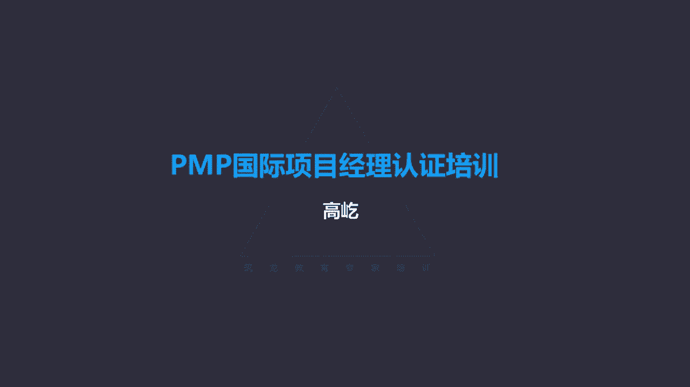

# K003-PMP项目管理认证培训 - P28：28.项目资源管理：管理团队和控制资源 ▲ - 与君共造价 - BV1eu4nerEJF

下一个过程是管理团队，管理团队做什么呢，注意管理团队跟踪团队成员的工作表现，提供反馈，解决问题，管理变更目的是优化项目绩效，唉这跟刚才我们说的建设团队不一样了，建设团队是干嘛呢，是提高绩效。

提高怎么来提高啊，大家的工作绩效水平降低了，比如疲劳了啊，大家懈怠了，冲突矛盾啊，这个时候我们通过建设团队啊，各种工具方法，比如集中办公哎，比如合理的奖励等等，来让大家的工作绩效水平得到回升，这叫提高。

那么优化呢，这是管理团队哎，优化绩效，我们本来工作挺正常的，现在出了一些问题，让我的工作绩效状况啊出现了波动，那我们现在要通过对问题的解决，来让工作绩效达到一个正常甚至更高的水平，这叫优化。

所以管理团队的核心就是管理冲突，解决问题，管理冲突唉，这也是我们管理团队过程中最重要的一个内容，那我们就看看唉针对冲突管理应该怎么来做，首先我们要了解一下冲突的概念和特点，在项目环境里面。

我们认为冲突是不可避免的，那种认为说想回避冲突，不产生冲突哎这种想法这是不现实的，团队中不可能消除冲突，这是一个大的原则，冲突不可能消失，肯定要有，那么再有冲突源自哪呢，从哪来的冲突呢。

这里面列出了几个常见的冲突来源，比如资源稀缺，有限的资源，大家容易争抢，那么在争抢资源的时候可能产生冲突，再有进度优先级，同样大家都是项目团队，你的优先级比我的高，那么预期你就能得到更多的资源。

得到更多的支持帮助，那我的项目优先级排在你的后面了，那可能我就很难获得更多的关注和支持，那凭什么呀，那为什么你的优先级就高啊，怎么我的就低呢，你看在优先级排序的问题上也可能产生冲突。

那么当然还包括个人的唉工作风格差异，性格问题是吧，你是急脾气，我是慢性子，那可能咱俩就会有冲突，但是虽然这里把个人工作风格，也当作冲突的一个来源，但是您记住啊，如果出现选项的话，这种个人工作风格的差异。

或者说团队成员主观上的这种性格导致的冲突，这个原因是最后最后才能选的，只要有其他的原因，原则上不能优先选择这种个体差异，当然除非题目里面明确告诉你，说两个人性格不合，那当然这就是个人工作风格差异导致的。

正常情况下有了冲突了，因为什么产生的呀，更多的都是由于资源稀缺，抢夺资源或者进度的优先级排序，包括呢工期紧迫，这些原因更可能导致冲突，那么另外冲突是不是一定代表，都是不好的事情呢，不是哎冲突也有好的。

通过那种好的冲突，我们能够让思路更加的开阔，我们能够选出最佳的一个方案，所以啊冲突不代表都是坏事啊，冲突也有他有利的一面，那么下面呢我们要看看冲突解决的顺序问题，如果团队里面出现了冲突了。

两个团队成员观点不和，发生了冲突，首先谁应该来解决呢，首先是团队成员唉自己负责解决冲突，各方大家自己来尝试着，把这个冲突得到一个有效的解决消除，当然虽然解决冲突哎，这个责任责任是来项目经理的。

但是第一次啊，首先做的事情应该是团队成员自己解决，这并不是说项目经理要忽视，或者说漠视这样一个冲突，我假装看不着，你们自己商量去吧，唉不是，而是说如果出现冲突了，项目经理先别着急介入了。

你应该先让这些个冲突，各方自己尝试着沟通解决，他们来解决，解决不了了，那么接下来冲突升级了，这时候项目经理再提供协助，我来介入你们这个冲突，帮你们来来调解，到底谁对啊，谁不对呀。

并且呢唉这个原则最大的原则就是私下处理，包括前面说的团队成员自己解决啊，自己解决也一定是私下的方式，项目经理协助解决，更应该是私下下班了，哎小张小刘嗯，先先留步慢走啊，嗯咱们坐一坐。

哎我看你们俩最近这个好像有点什么矛盾，怎么回事，能不能解决，来咱们谈一谈，来咱们到小会议室去，一定是私下的方式，这不能公开说开的例会呢是吧，例会上解决冲突，这就错了，项目经理主持的例会行了啊。

咱们工作先说到这儿了，小张小刘站起来，你们俩怎么回事啊，怎么打起来了啊，怎么冲突，什么问题呀，不能这样哎，不能公开解决，要私下处理，如果项目经理协助还解决不了，那怎么办呢，没关系，既然是平衡矩阵对吧。

除了项目经理，人家还有自己的职能经理呢，所以这个时候项目经理解决不了了，应该把职能经理拉进来，协助配合解决冲突，当然还是私下不公开的方式，那么如果再解决不了，说这种破坏性的冲突继续存在。

大领导不关心你们这个冲突的事儿，如果职能经理加入了，还解决不了行了，差不多得了，别没完没了了，这时候要采取惩戒措施，我们后面会讲到的叫处罚的手段，用这种手段让这种冲突迅速终止，行了就到这了啊。

不许再冲突了，这时候靠什么呀，靠权力，靠权力压制，因为这种破坏性的冲突如果长时间的存在的话，可能啊会蔓延，可能会影响到团队的其他人，甚至影响到项目的工作，所以这是冲突解决的一个顺序原则。

首先团队成员自己想办法解决不行了，项目经理加入项目经理还解决不了，职能经理也过来帮助解决，唉，这都是私下不公开的方式，如果再解决不了了，那么要迅速的用这种惩戒的方式，处罚的手段，迅速让冲突得到消除。

不能让这种有害的冲突长时间存在，存在于这种团队里面，这是冲突管理，解决冲突的一些特点，一些原则好，那接下来我们就看看呃，具体冲突管理的一些方式手段，书上一共给出了五种办法，第一种办法叫撤退，回避。

撤退回避，这种办法的特点是从实际或潜在的冲突中退出，退出来了，撤退吗，撤退回避这个冲突，我现在先不解决呢，哎留待以后再解决，所以问题推迟，这个就是撤退回避，他不解决冲突的本身只是先从冲突里面撤出来。

比如说项目例会上，两个团队成员因为观点不和发生了冲突啊，很快他们的语气变得强硬了，说话中开始带有不礼貌的用语了，这时候项目经理宣布散会，你看这个办法，散会这个手段就是撤退回避，解决冲突了吗。

到底谁对谁不对呀，没解决，但是散会了，你看你们俩这不在会上的问题啊，你互相不同意，他也不同意，他也这个这个彼此之间意见不能统一吵起来了，这种情况下不开会了，散会了，把你这个冲突的环境给你去掉了。

哎这样这个冲突管理的手段用出来了，这就叫撤退回避，为什么不解决冲突本身呢，为什么只是单纯的撤退呢，这个好理解，因为现在太冲动，那大家的冲突很激烈，在冲动的时候，人们呀失去理智了，在失去理智的时候。

你给别人讲道理有用吗，显然没用，这时候你说谁对呀，谁不对呀，听不进去啊，因为他他现在冲动了，是吧，他不冷静了，他没有理智了，这时候不能解决，你解决不了的，所以最好的办法是什么呀，叫降温，唉行了。

那先到这儿吧，这事儿搁这儿先不说了，等什么时候再解决呢，等你冷静了，等你恢复理智了，唉咱们再来解决这个问题，到底谁对啊，谁不对呀，再讲道理，那会儿能听进去，所以啊撤退回避是为了降温。

你看生活中有特别典型的例子，什么时候我们就用撤退回避呢，打架的时候，有的时候啊，这个街头啊有这种不文明的现象了，俩人不知道什么原因打起来了，过看着啊越说火越大，这互相这领子都薅在一起了，这都要动手了。

这时候你看是朋友啊，是好心人呀，劝架哎，劝架这时候用的就是撤退回避，各位您注意，这个时候劝架是要有技巧的，这时候劝架应该做些什么呢，一定是啊把两个人分开唉，赶紧把手掰开了，他都别抓着了，这个往那边推。

这个往这边推，两个一定要分开，唉越推越远，最好俩人都看不见了，这才好呢，而且一边推咱这劝架的嘴里还得说，你看这时候说什么呢，很简单，别动手，有话好好说，别打架啊，就说这样的话，哎你看一看劝架的都是这样。

一边推一边说，哎别动手，别动手，好好说，好好说，有话慢慢说，别动手，别打架，都是这样对吧，一边推一边说，推远了，哎，答不起来了，你说这个时候你能给他讲道理吗啊，一边推他，一边跟他讲道理，哎你别动手。

你不对，这事不怨他，这事怨你连你一块揍好，你这拉偏架呢，凭什么说我对我我错了呀，我就觉得他有问题，你到底哪头的呀，这时候不能解决，不能这个解决冲突，因为不冷静啊，现在不理智了是吧，他听不进道理去。

所以撤退回避，针对这种叫比较激烈的冲突，他不解决冲突本身就是为了降温，等你消了气儿了，等你恢复理智了，唉咱们再来解决，那么因为他不解决冲突本身，所以撤退回避最典型的特点过后了，这个冲突可能再次发生。

因为你当时就没解决嘛是吧，当时没解决，那事后事后可能这件事又出来了，还是这个冲突唉又发生了，这是撤退回避，为了降温，另外还有一种办法叫缓和包容，缓和包容，它的特点叫强调一致，而非差异，也叫求同存异。

缓和包容怎么就能缓和包容呢，书上说了，为了维持和谐与关系，退让一步，考虑其他方面的需要，注意啊，缓和包容里面提到了退让一步，但是这里的退让一步他指的是什么呢，是放弃自己的观点吗，不是哎。

这里的退让是强调一致，为了强调一致，而非差异来退让，咱们俩是有矛盾，有这个观点不一致的地方，但是咱别老盯着这个不一致的地方啊是吧，咱有相同的地方啊，所以应该强调一致，求同嘛是吧，咱们强调一致。

所以退让一步退的是什么呀，别老盯着那个差异了，你老盯着差异，咱俩怎么谈啊，这事儿谈不成了是吧，咱们退一步，别强调这个差异，咱们强调一致，咱不是有共同点吗，哎求同存异，你看求同存异，我们看的是相同点。

那个差异差异还有没有呢，有差异差异是存在的，只不过咱别老盯着差异呀，你老盯着差异，咱没法谈了是吧，咱们盯着那个相同点共同点哎，这样求同同时存异，我们把更多的精力关注点放在那个相同一致上。

诶这样有助于冲突的缓解，所以这个叫缓和包容，你看特别典型的例子啊，两岸关系，我们就应该用缓和包容的方式，也就是强调一致，而非差异，各种原因是吧，历史原因几十年分开了啊，大家的生活习惯也不一样。

政治制度也不一样，那么必然这是有差异的，但是咱别老看差异呀，咱得强调一致啊，什么是一致的呀，一个中国就是一致的，大家都是中华儿女是吧，我们都是炎黄子孙，血浓于水，有什么不能谈的呀，唉咱别老强调差异。

强调一致，一个中国是吧，一个中国的基础上咱什么都能谈，所以两岸关系就能得到缓和，那你老强调差异是吧，老觉得我是我，你是你啊，咱俩水火不容，那你这个冲突就会激化了，所以缓和包容是强调一致，而不是差异。

这个退让一步退让什么呢，哎不要老盯着那个差异了，我们要强调一致，虽然强调一致，但是差异是存在的，我们承认有差异哎，为这个来退让，这叫缓和包容，还有一种办法叫妥协，调解妥协，你看什么叫妥协呀。

为了暂时或部分解决冲突，寻找能让双方在一定程度上满意的方案，哎妥协怎么叫妥协呢，主动的放弃自己的部分观点，这就是妥协让步哎，这个让步跟刚才我们说的缓和包容的让步，不一样了，刚才说了缓和包容也让步。

也退让一步，那个退让的是什么呀，唉不老盯着差异了，咱们老盯着差异没法谈，我们把目光焦点聚集在相同点上，求同存异，退让一步，虽然退让了，我们不强调差异了，但是差异存在吗，依然存在。

那个是缓和包容而妥协调解呢，这个不一样，这也是让步，妥协就是让步吗，但是这个让步是什么呢，是主动的放弃自己的部分观点，你看咱俩人有冲突了，咱们两个人在十个问题上都有冲突，互不相让。

我们用了妥协调解的办法好了，这十个问题我放弃其中四个问题的主张了，我不提了，哎那四件事咱不提了，我主动放弃我的观点了，诶你也放弃了你的四个观点，那你看原来咱们的冲突点是十个方面，现在好了。

双方各让一步了，妥协了吗，都把自己的四个观点放弃了，哎不再提了，那现在好了，我们的冲突就剩下六个了，六个问题当然比原来的十个问题哎，这不就得到解决了吗，啊这得到了缓解了，所以啊妥协他的方式也是让步。

但这个让步是主动的，放弃自己的观点，当然是部分观点，如果都放弃了，那就没有冲突，你看你妥协了，你放弃了观点，放弃自己的一些主张了，那么这个冲突这个部分的冲突还存在吗，不存在了对吧，被你放弃了吗。

被你妥协了，所以啊通过放弃自己的部分观点，让冲突水平降低，唉这个叫妥协调解，为什么说会导致双输的截面呢，你看你自己的观点，你自己都不主张放弃了，你是输了，你是赢了，你当然是输了。

对方也主动放弃了他的部分观点，他也不坚持了，那他是输是赢啊，他也输了，所以你看这就是双输的一种方式，当然这里的输和赢没有任何感情色彩，那不是说输就不好，只有赢才是好，虽然是双输。

但是能让冲突的水平降低了，所以妥协调解也是一种有效的办法，这种让步是主动地放弃自己部分的观点，观点被放弃了，冲突没有了，减少了冲突，减少了冲突水平降低，而刚才的缓和包容呢，那个让步那个让步啊。

不是把自己的观点放弃，而是把更多的精力观点及聚焦在相同点上求同，同时呢存异差异还存在差异并没有改变，没有消除，而妥协调解呢差异不同减少了，因为我主动放弃了这两种办法，要注意区分，还有一种叫强迫唉。

强迫的手段，也叫处罚的手段，他的特点就是用权力来压制对方，牺牲其他方为代价，那么当然被牺牲的那显然他利益没有受到保护，得到支持的哎，他满意了，所以呀只提供输赢的这种方式，什么时候用强迫呢，紧急情况下啊。

紧急情况了，比如题目背景，这样说，说暴风雨马上就要来了，团队成员还就设备的防雨问题争论不休啊，这个说用扇布防雨，那个说不行，得用塑料布防雨，俩人出现了矛盾冲突了，这时候项目经理来了，甭废话，搬屋里去。

你看一句话，冲突解决了，哎我没时间听你们俩在解释啊，我这个方案怎么好，他那有什么问题，我这个怎么好，他那个才有问题，没时间听了，等你们俩解释完，这雨都过去了，所以紧急情况下我们就要用强迫的手段强迫。

靠什么呀，靠权力，项目经理有权利，我命令你们马上接受一个观点，或者是甲或者是乙，或者你们都错了，得听我的这种手段是强迫，那么强迫它虽然提供的是输赢的啊，这样一个特点，但是它是一种高效的冲突解决办法。

而且彻底的解决了一下冲突没了，当然虽然高效，但咱不能总用哎，紧急情况下可以来使用，另外什么时候还可以用啊，咱们刚才前面讲的，如果冲突久拖不决，一直解决不了，职能经理加入，还解决不了行了。

咱就用强迫的手段命令他们停止冲突，那么因为是用权力来解决的，所以啊这时候被牺牲的那一方，没有得到支持的那一方，你说他一定接受心悦诚服吗，不一定，所以表面上是解决了当前的冲突解决了。

但是事后可能引起叫反弹，那什么叫反弹啊，那他又有意见了，比如继续刚才那个例子好，这事都过去好几天了，团队成员要找你来了，领导你有有没有时间啊，啊有时间什么事啊，嗯我想跟你谈谈啊，什么事我谈什么事。

那天你说话，你你怎么对我那个态度啊，你你凶我哟，嚯我还凶你了，你韩剧看多了哈，诶他对你的态度不满意了，那你怎么对我这个态度啊，啊你怎么不听我解释啊，啊你你我觉得没有受到尊重等等，哎他又找你了。

又有新的冲突，所以这是强迫的一个特点，可能引起反弹，但是一定注意啊，这时候反弹的是什么呀，是新的冲突，原来的冲突呢已经解决了，我靠权力当时就解决了，再出现的哎你对我态度的不满意等等新的问题。

那是新的冲突了，这跟刚才咱们前面讲的撤退回避不一样，撤退回避，因为不解决冲突本身就是为了降温呃，事后又出现，那是原来的冲突，因为原来你就没解决，而强迫呢原来的冲突已经解决了，再出现的，这是新的冲突啊。

这是两个不一样的方式，再有一种叫合作解决问题，有时候呢也叫面对解决问题，哎这是一种原则上最好的办法，用合作的态度，开放的对话方式，引导各方叫达成共识，达成共识，双方的冲突彻底解决了。

那当然这是双赢的局面，所以啊合作解决问题，是一种最好的冲突解决办法，原则上也是优先选择的手段，那么这些个冲突解决办法什么情况下应该用呢，我们要注意冲突的背景，如果题目里面没有给出明确的背景。

就说团队成员有冲突了，那么优先用什么呀，哎首先就要用合作解决问题，让这个冲突彻底解决掉，这是最好的，没有背景，优先用合作解决问题，有背景了，我们就得结合背景来选择了，说冲突很激烈，撤退回避唉，先降温。

说强调一致，比如题目里面说了，项目经理对两个团队成员说，你们以前曾经成功的合作过，我相信你们这次还可以一起配合工作，你看这是什么呀，这就是强调一致而非差异，那这个那这就是叫缓和包容。

那题目里面如果说哎行了，按你的来吧，反正你原来从来没有听过我的意见，那么这次还按你的来吧，这是什么呀，这就是妥协，原来你不听我的那得了，这次我也不强调，我也不主张自己的观点了，我放弃了妥协了哎。

所以这是妥协调解紧急情况下，像刚才说的那个例子啊，暴风雨就要来了啊等等这种紧急的情况，或者说冲突久拖不决，那我们就用强迫注意啊，不同的冲突手段应用在不同的背景下，没有背景就说有冲突了。

优先用合作解决问题，这是冲突管理的原则，下一个过程是控制资源，控制资源过程哎，这里面强调的是对食物资源的控制，要监督资源的实际使用情况，特别是让资源保证适时适地的应用，并且不用的时候呢还能被及时的释放。

所以控制资源，强调的就是哎资源得到有效的分配应用，同时呢还要及时的释放资源，控制资源过程强调的是对食物资源的管控啊，设备啊，材料啊，工具啊啊这些个基础设施等等，而前面讲的管理团队过程呢。

关注的是团队成员唉，团队成员他们的冲突解决，能够保证达到一个较高的绩效水平，控制资源过程呢输入工具技术输出比较多，但是呢里面很多都已经前面讲过了，我们重点看一下这里面一个工具叫问题解决。

问题解决也是控制资源过程的工具，那么首先识别问题，然后定义问题调查分析解决，解决完了还要检查解决方案，问题解决这个工具我们前面出现过一次了，在哪个过程还记得吗，管理质量，管理质量过程。

我们把控制质量过程发现的质量缺陷，通过问题解决这个工具得到有效的消除，那个时候我们就用过，所以啊这个工具的应用有个特点，要注意按顺序先识别问题，然后定义之后调查调查的基础上分析，找到根本原因解决。

解决完了不算完，还要检查解决的方案是否有效，唉这是控制资源的工具好，那么接下来有些补充的概念，就是激励的动机理论，补充的概念啊，咱们这个大后书上确实没有提到，但是考试的时候有的时候有可能涉及。

给大家简单的介绍一下，主要包括马斯洛的需求层次理论，麦克格里格的XY理论，还有光环理论以及赫兹伯格的双因素理论，都很简单，我们了解些皮毛就行了，比如说马斯洛的层次需求理论，马斯洛美国的人文主义心理学家。

那么他认为人的需求是分层次的，低层级的需求得到满足，才会产生高层级的需要，唉他把这种需求分成了五个层次，从下往上，生理安全，社会需求，尊重的需求和自我实现，什么是生理需求啊，我得先活下来。

我得能吃饭喝水睡觉啊，呼吸这都是生理需求得到满足了，我就会产生安全需求，身体不受伤害，精神不受恐惧威胁，我得有固定的收入养家糊口，然后呢会产生社会需求，我要参与社会活动，那么在网上尊重的需求。

我要得到别人的尊重，同时呢我也有自尊的体验，最高的叫自我实现，什么是自我实现呀，咱们就结合考试里面来说吧，原来已经做得很出色很好的事情了，这个工作呀已经做的很完善了，哎现在我想做我喜愿意做的事情啊。

做自己想做的事，即使这件事不容易有挑战，我也愿意做，这就是自我实现，比如题目里面说你的一个研发专家找到你，说他想做一些市场方面的工作，那么哪方面的需求要得到满足呢，自我实现，你看他是研发专家了是吧。

他在研发领域已经是很好的这个成就水平了，但是他现在我不想搞研发了，老盯着代码干嘛呀，哎我想跟人打交道，虽然这个过程可能没有那么简单，但是我愿意为之努力付出辛苦，这是自我实现，那再比如安全是吧。

临下班的时候，领导把你叫到办公室，给你个信封，说这是你这个月的工资，明天你不用来了，你被解雇了，好回家的路上啊，你很沮丧，什么需求没有得到满足啊，安全需求唉，安全需求没有得到满足，失业了。

没有固定收入了，唉这可不是社会需求，说明天没法上班，宅家里了，那不是，这是安全需求，所以注意低层次的需求得到满足，才产生高层次的需要，这是马斯洛的观点，那么还有呢，麦克格里格有时候翻译叫麦格雷戈。

他的理论叫XY理论，X理论认为人天生就是懒惰的，不愿意积极努力的工作，所以这种对这种人我们怎么办呢，严格的监督考核处罚唉，在严厉的监视下来完成工作，什么人满足X理论呢，他认为生产线的工人唉。

基层的工人是X理论的，所以啊对工人你就要严格的考核管理，你不管理他，你不约束他，没有处罚，那么他就不会主动认真的工作，还有呢外理论，什么人是外理论呢，外理论的特点，这个人自己就会积极主动地完成工作。

不需要你约束，不需要你去这个去激励他，他自我激励，他自己会主动的把工作完成好，那他认为管理层领导更多的是外理论，那所以啊对领导来说，你不要那么多的条条框框约束考核是吧，KPI用不着KPI给谁的呀。

给员工的领导自己会积极努力完成，这是外理论，那么当然按照现代管理的思想来说，我们更多应该提倡什么呢，提倡外理论，相信大家能够积极主动的完成工作啊，给我们的团队成员创造一个更加宽松，更加信任的环境啊。

更加推行外理论，还有一种叫光环理论啊，光环理论以偏概全，某一方面做得好了，我们就认为他各个方面都做得很好，所以啊他把这种总体印象不加分析的扩大，扩大到了所有方面，最典型的例子，追星啊，很多小朋友啊。

也别小朋友大人也追星是吧，让这些明星好像弄得五迷三道的，怎么那么喜欢他呀，好都成你的人生楷模了，至于吗，其实可能就因为他在某个影视作品里面，他的哪哪一首歌诶打动了你了，或者说诶他长得特别好看是吧。

现在是个看脸的时代，颜值高，因为他长得好看，我们甚至就默认它方方面面都是好的，他的一言一行都是没有问题的，那显然这是以偏概全，这会干扰破坏我们做出正确准确的判断，这是光环理论。

还有一种呢叫赫兹伯格的双因素理论，双因素理论，他认为一个工人，一个员工要想得到激励，有两个因素，一个叫保健因素，一个叫激励因素，保健因素啊是那些物质的条件，看得见摸得着的，工资啊，奖金啊，福利待遇啊。

办公环境啊，同事关系呀，唉这些是保健因素，保健因素没有得到满足，这个人显然不能正常工作，但是报间因素被满足了，工资福利一点不少，办公环境特别的优越，但是这个人就一定有积极性主动的工作吗。

不会他是正常工作情况，什么叫正常工作呀，到点来到点走，我也不迟到，也不早退，但是让我加班，有加班费吗，没有没有不加班，这就是保健因素，那么激励因素呢，唉这更多的是精神层面的成就啊，荣誉啊，责任使命啊。

哎这些叫激励因素，激励因素如果没有得到满足，那么这个人就是正常工作状态，跟刚才保健因素被满足是一样的，但是如果激励因素被满足了啊，你意识到自己的责任了，你能够从工作中体会到价值，体会到自己的成就感了。

那么你就能积极努力的工作了，所以赫兹伯格认为，要想让员工真正能够积极主动的工作，在保健因素得到满足的基础上，我们还应该重视激励因素，激励因素是真正能让人得到激发的有效手段，保健因素呢适可而止。

当然一家之言是吧，不过他有一定的道理，因为人人性是贪婪的，光从物质上来满足它是很难持续的，保证他这种高，这种这个工作积极性的一种长时间的保持，所以保健因素应该有没有保健因素，人是不能正常工作的。

但是要想让他真正能够积极主动地投入工作，更多的应该靠激励因素哎，这是一些激励动机理论。