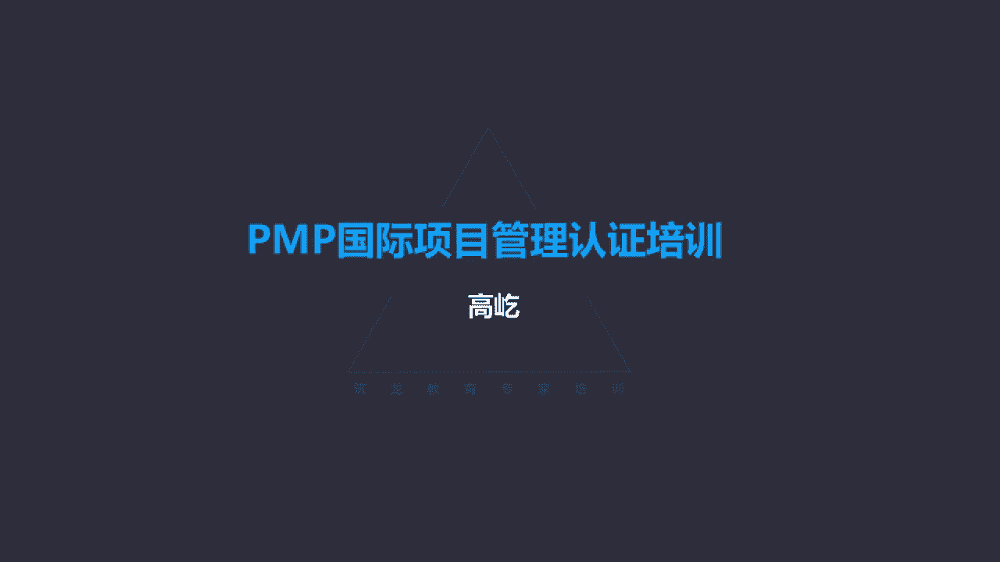
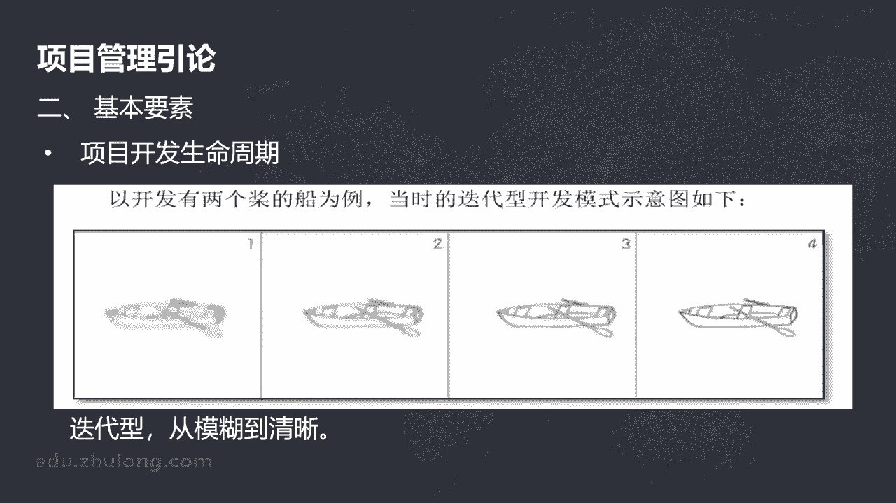
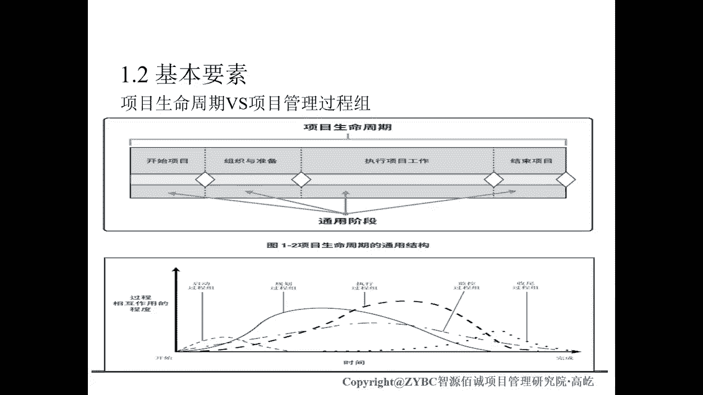
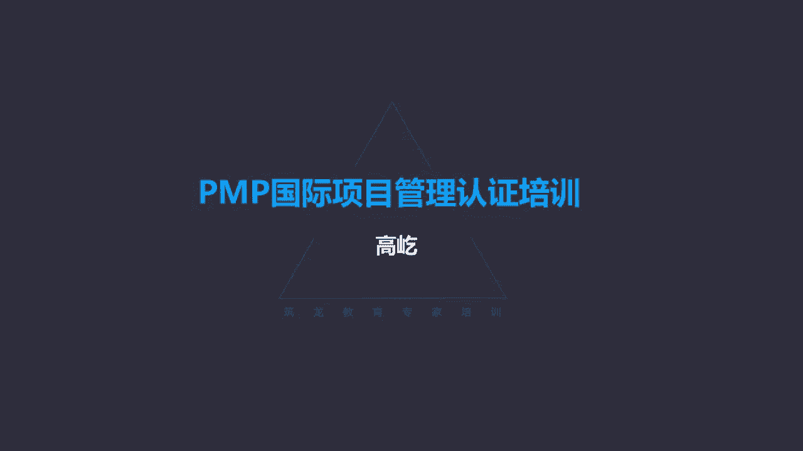

# K003-PMP项目管理认证培训 - P3：03.引论：项目生命周期等基本要素 ▲ - 与君共造价 - BV1eu4nerEJF

好下面的概念是运营与项目管理啊，运营活动指的是什么呢，运营跟项目不一样，咱们前面讲了，项目创造独特的产品服务或成果，进行的临时性工作，所以项目活动有两个特点，临时性和独特性要有明确的开始和结束。

而且呢每个项目与项目之间是不同的，那么这里面说的运营不一样了啊，运营管理关注的是什么呢，产品呢持续生产他不再是临时的，不是明确的开始和结束了，他是一个连续性的活动啊，他强调的是满足客户要求。

保证运作的持续高效，这是运营活动，什么是典型的运营活动呢，比如财务活动，公司公司都有财务部，财务部门，他的活动就是运营活动的典型例子，你看他就没有明确的开始和结束时间，开始时间可能是明确的啊。

公司已成立当天有了财务活动，那什么时候结束啊，没有结束，我们希望我们希望一直持续下去是吧，我们还要打造百年老店，所以运营活动没有明确的结束，它强调的是持续运作，那么虽然运营活动不是项目活动。

但是运营活动会参与项目活动，这很好理解，咱们哪个项目也离不开财务，哪个项目也离不开后勤的保障，像那些财务部门呀，平台部门呀，哎办公室啊，他们的工作特点就属于运营活动，他们不是项目，但是会参与项目。

所以说他们之间可能存在交叉，下面的概念叫组织级项目管理，组织级项目管理跟战略的关系，组织级项目管理了，不再是针对具体的某一个具体的目标，某一个项目了，公司组织从上到下，从高层到基层。

每个环节都要把这种规范的管理得到落地，得到贯彻组合，项目组合项目及项目都要符合战略，而且呢是由战略驱动的，但是呢他们不同的层级，又要实现各自不同的一个功能，一个作用。

比如项目组合要通过选择适当的项目与项目集，排列优先顺序，在资源相对有限的情况下来选择哪些项目，哪些项目集可以进入项目组合优先排序，提供资源，那么目的呢实现战略目标，所以与组织的战略要保持一致。

那么项目集对组成部分要进行这种统一的协调，管理了，不能各自为政，因为彼此之间有依赖关系，实现这种既定的收益，或者叫达到1+1大于二的这样一个效果，那么通过具体规范的这样一个管理啊。

从项目组合到项目集到具体的项目，最终呢满足公司的这样一个战略要求，组织级项目管理，这里面有一个示意，图，书上看到的很好理解，你看战略驱动是吧，要有战略在战略的驱动下形成了项目组合。

那么项目组合由价值决策是吧，我们要获得最大的收益呀，我们要实现战略目标啊，那在价值决策下，我们来选择适当的项目集，与项目进入对应的项目组合，那么通过成果的交付来体现出对应的价值。

那么当然过程中无论是项目集还是项目，他们的实施过程，包括最终成果的交付，要交由运营部门来进行长时间的，接下来这种运营盈利过程，也就是商业价值的实现过程，商业价值的实现。

反过来又推动或者说满足了战略的要求，那也就是什么叫组织级项目管理呢，从上到下，从高层到基层，每个层次都按照相应规范的方式来执行来运作，那么目的呢与公司的战略方向保持一致，实现战略目标。

提高成功项目的这个实现概率，这叫组织级项目管理，在PMP考试里面，我们简单了解一下这个概念就可以了，哎下面的概念挺重要的，叫开发生命周期，什么是项目的开发生命周期呢，在项目的生命周期里边。

我们一会会看到啊，什么是具体的项目生命周期，生命周期，项目生命周期里面通常会有一个或多个阶段，与产品服务或成果的开发相关，完成开发工作的这部分活动，我们单独把它起个名字，就叫开发生命周期。

开发生命周期分成了预测型，迭代型，增量型，适应型，还有混合型，我们分别看一下他们各自有什么样的特点，比如预测型的开发生命周期，预测型又叫瀑布型，这个瀑布型啊在软件行业里面有这样的称，有这样的说法。

那么更多的预测型生命周期其实指的是什么呢，针对传统的规范的这样的项目活动，什么叫预测呢，光做没做呢，我就能够提前比较准确的知道未来会做什么，包括得到什么样的结果，它的过程是可预测的。

它的结果也是可预测的，比较典型的工程建筑类项目，这就是预测型生命周期的特点，成熟规范工程类项目，这是历史最悠久的一类项目类型，你看这个工作没做呢，工程还没有开始呢，但是最后那个模型我们就已经提前知道了。

比如举个例子啊，北京奥运会08年奥运会的时候，我们修建了国家体育中心鸟巢，这是什么时候开始修的呢，01年零一年，我们国家参与这个奥运会主办城市的一个竞争，最后01年的7月份，我们拿到了这个主办权。

08年奥运会在北京召开，那么我们就要建一个新的国家体育中心，作为开闭幕式的场地，包括一些大型比赛的一个使用场所，那于是呢，当时很多国内外的这种建筑师设计所呀啊，包括呃其他的这种这种机构啊。

都要来参与这个国家体育中心的这样一个项目，的投标工作，我记得当时新闻里面看到了很多小模型，都摆在桌子上，各种各样的唉，最后鸟巢中标了7年以后，到了08年零八年初，鸟巢竣工了，你看出现在北四环上。

这个国家体育中心鸟巢跟当初摆在桌子上，那个小模型几乎一模一样，没有什么区别，为什么呀，因为它可预测工程项目有这个特点，每等施工呢要有详细严格的图纸作为依据，设计文件必须是完整，是规范，是严谨的。

我们就按照施工图纸设计规范来完成，那么过程中如果要有调整呢，我们要经过严格的变更流程才能执行哎，这就是预测型生命周期的这样一个特点，可预测规范，成熟过程中可以有变更，但是要经过特别严格呃。

规范的变更流程，才能让变更得到一个实现，除了预测型的，还有一种叫迭代型，在迭代型生命周期还是这里边软件的例子啊，软件开发就由多次迭代完成，什么叫迭代呀，就是一个工作循环，在一个工作循环里面。

我们完成的工作过程内容差别不大，比如这里看到这个软件项目，每个迭代周期都是分析设计，开发测试最后交付了，那么下一个迭代周期又是分析设计，开发测试交付，不断的通过这样一个迭代，让工作得到一个推进目标。

最终得以实现，这个叫迭代型生命周期，迭代型开发生命周期的特点，一开始项目刚刚开始的时候，它不像预测型，我们能严谨准确地知道最终的结果是什么，我们能准确的知道过程是什么样的。

它的过程过程中可能会发生比较多的改动，目标也许刚一开始不是很清晰的，正是通过一个一个的迭代，不断的迭代，让工作得到推进，对最终达成目标，我们这举个例子说开发有两个桨的船，你看这是一个例子啊。

那么迭代的方式就是叫从模糊到清晰，每次不断重复相同相似的工作流程，工作内容，最终让这个成果目标清晰起来，最终完成，这是迭代型生命周期的一个特点。

另一种呢叫增量型，增量型生命周期跟迭代又不一样了，他刚一开始就能有一个相对整体的一个框架，但是框架有了中间的过程，要一步一步推进哎，过程中的推进又可能出现各种的不确定情况，所以啊他也基本上不太可预测。

不像预测型，整个过程是清晰的，是准确的，那么随着这种增量不断的增加，功能功能逐渐的增加，那么最终满足要求完成了项目，这叫增量型，每个功能的完成，它所经历的环节流程，具体的工作内容可能有比较大的差别。

这跟刚才咱们说的叫迭代型不一样，迭代型每次迭代的过程基本相同，迭代的流程环节是基本确定的，但是呢工作内容有些出入啊，有些不一样的地方，所以叫从模糊到清晰，而增量型呢嗯还是一个造这小船的例子。

你看增量逐步逐步的增加，不断的增加增加最后完成，所以呃这种增量型开发生命周期的特点叫，从少到多，从不完整到完整，增量吧不断的增加，最终实现了目标，那么再有一种开发生命周期叫敏捷。

敏捷开发生命周期也叫适应型生命周期，适应型跟敏捷在咱们项目管理知识体系里面，这是一个概念，一个概念的两种说法，说的是一回事，敏捷他的特点跟前面的又不一样了，首先他是大量的变更敏捷的项目。

这里面不确定性充斥了每一个环节，每时每刻都可能发生调整，发生改变，有大量的变更出现，那么另外敏捷也是通过不断的迭代，一个一个的迭代来最终实现项目的目标，但是跟刚才咱们讲过的，迭代型生命周期又不一样了。

迭代性生命周期通过每次重复相同相似的流程，步骤环节来完成具体的项目工作，逐步逐步达到目标，但是迭代型生命周期，它每个迭代的周期长度是不固定的，这什么决定的呢，是由他需要完成迭代的工作内容决定的。

比如第一次迭代比较简单，它可能两周就完成了，第二次迭代比较复杂，也许四周才能完成，哎这是迭代型生命周期的一个特点，而敏捷不是了敏捷，他强调每个迭代周期长度是固定的，一般来说呃，敏捷型生命周期的特点。

迭代长度就是两到四周，两周到四周，每次迭代都是两周，每次都是两周，或者都是三周，都是四周，迭代的长度是固定的，这个是跟迭代型生命周期不一样的，哎显著的第一个区别，第二个区别就是阶段的成果哎。

每个迭代结束了都要有成果交付，迭代型生命周期，它交付的成果您注意不一定有可用性，什么叫不一定有可用性呢，比如我们接受客户的一个要求，我们来完成对应的工作，那么随着工作的推进，每个迭代输出的成果。

这个阶段成果对我们团队当然是有价值的，比如我们有一些中间的测试数据，我们得到了一些文档表格哎，这些个数据，这些个文档表格对我们项目是有价值的，对我们团队是有用的，但是您的文档，您的表格。

这些个数据对客户有价值吗，没有价值，你给我数据干嘛呀，我要文档表格干嘛呀，我要的是功能，我要能可用的产品，所以迭代型生命周期哎，他的每个迭代输出的成果，对于客户来说不一定是可用的。

他是单纯的站在项目工作的角度，为了工作得到推进，我中间就会产生一些阶段性的成果，唉但是对于客户有没有价值，没有过多的考虑，反正最后我给你的这样一个成果，是满足你要求的，这是迭代性生命周期。

而敏捷不一样了，敏捷强调每次迭代输出的阶段成果，都必须要有可用性，可以不完整，可以不充分，但是对客户来说必须是可用的，这是敏捷的特点，敏捷敏捷，站在客户需求的角度，我是为了满足客户需要而完成工作的哎。

那么他就要求每个固定的迭代周期，它输出的阶段成果有一定的可用性，它可以不完善，可以不充分，但是对客户而言要有一定的价值，他就能用了，可能不能充分解决他的问题，但是至少能部分的满足他的要求。

这是敏捷型开发生命周期的一个特点，注意它跟迭代型不一样，要注意区分，哎这个是不同生命周期的一个对比啊，咱们书上的一个图，您可以在书上看一下，那么刚才讲的叫开发生命周期，它是属于项目生命周期的一部分。

专门与产品的开发相关的这些活动，我们单独给它起个名字，叫开发生命周期，那么现在我们另一个概念了，叫产品生命周期，什么叫产品生命周期呢，哎项目生命周期与产品生命周期什么关系呢，你看这里提到了啊。

是相互独立的，什么是产品生命周期啊，产品生命周期，一个产品从概念形成到他的交付成长成熟，再到最终的衰退，退出市场的不再维护，不再保障，被淘汰了，哎这个时候产品生命周期才最终结束。

所以产品生命周期从时间上来说，周期时间的跨度最大最长，我们举个例子，你看手机的例子，苹果手机，这是苹果一代，好多年前了，那么苹果手机从它的设计，生产制造来形成这样一个产品。

这个过程我们可以说它是一个项目生命周期，也可以说它是一个开发生命周期，从无到有的过程吗，那么它的生命周期暂时终止了是吧，某个型号第一代产品，第一代苹果完成了它的项目生命周期结束了，但是这么多年下来。

苹果公司并没有停下，它不断推出新型号的这样一个节奏，这样一个步伐，那么现在你看唉这是比较新的型号了，新的苹果手机又出现了，中间有各种各样的型号，第一代有第二代，第三代开始有3S44S55S啊。

一直往后十啊，苹果十十S11，未来的11S还在不断的继续推出，那么每个型号，我们可以看成是一个项目生命周期，而整个苹果手机这个产品，它的产品生命周期还在一直延续，没有终止，除非啊除非到某一天。

比如说苹果公司官网宣布了啊，我们不再生产苹果手机了，就到这了，甭管到几到几S不再往下做了，那么这样苹果手机的产品生命周期才彻底终结，所以啊产品生命周期它的跨度时间跨度最大，那么这里面呢。

过程中可能包含一到多个项目生命周期，项目生命周期中间还会涉及到运维工作，咱们前面讲的运营活动，你得负责销售啊，维保啊，故障的处理啊等等，哎这个构成了完整的一个产品生命周期，您记住这个概念。

我们后面在质量管理章节里面还会再次提到它，那下面我们再梳理一下哎项目生命周期，项目阶段阶段关口管理过程，还有管理过程组知识领域的区别，这个概念比较零散啊，但是呢又挺重要的，我们要把它搞清楚。

首先说什么是项目生命周期啊，项目生命周期从启动到完成一系列阶段的集合，启动啊，章程文件的签发完成，咱们前面讲了项目的临时性，最后一件事干什么呀，不是验收解散团队，释放资源，从章程签发到团队解散唉。

这个过程中一系列阶段的集合，我们就叫项目生命周期，它体现了项目的临时性，包括项目的独特性，因为不同的项目有不同的行业背景，不同的行业有不同的习惯，所以呢我们也可能划分成不同的阶段，那阶段划分不一样。

名称也不一样，所以项目生命周期既体现了项目的临时性，从开始到完成，也体现了项目的独特性，两个项目它的生命周期划分是不一样的，那么这里面提到了阶段，那什么是阶段呢，一组具有逻辑关系的项目活动的集合。

什么是阶段呢，就是具体工作活动，工作活动的集合叫做阶段，那么每个阶段与每个阶段中间哎，一定要有成果的完成，一阶段完成了，要有一阶段的成果，二阶段结束了，要有二阶段的成果。

所以项目阶段第一个特点它就是活动，就是具体的工作，第二个特点呢有逻辑关系，它是一组有逻辑关系的项目活动，什么叫逻辑关系啊，简单的说就是顺序关系，先做哪个再做哪个，然后做哪个是并行啊，是串行啊。

这就是逻辑关系，那么一个项目过程中会划分成多个阶段，彼此阶段之间呢是有这种逻辑顺序关系的，那么问题来了，每个阶段我们会执行几次呢，原则上就执行一次，比如说一个项目生命周期划分了四个阶段，一阶段，二阶段。

三阶段，四阶段，那么一阶段执行完了，二阶段开始了，二阶段结束了，是三阶段，三阶段完成，四阶段，四阶段结束，整个项目完成，所以这些个阶段有逻辑关系，通常按顺序排列，那么每个阶段呢原则上执行一次，执行完了。

执行完就完了就过去了，一阶段结束了，就是二阶段，当然各阶段彼此之间可能会有一些交叉交叠，那一阶段没有充分完成呢，后面的二阶段也可能提前开始，这个也允许存在，所以项目阶段第一它是一系列活动构成的。

第二这些活动彼此之间是有逻辑顺序关系的，每个阶段通常执行一次，那么下面的概念阶段关口既然是阶段关口，那就是阶段结束的时候出现的啊，这样一个环节干什么的呢，咱们前面说了，项目阶段一定是有一个可交付成果。

作为它结束的标志，那么关口就是对这个阶段成果的审核，一阶段完成了一阶段的阶段，成果出来了，能不能进入二阶段呢，你要经过阶段关口的评审，阶段关口就是来检查，每个阶段完成的具体工作内容。

这个阶段成果是不是满足要求了，这里面说根据比较的结果，我们要做出决定，比如可以继续了，或者这阶段就到这了结束了，比如整个项目完成了，那当然你要不满足要求呢，那可能还要涉及反工，所以阶段关口是一个评审。

是一个审核的这样一个环节，那什么是管理过程呢，项目管理过程，注意，我们可以把这个过程理解成，一组一组的标准动作，如果这本书项目管理知识体系指南，您大概翻阅过一遍了，哎您可能有这样的一个印象哈。

你看它的整体是以什么为主线呢，就是对过程的一个解释说明，但他讲的就是过程，整个这本书一共有49个过程，第六版项目管理知识体系指南，一共有49个过程，刚才说了什么是过程啊，就是一套一套的标准动作。

项目管理知识体系，他是从大量的实践项目经验里面去总结提炼，形成的一套完整规范的项目管理思想管理理论，那么既然形成了理论了，我们知道，如果一个项目要想顺利的启动，这个项目最终能够达成目标。

那么在项目开始的时候，唉经验告诉我们，最终提炼成了理论，形成了一个过程，就叫制定项目章程，那他告诉我们了，你要想让项目顺利的开始，包括让项目能够顺利的执行，最终达成目标，那么在项目刚一启动的时候。

你就应该制定一个项目章程，一个启动项目的文件，通过这样一个文件给项目经理明确的身份，给项目经理必要的授权，哎有了这样一个文件了，未来这个项目再得到执行推进的时候，就能更加的顺利，出现问题的概率就会降低。

那么所以我们把这些标准动作，名字就叫做制定项目章程，所以什么是管理过程啊，啊生命周期就是通过一个一个的管理过程，一组一组的标准动作，让工作得到推进啊，那么这个过程它的结构就是输入工具，技术输出啊。

咱们这本书后面基本上所有内容都是，按照这样一个结构，某某过程的输入工具，技术输出哎，分别是什么啊，整个这本书按这样来来讲解，所以这是项目管理过程，那么什么是管理过程组呢，对管理过程逻辑分类了啊。

分组比如启动时候应该做的一些过程，一组一组的标准动作，我们把它放在一起，形成了叫启动过程组，编制计划的环节里面，我们需要完成的一组一组标准动作放到一起，这个叫规划过程组，同时呢还有监控过程组。

执行过程组，还有收尾过程组，咱们项目管理知识体系一共包括了五个过程组，启动规划，执行监控收尾，五个过程组里面分别包含不同的过程，一共加起来49个，这里要特别注意过程组不同于项目的阶段。

刚才说了阶段是什么呀，阶段是一系列需要完成的工作啊，这些个工作活动是按逻辑关系排列的，通常执行一次满足要求了就进入下一个阶段，而过程组不是了，过程组，他逻辑关系并不是顺序排列的。

另外它的执行次数也不是执行一次，一会儿啊，我们通过一个示意图，再来详细的讲解下面的概念，项目管理知识领域啊，知识领域，按所需知识的内容来定义项目管理领域，那么这里面包含了所谓的过程啊，实践呀。

输入输出工具技术等等，咱们第六版项目管理知识体系指南里面，一共有十个知识领域啊，从整合范围，成本进度质量到风险，采购相关方等等，一共十个知识领域，知识领域里面分布着五个过程组。

五个过程组里面包含不同的过程，我们通过这样一个示意图来说明，刚才生命周期和过程组的区别，我们看到了上面生命周期啊，这是一个通用型的生命周期，开始组织与准备执行还有结束，那么每个菱形代表了什么呢。

是关口唉，开始项目，这就是一个阶段，组织与准备也是一个阶段，执行与项执行，项目工作是一个阶段，结束项目又是一个阶段，这个通用的项目生命周期由四个阶段组成的，每个阶段原则上执行一次，按顺序排列。

那么下面呢是过程组了，我们看不一样了，那启动过程组时间刚一开始，启动过程组开始了，那么规划过程组呢，我们看并不是启动完了以后才开始规划的，横轴是时间很早就开始规划了，执行过程组，这个虚线。

粗虚线也不是在规划完成才开始执行的，收尾过程组也不是项目工作，执行结束了才开始收尾，很早就开始了监控过程组，更是横跨整个项目生命周期，那所以我们看到了这五个过程组，逻辑关系上不存在顺序啊。

不是启动完成了规划，规划好了，执行执行结束了收尾，彼此之间是交叠关系的，唉这个跟刚才我们说的生命周期完全不同，生命周期的阶段是按顺序排列的，一系列过程啊，一系列阶段，一系列阶段，每个阶段原则上执行一次。

而过程组呢啊没有顺序关系。

