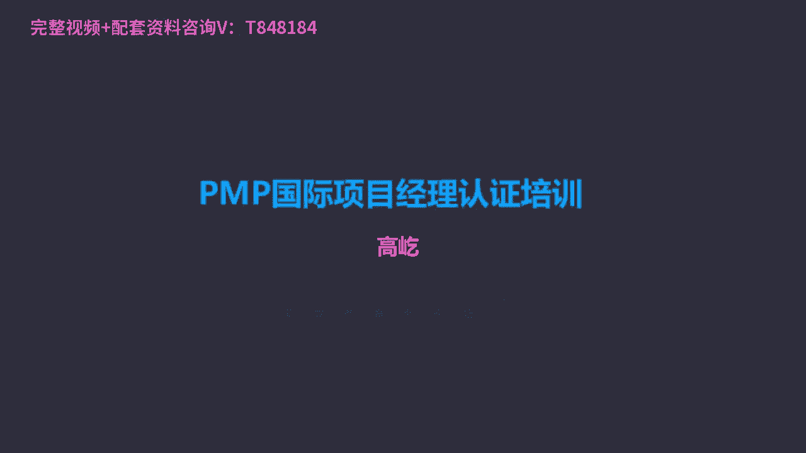

# K003-PMP项目管理认证培训 - P30：30.项目风险管理：如何规划风险管理？ ▲ - 与君共造价 - BV1eu4nerEJF

风险管理，风险管理的核心概念，我们看一下，首先风险风险在项目生命周期内会持续的发生，任何时间，任何时刻都会有风险出现，而且呢啊这个风险管理的有效性说，直接关乎到项目是否成功，这个很好理解。

咱们前面的项目管理知识体系框架，这个小房子的模型我们看到了啊，风险管理就像房子的屋顶一样，它覆盖了整个的项目生命周期，随时随地都可能有风险出现，那么如果风险管理出现了问题。

那这个项目就可能随时遭到风险的影响打击，甚至最后目标的一个失败，所以风险管理非常的重要，那么对于风险来说，这里面给出了两种定义啊，说两个层面上都有风险，第一种叫单个风险啊。

单个风险也指的是具体的风险事件，这种风险一旦发生了，那可能会对项目的目标啊产生影响，这种影响可能是正面的，也可能是负面的，那么说到这，咱们还要再强调一下，就是我们项目管理知识体系里边所说的风险。

还跟我们生活中，我们习惯理解中的风险有些差别，在我们生活里面，我们说话过程中，我们一提到风险，首先想到的是什么呀，是坏事，那些负面的影响给我们造成不利的影响，损失的我们叫做风险。

但是在我们项目管理知识体系里面，风险我们的定义是发生在未来的不确定的事件，只要是未来的不确定的事就是风险，所以既然是不确定的，那么风险就有两层含义了，也可能是好的，也可能是坏的，坏的，好理解。

给我们的项目工作造成破坏干扰，那么好的呢啊不确定的好事儿，我们也叫做风险，当然这种不确定的好事，在我们生活的语言中，我们一般不用风险来描述，我们叫什么呀，我们叫机遇出现了一个机会，这个机遇。

实际上你看它也是未来的不确定的事儿，那在我们项目管理知识体系里边，只要是不确定的，在未来尚未发生的，我们都叫做风险，哎，这个要特别注意，不是一说风险，只有坏的风险，也有所谓好的风险。

那么单个风险那就是这件事一旦发生，那就会对项目的目标产生这种不确定的影响，也可能是正向的，也可能是是负向的，哎，干扰破坏的，比如说下雨或者不下雨，你看这件事，这就是个单个风险，天气预报，明天预报了下雨。

那也可能不下雨，到底下不下，不确定，这是个具体的事件，那么这个具体的事件一旦发生，那可能对我的工作活动就会造成一些干扰，如果真下雨了，我室外施工可能就受到影响了啊，不下雨，那影响影响就不大了。

所以这就是单个风险，它是具体的风险事件，那么另一种呢叫整体风险，整体风险是不确定性，对项目整体的影响，那么这种整体影响当然也是不确定的，有正面还有负面的这种变异区间，相对于刚才这个单个风险。

比如说明天下雨或者不下雨，这是个单个风险，它可能影响我项目的工期是吧，如果下雨了，我的工作不能做，就要推迟延误不下雨，工期不受影响哎，仅仅是工期可能受到下雨或不下雨的干扰，这是单个风险。

那么整体项目风险呢，天气原因影响项目目标的达成，这就是整体风险了，你看天气原因，天气原因很多，下雨，这可能造成影响，另外呢高温下雪，包括什么沙尘暴，雾霾等等，台风，各种天气现象，包括各种天气。

这种灾害都可能对我的项目目标达成造成影响，那么这种影响又是全方面的了，可能是涉及到进度，也可能呢涉及到质量啊，涉及到成本，涉及到资源范围等等，所以整体项目风险是那种更大的。

影响范围更广的这些个不确定事件，所以呀它源于包括单个风险在内的，所有不确定性，这下雨是不是在整体风险里面呢，是哎因为下雨啊是天气原因之一，这是单个风险和整体风险，单个的是具体的。

而整体的呢啊整体的是相对不具体的，所有不确定性的影响，那么另外说为了有效这个管理特定的风险团队，要知道哈，要明确一个叫风险敞口，什么是风险敞口呢，风险敞口实际是一个金融领域的一个概念，哎，他指的说是呃。

因债务的债务人违约行为导致的可能承受风险，信贷的业务余额，唉这个说法这说法有点有点绕口啊，那什么叫风险敞口啊，那就是敞口嘛，敞开的也就是我必须要面对的这样一个风险，我将面临什么样的风险呀。

可接受的风险敞口，因此通常用叫可测量的风险临界值来定义啊，风险临界值临界值以内的就是我能接受的，超过临界值的哎，这就是我无法接受的啊，所以它指的就是未加保护的这些风险，这是我必须要面对的未加保护的风险。

那么风险敞口与临界值相关啊，它体现了相关方的风险偏好程度，或者说它体现了目标可接受的变异程度，风险临界值对于不同的项目，不同的个体来说，它各自是不一样的，比如说我是一个小企业，小企业创业型的企业。

那么对我来说，我的风险临界值可能就是10万块钱，这个损失如果不超过10万，我是可以接受的，但是一旦超过10万了不行，那这个风险太大了，我这个刚刚创业起步，这么大的损失，我承受不了。

所以10万以内的影响损失，这就是我的风险敞口，或者叫我的风险临界值，我对风险持什么偏好态度呢，那就是抵制哎，最好别出现叫风险厌恶型的，那么同样同样是企业，这是个大型企业500强企业。

那么人家对于风险项目损失的，这个承受的临界值可能就不止10万了，也许是100万，他可以去投资啊，但是投资也可能有失败呀，有风险呀，他能承受的风险敞口，这临界值就是100万，只要损失别超过100万。

对于这个大企业来说，那他是能承受的，没问题，投资允许失败呀，允许出现一些失误，但是不能太大了，超过100万，这个也不行是吧，所以风险临界值或者说可接受的风险敞口唉，它与相关方的风险偏好程度相关。

它代表了项目可接受的一个变异程度，唉这是风险敞口临界值的这样一个概念，那么下面呢什么叫非事件类风险呢，哎非事件类风险这里边分两类，一种叫叫变异性风险，变异性风险说已规划的事件活动啊。

或者呢某些关键方面存在不确定性，会有变化啊，有改动，那么针对这种风险，哎我们用概率分布来表示它的可能区间，比如他说考试的通过率，比如说PMP考试的通过率，我们这个培训班哈，我们的通过率通常在75%到。

90%之间，历次考试，我们的通过率在75%，到90%之间，哎这就是一个用概率表示的变异可能区间，那么知道这个区间了，我们怎么采取行动缩小可能结果区间呢，那当然我们就得认真复习，多看书啊，合理的做题。

及时的发现我们在学学习过程中啊，出现了概念的空白点，掌握不清楚的，我们要反复认真的理解记忆哎，这些事情你做到了，那我们这种变异区间哎可能就缩小了，我们的通过率就变成了，85%到90%。

甚至85%到95%了，所以说这是变异性风险，针对这种不确定性有变异的区间来表达，还有一种呢叫模糊性风险，模糊性风险，那它的特点是，对未来可能发生什么事情存在不确定性，对未来的事情不确定性的存在。

这叫模糊性风险，比如什么是模糊性风险呀，教育改革，你看教育改革一直没有停过是吧，教育改革最直接的受影响的就是中考，高考，高考一直在改是吧，从最早的文理分科，后来改了，说文理不分科，文理不分科呢。

又文综又理综啊，各地又开始自行出题，后来有段时间呢，他允许高校自主招生，那么现在对自主招生呢，又开始采取一些限制的措施，哎，各种各样的变化，确实未来发生什么呀，我们接接下来进一步的教育改革。

高考改革怎么改呀，有什么样的表现呀，对考生造成什么样的影响啊，这真的是不确定的，我们自己掌握不了，所以这就属于模糊性风险，那那这怎么办呀，最佳实践为标杆来填补差距啊，最佳实践啊。

比如哎我们看看有一些比如沿海地区发达省份，他们的教育改革试点，一般来说，通常就会成为未来更大范围推广的一个范例，哎我们先看看一线城市，他们的教育改革高考是怎么调整的，那么未来其他地方也可能跟着他去变。

包括叫增量开发，原型搭建模拟的方法等等，逐步逐步的去调整，去改进，让模糊性风险呀得到一定的处理，那比如说唉针对这个教育改革，高考很多科目发生调整的考试的这种比例，分数可能要发生改变。

我们有什么办法应对呀，那我们就要做好全学全考的准备是吧，什么都得学，什么都得准备，你准备充分了，你考什么我都不怕了啊，增量开发原型搭建，什么叫原型搭建呢，模拟考试呗是吧，我们提前做一做模拟考试啊。

体会一下未来真实考试的这种样式，哎我记得我当年高考的时候啊，提前模拟考试考了七回呢，啊一模二模一直到七模啊，人都要摸傻了，那这就属于圆形搭建，所以这种办法，应对这种未来不确定的模糊性风险。

这都指的是非事件类风险，那么另外再一个概念叫项目的韧性，什么是韧性呢，啊韧性很好理解，抗打击能力，我们要针对那些未知的未知风险，要提前采取措施，未知的未知风险哎这个说法咱们并不陌生，在哪见过呢。

在前面进度管理，还有成本管理理念，那些完全无法提前预知的风险事件，那些事件一旦发生，我们的项目工作会受到影响，进度啊，成本啊，都会受到影响，那么这些事件现在越来越觉得呀，他不是少数情况。

所以确实存在这种意外突发的风险，这种风险只有发生以后我们才能意识到，所以不能提前识别，那怎么办呢，哎为了应对这种风险，我们要加强韧性来应对了韧性，抗打击能力，抗打击能力越强，遭到突然的打击，没关系哈。

我能承受得住，我能缓过来，那反之你要这种韧性比较弱是吧，抗打击能力不行，风险发生了一下，把你击倒了，那那整个项目失败了是吧，最典型的例子哈，拳击你看拳击拳击运动员，优秀的拳击运动员啊。

除了他出拳凶猛是吧，动作敏捷规范准确以外，哎另外抗揍啊一定得抗揍，抗打击能力强，最著名的拳击运动员现在不行了哈，岁数大了，当年啊红透天的那就是泰森，太厉害了是吧，泰森基本上他的打拳生涯全部是KO对手。

全部击倒，而且都以秒级是吧，看泰森打拳，你得赶早好，没等停好车呢，比赛结束了，一拳击倒，说他怎么那么强呢，当然他有天赋是吧，他这个出拳力量大，他这个技巧特别好，体能好，但另一方面他真抗揍啊。

你打他没关系哈，不防守，你随便打，他给你一拳，你受不了，躺下了，专门有科学家研究过说，泰森这脖子跟一般人不一样，特别的粗啊，几乎没脖子，这脑袋直接摆肩膀上，你打他一拳，脑袋晃一下，没关系是吧。

他给你一拳，这可受不了，比赛结束了，所以啊通过加强韧性，提高抗打击能力，我们就能够加强自己，应对这种突发风险的能力了，那么有什么手段呢，比如说提前留出必要的预算时间，这个咱们都熟悉唉，这就是管理储备。

既然是未知的未知风险，我们先把储备留好了，哎风险发生以后，我们用应用这个管理储备来应对，还有呢用灵活的项目过程，包括强有力的变更管理，及时调整，及时变更，出现问题了，马上做出反应。

这样能够最短时间的把这种不利的影响，降低或者消除，再有呢明确项目的范围，别做那些有潜在重大风险的事情，明确限定的范围，就可以降低这种突发风险的概率，咱们做工作一定要规范是吧，规范以外的事情不要做。

那些工作里面就可能涉及这种突发的风险，再比如留意风险的预警信号，尽早识别，虽然叫突发风险发生后才能被发现，但是任何风险事件原则上啊都会有一些征兆，那也就叫预警信号，等它从量变变成质变了，爆发了。

所以我们如果能够提前关注到他预警信号，那就能提前采取措施，把这种未知的风险变成已知，哎，有个特别典型的例子啊，前些年了啊，前些年有一年夏天这个北京雨特别大啊，连着下雨连着下雨，哎，西边北京西边门头沟。

这是山区了，哎，山区有一位这个看山的老大爷护林员，那么人家护林员，人家也是有上岗培训的啊，啊上岗前专家就讲过，课上说了，说如果连续多天大雨以后啊，如果你发现山坡上有碎石，哗啦哗啦哗啦往下滚，不是人扔的。

自己就往下滚，石头你要小心，这是什么的征兆啊，滑坡诶，有可能身体会出现滑坡的情况，哎老大爷上课很认真哈，记住了几场大雨过后，哎老头到山上转转，看看有没有什么安全问题啊。

哎他真的发现这个碎石头哗啦哗啦哗啦，就往下往下滚，这老爷子警惕了，赶紧跑到山脚下，山脚下就是一条公路，把路给拦住了，不行啊，这条路有危险，前边可能要滑坡，拦上没多久啊，当然这个山区嘛车本身就不多不多。

他也过两辆车呀，拦住几辆车，这拦住几辆车，司机还跟老头还较劲呢，这这这拦我路干嘛呀，这不一脚油就过去了吗，这讨厌好说着轰一下，这山就滑下来了，好家伙，整个公路就给埋了啊，这是活菩萨转世啊。

因为老人及时发现了山体滑坡的预警信号，导致没有任何的人员伤亡啊，这真是造了，这这真是这个只是做了这个太大这个善事了哈，这救人一命啊，所以留意风险的预警信号，我们就能尽早的识别风险。

把这种未知的风险变成已知，还有呢提前沟通，提前沟通，明确项目的可变动范围，唉及时调整，或者说躲开，或者说风险发生以后，我们采取有效的办法，所以这些手段都可以加强项目的韧性，提高项目的抗打击能力。

所以对于这种突发风险，我们也可以做到有所作为，而不是单纯的被动的等着风险发生了啊，那么另外就是叫整合式的风险管理，这也是风险管理的趋势了，什么叫整合风险呢，啊风险会发生在不同的层面上，包括项目。

包括项目级，包括更高的叫项目组合，不同的层面上都有风险，所以啊哎不同层级都应该分别承担和管理风险，那么对于项目来说，你不能把所有责任都压到项目经理，项目团队身上，他们处理不了解决不了的风险。

比如说项目级层面的或者项目组合方面的风险，影响到了项目，那么谁去解决呀，那就应该是项目级经理和团队，项目组合的负责人唉，他们应该承担管理风险了，因此说通过这种协调式的唉各司其职，叫企业级的风险管理方法。

我们就能保证各个层面的风险，都能得到有效的管理控制，而不要单纯的把风险扔给项目团队，扔给项目经理，从上到下整合起来来管理风险，这样能够让风险得到最有效的管理和控制，那么在敏捷环境里面，那既然是多变的。

那当然风险就更突出了，所以敏捷项目里面风险大量存在不确定性吗，那为了为了要应对这种不确定性风险，哎这里面强调在每个迭代期的时候，我们要充分考虑风险，每个迭代周期两周时间，四周时间以内就要及时的识别。

分析和管理，还要不断的更新，同时呢随着项目的进展，重新排列工作的优先级啊，这样让工作在风险得到有效控制的情况下，稳步推进，这是敏捷环境的一个特点好，那么接下来我们看看风险管理过程的。

第一个过程就叫规划风险管理，规划风险管理哎，这是一个定义如何实施风险管理活动的过程，通过规划风险管理，我们能够确保风险管理的水平方法，包括可见度唉，与相关管理的这些风险能够相匹配。

这是规划风险管理的一个作用，那么规划风险管理书上告诉我们了，应该构思阶段就开始，并且在项目早期完成，说到这了，可能您又想起来了，我们在一开始刚刚开始讲这个课的时候，有三道测试题，其中有一道就是唉。

以下关于规划风险管理的描述，不正确的是哪个，哪个是不正确啊，说错了哈，不是不正确的，正确的是哪个啊，那么其中有一个就是说，规划风险管理应该尽早开始并贯穿项目始终，我估计啊很多同学都选了这个选项。

这个选项听起来特别正确，尽早开始没问题，贯穿项目始终唉也没什么问题吧，有问题了，因为我们现在讲了，规划风险管理确实应该早开始，构思阶段就开始了，但是它可不是贯穿始终的，唉项目早期就应该完成，为什么呢。

因为规划风险管理过程，我们输出的是什么呢，叫风险管理计划呃，风险管理计划，你看它的内容包括风险管理的战略啊，风险管理的方法论，风险管理中的角色职责等等等等，你看这里面有具体的风险事件吗，啊是单个风险。

整体风险事件类的，非事件类有吗，都没有，所以哎又遵循那个原则了，风险管理计划里没有风险，这里面介绍的是什么呢，是如何管理风险，是高层级的方向指南，你看高层级的方向指南，这件事如果不能尽早确定下来。

那我们后面具体的风险管理活动，就没有办法及时开展了，唉所以啊规划风险管理尽早开始没问题，但是他可不是贯穿始终的，他要尽早完成，赶紧完成了，有了明确的方向指南，有了高层次的政策了。

我们就知道如何具体的去管理风险了，因此啊风险管理计划有这个特点，第一这里边没有具体的风险，第二他要尽早完成，其实不光风险管理计划，前面讲的各个管理计划都应该是这个特点，尽早开始，还要尽早完成，完成了。

有了高层次的方向指南了，以便于后面具体工作的一个开展，所以你看我们选择题目哈，我们不能凭自己的经验，凭自己的理解了，我们要学会从书上的理论去找依据，那我们看看风险管理计划里面具体有什么内容。

比如这里面有风险分解结构叫RBS，风险分解结构叫RBS英文缩写诶，前面咱们还有一个分解结构，也叫RBS，那是什么分解结构，还记得吗，那叫资源分解结构哎，也叫RBS，您再回忆回忆资源分解结构。

分解的内容是什么呀，分解的就是资源哎，资源本身我们对资源进行合理的分类啊，比如分成人力资源设备资源，人力资源里边又有专家资源，又有普通资源，专家资源，又有不同专业领域的专家啊等等。

你看那是资源分解结构啊，它是对资源本身的一个梳理排序，而风险分解结构这也叫RBS，但是这个RBS它分解的对象不是风险了，它分解的是什么呢，是潜在的风险来源，它是风险来源的层级展示，咱们刚才说了。

风险管理计划里面没有风险，这里面是管理风险的原则，是政策是指南，它是高层级的内容，所以这里边的风险分解结构，也不是对具体风险的描述了，它是对风险来源的一个层级展示，所以这里边没有风险。

这个RBS它分解的可不是风险本身了，是风险来源，那么另外还要输出的叫风险，概率影响定义嗯，还不是风险本身，他告诉我们，根据具体的项目环境，包括结合相关方的风险偏好，临界值，我们来定义什么是风险的概率。

什么是风险的影响，我们看这样一个例子，书上的表格，你看最左边的啊，量表概率影响什么叫影响很高，影响高中低很低，包括影响是零，什么是概率啊，大于70%，怎么叫概率是50~70之间，什么情况。

这个发生的概率就是1%到10%呢，我们后面有描述了，那就是比如时间大于六个月，成本超过500万美元啊，在质量方面对整体功能影响非常大的，这样的风险我们就定义成影响很高，概率大于70%。

同理那什么叫影响中等，发生概率31%到50呢，只要是这个风险的影响啊，时间在1~3个月以内，它造成的成本影响损失50万到100万之间，从质量方面来看，对关键功能领域有一些影响。

这样的风险我们就定义成它是中等级别的影响，它的概率就是30%到50，这是对风险概率和影响的一个定义，我们好能知道什么样的风险，用什么样的啊这种描述来表达它，怎么去定义它的概率和影响。

那么另外还有一个叫概率影响矩阵，概率影响矩阵，它出现的风险管理计划里面唉，他现在是一个成果，但是后面他会成为一个工具，到定性风险分析的时候，我们还会再看到它嗯，你看这里面概率影响矩阵一个表格有威胁。

有机会，不确定的事都是风险，哎我们光看威胁吧啊威胁你看概率很高，0。9高，0。7中，0。5低，0。3包括很低0。1，这是它的概率影响呢，从很低低中高到很高，数字表示分别是0。05到0。80，表格里面哎。

就是概率和影响的乘积，也叫风险影响值怎么用呢，我们找了一个风险，我们发现这个风险的概率很高，0。9的位置，而且影响很影响也很高，0。8的位置，0。72，我们看到右上角深颜色区域。

那么这就是一个高级别风险，我们再看一个风险哎，他的概率啊不是很高，中等的0。5影响很低，只有0。05，那么它落在了0。03白颜色的区域了，那我们就定义这个风险是一个低级别风险。

所以概率影响矩阵是一个对风险排序的一个，有用工具，来帮助风险排序，但是它出的风险管理计划里面，我们看到不涉及具体的风险，它相当于一个标准比对卡来帮助风险排序。

