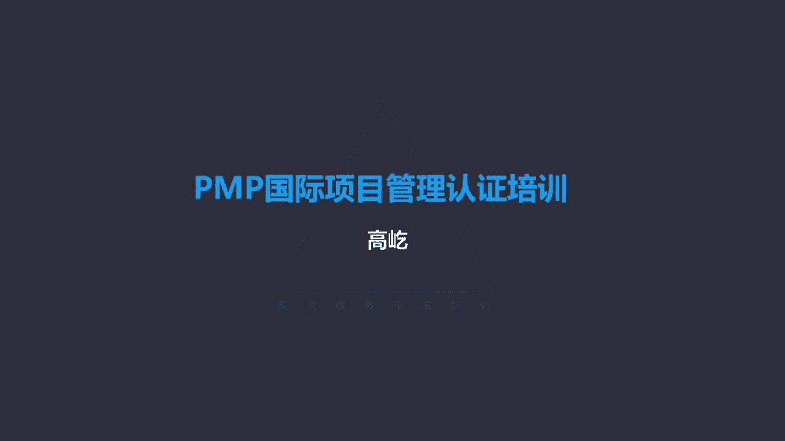

# K003-PMP项目管理认证培训 - P5：05.项目经理的影响力和胜任力 ▲ - 与君共造价 - BV1eu4nerEJF

这个章节里面我们要重点讲述一下，项目管理过程中最核心的相关方，项目的负责人，项目经理应该具有什么样的能力要求，应该承担什么样的角色责任，首先项目经理，啊他在领导项目团队达成目标方面啊，他是一个负责人嘛。

所以说发挥着至关重要的作用，并且在整个项目期间，很多项目经理哎，从启动一直要参与到项目的结束，项目的启动到项目最终的结束，这是什么呢，咱们前面讲过，这就是项目的生命周期。

因此啊项目经理在项目生命周期里面啊，将起到一个至关重要的一个领导管理作用，那么当然这也不是固定的，因为咱们在考试的时候，题目背景里面有时候会出现这样的描述，你中途接手了一个什么什么项目。

前任项目经理离职了，你被任命为项目经理，接替他的工作等等，所以说项目经理也不一定从头干到尾，而且我们第六版项目管理知识体系指南里面，对项目经理的职责范围做了一个调整，在以前，我们认为。

项目经理的责任就是集中在生命周期以内，项目开始了，项目经理被任命了啊，那么他要带领团队完成工作，最终实现目标，一直到项目结束，团队解散释放资源，这个范围之内是项目经理他发挥作用的时候。

但是现在咱们把他的职责扩展了，书上说了，项目经理可能在项目启动之前，就参与了一些评估分析活动啊，所谓前面的商业分析，商业论证工作，那么还可能呢参与一些项目结束以后，叫后续跟进活动，这指的什么呢。

运营活动，项目经理的责任范围扩大了，可能包括前面的论证工作，也可能包括一部分后面的运营活动，那么当然虽然他的工作职责范围被扩大了，但是他最重要，最核心的责任还是在项目生命周期以内，那咱们书上啊。

把项目团队跟管弦乐队做了这样一个对比，大型的交响乐队，这里面有很多的成员，每个成员呢都扮演着不同的角色，而一些项目团队里面也是这样，来自不同职能部门的人承担着对应不同的工作，所以成员与角色方面哎。

乐队和项目团队之间有相似性，团队中的职责哎也有这样的类似的关系，那么就是项目经理和指挥啊，他们各自的职责有相似性，比如项目经理要对过程负责，还要对最终的目标承担责任，而指挥呢你要负责整个乐曲的演奏啊。

过程的把控，最终演出的成功，这个责任是由是由乐队的指挥负责的啊，所以二者之间呀有一定的这种相似性，那么另外在知识和技能方面，乐队的指挥跟我们团队的项目经理，这里都提到哈，要具备综合性知识哎。

综合性的知识不但自己要有丰富的知识经验，而且呢还要与团队充分的沟通，哎这方面我比较有体会，哎，我上中学的时候有机会啊，加入我们学校的乐队了，我们学校的乐队这个指挥，我们音乐老师他的水平呢特别高。

你看一个中学的乐队啊，这个乐器也不整齐，这个人数也不是特别的多，小乐队嘛，我们老师啊，从那些比较大型的交响乐的谱子里面，对应着把我们每个乐器呀，这个分谱他自己给给扒下来了，然后教我们去练习。

我们在演奏再合奏，我们当时还参加区里的比赛，市里的比赛哎成绩还不错，你看我们这个音乐老师，同时也是我们乐队的指挥，他这个综合性知识就特别强，而且呢什么乐器诶，他都能演奏两下，你说他特别专业，特别擅长。

哎也未必，但是各个乐器啊他都比较熟悉，同理我们团队的项目经理，也要有这样的一个特点，你可能不是所有领域的专家，但是对于你所涉及的项目工作，这方方面面唉，包括一些必要的背景知识，要有充分的了解掌握。

而且项目工作不是您一个人完成的，这个过程里面要不断与团队沟通，那么来营造一个大家能互相支持，互相配合的良好的这样一个团队氛围，这样能够保证工作呀得到有效的推进，所以交响乐队跟项目团队之间有这样相似性。

乐队的指挥跟我们这里的项目经理，也有一些相似性，那么项目经理这里面给出了一个明确的定义，项目经理是什么呢，啊执行组织委派其实现项目目标的个人，因此说项目经理必须得到正式的任命，而且呢要承担明确的责任。

项目经理的任命啊，包括项目经理应该承担的责任，以及他应该具有的相应的权利，我们在后面会具体的提到项目经理，他的角色和职能经理，运营经理不太一样，书上告诉我们说，执政经理啊主要专注于某个行政领域。

包括专业的这个领域部门，而运营经理呢啊负责一个核心业务，项目结束以后移交移交给运营部门，所以啊不同的经理承担着不同的责任，项目经理的影响力范围，这个示意图表达的非常清晰。

你看他最密切接触或者说受到影响的项目团队，项目经理要带领团队，还要领导团队，那么还有呢叫PPP经理，这得给您解释一下什么叫PPP呀，这三个P分别代表project program和portfolio。

也就是项目项目集，还有项目组合，那么项目经理你要跟周边其他项目，项目团队的负责人，包括更高层面的项目集，以及再高层面的项目组合唉，这些不同层次，不同结构的负责人都要有所接触啊，要影响到他们。

还有呢资源经理，看资源经理，也就是我们前面提到的职能经理，它会为我们具体的项目工作提供相应的资源，包括人力资源，包括物品资源，再往外一点发起人领导机构啊，PMO指导委员会等等，更高层次的这些个相关方。

再往外，比如供应商啊，客户啊，最终用户啊啊，这些离我们具体项目工作距离再远一些的，也是与项目有关联的，这些个人群体或组织都是项目经理唉，他需要沟通，需要协调，也就是这里提到他的影响力范围。

所涉及的啊这些个对象，那么项目经理与项目之间是什么样的关联呢，首先他要领导团队实现目标，同时呢还要满足相关方的期望，为了完成项目工作，项目经理要把有限的资源做到充分的整合协调。

还要平衡一些有竞争性的制约因素，项目经理还是一个沟通者，谁与谁之间的呢，发起人团队成员，包括其他相关方，项目经理应该是项目沟通过程中的一个核心，另外还要通过一些软技能的技巧的应用。

来来平衡相关方之间的冲突，包括这种竞争性的目标，那么最终呢让不同的相关方持有不同利益的啊，这些相关方能够达成共识，大家共同为项目工作提供推动的这种动力，那项目经理与组织之间，也有这样那样的一种互动关系。

比如说项目经理不能光埋头于自己的项目工作，还要与其他项目经理互动，与他其他经理互动，这目的是什么呀，获得资源的一个协调，特别是当资源有限的时候，有些资源被其他团队使用了。

那么我们能不能和其他团队共享这个资源呢，你要与其他项目经理要沟通，要协商，另外组织中的各位经理，特别是那些个掌握资源的职能经理，这是项目经理需要沟通，需要协调的对象，他们那里来获取的资源。

因为不同的组织结构，项目经理呢有可能要向项目经理，要向职能经理啊报告报告项目的状态，那么另外还有与其他的这个角色紧密协作，好像什么主题专家呀，商业分析人员呀，这些都是团队工作需要的一些必要资源。

那么为了完成具体的项目目标，这些都是项目经理需要积极互动，积极沟通协调的对象，另外项目经理还应该时刻关注，行业的最新发展趋势，保持这种项目过程中知识的整合和传递，随时随地能够总结经验教训。

为后续的项目工作提供必要的这种支持，还有指导，另外呢要指导教育，叫其他专业人员的项目管理方法，也就是还要保证团队成员，能够在项目管理的方面获得必要的知识和支持，PMI呀。

在第六版项目管理知识体系指南里面，明确的提出了一个叫人才三角形，或者呢叫项目经理的胜任力模型，三角形，三角形的三边分别代表了一个合格的项目经理，应该具备的能力，分别是技术项目管理。

还有战略和商务管理以及领导力，这三方面相辅相成，那么书上也告诉我们了，说，虽然技术项目管理，技能是项目及项目管理的核心，但是只有技术项目管理是不够的，项目经理啊应该平衡这三种技能。

那么这三种技能到底是什么样的内容呢，什么样的具体表现呢，我们分别看一下，首先技术项目管理，什么叫技术项目管理啊，就是与项目项目集啊，项目组合管理，这个特定领域相关的这些个知识技能和行为啊。

他的技术方面的能力，换句话说项目经理哎要懂项目管理，咱们项目管理知识体系啊，这个理论你得知道吧，这十个知识领域，这49个过程，这里面大量的工具方法，项目经理应该熟练地掌握。

所以说能够有效地运用项目管理知识来用，在项目的工作过程中，帮助目标的一个达成啊，这是项目的呃，这个项目经理的技术，项目管理能力啊，包括在具体的项目工作里面，哪些工具可用，哪些该用啊。

或者说哪些不需要使用的，也就是所谓的裁剪啊，工具方法的选择，包括传统的工具，包括比较新的敏捷的工具方法等等啊，用哪些不用哪些，这属于技术项目管理的范畴，那么项目经理还应该有能力，或者说有这样的经验。

来制定完整的项目管理的计划，通过这样一个计划来指导具体的项目工作啊，那么针对项目的需求，明确具体的管理要素，比如进度啊，成本啊啊资源风险，让工作在规范的方法指导下，在具体的这种框架下得到一个平稳的推进。

这都属于技术项目管理的内容，那么除了技术项目管理，这里面还有一个叫战略和商务管理的能力，战略和商务，你看听这个词啊，就比较高大上了，作为一个合格的项目经理，除了要了解必要的。

我们具体的项目的专业知识背景以外，还要有更高层次的战略眼光，那么这里面提到了包括纵览组织概况，并且呢有效协商执行，有利于战略调整和创新的决策行动的能力，项目经理要有更高的视角。

从战略的角度来对自己的工作进行，合理的安排推进，要保证项目工作始终符合战略的方向，满足战略要求，因此这里边就可能涉及到其他这个，更扩展一些的知识了，比如财务方面的知识啊，市场部门的，包括运营部门的。

我们做项目要满足满足成本的这样一个制约，要符合市场的需求，另外呢还要为最终这个产品投入运营，提供一个保证，因此项目经理要求有更广阔的这样一个视角了，那么有了这样的战略商务能力。

有助于项目经理确定为他的项目啊，考虑哪些商业因素，唉所以项目经理不光从技术角度来考虑工作，还要考虑我们最终成果具有的商业价值，因为咱们前面说过了，一个项目要想得到执行，得到确立。

它必须要能够带来商业价值，可以是有形的，可以是无形的，那么项目经理这时候就要充分的考虑到，我的项目过程，包括我的成果，应该能够具有的一些这个商业因素，另一方面还需要领导力，什么是领导力呢，书上告诉我们。

指导激励，还有带领团队所需要的知识技能的这种能力，领导力其实又可以叫做影响力，这种影响力它是一种人际关系的技能，它是一种软技能，你看这里包括协商啊，啊抗压呀，沟通啊，问题的解决等等。

所以特别强调的是项目经理的情商了，这个理论告诉我们，优秀的项目经理，有超过90%的时间是花在沟通上的，你看这可能跟我们现实中的项目经理的，具体的体会啊，您的经历呀可能会有些出入了，我90%都在沟通。

别的事不干了吗，别的事真不需要你项目经理去做了，项目经理主要的责任就是沟通，协调整合啊，具体的工作具体工作谁去做呢，哎由相应的团队成员，由具体的技术专家去解决，哎。

这实际在我们考试里面也是一个考点的体现，题目里面经常出现这样的说法啊，说什么什么的工作应该由谁来完成，或者说由谁来承担责任，谁去做这件事呢，在题目里面我们可能看到各种各样的经理，比如说有项目经理。

有职能经理，另外还可能看到比如财务经理，风险经理，验收经理啊，或者什么什么什么等等，某某经理这个称呼特别多，注意这里的某某经理，他并不代表着职位权利的含义，这跟我们现实中的这种感觉不太一样了。

它实际反映的是什么呢，就是具体的工作由具体的人来完成，那反过来说，那这件事情由具体的人来完成了，这个具体的人就是某某经理，而不是项目经理，比如说验收工作谁来负责呢，唉这一定不是项目经理。

这是验收经理负责的，说谁对一个项目的直接费用承担责任呢，花钱这么大的事，这应该是项目经理吧，不对应该是财务经理或者叫成本经理，如果题目里边有这样的类似选项，我们一定选择诶那个某某经理。

因为它代表着他对某项具体工作要承担责任，要负责完成这些工作，就不是项目经理自己去做了，那项目经理做什么呀，那这里告诉我们了，有90%的时间都要花在沟通上，所以具体的事情不是项目经理承担的。

是由那个某某经理来完成，这个大家要特别注意领导力，刚才说了，领导力是一种软技能，它体现的更多的是人际呃，这种关人际的这种能力啊，或者说人际的一些方法，那么领导力与管理有一个对比了，什么是管理呢。

管理靠什么呀，靠权力运用一系列已知的预期行为，只是另一个人从一个位置到另一个位置，你看他用的词叫指示命令要求，这就是管理靠什么呢，靠权力，而领导力不是的，领导力是带领哎，带领他们从一个位置到另一个位置。

所以领导力靠什么呢，不靠权力了，靠影响力，能够让别人自发主动地听从你的安排调遣，这是你的领导力能力的体现，而管理呢那靠的是权力，我有这样的一个身份，我有这样的一个权力职位，我就可以命令要求你。

但是项目经理往往在权力方面是有限的，既然权力有限了，那管理能力的作用就不会太突出，因此更多的要靠这种领导力，书上给出了一个管理和领导力的对比，我们可以把它看一下，那么刚才提到项目经理权力往往是有限的。

确实权力有限，但不代表项目经理没有权利，这里面啊梳理出了项目经理常用的一些权利，比如第一种叫奖励的权利，奖励这里并不意味着说，项目经理有权给别人发奖，而是说如果项目经理能够做到及时有技巧。

而且呢有效果的这种激励，奖励包括有有限的物质，包括更多的精神，如果能做到这一点，那么你就可能赢得团队成员的信任和认可，进而呢人家愿意听从您的安排调遣哎，这样形成的叫奖励的权利，那比如说某位项目经理。

团队成员他们好的表现，他们这种优秀的这种成绩能够得到他的认可，精神上的物质上的，能够不断的激励团队，这样让团队对项目经理啊认可了，我们项目经理特别好，特别贴心，我们做的什么成绩他都能看到。

不但看到还能表扬我们，还给我们奖励，我愿意听他的，他让我干什么，我就干什么，这样形成的权利就叫奖励的权利，它是一种发自内心的，我接纳了项目经理这个人，我认可他了，那么他让我干什么，我就干什么。

所以这是一种特别好的权利，这也是应该是项目经理优先使用的权利，第二种叫专家的权利，专家的权利源自哪呢，源自项目经理自己自身，在专业技能方面的这种突出表现，他是专家啊，是行业领域的专家。

包括我是项目管理方面的专家，有了这样专家的身份了，那么让别人呀信任您，钦佩您，听张公的没问题哈，张公经验太丰富了，跟张公做项目，让你干什么，你就干什么，绝对没错，因为你有这样专家的身份了。

大家钦佩您这种身份，所以你安排的工作大家没有质疑，没有怀疑，让干什么就干什么，为什么呀信任你，所以专家权力源自于钦佩和信任唉，这也是一种特别好的权利，是别人主动的，乐于听从你的安排调遣啊。

因此应该积极地使用这种专家的权利，但是专家的权力又有一定的门槛了是吧，不是每个人都能具有的，首先您得自己有这种专家的身份，有这样的成就业绩才可以，没关系，我们还有叫法定的权利，也叫正式的权利。

这种权利的特点是正式的授权，我们后面在整合管理里面会讲到项目章程啊，这个标志着项目正式启动的文件，其中重要的内容就是任命项目经理，给项目经理明确的授权，通过这样的授权，项目经理得到了权利。

那么在项目的执行过程中，就可以运用这些权利，比如可以组建团队，比如可以使用特定的资源，比如可以对团队成员，根据他们的表现给予奖励考核，唉，这些权利是得到领导授权的，有正式的授权文件，比如项目章程。

所以这个叫正式的权利，也叫法定的权利，还有一种权利很有意思啊，叫参照的权利，什么是参照的权利呢，参照的权利，这个权利本身并不属于项目经理的，他是别人的，一般是领导的权利。

但是呢能够被项目经理哎为自己所用，给自己撑腰，其实参照的权利相信大家都用过，也都会用，最典型的例子是什么呢，抄送邮件，比如我们项目工作里面，我需要某个部门的某位同事给我必要的配合，我给他发了一个邮件。

那么这个邮件我只发给他自己吗，不会哎，我一般会这邮件还会抄送，抄送给谁呢，抄送给他的领导或者我们共同的领导，这个邮件我要抄送给别人，那么当然你说我把这个零件抄送给领导了，我真的希望领导亲自出面。

帮我来解决协调这件事儿吗，未必，那么这个邮件你说领导一定看得见吗，领导一定会认真的阅读吗，也不一定，哎，那我抄送的目的是什么呀，其实大家心里都知道了，我抄送邮件给谁看的呀，给我那位同事看，你小心点啊。

你看看领导知道这件事了，我是为了吓唬他，这就是参照的权利，他收到邮件了哟，领导也知道了啊，我我我注意点，我小心点，通过领导的权力来给你撑腰了，所以又叫狐假虎威的权利，唉参照的权利就是这个特点。

虽然不是你的特有的权利，但是别人的权利能让你拿过来使用，当然哈这个邮件抄送咱们也得适可而止，应该什么事都抄送，你抄送，我还抄送呢，这可能造成矛盾，其实啊参照的权利不一定是一种告状的方式。

你用好了还可以成为一种激励的手段，怎么来激励呢，团队成员表现好了是吧，你别光口头表扬他了，你也发个邮件，这个邮件不光发给你的同事诶，你把这个表扬的邮件你也抄送给领导。

你看这样被表扬的你这位同事感觉会更好了哟，太好了，领导都知道我这种好的表现了，我一定认真努力，我一定继续啊，更努力地工作，当然你说领导一定看得见吗，也不一定，但是同样起到了这种狐假虎威的效果。

所以参照的权力用好了，不光可以告状，也能用于激励，这是一种特别好的这种隐形的权利，那么还有最后一种叫惩罚的权利，项目经理能不能触发团队成员呢，当然可以，那比如说我可以给你扣，给你考核，我可以扣分儿。

你做的不好了，我就应该批评你，我有这个权利，但是pi的原则尽量不要用这种惩罚的权利，什么时候呢，那比如说他明确做出了违反法律道德，违反规定规则的事情，该惩罚要惩罚或者紧急的情况下了。

我们用这种惩罚的手段，我们后面资源管理里面还会再详细介绍到，总之项目经理权力的应用，原则上应该遵循这样的顺序，优先使用奖励的权利，接下来呢专家的权利后面还会有正式的权利，除此以外还有参照的权利。

最后最后呃不得已了，紧急情况下，特殊情况下再用惩罚的权利，按这个顺序来使用，能不能起到能起到一个更好的一个效果好，那么下面我们再看看领导力风格，那领导力风格其实很简单，领导力风格有多种多样。

但是领导力风格有没有好与坏的区别呢，注意没有，领导力风格有各种各样的表现，可能要考虑到，比如领导者自身的特点唉，团队成员的特点，包括当时特定的环境，以及特定的组织结构的这种要求。

所以领导力风格不管是什么样的表现，大的原则没有对与不对的区别，只有什么的区别呢，用了合适不合适的区别，项目刚一开始相对工作比较混乱，大家对工作的内容不是很清晰的时候，那么项目经理这时候就可能用一些。

更多自己做出决策，指导大家怎么来做，随着项目的推进，工作步入正轨了，那么这个时候，有问题，大家协商讨论，那么特别这里边还提出一个叫服务型领导，那服务型领导也叫仆人式领导。

这我们后面在涉及到敏捷相关概念的时候，再给您详细讲述，那么总之领导力风格多种多样，与对应的工作内容相一致，就是好的领导力风格，另外项目经理还有一个重要的责任，就是执行整合嗯，什么是整合呀。

哎整合的另一个说法就是协调哎，协调资源啊，协调相关方，所以整合是项目经理必须要完成的，一个重要工作啊，所以也被认为是项目经理的关键技能，那咱们书上提到了啊，三个层次的具体工作过程层面要整合。

团队成员的认知层面需要整合，包括项目的背景层面也要整合，您记住整合就是协调。