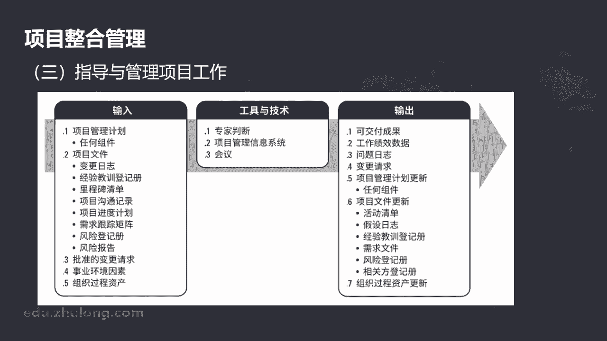
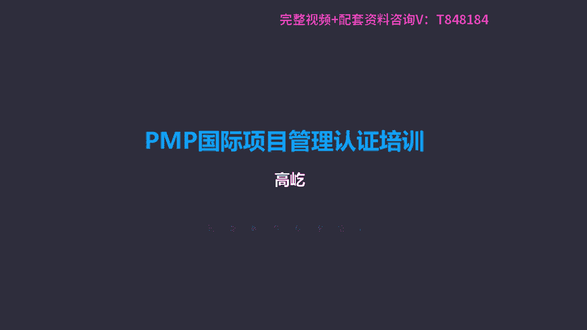

# K003-PMP项目管理认证培训 - P7：07.项目整合管理：制定项目管理计划 ▲ - 与君共造价 - BV1eu4nerEJF

第二部分制定项目管理计划，这个过程我们从名字，从它的标题上来看，制定项目管理计划，那么应该是个什么样的过程呢，应该是一个编制计划的过程，从无到有，我们制定出这样一个计划，然后呢用这个计划指导工作。

我们从字面上应该能够这样来理解，那我们看看制定项目管理计划，这个过程它到底是干什么的呢，你看定义准备和协调项目计划的所有组成部分，并把它们整合为一份综合的项目管理，计划的过程。

嗯我们发现啊制定项目管理计划这个过程，它的本质它并不是简单的从无到有的编制，而是一个整合的过程，什么叫整合呢，把既有的啊各种材料，各种要素组合协调哎，形成一个更加完备的一个成果。

那么所以制定项目管理计划，这个过程并不是从无到有，从零开始来编写计划，它是一个综合整合的过程，我们具体看看他是怎么做的啊，首先项目管理计划，项目管理计划的作用是什么呢，它来确定项目的执行过程啊。

它整个的监控过程包括最终的收尾方式啊，这是一个指导工作的一个依据的，这样一个文件嗯，项目管理计划根据具体的项目情况啊，可以是概括的，也可以是详细的，那么具体的它的详细程度。

是由具体的项目工作情况要求来决定的，简单的项目可能计划相对就也就简单一些，概括性强一些，那么复杂的项目或者难度大的项目，它可能这些细节的信息就会更多，那么项目管理计划说应该基准化，什么叫基准化呀。

不能随意改动，一经确定应该把它让它稳定下来的，哎这样我们叫它基准化，那什么应该基准化呢，咱们书上说了范围，时间成本这三方面应该明确地确定下来，也就是要有明确的范围基准，哪些是该做的，哪些是不该做的。

要有明确的时间基准，什么时候开始，什么时候完成，包括成本基准能花多少钱，工作到什么时候可以花多少钱，还剩多少钱，后面我们会详细介绍各个基准的它的构成，包括它的形成，另外在确定基准之前。

我们这个版本里面有了一些松动，有一些调整了，他说在确定基准之前，这个项目管理计划可能要多次更新，但是这种更新因为没有基准的，所以啊不需要遵循正式的变更流程，可是一旦有基准了，比如范围基准确定了啊。

成本基准进度基准定下来被批准了，那么如果再有调整，那就不能随便改，随便更新了，要通过规范的整体变更控制过程来完成，我们后面会详细的讲到，关于整体变更控制，它是一个复杂的流程。

在以前的版本里面没有这个说法，第五版及以前，如果项目过程中出现了变更，项目管理计划要更新，不管什么时候都要严格遵循变更流程，咱们第六版与实际工作更加贴近了，不用太教条了，在没有形成基准之前。

或者说在编制计划的早期，这时候如果需要更新的，那么直接修改就可以了，但是因为项目管理计划要基准化，也就是一旦确定不能随意改变的，因此如果有了基准了，再出现变更的要求。

那我们就要严格的遵循整体变更控制过程了，另外项目管理计划不是一次编制完成的，一直在收尾之前啊，这个计划要不断的叫渐进明细，不断得到更新，那当然更新，那就要遵循相应的变更控制流程来完成了。

制定项目管理计划，它的输入工具技术输出来，我们看相对比较简单，首先它输入这里有一个叫其他过程的输出，刚才我们就提到了，说项目管理计划，它不是一次编制完成的，它不是通过这样一个过程叫制定项目管理计划。

这个过程就编出来的，它是一个整合的过程，整合什么呢啊，整合诸多过程，从后面范围管理，进度管理，成本管理哎，到风险管理，采购管理，到相关方管理等等各个过程，各个规划过程输出的唉，那些个文件，那些个材料。

把它们现在放到一起要整合了，所以说其他规划过程输出的子计划，包括基准都要放到这个制定项目管理计划，这个过程当做输入，在这个过程里面要得到整合啊，得到更新，那么最终形成一个正式的项目管理计划。

这是什么意思呢，哎项目管理计划不是一个过程制定的，它包括各个过程，包括规划过程输出的子计划，包括对应的基准，因为整合嘛是吧，咱们前面讲过整合就是要相互协调，相互配合，我们会编制一个啊，比如范围管理计划。

范围管理计划告诉我们如何来管理范围，我们还会编制进度管理计划，哎怎么来管理进管理项目的进度，还有呢成本管理，基化质量管理计划，包括风险管理计划，资源管理计划等等等等，但是我们在编制每一个独立的。

某某管理计划的时候，哎这时候啊我们考虑其他因素可能不太多，比如我在编制进度管理计划的时候，我当然最关注的就是进度，怎么让进度满足要求，我制定了一个进度管理计划，同样我在制定成本管理计划的时候。

我更多考虑的是唉怎么让成本得到合理的控制，唉怎么去管理我的成本支出，那这个时候我可能不会更多的去考虑，所谓的进度范围质量，那因此我们编制了各个管理计划有没有价值呢，当然有价值。

但是因为我编制什么样的管理计划，我通常考虑的就是某一方面，我编制进度管理计划，我就更多关注进度，同时呢我对范围成本质量可能想的就比较少，同理你编制别的管理计划也是这样，所以如果我们只把这个某某管理计划。

当做一个指导项目的一个依据的话，那就可能出现咱们前面说的只关注某一方面，而对其他方面造成了不利的影响，这直接影响到最终目标的达成了，唉，所以我们要通过一个制定项目管理计划的过程。

把其他各个过程输出到这个某某管理计划，包括某某基准要整合了，要协调了，比如彼此互相的配合，包括彼此互相的让步，通过这样一个整合的过程，我们才能得到一个真正能够指导工作，能够最终帮助项目实现目标。

获得成功的啊，一个项目管理计划，那所以说项目管理计划不是一个过程制定，虽然这个过程名字叫制定项目管理计划，但是它的本质是一个整合的过程，整合协调形成了一个最终的项目管理计划。

我们要用它来指导具体的项目工作，这个过程里的工具之一叫会议啊，开会特别指的项目开工会什么时候开，工会会启动呢，规划阶段结束，包括执行阶段开始，所以这样一个开工会的目的是传达目标哎，获得团队的承诺。

包括阐明每个相关方对应的决策职责，这个是开工会议，有时候也叫启动会，题目里面有时候翻译把这个会也叫启动会，那么问题开工会这个启动会要开几次呢，注意上面说的开工会议意味着阶段结束呃。

只这个规划阶段的结束和执行阶段的开始，所以要开几次呢，有几个阶段就要开几次，所以多阶段的项目，每个阶段开始的时候都要有一次开工会，他可不是就开一次项目，开始了就完成就开会，开完了就就就后边不开了吗。

不是啊，每个阶段在开始的时候都要有前期的规划，包括接下来的执行，所以项目有几个阶段就要开几次，这种开工会或者启动会，另外还有一个特点，开工会干什么呀，上面说了，传达目标，获得承诺，阐明相关方的角色职责。

所以开工会的作用仅此而已，不要希望开工会上讨论出决策出什么样的内容，通过开工会，我们讨论出什么样的观点，我们做出什么样的决策，不会啊，它就是一个标志性的会议，标志着规划工作完成了。

接下来要开始正式的实施了，所以在这样的开工会上是不会讨论，不会决策的，如果题目里面出现这样的问题，问以下都是开工会议上应该完成的工作，除了哪些啊，或者以下哪个不属于开工会议应该涉及的内容。

那么那些个讨论的呀，决策的这些公有活动都不是，他就是一个单纯表达的传递信息的这样一个会，开工会又叫启动会，这个过程最终输出的叫项目管理计划，项目管理计划整合综合了所有的子计划和基准，最终形成一个合理的。

能够指导项目最终达成目标的啊这样一个文件，那么涉及的子计划啊，或者叫子管理计划，包括其他规划过程组的输出，那么当然这时候在项目管理计划里面，这些个子计划跟刚刚制定出来的那个子计划，已经有变化了。

那是怎么变了呢，整合了哎，整合了调整了，彼此之间相互协调适应，当然他的名字还叫某某管理计划，另外呢还有基准三个基准范围进度成本，但一定是被批准啊，得到批准得到认可的，这些个基准包括其他的组件啊。

其他管理计划啊，包括什么生命周期开发方法等等，在咱们书上有专门这样一个表格，这个表格清晰地给出了，项目管理计划和项目文件的区别，我们看到左边这一列就是项目管理计划哎，右边的都是项目文件。

这个表格在以前的版本里面，是出现在附录里边的，现在把它放到正文里面了，可见呀这个表格内容的重要性，我们要清晰的知道哪些内容，哪些要素属于项目管理计划，哪些要素不属于项目管理计划，属于项目文件指导。

项目工作要依靠什么呢，依据项目管理计划，换句话说，如果没有出现在项目管理计划里的内容，那么原则上是不能得到执行的，这个问题最典型的我们看项目文件里面，27有一个叫风险登记册。

风险登记册是风险管理过程中的一个重要文件，我们的风险管理章节还会更详细的展开介绍，我们先简单介说一下，举个例子呃，风险登记册里面记录了，当风险发生时候，我们应该采取的具体应对办法，应对措施。

可是当风险真的发生了，我们第一时间应该做什么呢，注意并不是按照风险登记册里描述的，应对措施去执行，按照我们这套理论来说，风险发生第一件事应该马上提出变更申请，这是为什么呀，就是因为风险登记册。

你看它属于项目文件的范畴，它不是项目管理计划的内容，项目工作要完成的工作，必须包含在项目管理计划里面，那么风险发生了，虽然风险登记册里面也有所谓的计划，风险应对措施，这不就是计划吗。

但是它不属于项目管理计划的内容，因此即使风险发生了，我们也不能马上执行这些个具体措施，要通过变更把它纳入项目管理计划，成为计划的一部分了，接下来我们用它来指导工作，来执行这些应对办法。

所以啊我们必须明确的知道，哪些是项目管理计划，哪些是项目文件，只有项目管理计划里的内容才能得到执行，这个表格大家得多看一看，下面第三部分叫指导与管理项目工作啊，这个过程是为了实现目标领导。

执行项目管理计划中确定的工作，包括呢实施已批准变更的这样一个过程，从他的名字指导与管理项目工作，我们就能够判断出来了，这个过程应该属于哪个过程组呢，执行过程组，这是一个做具体项目工作的环节。

这样一个过程啊，他是对项目工作和成果要开展综合管理，提高项目成功的可能性，因此要在整个项目期间不断的开展啊，包括执行具体项目活动工作啊，完成对应的成果，达成目标，必要的时候呢还要执行一些具体的变更请求。

那么当然一定是获得批准的变更了，这是指导与管理项目工作，这个过程应该完成的内容，这是它的输入工具技术，还有输出。

在这个过程里面，其中有一个工具叫p m i is，什么意思啊，什么叫PMIS啊，翻译过来叫项目管理信息系统，项目管理信息系统就是p m i is，为什么专门提这个呀，啊因为这个英文缩写您最好把它记住。

考试的时候虽然是中英文对照，但是如果英文里面给的是缩写的话，那么对应翻译成中文还是缩写，英文缩写是不给你展开翻译解释的，所以啊咱们书上有一些常见的，或者说比较重要的缩写，您最好把它记住，哪些呀。

没关系啊，咱们随着后面的课程涉及到的都会给您提示，那么这里边的项目管理信息系统唉，这个你就要知道什么意思呢，什么是项目管理信息系统呢，其实指的就是电子化的工具，一些软件工具啊，做进度计划的软件工具啊。

工作授权系统，配置管理系统，信息收集发布系统等等，其实指的就是一些电子的表格，一些专用的项目管理软件，通过这些个工具软件的帮助呃，我们的项目管理工作能够变得更加清晰啊，能够变得更加准确。

所以在指导与管理项目工作的时候，我们会用到这些电子化的工具，这个过程输出的叫可交付成果，某个过程某个阶段或者最终项目完成的时候，我们输出得到的就叫可交付成果，可交付成果啊，可以是产品，可以是服务。

也可以是啊，能力有形的也可以，也可能是无形的，这是成果的这样一个描述是吧，它必须是独特的，而且呢是可核实的成果的特点，另外还要输出的内容叫工作绩效数据，咱们前面介绍过什么叫绩效数据呢。

最原始的观察结果和测量值，哎，这是最低层次的，随着项目的执行，随着项目的推进，随时出现的这些个数据哎，这些个呃信息我们都要把它及时的记录下来，这些记录下来的最底层啊，最具体的数据我们就叫工作绩效数据。

那么当然公的绩效数据是没有经过加工整理的，是最原始的记录，唉，很多时候是不能直接拿过来使用的，我们用要用什么呢，我们还要把它进一步的提炼啊，最后变成变成工作绩效信息，变成绩效信息以后唉，使用更加方便。

但是特别注意绩效数据也好，绩效信息也好，这是谁来用的，或者说谁能查看的，项目经理和团队啊，数据信息这些比较低层次的内容，不能给外部相关方看，给他们看看的什么呢，绩效报告咱们前面介绍过。

另外还要输出输出一个成果叫问题日志，随着项目工作的推进，我们也会遇到各种各样的问题，同时也会解决各种各样的问题，那么问题日志就是记录跟进所有问题的，一个项目文件，那么项目文件啊，这个问题日志。

问题日志是指导与管理项目工作，这个过程输出得到的啊，说在这个过程里面第一次被创建了，那么一旦出现在整个生命周期里面，应该随同监控活动不断的更新，不断的记录问题，日志里面通常可能包括这些内容啊。

问题的类型，谁提出的，什么时候提出的，到底什么样的问题，问题的描述，问题的这种优先级紧急情况，包括谁来负责解决啊，目标解决的日期状态以及最终解决情况等等，我们这里提到的问题日志有点像什么呀。

有点像我们工作里边的那个叫备忘录，出现问题了，我们要把它记录下来，包括还要有明确的预期，预定的解决时间啊，解决的责任人等等，有点像那个备忘录，我们这里边叫做问题日志，项目生命周期过程中。

所有的问题都应该记录在这里面，另外还可能输出变更请求哎，变更请求对什么的变更啊，修改任何文件，包括可交付成果啊，或者基准的一个叫正式提议，变更请求，既然是输出的成果，一定是文字化的，一定是纸质的。

书面化的一个正式文件，那么只要是变更请求哎，这里提到了任何相关方都可以提出变更请求，没有门槛，任何人任何时间都可以提出，那么只要提出了，应该按照整体变更控制过程审查处理，当然咱们前面也讲过。

如果没有形成基准的时候，提出变更请求，我们直接记录就可以了，但是一旦有了基准了，基准确定了范围，进度成本，这个基准被批准了，那么再提出的任何改动，我们都要严格地执行整体变更控制过程，那么在做工作的时候。

执行项目工作的时候，当然就可能提出变更，常见的变更请求，有这么几种，九种措施，预防措施，缺陷补救，还有更新啊，这四类我们都叫做变更请求，那么这四类也有区别啊，什么是纠正措施啊。

为使项目工作绩效重新与项目管理计划一致，进行了有目的的活动，纠正措施已经出现偏差了，我们为了纠偏，我们用的办法叫纠正措施，预防措施呢还没出偏差呢，但是为了确保未来绩效符合项目管理计划，避免未来出错。

我们采取的办法叫预防措施啊，还有一种叫缺陷补救，这里面要注意缺陷补救，现在缺陷已经造成了，但是这个缺陷我们通常只针对质量缺陷，如果出现了质量问题，我们采取的办法啊，这个这种变更叫缺陷补救。

只针对质量缺陷，那么更新呢啊更新是针对文件版本的一个更替，这个叫更新上面的纠正措施，预防措施包括缺陷补救是具体的办法啊，具体的方案而更新对什么的更新啊，啊对文件，对计划，对文本啊。

它的版本啊啊他的这个批号啊进行更新唉，以上四种都属于变更请求，它源自于指导与管理项目工作，做工作的过程中会输出变更请求，第四个过程是管理项目知识嗯，管理项目知识。

这个过程是咱们第六版项目管理知识体系指南，新增加的，以前是没有的，这个过程干什么呢，啊，使用现有的知识，还有生成新知识，来帮助组织学习的这样一个过程，学习的目的是什么呢，利用已有的知识创造改进成果。

用于支持组织运营，包括未来的项目或阶段叫知识管理，那么管理的知识分成两类，一种叫显性知识，什么意思啊，比较容易用文字，图片跟数字来编纂记录的知识，就叫显性知识，我们现在学习的项目管理知识体系指南，哎。

这个就是显性知识，你看打印出来了啊，不是打印啊，印刷出来了，我们买到了这本书，哎这就是显性知识，还有呢叫隐性知识，隐性知识跟显性知识不一样了，它是我们个体的知识，是我自己独有的。

而且啊不容易明确的表达信念，洞察力，我的经验心得体会一些诀窍，这叫隐性知识，那么在管理知识的过程中会有些误解哈，所谓的误解什么时候用啊啊，结束项目或阶段结束的时候，总结经验教训，供未来使用。

平时平时记录下来就可以了，哎错了，我们现在增加了这个管理项目知识的过程，就是为了纠正这种误解，知识管理要随时随地执行，项目过程中，随时有了经验教训，随时就要记录。

不但记录还要运用在接下来的项目工作里面啊，不要等到项目结束了或某个阶段结束的时候，我们再再来把经验教训做个总结，随时随地都要用，那么哪种知识更容易分享呢，那显然显性知识是吧，哎它易于用文字记录啊。

它能够编纂出来的，所以显性知识更容易分享，嗯虽然显性知识容易分享一本书，你买到手了，你就有了显性知识了，但是它不能确保正确的理解，因为缺乏明确的情景是吧，可以做不同的解读啊，有句话说得好。

1000个人心中有1000个哈姆雷特，就是这个道理，你把一本买了一本书，你看有你的理解，我看有我的理解，所以显性知识虽然容易分享，但是不能保证理解是正确的，而隐性知识呢它的内涵很丰富是吧。

心得体会诀窍方法，但是它不容易记录下来，有时候可能就是一种感觉，所以不容易传递，什么情况下才能传递呢，啊通过人际交流互动的方式来分享，所以前提我要乐于把我的经验告诉你，传递给你了。

那么隐性知识才能得到传递，因此说营造一种相互信任的氛围，彼此之间大家乐于分享自己的经验，自己的心得，这样隐性知识才能得到一个传递，显性知识与隐性知识的传递，我们都需要特定的工具，比如唉知识管理工具。

知识管理工具用于分享隐性知识，它有什么作用呢，在面对面互动的方式建立信任，彼此信任了，营造一种乐于沟通，乐于分享的环境，我们这种隐性知识大家可以交流，可以表达出来，你看人际交往啊，包括讨论啊。

知识分享活动，讲故事啊，什么知识展会茶座等等，他的特点沟通，但是呢强调的是一种感性的沟通，大家要营造一种乐于分享交流的气氛，我愿意把我的心得分享给你，所以通过知识管理的方式，能够把隐性知识得到传递。

那么还有一种呢叫信息管理，信息管理它的特点是传递显性知识的一个分享，比如增加互动的要素，有什么问题，你直接问我，我给你解答，直接询问，这样让显性知识能够得到正确的一个传递，所以说用信息管理它的特点啊。

比如图书馆服务信息收集啊，项目管理信息系统哎，这里面他也是在沟通，但强调的呢是理性的沟通，包括啊大家规定好的规范的编写方式，编写格式，让这些易于记录表达的显性知识，能够规范地记录下来。

能够过程中尽量减少歧义，为了避免歧义呢，及时的沟通，及时的来纠偏啊，所以他也是沟通，强调的是理性，让这种能够记录下来的显性知识，得到正确的传递和理解，我们这个过程里边还会涉及到一些人际关系，与团队技能。

倾听啊，领导力啊，人际交往等等的，我们在后面资源管理里面还会详细的介绍，他输出的叫经验教训登记册，那么既然是经验教训了，那就是在项目过程中，我们经历的各种经验，我们总结出的各种教训，包括行动方案啊等等。

那么这些内容我们不但要记录下来，我们还要随时随地的把它们用起来，项目早期开始有了经验教训登记册了，到了结束项目或阶段的时候，我们把这些个经验教训统一导入到唉，经验教训知识库。

这样他们就成为了组织过程资产的一部分，知识管理，更注重了项目过程中随时随地的经验，教训的总结记录和应用，那么到了最终项目结束的时候，包括阶段结束的时候。

