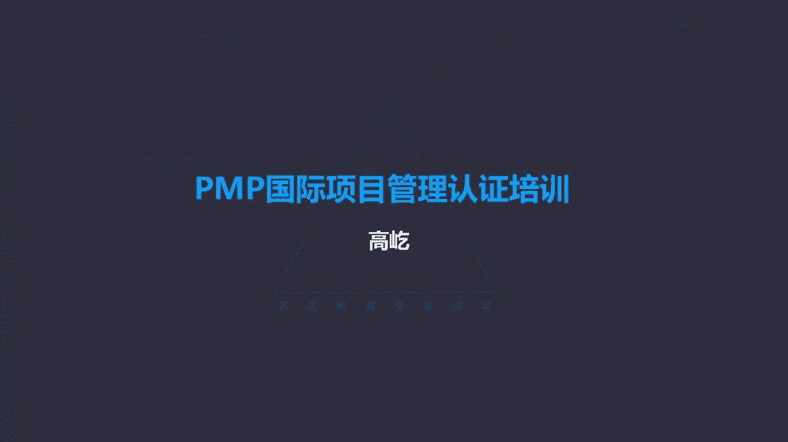

# K003-PMP项目管理认证培训 - P9：09.项目范围管理：项目管什么？ ▲ - 与君共造价 - BV1eu4nerEJF

范围管理，范围管理管什么呢，哎我们先看一下，范围管理，包括确保项目做且只做所需的全部工作，已成功完成项目的各个过程，哎，所以范围管理这个所谓的范围，指的就是我们该做哪些和不该做哪些呃。

范围管理主要的作用就是定义跟控制，什么工作是包含在项目以内的，同时呢，还有不应该包括项目之内的，可能有人觉得有点奇怪哈，我们明确哪些是该做的，这个很重要，这个也好理解，明确项目的范围吗。

但是为什么还要特意强调，不应该包括在项目内的内容呢，这些不应该包括的内容，我们也要明确下来，它的目的，它的作用是什么呢，范围管理我们既要明确该做的，同时还要明确不该做的这部分不该做的内容。

如果也能明确的话，它有一个好处，就是一定程度上可以控制不必要的变更，咱们前面讲过整体变更控制那个流程，那流程特别复杂，当然这个流程也非常重要，在咱们考试里面咱们说过哈，有超过20题啊。

超过20道的题目都与变更相关，这个比例非常大，咱们不妨把这个变更流程再梳理一下，回忆一下整体变更控制第一步应该干什么呢，书面记录变更，或者叫要求提出正式的变更申请啊，让变更请求书面化，这是第一步。

接下来第二步是全面的分析评估，谁来分析，谁来评估啊，项目经理和团队评估的基础上，我们要做出决策，这个变更请求是可以被接受呢，还是应该拒绝呢，要决策了，要么是项目经理决策那些影响比较小的啊。

不涉及基准改变的，如果基准改变了，那由CCB来决定，叫变更控制委员会，完成决策，接下来叫更新项目管理计划，更新完计划通知相关方，这还不是执行呢啊通知提出变更申请的相关方，包括受变更影响的相关方。

接下来执行变更，最后还要记录在变更日志里面，别忘了这个日志文件log文件，哎，这是一套完整的规范的变更流程，那我们能够看出来哈，这套流程确实很复杂，不但复杂，在执行的过程中啊，还一定要投入必要的精力。

包括占用一定的时间，咱们项目工作的背景通常都是时间紧张的，资源有限的，在这样的背景下，我们又不得不为这些个变更投入更多的精力，甚至呢可能影响到了正常的项目工作，因此按照我们当前项目管理知识体系。

这套理论的观点来看，总体上我们不太欢迎变更，最好没有变更才好呢，可是变更又不能杜绝，因为任何时刻任何相关方都能提出变更啊，那所以那既然大家都能提变更，那怎么办呀，我们就用这一套严格规范的流程来约束。

来控制它，所以你看我们既然明确了该做的工作，已经知道哪些是该做的了还不够，我们还应该知道哪些不应该做的，明确了不该做的工作内容，那就有助于一些变更可能不会再出现了，比如说我们跟客户约定好了。

当前项目我们只提供1234这四项功能，这是我们应该做的内容，如果仅此而已，我们就明确了该做的1234，那么在项目的执行过程中，客户就有可能提出那个功能五能不能提供啊，那个六能不能提供啊。

这个七是不是也给做上了，哎你看如果我们只明确了应该做的，那么在项目的过程中，客户是可以提出变更的，那就有可能提出应该做的范围以外的工作，那么这就引起了变更了，如果我们提前就把那些不应该的工作啊。

不应该包括在项目里面的内容也明确下来，那情况可能不一样，我们跟客户约定好了，当前的项目只提供12344项功能，同时我们也明确了当前项目不提供5678，既明确了该做的，也明确了不该做的。

那么在项目执行过程中，哎客户再想哎提出关于5678哎，这个功能的变更请求没有机会了，提前咱们约定好了，既明确了该做的，也明确了不该做的，所以一定程度上有可能减少，这些叫不必要的变更，那当然他还可能提出。

那我那个功能九能不能实现呀，我想增加功能十，这也有可能，那么毕竟那个5678没有机会再提了，所以我们在范围管理的时候，既要明确该做的工作，同时也应该明确不该做的工作啊，这对于范围的稳定。

一定程度上减少不必要的变更，节约项目，有限的资源时间都非常重要，哎这个是不能忽略的，范围管理的核心概念，那这里面包括两种范围，第一种叫产品范围，产品范围它的定义告诉我们什么是产品范围呢。

某项目产品服务或成果来具有的功能和特性，这就是产品范围，产品具有的功能特性是产品范围，还有另一个范围叫项目范围，项目范围那指的就是为了交付具有特定产品，特定功能的产品服获成果而必须完成的工作。

所以项目范围描述的是具体工作什么样的工作，什么什么样的特定工作呢，唉为了交付具有产品范围所描述的，那些特定的功能特性，为了完成这些具有特定功能特性的产品，服务成果，我们哎必须要完成的工作。

所以简单的说什么是产品范围呢，产品的功能特性就是产品范围，什么是项目范围呢，需要完成的工作内容就是项目范围啊，那我们也能看出来这个项目范围，因为它是与特定的产品范围相对应的。

因此有时候项目范围也包括产品范围，但是如果要区分开的话，那么产品范围指的就是产品的功能特性，项目范围呢就是为了得到这些特定产品，我们需要完成的具体工作啊，他的工作边界就是项目范围。

那么项目范围是否完成了，我们用什么来评判呢，用项目管理计划，项目管理计划，它是记录了我们项目过程中，需要完成的具体工作内容，所以它与项目范围对应，产品范围呢，产品范围是不是都实现呢。

唉这是由产品需求来衡量来评估的，唉这两个概念，产品范围和项目范围，我们要注意区分，在预测型生命周期，这种比较传统的成熟的项目类型中，那么在项目一开始的时候，我们就能对项目成果进行明确的定义。

咱们在讲生命周期的时候说过预测型，它的特点就是相对成熟规范，在工作没有开始的时候，我们就能对项目的全过程，包括他的最终成果有一个清晰详细的描述，或者叫规划过程中可以有变更吗，可以有那么任何的变更。

改变要经过严格规范的变更流程，或者说范围的变化要渐进管理啊，逐步逐步的来达到最终的一个明确的范围，边界范围，需求预测型生命周期啊，包括收集需求，定义范围，还有创建工作分解结构呃。

我们后面会讲到的这些具体过程唉，这些在明确项目范围的具体活动，都是在项目一开始的时候哎就已经开展了，如果有变更，那么就通过变更控制来更新，而确认范围，这指的什么呢，咱们前面提过一句，确认范围。

指的是验收，对阶段成果或者整体项目成果的最终检验，那正式的外部验收，这叫确认范围，而确认范围这个是每一个成果啊，这个成果在每个阶段的，那个叫阶段关口的时候啊，我们这里轮叫审查点来完成。

这是预测型生命周期的这样一个特点，也就是他的成果不断的要得到检验，得到验收确认，那么范围基准范围基准已经确定了，原则上是不能随意改变的，如果要改通过什么呢啊，通过正式的变更控制过程，通过变更控制。

我们才能让项目的范围基准发生调整，哎就是刚才咱们讲的那一套规范严格的流程，这是预测型生命周期，我们能看出哈啊，他对范围管理的所有步骤都是中规中矩的，那每一步都要严格的依据原则，依据规范来执行。

在敏捷或叫适应性这种环境里面，那么对范围的管理有些变化了，因为叫敏捷了，适应型生命周期，那么它的特点就是过程中会有大量的变更啊，变更开始出现了，在这样的情况下，那么就需要相关方持续的参与项目。

这里的相关方通常指的是项目以外的那些个，领导啊，客户啊，发起人呀啊，需求的提出方啊等等，他们要持续参与项目，通过他们不断地提出变更，来让他们的需求，或者说让项目的范围得到明确。

并且他没有办法一次把计划充分完成，所以呢要通过多次迭代来开发成果，咱们在讲适应型生命周期的时候，我们提到过这种敏捷类的迭代，它的特点时间长度相对是确定的，在确定的时间长度内完成特定的工作。

那么这个特定的工作什么时候确定的呢，每次迭代开始的时候才能够相对准确的来确定，接下来一个固定的迭代时间，我们该做什么，比如两周以内我们需要完成什么，那换句话说，只有事到临头了，我们才做计划。

我们不会提前做出计划，因为敏捷了大量的变更，我们没有条件，那我们或者说无法，提前更多的时间来充分的完成，这样一个前期的规划，在整体范围，项目的整体范围难以做出准确确定的情况下。

那么敏捷环境我们怎么做的呢，我们把它通过分解的方式，把它分解为叫产品未完项，通过产品未完项来代表，需要完成的这个工作内容，并且也是在每次迭代开始之初，我们进行详细的分解。

包括选出哎接下来这样一个迭代周期，哪些是我们应该优先完成的工作，咱们讲过这种敏捷型生命周期，它的特点之一，除了迭代的长度，时间长度是确定的以外，还有一个特点，区别于迭代性生命周期。

就是要确保每个迭代过程输出的这个阶段成果，要有可用性，要有一定的可用性，可以不完美，可以不充分，但是呢必须具有一定的可能性，这是站在满足客户需求的角度来完成的，那么所以我们在每个迭代开始的时候，哎。

团队成员来确定，接下来一个固定迭代周期要完成的工作的时候，就要有一个选择，选择最优先项，什么叫优先项啊，那就是客户最需这个需求，最急迫的，对客户来说价值最大的功能，我们就应该优先完成。

这是敏捷在管理范围过程中，它的一个突出的特点，需要完成的工作不是单纯的从工作活动本身，从项目需求角度出发，而是站在客户需求的角度，优先完成客户最关注最紧迫的需要，那么另外在每次迭代过程中。

咱们书上说的会重复开展这样三个过程，叫收集需求，定义范围和创建工作分解结构，呃，实际上啊在敏捷的这个工作过程中，其实并不存在，我们说所谓的过程，什么是过程啊，一组一组的标准动作，项目管理知识体系指南。

第六版给出了49组标准动作，也就是49个过程，而这49个过程在敏捷里面，这是不存在的，只不过呢有类似的这种工作内容啊，所以啊每次迭代过程中，都会重复开展类似的这样三个活动，包括收集需求，定义范围。

还有创建工作分解结构，哎但是也给您提个醒，敏捷里面这只是一个类比，在敏捷思路里面，敏捷的这套管理办法里面，是不存在所谓什么定义范围，还有创建工作分解结构啊，这样严谨规范的过程的，哎这个您了解一下。

另外既然是敏捷了，那么发起人跟客户应该持续参与项目，持续参与项目的目的，就是为了随时表达他们的需求，通过这种需求的不断出现，不断更新，帮助项目明确范围，刚才咱们说了，在传统的项目管理哎，这套理论里面。

我们原则上不太欢迎变更，因为你变更会把我既有的计划改变啊，我还要投入额外的资源精力，包括时间来应对变更，走变更流程，所以啊最好没有变更，如果非要有啊，那我们就通过规范的变更流程来约束，而敏捷不是了。

敏捷的特点，大量的变更，所以我们对变更的态度也变了，我们叫欢迎变更，甚至叫拥抱变更，因为正是有了这些发起人，客户代表的哎，不断的需求的提出，我们的工作才能有一个明确的方向，否则该做什么不该做什么。

我们无从可知了，哎所以啊在敏捷环境里面，哎这两类人发起人，客户代表要一直在项目过程中是存在的，要参与进来，我们后面专门会讲一下敏捷的相关知识和概念，唉那时候我们还会详细介绍。

好那接下来我们看一看范围管理，知识领域的第一个过程就是规划范围管理，规划范围管理啊，这个过程为了记录如何定义确认和控制范围，以及控制项目范围及产品范围，创建范围管理计划的过程。

这是规划范围管理这个过程的一个定义，这个过程会输出一个范围管理计划，我们现在看到了，那么这个计划有什么用呢，在整个项目期间，对如何管理范围提供指南和方向，咱们现在还没有明确。

还没有仔细的看规划范围管理到底是什么内容，那么截止目前，我们根据我们对规划范围管理这个过程的理解，或者说它定义的描述它的作用，那我们想想我们预测一下哎，这个规划范围管理，包括他得到的范围管理计划。

这里面应该记录些什么呢，范围管理计划是吧，那这里面应该首先与范围相关，那么既然它叫范围管理计划了，那应该告诉我们到底有什么样的范围，哪些是该干的，哪些是不该干的，比如咱们刚才讲到的产品范围怎么样。

项目范围怎么样，应该是这些内容，那么是不是这些内容呢，我们接着往后看规划范围管理啊，它有一定的输入项目章程，项目管理计划，环境因素，过程资产啊，工具技术很简单，专家判断数据分析啊。

会议最后得到得到两个成果，一个是范围管理计划，一个是需求管理计划，那咱们就先看看范围管理计划，输出的范围管理计划，那首先它是项目管理计划的组成部分之一，咱们前面在讲项目管理计划的时候。

我们特意强调过一个表格啊，那个表格里面，左侧都是项目管理计划的内容要素，右侧呢是项目文件的内容，咱们要区分啊，要把项目管理计划和项目文件清晰地区分开，那我们看看这个范围管理计划，这里面真的有什么呢，啊。

他说了描述将如何定义，制定监督控制和确认范围，对下列工作的管理过程做出规定，我们看看对哪些过程做出了什么样的规定，制定范围说明书，那就是如何来制定一个项目的范围说明书，还有呢根据详细的项目范围说明书。

创建工作分解结构，他会告诉我们怎么去得到一个工作分解结构，还有呢哎确定如何审批，还有维护范围的基准，包括怎么去正式验收，已经完成的项目可交付成果，哎我们发现哈在范围管理计划里面。

并没有看到我们预计的那些东西，比如产品范围，需要完成的产品有什么样的功能特性啊，没有记录，包括项目范围应该完成哪些具体的工作呢，哪些是该做的，哪些是不该做的，哎这里面也没有范围管理计划。

这里边的内容啊都是一些相对高层次的方向性，指南性的内容，怎么去管理范围，而这里面没有明确的涉及具体的范围，所以我们得出一个结论，范围管理计划里没有范围，那么咱得搞清楚啊，这里所谓的没有范围。

这个没有的范围是什么范围呢，就是刚才说的产品范围，项目范围，那些具体的功能特性，那些具体需要完成需要落实的工作内容，包括该做的，包括不该做的这些细节信息，在范围管理计划里面没有，那么这里面有的是什么呢。

这里面有的是如何管理范围，是对范围管理的高层次方向指南的一些内容，一些个原则，一些政策性方向性的信息，那怎么去制定范围说明书，如何编制工作分解结构唉，怎么去审批维护范围基准。

包括如何去验收已经完成的成果，所以他描述的是方法啊，描述的是一些原则，这里没有具体的范围信息，所以您记住范围管理计划里没有范围，那我们再看看另一个输出叫需求管理计划，需求管理计划里面哎。

说他描述如何分析记录和管理，项目和产品的需求，它也是项目管理计划的一部分子计划之一了，那么这里面的内容又包括，如何规划跟踪和报告各种需求活动，还有呢如何启动变更分析，影响追溯跟踪。

还有报告和变更权限的审批，以及需求优先级的排序过程，什么样的需求就是高优先级的，什么样的需求就是低优先级的，包括测量指标，还有使用这些指标的理由，这里面记录的内容，你看需求管理计划里面记录的这些。

但是这里面并没有记录具体的需求是什么，因此我们又得出另一个结论，哎就是需求管理计划里面没有需求，这里没有的需求，就是具体的需求，这个产品到底需要什么样子，有什么样的特性啊，啊它是长的呀，是圆的呀。

是黑的也是白的呀，啊是金属质地的呀，还是塑料质地的哎，这些明确的需求在需求管理计划里面没有记录，类似于范围管理计划，这里面记录的是什么呢，高层次的方法原则，也就是如何来管理需求。

哎这个情况这个情况并不是，并不是这个个别的范围管理计划里面没有范围，需求管理计划里面没有需求，这个规律推而广之啊，可以涵盖大部分的叫某某管理计划，后面我们看到凡是叫某某管理计划的，基本都有这样一个原则。

就是某某管理计划里面没有某某，比如咱们现在看到的范围，管理计划里面没有范围，需求管理计划里面没有需求，那么后面进度管理计划里面也没有进度，成本管理计划里面也没有成本，都是些什么呢。

都是高层次的方向指南的内容，比如说进度管理计划，他告诉我们如何管理进度，成本管理计划，那不就是怎么去管理成本，这里面进度管理计划并没有告诉我们什么活动，什么时间应该开始，那哪些活动应该是串行的。

哪些应该是并行的，逻辑关系怎么样，项目什么时候启动，什么时候结束，这些在进度管理计划里面都看不到，同理在成本管理计划里面，我们也没有办法找到有哪些钱是可以花的啊，什么时间能花多少钱。

到什么时间应该还剩多少钱，具体与成本数据相关的内容，在成本管理计划里面也没有，包括我们后面还会看到的质量管理计划，风险管理计划，包括采购管理计划等等，几乎所有的这个某某管理计划里面。

我们的结论就是没有某某，他们有的都是高层次方向指南的内容，那么当然这里面也有例外，在十个知识领域里面，哎有两个是例外的，提前跟您说一下，咱们到时候还会再详细介绍，第一个就是沟通管理计划。

沟通管理计划里面记录的是什么呢，它不再是关于如何沟通的方向指南的内容了，沟通管理计划里面记录的包括沟通的内容，沟通的对象，沟通的方式方法，沟通的频率等等，所以啊也可以说沟通管理计划里面都是沟通。

这跟其他管理计划完全不一样，其他的都是高层次方向指南的内容，而沟通管理计划是最详细最严谨，最接地气的，直接指导具体的沟通工作，这是一个例外，还有一个例外叫相关方参与计划，因为相关方参与计划也是规划。

相关方参与过程的输出，虽然它不叫管理计划，但是它的性质差不多，也是规划过程组输出的这样一个文件，或者叫规划过程，规划过程输出的文件叫相关方参与计划，相国皇参与计划里面。

也不再是这种高层次的方向指南性的内容了啊，他也是详细具体的来描述，那些重要相关方的利益要求，包括如何去满足他们的利益要求，那是一些具体的方法，具体的手段，所以啊这些个管理计划里面只有两个是例外的。

一个就是沟通管理计划，那个是特别具体详细的描述的沟通内容，再一个呢叫相关方参与计划，其实严格来说哈，它就不是管理计划了啊，它的名字叫相关方参与计划，他也是规划过程输出的，那个是规划。

相关方参与过程输出叫相关方参与计划哎，它的内容也是详细具体严谨落地的，除了这两个以外，所有的管理计划都有这样的特点啊，记录的是高层次的内容，这里没有具体的信息，所以给您提个醒。

如果我们需要了解具体信息的时候，哎您千万不要看这个管理计划，比如说我要想了解一下项目的范围情况，哪些该做，哪些不该做，我应该优先查看什么呢，您就不能看范围管理计划，看什么呀。

我们后面会讲到的叫范围说明书，我想了解一下客户有什么具体的需求，你也不能看需求管理计划了，那这时候看什么呀，咱们马上要讲到的叫需求跟踪矩阵，或者叫需求文件，这里面记录的才是具体的详细的需求。

所以啊给您提个醒，不要被这个名字迷惑哎。

