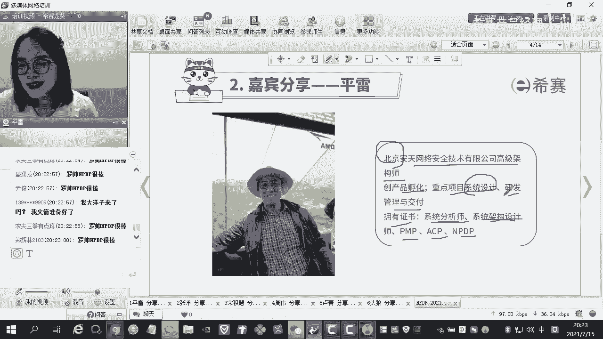
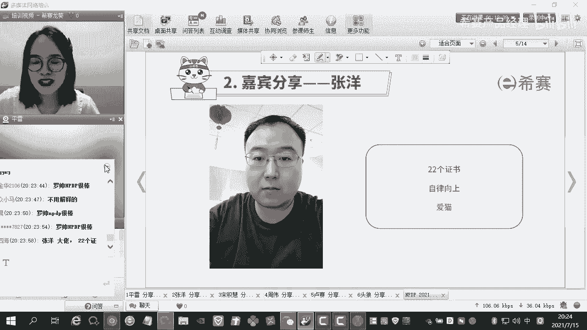
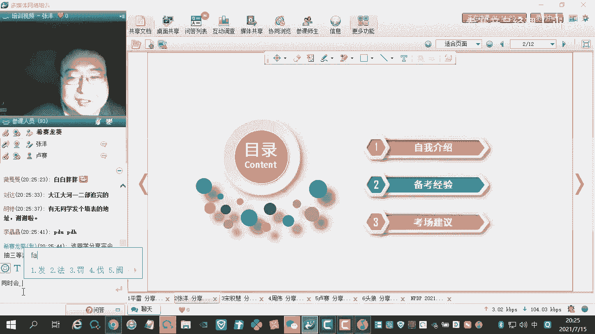
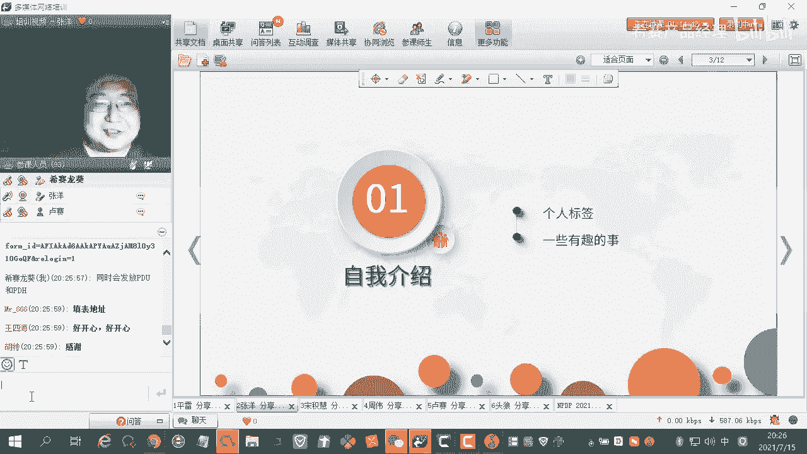
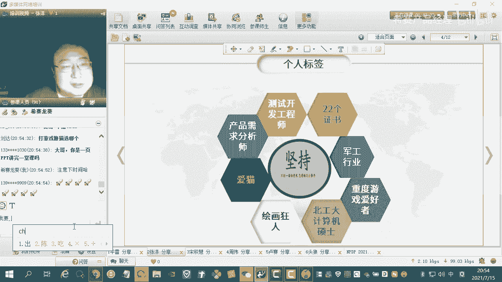
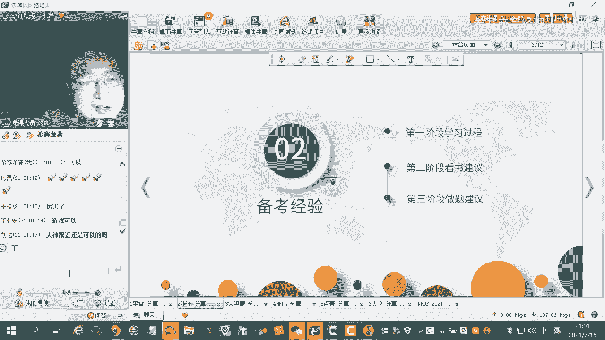
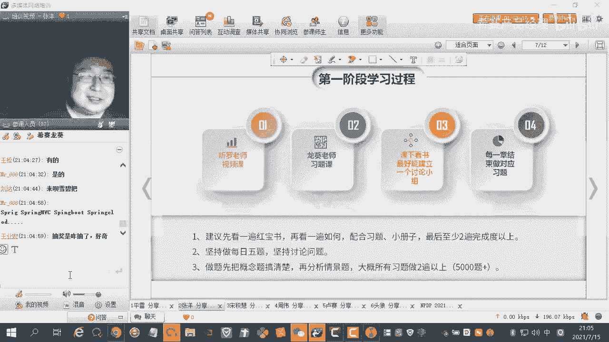
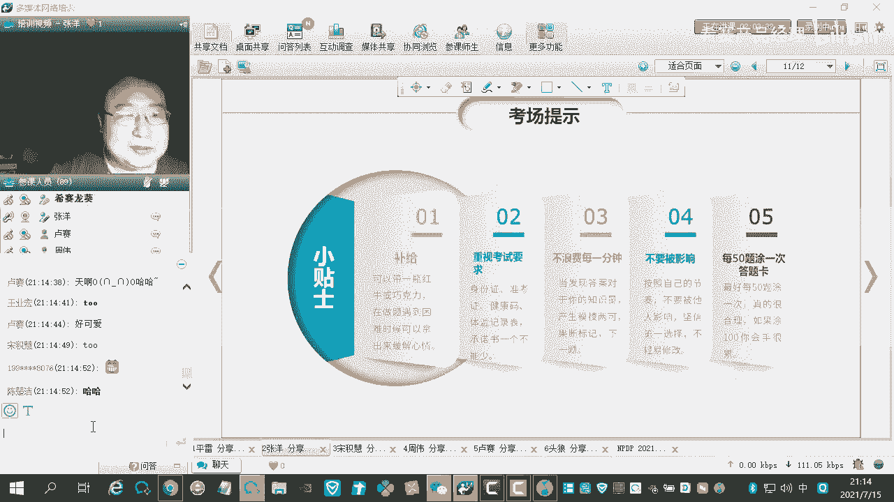
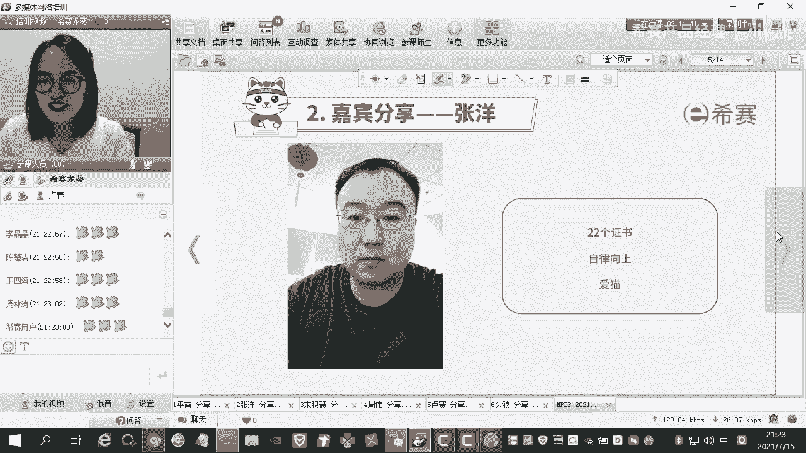

# NPDP2105班优秀学员分享-不仅狂澜走沧海，一拳天与压潮头-张洋 - P1 - 希赛产品经理 - BV1g84y187Vk

后来呢我们有请第二位分享嘉宾啊。

第二位分享嘉宾呢是张扬，张扬的话呢，其实我和他的缘分啊真的是很长一段时间了，我从2019年的下半年遇到他啊，到今年2021年了，差不多有2年的时间了啊，他一直是跟着我的，因为呃他不是其他的原因啊。

因为北京就是2019年过后，然后一直没有开放，然后到今年的5月份才开始去考试啊，对于骄阳的话，其实最开始你可以明显的感觉到什么呢，最开始他问的问题啊，就是属于那种你都不知道怎么样去回答的，那种情况。

到现在就是考出来的分数啊是很不错的，他也是我们这一次np tp，查成绩的一个放哨人啊，就是从他手他的口中就知道a出成绩了，然后我们大家就去查这个成绩啊，好我们话不多说了啊，我们来优掌声来。

欢迎一下我们的张扬同学。

那好那个龙辉老师，那我现在开始我的分享啊，刚才那个平雷哥分享的非常好，刚才那个他他的这个工作经历那个非常的丰富，然后我这边工作经历虽然没有他的丰富，但是我的考证经历确实很丰富。

哈哈那么现在就开始我的这个分享啊，那么我今天分享的主题呢，其实就是这句话，不尽狂澜走沧海，一拳天与压潮头，呃，他是一句古诗，也是我非常喜欢的一句话呃，他也是被引用到大江大河这部电视剧中。

其实他就是说的是呃，我们现在呃这个年轻人，不管是年轻人还是老年人还是青少年啊，所有有志，所有有志青年啊，我们不要畏惧困难，呃，我们要披荆斩棘，劈波斩浪。

置之所趋，不可阻挡啊，好那么我开始往下讲，那么现在呢就是说我有，今天给大家分享三个部分，第一个部分呢是自我介绍呃，第二个部分呢是备考经验。

然后第三部分呢是这个考场的一个建议，嗯先说一下这个自我介绍吧，它是分为两部分，一个是我的一个个人的一个标签，还有一些就是嗯。

我个人认为一些比较有趣的一些呃事情，我这个标签大概可以分为这样几个，所以中间呢我选择的是insistence，也就是坚持嗯，我呢不是一个很聪明的人，也不是一个就是很勇敢的人。

但是我确实给自己的定义是一个很能坚持的人，就是能从开始到最后一直有自己的信念，不同阶段信念可能有所变化，但是大的目标不会变，一直会坚持到最后啊，左边这两个呢是我的两个，左边那两个呢是我的这个一个呃。

个人的一个工作的一个标签，我的工作呢是分为两大部分，一个呢是侧开，就是我在参加刚开始工作的时候，是一个呃测试工程师，然后后来去做了这个测开，然后下边呢是做的这个产品需求分析师，就是主要是分析需求。

还有就是一些交互设计，然后因为就是这两部分呢让我选择了，我去考这个npdp嗯，然后呢就是嗯再说右边那个部分吧，22个证书，这个也是我放到了那个开场白介绍的，这个标签里面啊，就是很多那个同学。

然后伙伴案都对这个22的证书是什么，然后很感兴趣，然后我呢也是就是大概总结了有几大类吧，然后我刚才自己写了一下，然后我跟大家说一下，呃，其实呢我在开始之前呢，就是这22个证书之前呢。

我想跟大家分享一个事情，就是说这个22个证书，其实就是也有很多人问我，包括呃n p d p群，像一些之前考过的p m p群，然后a c p群，还有一些像close to，包括一些软考的一些群。

还有一些朋友都问我说这个22个证书，觉得啊有没有什么诀窍，有没有，因为觉得最重要的是什么，嗯其实我呢也想了很多，我呢就想把这22个证书认为最重要的呢，就归结为是呃两个字啊，这两个字呢就叫做奉献。

奉献什么呢，奉献一切，你觉得应该或者说能够拿出来的时间去学习，或者说是为一件事情为之奋斗，呃因为我们都是一个职场的一个人，所以说学习起来很不容易碎片化的时间，嗯其实是有的啊，除非我们是一些特殊情况。

可能嗯我们没法携带手机，或者说是一些嗯其他的出差比较忙这种情况，所以说如果我们能如，如果我们能够把我们的时间都奉献出来的话，我认为嗯大家应该会考的证书比我要多，嗯好那我现在就来说一下，就是嗯分这几类。

就是首先就是咱们就是n p dp，这这个呃相关的有这个p m p就是这个项目呃，美国的一个pmi下的项目管理的一个证书，然后还有这个a c p就是敏捷开发，然后还有这个prince two呃。

这四个我给定为b类啊，prince two呢可能有的这个同学呢，不是就是说可能不是特别清楚，他是英国的一个项目管理，就是类似于那个p m p，它更是更注重于那个实践，这是第一大类。

然后我这个证书大概四个证书，大概是2年时间吧，就是诶是2年2年半，2年半时间是大概，把这四个证书考下来了，然后呃后面说的证书也是，就是说在这个备考这个的过程中，也是会穿插着考啊。

因为那个咱们国内的那个软考的那个时间，和那个咱们这个pmi和这个pdma的一些呃，考试时间会有冲突，所以说只能有的时候只能择一择一选择啊，然后软考大类的呢是，这个架构师，还有这个架构师。

然后还有这个终极的，有三个，一个是呃测试类的测评时，然后还有一个是信息系统师，然后还有一个是安全方向的，一个安全的一个证书，嗯考这个的话呢，其实嗯上面介绍的这，职业啊职业的发展是相关的密切相关的啊。

因为我是相当于是没没有换过工作，我一直是在咱们所谓的这个一个呃军工，军工行业，一个算是个央央企下的一个，谢谢单位吧，然后然后所以我没有没有朋友工作，没有没有像刚才平雷哥说的呃，那个工。

所以说体制内也完成了各种各样的转型，从测试，然后到这个项目管理，到到这个侧开到这个产品，基本上现在可能除了售后的这块的话，也算是做了一圈吧，然后基本上对这个呃也算是比较了解，嗯然后我接着往下说。

然后还有两个是还有两个是测试类的，这两个，这是考的这个证书，这个证书是一个就是国际认证的，叫i s t u ob，他可能现在认可度越来越高了，可能有的同学没有听说过，它是一个国际的一个测试认证。

我考的是s t u b a l l就是基础级，然后敏基础级的敏捷，然后还有那个s t o b的那个tm就是呃经理级，然后这两个的话是跟我前就是我现在工作的，前一段的工作是密切相关的，然后它不仅是有理论。

还有一些实战，然后这个的话，我觉得刚才介绍的九家21个证书，就是呃咱们就是相当于是我，我个人认为是理论大于实战，就是说如果你们要是去选择这个证书呃，倾向的话，你们可以就是说如果想要这个啊。

理论大于实战比较多的话，是可以从这11个里面呃去选择的，然后前四个呢他们他的那个嗯续费呢并不便宜，然后他大概是要1000块钱左右吧，3年1000块钱左右，然后呃p n n p dp。

我现在还不知道是是是一个什么情况，然后因为这次也刚刚考完嘛，然后然后后面的话软考和这个i s t o p的话，它都是终身制的，就是考完的话，他会啊伴随你到老嗯，然后后边的话那个再往这个分类的话呢。

是一个我比较独特的类，这个类呢是因为我在做这个，因为我之前也写代码，然后写框架，然后后来呢做这个项目管理，然后做这个产品管理，做这个需求分析，交互设计，然后与人与甲方，然后各各方面的协调沟通是越来越多。

然后所以呢我也是给自己定了一个目标，一是给自己定了一个目标，二呢是因为确实因为因为我在北京嘛，20年年初是彻底爆发了，然后所以说这个整个20年呢没证可考，然后怎么办呢，我确实也是当时也是。

就是因为我是一直从151514年备考，然后13年14年就开始备考，但那个时候不成型，考了很多证也没有没有过，然后从114年年底15年开始就各种考证，然后各种过，然后到然后呢。

随20年我就看这个咱们的这个叫中国考试网，还是叫北京考试网，我忘了，然后我看我发现这个教师证是可以考的，是畅通无阻，你只要有这个，你只要你只要有这个呃，呃这个呃这叫什么核酸证明什么的一些呃。

你都可以报考，然后另一部分呢也是希望自己呢能在这个，因为现在有很多时候要去跟甲方，去对接一些东西，然后包括嗯去画一些圆形，然后去做一些这个嗯设计需要跟开发，然后很多的内容去要求交互啊，内容就会很杂很杂。

那怎么能够在最短的时间内去达到，让你听懂我在说什么，其实这个也是当时罗帅讲课的一个点，叫做呃我忘了叫什么，是叫电梯测试还是什么，就是你去搭乘一般电梯，用这个电梯关门到开门的时间。

去给你的上级去汇报一个事情，把你的所有的重点融会贯通，然后我呢其实呢也是在这个过程中，在这个考这个教师证的过程中呢，也是嗯学到了很多东西，然后因为教师，这跟咱们我刚才跟大家介绍这个证书不太一样。

因为它呢是需要你完成笔试，两门笔试以后再去完成面试，这个面试呢是要有20分钟，相当于是你自己的一个展现，所以说它是一个你自己比较主观的一个内容，然后所以说你怎么去备考。

你怎么去怎么去跟老师去展现你最最好的一面，展现出既展现出你的知识，又展现出你下一个老师，又能展现出你能把这个课讲好啊，这就很讲究了，这就很讲究了，跟这就跟之前的那些证书又不一样了。

他们去备考的相当于是备考的另一种新的，又是一种新的思路了，嗯对然后这个呢我我我当时考的学科是语文，然后因为这个语文呢，我是对这个古诗是比较感兴趣，哈哈可能大家看我这个标题能看出来。

我平时喜欢看一些这个古诗类的东西，对这个语文确实也是很感兴趣，而且现在咱们呃中国也确实在提倡叫做大语文，不管是你的啊，中不管是你的中考，高考还有研究生考试，嗯以后你可能以后你可能这个在嗯你的孩子。

或者你有幸再去考研究生，可能就是在你的嗯逻辑，然后包括像物理啊，包括像化学这种理科类的，都会有一些文言文的题，因为现在中国在倡导大语文嘛，弘扬这种大语文的这种精神，嗯然后再往下接着说啊。

然后再往下接着说，是一个呃跟我相当于这个职业相关的一个证书，这个这个证书呢可能有些人没有听过，他是一个安全生产的一个证书，这个安全生产呢主要是类似于咱们的消防证，嗯但是呢这个呢呃这个呢它不是一个嗯。

他在他可能只是在咱们军工类里边，是就是比较嗯比较知道这个证，它主要是像呃防火消防防防雷接地，然后还有一些综合布线，然后等等等等，这些就是说它是一个呃整体的一个，就是安全生产架构的这么一个嗯内容。

然后这些这些呢是跟我们的这些呃，日常的工作呢也是息息相关吧，然后我再往下说啊，再往下说是嗯，这个类呢是咱们就是基本上作为it人士，基本上比较呃比较常用的，就是嗯也也是我考的比较早的。

就是一个是office办公办公自动化一个证书，这个呢当时是因为这个单位确实需要需要，这个就是office相关的这个证书，然后他当时应该是考到的是嗯，你的word excel ppt。

vistal project，然后还有一些像one note，然后就是microsoft那一类的，然后每一期都会考一些，然后就是怎么说呢，这个证书就是你你如果说你就是问一个人说，你会用word吗。

也可能觉得你这个你好奇怪，我怎么会不会用word，你会用excel吗，当然我也会用excel，但是里边还有这个，当时学这个的时候，像一些红的设计，然后像一些里边excel的一些excel里面的一些。

包括他可能到高阶的一些算法，它都会考到就是一些一些类别吧，反正这个东西也算是一个那个跟职业发展嗯，嗯比较强相关的一个证书，然后我觉得嗯当时考完以后也觉得挺有用的，毕竟现在玩这个玩这个。

因为我用excel表格玩的还比较溜，然后然后如果要是大家有什么问题的话，那个也可以也可以来问我，私信我都ok，然后那个然后后边的这个证书，是那个数据库类的，因为作为那个产品经理。

然后包括以前做这个测开都是需要数据库，然后他是主要是用的是两个证书，我一个是考的是这个咱们的那个啊，嗯就是这个sql server，当时是考的sql server，2005考的比较早。

那个时候还没有太往后太升级，然后另外后边考的是一个那个叫做oracle oracle的证书，oracle啊，这两个证书不是一起考的，这张证书是先有嗯sol server后考的oracle嗯。

oracle的难度比这个sso难度要难，上一级，就是从备考时间上，还有从这个整个的这个你去做题就能感受到，然后这块的话我觉得是产品经理，我也非常建议考一个证书，因为产品经理你要是后边去做这些数据相关的。

像一些数据挖掘啊，像一些那个数据分析啊，你除了就是嗯懂像一些这个ex筹磨刀啊，这些这些交通工具以外，你这些呃像像这些呃sql server，oracle的一些就是数据库，你要玩的六的话。

你也会哎感觉高人一等，别人也会觉得你高人一等，因为你毕竟要做数据挖掘吗，会写一些像我就会写一些数据嗯，挖数据挖掘的一些脚本，平时就会做一些数据，那个数据挖掘的一些事情嘛，嗯然后这是这两个证书。

然后后面两个证书呢，是就是相当于基本上是叫嗯代码类的代码类的，一个是阿里云的哈豆腐就是大数据的哈，豆腐是在阿里云那边考的，然后当时学这个的原因，就是因为这个哈登不是特别适腥，然后想学一个。

因为我们相关的类别的这个项目，也有很多用到这个hdp的技术，所以说当时学这一个也没有什么坏处，我觉得大家要是跟这个有关系的话，然后可以学一学，能学到不少干货啊，这个东西有理论，但是干货更多嗯。

它是一些操作实践，然后还有一些就是你日常的一些应用，它会告诉你你怎么去在大项目的，在大数据的项目中去应用，然后怎么去做好你的这个大呃，这个项目中你的角色嗯，然后后边这个呢是一个，我考的比较早的一个证书。

当时还是测开的，当时是在那个别的一个，就是一个就是在机构吧去学的一个侧开，当时就是一个嗯两个方向啊，两个代码方向，一个是python方向，一个是那个java方向的，python主要是做的那个。

因为咱们现在就说，现在咱们那个群里面有很多那个做做开发了，我我我我就我就不露怯了，就是就是做那个python的那个python的那个脚本，它主要是做那个python的那个自动化。

然后java方向的主要是接口，主要是接呃接口性能，然后这块的话一些一些内容，因为侧开还是当时现在一级是比较火的，这个这个方向这个东西嗯，你要是说纯测试不太会代码的话，这个不也不太嗯不太行啊。

对是是都是都用到的，是都用到了，那个当时这些就是我说的这两个证书和豆腐和，这个的话，我我我就是每周末去去他那学嘛，然后学完就用到，学完就能用到，而且好多，而且好多实际中的这个这个，这个这个项目中的问题。

我都直接去问老师了，这个嗯那大家有问题，可以直接就在那个公屏上问我，我我我我那个看到可以，那个大家随时打断我都可以，那个直接就回答你们，因为大家可能对这个都那个比较感兴趣，嗯然后那个这是这两个证书嗯。

然后那个然后还有后边三个证书呢，是我的一个兴趣爱好，就是嗯喜欢美术，当当初这个嗯那个高考的时候，其实想想报美术就是传媒嘛，想报中传，但是觉得那个竞争压力太激烈了，我说算就算算了吧，还是还是选择那个。

当然想选金融和计算机，然后反正这两个我最后选的是计算机嗯，但是我这个绘画呢是这个可真是从，大概我大概从五岁五岁吧，现在30 30出头了，一直在画，一直在画，一直在画，然后这个考这个证呢也就是三个。

第一个是色彩油画的一个八级，没到九级，九级可以当老师了，我当时还差一级嗯，然后这边然后是素描，就是一种写生的，一个是嗯也是一个八级，然后还有一个是这个就是中国的一个水墨画。

这个也是一个八级都唉都没有考到这个九级，那个当时因为是涉及到一个嗯，就是也是涉及到一个考学吧，也是涉及到一个其他的一些嗯压力，所以说就没再往上考，其实这个画画还是挺陶冶情操了，然后对我。

我现在是真的觉得对这个产品经理太有帮助了，就是你去你就不说别的，你你就不说画画，这个画了个画怎么样，你画的怎么样，你你这个整个人家做一个圆形冷暖色调，然后圆形的这个布局你就大概能看出来。

就是至少在甲方甲方那不会给你拍桌子，就是就是你你只要摸准他的脾气哦，你要他喜欢这个色调，配这个色调唉就就就大概就知道了，这大概就知道了，然后然后然后再这么去做就行了，然后所以说所以说这个确实。

我觉得如果有兴趣的话，可以去画一画，但是这个东西是一个长期的一个过程，你说你上来就直接去考八级，也不太可能，因为他一级级往上考的，所以说他需要你的一个基点，需要你的一个嗯人的一个成熟的一个过程。

嗯然后最后一个是一个那个普通话的一个证书，这是第22个证书，是普通话的证书，嗯是这个证书，其实我觉得就是考不考呢，就是你说我不会说大家会说普通话吧，其实其实也没有，但是这个是那个呃语文这个教师社群协和。

强相关的啊，强那个应该叫强相关的一个啊证书啊，高耦合的一个，就是说他必须有这个嗯普通话的证书，你才能去做这个评定，不然的话嗯你是做不了这个绑定的，这个是我的一个22个证书。

然后呢我就想再就是总结一下这一块呢，是那个是什么呢，就是说我认为就是说考这个证啊，最重要的就是我啊中间写的这个呃字叫做坚持，就是说你不管做什么事情，考证也好，你去做项目也好啊，你去谈恋爱也好。

你是去健身锻炼也好，就像我自己的第二个标签一样，一定要嗯自律向上，就是你要是自律的话，就基本上没有什么困难，如果你要是积极向上的话，你就只有你的你的这个最大的障碍，就只有是你自己，然后其实这个也是。

这个也是我就是一个这个嗯两个偶像嘛，体体育界两个偶像，36岁，两个36岁老男人，一个是足球界的c罗，然后还有一个是篮球界的詹姆斯，36岁都是同岁，马上都要37，但是属于那种自律到可怕，自律到极致。

你现在去看，因为现在男生可能看那个体育界，篮球，nba或者是足球的话，你你去看看，你说呵呵，你说c罗和詹姆斯基本上是标杆，基本上就是篮球鞋和足球鞋的标杆，自律到自律到极致，他们除了健身以外。

就是就是严格的自律，不吃不吃猪肉，然后就是吃那些就是非常健康的食品，然后还有就是每天的锻炼，还有读书，然后构成了他们就是每天的这样一个生活，所以说他们才能现在像他们一样，就是成就很大。

拿拿奖那个拿奖拿到手软，这不就是说这不就是说什么，为什么说那个那个别人就说你要再跑，我就疯了，就是就是这样一句话嗯，然后呢这个备考的一个过程就是不仅是nb dp，然后我想也是说这22个证书备考的过程。

然后基本上类似的我想跟大家说一下，就是说在开始准备阶段，就是你再去嗯摸索，去去探索，这个阶段呢就是嗯比较艰难，确实比较艰难，我也认为特别艰难，特别特别艰难，特别是特别是你探索以后，你发现哦我要去考这个。

然后你开始去学，那那那前两周前三中那简直太简单了，但是我呢就是怎么怎么做呢，我分享一个我的经验，就是我就是不干别的，我也不去，我也不去那个看电视，我也不去打游戏，我也不去做别的。

我就是哪怕我我用20分钟，每天就是我下班回家以后没有有时间，我用20分钟去看两页书，我也认了，我认了我20分钟我就做这件事情，然后逐渐的你就会发现你会喜欢上这件事，你会爱上这件事，人家不是说嘛。

有的人有了兴趣以后，你就无敌了，兴趣是你最强的自驱力，就是自组织团队吗，你是你是你，你最大的一个自驱力，就是相当于是前面那段时间你熬过了以后，你就是大神，然后出来以后你别人都不用叫你去学习了。

你就会自己去学习，别人再叫你去出去玩，去什么什么，哎咱们一块开个黑吧啊，没时间没时间，就就是就是这种，就是这种这这种这种一个呃情况，然后呢嗯后边呢我想跟大家分享的一个呢，就是说它是一个那个这个考证呢。

也是一个惯性的一个过程，就是说呢你可能刚开始觉得，就是比如咱们这次吧，咱们2105届考过了n p t p以后，然后我们再去就是可能会去考别的这个证书，然后你考的证书越多，它像一个是呃。

呃这这这这个滚滚雪球一样的过程，越滚越多，越滚越大，然后到最后你就会发现这个嗯，考试就是你生活的一部分，你要是真的没有说工作忙到一定程度了，你肯定会选择提升自己，毕竟这个比你去，我就说我吧。

就比比你去打游戏，嗯嗯比你去打游戏要来的实在，因为打游戏毕竟你像你像撸撸啊撸，或者是这个英雄联盟，就就那么几个人，就那么几个战队呃，虽然替补也就那么几个人，你天梯你这个得打到多少分。

你才能才能跟他们一块比呢，我觉得我觉得考这对你的提升，肯定还要比那个大，嗯然后后边呢是嗯啊对，然后后边还有一个最想跟大家分享的，就是说那个就是说在考证这个过程中，这个就其实我我我我的习惯就是我的我习惯。

就是因为w有什么这个普通群冲刺群，我这个习惯呢就是带有一个自己的小群，这个小裙子，可能可能龙葵老师都不不太不太知道，这个小裙子是就是我们自己自自组的一个小群，这个小裙子是呃。

完全就是当时我就在群里头发问题，因为就像龙葵老师说，我我开始时我不知道v dp是什么，我问的问题很傻也很傻耶，也也不知道，也不知道我我我有时候问的那个问题，我都不知道应该怎么去怎么去说，怎么去问。

因为我都不知道我想知道是什么，然后慢慢的你就会发现，就是你问的问题越来越精，然后在群众问了以后呢，诶，然后然后就会发现，这个群里有很多大神愿意帮你解答，然后呢我我呢就是我呢就是对那个呃做到的。

就是说后边的就一个大神给我解答，就把他诶拉到一个群里了，诶拉到一个群里，慢慢慢慢的我们这就成了一个大大的一个群嘛，然后这个群呢其实不做别的，就是在n p t p这块呢，就是每天的去嗯刷题备考题。

知识点不会的问题，大家一块解答错题集，然后包括呃呃然后包括就是你刷了多少道题，还剩多少道题，还剩多少道错题，然后看每天每天早上可能不到六点，有的时候就然后就开始，群里头就开始这个有这个做题的声音。

然后一直到晚上可能杀人一点都没有结束，嗯这个我觉得其实挺好的，嗯我我其实也想给大家分享，就是说因为这一届肯定会有大神的，你相信一定会有大神的，你你一定要和他们做朋友，你一定你一定要抱住他们的大腿。

你你会你会享受到哎起飞的感觉吧，然后这一块呢，我是那个要特别感谢一下那个那个王松松松，那神就是呃就是因为我后边有很多这个问题，后面很多问题都麻烦的，人家我后来都不好意思了。

然后这块的话去人家过去解答去讲啊，很认真很负责，嗯然后咱们再来看一下其他的几个标签吧，然后我是一个就是爱猫的一个人，然后还有就是我是一个重度的游戏爱好者，嗯这两个呢就是我就是特别喜欢猫，就是。

那就是我特别喜欢打游戏，但是呢嗯现在没有时间打，最近这几年其实都没有时间打，我可能也就一个星期会开一次机器，然后就就把机器关了，然后那个呃然然后就是想说的，就是我都已经花钱买游戏了。

为什么还要花时间去打游戏呢，我听一听这个也挺有道理的啊，嗯然后下边呢就是我是一个那个呃呃绘画同人，喜欢画画啊，真的很喜欢画，然后后边就是一个是嗯，我是北工大毕业的一个计算机的一个嗯硕士嗯。

也是算是对口的专业，去了对口的行业吧，然后这个照片啊，这个照片呢是一些我有趣的一些事情，然后这些事情呢是先看中间，这个是那个我的一个证书的情况，底下还压了很多啊，我我没法我没说第22也没法都弄出来。

然后还有一些是电子的，就像n p t p，就这些电子还没有发纸质版的，然后所以说那个嗯就这个还没有到，只只有电子版的，然后还有然后我还有两个证书找不到，还有我两个证书找不到。

我星期日上周日的时候去整理的这些证书，然后还发现我我没想到，整理还发现有两个找不到，可能做的太多，也不知道扔到哪儿了，嗯然后这个是我大概这个情况，然后左边呢是我的那个一部分书。

我是最后最后这块用书用楷书替代了打游戏，然后去替代了别的，所以说我基本上那个写字台，还有这个左右两端嘛，基本都被都是输，就一起，基本一进我这屋子，你就会发现被书淹没，然后然后咱们再来看那个这个吧。

再来看这两边的吧，这边是我的两只猫，我本来原来有五只猫，有五只猫，然后给人了三只，然后还剩两只，然后这个是英短，是叫小虎，然后这个是他的儿子叫小黑，是英短和嗯和什么和那个美国汤姆猫加菲啊，一块一块生的。

然后这个现在就这两只猫非常粘人，非常可爱，然后我现在讲的过程中嗯，这只这个小虎就在我旁边趴着，我可以一边一边讲一边一边撸猫，嗯然后再来说这个吧，这个我也觉得是很关键的一个内容，这个是我也想给大家分享的。

呃，我的这个整个备考过程呢，过程中呢主要是就是这三个资料，一个是如何这本书，一个是呃小红书，还有一个是这个打印版的啊，这个小册子和那个嗯那个叫什么那个知呃，那个名词解释啊，然后这个呢我也买小橘书。

但是我没有时间去看了，这个呢是呃怎么说呢，就是说那个有这几本书呢，嗯就够了，嗯然后呢就是说大家可以看一下，就是说那个去去你猜去读这个书的时候，就是说你可以画一些像这个重点，就是就像我这本如何的书。

就是拿绿的标的，然后就是一写小学后边还有些题，就是这些题都很经典，就是经典，您可以先您可以先粗略看这红包，用你去记忆，然后你可以在里边那个全球画画，然后去做做这个相关的一个题啊。

然后呢后边呢就是想跟大家说的是这本书啊，大概呢嗯大概呢我是啊这本书在哪里买的是吗，这本书是在呃这这本书我是那个找呃，找一个同学，他直接给我邮过来了，然后我也没花钱，就付点邮费，一共呢是看了五遍。

一共看了五遍，然后就是这些标签呢，是在第四遍和第五遍的时候去去做的，嗯然后这些标签呢就是说会一些是重点，就是说你会非常快速的能够，找到你想要的那个知识点，然后其实也也建议，当然大家有更好的方法。

也可以用更好的方法，但这种方法呢是特别适合a最后还有十天，还有两周这种备考的，因为你再去找那些东西去，会去很会很会花一点时间，然后很会花你的精力，嗯然后这个里边呢就是一些，然后然后这个里边呢是一些那个。

就是嗯就是一些记的一些笔记，然后这些笔记呢是啊，根据啊龙葵老师的和龙葵老师的习题课的，那个呃讲的重点，然后还有一些是家业，家业呢，就是说那个嗯书书上记不下了一些重点，然后还有一些如何让的重点。

然后还有一些错题，然后我呢是后边会讲到，就是说嗯我认为呢就是说你刚那读书的时候，是肯定是会这本书呢会越读越厚，因为你不知道的东西会越来越多，然后知识点，知识点那个就是那个会串起来会越来越多。

然后后边呢你会把这个书读薄，这些所有的知识点，我是把这个如何的一本书，还有小册子，还有一些其他的这些相关内容，都呃都那个都写到了这本书上，所以说我基本上后期只要看小册子和这本书，就行了。

嗯然后嗯再来看一下下边这个图，这个是一个我画的一个程序，先拿铅笔画了，后拿那个色彩上的色，大概画了一周多吧，你们画了，反正只能算是神似吧，毕竟不太专业，然后这个这个是我的一个就计算机类的书。

这些呢都多多少少有看过，然后平时工作还要学习呢，都会去看他，然后这个呢是我的一个工作的一个情况啊，左边是一个那个看效果的，右边那个就是一个标准的满足，左边做交互设计，做产品原型，如果需要写代码了。

右边直接开启，然后说明双屏撸开袖子，加油干，希娜说的这个话，然后最后这张图呢，就是刚才我给大家分享的这个重度的，重度的游戏爱好者，这是我的一个游戏角，各种游戏机，我我我算了，我那天算了算。

我可能大概买的飞机也不比我证书少，但是现在到现在也没时间玩，一个星期开一次机会，也就是这种这种情况吧，嗯继续往后啊，然后这个是我第二个阶段一个呃备考经验。

然后刚才呢跟大家呢已经多多少少的说过一些，然后这个备考经验呢这块呢主要是四个部分，第一部分我建议大家就是980视频先看一遍，那个都是干货没有，就是探讨那个情景题，或者说我们生活中。

就是就是这个遇到的一些其他的内容，呃，然后呢，再看那个我我的是加入的是那个藏锋腾峰版，我现在有点记不住了，反正腾版首播我想都看，但是我那个是看的那个罗老师的那个视频的，那个直播的那个课。

然后主要看的是呃，我因为我每次直播都会看，从3月份之后之前在忙别的事情，3月份之后再去看，然后我就看到那个龙葵老师这个习题课，就是每一次也没落，就是龙葵老师习题课讲的真的非常好。

就是我我就是强烈建议大家去看，那个都是都是干货，对对这个媳妇是特别特别特别有帮助，然后我这边参与的方式呢，就是我个人的呢是一个一个截图的一个方式，就是说因为我可能没有时间再去嗯，再去看二遍了。

所以说很多重点呢我要去从截图中，我去要把它呢就是记下来，然后一些呃这些重点没有在这两本书上，刚才说的两本书没有的，就把它抄到这本书上全抄上，然后最后呢你就拿这一本书去看，你就无敌了，然后呢。

然后呢这个是还得这个呃，罗老师的课呢是答应能带入这个情景中，让你去思考，龙辉老师的课呢，就是这个能让你把这个具体的这个知识点呢，去吃透，就是你要去相互相辅相成的去听啊，效果是非常好的。

然后这个嗯然后第三一点呢，就是刚才我说的，最好能你们能成为一个学习小组，这个呢是你们最好是自主自组织的，就是你自己去看谁跟你同源，谁跟你有眼缘，其实我我我我刚才我刚才去拿的时候。

也不知道是是是大家都有什么技能，就是就是我我都不知道有什么技能，就是就是我只是说大家就说有回答我问题的，我就把他拉到这个群里头，然后就是去那个去一起讨论嘛，然后这个然后这块呢。

就是说其实我呢在这个群里呢主要那个作用呢，就是说我作为一个那个信息处理者，就是他们讲到我说吧，因为因为到后期有很多很多资料，你是需要去处理的，因为资料越来越多，不管是题知识点。

还有一些呃别人分享的东西越来越多，这个时候就需要有一个人去把它整理起来，我呢就去把它整理起来，叫做np p p全家桶这么一个东西不断的去更新，每次你需要的什么东西就在这个群里头啊，直接找这个链接。

直接去拿，要什么都是最新的都去拿，这样会节省比较大的一个时间，然后就会节省一个比较大的一个精力，然后那个嗯，然后那个就是再说一下，这个我们这个嗯小这个呃呃小小的这个群，小的这个群呢。

其实就是那个我们也是讨论习题和知识点，然后每章节结束以后呢，大家也要做这个相应的习题，就是对应完这个支点以后去做这个习题，然后就是趁热打铁，然后这样是最好的，然后呢底下呢还有三条建议，你就多难。

你你就跟你就把它当成看英文也行，确实我个人觉得确实不太容易懂，实话实话实说，我读了两遍都没读到，可能我也比较笨，我读第三遍的时候才大概明白了是什么，就像那个王聪大臣说的那个第六章还写了嗯，写写写写的。

反正是需要大家去更多的去理解的，所以说第六章，我强烈建议大家直接去看龙葵老师的那个。

呃视频，就是或者是他的这个ppt啊，这样会比较谨慎的时间，比较方便大家去理解啊，然后就是这个过程中呢要配合那个习题，然后最后呢是去做这个小册子，然后大概呢这个整个这个过程呢，我觉得就是说如果想考过的话。

不追求高分，至少要两遍以上嗯，然后这个小册子呢，其实那个最后龙葵老师也发给大家，然后这个也是一个非常好的东西，然后是知识点的一个总结是非常好的，然后每日五题，可能五到现在就是新的那个群里。

都是不是已经开始了，然后这个要坚持做，坚持去讨论啊，对你们这个后边做题是很有意义的，然后最好能把它记下来，就是整理成一个错题的一个本啊，错题一个集，或者说是把它截图，一个一个都截下来。

然后到最后你去看那页纸，看那个呃电子那个文档就行了，你你会觉得特别爽，因为以前那些我不知道，现在我全都知道，而且我不用再去一找他了，全都一目了，然嗯然后第三一点呢。

就是我建议大家先把这个这个概念提前搞清楚，然后再去分析情景题，因为概念题是情景题的一个前提啊，我觉得不太可本末倒置，就是情景题，你可以先就是说遇到做，但是你不用去纠结啊，他是什么答案，你去选错了啊。

记住答案后边你会根据这个章节的慢慢去理解，越来越明白那个这个是是什么意思，然后什么内容，然后我大概是做完每个呢每每每个上模拟必做，还有章节知识点这些我大概都做了，然后每个大概都做了三遍吧。

然后大概我现我当时的题库呢是大概是有5000，加5000多，到不到6000道，就是做题量，然后我的错题呢是大概最后到考前，在在在赶路的那个地铁上刷到还剩还剩13道，我就没再刷了，嗯大概是这样。

然后这边就强烈建议大家，一起去一起去嗯，去搞这个，如果光考知识点不做习题，光做习题就不不搞知识点的话，我觉得都不太可取，而且这个系赛的题那个质量非常高，相当高啊哈哈大家大家懂得都懂。

然后然后那个然后那个呃，后边的这个说是那个那个第二阶段的一个，看书的一个建议，然后这边呢我就呃快速跟大家说一下啊，就是这块的话就是说第二阶段呢，大家就是有一个梗概，就是要把书看薄，你要融会贯通。

总结出来就是哪些是相关联的点，这些相关的点就会帮助你去大后期，大大大量的去节省我们的时间，然后呢就是形成思维导图，把重点的区域给它呃，形成那个思维导图，就像罗帅和咱们呃龙卷画的这个思维导图。

对你非常非常有帮助啊，然后呢在这个大群和小群呢，就自己建的群，还有这个冲刺群，不管什么学习群，冲群一定要积极跟人讨论，就是别人比如说发现一个问题，然后你可能会了，哎你会了呢，然后你也你也去说一说。

就是说呃就是就是说你就加深一点记忆嘛，因为毕竟你去给人家讲的，就是你毕竟你去给那些讲这个知识点，从你嘴里头去讲，讲出来的和你接收到的是绝对不一样的，我跟大家讲，你可以你们可以自己去体验一下。

是绝对绝对不一样的，然后后边呢就是说反复梳理，然后形成你的这个备忘录，然后或者是错题集，就是我当时那是行政备忘录，把错题的都记下来，然后呢到时候第二遍再去看我哪些是做错了。

这样呢就会大量节省你做题的一个时间，而且会提升你做题的一个正确率，然后最后一个呢就是要把那个做题呢，是深化记忆，搞清楚哪些题你为什么错，然后坚强烈建议大家在考前的时候。

还有一两天的时候把你们的错题机都清空，嗯这个是这样的嗯，然后呢第三阶段的这个做题的一个建议呢，就是说这个是每日五题要做，然后章节模拟题要做，然后必做要做，然后必做练习题要做，然后特别是这个必做啊。

就是当时大概是有几套是有六套，还有七套，我具体有点忘了，可能时间有点长，一个多月了，我有点忘了，然后这个b座质量非常高，真的是相当的高，我建议你们先去做模拟和知识点。

然后逐步的把这个b做一个一个的去把它呃，就是就就是呃b做，就把它一个一个的往下罗列的去去做，然后这样的话对你的这个整体的一个呃，做题200道，因为毕竟是200道题嘛。

你做题整体的是会有一个整体上的一个提高，你会提分提的非常快，然后就是这个这个b座和咱们这个情景章节题，的一个最大的一个不同的，就是说那个咱们必做这个题啊，它是有那个什么情景题会特别多。

但是我们这个2105呢，就是说可能就考完了以后，也是跟这个龙将去去交互一下，这个事确实这个概念题不少，然后那个确实可能我们也是感觉比较，比较幸运吧，但是也有情景题，也有情景题的。

然后所以说就是说这个情景题，一定要要一定要练好啊，然后建议大家这个b做要做三遍以上，大家就是从头到尾要做三遍以上，强烈强烈建议，然后呃另外的话呢就是说做这个记录，统计自己的错题，马虎的知识的模棱两可的。

就相当于模棱两可的，一定要统计，因为光良可能是你最容易落的，然后就是那个就是那个当时那个王松还说过，我王松还说过，我那个截那个图，我是最后那个截那个图是13道，还剩13道错题。

但是我收藏的题将近有小1000道，大概是960多道啊，就是说我是一个收藏家，就是因为我觉得这些题都非常的好，但是我当时呢就是呃只看了一半，没有把这些都看完，因为都看完的话，时间确实也不够了。

如果大家现在备考的话，你们的时间是绰绰有余的啊，绝对能把你们的食堂的题再看一遍啊，特别是那些模两可的题，你会发现有的时候考试的时候的那个点，那个痛点就是你模棱两可的那道题，真的我深有体会。

嗯然后就是前期呢就是大家不要着急去做题，黑想看书啊，书看完了再去做题，看完那一章节再去做一下这些题，看完整个所有章节再去租做这个必做卷，我觉得这样是比较好的，盲目做题呢一定我觉得会事半事半功倍。

就是我不排除有那种特别厉害的大神，就是说呃这个刷题刷到这种这种程度，炉火纯青也可能能过，但是我没我没敢尝试啊，这个我这个我不知道，我只是把我的经验分享给大家，嗯咱们再往后看啊。

然后就是考场的几个小的一个提示，然后第一点呢就是说那个一个补给，就是你要饿了，可以带块巧克力，可可以喝这个红牛嗯，然后就是说考试呢要那个重视，然后那个嗯另外呢就是说那个嗯像那个身份证，健康码。

然后这些呢这些呢都要准备好提前的，然后承诺书这些都要准备好，因为当时我在看准备的时候，就有一个人忘打承诺书，那招的烧鸡也挺天使的，满头大汗，确实确实就是很很难受，相当难受，你知道吗。

然后就是不浪费每一分钟，就是说你在我我，我强烈建议大家这个不浪费每一分钟，就是说你去吃两部分，一部分你做的时候你要不会了，你直接圈起来，然后直接往下去看，200道题还挺多的。

然后这个时间你经过西塞给大家，兴过罗帅和龙龙江的这个培训，和你的同学去嗯，这个讨论你是绝对是能够在时间内，你能我觉得你这个时间是够是够，你答400 400道题的，然后是你就是说这个不要浪费时间圈起来。

然后答完了以后再看，然后不建议大家改答案，第一次就就就是第一印象，如果除非你就是像我当时是嗯，看的时候大概圈了有20多道，然后有五道我改了他，然后我最后去下来以后，我就确信的是有四道是肯定对的。

有一道我不太确定，然后就这种的，你再改，你要不确定的，你就别改了，你你第一印象选的是哪个，你就随他去吧，我觉得你们都能过好，然后那个还有一个第四点就是不要被影响，就肯定会有这个肯定会有提前交卷的。

就是你不要被他们影响，你该打你的打你的，你也不要说这个哎呀，我要催我要催了别人的信心，我要我要第一个去交卷，我觉得没意义，因为这个这个考试只有pass和fail，然后你你说你你再检查一遍。

你大哥180分，拿这个1000块钱难道不香吗，多香啊，然后最后这个这个事呢是那个就是说每50道，每50题涂一次答题卡，这个呢是咱们就是说老师给咱们的建议啊，我说一下我个人的经验吧。

我个人的经验呢是我我200道题一口气做完的，我为什么200道题一口气做完，因为因为我因为我在之前准备了很多，背了很多东西，我泡泡，我怕我脱完那58 50套大题卡以后，我把知识点给忘了。

然后我就然后我就把200道题一下，全都给做完了以后再一下图个大吉卡，然后我跟大家分享一下200道题图，打击感的感觉很累，真的很累，但是至少就这样，就对我个人来说，我觉得是可以，就说你们也是分情况。

然后就是50题一图，80题一图啊。

这些都可以，我觉得这些问题都不大，就看你个人情况吧，嗯然后然后这个是到最后一页ppt了，然后然后还有还有还有一点内容呢，最后再请给我这个3~4分钟时间吧，然后就是说那个我我再再说一下。

就是说这个整个这个过程啊，就就是不好意思啊，我刚看时间说的这么晚了，都不好意思，后边那个通讯了，那个说的这么晚，那个那个是这样的，我是那个呃呃3月份才开始备考，因为前面有事情没有去做这个事。

然后呢我是相当于教师的教师的面试，然后还要评个高工，然后需要去发一篇核心期刊的论文，然后还有个p p是都要在5月完成，一个是5月16，一个5月29，一个5月31，相当于整个5月就是魔鬼月。

然后我相信就是说可能跟我这种有类似，但是我相信要比我忙的肯定也是个别墅了，我相信我，因为我刚开始说的，我也不是特别聪明，也不是特别敏感，就特别能坚持，就是一个平凡的人，我相信我都能过，你们肯定也都能过。

这个主要的就在于你能不能坚持，你能不能这个持之以恒，有这种信心，有这种就是奉献，这种奉献的这种精神，然后嗯然后呢最后呢，然后呢我还要就是想说一下呢，就是说因为我们就是我们的这个是一个团队。

就是我刚才说到这个小群是一个团队，这个团队呢我当时真的没想到有这么理想，我知道有几个大神，但我没想到大神这么多这么厉害，我真的不是说是做了个什么算法，让王松老说，我说你做了一个算法。

把那个把这个漂亮的美女都给选进来了，然后我说说不是不是这个这个都没有，然后那个然后是这样，就是那个就是像王松的，像在我们群里面，就是一个那个神一样的这个这个队友，就指引我们前进。

然后呢就是在这边呢就是说帮那所有人呢，不止我的就不厌其烦的解答，然后我们通过感觉呢就是说就解答的非常好，非常详细，这在这在这里呢也是再次感谢这个王聪，王聪大神，他可能明天啊对他应该明天就讲。

你们可以听听，他讲的确实是大神啊，然后后边呢是四海四海呢，就是那个王四海，四海兄，就是ip的专家，西塞都已经有他的i p的专门的精讲了，太厉害了太太太厉害了，真的，然后我觉得其实他也是一个实战派的代表。

但因为这个广州的疫情呢，因为没法办法考试，但是四海不要气馁，一后面的180在100，后面的180，那个180分在等着你，然后呢就是说这个，然后就是说那个上奎，然后那个山葵就是我们都叫这个单总单总单总。

外企大高管，外外企大高管也是实战派，号称人肉图书馆，移动的图书馆，什么什么那个图书分享，什么模板都有，然后就是应有尽有，非常厉害，然后后边呢还有就是我们群里边的那个呃，小狮子，就是是在这个一个金融行业。

就做这个后期我去问他好多这个那个计算的题，我做的又快又好，就做的非常，而且做的特别对，跟我过去讲，这个也是我觉得小狮子可能跟我一样，也是在这个过程中飞猛进，也是从原来这个呃说这个龙头说他是比较纠结。

到后来都不纠结，然后还有这个就是，然后还有就是这个文松那个啊，不是文峰那个文峰兄，就是那个顾文峰那个他也是在广州没有考成，就是他跟我们最后介绍最后一课，另外一个群里，因为广州没有考生。

但是他在介绍最后一课到考场考试之前，都跟我们去去讨论这个题，就是我觉得真的是中国好队友，这个也是这个也是没谁了，确实确实厉害，然后还有就是这个彬彬，那个在我们这个代号是个s，然后也是那个活力无限。

就是跟我一块讨论题，你也是热火朝天，然后还有这个似水流年，你跟我一样m，然后也是特别的可爱的，一个特别特别可爱的一个人，这个对题也是非常那个认真，然后后边呢是还有这个陈诚，他应该也是明天分享的。

然后他呢也是特别优秀的一小伙，大厂工作，然后我们俩也是一起讨论题，然后也是一起下边讨论工作，特别特别特别好的一个小伙子，然后还有这个我可能不太知道名字，我不知道人家真名，就是后边像那个呃梅子啊。

小明好听记，如南宫女二陈田幸，几位美女，她们做这个笔记，像女生嘛，做笔记都做的非常好的，做的爱错题呢收集的就是非常的嗯非常的到位，然后那个非常的认真，也是可可爱爱，然后还有其他的一些人。

就是也不知道参没参加考试，然后像那个大使啊，然后richard的这个帷幕，pandas半杯咖啡，波妞可能也是参加考试了，但是可能是后期加的我就不太熟，然后我觉得也是一块讨论也是非常好。

然后那个这边呢最后呢跟大家再说一下，就是我们是29号考的试，然后但是呢就是27号，28号应该是最关键的两天，然后就是就相当于是这个27号晚上七点半，然后就因为我问题太多了，然后王崧就说帮我去梳理一下。

有问我有没有时间，我说有时间有时间，然后我们群里的人都来参加，我们开了个腾讯会议，从七点半开到28号凌晨一点多，王松一直在讲，讲，大概六个小时，中间也没休息，我觉得我觉得特别佩服。

就那那一次就那一次就那一次，那个就是嗯我们所有群就刚才跟你说的，所有群里所有小伙伴受益匪浅，而且现在这一次全都是基本上都是高分通过啊，这这个也是对于王崧的这个讲的非常透彻，他自己把自己的小册子。

自己自己写的这个小册子，你知道吗，他把龙家那小子自己写了一遍，俗话说都说自己写一遍，真的就是非常的非常的厉害，这个也是再次感谢他，我们群里边的人也都是非常非常的感谢嗯，嗯他那个因为因为太厉害了。

然后所以讲到这个讲到最后呢，讲到最后呢，就是说希望呢，就是说大家呢能够认真的对待自己的每一件事，情，不仅是学习工作，爱情生活健康，只要自律，没有什么办不到的，也希望你们呢是在那个未来呢就是越来越好。

然后呢，然后呢这然后这里呢也是谢谢这个呃罗帅，谢谢嗯，罗帅的这个呃精彩的讲课啊，谢谢龙酱，谢谢啊，龙葵老师，龙龙美女的这个习题课，还有讲的这个ppt嗯，实在是救了我，后面后边是非常后边是非常有用处。

还要办主任林姐姐，还有我的销售老师朱老师，然后底下呢是我的这些小伙伴，然后呢希望嗯希望你们呢都不感谢你们，希望你们以后越来越好，嗯也希望大家能在以后学习的过程中呢，能在群里头呢多认识这些人啊。

抓住一两个大神的腿，你就起飞了，你就会觉得学习是一件有意思的事情了，嗯那么今天呢就到这里了，最后呢，他们说的这个那个一个画的一个结合啊，最后呢就是这样一个是不忘初心，砥砺前行，置之所趋不可阻挡。

嗯谢谢大家好，我们来看一下啊，嗯感谢大家的分享啊，非常的精彩。

那我的话那我就不多说了。