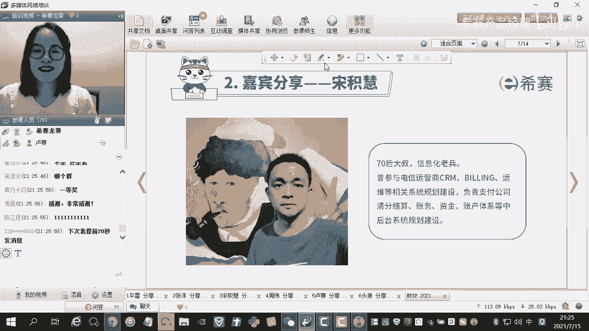

# NPDP2105班优秀学员分享-产品大叔的认证之路-宋积慧 - P1 - 希赛产品经理 - BV1kA411R7qE

同学分享完了之后就会抽取二等奖啊。

好接下来啊我们来看一下送机会啊，送机会这位同学的分享，送机会的话呢，我就不再去念他的个人简介了，等一下我们看他的ppt啊。

他都是会去介绍的啊，那个考试经历啊，还有他的那个是那个整个的那个没有，这个过程啊，感觉真是这个考试大神啊，就是我这感觉很惭愧啊，就是就是那个我感觉就是呃，就是自己在这个精力投入方面。

还有就是这个呃就是确实应该向他们学习啊，就是那我来分享什么呢，就是说就是那个呃我我也不是就是那个分，也不是不是特别高啊，160多分啊，就是然后就是那个投入精力也没那么多，然后我我在想分享什么的。

但后来我想了一下，就是那个呃就是两个点吧，就是第一个就是呃我是一个就是那个七零后啊，就是七零后，然后呃快50的人哈，就是我开始以为我是一个年龄比较大的大叔哈，后来刚才龙老师说。

有一个60岁会的一个大叔啊，就这个啊，那我就我其实我也想那个跟那个七零后，八零后还年龄大一点，八零后就是准备要备考的同学，就是分享一下，就是说那我们为什么考，然后就是那个。

那么我们就是比如说家里面的琐事也比较多，然后工作累，工作也比较繁繁繁重，然后就是这个呃这个，那么我们记忆的记忆力可能也会也会，那个时候没有年轻的时候要好，那我们去怎么去备考，那么我是。

我是想从这个角度去跟大家去分享一下啊，啊因为现在这个时间也不早了哈，然后我们尽量在十分钟之内把这个介绍完啊，那么第一个就是那个，就是我是准备抽四点去介绍啊，就第一个就是呃我个人介绍一下啊。

第二就是那个那么我为什么要报名n p dp，然后第三个就是那个学习的难点啊，就是我的理解就是另外一个是这个啊，备考的经验的一些分享，呃第一部分啊，就是我真的是大叔哈，就是呃我是74年的啊，然后47岁啊。

我还交50了哈，就是然后我我刚毕业的时候，还是在用那个fox space啊，c去做编程，然后那个服务器呢，可能这个服务器，可能大家这个系列可能也没有听过啊，然后还有就是我的孩子已经今年是准备考研啊。

去他的学校呢，跟那个刚才前面的张扬同学是一个学校啊，也是学计算机的啊，就是那个那个回头就让我的孩子，回头跟那个张扬大神请教一下啊，这个这个是属于师兄啊，请教一下啊，就是这个怎么准备考研了。

就是这个哈哈呃，所以就是我的一个打字的一个简历哈，就是我我真的是个大叔哈，就是这个啊，第二第二个就是我的职业，那么我是从97年毕业之后呢，就是一直在从事那个新化行业，我是在某电信运营商工作的。

就是一直在信息发布啊，那么开始的是在那个地市公司的信息发布，然后01年的到北京啊，为我到了总部，然后待了十几年，然后2016年的时候，我们公司成立了支付公司，那么我又去到了那个支付公司，然后呃一直在做。

就是这个相关的行业啊，那么做开发。

做运维啊，做运营啊，做个项目经理，然后然后也在那个集团的那个就是那个i t啊。

规划的一个促使去做全国的那个i t规划，然后还有那个产品经理啊，就是我的一个职业，那么我的经历呢就是我做过一些系统，就跟电信营商相关的一些呃，b d的一些相关的一些系统。

那比如像c r m我们那时候还叫营业系统，那么bing就是各种计费系统，比如说营业计费，固定电话计费，然后还有这个数据计费，各各类的计费系统，然后还有一些t的运运维的一些系统，然后我到了直播公司之后呢。

就是还是做一些老本行，比如说就是呃除了就是那个支付这个交易，那就是个前程，就是那个这个环节我没做之外，那么后面的一些清分结算账户资金啊，这边嗯啊大啊，大音量哈，我我这个大一点啊，我就我离那个话筒。

我我离话筒近一点哈，嗯就是嗯就是我做的系统呢，主要就是那个中后台的，就是这些也我在支付公司呢，就是除了支付系统以外的，就是后面的谈了一些清分结算账务资金啊，快捷键系统都是我在负责去规划和建设啊。

就是这个是我的做的产品经理，那么第二部分，就是我为什么那个报考那个n p d p啊，就是嗯你说那个这也是很偶然，就是在那个就是在就是年年初的时候，看到我一个同事在报那个就是n p p p啊。

因为我很久没报那个就是那个认证考试了，然后就是呢我翻了翻他这个书，诶，我觉得这个这个还是一个比较值得一学的，一个东西啊，所以呢就是我我也想说，因为以前一直在做一些实际的工作。

那么就是也有必要去那个完善一下，那个一些知识体系，那么就是那个什么现在看书啊，就是我不知道大家有没有感觉，就是工作之后就看一本书真的是有点费劲啊，就是你要是看一篇文章，或者看一些呃学术和技术那个文文章。

可以让你看完完整的看几本书，真是啊有点有点难啊，那么这样就是正好就是记住这个考试呢，就是以考代学，就是就是呃就是我一个一个基本想法，另外呢就是我呢就是已经刚刚也说过，很久没有参加那个认证考试了。

我我最后一次证考试，还是在2012004年的，就是那个oracle的，就是就d b a的那个o c p考试认证，那么已经17年了，所以还是想挑战一下自己，就是能不能就是那个专注的，去拿出一些时间学习。

然后看几本书，然后做大量的题，并且能通过这个咱们这个考试，就想挑战一下自己啊，呃因为就是那个前面我我我看到一些同学，就是就是还有就是我因为我也看到，就是咱们这些后面要分享的一些经验的一些。

那么就是一些那个就是那个同学啊，他们真的是就是很专注，做事情，确实很很有条理，我相信他们在学习，他们在上大学期间，学业期间可能也是一些啊学霸啊，或者是就是在工作当中也都非常出色出色哈啊。

然后可能有些问啊，就是我看有些自己的一些看法啊，就是说可能第一呢，就是那我我刚才说我为什么要分享呢，我觉得可能第一呢，就是我代表一些这个年龄的阶段的人，那我们需不需要学n b n b b b考试。

那我们我们能不能通过，可能会有人会有同学可能会有一个这样的疑问，就是需要回答的，第二就是什么呢，我可能代表也代表了一批一批，比如说像160多分的这些同学，那可能就是其实我们上大学的时候也能上高。

高中的时候也可能大家都知道，可能有很多一些学霸的学习方法，我们可能也知道，那可能我第一个只有我做不到，第二各种时间呢或者是自己的经历啊，做不到，或者是能力做不到，或者是呃我不想这么做。

所以就是呃那那我想我想介绍一下，就是那个我们160多分的原因，就是呃就是大家去呃应该应该注意些什么，就可以达到就是这个这个这个程度哈，就是也想也想分享一下，那么所以呢我想从这个角度上去谈谈。

我对这个考试的一个理解，那么这个考试呢就是它有它有四个难点，就是第一个就是那个信息量大，他的教材虽然只有一本，但是它包含的那个就是产品管理相关的一些，战略啊，组合啊，流程啊，团队啊。

文化考核绩效就是方方面面啊，就是还有就是还涉及到一些项目啊，财务市场等方方面面的知识，他其实信息量是蛮大的，就是这个这个领域很广，就是理解起来东西是如果是没做过的话，就理解起来是比较难的啊。

所以就是这个他第一个就是信量比较大，第二个难点就是他比较注重这个实际应用，其实你会看那些，你要是看那些题呢，你会发现就是说他没有，就是纯的一些书上的一些概念，或者一些原本的一些文字的一些考法。

基本上都是放到一个案例里面，然后去看你有没有对这个知识点的掌握，所以他比较注重一些实际的一些应用啊，第三个就是那个难点的，就是那个翻译质量比较差，就是纯英文的。

然后就是另外他这个进入n k t p这个组织，进入国内时间比较短，但他很多地方还不够完善，那他翻译的时候呢，就这个质量不高，就可以可能还是对你的呃，解题呢会造成一些误导啊，就这个就是也是个难点。

那当然了，最大的难点呢还是我们自己啊，就是那么我们能不能克服，就是生活和工作中一些打扰，那么就是那个克服自己的一些惰性啊，还有就是重新点燃自己的一些学习热情，那么投入到我们的学习当中去。

我们能啊专注的去做件事，然后把它过了啊，把把这个考试通过，所以其实这个考试最大难点还是我们自己的，那我也分享，那我也分享一下，我的就是那个备考的一些经验哈，就是我可能就是就是我刚才说过了。

就是我们第一个难点，就是我们这个信息量比较大啊，就是知识跨度啊，各方面知识都比较大，其实这个我自己感觉是不行的，就是我觉得我觉得这不太可能的，就是这个这个基础知识还是要学的，那么基础知识学习呢。

这主要就是来自于这三方面，那第一个就是这个啊这个龙将和罗帅的，就是这个视频啊，这是第一个重要最重要的一个东西，就是呃呃这个这里面讲的都是干货啊，这里面啊不光是就是我们的一些基础知识，还有很多的一些延展。

还有一些考试的结合考试经验，做题经验的一些介绍，我觉得这个非常重要啊，我觉得我最吃亏的就是呃，我就你就这个呃，就是有两个有两个章节的视频啊，我因为我前面就是没有复习，那么后面在赶的时候，时间不够的时候。

我就做了一些舍弃，比如说我认为一些可能不太重要的，那个张姐的视频，我可能就没了没看，就比如说像那个就是那个工具啊，就是那个和绩效工具，绩效那个还有团队那个这个视频了，就就没看，然后就是直接看书。

然后去做了题，那么实际的结果如果可以把把叫醒告诉大家，最后的结果就是这两个章节，虽然我这个呃看书做题可能也不，那也还行也还行，做了不少，自己感觉好像感觉还可以，但其实呃还是理解上还是有不到位。

那那那这两章节最后考完试之后呢，分是最低的啊，就是那个一个是60%多，一个是反正呃不到70%的样子，所以这两个呃这两个章节其实我这个没看视频，就最后的结果就是那个分是很低的，给我拉了很多分啊。

就是啊第二个就是那个书，那这三本书呢其实老师已经给大家推荐了，那我这我那可能就是时间不多，所以就呃就是第三本书啊，说的我我没看啊，我我不好去做评价，刚才那个呃平平雷兄已经去做了评价。

那么第一本书我就介绍一下第一本书，第二本书，那么这个很明显，这两本书呢就是一个是国内老师，就是那个编，那就是国外老师，就是一个是国外老师的书，还有那国内老师说的那个，就那个呃就很很很典型哈。

那编的就是比较比较散，不成体系啊，比较浅啊，但是他比较新，因为他毕竟还教材，所以一定要认真看啊，就这个我是看了两部，那个看了两三遍啊，就是那第二本呢就是这个如何准备v dp，这是我重点向大家推荐的。

就是这本书一看就是中国人啊，编的就是很成体系啊，就是这个这个这个呃这个这个特点哈，就是整理的就很成体，整个知识呃整整理的很成体系，然后有那个就是那个呃只是这个教材以内的，也有教材以外的，而且他特意去我。

我最喜欢的就是他那个每个章节，他做了思维导图，那其实我最后去做突击的时候，突击去看书，或者是突进去去学这些知识的时候，其实我主要看的是就背那些知识的时候，结果主要看他那个章节，就是那个思维导图。

我不用去自己去画了，不用自己去总结了，他已经总结的很好了，而且就是那个他这本书里面讲的很多都是干货，所以这本书我也看了两三遍，所以我重点推荐就是这个这本书啊，包括咱们后面有很多一些讲义。

其实那个就是呃其实你也有自身的，就很多知识点可能也来自于这个这本书，所以我重点推荐的就是一个啊中间的那本书啊，然后再就是那个老师这个讲义啊，那那刚才同学很多同学都已经用过了，或者是那个就看过了。

就真的是呃就是很多都是干货，而且里面就是这是就是集中了大家的，就是那种咱们机构的很多老师的一些心血，然后去总结归纳总结的一些东西，然后能够帮助我们去做一些知识的串联，所以就是这这三部分就是那个的材料。

技术知识啊，还是要学习的，那么学习的话就是这这这这三份，就是那个材料都同样重要，所以说这个还是希望大家去啊，去认真的去看一下，那第二就是那个备考的分享，就是说当然还是要就是我刚才说的，就是男男男女。

其实还是我们自己，那么其实我们还是要就是那个啊科普困难，那个时还是要保障一些学习时间的，就是呃那么你要制定学习计划，你要看视频看书啊，然后做题，那么呃你要说服自己要坚持啊，刚才那个张良也说了。

我们要坚持啊，我们要做自律的人啊，再有就是那个忙里偷闲的学习啊，然后再有就是说那个报名之后呢，就是一个底线的学习时间，你不能再不学了，这个可能再不学可能就过不了了，然后再有就是那个考试前的一周的。

那个冲刺复习，那我最后两天呢就是因为平时比较忙，最后两天呢是呃请两天假啊，我就是就是前两天年假，然后就是那个集中去做突击的啊，就是复习啊，就是就是这个呃就是第二点的几个分享。

第三呢，第三呢就是那个我们就是那个就是呃难点里面，比如说像一些就是那个它的实战性比较强，比如说很多东西都是结合一些案例的啊学习啊，然后还有就是那个呃他很多的一些错的，一些东西，那怎么办呢。

就是其实就是第三点，就是那个我们要站在巨人的肩膀上啊，就是呃龙老师，还有这个卢老师，他们那就是真的是经验非常丰富啊，就是他们就是那个对这个对这个对这个专业啊，知识，还有就是这个考试的经验非常丰富的。

那么他会告诉我们，就是这个呃再给我们讲这些题的时候，会告诉我们哪些哪些是对的，哪些是错的，那么就是然后再就是这个题库，咱们这个西塞的这个题库啊，真的是很牛逼啊，就是大家考过试的可能都知道。

就是呃这个真是咱们这个这个西塞的，就是这个各位老师的一个经验，就是那个付出了很多心血啊，就是为大家去收集了这么多的题库，并且就是那个呃做了解答，我觉得这个这个题库真的是很棒，大家一定要重视。

但是我可能啊真的是很对不起那个罗老师啊，看龙老师，就是我这边题库就刷的还是有点少，我看到我刷的，我就看我刚才看了一下，就是那后台大概我是刷了1905道题啊，真的是很惭愧啊，就这么做的题确实不多。

那这个题真的是很棒，考试的时候会看到很多的，就是那个都很类似的题，所以就是这个呃这个题库，就是我们要就是就是充分的利用，就是我们西下来的就是这个经啊，就是老师的就是那个经验，还有就是我们这个题库。

那么就是才能把我们这个啊考好啊，然后再有就是那个我最后一句是最后一个经验，就是呃我们听龙老师的话，因为很多题呃，可能就是答案可能它不是唯一的啊，然后就是那个可能看起来也不太正确。

那这个时候就是我们还是要就是那个听老师的，就是那个解释啊，然后最后这对我们答题是很有帮助的啊，所以就是我们要充分的利用这个这个经验，那么我们自己没有比较的时候，我们是不知道它有多宝贵的，那么其实一比较。

就是那个这个这个就就就可以找出差距，有差距对了，那我的一个同事也在考那个n p d p，但是但是他今年没考，他今年就没报名，但这次5月份没报名嗯，然后我跟他一交流，我说我说你都有什么教材啊。

然后你那个都有什么那个讲，你们你们的机构都有什么讲义啊，他上的是北京的一家机构啊，然后名字我就不说了，然后就是那个我说你都有什么奖励啊，就是学校给你发的讲义啊，我说你这个题库怎么怎么样啊。

就是一对比还感觉真的是啊，我们那个西塞这边，就是那个无论是就是老师的那个实力啊，经验啊，还有这个题库啊，呃就是还有给大家精心准备的一些，就是那个就那个讲解确实嗯还是很有优势的，只是这也是我们学员们取得。

就是那个成好成绩的一个一个一个，非常重要的一个保障啊，就在这在这里面，就是啊，我也像那个就是那个咱们西夏的各位老师啊，罗老师啊，罗老师啊啊真的是啊，还有就是我们的一些嗯，就是那个其他的班主任呢。

就是邓刚老师啊，就是真的再次表示感谢，就是我们的成绩，其实你们的付出其实是在我们背后的，付出是很大的，就是我们可能呃就是学的是一点点，可能你们要要去准备的东西就是很多啊，真的是非常感谢各位老师的付出。

嗯最后呢就是呃呃就是我的分享呢，就是基本上到这了，那我就是把就是那个就是三总结了三点感受吧，就是第一呢就是那个就是各位那个啊，师弟师妹呢，就是我是觉得就是n t t n n t d p啊。

是一门非常值得学习的一个课程啊，就是呃抛开一些功利的一些想法，比如说就是我们通过这个证能获得什么，就是我觉得他这个知识的内容啊，就是都是非常好的，就是非常非常非常有体系的。

就是我觉得这个是一个非常值得学习，一个一个课程啊，我觉得还是值得大家去认真的去看书啊，去去学习的，第二第二第2年感受的就是年龄不是问题，身高不是距离，就是我都47了，我47多岁了，都快五快50了。

这个这个记忆力肯定都没有，那就是咱们很多年轻人的就是这个好啊，就是那就是那个只要你想学，就是其实没有问题的，就是咱们就是那个呃就是有这么好的，就是一个的资源，然后我们其实都是经过这个高考。

还有就是这个大学教大学学习了，就是没有问题，大家都能过啊，就是如果要是用心的去学，可能只要你想学，其实是啊都可以过的啊，这个我觉得年龄不是问题对吧，如果还有类似，比如说像七零后，八零后。

比如说想想报名考试的，我觉得这个不用犹豫啊，我觉得就是这个不用担心自己的年龄问题啊，不用担心自己的精力问题啊，只要你认真学是可以过的，然后然后第三点的感受呢，就是那个认证考试呢是学呃，是学习的起点啊。

不是终点啊，因为就是这个其实大家也有啊，也有感受，就是我们呢大家都知道，就是这个呃一个认证考试，他可能不一定能说明什么啊，但是呃而且就是那个呃产品相关的知识，真的是那个星辰大海。

就是要学的东西真的是很多啊，但是我们通过这个n t p考试呢，可能燃起了我们一个学习的愿望，那么借助，就是咱们那个这次那个分享的一个主题，就是那个让学习成为一种习惯啊，这个真的是真的是这样。

那我们也想我也希望就是说啊，我自己还有各位那个同学，也是就是把它作为一个学习的起点，而不是重点，另外就是咱们群里面的就是很多的一些大神啊，就像什么啊，单总啊，王啊，王松啊，平雷啊，还有杨洋啊。

就是还有卢塞，还有还有咱们在咱们群里面的很多，很多同学都是在啊行业当中呢，就是啊精英啊翘楚啊，就是真的是有很多的，就是那个呃就是那个呃就是产品的一些经验啊，还有一些工作的经验啊。

就是这些东西就是其实气候呃，这次考试大家都认识之后，我觉得啊就是真的是啊大家可以交流啊，互相互相交流，互相学习吧，所以是呃这个我们这次考试是，其实只是一个起点，不是终点，后面我们还会啊互相学习。

然后互相交流啊，好谢谢大家，我今天的分享就到这里了。