# NPDP2105班优秀学员分享-刘学 - P1 - 希赛产品经理 - BV1eG4y1w7Gu

好接下来有请我们的第二位出场嘉宾，留学同学看到他的ppt介绍，没，有屡次被打的凡尔赛，一看就是凡尔赛大师，让我们来看一下，他会给我们带来什么样的分享呢，来掌声。

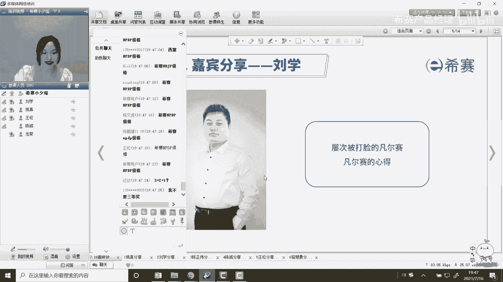

欢迎留学同学，有些同学可以听到那个各位小伙伴们晚上好，我是这个5月份考试的一个学员，很荣幸吧侥幸的通过了这次考试，然后厚着脸皮的来这个参加一次咱们的呃，嘉宾分享啊，我这ttk就可以了，诶不是哈。

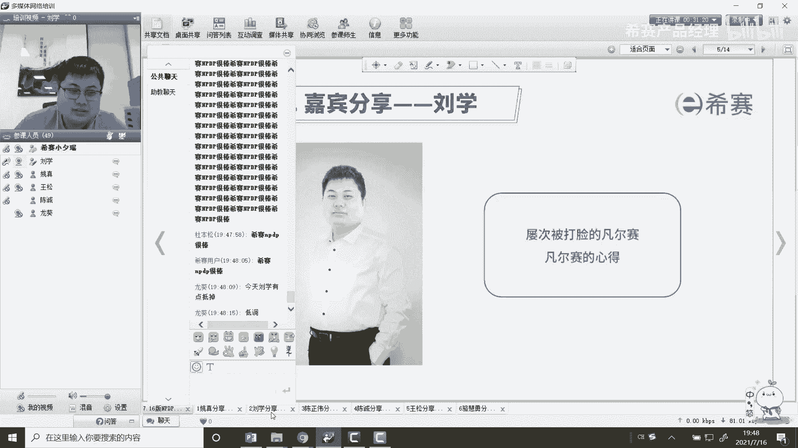

老师我这个ppt点完了要点到这里，嗯我接下来分享了一下，是我整个的学习的一个过程啊，其实啊在这个学习的前期啊，我加入的比较晚，当时已经开课嗯有一段时间了啊，前期进来是比较抵触的，因为嗯一是工作比较忙。

二是这个呃确实之前也考过一些证书，我觉得这200道选择题，是不就跟那个考驾照一样，考驾照科目一一样啊，这个尤其是这种要求的分数越高的考试越简单，就像这个科目一，它要求90分及格，大家都能过。

他要真要求60分及格，可能提就有难度了，然后在这个前期听这个直播课的过程中，尤其是听罗帅，罗帅讲课真的是特点非常鲜明，就是这哎我是一般都是跟着直播课听啊，因为我觉得跟着直播课有互动比较有意思。

如果光是看视频的话，可能自己有一些问题，等看完了就忘了呃，这个跟着罗帅的直播课前期真的是非常困，为什么困呢，因为我是后入后后那个加入的嘛，没有看这个，没有看前面那个980的视频，也没看讲义，更没看书。

直接看视频，我就找不到这个罗帅讲的是哪个是知识点，哪个是他在吹牛，然后当时这个咱们群里面也已经开五题了，开五题我就跟着做跟着做，发现我这还没等做呢，咱们的这个群里面答案已经飞起飞起。

然后那个等到下午我发答案的时候，也是一直在讨论，我每次都跟不上，我这刚在思考就跟答案出来了，然后我刚在想着对，下午的时候，每次想对一对答案。

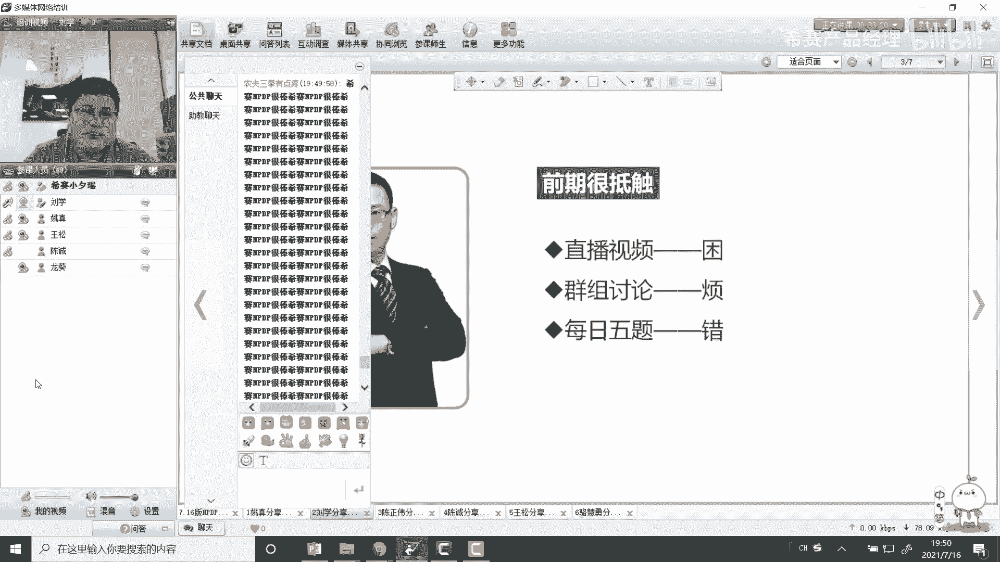

我就是诶发现大家已经讨论开了啊，搞得我是非常烦。

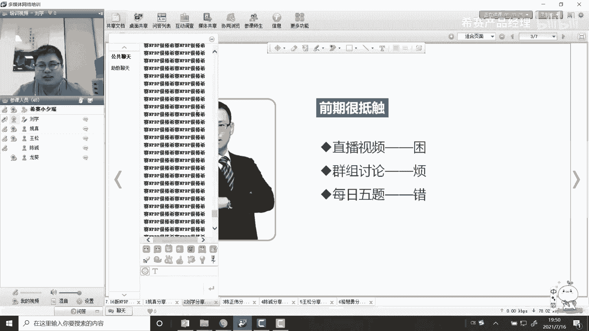

这个五级的质量也非常低，然后我曾经就是1度找到龙葵老师，我说能不能建个qq群，建个qq群，把这些人全都禁言掉，我真的烦死了啊，然后咱们就直接的嗯搞五题下答案。

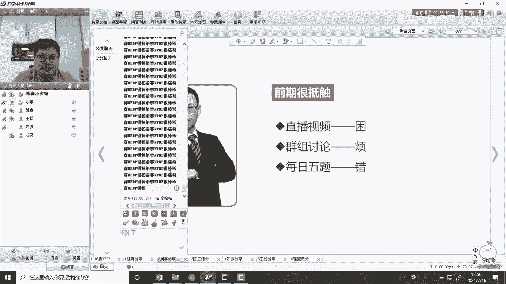

老师说不行，这个是嗯坚决不要这样做。

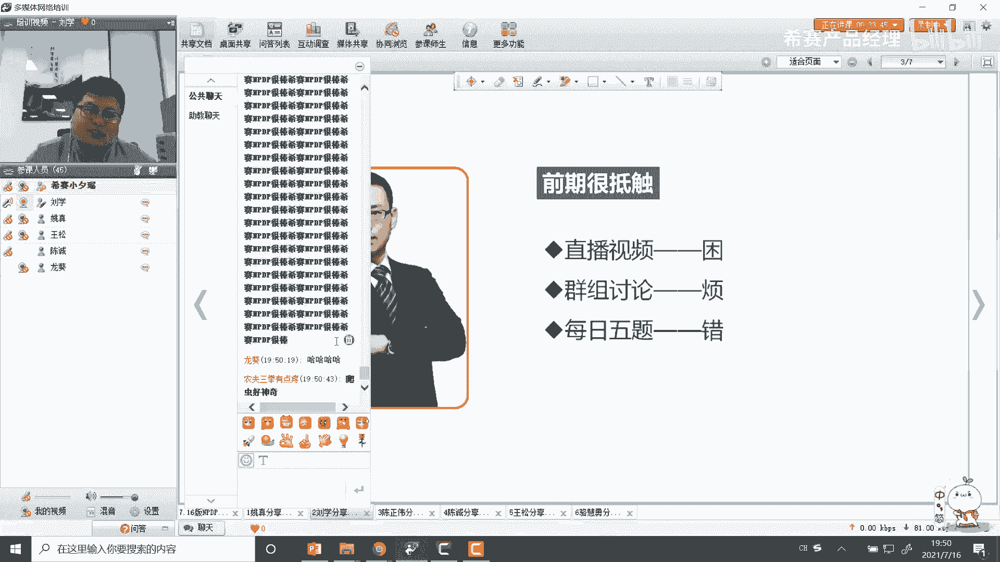

还是需要这个大家一起交流，我就说那交流的话，我不想在这群里待着了，你给我换一个群吧，老师说行，有一个这个有一个发言比较少的钱，然后我就主动退出了这个积极的钱。

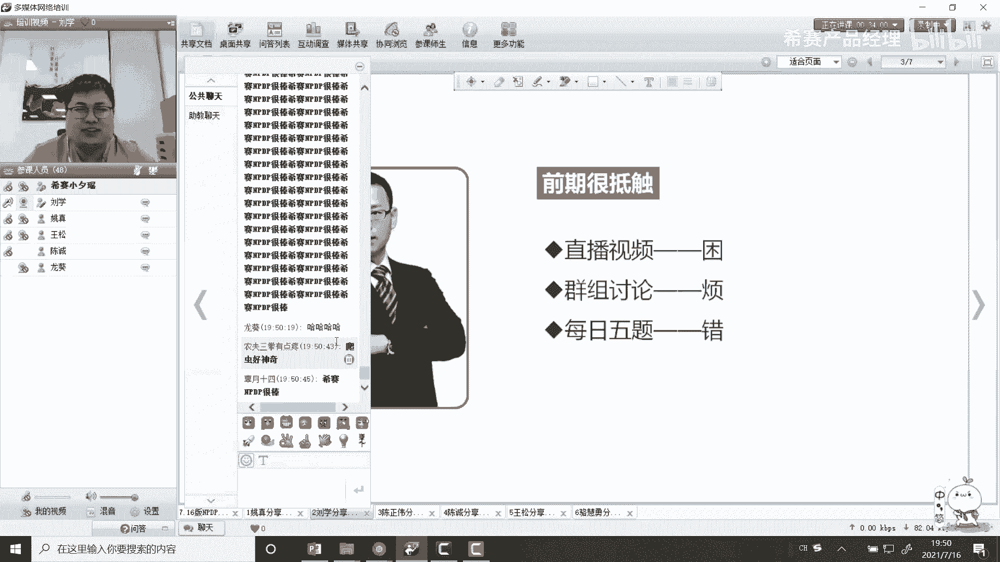

跑到了另一个群里面，但是等到这个中期呀，然后就是好在因为5月份考试，5月份考试好在这个呃中间有一个春节，还有一个那个五一，这两个时间段是可能是咱们11月份考试的，小伙伴，只能有一个国庆了啊。

这两个时间段非常宝贵，在我这个春节的时候，我一直在反思，就我这么学肯定不行啊，这个这个教材也没看，这个红叔那个讲义也没看，五题也不跟，然后老师一上课我就犯困，怎么办啊。

我就在这个春节期间把这个罗老师的这个视频，我又刷了一遍，当然我也开了倍速啊，我就想着他到底讲的是不是知识点，难道就是扯一扯淡，就把这个考试过了吗，然后我就回归书本，回归讲义，回归这个小红书。

还逐条的去学习了一遍，然后刚好在春节前后呢，龙葵老师也开班了，哎我又跟上了龙葵老师的课，相当于我前前后后这个视频课呃，虽然说也是就是跳着看，但是也是多多多少少的刷了三遍啊，当然了嗯，刷完视频之后。

我觉得这群里实在是太寂寞了，然后我又厚着脸皮的找到了龙葵老师，我说老师我不想在这群里待了，你还是让我回去吧，当然这个心态也是源于，看了几遍视频的一个自信，我想着必须得回去跟这帮高手再过过招了。

我看你们五题做的这么快，我的这个进度有没有追回来，还是咱们讨论的时候，我到底有没有落下，回头找一找差距，所以我就主动的跟老师提出了，我再重新回到咱们这个积极活跃的群里面啊。

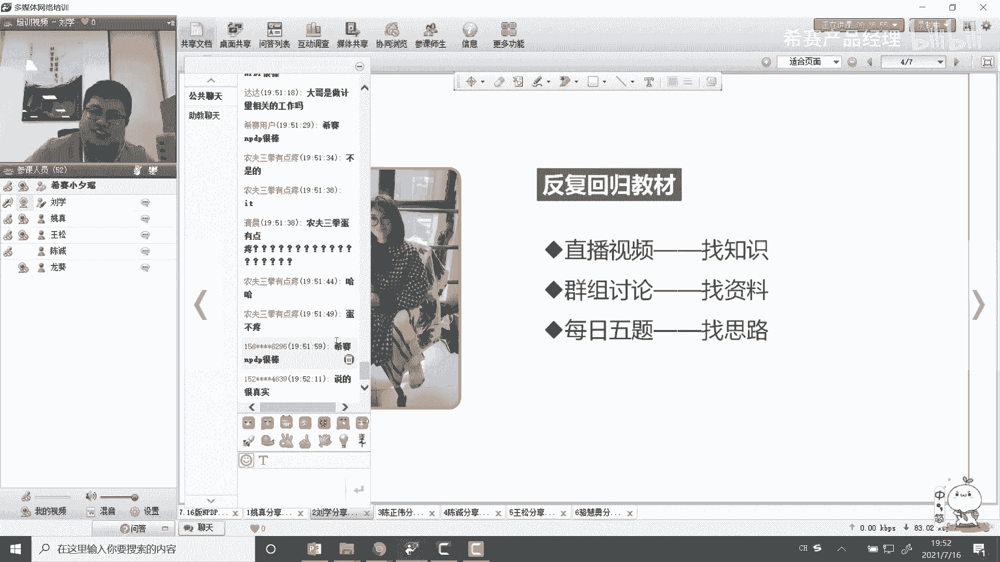

当然考试之前，我还是比较这个比较这个不自信的，觉得跟大神们在一起，我比较中庸，并且做的模拟题的这个模拟题的正确程度，第一遍也都不高，从来没高过这个80%，当然也没低过这个75%，一直都很稳定。

直到我看见了罗老师的这个图片，这个这个是我这是一个表情包啊表情，然后我截出来的，直到我看到了这张图片，我觉得啊所有的题在我眼里都不在话下了啊，感觉就是考试就是毛毛雨一样，然后当然随着这个后期。

咱们这个嗯对几套模拟题的一个一个嗯，前后的一个梳理和讨论吧，然后再加上对教材的和掌握程度，回归教材嘛，就一天比一天自信，考试的前一天嗯也没怎么看，就觉得以为稳了，然后还一直反复的问老师诶。

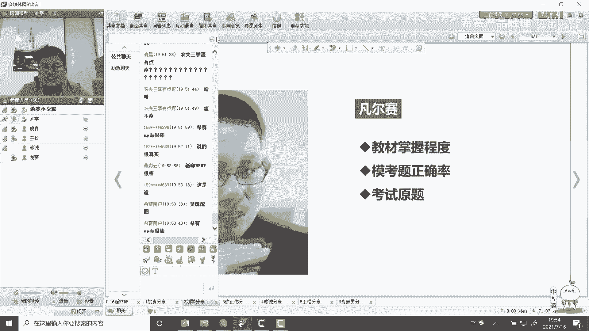

我是不是过了180分，该怎么怎么一个拿奖金的流程，相当的自信，可能考试当天那就更不用说了，因为西赛的题库真的是原题太多太多了，就感觉每一道题都是原题，所以说咱们选择西赛还是比较有底气的啊。

在考试的过程中，很快基本上一个多小时就答完卷了，答完卷我就又打了一遍，我就打了两遍卷子，中间还是出去晃了一圈啊，因为因为跟小伙伴们是约好了，就不提前交卷了，所以说也比较这个无聊嘛。

我就考试题上答了两遍卷子，我当时就有种要得到满分的感觉，呵呵从考场出来，我就艾特了咱们这个西塞的老师，我说这个180分就给奖金了，我得了满分得什么奖励啊。

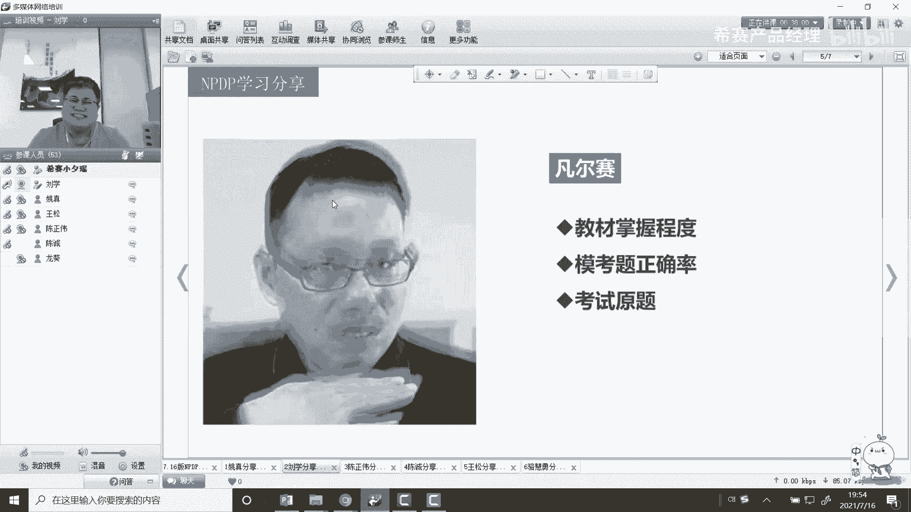

比较这个凡尔赛，但是这个等成绩发出来之后，还是被打脸了，被打脸了，当然也要反思嘛，嗯这个事后一定要找一找自己的问题，也是一个pb c a的一个一个一个原则吧，然后跟龙葵老师也交流了。

主要还是我的这个节奏还是偏慢，可能并且还是一直在按照自己的方式来这个做，但实际上我们自己的方式虽然说很适合自己，但是我们对考试，对这个学习的节奏肯定是不如老师的，老师站在前面讲的这些内容。

讲的讲的案例也好，讲的书本上的知识点也好，包括给咱们安排的学习节奏也好，这都是经过几次考试，几次摸索而来的，所以说我觉得嗯，可能是我的节奏还是和西赛的节奏有点差距，嗯最后导致这个被打脸。

嗯所以说这个在战略上藐视敌人，在战术上呢也对敌人不够重视，嗯在接下来的工作当中呢，肯定是要把学习的这个知识要得以应用，要不然光得一个证书也没什么用是吧，考上考上了驾照不开车是吧。

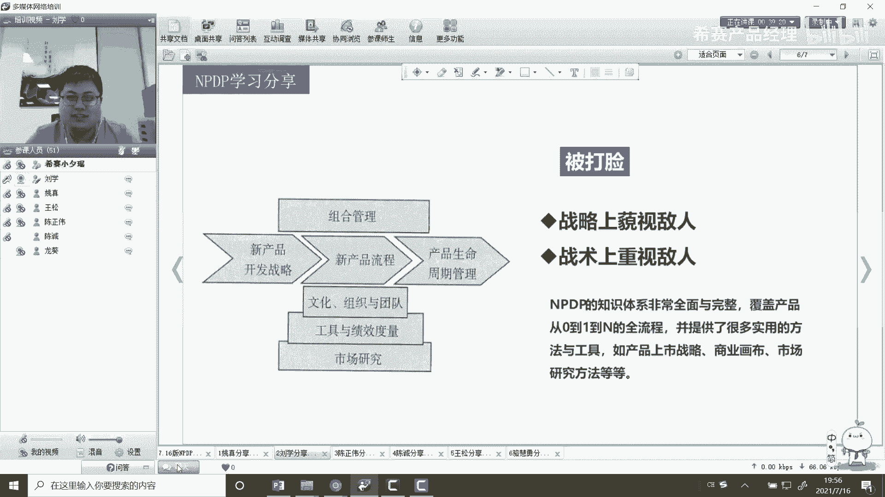

也是比较比较浪费啊，这个是我的一个分享经验吧，嗯也祝咱们西赛越办越好，老师们越帅越美，还有祝小伙伴们都能顺利通过，谢谢这是我的分行长，谢谢留学同学给我们来分享，受益匪浅。

