# NPDP2105班优秀学员分享-如何在把龙葵弄奔溃的过程中得到成长-卢赛 - P1 - 希赛产品经理 - BV17G4y1X7rr

都是熟人，因为因为他们一直在刷屏啊，好我们来看一下啊，奴塞，喂猜猜在吗，在的是吧，好稍等一下啊，能听到能听到啊。

声音好，声音要再大。

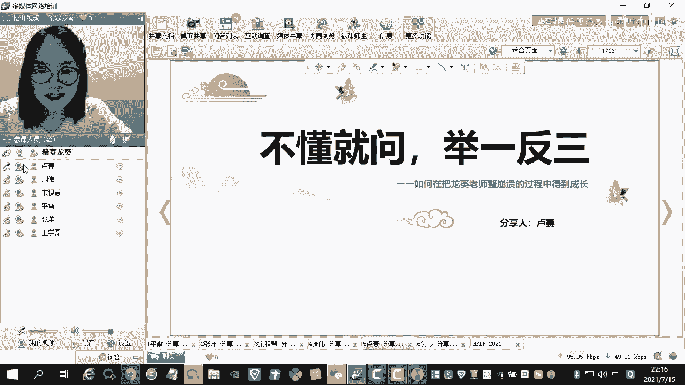

保龙葵老师整崩溃的过程中得到成长，这个是龙飞老师给我想的标题哈，嗯也可能是龙辉老师已经饱受折磨了，因为呃我是可能是因为我性格的问题，我可能会啊什么事情就是呃都会问的比较清楚，如果我不清楚的话。

可能我就觉得嗯我没有把它掌握好，然后我就觉得特别不安心，所以我问我问的一些问题，还有一些跟牛角尖的一些嗯点，可能会让老师有一点抓狂嘛，啊就是大概是这么来的对，然后我自己想分享的就是。

其实就是说嗯嗯你不要怕把龙葵老师整崩溃，然后不懂就问对，不懂就问举一反三对嗯，不是说我这道题，然后我我会了就行了，而且我要把这道题吃透，然后如果出类似题的话，我可能还是啊我也我我也能把它做对。

要有这种思想的。

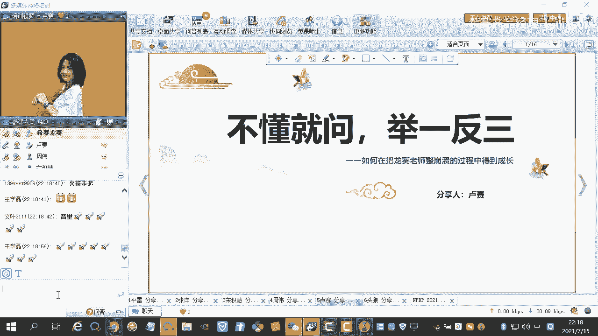

声音很小吗，我给大家分享的呃，主要有四点吧，第一块是我自我介绍，第二块是备考的过程。

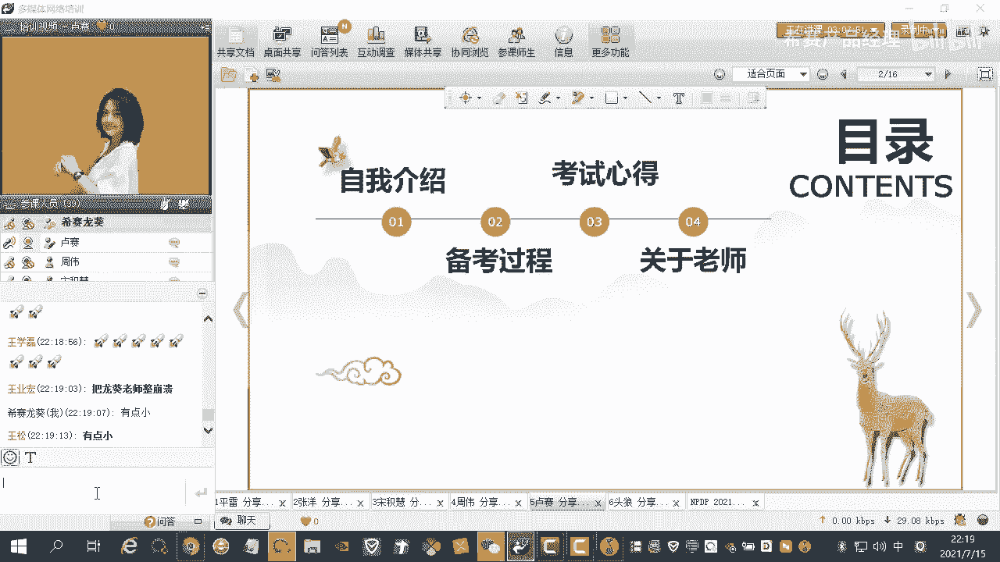

第三块是考试心得，第四块是关于老师对，第一部分是我的自我介绍啊，就是我我是一个爱听女啊，就是我当时大学毕业也不知道干嘛，我学的是软件工程，所以我跟着我的同学就去了北京，然后误打误撞就做了ios开发。

然后做了3年码农之后呢，我转了产品经理，刚开始的一家就是转产品经理的那家公司，可能更多的是做b端的产品，跟客户就是沟通的比较多，当时我就意识到，可能我就是对产品知识的嗯，产品产品经理这个产品知识。

这个体系不是特别的清楚，而且我掌握的不够呃宏观，然后呢我觉得跟客户沟通的时候，可能我就没有办法说一些很高大上，或者是让人觉得很专业的一些术语，然后所以呢我是当时就想着要系统的学习一下。

如果学习的特别好的话，然后别人会认为我很专业，然后呢可能合作的机会就更多一点，我当时为什么选西藏呢，是因为我看了罗老师的呃980的一个视频，然后他讲那个电梯测试呃，电梯测试讲的一段是说嗯。

在电梯里面就是有有限的时间内，然后你可以用简短的话和精湛和和，用简短的话就是很快地表明你要传达的意思，我觉得这一点特别吸引我，呃因为我觉得能用精简的语言嗯，把嗯把一件事情能尽快的说清楚。

然后这是一个嗯很厉害的事情，而且我现在也一直朝这个方向上努力。

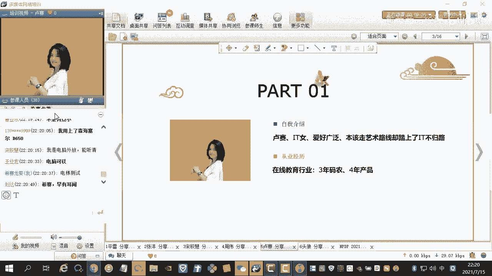

哦我讲一下我的备考过程吧，我的备考过程就是跟五点讲吧，第一个就是定目标，第二个是找战友，第三个是勤刷题，第四个是记关键词。

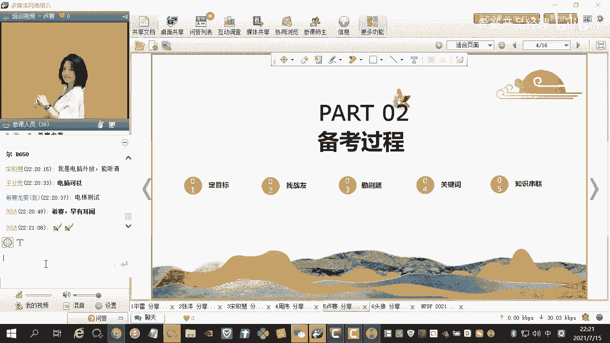

第五个是知识串联，第一点定目标的话呃，因为我是一个嗯就是对未知事情的话，我就会嗯特别的没有安全感，就是我不会对未知的事情，抱有抱有任何侥幸心理，我都会做啊，就是十足的准备，我有把握的事情我才能才敢去做。

要不然我就会一直焦虑和害怕对，然后我给自己定的目标，呃我的声音已经很大了，可能不知道为什么我这个是电脑的问题吗，我的声音也调到最大了，我都快趴到电脑上了，不好意思啊，然后说到这个给自己定目标哈。

我刚开始给自己定的目标，都不是说我考过就行了，我给自己定的目标就是180分加对，因为我是觉得嗯我既然花了钱，而且我也花了时间，我也付出了努力，我干嘛不把这个事情做好呢，我是有这个心理的。

所以我给自己定的目标就很高，而且当时说西塞说呃，呃180过了180分的线，然后可以有一一千块钱奖学金，对冲着这一点，其实我也有点这种小心思啊，不吃他的心理哈，就是谁跟钱有仇的对吧。

然后我就是想考180分，但是我实际考了178分，差了两分呃，其实是有一点点小遗憾，但是我觉得也已经很好了，对然后下面一个是我的作息表嗯，这个作息表哈不是说我刚开始学习就这样的，我是五一之后放假回来之后。

然后我才定了这个作息表，因为3月份和4月份呃，3月份和4月份我就一直在听课嘛，听罗老师的课和龙辉老师的课，但是我当时仅限于听课，其实我自己思考的东西不多，而且我也没有刷题。

然后五一之后我觉得我要做一个啊，就是考试前的冲刺，对我就给自己定了一个这个时间表，因为我是早上八点半上班，然后晚上五点半下班，然后所以我的学习时间就是在六点到8。05，六点半到8。05。

然后呢晚上是五点半之后就开始学习，对这个大概坚持了有半个月，而且我每天都是这么坚持的，大家可以看一下我这个时间表，就是要做一个有执行力的人，就是不能抱侥幸心理，嗯嗯就是我觉得n p p p这个事情嘛。

就是说因为还有很多不确定因素，比如它的翻译可能不准确，所以呢呃考试起来可能稍微的有那么一丢丢的，嗯嗯不确定疫情因素吧，所以我觉得还是要做好十足的准备，所以要做万全的准备，不要抱侥幸心理，对对我。

公司离家很近。

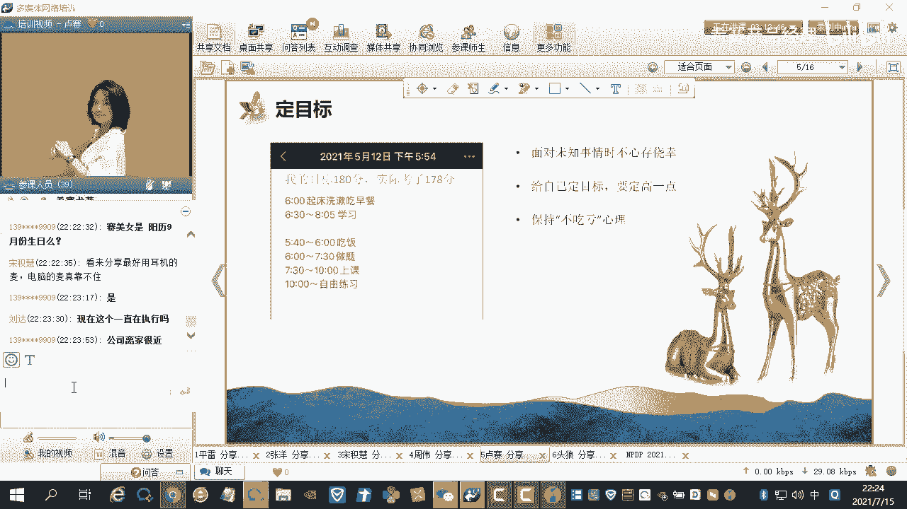

我十分钟就到公司了，是的是的，然后第二个是找战友，找战友，就是嗯有一段时间我学习哈实在觉得太枯燥了，然后我觉得我可能就已经坚持不了，然后呢我们班里面有一个小智，我觉得他就比较好，他特别的认真。

而且他特别的努力，嗯就是呃他加了我微信之后，我们俩的交流方式就是对对对，我们俩的交流方式就是呃，每天就是大家会分享一些知识点，或一些嗯典型的试题，就比如我不会的题，我觉得我理解不了的，我都会发给他。

我看他会不会，然后我们俩就会讨论，在这个讨论的过程中呢，其实我们就已经在认真的思考了，那这个知识点我们可能就吃的比较透了，或者你有疑问的点，对方可能知道，然后我们就嗯很清晰，就是就是已经就是掌握的。

我觉得这样的话就是给别人讲清楚了，那你这个知识点也掌握的就差不多了，或者是说每天我们都会发一些题，然后发一些知识点，然后就是大家非常考一考嗯，还有一点是我在考试前的，我在考试前的一周，我其实想放弃了。

因为我前一段时间觉得我天天这么，就是早上起那么早，晚上就是学的那么晚，有点疲惫，但是呢小智他是嗯还在坚持，他把自己的错题，还有他的知识点，不会的知识点他都打印下来了，并且他还分享给我。

然后我就觉得嗯大家都这么努力，如果我放我放松的话，是不是嗯就是我觉得我可能就考不过别人，我可能有这种心理，所以我也是坚持到最后了，对对队友是很有作用的，对是特别能帮助你去坚持，对对，第三点就是勤刷题。

其实大家呃对，其实大家都呃都说到了对啊，但是我跟大家不同的一点是，我刷题归刷题，但是我题我其实刷题刷的不是说刷的特别多哈，我可能就刷了一遍，或者是我都没刷完哈，这一点其实如果有时间的话，还是尽量刷完。

但是我的学习方式是我刷完了题，我一定会看解析，这个解析我会看，有的时候我甚至会看两遍，我有时间的话，我会把这个解析吃透，对我觉得这一点是救了我半条命，可能是我考过的一个基础，我觉得然后第四点是记关键词。

对记关键词，这个就是可能在你考前考前的一个月啊，你刷题的时候，你一定要锻炼这个记关键词的一个能力对，因为既因为np tp的它有一些题呃，它都是场景题，它的题干很长，但是我们考试的时间有限呃。

大概三个半小时，200道题，除去你打你涂答题卡的半个小时时间的话，也可能就一道题，就是嗯不到一分钟吧，对不到一分钟，可能所以你需要快速的做题嗯，记关键词，就比如哈就像那种呃和客户定义价值。

首席工程师全程参与，这肯定是考经济的，比如什么嗯，一名多项专家呃趋向一致，这肯定是考多少分的，有些题你不用读懂题，不用读，读完它的习惯，你一看关键词，你就知道他在考什么，对一定要记关键词对。

这个是可以加快你的做题速度，第二也可以提升你的正确率，呃最后一点是知识串联啊，就是你每个章节你可能刷完题之后呢，呃你可能每个知识章节的知识点，觉得可能了解差不多了。

但是呢我们每个章节之间其实还是有关联性的，特别是有几个阶段，那几个阶段之间是呃关联性很很很强，而且是稍微有点复杂的，所以我建议就是大家都画一下这个思维导图，把知识串联一下。

嗯基本上我们这一次这一次考试的学员，大家都会画一下这个思维导图，对，都会画一下，而且思维导图是产品经理的一个基本功哈，就是建议大家还是都去能画的话，尽量多画一下。

然后还有一点就是呃我我之前自己学习的时候，我看是看了哈，但是我觉得我是没有看特别透彻，因为它里面说的说的内容，我觉得有的时候我就是理解不了，但是他后面的那些呃课后练习，我觉得是特别好的。

就是我每次学完一个章节之后，我都会去看他的课后练习，我会去思考，去思考，结合线下的真实场景，然后去嗯看一下这个我学的东西该用到哪里，对我会这样去思考，这个地方思考的话。

可能会对你以后的呃实战可能会有一些帮助。

对有些帮助，然后第三部分我就讲了我的考试心得。

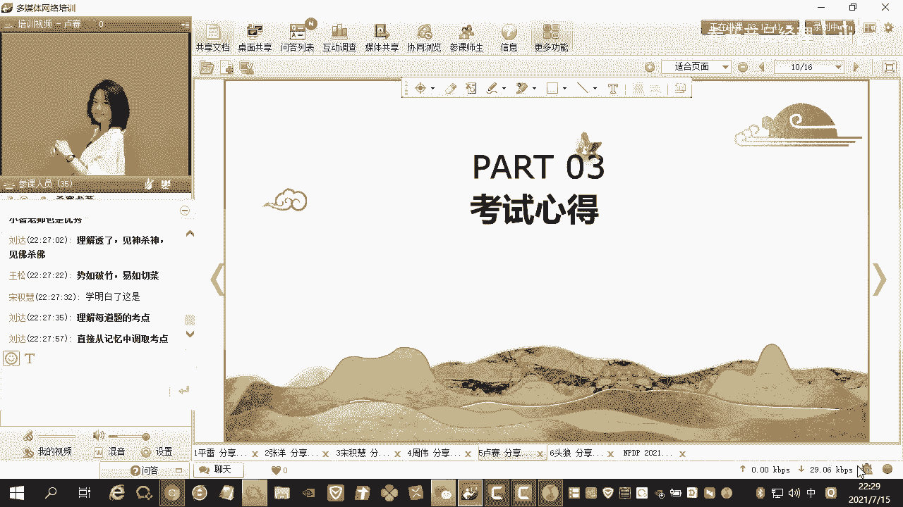

这个考试心得啊，真的是我在考场上就是去思考的一些问题，我在考试的时候我就会发现哎呀，这好多题都是我做过的，基本上70%的题都是我做过的，所以我就觉得西藏的奇酷啊，它那个含金量还是非常高的。

一定要去刷一下，特别是你要学会举一反三，有些题哈，就是70%的题都是你看着是相似的，但是它不完全一样，但是又觉得他就就是考的都是一样的题对，所以你的这个做题量一定要达标，然后第二点呢是你要掌握答题技巧。

就比如我考试的过程中，我有一个概念，好像就是我可能就是学的比较局限哈，就是嗯嗯就是课堂上我没有听到这个知识点，而且我的那个课外拓展，我也没有拓展到这个知识点，然后我又不知道这个概念是什么。

然后我就先把它空着了，然后我做着做着发现下面有一道题，正是对这个概念的解释呃，我是结合两道题，把这两个题都选对了哈，对这一点我觉得是大家是在考试中，就是说如果你不确定的知识点，你就可以去找相关的知识点。

因为200道题哈，一个知识点有的他不只考一道题，所以你去看一下其他题目，参考一下他们的选项或者答案，说不定你要的答案就在它的题干或者选项中啊，这一点我觉得嗯，大家可以就是说嗯掌握一下这个技巧啊。

然后第三点是认真检查呃，就这一次就举例，拿这次举例吧，就是我们考试完嗯，大家可能就很早就交卷了，本来是三个半小时，我相信大家很多一个多小时，两个小时就交卷了，因为它提比较简单。

但是呢我是没有说一个多小时就交卷了哈，我是去检查了一下，我就是打圈的那些题嗯，打车的题就是嗯如果不确定的，我不会改啊，但是有一些题可能真的是你只记关键词的话，呃，有的时候是会失误的哈。

就是你可能有时间的话，还是要反复读一下题，然后确认一下，就是检查一下可能会有失误的题，你就把这个时候就可能就会不就积分哈，我觉得还是有必要检查一下的，然后呢答题卡也一定要检查一下。

答题卡的话就是因为他答题卡分a b两个，答题卡有的是横着涂的，有的是纵向图的，所以这个你要搞清楚，而且你要确定你的选择的答案，和你的答题卡是对应的，所以你可以抽随机抽几道题检查一下。

看是不是顺序是对的哈对，然后还有一个技巧是龙辉老师给我们讲的，就是说你每做50道题去涂一次答题卡，这样的话第一你不会说一直涂答题卡，涂到手酸，第二的话就是说嗯你可以做五道题之后，脑子就可以休息一下。

对换一个思维，然后再继续做题的话，就可能效率会更高一点。

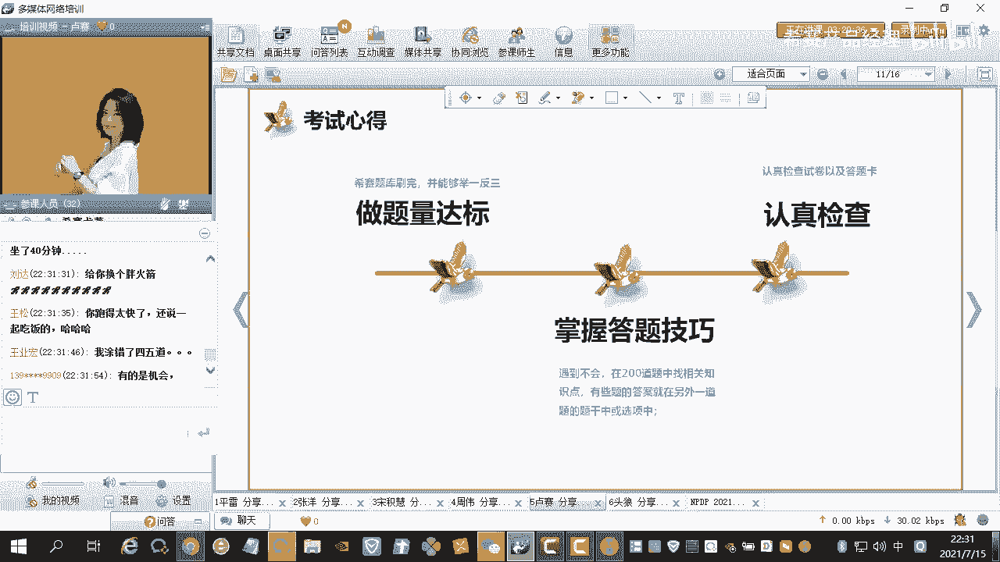

然后第四点是关于老师哈，关于老师，这个是我是也是借鉴了别人的哈，就是楼下的楼下的一个讲课风格，可能就偏叙事哈，他可能讲更多的例子嗯，然后可能就是更多的是场景的题。

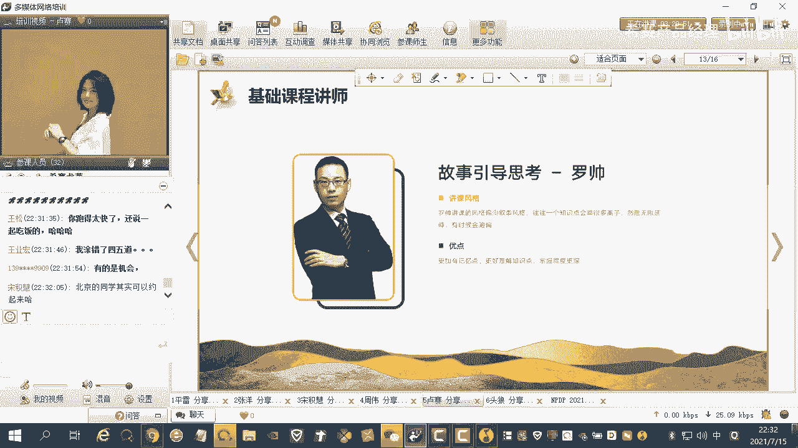

帮助我们理解的，然后龙辉老师就是直接要害他，最多的是嗯讲的是知识点的总结，还有就是嗯还有一些就是答题技巧，还有一些关键词，对这个龙葵老师的课是一定要听的，我一般就是说龙辉老师上直播课的时候。

我都会去听一遍，然后我呃上上完课之后呢，我复习的时候我还会再去听一遍回放，就龙辉老师的课啊，对这个我觉得还是你对我的帮助挺大的。

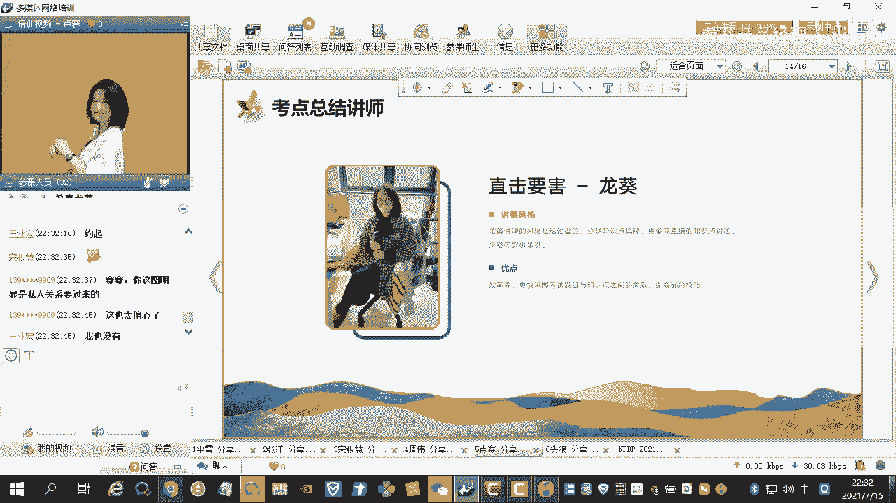

然后最后一点还是说，我怎么把龙辉老师整崩溃了，就刚刚我也有提到了哈，就是爱钻牛角尖，老问龙辉老师一些很细的问题，刨根问底，我就觉得我不理解，我可能就嗯我就觉得我没有安全感。

但是有时候哈这个就不用过于纠结，要结合场景，就是揣摩出题人的用意，把自己练到就算你读不懂题，你也能全对的境界哈，就是这点很重要，我是做完模拟6号，我是考试前的，就515月55月初吧就开始做模拟模拟题。

然后当时做完模拟六嗯，我都在训练我自己这个这个能力哈，就是嗯一直在揣摩这个题为什么这么出，他到底要考我什么，他为什么他会以哪种形式去出，我就会去思考这些问题啊，对你看解析的时候。

其实你也可以把这些问题都已经反推出来了。

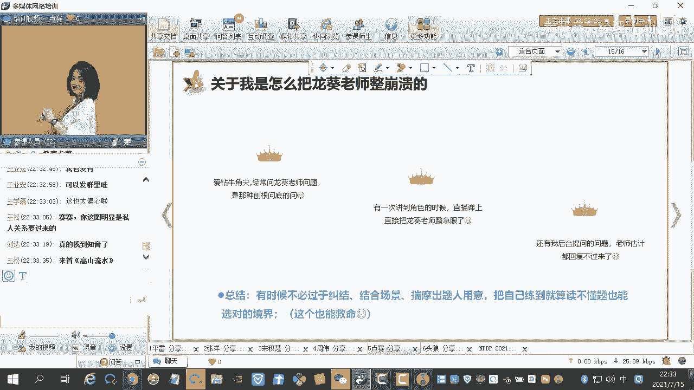

就这一点是嗯非常重要的，ok ok，行我的我大概的东西可能就是说那个音量变小，我讲的也比较累哈，可能不知道大家听得怎么样哈，嗯就是就是谢谢大家的聆听哈，做未来要考试的小伙伴都能取得好成绩啊。

如果有什么需要交流的，咱们私下再交流，好的好的行，感谢卢塞的分享，确实确实可能是设备的问题啊，但是啊听着还是挺精彩的，就是要要仔细听一下啊，但是后期你去回放的话，应该是没有什么问题的。

那这边的话我就把你的音频和那个视频关了哈。

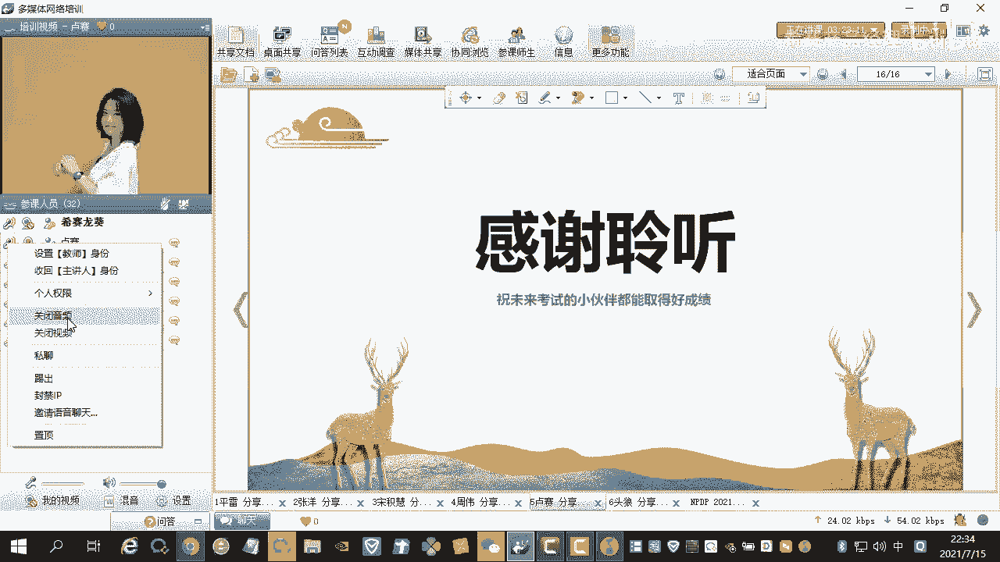

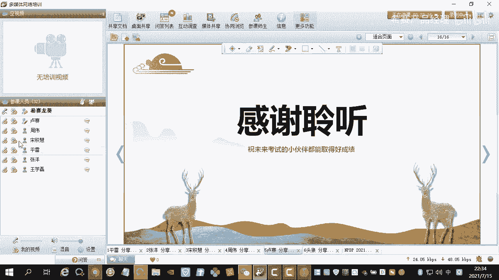

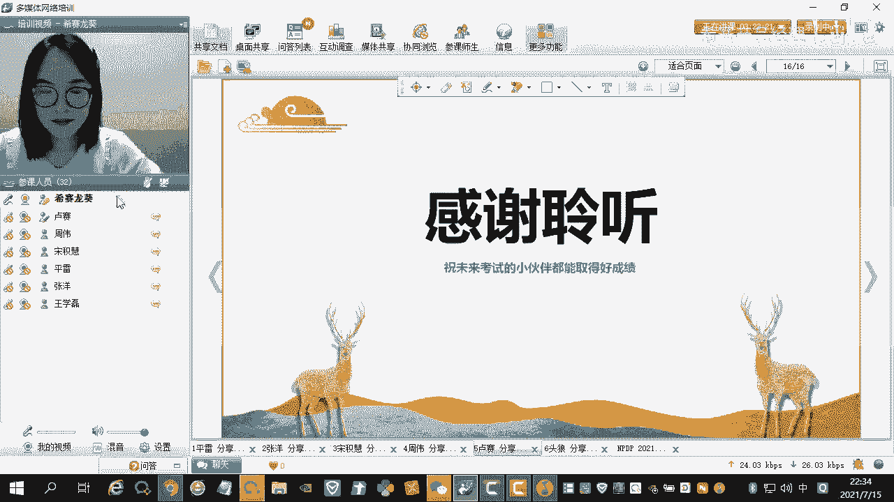