# NPDP2105班优秀学员分享-姚真 - P1 - 希赛产品经理 - BV1Fx4y1g7NC

嗨大家好，现在七点钟了，那我们今天分享会就开始了，首先我自我介绍一下，我是np dp的小希雅老师，之前是用丹丹老师的昵称来陪伴大家，度过了5月npdp考试冲刺阶段。

对于今年参加11月np dp考试的学员们，小溪老师是会全程陪伴的，在学习中遇到什么困难，随时可以私信我，有问必答，看到必回，今天的分享会主要内容就是，和大家分享一下优秀学员。

他们在学习过程中是怎样学习的，怎样去高校学习的，我经常听到有学员对我说，哎呀小西老师，我实在是太忙了，我经常出差全国飞，但是完全没有时间抽出来学习，其实我们所有的考生大部分都是在职考生。

很少会有去脱产来学习的，大家每天都是24个小时，就算你996工作，每天工作12个小时，睡觉八个小时，是不是还有四个小时可以用来学习，是不是还有周末呀，我们这次最高分的学员是侯梦瑶学员，他是考了181分。

他但是他这次为什么没有来参加分享会呢，就是因为他其实他自己本身工作也非常的繁忙，今天也没有时间来参加这个直播，也没有时间做准备，正在辛苦的工作中，那我就给大家转述一下他的一个学习方法，学习经验。

反反复复看了三遍，基本上龙葵老师的每一节课，他都会去倍速看回放，因为他没有时间上班，因为这个时间点他都是没有时间去来听直播课，因为这个时间点他都上不上班，但是他会把每一节课回放都看过一些重点。

他自己也会截图，然后留意一下题库，题目至少做了两遍，在考试的时候，考试之前他会把错题全部回顾一遍，小册子随身携带，有时间他就翻翻看，他是从考前两个月才开始备考的，工作之余就是每天只抽出1。5个小时。

一个半小时来学习，是不是听着很普通，但是人家就是考了181分的高分，还拿走了我们1000块钱奖学金，我们西塞是有奖学金制度的，每一个180分以上的高分学员，都可以带走这1000元奖学金。

有同学会不会觉得哎呀200分的考试，150分就通过了，还都是选择题，是不是不用花心思就可以通过了呀，特别是之前一些考过pmp的学员，就说我之前书都没看，就刷了两套题，一下就过了。

是不是觉得n p d p考试也是这样，可以同样操作的等等，老师不小心啊，老师要郑重的告诉你，千万不要抱有这种侥幸心理，我们学费是加上报名费总共需要8000块钱左右。

每年都会有那种就是之前通过的pmp考试，来参加np dp冲刺考试，但是冲刺但是冲刺不成功，我们要抱着一次通关顺利上岸，踏实复习，拿走奖金，高分，通过npdp考试心态，自我介绍和开场白就说这么多。

那我们简单来看一下今天整个分享会，分享会的流程，今天分享会最重要的是家庭分享，还有就是我们的一个pdh和pdu的赠送，当然最重要的就是我们的抽奖环节啦，我们会有三轮抽奖活动，每一轮奖品我都很丰厚。

昨天没有抽中的，今天来试试吧，今天的竞争压力可小多了，还有有同学关心暗号的话，暗号现在还不能说，等咱们时间到了的时候，老师会告诉你们要在屏幕中打出暗号去截图，找对应的班主任和销售老师。

最好是能直接填到那个收集表上面，今天来听直播的都是我的家人们，都是我的铁粉，总之今天所有的奖品和pd u p h，都会发送到位的，好小希老师会让你每个学员都收获满满，接下来的话我给大家介绍一下。

今天分享会的嘉宾，今天分享会是由这六位同学，给我们带来他们的学习经验，首先我们来看一下我们的姚琛同学。

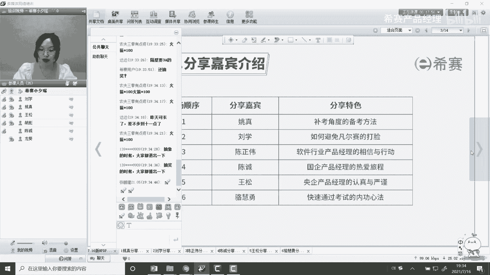

姚琛同学他的课非常有特色，它是从一个补考的角度来告诉我们备考经验，我们来具体看一下好不好，第一轮暗号呢就是在这位嘉宾分享之后，我们就会发布暗号，大家耐心等待一下，好不好啊，等一下对。

是的是从补考经验开始看哦，姚琛同学，他是从事to b行业工作10年了，现在主要是做一个汽车行业的产品，规划和信息化规划工程。

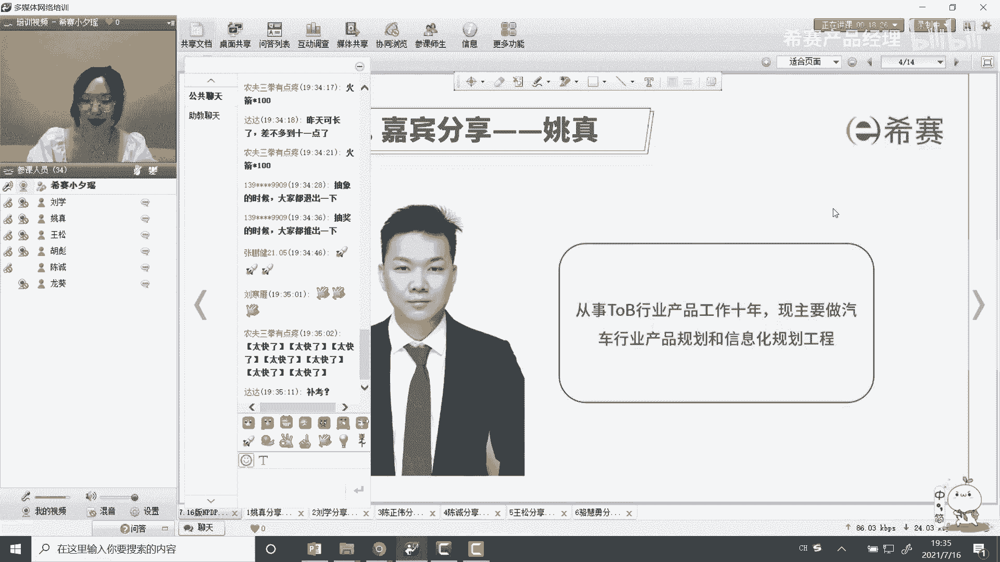

那那个参加各位参加那个nb dp那个备考的，各位小伙伴大家好，我叫姚琛，然后的话我觉得就是我这边的一个分享的话，其实可能更多的是一个反面教材哈，然后的话就是给大家做一个，反面教材的一个分享。

我理解是这样的一个情况，因为确实是我这边是属于补考才经过的，才才才才那个考过的。

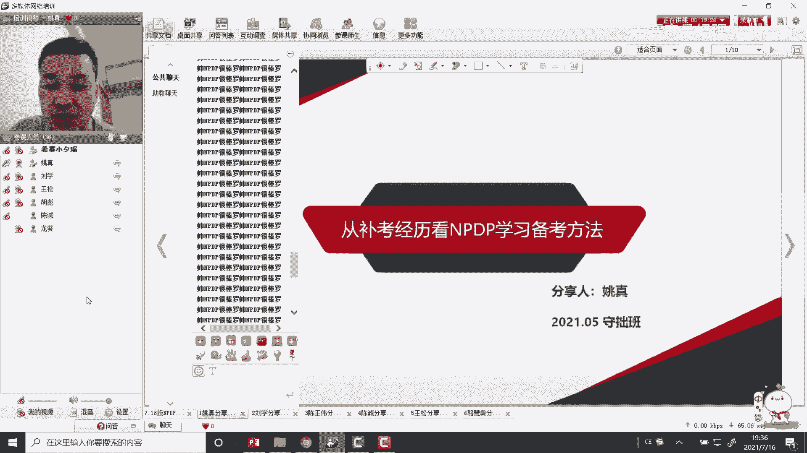

那我这边开始我的一个分享，就是我这边的话，主要是目前一直在从事这个产品，也是一直在从事这个产品行业，从事产品行业的话，但是可能更多的是属于一个野路子，成长呢，就没有经过正规的比较体系化的这种。

产品经理的一个培训，那以前的话都是在做一些这种偏软件行业的，一个产品规划，那现在的话，那再往这个智能座舱的这种软硬体的这种产品，规划这个方向上去转，那希望的话就是有小伙伴是在跟同一个行业的。

那我们可以加个微信交流一下哈。

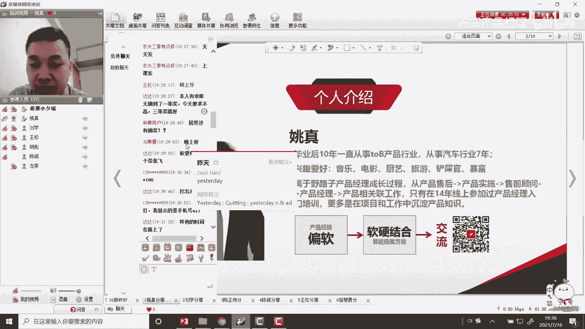

然后的话接下来就是我的一个正式的一个分享，一个情况哈，然后我这边的话呃，两次考试的话，上一次考试是147分，然后的话这次考试是100呃，170分，那这个的话是是属于怎么说呢。

可能跟自己的一个呃经历有一些关系吧，因为基本上以前考试的话也基本上都是呃，这种情况都不是第一次，然后基本上没怎么考过，然后的话在经过第二次考试的过程中，然后在对自己的一个反思和总结。

然后的话基本上是能够通过的，那当，但是希望的话就是参加参加培训的学员的话，希望大家还是一次就通过吧，哎呦不好意思啊哈嗯。

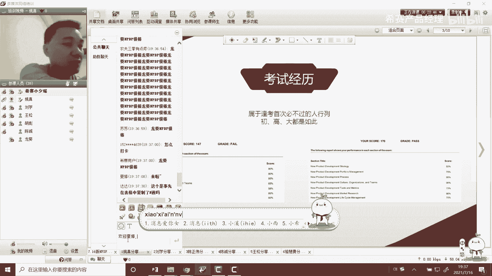

然后的话我这边那个学那个学n p p的，一个初中的话，我基本上是有两个两个维度，然后第一个的话是其实是希望的话，更更多的是希望是能够去通过这个学习，去掌握这个产品的知识体系，然后和相应的那种方法论。

然后的话哦147没过多少能过啊，一一百50分能过啊，150分能过，然后的话还有一个的话就希望就是拿个这个呃，n b tp的这个产品经理的这个资格证书嘛，也算是对自己的一个职业有有一个从业资格。

有一个证明，那基本上当时的一个学习初中是这两块。

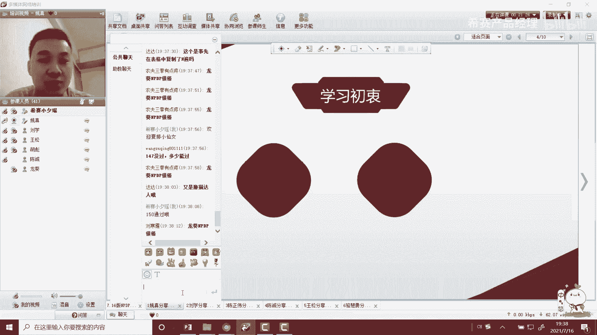

然后的话呃对于两次备考的话，我这边的话大概梳理了一下，两次备考的一个经历，然后的话就是呃在上一次没有考过的，这个期间的话呢，其实我觉得个人的准备工作其实是非常不够的。

因为因为因为这个小红书是非常非常重要的，但是他这个小红书的话，我当时在第一次备考的时候，基本上是指看了1。5遍左右，而且还不是不是特别精读，那讲义的话，这边基本上是精读了一遍，那同时的话。

其实本那个按照这个老师最开始的一个学习的，一个建议的话，那其实这个这个知识的话需要自己去整理，从那个思维导图和这个p p t材料这些东西，那其实我这边其实也整了，然后同时呢。

对于这个对这个培训的这个直播课的话，那我这边的话好像基本上是没有参与过，然后都是通过这种视频回放的，这种方式进行去查看的，然后还有一个的话就是在这个备考的过程当中，就是做题这一块的话。

那第一次的话基本上更多的是背题，就是做题，然后通过做对呀，然后做错呀，然后把这个做错的这种题目进行背下来，通过这种方式，那基本上这是第一次第一次的一个备考经历，那一个第二次的备考经历的话。

那我理解的话就是可以通过这两次备考经历，看出来一些区别哈，然后第二次备考经历的话，那基本上就是这个np dp，然后这个小红书其实是做了一次精读，包括这个呃，包括这个培训讲义，那在这个坐骑和这个呃。

这和这个小红书这一块的话就是有一些区别，就是在做题这块的话，基本上是更多的是循环做题，而且做题的过程中跟第一次有些区别，第一次的话，基本上更多是希望是说通过这种背题的方式。

然后通过那第二次在做题的过程中，其实是针对每一道题错误的，然后都是会回到这种小红书里面，然后包括其实也包括讲义里面去查看，翻阅相应的这种知识点，然后对知识点进行去呃回顾进行去深入了解。

然后再反过来对这个对这个对这个题目，然后的话去做这种知识面上的一些掌握，然后的话再通过这种反复的方式。

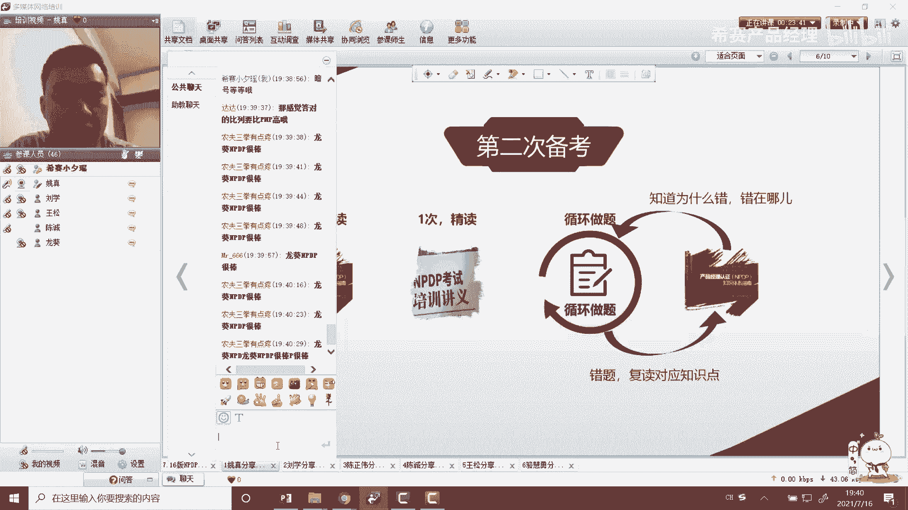

然后来去呃来去进行去备考，那通过这两基本上这两次的呃就是补考和备考，补考和这一次考试这两周的一个感受，我理解的话，其实是从这个感觉上是有一些共通的，就是两次考试过了，考试之后都觉得哎应该是能够考得过的。

但其实第一次考试的时候其实没过，这就是基本上差三分嘛，然后就觉得其实也是蛮打脸的一个事情啊，然后其实在就是我理解的话，希望就是说大家还是能够按照老师的一个步伐，然后的话以及包括这个老师的一个建议。

然后去备考，去去学习，因为的话其实在这个没有考试，其实对自己的心情还是会有很大的影响，而且的话在补考试过程当中其实也是蛮耗时，而且还费力的，而且其实相当于是说你补考费，还有一大笔的费用。

那其实在这个补考的这个查看的，这个结果的过程当中，其实对于和第一次相比的话，那其实的话就是这种紧张感，或者是这种压力感其实会更大，因为的话你基本上相当于说你如果不考，这没通过的话。

基本上1年的时间就浪费浪费过去了。

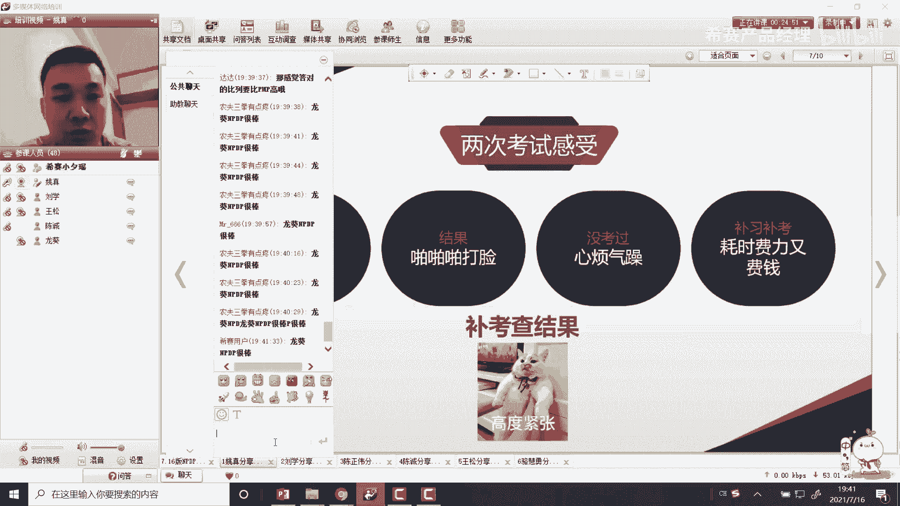

那这是两次一个考试的一个感受哈，那我理解的话，就从我个人的一个今天来看，今今天来看的话，我理解了两次备考，其实是有几个比较不一样的这个点，我觉得第一个点的话其实就是就是这个小红书，包括老师的这种讲义。

然后的话我理解的这个东西其实是需要精读的，而且的话精读一定要够，因为的话基本上我第一次精读，第一次才读了，读了1。5遍，那其实我理解的话，其实就是在很多是停留在表面上。

然后对这个知识的这种深入学习其实不够的，然后第二个层面上，我理解的话，其实可能很多人在这个呃备考过程中，可能没有太多的时间进行去学习，那可那可能很多人，包括这一次考试也有蛮多人挂挂的啊。

然后可能更多是希望通过这种背题的那种方式，然后来去希望能够去考过，但是我理解的话，通过两次的感受到，我觉得这个可能这个这个背景可能是要不得的，然后的话是希望是，最好是能够在这个练练题的过程当中。

然后的话和这个书本和讲义，然后进行结合起来，然后对这个知识点的不断的进行巩固，然后要做其是通过这种做题的方式，然后来巩固知识点来学习，而不是通过背题，那第三点就是练中有肥顾。

就是可能在在备考的最后一段时间的话，可能大家都没有太多心思去看书哈，但是我理解的话，在这个过程中，其实在这个循环循环练习的过程当中，然后也需要不断的知识点进行去回顾，那这个的话是两次备考的一个区别。

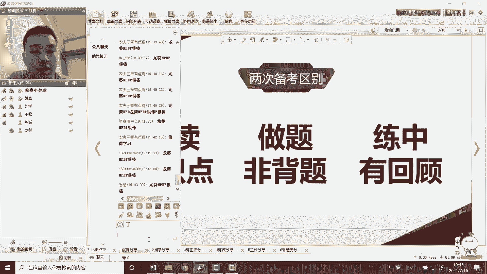

那我理解那同时对这两次备考，那个我自己的一个感受的一个建议哈，那我理解的话，其实呃上面三点的话是我自己的一个感受，然后以及就是对于这次参加培训的，小伙伴的一个建议，我觉得就是第一。

就是不管是通过这种小风吹也好，或者是这种或者小红书啊，或者是在这种讲义也好，或者是自己整理这种脑图也好，我觉得的话就是还是要去掌握到知识点，在知识点掌握了，那其实在做题过程中，包括这种考试的过程中。

那其实就会更有信心，然后的话也能够考过，第二段话，我理解的话，其实从嗯第一次这个备考过程中，其实我更多的是服务一些表面的层面上，然后没有去深入静下心来，深入去了解这些知识点。

那我觉得这个可能是我在第一次考试过程中，然后被挂掉的一个原因，那第三个的话我理解的话，就是这个学与练需要去结合，这个结合的话可能不是说咱们考呃，那个学老了之后，然后把这个书本放到一边。

然后的话就通过专门练题的方式，然后进行去去备考，那我理解的话，其实在这个过程中，更需要就是通过那个模拟练题，模拟和这个呃和这个学习相结合起来进去，去巩固知识，然后进行去备考，那同时的话我理解的话。

因为从我个人感觉来说的话，因为我两次考试基本上都没有去按照呃，很好的按照老师的一个建议，学习建议，或者是说规范，然后去进行我理解的话，其实从我个人层面来说，应该是属于一个反面教程的。

那其实也希望大家不要这样去做，那还是觉得还是需要去说，在在这个两个月或者三个月的，这种备考过程当中，还是紧跟着这种老师的这种培训节奏，然后和这个备考的这种步伐，来来来来。

准备咱们这个a b n p tp的一个考试，那这个的话是我的一个呃整体的建议。

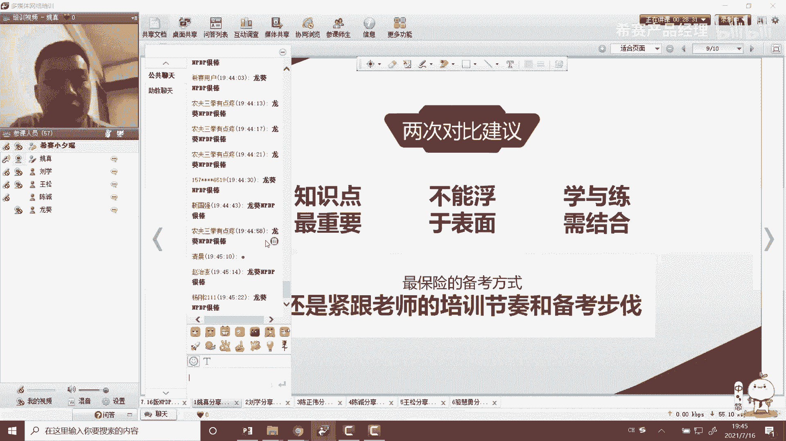

那通过本次这个分享的话，那其实还是希望说能够参加参加培训的，各位小伙伴，然后的话就是经过这可能到11月，11月份几个月的一个时间，还是希望是说能够一次性通过吧。

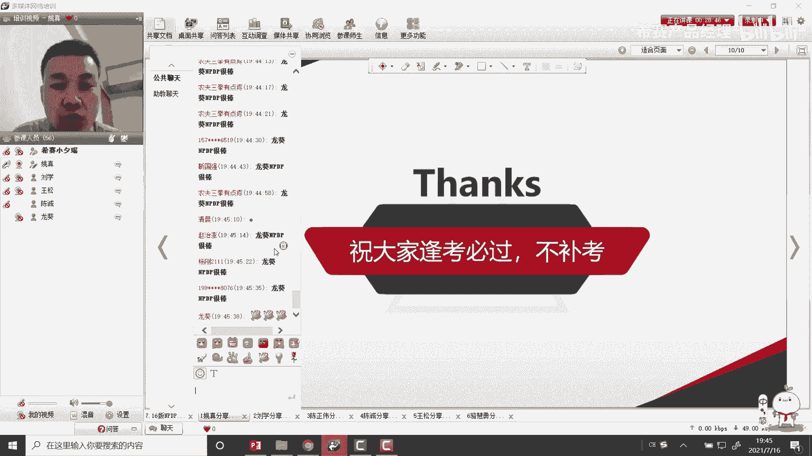

然后补补考，然后谢谢大家。