# NPDP2105班优秀学员分享-王松 - P1 - 希赛产品经理 - BV1xD4y1p7hv

张同学，他现在是在某央企开发部做一个部门经理，做事非常严谨。

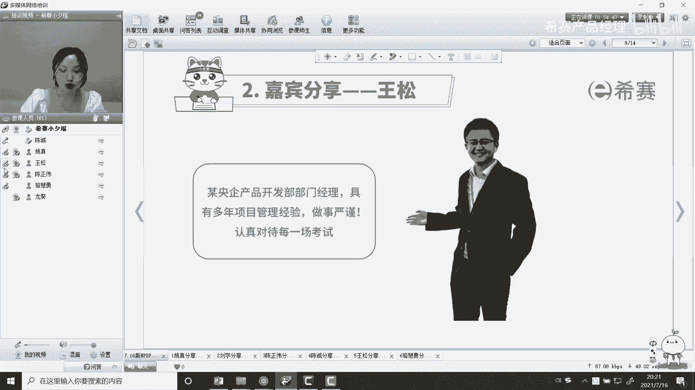

认真对待每一场考试好，王松还是按照西塞的节奏来啊，已经学完了嗯，各位小伙伴晚上好，欢迎来到现在专业的在线教育平台，我是今呃今晚2105首都班学员啊，王松啊，今天给大家分享的就是。

我的主题是认真对待每一场考试。

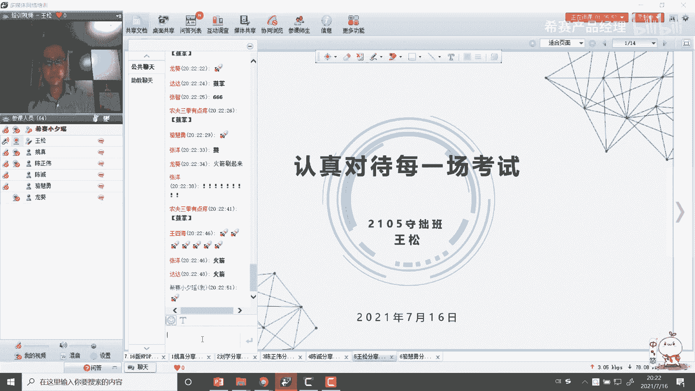

啊这是一个简单的个人介绍啊，啊因为我本人是做那个城市轨道交通，这个行业的啊，就是地铁啊，这个应该每个同学都不陌生啊，现在见到那个我们的一线二线三线，可能三线城市现在应该是建地铁了啊。

我本人从事这个行业的话，时间也是比较久吧，17年了，17年了嗯啊然后在证书这一块的话啊，目前是两个证书，这一级建造师，这个是我17年考的，17年考的啊，是机电专业，然后时隔3年，就是基本上18年。

19年和20年啊，这3年的话因为工作的原因啊，基本上就是没有什么产出的啊，这后面我我也会提啊，也没提这个，然后这就是np tp这个n t p p，这个是在西赛考的，我个人也谈不上座右铭啊，就是我为一只。

你看我的网名叫在路上啊，我是很喜欢这句话的，一直激励我前进啊，说过永远在别处，鲜花永远在前方，我们永远在路上。

没错我不是在考证，就是在考证的路上，啊啊首先我们谈一谈这个准备工作，对于我们那个很多即将备考。

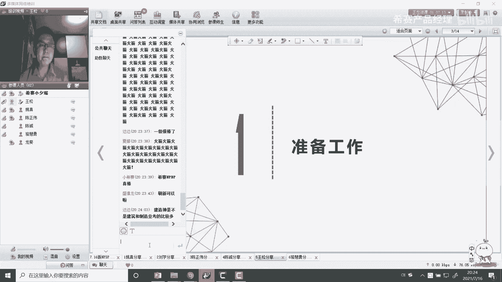

n b tp的学员来说的话，其实准备工作是非常重要的，那我们看一看啊，首先第一点我的理解是你得明确目标，做任何事情的话，一定要目的性非常强，我我定的目标是要一次性通过，技术是一次性通过。

然后当时我考一卷也是一样的，这个非常重要，一定要速战速决好，我后面写的时候报名费很贵，这个啊这个是个玩笑话啊，这个报名费只是我们看到的一个啊，一个那个就很直接的一个数字，一个成本。

你第二次你不仅仅是你不考的报名费，还有你的时间成本，这也是很大的一个成本，所以说我的建议是，我们既然要决定要报名这个的话就做好准备，背水一战就得一次性通过，为什么这么说啊，因为以前我们备考意见的时候。

当时我们也曾有一个同学啊，当时很年轻，当时是25岁吧，当时他就跟我说，他说我是来试水的，当时我在建议我说你不要试水啊，我说你试水的话，可能你你这个心态有问题，你在准备的话，你动力不足，果不其然。

他试了5年没过，最后放弃了，从25岁，10~30岁，所以我建议说，虽然np tp跟那个一件不一样啊，我之所以说啊认真对待每一场考试，我们不要去，我们只要报名任何一个考试的话，首先你得重视他。

不要听别人说啊，什么简单啊，这个简单帮我报np tp的时候，也有人跟我说过啊，你一件都过了，这个没问题的，还好还好，我还算是比较清醒的，因为这个它毕竟是不同的考试啊，不存在说什么简单很难，你能考过。

那就是简单，你考不过的话，它就不简单，所以第一点是目标已经定好，目标就得就是要一次性通过速战速决啊，啊这是我先给那个给在座的，就是即将备考n p tp的同学啊，如果这个你没有考虑好的话，我不建议你报名。

这是第一个，第二个是心理准备啊，就是备考期间的话啊，我建议是要放弃一切的娱乐娱乐活动啊，这个也是一个啊，看你能做到自律，这个确实挺难的，我可以谈谈我的m tp备考啊，我是今年是1月30号报的名。

当时找到那个西塞的那个销售老师，30号报名，我为什么选择西赛呢，因为以前我就听说过西塞，这个做软考是非常有名啊，满级学院啊，其实当时一看我在那个当时在qq群上找找了，我找了十个群，全都是西塞。

全都是西塞的群好，那就选择他了哈，还有老师给我推荐好，我当时我就进那个呃西赛官网一看，当天下午记得很清楚，应该是龙葵老师在给长虹班吧，在讲直播课，但是我们进去还没给他们买课程吗。

我看会儿龙葵这个印象是非常好，你知道为什么吗，因为我本人是仙剑迷，你知道吧，龙葵是仙剑三里面的一个角色啊，我非常喜欢这个角色，那刘诗诗演的龙葵，龙葵的话啊，他是这个他的特点是什么，他是非常爱护他的哥哥。

知道吗，龙阳就是胡歌演的那个啊，这个大家感兴趣，后面可以看一看啊，我感觉的话就是说哎我这个印象是非常好的，我一定要上轮回的课啊，那就是我我不知道轮回是谁啊，这一个啊我就报名了，报名了。

就是我真正学习的话，从2月1号开始，大家知道2月12号的话，是那个是2月2月12号春节吧是吧，当时其实我前面直播课我是错过了几次了，后来我们补课嘛，我在春节之前基本上把把那个课都赶上来了。

后面呢我们基本上就全程跟着直播课啊，来来上了，就是说我的心理准备，为什么要放弃一切娱乐活动，这我真的做到了，为什么说我做到了，我刚开始报名之后的话，当时按照现在的建议的话，是先来看那个980视频。

就罗帅讲了个视频，980视频啊，这个视频的话非常好，因为我当时备考报名比较晚，我春节期间的话，除了大年初一没有听楼下的视频的话，我基本上大连算是晚上我都是边看的那个哦，谢谢那个奎哥送来的大火箭。

那个我们那个基本上是那个大年30的晚上，我是边看春晚，然后边看模特那个980视频啊，这是没骗大家啊，并且的话是在后面的一些假期啊，啊什么清明的三天假，然后在五一的五天假基本上是没有，就是没有休息的。

我感觉我的假期比那个平时还累，为什么呢，呃如果假期的话，我基本上每天投入的学习时间的话会到啊，感谢夏天啊，会到那个呃12小时到14小时啊，这我跟龙老师有过交流的，没声音了吗，没声音吗，有没有声音。

有是吧啊，好感谢观光啊，感谢观光，基本上是这样，所以我建议的话，就是说大家一定要做好心理准备，我要决定考这个试的话，我就要一次性通过，一次通过的话，你一定是要有所牺牲的，好流动来了是吧啊。

那个第二个第三个就是资料准备，资料这块的话，基本上你报名那个西餐就会送你一本小红书啊，啊这个书就是我们的教材，这本书是一个宝典啊，一定要好好的看啊，不要认为说刷题不看书啊，就可以通过，那样很危险。

我只能说那样很危险，再一个就是这个如何准备np tp考试这本书，这本书的话建议看一看就可以了，这个题目的话你不用就是说过于纠结，因为这个答案有很多错误的题目，答案很多错误的，再一个就是歇菜讲义。

这个歇菜讲义就是那个我第一个报首周班嘛，啊龙葵老师做了个讲义，这个讲义是非常非常好的，没有一句废话，所以说我建议就是说啊资料这块的话，一个小红书教材，一个龙葵这个讲义要逐字逐句的去读，一定一定要多读。

在第四个就是那个分享视频，分享视频的话就是啊因为我去年看过啊，皓月版视频啊，我刚刚报名时，皓月版视频的话，那个有那个很多优秀学员啊，其实给我印象最深刻的是一个老大哥啊，叫张磊，60岁了，讲的非常好。

他虽然看着60多岁，但是我看他的精神面貌的话，像40多岁一样啊，非常好，他他给我的那个嗯，当时我看他那个视频的话，我这个说过了是很大的，不仅仅说是考证这一块啊，我说你有60岁都能通过嗯。

那我们根本那更没问题，对不对，人家心态非常好，那第五个的话就是这个考试的话，像我们一般都是有家庭，有孩子啊，还有工作，所以这个一定要取得家庭的家庭的支持，因为考试的话你是要投入一部分精力的啊。

大部分经历的就这一块的话。

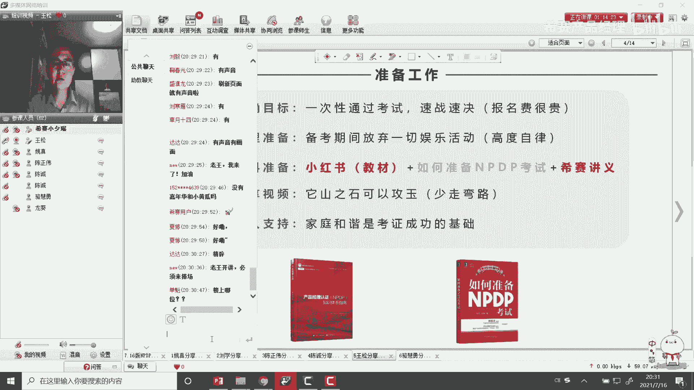

就是我的这个准备工作这块的一个建议啊，第二个是备考计划，备考计划呢我现在这样啊，任何事情的话都是凡事预则立，不预则废，我希望的话，我们都是一个有一个结构化的一个学习方法啊，也就是说我们还是不要去打乱仗。

这一块的话，其实这个也是做的很好的啊，我这也是结合43那个怎么分四个阶段，四个阶段，第一个阶段就是入门阶段，就是预习，刚说的第一个是9804频，快速过一遍，快速过遍，就什么快速过一遍，不要纠结。

你可以那个啊1。2倍速或者1。5倍速啊，这罗老师讲的视频啊，这个视频应该是在那个喜马拉雅上也有音频，如果就说你不方便看视频的时候，你可以听听音频，你的耳朵呢摸耳朵，比如说你坐地铁也好，你开车开车的话。

你不见你看视频啊，很危险啊，你听一下音频是可以的，然后是在你的那个碎片时间是吧，你不方便看手机的时候，你听这是非常好，920视频一定快速不一遍，第二个的话就是小红书又要也要通读一遍，这个通读的话。

第一次通读的话，不要那个啊，不要这个以逐字逐句的去深入理解啊，就快速过一遍这个这个这里面字里面都认识，包括英文，包括中文的啊，约好的同学吐槽过这个小红书啊，和每个人的感受不一样，我认为这个树挺好的。

我当时第一次我拿到这本书的时候，我一读可能有我自己也是做这个产品开发啊，我读完这本书之后，读完前两章之后，还有怎么还有这么好的书，跟每个人感受不一样啊，但是我后来在第二次下读的时候。

慢慢就开始有挑刺了哈，可能有点挑刺了啊，但是我觉得这个书怎么样写的还是不错的，你要我写，我写不出来对吧，所以咱们不要去吐槽教材，因为他他就是我们考试的那个就是呃源头啊。

是我们这个知识点全是来源于我们的那个教材，这个一定要快速过一遍，这一遍的话就不求你要建立这个印象，很深刻是吧，深入理解，快速过一遍，但是过的时候要带着任务啊，就是每看完一章的话，能画一画思维导图啊。

思维导图你现在不要去看那个就是老师发的，或者其他同学发了个思维导图啊，你像就你自己的理解不用去画，不用去管它画了，对不对，有没有漏项啊，先画一遍，画完之后你再来对比啊，关于这个话的话。

把这个我想把这个螺栓也那个也谈谈，我对楼上的感受啊，投票的话他就听到在酒吧营视频的话，我觉得是很适合入门的啊，讲的也呃那个通俗易懂啊，对那个论文来说是很有帮助的，并且的话还有一个罗老师的话。

就是他这个拓展课讲的非常拓展课啊，他说他知识面比较广啊，所以也是有很多证书啊，也是一个有有经历的啊，有阅历啊，有故事的男人啊，我这么说啊啊大家跟那个就说你考完证书之后，你可以多听一听罗算的。

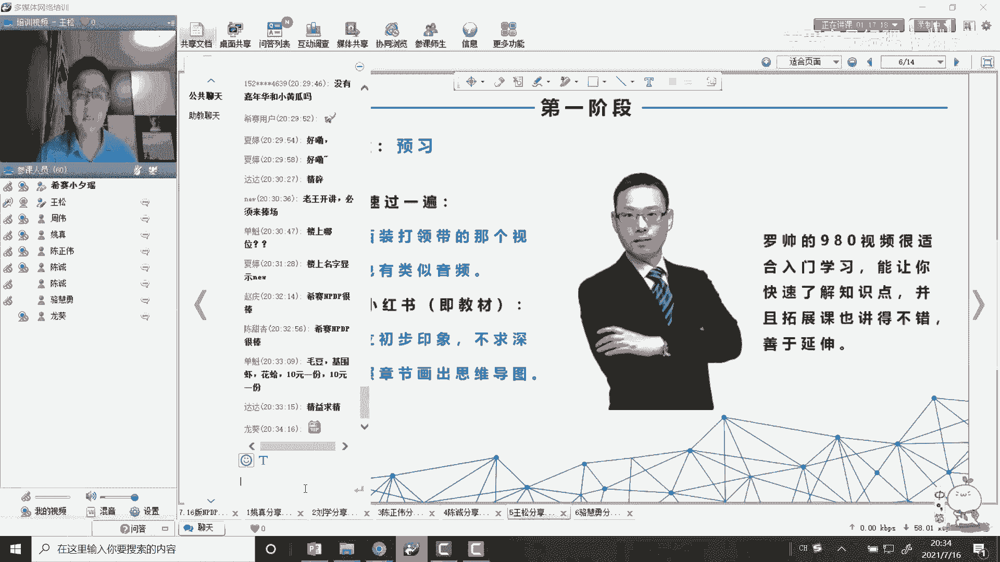

他的这些拓展课，可能对你工作的时间是有帮助的啊。

好我们看这个第二阶段，这也是我一个核心阶段啊，这个非常重要啊，第二阶段是我们的直播课加做题阶段，这右下右下角这个美女啊，我隆重介绍一下啊，你们可能有的同学今天因为龙和老师没上麦啊。

要不我们来看看这个美女是谁啊，这个美女就是我说的龙葵，龙葵看到没有，很青春，很阳光，很有活力，但是因为她是一个弱女子吗，她不是，你看我这都我的评价是什么，西塞龙葵哥啊，人美化解读啊，废话从不讲。

全都是干货，你不说别人，我这打油诗啊，这不是啊，这不是打油诗，虽说他是个打油诗，为什么卡特能不开盾啊，他虽然是个美女，但是这个这个老师啊，他的性格就是非常严谨，非常那个做事非常果断。

毕业讲课的话就是那种能够直击要害，你知道吧，就是很犀利，并且的话针对你的考试是非常有帮助的，以知识点呢知道为什么他话多了话多，虽然还没讲废话啊，你们那个听课就知道他讲的每一句话的话，都是有有有含义的啊。

都是有道理的，这个你们那个后续上课吧，可以慢慢去那个哎是是之前的微信头像，你没保存吗，他现在换了是吧，我保存了，所以我就跟你们这个用的是不一样的啊，特别是嗯他讲课的这个讲义啊，讲义上有些内容的话。

其实啊不全为什么，因为他讲课它不能完全照着响应变是吧，这就是有有时候讲课会有展开的内容啊，所以这个时候很多小伙伴的话，就是说哎呀我很少上直播课，我就听不摸，其实你听不摸的话啊，我这个我也不反对啊。

因为毕竟是不是所有的人，在一个七点半到九点这个时间段，都能够正常去参加那个直播的啊，就后面也会提的啊，我建议尽量参加直播，因为龙岗师的直播课的话，我觉得还是那种互动的那种氛围，还是非常非常好的啊。

至少我认为还是比较比较适合我的啊，啊能让我这个在学习中的话，逐步逐步的得到进步，如果平时在学习过程中，会跟他的互动也挺多的啊，啊我们也我经常也会跟他请教，探讨一下我们的学习方法什么之类的啊。

如果这个老师好，还是非常啊非常有自己想法的啊，为什么说要听直播课呢，因为直播课的话，他也有那种参与感和适度的紧迫感，不像你是那个啊录播课，录播课里站在上帝啊，上帝视角啊，你得看。

但只不过的话你感觉你就是其中的一员，你参与进去了，特别是只不过这种刷题的时候，你知道吗，大家刷刷刷老师一周多啊，同学们给出答案，那个时候你有那个时候你无论你是对还是错啊，但是你赶紧去参与进。

他们就是其中的一员，你知道吗，而且在事后你再回忆起来的话，你回回忆这些知识点的时候有画面感啊，你也画那个我一直在直播课，认识了很多很多很多很优秀的同学啊，如果直播课的话，我后来不仅仅是听那个首周班。

因乘风班我也经常去，要不然我们可能认识一下什么尚奎啊，陈洁净啊，啊张扬啊，这些很优秀的啊，很优秀的同学啊，上回来了哈，陈列印作文峰来了吧啊张扬小狮子供应，你来了吗，张斌来了吗，啊林记读理解出来了吗。

啊金正官来了哦，好的好的，感谢啊，守着关了，隔一位来带来了没有，隔一位好，夏婷夏婷老子会用文章里来了，李慧芬来了吗，刘浩唐宇浩，刘帅，邓晶晶，黄伟，郭万毅，李健来了吗，这已经是课前点名了哈。

在在这里面那个找一找那个感觉啊，都在是吧啊好的好的嗯，这个直播课跟大家强调一下，能参加尽量参加啊，好吧，能能参加尽量参加，真的是对你会有帮助的哈，你想想吧，你看春晚的话，你在现场看直播。

或者是你作为一个演员上台去表演，和你在电视机前，你去看看那种直播或者录播的话，那感觉是不一样的对吧，但这个直播一定要坚持啊，坚持到你考试啊，一定要坚持到考试啊，我记得我有时候去上那个长虹班嘛。

长班那个课程有时候我喜欢也喜欢刷一刷嘛，我跟上课一样啊，我们都很活跃啊，说一说龙辉老师，有人自己说，他说王总，你这一来我我现在我都有点迷糊了，还是在首周班的课哈，主要因为经常会去上上课嘛。

我看着一般有他讲的课，我都会去啊，第二个的话就是我们要精读小红书啊，这是第二遍精读小红书，它是通读啊，这是精读小红书，并对照直播讲义做好笔记，这个我再解读一下啊，这是什么叫精读，精读的话。

这个时候就真的要逐字逐句的读了，就一句一句的品啊，对照对照直播讲义是龙葵那个讲义，这个讲义怎么来用啊，这个时候我跟耿俊伟我们探讨过啊，因为耿俊伟是非常非常严谨的，他今天可能是没来啊。

他他那个笔记啊都是手抄的，他把龙葵讲义全手抄出来，这点我没做到啊，这点我承认啊，他做的比我好，因为我没那么多时间，这个讲义的话就是说你可以对照视频啊，你边看书嘛是吧，然后这个这个这个讲义的话。

你可以对照他这个龙辉老师这个视频，你可以这个时候你可以放慢点速度啊，讲了一段你认为有用的暂停记一记，这个时候要慢下来，这个时候为什么不建议你快啊，不建议你快要慢下来，让自己沉淀一下。

总结一下老师这个话是什么意思，因为直播课的时候老师也讲过去了是吧，那当时你还有其他的任务是吧，你不可能断断续来写字的，一个字一个一个字一个字的写的，就是说我建议的话，大家这个时间还是要花一花的啊。

这个也有同学说这太浪费时间了，还把老师的讲义还写在书上，这不浪费啊，浪费时间了，不浪费时间，真的是有用的。

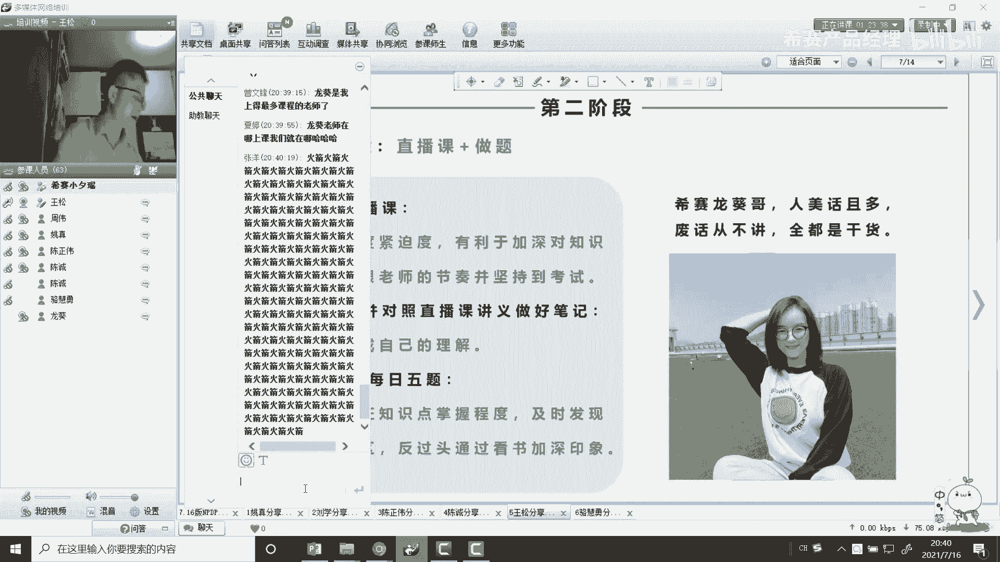

你看我，我再看看我这个这个书啊，我觉得随便挑一啊，这是这是第四章的那个几个角色啊，什么那个process这个限定是吧，嗯那个owner啊，manager啊，然后那个什么那个那个那几个角色的。

你做的第一页啊，这这只是一页啊。

我基本上是很多都有很多章节都有，这就把龙葵的讲义在我这下面都能得到体现，这个我看看第七章的，随便翻一下，这个其实挺挺耗时间的，我这基本上做这种讲义的话，是抄这种讲义的话，这种工作我会放到晚上。

晚上那个那个没有打扰的情况之下啊，我建议这块的话就是说啊，大家也可以就是说换几种颜色啊，我习惯这样啊，我习惯这样就换一种颜色，但这个我要感谢一下沉淀性啊，他给我推荐了一系列啊，24色的真的够用了。

其实三色就够用了哈，就是红色的系什么呀，绿色系什么样的，这我习惯这样，我这看到的话就是说嗯每次我翻书的时候，我知道这对应的是什么一个知识点啊，这个如果老师你要清楚啊，我每次的话就出差的时候有。

有时记上的话，就我虽然基本上是没有浪费的啊，我每次那个我都跟他打卡，诶老师我说老师你看同样的看书啊，要打个卡，也是我们群里会打个卡啊，像我们自己那个小伙伴，我们自己拉了个群里面外面打个卡啊。

我这里不是说去给大家去炫耀什么之类的，就是告诉大家的话，就是说诶我我我我在学习啊，我们一直在学习，因为说我们是一个团队嘛，这样也是一个相互的一个一个促进，相互促进，我基本上在飞机上的时候的话。

看这本书的话也是逐渐越来读啊，然后结合我做的笔记来看，这个一定有用，这个就是把书读厚的一个过程啊，是一定要记得理解，第三个的话就是我们的章节练习题，和那个每日五题，章节练习题的话基本上是一张啊。

就只不过上完之后今天按时做啊，专业电一体的话相对来说是难度没那么大，但是你一定要及时的跟啊，及时的跟进啊，这个每日五题这个非常关键，每日五题的话基本上是一启动之后，每天上午十点钟的话。

老师就会把这个啊五个题目发出来，然后在下午四点钟的时候公布答案是吧，公布答案，公布完答案之后啊，撤啊就啊，然后做了对的小伙伴，老师及时给你激励我，如果龙华老师这个作品很好，现在这个非常好啊。

他激励是及时的啊，这当我们管理上说的话，激励一定要及时知道吧，对吧，这样的话，大家之间就形成一个良性的一个互动啊，像刚开始我看完怎么可以，为什么天天都是都是都是全队呀，每天都老是给他点赞了是吧。

后来我就问他，但他画的公主比我们多，他会提前预习，知道吧，会提前预习他知识点掌握的很扎实，后来我们就开始反思自己哪做的不好啊，所以这个每日五题一定要跟着做啊，你不会的，你可以开卷，老师没有说你每日五题。

你必须把现场给答案是吧，老师没这么要求，你可以去翻书，找出你的知识盲区是在哪里，你可以去翻书啊，你可以问同学都可以，这都没问题的啊，啊这块呢我就是我做每日五题的时候，其实我很感谢王四海，四海来了吗。

都得感谢四海啊，我是看了那个四海这个笔记啊，我每次画找什么规律啊，我做每日五题之前，我先把四海这个章节的笔记看一看，正确率会提高啊，所以后来我就开玩笑的说嘛，我说那个每日五题不用慌啊，四海笔记帮你忙啊。

就他那个笔记做得好呢，不光四海啊，还有上葵啊，尚奎这个笔记啊，但是四海又不太一样，上回那个笔记上回是用excel，四海是那个ppt做的好啊，呃那个上回这笔记的颜值啊，真的是非常非常高。

我当时看了上回的笔记，我很惊讶，我说这是人做出来的笔记吗，啊后来答案告诉我，确实他不是人，他是神，就是大家都喊他善神，你知道吗，尚魁后面我会讲一讲啊，就我对上海上奎和王四海的理解哈。

我基本上就是我们的这个有时候交流，不仅仅局限于说是在这个考试啊，有时候因为我工作中也是做产品开发的，比如我需要一些什么呢，先把那些文档或者是一些书籍啊，他马上给我推荐出来。

所以我后来总结的就是上回是人形数据库啊，啊王思凯呢就是知识百宝箱，黄色知识百宝箱啊，这俩啊我们说两个知识叫两个宝藏，老男孩，那两个宝藏老男孩我昨天输了，那么开玩笑，完了再加上昨天那个张扬张扬。

昨天是22 22个证书的大神是吧，昨天上了那个那个西塞热搜头条是吧，不是你们仨先组个团是吧，抽不到对吧，如果想出道是吧，叫什么三人行必有我师，对不对啊，你们先那个把那个把这个知名度啊。

把那个那个品牌知名度啊，什么什么之类的，先那个搞起来，对不对，我再努努力，我争取过2年加入你们，这个加入你们的组合是吧，名字都想好了是吧，新赛那个f4 那个新赛n b d b f4 是吧。

可以一起看流星雨是吧，顺便带你考一个p dp是吧，陪你去看流星雨啊，对不对，这是那个关于做题啊，做题的话就是说做题的话不要错了就错了，要看完解析就完事了，还要反过来看书。

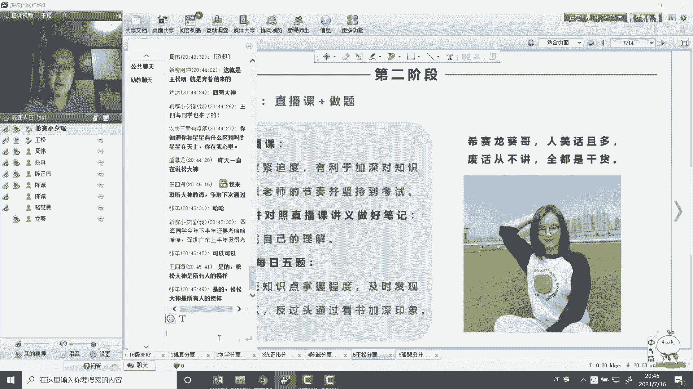

这个知识点在哪里懂吗，找出自己的盲区，啊再一个就是第三个阶段，这个阶段也很关键，这是串讲阶段，快开展阶段，就是那个讲模拟题和串讲这个模拟题的话，就是说建议大家都做完模拟题的话，现在模拟题分两类。

一类是那个学员版的，这个相对简单啊，你不要如果你刷完学原版，你就流弊plus了，不是这样的啊，不是这样的，你你刷学院版的时候，你会感觉啊这题目感觉我还行，你你可以刷一刷那个另外一个模拟题叫b做。

比如目前是六套，六套的话，按照这次考试完之后是不会更新，我不清楚啊，刚才那个陈政委同学提了，b组里面其实难度最大的是这个b座，b座四和b座六，特别是b座6b周六的这个计算题非常多。

b b座六个b做的话是有一点点难度的，那个b组三的话会肯定会更新啊，我谈到我们那个b组三的话，题目少1。75个题啊，但这个题目其实这个题库啊真的是非常非常好，但是我这个题库怎么用啊，是怎么来刷题啊。

题目一定要刷，就刚才那个呃那个龙辉老师也都没有要求，就是说你要刷到正确率达到5%以上，就是我现在的那个b组试题85%以上，你才有保障啊，这么提是有道理的，真的因为那个考试中的话，你也也是有很多变数的。

那么你这次题目会做的那个原题多，那下次我一旦一旦一旦原地不动呢对吧，我刷题的目的是什么，我刷题的目的并不是为了刷题而刷题，我刷题的目的是为了掌握知识点，对我的建议是至少三遍，至少三遍，那刷刷刷三遍的好。

把正确率当然如果两遍你到85%，那也可以对吧，这毕毕竟我们有时候都要说，都要那个白天还上班是吧，没那么多时间去做这个事情啊，没那么多时间去做这个事情啊，还有一点这个模拟试卷啊，一定要用考试模式。

它还有另外一个模式叫练习模式，你做一道题的话，就你学会出一个出一个答案，这样不好，你考试的时候你能马上知道你答案对错吗，对不对，你一定就像平时就按照那种一刷也好，二刷也好。

你都按照那种考试要求严格来要求自己，严格的要求自己，对不对，你严格要求自己，一定用考试模式来完成啊，不要用练习模式，政府的建议啊，然后你的错题的话，你可以当场做完之后，你把它收藏一下，收藏一下。

你也可以，现在那有个有个这个也有专门也不收藏夹，还有一个错题集是吧，我有时候习惯的话，就是我会把我的错题截图之后放到one note里面啊，看着很方便，如果玩的话，就是我的pc端或和我的那个呃。

移动端的话就能同步的，比如说我做笔记，我有一些呃，我会做一些那个呃笔记做到windows上面啊，第二个就是认真个串讲课，一定要认真听，就是做完题目，老师会挑一些啊，老师会比较重要的题目的话来来来讲。

这个时候老师会告诉我更多的会呃，会告诉我们，就是说这个题目的话，它背后的知识点是什么，我们要透过这个题干的那现象去看这个本质，这就是一个很重要的一个很重要的一个课程，一定要认真的听啊。

这是老师教我们就说就说我就是我，我前天跟你们老师教的说，授人以鱼不如授人以渔，第一个鱼就是捕鱼的本领啊，三点水那个鱼，第二个就是直接是那个鱼啊，吃的那个鱼啊，现在其实这个呃西塞老师的这方面做的很好的。

他不会为了讲题而讲题，他会告诉你这个题目的知识点是什么是吧，他考的是什么啊，如果下次再碰到这样题目，换个形式的话，你还能不能做出来，能不能举一反三，如果这样就很好了，这样大家就是知识点要学的。

学的更加灵活一点啊，你不也不要一味的刷，到最后的话发生街斗记忆了，看这个题目a b c d，下次我换一下呢对吧，掌握知识点才是最关键的，一定要挖掘隐藏在题目背后的知识点，就像我们那个做这个市场调研。

就是做这个市场研究里面也有是吧，隐性需求给它挖掘出来，对对对，是这个意思，感谢四海大佬哦。

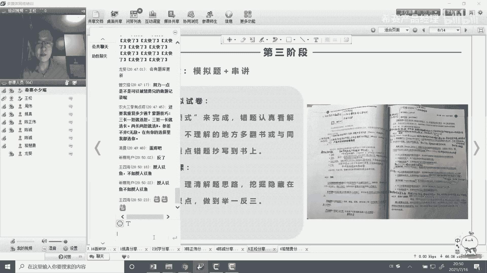

第四个阶段哦，这个打错了应该是啊，第四个阶段应该巩固阶段，因为我们考研嘛，公务阶段就是刷题加一个潮流补缺，查漏补缺啊，这只是我的蟋蟀自己做的很好的，他告诉你一个结构化的一个学法的。

这个阶段主要是为什么还有刷题是吧，这就到这个阶段，有的同学很多都是二刷，是这个同学是三刷了啊，啊至少见保底要二刷啊，这个时候所有所有的模拟试卷刷至少三遍啊，建议这样啊，如果实在不行，三遍你坚持不两遍。

正确率的话，有个指标的，不是为了刷题而刷题，指标要到85%以上，而考前一定要清空你的错题集啊，不要搞收藏哈，昨天我跟张扬也说了，张扬那个当时说出了好多，我说你收藏这么多干嘛呀是吧，说咱家好像都清空了。

好像都清空了，再一个就是要要回归我们的教材和讲义，回归教材和讲义，教材就是我们的小红书啊，刚才说的这本呢叫产品经理国际资格认证啊，知识体系指南一下n g d p啊，这个这一定要多看，回归教材。

这个时候一定要回归考前讲义，我是讲义，就是龙辉老师那个讲义啊，就习赛我们出了个讲义，做的非常好，这个讲义的话你愿意打印出来，你打印出来，反正我是喜欢看纸质版啊，有同学说我看电子版也行，也可以。

那那那那没问题，那只是一种形式，但是你一定要认真地看，这个非常重要，看完之后的话，应该通过和你做题相结合，你再查到五星开，我的盲区在哪里，还可以跟同学多讨论，知道吗。

我为什么那个后面我也提到要组队学习呀，这个时候你要加深对知识点的理解，这是什么阶段呢，前面的话就是说我们刚开始就是入门阶段的话，我们可能很僵化的进一些知识点啊，到后来我到那个第二个阶段的话。

我到那个核心阶段的话，就是不要那个来固化我的知识点，那么的古墓阶段的话，我是来优化的，就是这不是我说的这话啊，这应该是那个就是那个任正非啊，华华为的老总，人家可说的先僵化做固化，建立优化，这是循序渐进。

我是很认可这样的，四海是这样的吧，是人总说的吧，我没说错吧啊，然后在那个加深的知识点理解机械化，还有一点很关键很关键，在你考前的话，一般细算是会出一个考前的一个小册子了啊，会出一个小册子，小册子很关键。

这个小册子今年我们今年是在五一期间出的嘛，啊文慧老师做的这小册子很薄啊，大概105遍，这是105张gb t，105页都打印出来很薄，但是全是精华，这个也好好看，这个一定要好好看。

有条件的话你能抄一下是最好对，龙葵老师，这个这是我的手抄版啊，这是龙葵讲给我的那个小册子，我的手抄版38页，看一下就行了，这个看不清楚，这里面我也结合我自己理解的，有些东西我做了一些加工啊。

我是做了38页，这是我五一期间的成果啊，551的五天时间我抄了38页出来了，所以为什么说说五一的话，平均一天的话就是啊，要12~14个小时就干这个事儿去了啊，又又出去习惯来写一写。

这也是受朋友委的影响啊，但是这个东西抄完之后，确实是我感觉对知识点的理解还是有帮助的，还是有帮助的，记得当时是在5月27号，5月27号的话是在大洋文提过哈，5月27号。

反正当时那当时我那个跟张扬在一个群里面问，张扬天天在那那个呃，跟张扬那个讨论他这个题目，那时候感觉张扬啊很有实力，感觉张扬很有实力，但是那个时候那个状态啊，感觉就是就感觉是一种什么状态啊。

就缺就缺个人把他的任督二脉给打通，你知道吗，他一定是很有实力的，当时我一个张扬我，我说那个这样的，我说当时我们晚上约个时间半个小时行不行，会给你一个我，我我都结合我的理解，我看能不能对你有点帮助啊。

张先生没问题啊，好结果我们约的是那个说是八点钟开始，其实我们7。50是吧，张扬是吧，7。50就开始了啊，现在我就开始了，我现在就是把轮回老师的讲义，我扫描了一个电子版啊，我投屏吗。

我用腾讯会议投屏扫描了之后，因为当时我们也教室监会已经发出去了，发到我们群里面，后来好多同学就来我们跟他探讨嘛，啊就以这个为主线去探讨，然后这个把这个知识点看，从第一章串到第七章，然后每一章的时候。

也会结合我们在题库里的一些题目，或者每日五题的阅读题目，哎这个题目可能会怎么考啊，我觉得这个还是有用的，其实我本人的话，我可以把这个知识点就是在那一晚上，当时说是半个小时。

结果划到了12点到凌晨一点钟了，没有未尽啊，我当时我后来我我我一看时间不对啊，我这一下讲了快六个小时了啊，讲了快六个小时了，大家当然中间也探讨啊，嗯我记得当时就喝了这么一杯水，就喝这么一杯水。

在快递柜小时刷了一遍啊，16天晚上我的收获也挺大的，说实话，因为我那时在那个互动的过程中，我也听到这个同学们对，这个这个这真的是最后的冲刺阶段了，因为那个真的是同学的。

因为龙哥龙哥两个是最后一节课都讲完了，他是5月25号上的那个动员课嘛，我们是5月27号那天晚上讲的，当然5月5月28号，后来我们晚上也也是也也开了个腾讯会一样，但是不是对针对知识点的是吧。

不是知识知识点嗯，挺好的，嗯就你也来一遍，就针对这个这个讲义，因为只要记住我是我是手抄本吗，把龙辉老师这个做个手抄版，所以当时的话建议以这个为主线啊，我觉得啊还是挺有收获的，我们的小伙伴也都很优秀啊。

我们群里小伙伴啊都很优秀，张扬我就不用说了，22证大神是吧，你看下题目，我是很佩服的，我考这个证书其实收获挺大的哈，考这个证书的话就是啊我的总结是考一个证书，交一朋友，建一个平台，多一点进步啊。

这是我的总结啊，我认为我在西塞这个考m dp收货，不仅仅是这个证书啊，这只是一个开始啊，拿到证书啊，只是一个开始，我的np tp实践才刚刚开始，真的，但是有这个收费确实挺大的哈，还有一个收获是吧。

我还收两个徒弟是吧，我说考考证还可以啊，学习工厂收两徒弟下停了吧，刘浩刘浩，你来了没有，刘浩，没来是吧，嗯下次告诉他啊，下次我去成都双流那个兔头啊，嗯备好啊，确实这些小伙伴都很优秀啊，都非常优秀。

我在他们身上也学到了很多很多啊，他们的那种认真负责的那种态度，对那个知识的那种渴望啊，我就不一一表扬了，因为你都太优秀了，如果我的感觉就是，你和一群优秀的人在一起的话。

你你自己不啊不自觉的也会变得优秀啊，你为什么这么说呢，我当时我只想考一个md的，我并没那么多追求的，你知道吗，结果上回一沟通之后啊，我说上总盛总哈，这个呃能力非常强啊。

结果一规划我感觉这5年的支付都安排满了啊，所以大家这个应该是有兴趣的，也欢迎你们加入我这个加入我们的小团队啊，啊好吧，加入我们小团队可以加下我的微信啊，好不好，下次帮我敲一下，55226048好吗。

你联系到我，就能引导我往王四海这雷电引导扇葵，还有n多很多很多很优秀的小伙伴好不好，把你那个5年规划都在安排码啊，都是很有很有价值的证书，好吧，我们一起抱团取暖，一起通过考试。

这个小册子就是我扫描了一个一啊，这是其中的一页1/38啊，当然如果老师做了105页，因为我是a4 纸抄的，所以这个这块的话就是我就没那么多页。

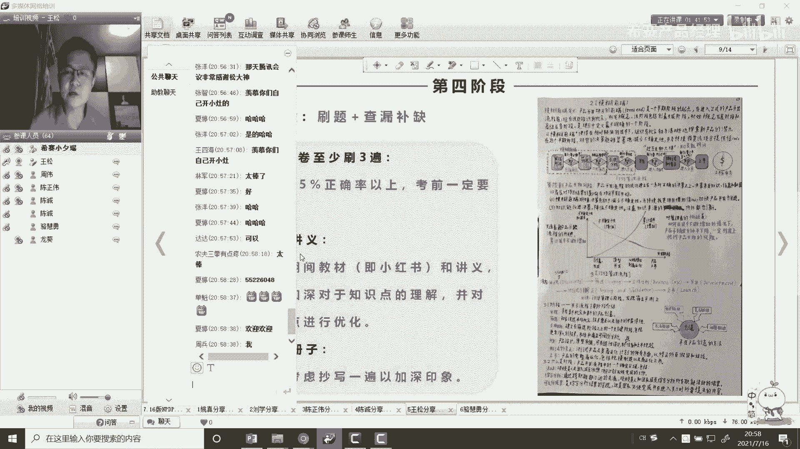

就内容都是不打折的啊，学习技巧这块我是不是有点超时啊，老师啊，我看前面同学长得很快啊，我刚试先补上啊，第一个是那个组队备考，共同进步就好，当我们提到我们很多优秀的小伙伴们，我们是长风班首周班啊。

我刚刚点的那些小伙伴只是我的直播看到了，其实还有很多很优秀的后小伙伴，他们因为这个工作的原因的话，他不一定能参加直播课，你这不代表他们不优秀吗，还是有很多很优秀的啊，嗯就是组队备考啊。

大家那个互相那个取长补短啊，数量固定渠道不断共同进步，这是那个第一点，就远远比你一个人去那个去那个学习的话，会好的多，有时候一个人学习，你会感到很困惑，很迷茫啊，如果如果老师他一对多。

他不可能每个人都和你对，就是说那个疑问马马上及时给你就解答了对吧，但是有这么一个小团队，他们有时候就能及时帮他解答，其实我们大家能看到，其实我也是很乐意在群里去解了解，解答大家一些疑问。

特别好的冲刺阶段，在那个大群里面是吧，我愿意做这个事情，这不是我们建了这个小团队，小团队之后，就是说我感觉到就是说呃，通过我们短短的这个备考期间，说短也不短啊，才两三个月啊，大家最后这个呃那种革命啊。

就像那种友谊啊，就逐渐的逐渐的就是在升华哈，在升华啊，其实我后来就感到有一种责任感，尽管我们没有什么任何的协议，没有任何的契约啊，有种责任感，我觉得我们这些小伙伴都很优秀，我们一定得一次性通过是吧啊。

所以有的时候的话啊，有的时候像专业昨天说啊，说有时候可能就是会对，有时候对大家提些要求，比如我当时安排下庭是吧，夏天你们你天天给我刷一下，那个那个词汇表是吧，夏天还挺认真的，用那个便签哈。

真的每天他坚持把，把这个整个词汇表都弄完了啊，每天都变，现在群里给我发，就每天给我发十个词啊，大家都看了，每天十个词词汇，你看一看，每天来看一看，有个印象，你这这这挺好的，第二个就是那个口诀记忆。

哎呀又错写错了，口诀记忆这块啊，这个不强求啊，其实刚才那个承诺的同学也提到了，我我我我我刚才听到他这个口诀，我觉得挺好的啊，其实每个人不一样，关于口诀这个的话，我的理解是因为我当时考一建的话。

我也做了很多口诀的啊，啊我我给文科老师也发过啊，就交流过口诀这块，我认为你自己做的口诀是最好的啊，这个不是说是自己夸自己啊，因为你自己做的口诀的话，你参与这个过程的话，你会记忆很深刻啊，知道我这么理解。

我这么理解的啊，适合自己的就是最好的嗯，别人的中国是别人的，你是不是要消化吸收转化成自己的，这上面是我写了一个那个关于那个，这是47页的啊，公司使用的项目评估工具，这个口诀用到什么时候。

可能n m d p呢还还体现的不是那么多啊，因为b p d p的那个知识点相对少一点，你说像那个意教导师里面很多知识点的话，没有任何规律可循的时候，你要记忆的话是很难的啊。

这是这个公司所采用的项目评工具的啊，当时做了一个，我记得这个题目，这个应该是我在深圳出差那天，是我是参加华为的生态大会，是4月，是不是对，5月5月10 16号吧，是5月16号，群里有个小伙伴是一群二群。

我忘了小伙伴说了，哎这个怎么记啊，这个太郎啊，那没没什么规律啊，当时我就我真的酒店嘛，看中午我就这个想着我能不能做个口诀试一下，然后就写了个口诀是吧，你看看这个上面怎么记得，我看到这个口诀里面。

第一个就是那个投资回收期是吧，就是那个这是财务的啊，还有什么折叠现金流过，证上红色的是财务的是吧，当然想啊，项目评估用工具啊，知道表头和2。2对上了，第二财务折现现折现回收期啊。

财务指标的话是什么财务公寓啊，有折现现金流啊，同回归去啊，记住啊，非财啊，非财务的检查桶排序啊，检查什么检查清单桶是什么，战略统代表语音一样是吧，哇这个郑国锋，你把我另外一个被暴露了是吧。

那那个来源于刘浩啊是吧，写了每一季之后，后来我就给夏天一发完了，你能不能记录就挺好的，因为这个是什么规律对吧，但如果中间那个记忆很好的话，那你可以没问题，用我们的话就是说至少我现在的话。

我的机械机械能力没那么强啊，我还更多靠理解，靠这个机，我觉得还是挺挺挺挺管用的，你这个相当于还有一些口音上面啊，标准角色有框架，12分是评选机是吧，那结合了罗老师当时举了个视频。

就感冒发烧是吧啊量体温就会回家休息，那个是吧，也挺好的，那就说啊博士流程流阶段是吧，他本身能开车商是吧，门禁流程没有，流程流阶段是发现实力看得上有用啊，一键变变是吗，刚开始可能就哎呀好啊。

其实的话你慢慢的固化到脑子里去了之后，这个东西的话就说就是那个就是潜意识里的话，你就知道这已经掌握了，你知道吗啊李伟你来了是吧，嗯好的好的，给我刷个大火箭，我这替你在分享啊，你这么忙。

再一个就是那个词汇表的一个学习啊，词汇表这个学习的话我非常重要，但是有的同学建议说词汇表怎么来学，是要那个啊，考前突击也可以没问题，但是其实我建议词汇表是平时的话，就是说你可以不用那么刻意的去记。

这样你平时的话就有就得那个哎翻一翻对吧，翻一翻有印象，词汇表也不多嘛，后面就那么几页是吧，后面，同学们看完书，可不是说只是看完这个1~7章了，后面有词汇表啊，后面有词汇表还在那。

这个孩子平时的话要做点这个做点功课了啊，不能说完全指着那考前前两天，考前一天的话，一旦你工作有出有出差，有这时间复习怎么办，我就是这种情况，我考前前两周的周末，就是周六周日全在外面出差，那怎么办。

我有一次的话就是说那个类似去深圳的意思，把龙哥老师这个第6b座六，那个直播课都错过了，真的是错过了是吧，计划赶不上变化快呀，所以你平时的话就是趁着有时间的时候，你把这些东西都要走一遍。

还有印象内容抱变化，再一个就是碎片时间怎么利用，碎片时间的话刚才也说了啊，碎片时间其实我们是可以做很多事情的，什么叫碎片时间，比如说你在那个交通上面直接上班，上下班时间啊，有那个地铁上，有的自己开车。

有的好坐公交或者什么什么之类的，或者你提供的工作近的，你可以听一下，听一下那个喜马拉雅上的音频呢是吧，或者说西塞这个视频的话，如果老师这个视频的话，你可以这打成音频吗，因为那个时候你不可能看手机啊。

他也可以只听音频啊，就是没问题的，就磨耳朵吗，搏一搏嘛，早上花一个花一个小时时间磨一磨，晚上再花个小时，磨一磨就两个小时啊对吧，这是碎片时间，不算你的，你在那个整块整块的时间不算中午的时候是吧。

吃饭的时候也可以摸一摸你的耳朵啊，这是有用的，这是潜移默化的影响，真的是有用的啊，不要啊，不要这个忽略这个好吧。

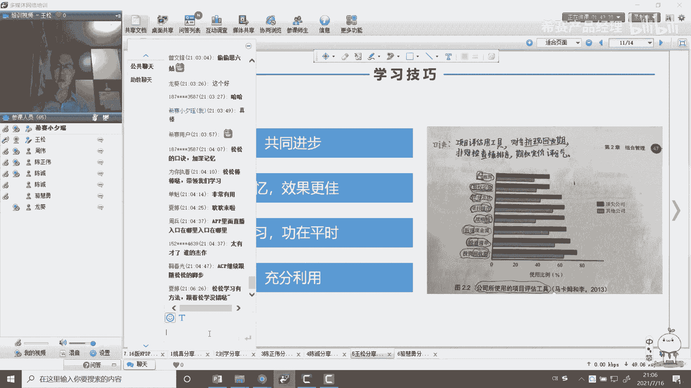

这是我个人的一些理解，第四个啊，这个感恩西赛，感谢赛啊，这里有故事的啊，这感觉现在其实我跟龙哥老师，很早有点感谢他了啊对吧。

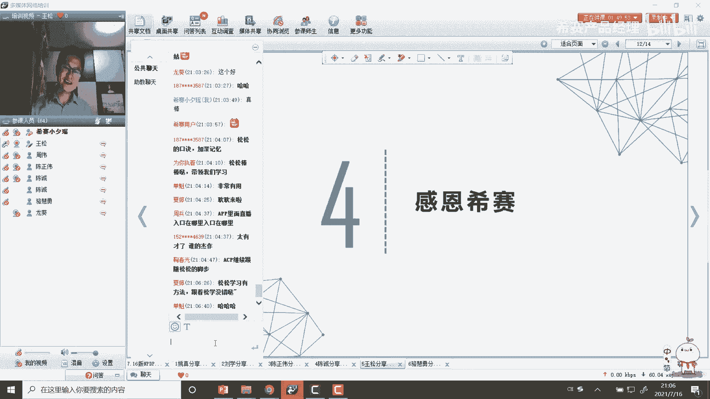

这个文案一直没写好，你知道吗，我们可以看一看啊，这怎么来的，别笑话啊，这是圆形啊，这是高保真原型，那个那个上总会代表我们去交互，那个交互的啊，是靠谱的，严谨来练一练啊，啊这个这个锦旗这个是我写的啊。

这是我写的，这仅代表我自己代表我，我代表我的小团队啊，这个我是可以说的啊，我不能说我代表整个首都钢代表谈判官，还是这个这个我不敢说啊，我代表我们团队啊，啊岳麓山下优质股东是吧。

那个西塞我们西塞就在那个在岳麓山是吧，岳麓书院啊，这是很有名的啊，地址选的好，为什么西塞啊这么厉害，地址选的好，书香气息很浓厚的优质股是吧，百零西散一事归萃，现在今年是20周年嘛对吧，20周年啊。

我们也希望现在办的越来越好啊，今天我是以西塞为荣啊，我希望明天啊七赛能以我为荣啊，这也是我们的奋斗目标啊，我们来勉励自己啊，这右边这个对联可能有点有点小啊，这个上联是呃，就是我这个紧急上内容啊，上联啊。

这是首周班同学写的这个下联，横批是长风班的同学啊，林静茹来了吗啊，这是林静林静茹同学写的，写得非常好，对得挺工整的，我练一练啊，我这上面也不是岳麓山下又记古钟是吧，百年细算，名师荟萃是吧。

哎人林静茹对了，多功能互联网上微信群内八方学院英才云集，哇绝啊是吧，横批是什么，相聚甚欢啊，真的是杠了啊，这真是感恩感恩西赛，感恩罗罗老师，感恩我们的那个龙葵老师，然后我们的小西姚老师啊。

还要感恩我们的班主任林姐姐啊，这不是感感恩你吗，还有背后还有很多很多后台服务老师，我我不知道名字啊，还是感恩你们，但现在我学到了很多，不仅仅是一个np tp的一个证书，一个np tp的一个知识体系。

还有很多很多啊，我在老师身上我也学了很多。

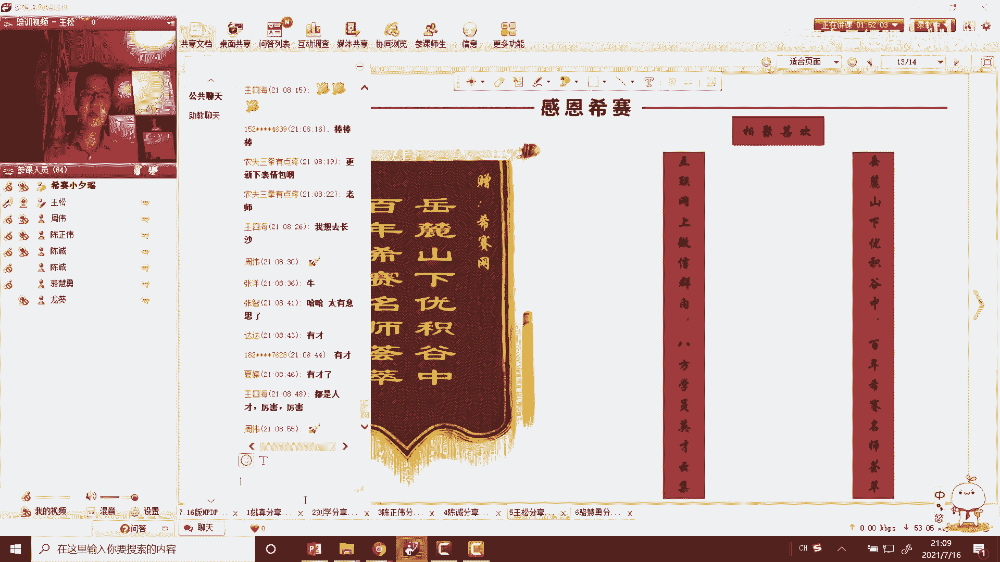

但我们同学身上也学了很多啊，好的分享就到这里啊，我也祝我们即将准备m p t p考试的同事啊，同学啊都顺利通过，也祝本次因为疫情啊，因为疫情不能参考我们广州啊，我老征征文峰啊，还有好多同学啊。

然后我们深圳的四海大佬啊，我们深圳的黄伟，还有深圳的方同学，我们邓晶晶啊，晶晶啊，还有零件，也祝你们在那个11月份靠岸啊，奖学金靠你们啊，我等着你明显前心啊，下次我去深圳广州，你们懂的啊，请我喝茶啊。

好谢谢大家，我的朋友到这里全程也是干货满满，我们再给王松同学刷一波火箭好不好。

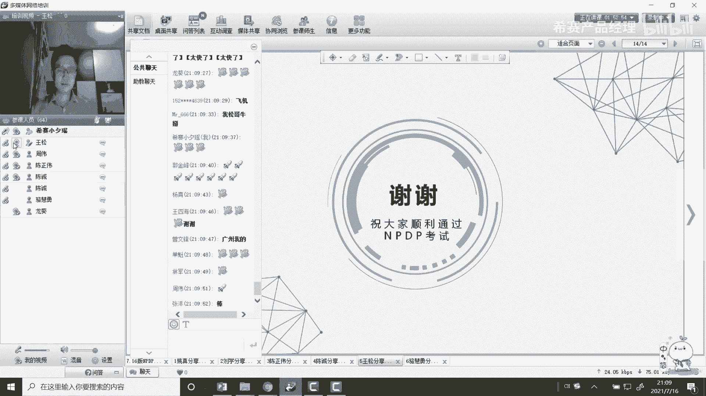