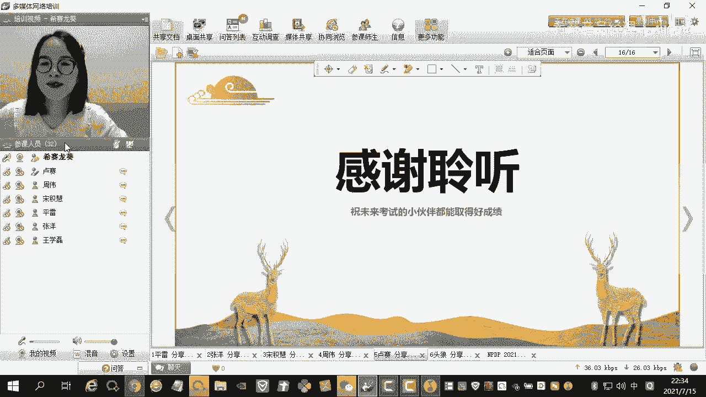

# NPDP2105班优秀学员分享-相信希赛，相信自己-王学磊 - P1 - 希赛产品经理 - BV1vy4y1R7cc

哇这嗯大家要打起精神啊。

还有一个还有一个小伙伴分享啊。

后面这个王学磊应该等了很久很久很久了啊，啊我来看一下在不在嗯，嗯嗯好的嗯，各位小伙伴，各位小伙伴大家好嗯，时间比较晚了啊，夜已经深了，前面大佬们说的都比较详细，所以我那边我尽快吧。

然后大家准备抽一等奖就好了，我分享的题目叫相信西塞，相信自己，然后从下面四个方面，跟大家做一个简短的分享吧，第一个是我的一个自我介绍，第二个是我的考证的一个目的，第三个是整个的一个备考的过程。

最后一个是跟大家说点干货，就是整个考试下来的一个心得体会，嗯那现在我开始第一个就是自我介绍嗯，大家好，我叫王学磊，然后之前有10年的汽车电子行业的一个经验，其实一直是跟着整个汽车电子行业的一个发展。

做过只能做过中控大屏啊，用公共导航啊，然后后面发展到智能座舱，发展到车联网，然后嗯，最近因为嗯之前自己的一个想法和一个变化吧，然后跨界到了互联网，互联网行业，现在是在阿里系的一家公司。

然后主要做的都是嗯所现在比较火的所谓，数字化转型的一些事情，怎么说呢，这么十几年的一个工作经验吧，一直做过项目经理，也做过产品经理，等于说嗯，因为之前这些职位也没有分的那么清楚。

嗯相对来说嗯做的事情杂一些，然后经历的相对来说多一些吧，嗯基本上这个就是我自己简短的一个介绍，然后下面跟大家说一下我考试的一个目的啊，这是我写的啊，知识积累能力提升，升职加薪，人生巅峰。

马上就迎娶白富美了，就是无限可能，其实这个只是一部分，其嗯最主要的还是对自己，对自己整个一个知识体系的一个完善的，因为嗯之前也在七赛考过pmp，也也其实跟我考p mp的，整个的一个一个想法是一样的。

就是想法自己在工作中的这些这些，这些知识和这些经验，通过系统的知识体系，这样过一遍之后能够组建起来，然后能够形成自己的一点点的东西，嗯这个也是我考n p dp的一个初衷吧。

然后考下来之后其实确实是这样啊，有小伙伴眼很尖啊，背景确实是黄山，然后嗯这些只其实我们现在这个社会嘛，就是嗯人和人之间的差异是什么呢，其实就是自己沉淀下来的这些东西。

所以说嗯还是想沉淀下来自己的一些东西，然后我这些东西这些写的就是相应的，就自然而然的就会得到，自然而然的就会到来，嗯这是我考证的一个目的，嗯下面再说一下我的备考的过程吧，我备考的过程其实很艰辛的。

嗯还记得我是在2019年的第一场雪的时候，到了西塞的n p dp，其实是准备考2020年的第一次考试的，但是大家也知道，由于有疫情的原因，搁置了很久，然后后面因为我自己工作的原因。

本来就想去报成都的一次考试，成都的考试也没有参加上，也就只能是跌跌撞撞的，单机全都换了好几个，然后最终就是还是参加了最近的一次考试，并且怎么说呢，结果是好的，能够正常通过，其实就跟我这幅图一样。

画家我的心路历程就是这幅图这样往前a，自己一开始赶快爆，冲劲很足，然后啊我开始学很平稳的过度，然后最后想要考试了，有个巅峰，结果成都考场封掉了，然后也没办法去考试，瞬间跌落谷底，最后好不容易又平滑过度。

最后终于得到了一个好的一个结果，这个就是我整个备考的一个过程了，然后下面就是备考的一个过程，其实就是说一下我备考过程中的一些东西吧，第一个就是站在巨人的肩膀上，其实群里有好多小伙伴都很强。

刚才好多大佬也都介绍了，比如说四海大哥，比如说上回占总，然后还有其他政风这些东西，大家总结了很多很有用的，比例很好的一些资料，其实这种方式跟大怎么说呢，站在巨人的肩膀上，你能少走很多弯路。

你根据大家总结的这些材料的话，你会对没有时间完全去备考的话，其实的同学的话会有很大的一个帮助，然后第二点就是想跟大家说的，就是一定要跟着老师走，听话就是老师，你你要相信西塞，相信相信我们西塞的老师。

老师绝对不会害你们的，包括老师的直播课，老师的一些录录播课老师，包括老师在我们班级微信群里的一些提醒，发的每日五题，其实只要是跟着老师走听，按听按照老师的这种按部就班的去做，我通过考试是完全没有问题的。

然后第三点非常非常重要，就是一定要把题七赛题库里的题全部刷完，不刷完的话，我就很后悔，因为我少刷了一套题吧，然后所以感觉做考试的时候心里比较慌，嗯怎么说呢，西塞的题库的质量还是很高的，至少我们这次考试。

原题的人体出现的还是比例还是很大的，这这一点就是也想告诉这些，时间不是很充裕的小伙伴，就是你即使课你不听，但是你一定要把题刷完，你题刷完之后你要去，然后还有一点就是一定要回顾错题，一定要把错题说清楚。

不然的话嗯就是要记下来，这样的话也能通过考试嗯，可能要跟大家铺一层一盆冷水的话，就是说虽然西塞的通过率很高，所以说大家不要觉得考试真的很容易，就是一定要按部就班的走，最最差也要把题刷完。

这是我自己的一个感受，然后整个的一个心得体会呢，其实我想说这三点，第一个就是考试不难，但是这个好多人会说我站着说话不腰疼，别毕竟我过了嘛，但是从整个的我的备考过程的一个体感来说，其实确实不难。

只要是安心准备，安心看书，把视频该刷的刷完，把题该做的做完，就没有任何问题，肯定能过，这时这是一点，然后第二点需要提醒的就是，不要总想着冲刺，你觉得靠一一周就去冲刺的话，我不能说没有这种可能性。

除非你是你很天才，或者是说你很牛，要不就是你运气很好，你刷的题都是考试里考的题，所以说不要想着冲刺，我建议的话整个的一个备考时间就放三个月，你就是而且那三个月的时间不用很紧，你每天可以该处理你的工作。

处理你的工作，该有你的这种娱乐活动，有你的娱乐活动，就是但是你每天抽1~2个小时的时间去准备，去备考就行了，嗯这样积累下来，其实通过考试，至少通过考试，我觉得是没有任何问题的，嗯最后一个体会提示是这样。

就是说拿到nb，拿到这个证书只是一个开始，其实如果真的想从事产品经理的话，还需要很多的很多知识的积累，很多能力的一个积累，因为好多好的项目产品经理真的是凤毛麟角，至少我觉得目前很牛的，像张小龙，对不对。

像像抖音的那个张一鸣，大家哪有哪有这么多人，哪有这么多产品经理，我觉得只有他们是比较成功的，所以说嗯怎么说呢，至少我个人的体会是做好这个产品经理，长了word那门技术的话，嗯在一个比较非常细分的领域。

你如果有所突破的话，其实对至少首先对你整个的一个财富的积累，对你整个的其他的嗯想法的一个积累，其实都是非非常非常有必要的，嗯基本上这就是我想说的吧，其他的没有什么时间也不早了，嗯对的，我是在外面嗯。

嗯好我们同学老师嗯，话很较劲啊，今天一时间已经不早了。