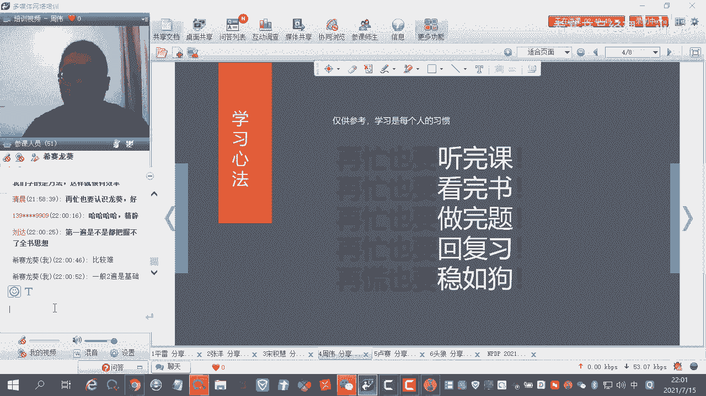
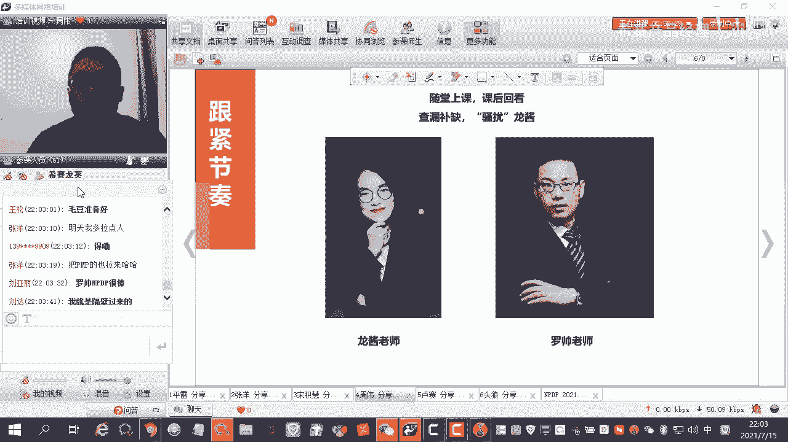
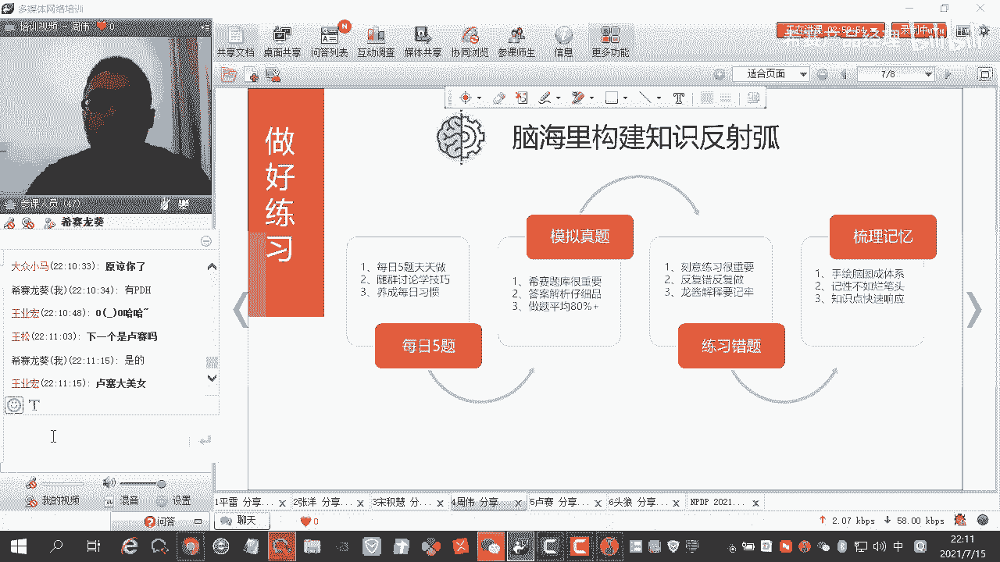
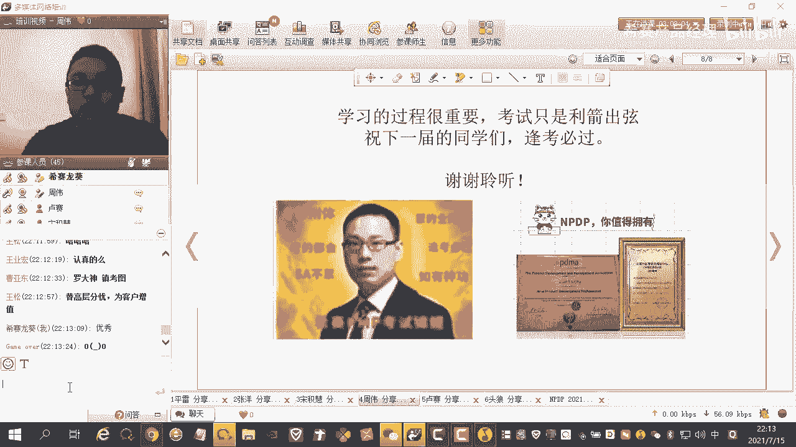

# NPDP2105班优秀学员分享-考前一周才悟到学习NPDP的方法-周伟 - P1 - 希赛产品经理 - BV1ZD4y1J7YH

接下来邀请我们的周围进行分享啊，掌声欢迎大家呃到我了，很高兴在这里就是有机会嗯，有一个面向大家的舞台啊，嗯实际上那个嗯我呃刚才听到大家那个讲的，确实是大家都是大神，当然我这边的话就是比较简单一点。

就是到时候大家想那个听听得快一点的话，大家把小火箭搞起来，哈哈嗯我这边啊我这边分享的主题呢，其实我一开始的标题是，我在最后一周才嗯，感才才理会到那个n p tp的一个学习方法，实际上是是这样子。

我之前大我相信大家平时工作都特别的繁忙，然后特别是白天基本没时间嘛，然后只有周末和晚上的时间，我也是这样子嗯，所以说然后包括周末的话，相信大家也有可能还有其他事情，那么我基本上学习时间。

基本上是在最后的两个月，然后期间还还有出差的什么的时间，所以说在整个过程中，我基本上都是晚上在学习，然后那个直播课我基本上没听，但是回放我都没落下，整个过程的话，我觉得是把我多年来的那个工作的那个嗯。

过往的一些经验完全重新那个创建了一下，重新认识了一下那个产品工作相关的东东西，呃，我是从事那个嗯互联网产品这块的，嗯之前的话也是在北京啊，嗯工作好几年，然后现在在成都工作，嗯我是一个比较喜欢户外的人。

当然因为疫情的话，这两在这12年也没怎么出去啊，就是我的我在整个学习的过程中呢，我嗯我觉得还是比较好的，因为嗯学的过程中其实还是挺痛苦的，刚开始就是看着有点懵，这就是为什么我嗯前面一直呃没没体会到。

然后刚才前面同学也说了，但是呃他那个理解起来有时候不是特别好理解，或者是本身我有东西没接触过，然后特别是那个一些嗯公司战略方面来没接触，然后后面，但是但是这些东西学起来都不会特别难。

我觉得啊后面慢慢理解的都不会特别难，但等到关中，我觉得学学习啊，就跟那个我在玩怪一样，真的是很很难会体会各种危险呢，嗯体力上的问题啊，这些呃很累，然后实际上我们整个过程学习过程中，就像我在户外一样。

看到无限的风景，嗯一直逐渐的对自己的职业的定位，以及那个嗯岗位的一些认识，嗯有了一个新的认识吧，我觉得是这样子，是说我是说我特别推荐那个嗯，大家从事产品工作的同学啊，嗯可以真的好好学习一下这种东西。

嗯对我们那个整个产品的那个知识体系，实际上真的很有帮助，当然刚才我看评论里面有很多同学，有同学说那个呃自己不是从事互联网产品，互联网行业的，这个时候呃，我觉得应该不是问题，因为在我们那个同学群里面。

还有那个从事那个建筑行业的嗯，之前还有拍那个，拍出自己的那个在工地上的一些照片，所以说我相信产品工作实际上是我们生活中，很嗯生活中很有帮助的，我一直认为，然后在我们其他行业工作应该也有很帮助。

毕竟我们经营的那个嗯从事的工作，以及经营的一些东西，包括我们自己本身也是一个对外的产品，也是需要去嗯优化处理，然后呃面向市场嗯，嗯整个学习的话，一开始啊就是嗯我相信就是做互联网产品的，很多同学啊。

就是呃都是叫野生产品产品狗，在我这至少是在我的朋友圈里面，很多都是这么认为的，因为我们整个的那个嗯国内的那个教育体系，是没有那个关于产品这块的，一些嗯相关的一些专业大学教育，大家都是在工作经验中去学习。

包括嗯在一些嗯工作里面，遇到一些自己的导师啊，工作中的导师，然后慢慢的建立起产品相关的知识体系，当然这些所有的知识体系都是野生的，就是大家都是言传身教，经验相传，所以说在学习这个课程呢。

我当时看的就是嗯看到这个课课程的时候，我觉得还是嗯让我有一个眼前一亮的感觉，我觉得嗯是时候把我的那个也所有的经验，重新嗯用专业的体系来串联起来，来优化自己的经验，把自己的经验变成真正的有经验。

嗯那个真实的可靠的经验，这个时候作为一个衍生产品狗，那么学完之后呢，我自己的感觉还是嗯挺好的啊，其实挺好的，然后在工作中的话，我也会嗯或多或少的去呃，去回想一下我的那个学习过程中嗯，是什么样子的。

但现在我觉得我还缺的是项目管理，所以说嗯做产品的话，其实多少还是要接触一下项目管理，后面也会去向项目管理方面的知识体系再去嗯，向上一步就是，反正就是反正就是很好的一个感觉，嗯整个学习的呃。

这是我总结的一个心法，其实呃每个人的学习方法什么的都不一样，每个人对知识的理解，以及知识的接受度也不一样，当然我是一个学渣，不会像前面的那个大臣们一样，那个呃出出门一件就是大佬的级别。

那么我用的办法就比较笨，就是比较笨的办法，我在所有在忙的时间内，我坚持去把所有的回放课都听完，即便是到最后一个月，我觉得时间很不充足的情况下，唯一就是这么做的，整个第二我总结的就是，再忙也要听完课。

再忙也要看完书，再忙也要做完题，再忙也要回回回复习，再忙也要稳如狗嗯，整个过程的话，其实嗯听完课，这个我刚才说了，其实我们很多时候是呃包括下班之后，下班回到家都几点了，对吧嗯，要真正的去听到直播课的话。

确实挺难的，所以说嗯我经常是能正在上直播课的时候，其实我在线，我在听回放课，我在跟着我的进度节奏走，然后看完书，嗯虽然嗯毕竟他是考试的官方参考教材，它里面的一些即便是翻译不到位什么的。

嗯这些东西也是嗯有需要去克服，然后那个龙辉老师他们也会呃给我们指点出来，就是会再三强调哪个地方要注意翻译问题啊，要去记英文呢，或者是呃哪些知识点特别重要啊，这个我觉得特别特别有嗯特别有帮助。

然后在一起看书的时候，然后那个嗯做完题，这个其实做题这个过程的话，我觉得嗯我的方法也是比较笨的那种方法，就是说我嗯一开始我是完全不去做题，完全不做题，嗯就是就是这个拿报名这个东西之后啊。

我一开始真的没做题，我就真的听着听听课呀，然后看看书啊，嗯跟着章节慢慢的往前学，然后当然我学习每学习完每一章节的时候，我会去app上面去去嗯去做章节题，章节题很少，1~20道题，10~20道题嘛。

然后这个时候我是建立的是我的那个嗯，对这本章节的一个知识的一个呃基本理解，以及找到本章节的一个做题的一些技巧，这个时候整个的那个到最后的话，学习到末期的时候，我更多的嗯。

甚至于嗯也没有完整的去做完一整套题，即便是最后一周我也没完整去做这个准备，一道题，应该是应该是说最后一周我才去做整套题，之前都是在做银行的章节题，嗯做题的话，我觉得是一定要听那个龙葵和罗老师。

他们的建议，就是说像我们这一个班的话，龙葵老师在嗯重点的去嗯梳理了，相当于押题嘛，押题了，他自己整理了一套嗯，第六套模拟题，就是也编号六的模拟题那道题嗯那道题的话，实际上嗯之前考试下来的话。

大家很多同学也都感受到了那个嗯真题特别多，原题也特别多，所以说一定要听那个，就是如果说我们用，我们本质是学习这个东西的话，拿这是我们就是一个基础目标，然后其他学习过程当然是我们最重要的。

但是拿到一定要拿到嗯这个付出结果，所以说听嗯，听那个龙葵老师的一些总结的一些题嗯，课程啊，然后再去做题是非常重要的，回复习，其实嗯整个复习的话呃我在整个学习的过程中，书看了有两三遍吧。

然后视频的话看了有两遍不到两遍，估计因为有的时间原因，有的就是跳的比较快，特别是后面的那个呃两节视频，我基本上都是嗯往往往后拉的比较快，或者是我是是嗯快，是那个把那个语速调调快一点。

嗯当然我这里说的语速，我建议大家就说嗯龙葵老师的那个课呀，新1。2倍还挺好的，嗯至少说他不会有特别快速的感觉，然后龙葵老师那个上课的那个控场能量，就是让让你情不自禁的会往里面带。

然后那个呃罗老师的课的话，会让我们学习更多的场景，然后让我们发放更多的思维，这个是比较好的回忆，这个都要去，我是做了，有一个复习视频跟那个体题都会有复习的过程，当然复习里面我认为比较还有一个比较重要的。

就是我们对知识的理解以及错题的理解，错题的反复的去做，就是那个网稳如狗的话，实际上我想表达的是呃嗯在整个学习过程中，实际上有可能前期时间从我们反而没有去嗯，嗯加紧的去去学习，或者是安排时间上安排。

然后后面的话即便是时间再久，我们要很稳的呃，按照自己的学习节奏，自己的对知识的一个吸收程度去慢慢的学习，然后嗯到最后我是列了一个复习的，一个自己的一个目标，比如说我今天要做多少题。

今天要看到第几章的视频，看到第几章书，什么时候要把某一章看完，学习完，并且把题做完，就只从视频到到文字到那个做题三三个板块。

我都是在按节奏去完成自己的，啊嗯这个刚才说到的书啊，其实我们嗯如果说想拿分的话，实际上嗯就是对知识的理解，嗯讲义这个人以及知识知识紧急，这个是那个新赛总结的，我觉得特别特别好的，因为到后期的时候。

去查看那个原书的一些依据，然后知识紧急和讲义，是我在那个嗯做题的过程中，快速的去找到知识点的一个嗯一个方法，当然这个讲义的话，有可能会跟着那个嗯龙辉老师他们的那个ppt，不会特别的那个相符。

因为我这个教材是在呃19年19年，不是19年底报名的吗，然后20年拿的那个，当时20年19年12月份拿给我寄过来，也就是说这个版本是一个比较老的版本，后面龙辉老师总结的他那个讲义啊。

就特别是他的习题讲义，这跟我们这个讲义实际上有一些差异，当然是一个嗯字的突破，就是看到那个龙葵老师他们那个新的ppt讲义，p p t的时候，实际上知识的重要程度是另一种层面嗯。

所以说只要说这个这个讲义的话，大家拿到时候一定要做好好利用这个工具，就我们这个课程就是我之前报名的时候嗯，主要是那个罗老师是主讲，然后龙葵老师是帮我们那个做习题讲解，主要是这一块。

我觉得听罗老师的课的话，嗯就是还是挺有意思的，他会把他的一些过往的一些经验啊，或者是对这个知识点的一些发散了嗯，听完之后实际上对我们工作本身，因为更贴近工作，实际上这种听起来嗯会有的一些实际性的那个。

嗯工作上的一些发展了一些帮助，嗯当然龙嗯那个嗯龙龙辉老师的话，文慧老师的话，他的那个更多偏向于那个知识的一个总结，嗯这个嗯如果是拿分一定要听龙葵老师的，嗯如果是想了解更多，多听听罗老师的。

包括他那个之前给我们强调的980的视频，98年的视频只有干货，这个时候特别死，而在上边那个路上去听，嗯以及他有那个喜马拉雅听的话也可以，就是嗯听这个知识点还是还是很有帮助的。

嗯整个的那个学习的话，我理解我总结的是啊，在脑海里面构建知识的反射弧，就是这个姿色的反射弧的话，我是有通过四个步骤，刚才也大概提到了，就说嗯整个学习的话有每日五题。

就是这个老师们那个带动的一个呃学习机制，就促进了每天学习的机制，每日五题，每日五题会在群里面去呃，发起嗯微信群，但是有的时候太忙了，我也没做，但是我有有时间的时候，我会快速的做完。

这时候快速做完就是嗯我就不会去看群，但当龙辉老师在呃在那个副给大家讲解，就是解答就是发达案之后解答这个过程，我通常会去参与之前的那个过程，我会去偶尔会看一下大家在说什么，我对特别是有的题啊。

他每日每日五题，龙辉老师经常会有那种嗯嗯特别有额，有争议的题，他会也也会在里面放，就是大家会去讨论，因为本身这个是没有标准答案，就是就是很多题目没有标准答案，大家要去嗯更多的听龙葵老师的那个叫什么。

他的他的解析，我觉得解析的非常非常到位，在群里也会讨论的话，你对你的知识有发散性的一些东西思维，然后每天养成习惯去做每日五题，每日五题不仅仅是微信群里面，还有app里面也有每日五题，那个每日五题的话。

实际上嗯也是一个快速反馈，因为你做完之后啊，嗯你可以看到那个有解析啊，或者是你快，因为20多道题嘛，也是慢慢的训练自己的做题的一个嗯手感，属于承诺什么的，我觉得嗯还是特别好的，并且回看什么的也比较方便。

编写app也会记录的那个做题正确与否的，这个过程的一些嗯引导，然后模拟真题，刚才提到模拟真题，西藏的模拟题啊，就是很多就是嗯因为是靠大家慢慢积累的，是靠每个人积累的，不仅仅是老师，是靠同学们满满积累的。

这个积累的这个知识还是特别的那个准确，因为当然后面今年今年pdp的话，应该还还是很有很多问题的，嗯因为听老师说，明年的话会改版，这个嗯当然应该也会有一些差异的话。

当今所以说今年参加np dp考试的同学们，应该嗯获得那个高分的机会，有机会会更多，然后做题做题的话，我是倾向于把自己的那个嗯，目标定在那个80%的正确率，但是实际的结果并不理想，在我看来。

在我实际上并不理想，因为通常是在46。49%点多，是邮件多，不到百70，比如说实际上是很危险的一个一个一个区间嘛，但是整个我的考试下来，实际上每个章节的分数嗯都没有特别低，然后都比较均衡。

就是没有特别哪一个章节特别嗯，要多一些这种这种过程，所以说我是以均衡的方式去发展，嗯然后这个练习错题的话，我觉得特别对我来说感觉特别重要，就是说因为有的题啊，嗯你会从你的那个学习过程中以及实际工作中。

你觉得人能知道它是正确的，呃，你知道怎么去做，但是有的题可能理解偏差，导致我们反复做反复错，这个是我之前有遇到的遇到的，然后有其他同学也在群里反馈，真的是反复做反复错，甚至于做到怀疑自己的人生。

你即便是短时间内反复去做那几道错题，都会都会去做，那么这个时候我嗯做的方法就是说对于错题，我是会去把它尽可能消灭掉，到最后考试我也很也有呃几道解释道做错题了，但是我选择的方式，最后我是选择刻意去记忆。

就特意记，龙葵老师给我们解析了一个嗯对题的一个解析，我会特意记嗯，嗯最后就是就是梳理记忆，梳理记忆这个过程呢，实际上龙辉老师他们在整个教学的那个嗯，领导里面也提到了，就说我们要去嗯做那个知识。

就是知识导图，就是老用老图的工具去梳理所有的多，所以当一些知识我也有尝试去做嗯，那那没有去做的特别完整，不像那个其他同学做的特别完整，但是嗯我又尝试了其他的方法，就是说在做老师的之后呢。

我会去用手写的方式去写一下，就是一些知识点，这是关键知识点的一些关键点，我特别是我理解的，我一般还会跟看着看着书的目录去写这个知识，知识的一些章节的一些知识点，然后反然后反向的去梳理，我哪期没写出来。

你整个整个写的过程中，我觉得嗯特别重要，就是真的是好记性不如烂笔头，本身记性也不太好对吧，像我这记性也不好的，那么我选择去嗯去写，这个时候像我们平时工作中嗯，可能写字也不多的情况下。

整个过程也相当于没写的一个字，可能会让你的大脑里面记忆更深刻，并且这个贯通会让你去嗯，把一些关键字啊什么的印在脑海里面，然后就是然后知识最后是知识点快速响应，这个就是回归到我的总总结。

是总结的一句话里面，脑海里面构建出姿势反射弧，就是我在做很多题的时候啊，就说那包括看视频的时候，我觉得每一个章节或者是哪个题，我每个知识点我觉得不理解的时候，我会去我呃看翻翻书。

然后因为我的书本身是不会去做很多那种嗯，可能跟其他同学的学习方法不一样，我会不会去做很多那个嗯t贴着外面的标签，我会刻意的把书保持的那个比较的那个整洁吧，就是不是说里面构图的画勾勾图什么的，我会画很多。

但是我整个书外的外观看起来还是比较整洁的，这个时候我在快速响应知识点这个过程中，我是比如说我某一个知识点，我需要知道他回想一下怎么做的时候，我会快速的去想我在哪本这本书里面，或者是呃老师讲解讲解视频。

在那个嗯讲义里面哪个点讲到了，我会快速去响应这个问题，现在脑海里面响应这个问题，或者如果说我响应不了，那么我第二个反应就是我会去响应，书本上到底在哪里，我会去翻对应的书的那个具体点，我在这个翻的过程中。

实际上是把整个书的这个，嗯框架都重新一遍一遍的往脑海里面去记忆，因为我翻的时候，我会快速的翻到某某对应的对应的那个内页，就不会去挨个的去找，其实这个我觉得是一个嗯，对我来说是一个很不错的方法。

就是每个人学习习惯不一样嘛。

然后那个然后那个最后的话，我觉得那个嗯特别还是感谢西塞这个课程啊，就是说他真的是对我过往的经验，重新进行了一些梳理，就是包括他整本书的话，我嗯刚才也提到了，我是最后才才把这个嗯整本书怎么去学习。

理解到实际上我现在就是整个理解的话，实际上他整本书讲讲到了，从一个嗯从一开始应该是创一开始嘛，嗯到那个企业的一些建议啊，团队的一些建议啊，到最后嗯发了一些输出，最后推上推向市场，整个过程啊。

像我们实际过程中可能不会去接触，整个比较全面，包括我们工作中啊，可能如果说专职去做产品的话，像那个公司那些战略，可能证明你的范本书里面也提到了产品经理嗯，也没有去，就是嗯有的战略不是你去考虑的。

是高层考虑的，写高层和高层考虑的，当然产品嗯，产品那个嗯叫什么vp什么的又不一样，他们肯定是考虑的，所以说整个过程中，实际上会把我们对整个企业的认识，到最后怎么去盈利推向市场，其实都是一个很好的过程。

把学习完这个过程的话，我觉得真正的是对产品有一个新的理解，然后对以后自己呃工作呀，可能工作会慢慢去运用到，然后不管是以后如果说自己想去做一个事情，比如说你想去创业，那么我相信这本书学到的知识。

对你以后的工作创业都很有用，这是我对这个这本书这个课程的学习理解，最后的话我觉得嗯，我把那个罗老师这个这张这种正正正楼图啊，找出当找了出来，就是说也不太清晰啊，就我觉得真的是希望大家嗯学完之后。

特别嗯对自己职业生涯特别有用，然后大家逢考必过。

嗯是这样子啊，谢谢大家。