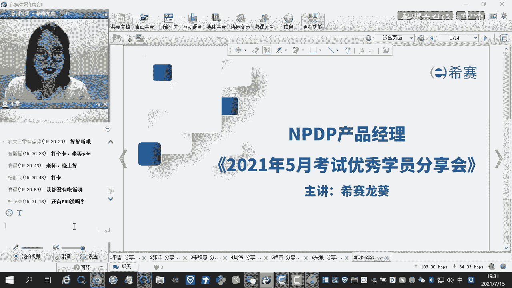
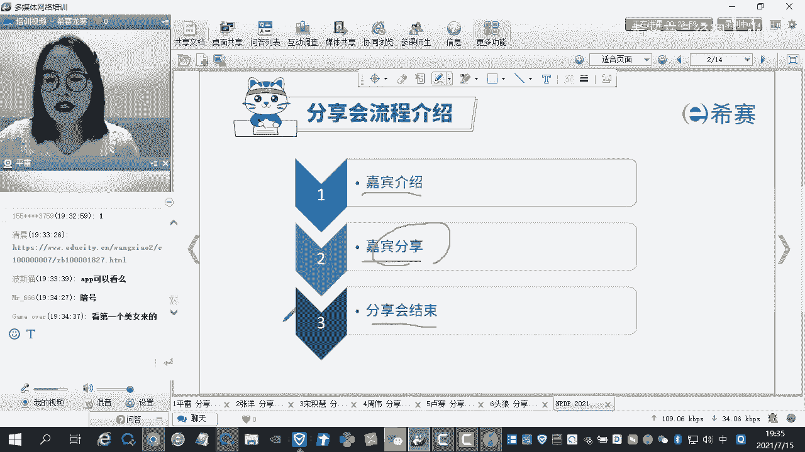
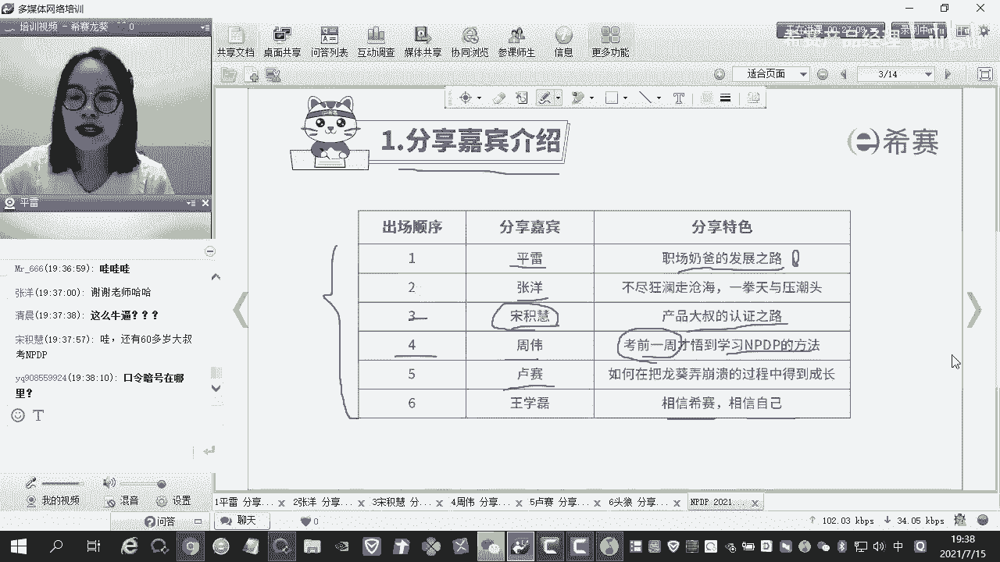
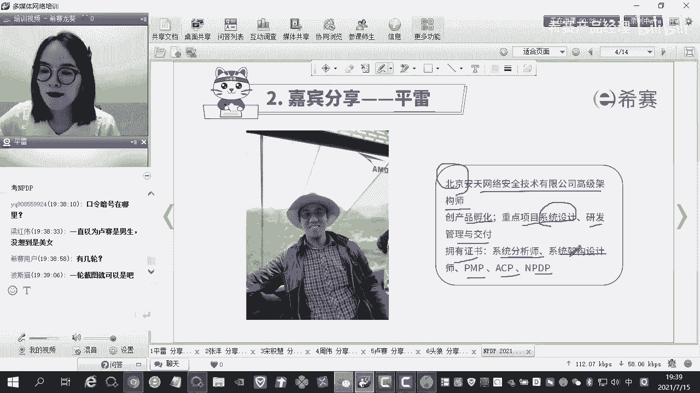
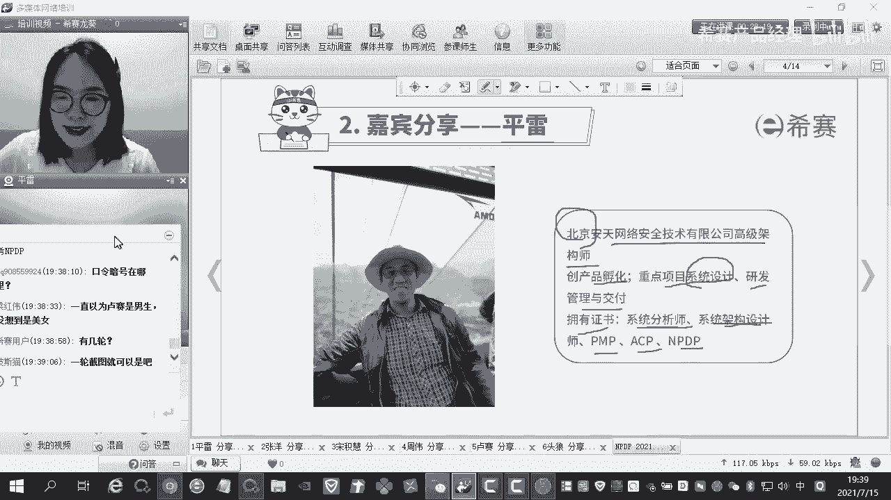
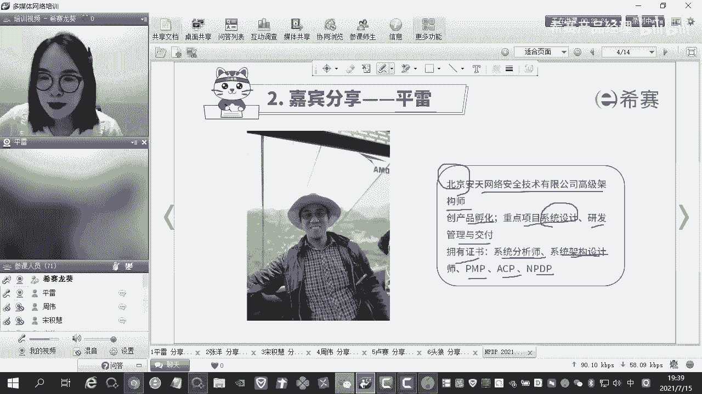

# NPDP2105班优秀学员分享-职场奶爸的发展之路-平雷 - P1 - 希赛产品经理 - BV1rs4y1t7zv

里面很多小伙伴都是认识我的，因为我之前带他们呃就是呃带这个NPTP的正课，也带NPTP的习题课啊。呃很多小伙伴刚刚才带毕业。呃，那也有很多小伙伴可能是PMP啊ACP啊，其他的科目过来的。

因为咱们这个课今天是一节公开课嘛，大家都可以听啊。呃，这个课程的话，主要呃今天的课程的内容啊，主要就是给大家相关的学员优秀的学员给大家去分享一下，他们在学习的过程中间是怎么样去取得高分的。

怎么样去高校去学习的。啊。因为我经常经常听到很多很多的小伙伴跟我说，他说卢葵老师啊啊我这个实在是太忙了，我硬是没有抽出时间来学习。但是我知道的啊，就是呃咱们今天要分享的这些小伙伴里面其实。

平时都是挺忙的，有很多小伙伴私下就是考完试了之后私下跟我讲，他说龙葵老师啊，嗯我其实每天也很忙，但是我每天呃就是下班回家了之后啊，就是刷题刷到一两点凌晨一两点，然后早上6点多钟又起来。

也就是说他那一段时间啊，基本上每个晚上大概就是睡个四五个小时左右，然后呢顺利的把这门考试给通过了。有的小伙伴会觉得说哎呀150呃200分考150分哦，我PMP或者说是其他的科目学了一两周。

好像就哎呀一下子就过了啊，然后就会觉得说这个NPDP好像听他们说比这个PMP更简单啊。那我是不是花一周时间就可以去学完呢，可以顺利的去通过这个考试呢？真的除非你天赋异禀啊。不然的话。

建议还是不要这样这样子去做啊。如果你这个样子去做的话，很容易很容易翻车。这一次的话其实是有小伙伴这样操作了，但他就翻车了啊，就是最终差个几分就真的很可惜。嗯，我相信在座的很多小伙伴有现在正在学PDP的。

或者说是未来啊想要学NPDP的。呃，先在这里给大家提个醒啊，其实不管学哪一个科目都应该是要提前去做好准备。嗯。自我介绍开场白呢就说这么多啊。好，呃，接下来的话呢。

我们就简单的看一下整个今天的分享会它的一个流程。

整个分享会的话呢是三个环节，其实主要的话啊就是两个环节。哪两个环节呢？第一个是嘉宾介绍。然后第二个部分是嘉宾的分享。然后第三个是分享会结束，在这个过程中间啊，我相信大家比较关心的部分。

除了嘉宾的分享之外，另外的一个部分就是这个PDH和PDU的赠赠送以及什么呢？以及咱们的这个三等奖二等奖和一等奖的抽取啊，今天咱们做一种非常简单的方式，什么简单的方式呢？

之前如果大家参加过以往的这个分享会的话，可能会有很多的一些繁琐的步骤啊，就比如说我要去对这个抽奖码呀，然后怎么地怎么地，就很繁琐。今天咱们采取一种非常简单的方式啊，大家如果刷过抖音或者说是刷过淘宝的话。

基本上来说的话都是知道的，就是用那种方式去操作啊。暗号暗号的话呢我。现在还不能说啊。我现在还不能说，等会儿咱们到时间点了之后，我会给大家去说这个暗号的啊。我会给大家说，唉，咱们今天的暗号是什么？

大家在屏幕中间打出来，然后截图之后呃去填那个收集表就可以了。收集表大家应该都是有的啊。如果没有的话，也没有关系。你后面截图完了之后再去找对应的班主任或者是对应的销售老师去做啊。

去问他要这个收集表就可以了。然后呃总而言之啊，咱们今天所有的奖品以及PDU和PDH都是会发送到位的，大家都不用着急，好不好？这是整个分享会的一个流程啊。

好，接下来的话啊先给大家介绍一下咱们今天的一个出场嘉宾，总共啊咱们是12个人分享。那么今天的话呢是由我来主持。呃，总共是这6个小伙伴今天会给大家去分享一下啊。

明天的话呢是咱们的这个小西瑶老师也是NPP的一个呃美女老师啊，呃到时候的话呢，他会给另外6个小朋呃，6个嗯这个优秀学员去进行这个主持。那今天的出场顺序啊，第一位嘉宾是咱们的这个评蕾。

他分享的特色特色是什么呢？职场奶爸的发展之路，有没有人现在是已经呃有一个娃娃或者是两个娃娃，两个孩子来的，会觉得说哎我工作之余，又还要去照看孩子，会觉得时间不够。那么他的话就给你啊一个启发。

说哎学习的时候，我可以如何去挤自己的时间。然后第二个是呃张扬啊。张扬的话，他的一个标签特别的明显，它有22个证，是一个考证达人啊，而且他本身来说的话各个方面都不错。

而且啊他的工作单位也是呃国家相关的一些单位啊。呃，大家如果比较感兴趣的话呢，到时候也可以私下再去呃问他的联系方式。同时啊他是北京人，然后呢还是单身。第三个啊是送基会。宋基会的话呢。

他的分享特色是产品大叔的认证认证之路啊。其实讲到送基会这个名字的话，我真的印象特别的深刻。为什么我第一印象我认为他是个女生。但是后来我才知道他是一个大叔。总而言之啊，就是我们的NPTP上一届啊。

有60多岁的大叔给我们分享他的一个经历，为什么到60多岁了，他还没有停止自己的这个脚步啊，一直在学习，其实是很激励人心的。然后第四位是周伟啊，他是考前一周才悟到学习NPTP的方法。其实。学习NPDP啊。

有的时候你可能学了很长很长的一段时间，你都会觉得特别的懵，也不知道怎么样去做题。可能你在考前的一周，你突然就领悟到了这个真谛啊。有很多小伙伴跟我讲，他说老师我就是考前听了你的那个串讲课。

然后我掌握了这个NPDP的这个套路。然后掌握了他的这个做题的技巧，一下子就考试就考了170多分啊，考的是非常好的。然后第五个是卢赛啊，卢赛的话呢，我对他的印象也非常的深刻。

深刻的点在于就是后台每天被他轰炸无数遍啊，就是我每天我有一段时间就是真的完全完全不想点开这个后台去看，一看就是一片一片密密麻麻的，全是他的提问啊。然后嗯包括在群里面啊。

包括在课堂上他都是非常活跃的那最后的话呢，他的这个分数也是非常高的啊，考的是第二名啊。然后第六位是咱们的这个王学磊啊，他分享特色特色是啊，相信西仔，相信自己啊，我们具体来看一下好吗？

好，第一位分享嘉宾啊，第一轮的暗号的发布，在这位分享嘉宾过后，我会发布第一轮的暗号啊，请大家注意啊，耐心的等待好不好？第一位分享嘉宾是田雷啊，田雷是北京安天网络安全技术有限公司的高级架构师。

我相信在座的不管学PMP还是有NPDP的啊，很多很多小伙伴都是学这个啊搞这个软件开发的。那如果啊同样在北京的话，其实私下的话，大家加个好友，工作中啊可以去谈一谈，然后私下也可以去重点的去交流一下。

他做产品的孵化啊、重点项目的系统设计啊、研发管理与交付。它拥有的证书有哪些呢？系统分析师、系统架构啊设计师，然后PMPACP和NPDP有的人会觉得说哎我同样的岗位我考了PMP。

我不知道要考什么学的NPDP我不知道要考什么，那他就给你提供了一种思路啊，系统分析师可以考啊，系统架构设计师也可以考，对不对？好，我们看一下啊，简呃掌声有请我们第一位啊分享嘉宾评雷。呃。

各位老师给呃参加西赛直播的各位小伙伴好。因为我的这个摄像头有点问题啊，可能我暂时投不了屏了。呃，我呢是评雷是NPTP202105年。

藏风班的学员很高兴呢能有这么一个宝贵的机会呢和大家一起呢聊聊天儿。这个西赛呢有一个非常好的传统啊，就是在考试结束后呢，会举办这样一个分享会。他呢搭建了一个平台。一来呢就是为了考生呢呃为自己呢做一个回顾。

阶段性的成果呢会有一个肯定。另一个目的呢就是为了给有意愿加入NPTP学习的新同学呢呃一个提前了解这门课程的机会。呃，不同的分享者呢，他会从不同的角度呢去对这门课程呢进行分享。

小伙伴们呢也有机会呢更加全面的去了解NPTP这门课程。😊，呃，作为第一个分享人呢，其实开场还是挺重要的。我呢既不是嘉宾中的最高分的这个分享者，我也不是身怀绝技的考证达人。那我要怎么进行分享呢？

其实呢我考虑了一下，我是想从每个人的职业发展和职业教育的关系的角度呃为大家去分享。我想通过这种差异性呢，找到与各位小伙伴的一种共性。如果你希望在职场中呢有进一步的提升，或者呢你面临中职场中的转型啊，呃。

想了解这个方面这个职业教育在这方面有没有什么帮助，或者你是奶爸奶妈，你想深入的学习，想提升职业的技能，但是你苦于时间比较碎片化。那么今天我的这个主题呢，呃可能会对你提供一些新的帮助和一些思考的方向嗯。

😊，好了嗯。呃，我的介绍呢大概分为这个三个大部分吧。第一部分其实就是呃职业介绍，就就是我的个人介绍和职业发展。第二个部分呢就是介绍这个培训的方式的选择和这个NADP的备考1234这个部分。

第三大部分呢就是我嗯我的一些呃深入的思考吧。看一看就是。😊，我提了一些开放性的问题。然后呢，根据我自己的实际情况呢做了一些解答，供大家呢有一个思考嗯。这个大家看一看吧，这个是我的自我介绍我就过去了。

大家看一看吧。这个职场发展呢，从我的这个理解呢，我认为它有点类似于登山者的自我挑战。如果你有好的发展呢，你需要努力攀登。但是呢你要有别具备这种向导式能力。就是你要识别出前进过程中的各种风险。

比如爬山中呃你可能会遇到冰冻。那你不小心就掉下去了。呃，你也可能会突然遇到坏的天气，这个时候呢就会让我们的前进呢变得比较困难。在整个职场过程中呢，其实我们也会遇到种种情况啊，比如说企业的经营不善呀。

或者或者所谓的人员优化呀，比如说行业的衰退。那么这些呢就是我们在职业发展中遇到的困难。那现在比较流行的话术呢，就是说我们遇到了一个职场的黑天鹅，比如说像去年的或者前年的P two啊，因为K12啊。

这些可能都是呃职场人的一个很大的困惑，它就属于一种很难去改变的一个事实了。那么作为攀登者呢，其实我们的目标呢是登顶。所以呢我们遇到。😊，冰坑的时候呢，我们可能就要绕着走。在我们知道坏的天地的时候呢。

我们就不要逆风去前行了。等到合适的气候条件的时候呢，我们再去向顶峰呢去发起这个发起一个冲击。啊，所以呢我刚刚聊了一下这个做一个类比啊，就是我刚刚聊的这个职业发展和规划呢。如果是你爬山的动力。

那么职业培训它的作用是什么呢？其实我的理解这个职业培训它就有点类似于登山者的工具，当你需要爬这个陡峭的峭壁的时候，你需要做进行你能力突破的时候，你需要借助登山斧去像上做这个攀爬的冲击。

但如果你遇到了这种坏天气，就比如说是这种行业上的衰败。因为因为我们现在行业转化很快啊，遇到这种行业上的衰败。那么这个时候这个职业培训对你帮助，他有可能就类似一个帐篷，他可能能让你安身。

能让你有一个喘息的机会，能让你继续去去在你的职场路上去发展，这个例子其实在IT行业是是比较常见的啊。因为我们如果做IT行业的话，好多人说哎呀35岁顶峰做到架构师，然后呢做到以后做什么呢？

去做外卖的快递员了啊，这个校话可能有点极端，但是他也阐述了一个道理啊，就是在大的趋势面前，其实我们真的是要提前的做好准备和规划的，不然这个社会。😊，看你的时候，他是不会跟你提前打招呼的。

接下来呢我想分享一下我的职业发展道路。然后大家去感受一下，就是我是如何把职业培训和我的职场发展去去去进行这种呃互相这个辅助前进的。我从毕业到现在呢，所学所用呢基本没有发生变化。

我的大学呢是北京大学计算机应用的高招自考的学士，我是学计算机应用专业。😊，啊，然后我的工作呢一直也是在这个IT行业的去做工作的。第一家公司呢是我自投的简历，是天荣信。它呢是这个当年是在十几年前啊。

他是当年这个网络安全的黄埔军校。我当时呢是主要是做研发。呃，第一份工作呢，其实敲门砖比较重要。就是你刚刚毕业进入这样一家企业。呃你怎么去拿到这个offer。呃，回回回首来看啊，可能当时我自己的优势呢？

一个是呃我自己的学校的牌子。因为当时北大的自考还是非常硬的牌子。第二个呢就是我参加了一个呃就是类似于呃网开发的实训，就类似于现在我们知道的那种呃给毕业生去做的这种实训课。

大概有3到4个月你去学习你工作中常见的开发的知识和技能了解基本的流程啊，大概就是类似于这种实训课。所以因为有这两个两两点呢，我就成功的入职了这个天荣信。在这里面呢，我主要是做这个呃产品的研发。啊。

主要是做标准产品研发，就是在类似于P里面的这种呃走量的这个产品，走量这个产品，它的销量比较大做防火墙的产品。第二家公司呢是和CRM相关的，就是呃现在已经是在创业板上市了。这个公司我当时做的时候。

我是从零开始做产品研发。我说的零开始就是我做这个产品公司是没有这个品类的。呃，我们就用了像NPP里面的这种这种一级啊和二级的这种市场研方式一点点积累的去做了这个开发。在这个时间呢。

我接触到了这个软件开发的这个全身的流的流程。我呢还写了一些就是现在看就是装资产，就是为公司去积累的积累的这种CMI的这个呃产品生命周期流程的管理。这个稿子是我写的，所以经过我写了这个东西以后呢。

我慢慢的就软件开发的全流程对这个。😊，对这个呃呃产品开发呢已经有一种感觉了。嗯，然后呢从这开始呢，我觉得事业就开始有一个比较大的前进和腾飞了。

第三家公司呢是一家是EMC可能早一点的小伙伴可能知道当年就是EMC是世界百强啊，他是网络安全是楚节的巨头当年淘宝干了一件伟大的事情啊，叫去IOE可能大家听过爱IMacE就是EMC啊。

这是一家巨头公司在那家公司里面呢，其实我可能呃这个入职也是有门槛的啊，就是他就是这个对我的门槛是什么呢？因为我已经有了这个产品孵化的这个就是全流程这种能力了。外企的话，他对英语的要求是很高的。

他的英要求很高。所以我正好是在我毕业以后呢，我我去学的雅思，当时是天天的泡在教室里一天七八个小时跟老外在那叨说英语。所以这个技能呢我就。😊，保留下来了，就是在和别的竞争者差不多情况下。

我的英语是确实是比他们要好上不少的。所以我就拿到了这个机会啊，到这公司以后呢，我就接触到了这种ROC啊。

就这种千万行级和操作系统一大小行级的这个系统呃也接触到了这个叫叫product family就是全就是家族产品。我在那里做了3年的时间，我几乎研发了整个这个express系列的全部家族产品我都研完过。

因为公司需要轮岗所有产品我都做过。所以在这个阶段呢，其实我就对呃开发流程对这个产品家族的这种产品组合的设计呢，已经有了一个雏形了。在那个阶段呢，我是一年这一年之内呢，我就参加了PMP和ACP的学习。

ACP我是中国区首考通过的中国区第一次正式考试通过的。😊，嗯，呃后来呢因为这个EMC呢这个和戴尔合并以后呢，他做了一个业务的关停转型啊。

我们我们这个我们这个比较好的用个部门叫inform intelligenceal group这种智能信息部呢，一个很庞大的组织呢就就没有了。后来我们就就离开这家公司了。嗯。

因为当时这个IG这个部门还是呃真的是非常强大的。呃，当年的华为呃基本上它是以不计不计代价的再从这研发人去做和竞品相相关的一些工作啊，我也接到过这个电话。嗯，后来呢这个因为这个企业转型呢。

我就因为这个这个企业转型人员优化呢，我就到了这个。呃，这个另外一家这个网完成的头部公司，他叫这个。我在那里面呢是做pro team的一个团队的领导。在这里面呢，我是主管的是后半段。

就是产品生命周期的后边的管理，主要是对一些发布过的产品做这个大的系统重构和优化啊，当然大也不会特特别大了，大的系统重构和优化，去提升这个产品的质量。提升产品质量以后。

它最大的好处就是我们技术支持人员在产品发布以后的两三个月内，他们的工作量会得到锐减。比如说以前可能你需要加盟加点。现在的呃你处理case的量呢就是处理这个问题的量呢，嗯，经过两年的调整啊。

我大概做了两年持续的优化。呃，下降了70%左右，加上70%左右。就是以前可能发布你可能要处理100个问题，现在可能只处理30个。那这块的话，我是对呃产品周期的发布以后的这个管理其实已经有了一些感觉。

大概知道是什么样的方向去怎么做。嗯，后来因为这个呃资本的这种变更啊，这个他从纳斯达克退世了，从纳斯达克退世了，被这个呃另一家世界外强的公司。大家可能知道雷神收购了，现在改名叫forth point了。

他主打的是美军的房屋，不打美军的房屋。呃，因为这个原因呢，就是整个的研发中心全部搬离中国了，全部搬在中国，所以我也就我也就离开了。然后呢，就是后面的话。

我我到了一家这个呃之前我看到啊赛普曾经排名过世界第一，曾经排名过世界第一，和微软大概是同样体两家公司。赛普这家德各的公司我在那个那个这个公司呢主要是做这个平台部平台部主要是做顾问和一些架构相关的工作。

这这个时候其实我接触的产品就更多了。就是我在平台部的话，呃隶属于我应该负责范围大概有2000多个产品，有200多个产品，可能我没有接受那么多啊。然后在这个工作中呢。

就是帮助客户呢去解决这个我要到客户现场，或者去做一些呃比如说像我在美国会去做一些crical center这样的工作，去直直面客户去解决他的痛点啊。

这个是赛普最强的技术中心的呃人员可能都都在那个都在那个部分了。因为他是整个整个公司的最后一道技术屏障。如果他倒下了，那么这个问题能真的解决不了，我在那部门去工作的。在那会呢就是有机会。

去真的去看一看作为一家巨头公司的产品的演化的过程是什么样的。我曾经研究过哈娜，他大概做了15年的演化，就是从一个文档的搜索系统到一个内存的存储，呃，做各种的组合。呃。

全就是全部的垂直流程式的这种创新组合，最后成为一个呃非常强大的平台。这个平台如果说哈娜可能大家不太清楚啊，现在就往现在的电商，现在电商呢基本都是互联网公司自己做的。

但是呃赛孔的成功的交付了中国第三大电商项目，就是苏宁易购。苏宁易购整个就是用哈娜的这个框框架去做的。它支撑了一个企业级的软件，支撑了一个中国这么大的体梁，而且是唯一这家企业，这个是非常了不起啊。

就是不管是微软还是欧瑞口这些公司他都没有做到。这个真的是十几年的积累，才能达到这种。对。后来呢这个因为企业的这种转型啊，他的目标呢是从这个项目交付呢转到了这个咨询顾问。

北京这边呢会有一个呃比较大的调整啊。我借这个机会呢，正好也就是朋友介绍呢，我去到了另外一家五百强的公司，它是AIA是以前是隶属于美国信息集团的，就AIG集团的。呃，它主要是做金融和保险行业的。

在这块呢就是我是在海外在新加坡呢去带领团队呢去交付一个呃整个把新加坡公司的AI公司的全部的工作流做一个替换的工作。这个举一个比较形象的例子，就类似于呃人体的换脑啊，就是直接把这个把这个脑袋换掉。

所以这个流程是很复杂的。呃，本来呢这种工作呢应该是用敏捷的开发的效率会好一些。因为不断的去做调整。但是呃新加坡的这种客户的风格呢，它是严格的要求，必须用普布的方式去交付的，他必须用普方式交付的。

所以这块呢就是对我。😊，呃PMP的这块的这个知识啊，对我是影影响非常大的。就是包括一些干系人的管理啊，干心人的期望啊，你去怎么挖掘期望啊，将这些事情啊是非常重要的。

因为有时候客户嘴上说他要功能A其实他内心的想法可能是一些他不愿意说出来的事情啊，有一些不愿意放到明白说的事情。这个时候就需要通过这种关系员管理软技能啊，不管是中午聊天示范啊，还是开玩笑啊。

把这些本质的原因挖出来。然后你去看看就是他提这个要求，如果我们做不到的话，我们怎么能去满足他的需求，他的最本质的需求帮他去用一种我们能控制住成本的方式去把它交付。😊，嗯。

呃这个呢嗯后来呢我是到了这个因为这块呢交付完项目以后呢，老在海外嘛，所以毕竟是要落叶归根嘛，还要成家嘛。所以我就回馈到这个到了这个国内了。我到国内的话。

也正好是一个这个上海的这个呃记E的列这个人力的机会嘛。他他他跟我说啊，其实记忆挺不错的。那个你愿不愿意来记忆就有发展。所来我当时看了一下呢，就是呃记忆那边呢嗯曾经记忆是世界上最古老的公司之一啊。

他大概是18几几年成立的啊，爱迪生呃成立的。呃，是这个呃最老的进入这个拉拉达克呃哎是到我忘了道金斯阿拉达克了，最早进入道丁斯拉达克的成分股指的。呃，最先进的这个企业，他是美国工业扛把子啊。

就是从电灯时代，到蒸汽机时代，到风电时代，到我们现在的航发以及我现在工作的这个部门就是。😊，是我这个部门叫科学，叫医学影像部门，是叫GEHC叫GEhealth careG医疗这个部门呃。

基本上都是垄断了世界最顶尖的工业工工业产品啊。所以我我是对这个比较有兴趣，然后就来到这家公司。当时呢就是呃这家公司特点是什么呢？因为它是一个软件和制造业结合的。

所以我在这边呢呃主要用到了敏捷和精历两种方式啊，作为这个产作为这个投资机呢，他可能更多的是比如说临。17273期啊，然后临床啊，他更多的是用到这种经历的方式。然后在开发期间呢。

他可能更多的是用到了敏捷的方式。这2块呢，其实我觉得我还是挺合心应手的。这块的改革呢是我们是在一个小团队做试点。呃，一共整个全全世界只在中国亚中心找了两个团队，我是两个团队中间的一个成员。

我是做我我当时的职位是自深研发工程师，主要是做一些独立科技的研究。然后带一些团队就是类似于upma这样角色吧。嗯然后这个还挺成功的，还挺成功的。就是运用这些技能的，能看到就是我们每一个迭代啊。

就是可能每一个大的迭代的这个成员分都能在稳步的上升。然后公司的这个能力哪个壮大，就是我离开的时候，大概从两个团队已经做到了4个团队的，就仍员已经扩扩边的很很大了扩变很大了。呃，这块呢也接触到了。

因为核司机呢它是属于医疗领域最尖端的设备，所以他的研发流程是我见到的是我职业生涯建到的要求研发的流程最严格的最严格的工业级的流程。

全部呃因为它分成这个class class class啊什么制残之这种码要求非常高。在这里头呢有机会去接触到一个更严格的流程啊去看我们去做做这个研发阶段是怎么扩的啊，能看到这个离开呢是因为。

是什么原因呢？这个我想特别的说一下，因为当时呢就是呃核斯基因呢本身是软硬件呃结合的这种设软软硬软硬固结合的一个大型的一个大型的设备啊。呃，一个呢是我们国家呢现在没有就是造的这个能力相对来比较比较差。

本身核斯机的这个三大巨头GPS啊GE嗯飞利浦和西门子的，几乎这三家是垄断了全世界。80%的核磁机的制造能力，这个是非常厉害的。然后让我比较比较心痛一点是什么呢？就是核心的部件，比如说像高速的核磁转换。

就是这个数摸转换装置啊，一些呃高性能磁体啊，就这些真的扛大g的这种东西啊，我们国家是造不了的，是造不了的，需要依靠。😊，美国的。国会的特批才能运到中国来去进行组装。这个是以前就是这样这么一个情况。

所以我们在打中美贸易战的时候，在这块就是这个制裁这块就是没有没有敢下得了手。因为如果这块我下手的话，和我们损失很惨重。这个欧美的发达国家大概在这块的话百万百万人均可能拥有30台以上的机器呃。

但是我查的数据在2017年啊，在2017年16年其实我们百万人均可能是6。2台差的是非常巨大。所以当时我觉得嗯因为因为本身这个研发中心在全世界啊就是GPS研中心只有中国有我们自己的研发中心相对来说非常少。

所以我希要通过这种方式去去去表达我的爱国热情啊什么的，很难。然后正好借助一次机会呢呃我结识了天啊，然后我我毅然决然了放弃了这个这个也是有这个贸易战的我的一些情绪在里面啊。

所以我就放弃了这家公司呃直接投奔了这个天天呢我想特别的介绍一下。今天的话可能这个名声呢没有我之前的这些公司的名声大，但是他是一家非常他是一家逐步在走向伟大的公司，逐步在走向伟大的公司。呃。

大家可以看一下这个照片啊，这个照片中间这位就是我们的习近平主席，他曾经两次借鉴过我们的董事长，一次是在公司的视察，一次是在网络信息会议上，这个是作为唯一的一家呃民营企业呃，习主席给予了很高的评价。呃。

安天呢是这个网络安全的国家队啊，安天呢做了很多的，不管是在民用啊，还是在这个政府事业上做了一些非常大的这个成绩。呃，包括呃比如说民用啊。

我们常用的手机呃华为、欧博、vivo和小米这四个主流品牌的后台的杀毒引擎，全是安天提供的啊，这个是很很了不起的很了不起的。呃，从这个国家事务上来讲呢，就是呃比如说。呃两会啊，以前的奥运会啊。

包括一些重大的历史事件。比如说卫星发射和前段时间，我们假这航天的发射，当天呢全部都做了这个呃这个安全保卫的工作。新息保卫的工作。所以因为有了这种背景呢，我是非常的自豪啊，我觉得我特别想加入这家公司。

当时来的之前呢，我做了两件事。第一件事呢是我学了一下虽然我在虽然我有很强的安全公司背景啊，但是这家公司是做威胁的，做威胁的，所以我专门又学了一下呃参加西赛的学习。

学了一下网络工程师和新息工程师大概是也是一次的突破了。我在那上没有介绍。因为那是终极的，所以我没有没有写到上面。呃，再加上我之前的背景呢，我就顺利的加入公司了。在这边呢其实我的主要工作呢。

可能就是做一些新创产品孵化啊，所以线产品孵化，这个呢基本上是属于摸着石头过河啊，就是没有前人去指路。所以需要对产品创新产品孵化能力会非常的强。还有一个呢就是我做这个呃。这个。

十三五啊十三五收官和十四五开年的一些重大的国家工程呢，因为国家工程它很多是是要连续的，所以对产品的长期的规划能力呢要求也比较高。在这块呢呃我之前介绍的一些履历啊，可能看到全都有涉猎呃。

在某一块呢可能也比较精砖，但是把它整个串起来呢，我还是觉得其实有一些吸引有力力足的，所以我就呃想考虑去去学这个PDP的课程。呃，当时呢我是做了一些。呃，我本来是想找线下的课，后来我没有找到。

当时我想可能是疫情，后来我就选择了我的老朋友这个西塞。呃，实践证明呢，我选择西塞是非常非常正确的一件事。后面呢我就进入到下一个环节去去探讨一个，就是说如果我们在工作中需要去做一个职业教育选择的话。

我们大概是什么样的方式。然后针对什么样的。情况去做什么样的选择？前两个呢，01和02呢其实就是偏重于自学，偏重于自学的。一个自学呢，其实就是我们说的裸考啊，就是你自己如果非常熟呃。

你可以去裸考这块的话呃我学软考的时候呃，中级的话是有全靠自学去考的，一次通过的也有啊，中级的呃，另一块呢就是说你自己如果比较熟悉呢。但是呃。你对考试本身不太理解，不太了解，希望能掌握一些套路啊。

呃做一个加强的。这个时候呢你可以选择学习包。这个学习包呢大体上就是一些呃文档，一些文档类的东西，包括一些真题这块呢，我觉得因为我学习包，我好像是我忘了西赛的哪门课，我我购买了学习包啊，当时也是很不错。

我忘了是是是是哪是哪个课了，也都很顺利都通过了，很顺利通过了。所以这前面的自学和学习包呢，主要是说大家一个呢是我的本职工作我很熟，我只是想。呃，通过一个考试呢，帮我是不管是增强一下。

还是说去做一下系统的梳理。呢。那么前两部分其实呃是你的不错的选择。后面两个呢，其实线下授课和线上直播呢都是属于呃以老师为主导的。然后当然老就是老师来主导你自己去学的这种形式。线下呢其实呃他的这个特长呢。

就是呃你可以直面老师，你可以直面你的老师。然后呢，就是这种临场感比较好。但你有什么缺点呢？就是这种线下课呢，一个价格比较高。还有一个呢就是呃。这个呃课时往往会比较短啊，因为他需要租酒店啊，需要租什么。

我的PMP和ACP都是通过这种形式在酒店去学的，所以学费肯定是不便宜，肯定是不便宜，而且学时也比较短。嗯。线上直播呢这块呢我觉得是一个挺不错的一种方式。第一呢就是线上直播呢，我们学习时间呢比较灵活。

对于我来讲，因为已经成家了，所以呃真的是很碎片很碎片。这我我基本上很难去看到老师的直播课啊，可能让老师直播课，我大体是看老师的录播课的。但如果你上线下课，这是这是不可能的。老师只要上了课，下课他走了。

你你不可能再你不可能再去做这个事儿了，你可能也只能去看看他的录播。嗯。然后另外呢就是说呃这个线上直播呢，他呃为了弥补他的不足，那呃现在也有这种答疑，就是这种问答的这种环节。因为老师讲课呢。

他可能呃鉴于这个网上这个时间嘛，可能大家提问啊，这种敲打字呢会比较慢。呃，还做了一个很有意的补充，就是做这个呃课后这种答题，所以我觉得线下直播的优势也是很强的。就是呃就是线上直播的优势也是很强的。

他可以通过网络呢进行这种答题。还有一个呢就是呃因为我们是通过网络相识的嘛，所以我们会建立一些群一些组，这些小伙伴呢可能将来就是你的职场人脉。他也可能进来说呢，他可能帮你能通过考试的一些问题的解答。

样来说呢，他可能就是你职场人脉或者交个朋友吧，或者交个朋友吧，都都是一些呃比较好的事情。包括群里有时候我还会看到发到一些招聘的信息啊，比如说找产品经理啊一些的相关的，所以线上直播呢是是挺会做一种选择啊。

待会我会专门跟大家去介绍一下。我对西塞的这个直播的这个介绍啊。然后面呢是我一个备考经验的分享。这块呢呃后面的小伙伴可能会介绍更细。我这块是摘了7个点，摘了7个点，比较力度比较大。大家可以看一下啊。

第一个呢就是如果你想参加边考试呢，你大概要衡量一下你自己优势和劣势。比如说呃对于我考P呢，可能我的优势呢就是文化同源。因为我在外企工作了十几年，我天天说的天天用的呃，基本上就是作者宇创的那套。

所以大体上我读原著呢呃基本上也没有什么太大的问题啊，而且呢我之前也考过ACP和PMP这2块呢是MDP里的一部分，大概占了百分之。😊，啊，可能有10%吧或者多一点的这么一个啊。

然后实践上呢我有多年的研发经历啊，所以这块的话，如果是做产品开发去说一些理念啊，做一些事情的话，我基本还是具备的那劣势呢其实比较明显啊，就是学习时间非常有限了这个。😊，海爸呢平时的时候是上班呃。

回家呢是伺候娃，周六日呢可能也要带娃去上课，所以属于自己的时间呢是比较限的。还有一个呢就是随着年龄的增长呢，这个记忆力肯定是下降的。毕竟说我们讲课呢，可能比如说做一些呃流程啊，或者一些战略啊。

他们会分层级，这个层级可能是个大矩阵，横着排竖着排一些25个，可能也记不住。这块的话是我一个是我一个劣势啊，是一个劣势。第三个呢就是直播课几乎是我只听了一次，我真的是听了一次。

剩下的课剩下的课可能可能听了有听了有一半多一点吧啊，但是这一半多一点，是非常有价值的。因为老师质量上课质量常高的嗯。😊，呃，我主要听的课程其实是龙老师的这个习题课，这个我真的是百分之百听了两遍啊。

这个是没落的。所以这块是抓住了一个会考试来讲，抓了一个核心啊，会考资料的这块呢是我写了一个我自己觉得呃这个比例啊就是你分配时间上的一个比例。首先呢就是西算的指质教材呢，呃这块如果你学习你可以看到啊。

我大概是25%视频呢包括直播的视频和和那些是就是事先录好的一些视频，就是之前录好的专门讲课的那种视频，大概是35%学习。呃，另外呢就是题库，题库这个量是很重的啊，我把它落到第二位。

就是呃不管你学就识有多强，最终最终通过考试了。所以题库这块我大概压30%的时间。其他的学习资料呢就是指的话呃PDMA它自己有一些教材，但是不是是我们是我们。不是我们要求的那些教材啊。

但是他有些题目会从这里出。我我看到习题课题库里面的一些解答，会直接说我的答案就来自于这些书。所以如果你特别的需有余力的话，呃，你可以拿一些时间去看这个这个PDMA自己出的一些教材。它老三四本吧。

就是如果你在京东或者哪直接搜PDMA就能看到这些这些书名字。😊，呃，学习呢因为我。时间比较碎片化嘛，所以我大概教程来讲肯定比较通足的。第一遍，我有大概印象明确的重点。

后面呢我是按照自己熟悉的方式去组织的学习。什么叫自己熟悉的方式呢？就是这这个考试的这个7个章节，我读进来以后，我自己觉得很顺。所以我重新整一下，我把工具和那个市场研究这块，我自己单拎出来了。

就是前5块呢做一个系统的学习，后两块呢做一个加强的学习。所以我复习课的时候，就我自己学习的时候，基本就是前5块是是一大大部分，后两块是一大部分啊，大概是这么做的我视频学习呢那个刚才我介绍一下。

我这个列的这个顺序呢，包括980的视频呢，龙老师的视频啊，罗老师的视频啊和喜马拉雅的音频课这是我大概学习这个优先级，就是我自己比如说我时间不够了。

或者我就一点时间我会先看哪个后看哪个我听我重上面的时候觉得比较重要的。下面呢可能是我觉得比如说喜马拉雅有时间就听一听的时间就OK了。😊，啊，这个。呃。

模拟题库这块呢这个呃西赛呢也是提供了章节练习啊、模拟题啊、专项练习，这些我觉得是挺不错的。呃，我呢额外去做了一些压力上的练习，所谓的压力练习呢就是呃我每因为考试呢是做200个题目嘛。

每天做200个题目嘛。所以我呢是呃。每天做400个题目，就是按照两倍的量压下来，要按照两倍量压下来，就是去给自己一个压力。将来去考试的时候，你会轻松一点，每天要做400，就最后冲刺的时候。

每天必须做400个题400说的。我总的题量大概我看了一下我后台的报告啊，一共大概做了不算重复重复做啊单题可能做了两个700多1点啊，这个是一个中等偏上的一个量吧，中等偏上有量，因为我没有时间看。

因为我没有时间看视频。那所以说我有些不明白的地儿啊，我也没办法提。这个时候通过后台的我会去做思考啊，会做思考。然后呢有问题呢不隔夜把我的想法，然后的疑问呢一起呢去发给老师。然后呢。

龙老师呢会非常细致的帮我去解答。龙老师解答真的非常棒非常棒啊。然后呢我和老师呢去做一些积极互动互动。比如说有些不明白的，我可能会反复的跟老师去去去确认这个事啊。😊，第七点呢。

其实就是我对学习上要求更高一点啊，就是脱离书本了，叫知金合一了。第一个呢就是知识点呢，就是你看多了以后呢，你会他有一个全面的联系了。就是你看到第一章第七章内容可能你就知道是什么啊，就是这些联系是什么。

然后在这个我的产品规划，包括我的这个项目的这个系统设计中呢，我会去学以致用，我会去学以致用。比如说让我们写个产品小测的是吧？那我会按照我们这个我们这个NPP里教授的这种流程呢。

我们会去写写完以后你看上去哎确实看上去这个呃效果还是不错的。然后包括比如说我对生活中的一些产品的选择呀，比如说选择手机呀，或者选择汽车呀，这些产品的时候，你会发现各个厂家的策略也不太一样。呃。

你能读出这个产品策略背后的东西，这块其实对你去做一些生活上的选择也是挺有好处的。所有这些加一块呢最终呢就爆出了一个呃应试激累的灵感了。就是最后你可能看一些东西。😊，你可能觉得题目模模糊糊。

但是你直觉上觉得这个就是对的啊，到了之间合一这个地方的，可能就不太会再去区分知识和和实践了，就是会会会迸迸发出这种东西。我把我把它称作叫应试的灵感吧嗯。😊，大体上备考的分知识分享的是这块。

后面呢是呃我我补充一个扩展阅读啊，这扩展阅读呢，我我我当时除了PDMA呢，还读了这三本书，呃，有的是读了一半，有的是读了几页啊。这个NDDB这本考试书呢呃他是这本书的作者是非常有名的啊。

在十几年前我学PMP的时候，这位已经是大家了啊，大家可以看下书名就知道。😊，我对他的呃读后的这种内容评价，我觉得是扩展阅读可以做五星的。第二个呢，这个高校通过MDP呢。

它是呃我的我我ACP考试时候的老师啊，他考老师。然后他也是P教材的翻译者之一啊，这个教材呢写的也不错，写的也不错。老师呢可能是比较就是比较严格严谨的去写这个书的。

所以所以我呢给了他一个四星四星不是说写的不好，就是因为他很严谨嘛，所以跟我的教材其实差异不大，就是就是这种差异性来讲，我觉得可能打不到五星最后一本呢这本书呢，如果你真的以后想在产品里头想再深入研究。

这本黄色的书还真是非常棒。我当时看了一眼有一种高山仰的感觉啊，真的有一种高山仰的感觉写的非常棒。我为什么推荐三星呢？因为他太难了，我觉得考试。😊，你就不需要了。就如果你真的是将来要做产品的话。

这本书真的是可以作为你提高起领的一个一个销程。这本书已经卖卖断货了。我当时是溢价200%买的这种书，我记得上有好像一价两价。出去。后面的话就是我在考场上的一些经验的分享啊。呃，一个呢就是在我们考前的。

大概这段时间呢，你就别再熬夜了，考前一两天。那适当的就考试当天呢，我基本上早起了两个小时。😊，呃，我是大概是5点半起的床啊，然后我看了一个小时的，适当的浏览了一些快速的错题答案啊，一个小时6点半。

5点半呢吃完饭7点我就出发了，到考场的话，应该是8点多一点啊，8点多一点就入场了。估就考试了。第二个呢就是考试的时候呢，这个你的心态呢肯定是要放松的。呃，读题目呢有一些关键字呢。

就是我们叫keyword，这个你肯定是要标出来的。尤其是这种没有不可能如果你看到这个答案有两三个选项都很正确的话，那你就要小心点了。有可能呢是呃这个第三个也对。那如果三个都对，就肯定不对了呀。

有正确答案有可能就是那一个，最后一看这题可能问的是不可能或者没有。还有可能就是全部都是，如果全部都是了，可能就是另外一个答案了。😊，啊，这个合理分配时间呢这块当时龙老师给我们的建议啊。

是555的这个这个这个这个这个这个时间的。但是既然我的这个。因为我这个耐力啊没有那么强，我耐力确实没有那么强，就是分拆成555的话，可能我坚持不下来。所以我就拆成了150和50。我按照这三个比例做的。

就是第一次呢花一段时间做了100个题。A看剩第三啊过半了，第二次呢感觉有点疲累做50道啊，差不多了，最后咬咬牙，哎，再把最后骨道做了。如果要是5555分的话，可能我做到第三个，我后边我就有点难受了啊。

这个完全是看个人的年龄和体力啊。😊，呃，第四个呢是关于考场，这个我可以说一下，考场的话提前给大家去介绍一下吧。呃，考试呢因为费用不低，所以考试的这个服务呢还是挺周到的设备呢是非常齐全的。

包括考试的指引啊，你去了以后不用门全找不到考场，非常详心的指引，还有带锁的柜子保证人手一把也不会你抢不到柜子，全套的文具除了计算器也没有提供室内呢有空调，有空调也挺凉快的，瓶装水你也不需要带。

我夏天考的，还给你提供水，化钟化钟直接挂在前面，大家都看得到考试过程中也是可以上卫生间的，这个也很随意，然后不足呢，就是反正我当然去了这考场可能封布时间比较长啊，除了有点土。😊，呃。

然后考试前的进明间的时候呢，那个人太多了，他大概就几三四个位置。我看排了七八个人。呃，这点小伙伴们，你要你要注意一下啊，你看你是不是如果考场，你是在楼里，你是不是要去别的楼层去看一看。呃。

这这这块是我当时没想到的，不安进考场了，在那排队排的时间有点长嗯。这个时候考试的成绩啊，大概大家可以看一下，一共是7个部分。7个部分的话呃，我我说的最低的两个吧。

一个是这个cture cultureture这块其实我没有太多的下功夫，基本类似于裸考啊，就是就是至少跟其他比没有下么大功夫。因为主要是建于我自己的一个企业文化我的理解，包括我在团队。

所以我基本上和那几个比是裸考了，是80。另外呢下一个呢这个80%就是这个to和这个呃和就是就是工工工具这块呢这块的话，呃，因为他确实比较多啊，也是我们历来考生的试分项，这块是40%呃，有40个题目。

所以这么着算下来的话，我大概是应该错了8个题，我错了8个题，8个题目。这块8个题目可能也不少了，错了8个题目啊，这块的话，如果说大家想冲刺高分啊，想冲刺高分的话，可以从这个。😊。

这个占比比较高的20%的种占比去去出啊。呃，最后呢就是这个。呃，我我呢有一些职业上的思考啊，有一些职业上的思考。呃，第一个呢是你如何去看待你职场发展中的这个职由教育，它到底是锦上添花还是雪中风炭？

从我的观点看啊，如果这个职业教育对你来讲是雪中送炭的那你一定要把它认真的学好。因为雪中送炭的话，它是拯救你职业非常重要的这个这个环节啊，就比如说像我聊到的，哪怕说你在非常大型的企业。

甚至是投部的行业资转型的淘汰。整个BU的淘汰，他不会跟你去打任何招呼。所以千万就得保证这种怎么说保证这种进取之心吧，啊，锦上添花这个事也问好了，因为有一些企业的话，对于学证呢，他第一个管报销。

第二个可能会有一些呃不管是工资啊还是奖金呢，他会有一些对方的福利，这块也是不错的。所以如果是锦上添花的话不错，但是雪中送炭，你更要去重视一下这个事。第二个就关于续证啊，证这个事呢。

我觉得因为我考的事比较多啊，我就是续证费用下来有可能也不少。所以我也跟朋友们聊过这个证呢前两年前两次你是配续的。到后来如果说你的这个技能已经完全和你和你自身融为一体了啊。😊。

大体就大体就不用去去做这个取证，大体不用去做这个取证了啊，你就可以去选择了。后面你如何去选择职业教育呢？我觉得刚才我这举例四项呢，你可以根据你自己的这种你的资源，比如说你的时间，你的你的学费的。

你你可以支你可以支持你学费花多少，然后结合你的实际工作经验，你是你是新手，你还是老手，包括你自己未来的这个职业的定位。你将来是想你是想转型，你还是想只是在他做深造。

这些可能都会影响你做职业教育选择方式的这个。😊，这个决定啊这块可能大家自己努虑吧。最后就是想看一下，就如何去选择这个这个职业教育机构啊，这块的话嗯。我觉得这几点啊，第一个专业性强，课程质量高。

认真负责啊，这些呃是一些基础的要求，后面可能就比较提高了啊，包括为学员提供终身的服务。这点我觉得西赛做的是非常好的，现在做的非常好的。

我我我之前我是非常老非常早就在听张永生老师的张永生老师现在应该是西赛西赛的董事长，那个时候还是张永生老师呢，那个张生老师，所以我是看到西赛的发展真的是越来越规范越来越好。呃，真的是我的朋友。

如能一家能和学员做朋友的教育机构，是非常值得信赖非常信赖。我这边好像有一张图，我给大家分享一下，因为作谓的结尾了。呃，大家可以看一下，就我这六张图啊，这6张图的话可能就是我不同的一些职场经历。

第一张左上角是我在son的一个工作照，下面呢就是比如说写个这个ment这个是我在美国的美妆的这个合资中心去工。😊，一段照片呃，在下面SCP呢是我在美西的的这个美国总部去工作的一些照片。

当然我最喜欢的我最喜欢的是我对下面一张照片是给大家去共享的，是我在是我在作为培训负责人向大老板去汇报的时候，我我最后给我的团队做了一个总结。

the master has times thener has ever has even tried这句话的话，我觉得翻正中文可能就不太地道了啊。

大家可以去自己去体会一下我再念一下the master。😊，more times than至beginner has even tried他比失败者成功之母更具有这种人性的光辉。啊。

我的得这个分享就到此结束了啊，谢谢大家，谢谢大家。