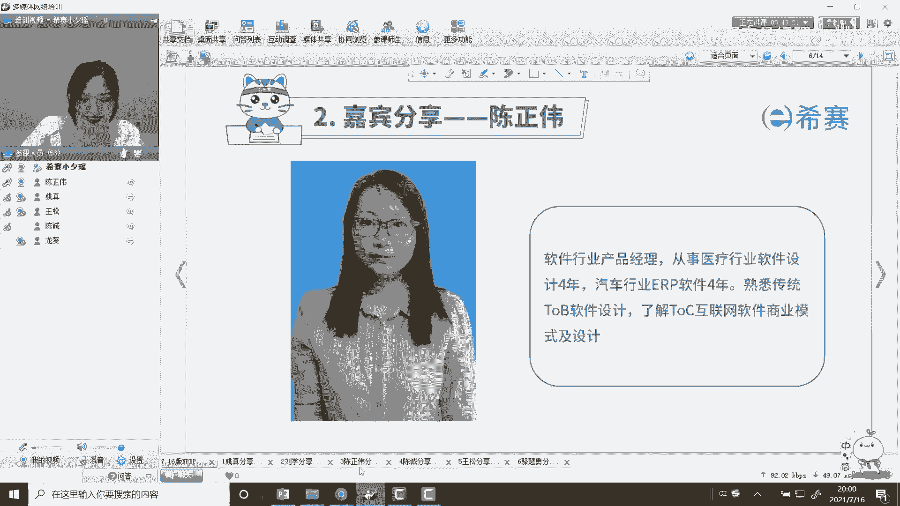
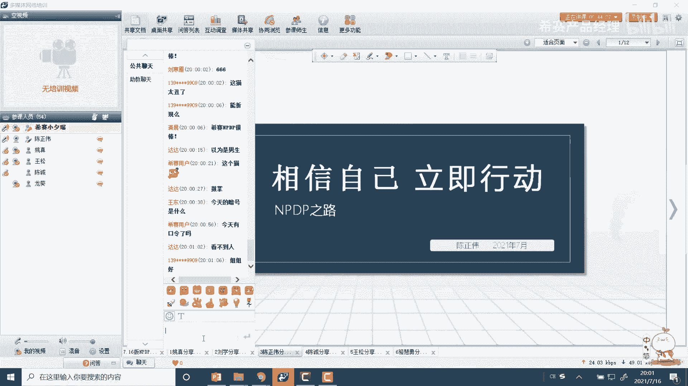
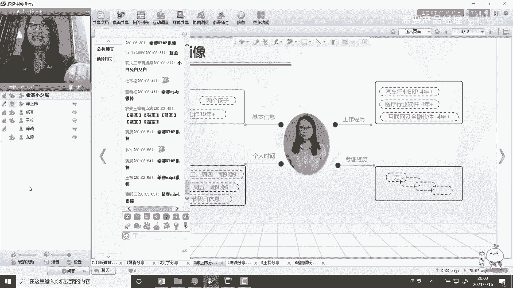
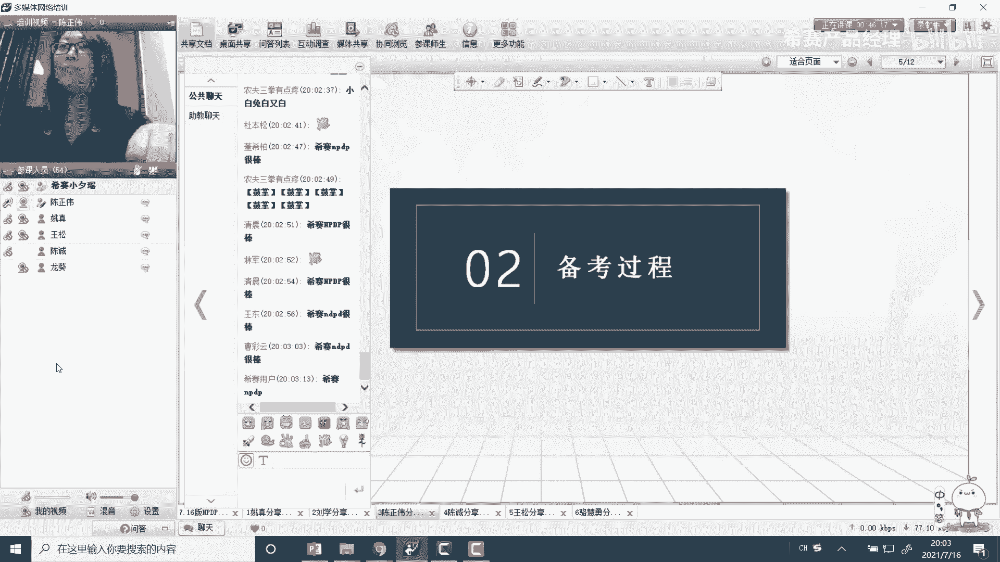
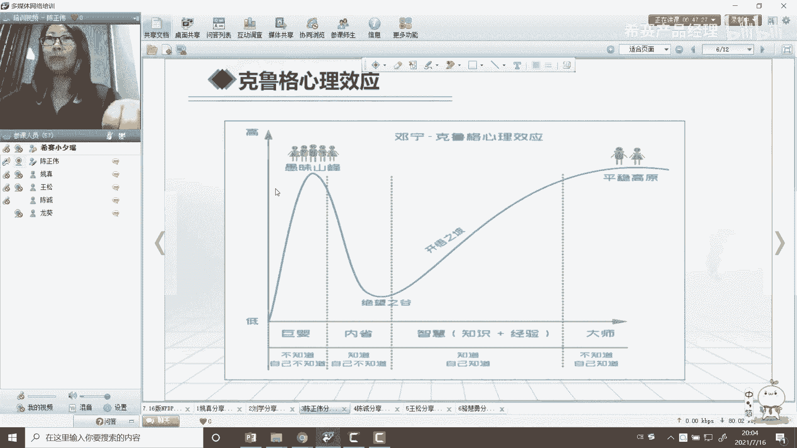
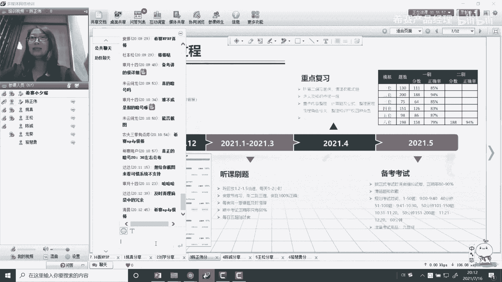
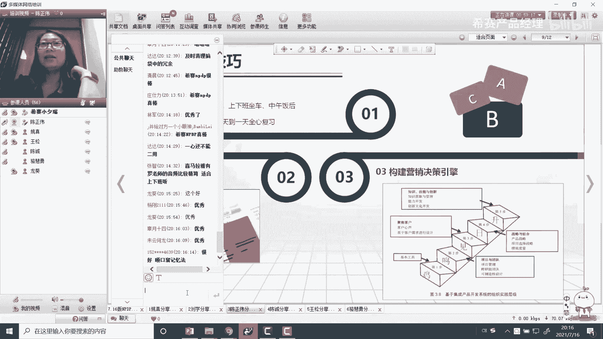
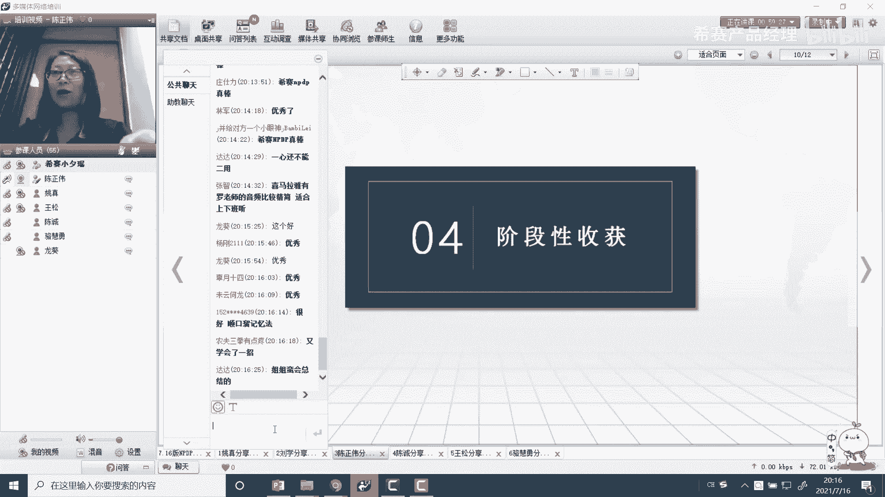
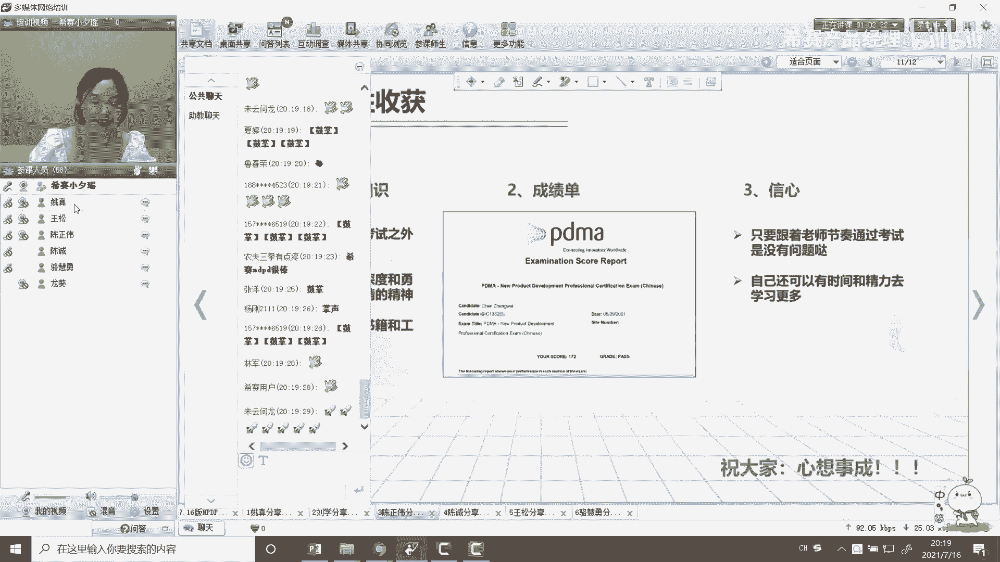

# NPDP2105班优秀学员分享-陈正伟 - P1 - 希赛产品经理 - BV1Dd4y1V77H

前任务我就来软件行业做一个产品经理，真是一大行业人汽车行业e t来学技能，熟悉采用初音改善设施，了解一互联网软件商业模式，来让我们来看申请，这位同学等一下嗯。

嗯各位小伙伴大家晚上好，嗯我我这次分享的题目就是相信自己，立即行动，这个相信自己就是一定要相信自己是能考过的，然后立即行动的话，就是在相信自己的基础上啊，我们要嗯就是一定要立即的行动。

不要不要有那个拖延症，这样的话才真的可以考过啊，这个是我的一点小感触吧啊。

啊啊我的分享一共是分四部分，首先是自我的一个介绍，然后是备考的一个过程，然后是学习的技巧和嗯，我现在阶段性的一个收获吧，嗯首先看一下自我画像，这个基本信息，首先我是一个八零后，然后是两个孩子的妈妈。

软件工作的话是10年以皮，13年14年这样了，然后工作经历的话是毕业的前四，前5年是在汽车行业做这个p，然后是在医疗做医疗行业的软件做了4年多嗯，现在之后基本上就是互联网开始普及的时候，又开始做互联网。

现在是在做金融的软件，然然后我个人的一个时间，这个时间的话主要是一个参考吧，因为大家都基本上都是上班族，可能时间都是比较紧，那我呢基本上是124加班朝九晚九，然后周三和周五不加班，朝九晚六。

然后节假日式都会休息的，嗯这个是一个时间的安排，然后考证的经历的话，我基本像是嗯参加工作之后，就没有去再考过证啊，所以这次考证也算是对参加工作之后，自己的一个挑战吧，虽然有一些同学可能已经考了很多证。

但是我个人来说还没有考过证。

嗯然后下面是一个备考的过程。

嗯这是一个嗯克鲁格的心理效应，就是一个人学习的一个过程，嗯首先在不知道，首先是不知道自己不知道，这个时候还是很自信的，然后当了解了一些知识的时候，就会到愚昧的山峰，到了顶峰之后会嗯接触更多的知识。

这个时候就会发现知道自己有一些不知道的啊，这个时候就会到了绝望绝望之谷，嗯然后我们又经过逐渐的学习，就会这个时候就进步是比较慢的，对大家也是比较压抑的哦，嗯最后会达到一个平稳的高原。

就是到大师级的时候已经不知道自己知道了，嗯不知道自己知道，这个就是很多考试考完的同学，好像觉得自己什么都忘了，实际上可能已经化为自己的内在的一种行动了，这就是一个嗯标准的一个这样的一个，心理过程吧。

嗯那我备考的这个心理过程嗯是这样的，首先我是看书比较，我是报名比较早的，是嗯也是19年11月份就报名了啊，但是报名之后基本上是没有去学，只是拿到书了去看一下，然后看第一遍的书的时候。

就会去手绘这个思维导图，因为那个时候我我有想去练一下自己，手绘思维导图的这个能力，只是拿这本书想去练练思维导图的这个练手，所以但是因为是第一遍看书，现在我发现就是第一遍看书的时候。

大家的建议是尽量不要去会这个思维导图，因为第一遍看书，还不知道书里面讲的是什么内容，它里边的嗯思路有一些不是太清晰，给我的感觉好像就是好像就是这几章啊，是每个人分了一张自己写自己的没有。

就是把各个篇章很连贯的这样嗯，首先第一点是各个篇章有一些重复的内容，然后呢，重复的内容呢又互相有一些逻辑上的矛盾，所以总感觉他是每个人负责一章，然后互相没有去沟通，这样的一个感觉啊。

就是所以19年11月到20年12月，整个这1年的过程，因为疫情也没有考试，我也基本上就没有去看书，然后直到21年1月的时候，这个销售跟我说，如果再不考的话，这个就到期了，没有办法学习了。

然后这个时候我的压力才有上来，然后就开始听课听课，因为我基本上都是加班，所以没有时间去听正常的课，基本上都是听回放，而且我我学习比较有一个特点，就是觉得老师讲的比较慢，所以我听回放的时候。

基本上龙葵老师在讲第一遍的时候，我会给他放1。2的倍数，如果是那个罗老师的话，他这个声音比较低，我都会放1。5的倍速，就这样去听，就听得慢的时候就会比较困，比较会走神，但是如果是听的比较快的话。

我就精神比较能集中，这样的话我每天中午中午吃完饭会听一个小时，然后晚上加班上班之前还可以听一个小时，然后每听完一个章节的话，就会刷题，刷题的话，基本上我会把每个章节的习题刷到百分之百的。

这样的一个正确嗯，因为咱们考试的话是75%，去75%就可以过了，但是我要做到这个百分之百，是因为我家孩子他上学的时候，就是他在做功课的时候，只要有错题，我就会让他重做，我想我这个在学习过程中也要这样。

所以我基本上题都是刷到了百分之百，像左边这个，就是我的每一个章节的这个一个正确率，那像99%和97%的，我也是刷到了百分之百，后来这个题改了答案，所以这个正确率才没有到百分之百。

就是还有一点是因为龙葵老师说，我们做题的时候，一个题都不要放过，实际上也确实是这样，就是因为后来龙葵老师弄了很多题，有一些题都是那些比较纠结的题，而且有的我觉得一定不会考，但是在考试的时候却考了。

所以这个就是也是给后来的一些小伙伴，一个提醒吧，就是只要老师给的题都要做，因为如果是不做的话，到初考试的时候真出了的话，真的是觉得很可惜，嗯然后咱们是学完了第三四章的时候，有做了期中考试。

但这个时候我的期中考试，正确率只有60%，然后但是后来我又把那些错题都刷了，这样导致我在后期的做题中的嗯，就是分数就比较高，嗯然后还有这个阶段就是1月到3月的时候，咱们有每日五题也要随时的做嗯。

这个是1月到3月的一个嗯，跟着老师一起听课刷题哦，嗯然后后到4月份的话，45月份就是一个重点复习和备考的时时候了，这个时候老师的课基本上讲完了，我就开始听第二遍的习题课，习题课的话。

因为135章是考哦20分的，这个题它是是是其他章节的一倍吧，这样所以我就听了第二遍的习题课，然后把一些收藏的试题都清理了一遍，然后把讲义和知识点又看了一遍，然后把一些重点的，比如说计算的公式啊。

还有一些自己嗯比较容易做错的那些角色呀，还有知识产权的一些相关的内容会整理一下，我就是比较懒的那种人，就是基本上就是走来走去的，拿着手机在听老师的讲课和做题，没有去从来没有去做过笔记。

就是性格可能也有一点男生的性格，不喜欢像小女生一样，每一点每一点的去整理这个笔记，所以全是靠听课和刷题，然后只是最后整理自己，整理了能有三页纸的这样的一个重点的内容，去梳理一下思路。

嗯然后嗯后来就是到5月份的时候，我就是出来这些模拟题，我就是第一一，因为我刷完了错题，又清理了收藏的试题，我才开始做这些模拟题，模拟题的话，龙葵老师的要求是正确率要达到85%，那这些都是我一刷的正确率。

基本上只有这个第四套和第六套，没有超过85%，就是第一刷就是这个这个分数了，然后因为这个第六套稍微难一点，所以我又刷了，二刷的话就可以达到94%嗯，这个时候我在群里的分数是比较高的。

因为我在群里边说我可以打到85分，第一刷就可以打到85分，还有很多同学说是85分，是分数是85分还是正确率是85%，这个时候就曾问这个问题，就可以看出来，大多数人的分数可能还只是嗯在100分左右。

这个时候我的分数就已经很高了，我觉得主要是由于我清理了，及时清理了错题和清理了收藏的尸体，然后在备考下面就是备考了，备考的话嗯是一个考试时间的规划，考试用品的话老师会发一个九宫格，要按这个九宫格来准备。

然后需要打印的最好是打印两份嗯，然后放在一起，然后嗯我在做题的时候先想刷这些模拟题，基本上是一道题一分钟，计算题除外，基本上是一道题一分钟，所以我给自己规划了一个考试的时间，就是1~50题的话。

我要在九点到9。40就答完，然后51~100题的话，就是时间稍微长一点，然后最后留了一个自己检查的时间，就是每一道题，每50道题应该在什么时间答完，给自己考前做了一个规划啊，但是到实际考试的时候。

都是比我规划的这个时间要提前的哦，嗯这个是备考的一个过程。

下面就是一个备考的技巧，备考的技巧，老师会讲很多技巧哦，那我这里就不再说老师会说的技巧了，我这里主要是我自己的一些小技巧，首先是时间的一个安排，就是要利用零碎的时间上下班，要坐这个坐车的时间。

或者中午午饭后或者吃饭时间都可以插着耳机，就是在听老师说讲这些课，然后考试前的话，考试前的三周，我是每天安排了半天的复习时间，就是全新的复习，因为我有两个孩子，我在家的话就是从来没有学习过，在考试前。

我每周六会考试的前三周，每周六会去图书馆待半天，刷1~2套题，这样嗯，然后学习时间基本上都是在嗯，工作的午饭后和晚饭后或者上下班的车上哦，因为回家了可能就要全心的去陪孩子，如果一边学一边陪孩子。

这样的话学的效果也不好，陪孩子的效果也不好，所以这个从时间安排上，可能有孩子的给一些建议，嗯然后这个第二点是一个记忆神器，这个也是因为我嗯学过一些记忆方面的，这个内容吧。

这个是也是记忆的老师推荐的一个小工具，就是把一些关键词用这个笔给画上记号，然后用这个红色的这个纸板一盖，画上绿色的记号，绿和红它俩联合在一起会变成黑色，这样就看不见这个字了，就会触发自己的一个记忆。

去回忆这个字哦，然后右边呢也是一个记忆的小方法哦，这个啊这个比如说这个集成产品开发，它考的比较多，而且我用嗯不是一开始又没有太记住，所以就想了一个方法，这个是一句诗，就是鸡鸣见日升。

因为它是集成产品开发，和基这个字是谐音，然后这个鸡这个字呢又和基本工具的基是谐音，所以这样的话，集成产品开发的第一步就是基本工具，就这样记就记住了，然后名呢因为项目组里总是要开会，总是要吵架。

好像就是像鸟鸣叫一样，然后就可以联想到我们的项目和团队，然后见呢就是我们和客户沟通的时候，要看得见客户的这样的一个内心，这样的话就是联想到这个聚焦客户，日语的话就是战略和组合，它是一个比较高的太阳。

也是一个比较高的这样的一个嗯位置，所以这个日可以联想到这个战略与组合，然后生的话就是我们只有学习了这个知识，进行创新，才能有一个自我的提升，所以只要记住了这个鸡鸣见日升。

就可以记住集成产品开发的这几个层次啊，嗯这个就是自己备考的一些小技巧吧。

嗯然后下边就是一个阶段性的收获，因为我希望考完这个证的话。

还可以有持续性的收获，那阶段性的收获就是嗯首先是罗老师，他会分享一些考试之外的知识，因为我当时是在备考，就是不是太去想听一些考试之外的，但是我又忍不住去听，所以每一个都是在考试之前都听完了。

罗老师的这个考试的一些分享，就是知识面比较宽，会感觉到嗯这个，然后龙葵老师呢他就是知识比较深，然后有那个勇勇往直前，精益求精的这个精神，特别是嗯在一些有一些知识点那个书里边说的。

模棱两可又不清不楚的这种这种的时候，龙葵老师会讲的真的是很清晰，然后把每一点都会区别嗯区别开，然后每一个关键词都会找出来，这个真是嗯对考试的帮助是非常非常大的，嗯然后另外呢认识了很多同学。

还分享了很多书籍和这个工作经验，也是哦参加这个辅导班的一个很大的一个收获，嗯然后就是这个成绩单了，是我这边是有172分这个样子哦，然后后来就是因为这是我参加工作之后，考的第一个证。

虽然十多年了也没有去考证，所以就是有一些使自己有了一些学习的信心吧，嗯然后另外一个就是只要跟着老师的这个节奏，因为我就是虽然我比较愿意看书，也是因为我没有别的不喜欢去刷抖音啊什么的，没有别的娱乐。

就是觉得看书还更有意思，所以去看书，但是我本身是比较懒的，所以我报了这个班，我就没有去看其他的就是辅导资料，只是在看，只是是看了三遍书，然后跟着老师学，然后刷题这个样子嗯。

就是嗯所以只要跟着老师的这个节奏走的话，是通过考试是没有问题的，嗯然后最后呢是祝大家心想事成，也祝我们西赛越办越好哦，谢谢大家，我们看到陈志伟同学，他是一个非常非常严谨的学员，作为两个孩子的宝妈。

给孩子树立了一个非常优秀的形象，我们给他刷一波掌声好不好，给他刷一波掌声好不好，他讲的非常详细，对我们未来的学习帮助很大，陈瑞伟同学的学习流程，整个过程设计的非常合理，对学习的投入。

我们也可以听到他是非常充足的，是做了一个万全准备，怀着满满的信心走上口考场，如果未来以后你们备考到这个程度。

