# NPDP2105班优秀学员分享-陈诚 - P1 - 希赛产品经理 - BV1S3411d7cy

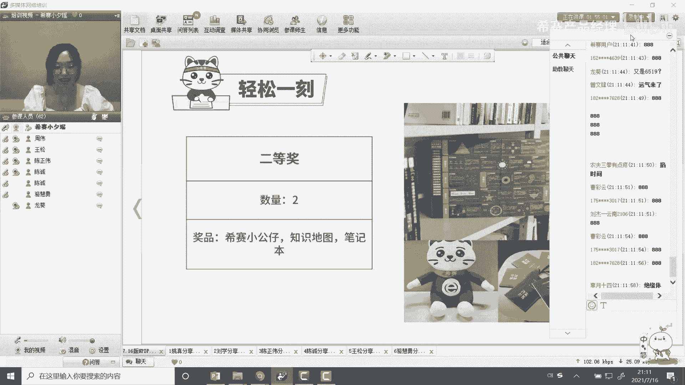

接下来就让我们邀请晨晨同学，晨晨同学在吗，好，然后首先呢，然后非常荣幸能就是能够受西餐的邀请，能够做这样的一次分享，其实呢我的分数也不算特别高吧，然后接下来的话，然后然后就开始我的一个分享吧。

嗯这次分享主要是讲一下，然后就是说我在np dp里面的学习，上面的一些心得和一些经验，然后供大家做一个参考吧，然后整个的分享的话内容的话分为四个部分，这个的话是一个简单的自我介绍，第二段话，然后说一下。

然后在这次备考当中，然后用到的一些资料，还有就是我们亲爱的这样的一些老师，第三的话就是说一下，然后我整个的一个准备过程，第四的话，然后说一下，在这次备考当中的一些其他的一些收获嗯。

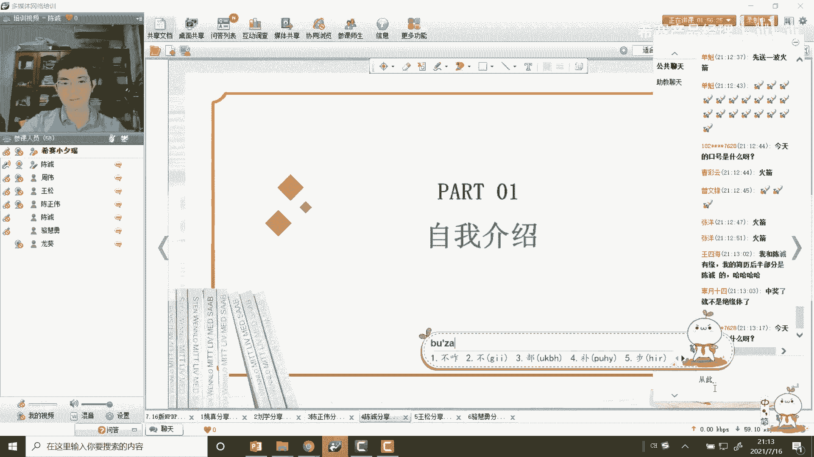

第一个自我介绍，然后我呢是之前是毕业于四川大学，然后魔术是给予智能系统，然后专业完毕业以后呢，然后我之前是在互联网，意思就是从事产品经理这样的一个岗位，其实这家公司之前，然后是在京东后面呢。

现在是去外交国企，但其实岗位一直都没有变，然后是做产品经理相关的这样的一些事情，因为其实我觉得做产品经理的话怎么说呢，就我就觉得真的你会发现，你自己通过开发或者说设计一款产品，然后能够说说去改变。

那么一些固定的一些人群的时候的话，你会给他们带来价值的时候的话，其实你会发现你的工作是很有成就感的，所以说其实对这个岗位的话一直也很认可，也很是吧，然后就说然后想在这条路上走的更远，所以说之前呢。

然后就无意当中可能就发现了，m p dp这样的一个证书，这样的一个认证，后来呢然后就就我就查的话，然后就了解到西塞这样的一个培训机构，当然报名，其实我报名报的比较早，我当时是19年，然后就报名了。

当时后面因为疫情的原因，然后就一直拖拖，然后一直终于在今年的5月份的话，然后终于然后考试。

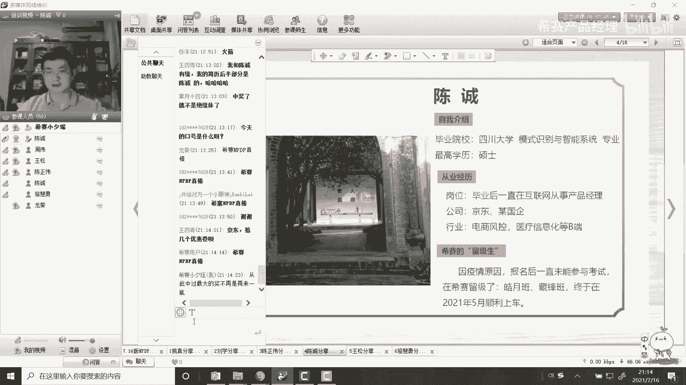

然后也顺利的，然后做就算通过了吧。

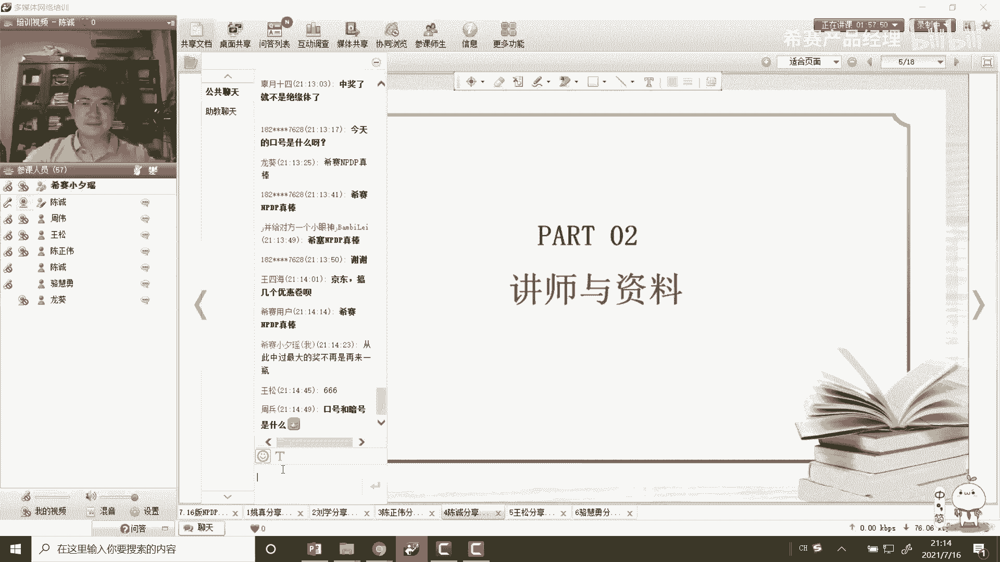

嗯睡觉，然后就是在备考当中用到的，就是我们的讲师和质量，首先然后给我们主讲课程的，就是主讲类老师的话，然后是我们的一个螺栓，不算的话，其实我觉得因为他的话就是说，他不就是说他之前的话，他也是在那个高德。

然后去担任过一款产品经理，然后他的货本身也有产品经理，这样的一些相关的这样的一些工作，所以说其实他在讲n p dp的时候的话，他会给你就是说，然后举一些实际中的一些案例。

然后帮助大家去更好的去理解教材当中的，这样的一些知识点，因为其实np dp那门教材，就是我们刚刚很多分享的学员也提到，里面其实有很多的那些知识点，是属于那种很会是难懂的，所以你自己去看的话。

其实你可能不是特，你会发现就是你每个汉字都认识，但其实你不一定能够理解它背后的这样的一些，这样的一些想表达的这样的一些意思，所以说其实然后我就觉得，就是听一下这个主课的话是很有必要的。

然后他会把很多东西给你展开，我觉得这点很重要，然后第二位老师的话。

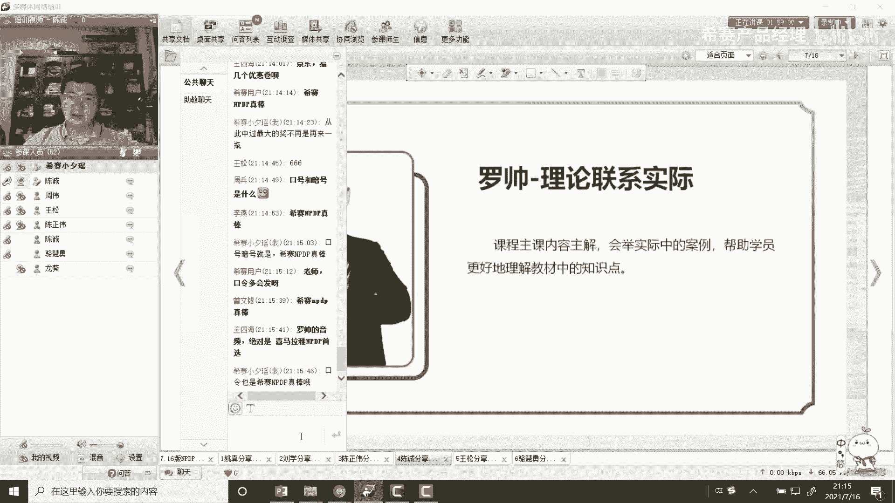

就是我们的一个轮回小姐姐，龙葵小姐姐的话，然后起是一位就是你漂亮的小姐姐，大家从这个图上也能够看到，然后logo呢，其实就是说他他轮廓兰在整个过程当中的话，他是负责，如果是有些同学就说。

可能就比如说有些人可能怎么说啊，就说因为时间比较紧，如果是那个罗老师的课，可能就是听着不是很认真，或者说有些缺失的话，那我这边建议的话，就是龙葵老师的习题课，是一定一定要认真去听的，因为农科老师的话。

他是把就是针对于每个章节的一些考点，还有重点难点的话能够给你提炼出来，然后就是说对于有些学习时间可能比较少的，一些学员的话，然后根据帮助大家，然后就是去快速掌握一些知识点，而且龙葵老师们。

就是说他特别因为我们怎么说呢，就是学习n p d p的话，这门课程来说，你的最终目的可能还是需要把这门课，把这门就是就是这个认证给考试给通过，所以其实我们最终的目的就是要考试的话。

所以说然后还是要需要掌握一些就是解题技巧，然后呢提升你的准确率，然后在这方面来说，在这方面来说的话，龙辉老师其实他特别有经验，因为他的话然后会把一些给你提供一些关键字，就比如说然后通过什么某个关键字。

然后就映射出什么样的一些结论啊，或者说什么样之类的，这一点来说的话，其实我觉得我会在在这方面的话，其实我觉得他真的是很有经验，可能一方面的话就是因为这个n p d片化，它本身是一个国外的这样一些考试。

妙呢可能也是因为龙葵的话，他之前也是在国外学的一个研究生，所以说可能他是在国外的这种考试上面的话，他的其实经验就是那套方法论，其实可能会特别的有用，所以我就觉得龙葵老师的习题课的话。

大家是一定要认真去听的，然后两位老师的课就是就是就是西塞给我们，就是在np tv上面给我们的两位的非常负责，优秀的一个老师，然后第三的话，然后就说一下，然后我们使用的这样的一个教材，教材的话。

然后就是我们官方的一个指定教材，然后这本书呢其实怎么说呢，这本书你说呢其实重点其实在我们看的话，就是没有重点，没有侧重点，都是重点，这句话呢，然后是我从之前去参考那个谁，就上一上一届的优秀学员。

然后罗振宇的p p t里面去看的，真的是这样子，就是这本书里面的话，你会发现他真的是没有侧重点，都是重点，因为书里面的每一句话，他都有可能成为一个考题，所以我就觉得然后当时我在用这本书来说的话。

首先第一的话你至少你是要精读一篇，第二话初读一篇，如果你至少你要做到两边的样子，然后你再去做题的时候，你遇到问题了，就是想不起来了，然后你再取方式去求证，说到这样的话，其实我当时的话。

然后是这样去使用这这样一本教材的，然后，然后第二呢就是西萨的一个讲义，但是我这边没有写出来，因为当时我西沙的那个教材的话，其实我看的比较，就是就说就是上那个直播课和视频课的话，听了以后的话。

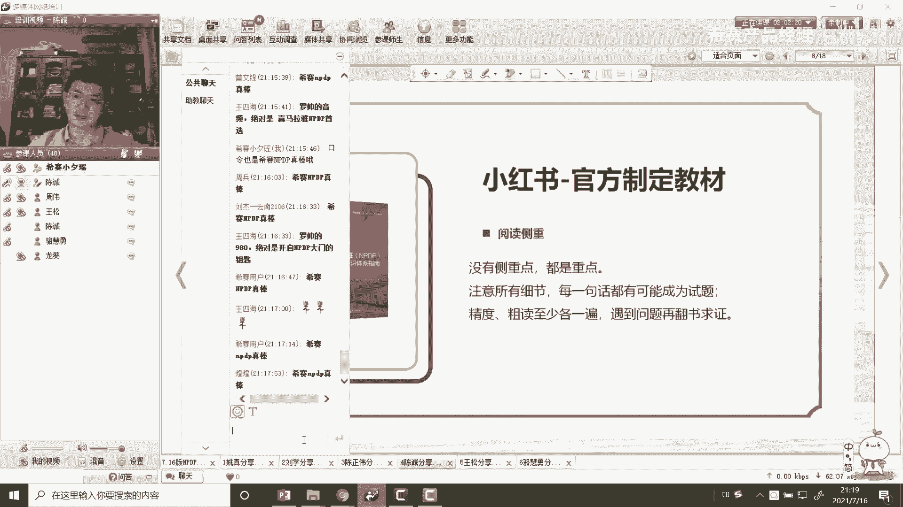

其实我下载我发的bl 4啊，对了我特别想强调的话，然后就是我们这批就是我特别幸运吧，就是可能在这批学友当中会遇到两个大佬，一个是王四海，一个是上葵，其实这一块的话，然后大家之前都已经看到了。

我这边然后就放了两张，就是截图啊，就你能看漫画，然后王思海的话，然后他是用ppt的方式，然后把每个章节的重点给你列了出来，然后海而且图文并茂，把一些重点的话，然后用那个比如说红色字体啊。

或者说加粗的方式给你看起来，就整个的它的一个比例，看起来就是非常干净简练的那种样子，就我就觉得真的是很nice，就是我就觉得然后我就觉得怎么说哈，就是我就觉得做p p t的话。

其实我就觉得可以反映一个人的什么样的，一个特点呢，首先第一就是他的一个逻辑思维，的一个表达能力，你怎么样能够把它表达好，第二块就是它的一个逻辑思维，就是说你他能够就说，能不能去抓住这样的一些重点。

怎么样，他的这种结构化的一些表达，所以这点其实很重要的，然后第二个呢就是我们的上课大佬，上古大佬其实都不用说了，然后就是就是我们这届的话，真的就是感觉是很多人都是各种很魔幻的那种，就是偶像吧。

因为之前我第一次看到他的p p t的时候，不不是p p t，他的那个比较时候发现是一个excel，我后来我才发现，原来excel都可以做的这么精致的时候，其实当时我也那我也是挺挺震惊的。

因为excel在我们心目中的话，可能就只是一个计算的这么一个工具，然后没想到还可以，就是说做笔记都做的这么好啊，反正我当时是挺挺惊讶的，而且不光是挺进啊，就是他的笔记的话其实也跟上海同学也是一样。

就是也是写的特别的好，特别的特别的那种完整，而且里面的话还有他们的一些，就是记忆的方法呀，或者说什么样子的，其实其实我觉得我看他们的笔记。

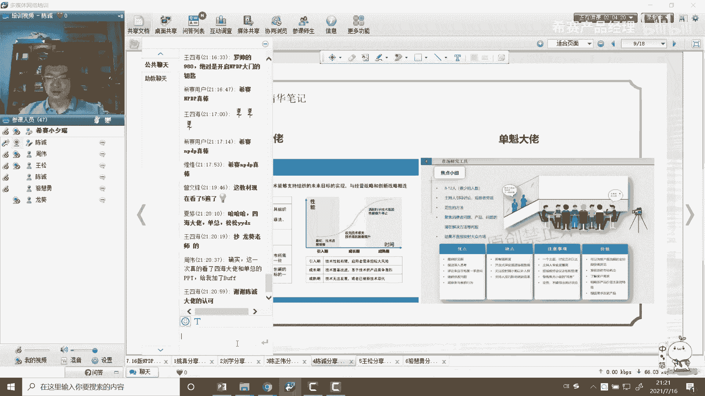

我是看的是比较比较多的，第三个的话呢就是一个吸收总结的一个小册子，这个小车子的话其实一般来说的话，就是我们今年的话是到五一的时候，然后才才给到我们这边，就这个小册子的话，真的就是一个藐视的一个精华。

这总结的一个精华，这个的话，然后是我们在考试的时候是必须要去看，必须要去反复的去看的，因为这一块的话，其实刚刚然后就是那个王霜其实也讲的，然后这一块其实老师真的是总结的，然后特别好，所以说然后复制的话。

其实真的就是精华中的精华。

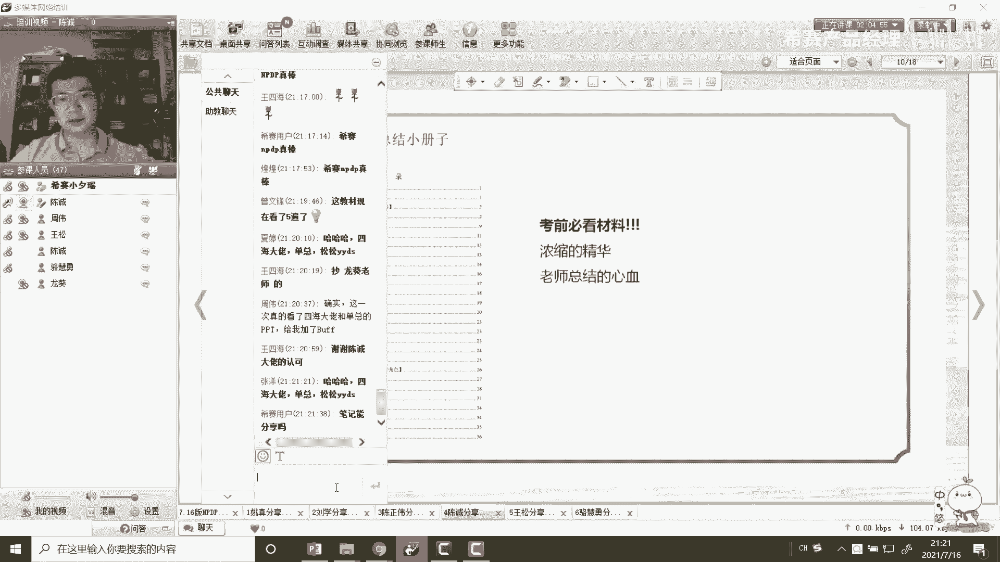

然后第四个的话，然后就是西藏的一个题库，其他的一个题库的话，其实因为我的怎么说，就是备考时间因为比较久吧，所以其实题库的话，其实你会发现我我说的题还蛮多的，我都不知道，其实我都已经刷了4000多道题了。

这怎么算，反正就慢慢的去刷呗，反正就是怎么说呢，就是一般来说的话，你的那个，这就是我可能没有像之前那个陈志文同学那样，子，就是保证一定要刷到，就是怎么说呢，就是说90 100分怎么样。

我计算我觉得我能够刷到，然后95%以上可能就觉得差不多了吧，可能因为当时我的目标你自己也没有定那么高，然后觉得后能过，然后就行，但是我就觉得这个这个细算的题目的话，其实也是非常非常重要的。

一方面的话就是你再去刷题的时候，然后你能够去检查到，然后有哪些知识点不是特别的牢靠，这种话会加深你的印象，还有第二两话就是吸收的体库的质量，其实真的是挺高的，因为在考试的时候。

你就会发现真的会有一些就是相似度，甚至是原题很高的这样的一些题，所以说西藏的题的话，我我觉得这个也是怎么说哈，也是可能就是说在西餐里面，通过率比较高的一个秘诀吧。

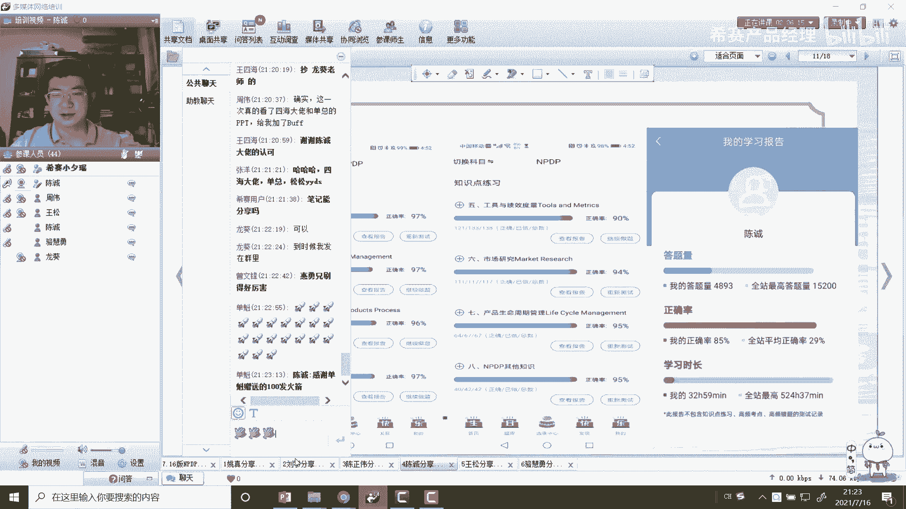

然后睡觉，然后我的一个准备过程吧。

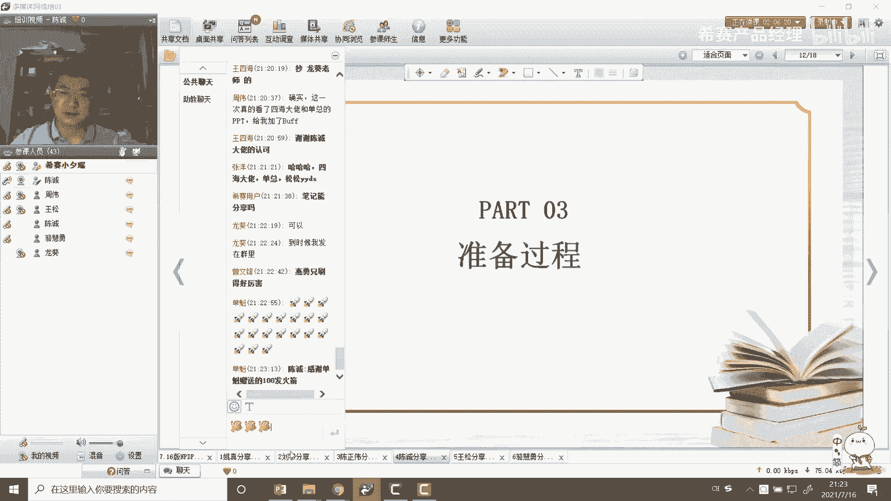

我是准备过程的话，其实总的说的话可能就分为这几大模块，一个是教学视频，教学视频的话，就刚刚讲的教学视频的话，首先第一次正课政客的话，然后是罗帅讲的，我觉得我觉得政客的话，我觉得就是一定还是要不怎么样。

还是要去听听完一遍，因为你听了以后的话，这东西才能够去帮助你去理解这样的一个内容，如果直播课赶不上的话，我觉得就是那个录播课也是一定要去听的，这样怎么样的话，你就哪怕你比如说1。2倍或者，1。

5倍的倍数，我觉得政客是必须要是听完一遍的，因为这样子的话才能够帮助你去更好的去理解，整本书的一个内容，然后第二的话，然后说的就是那个龙葵的新题课，我说了，因为你来上这门课的话。

最终的目的是要通过这门考试，所以说要通过这门考试来说的话，某那个龙葵的习题课的话，那就真的是真的是就是精华，就是必须要重点看的，就是它里面的话它不仅会讲，然后本章的一个知识的一个重点。

更重要的话它会有一个习题课的一个讲解，还有就是解题上面的一些技巧，我觉得这个的话，然后在你考试当中，对你提高那个解题的一个分数的话，是非常有帮助的，然后第二点的话就是一个就是你需要一个的话。

肯定会有一个知识的记忆的这么一个过程，就是刚刚的话其实你看大家其实都已经讲了，然后不同的人的话可能不同的习惯，比如说有些同学的话可能习惯，然后手抄，那有些同学的话，然后可能喜欢，就比如说通过自己。

然后梳理思维导图或者说什么样的一些方式，但我就觉得这个方式的话怎么说，就是有句话叫做好记性不如烂笔头吧，我就觉得现在你不管是用手抄的方式，还是自己去敲打的方式，还是要去梳理一下，这个的话。

其实我觉得会在你的大脑当中，会加深这么一个记忆，其实我就觉得还是会有必要的，然后第三个模块的话，然后就是做题，然后做题的话，然后第一个的话就是你学完一章，你肯定要去做这样的一个章节习题。

然后和整个的一个班级，然后跟上进度，然后自己先做题，然后做了之后的话，你再去听龙葵的习题课，你再去看，你再去想一下，你当时自己是怎么做的，他为什么，然后错了，然后你再想一下。

然后我们可以当时在讲习题课的时候的话，会把这个思路给你讲一下，你会发现到底是自己是四点没有记住呢，还是说理解有偏差，然后找到自己后做错的一个原因，然后第二的话，第二个第二个第二部分习题的话。

然后一个就是每日五题，当初每日五题，这个每日五题的话是班主任会发到群里面，就是轮回也会发到群里面的，那其实就是在那个西塞的那个，就是那个系统里面的话，他自己还有一个每日一练，那个是十道题。

所以说然后到后面的话，我希望就是说我自己也会保持，就每天15道道题，这个一定也要是去做的，因为这样去做的话，会保持你的一期感，然后就这些题的话，可能它的顺序的话，一开始的时候可能会是按照那个。

比如说然后上课上到满，然后然后就是那个题题的话，会进入会合体保持一致，但后面的话比如像系统那个每日一练的话，可能那个顺序都是打乱的，然后你每天保持这样的一个体感的话，其实我觉得也是很重要的。

然后第三的话，然后就是你一定要去做的一个事情，就是你的一个错题和收藏的题要把它给清空，是这样子的，就是在西藏里面我就觉得他有点特别好，就是就是你做错了题，然后系统的话系统会把你给记录下来。

然后你只有连续两次做对了的话，然后系统才会把这个错题，然后把它给移除，你的这么一个错题库，当然还有的话，就是你可以自己手动的去做一个收藏，然后我记得当时的话，然后我差不多都已经收藏了，可能五六百道题吧。

就是错题和收藏题加起来一共五六百道，然后但是呢我就觉得这一块的话，就是在你考前的一个周的话，一定要把它给就是把它给缩减，这话你买到就是没办法，然后去看完就就反，就是说，然后基本上我就是保证。

在你在你就是考前的一天的话，把这个念的话控制在100道题以内，就是你再去重点再去看一下，你特别容易错的那些题的话，其实我觉得就差不多了，然后最后最后的话然后就是一个模，就是那个模拟题，这个模拟题的话。

真的你会发现是牺牲的那些老师，然后用新的，然后去编的整个模拟题的话，它的那个难度以及它的那个仿真度，其实和真题其实是差不多的，所以我都觉得模拟题的话，我个人觉得你模拟题嘴确定一定要一定要。

然后达到95%以上吧，甚至是百分之百，这样的话，其实我这样的话，其实你才会才能说就是说你整个题的话，那个难度也好，还是说你自己的话，在真正考试的时候，你可能才会有这样的一个自信，然后说一下我考试准备吧。

考试的话其实我觉得你自己的话就是一个心态，还是要保证，就是你要相信自己能考过，这里信心还是要有的，这次不一定要非得要考到180分以上。

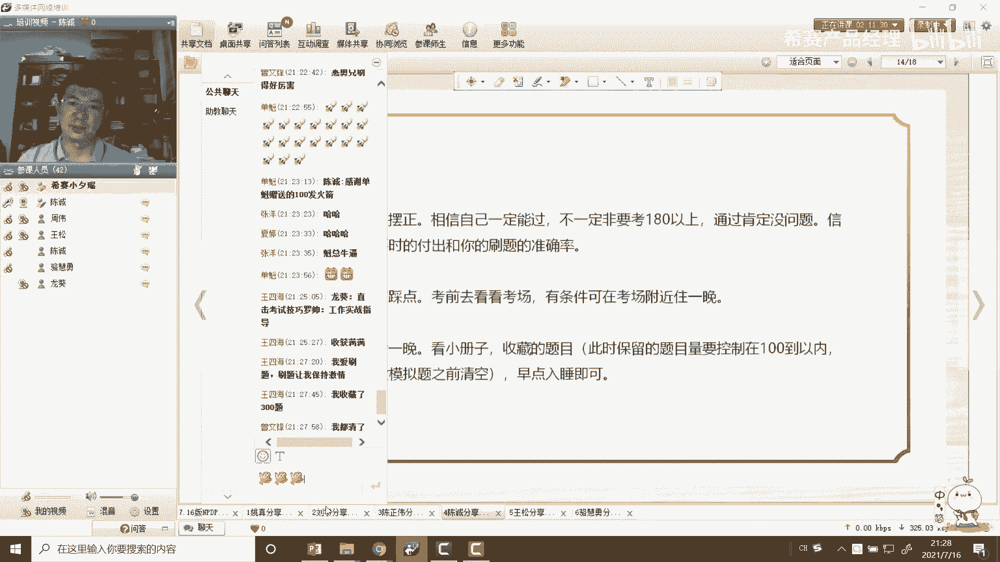

但通过肯定是问题不大的，但其实你的信息来源于什么，就你就会来源于你平时的付出。

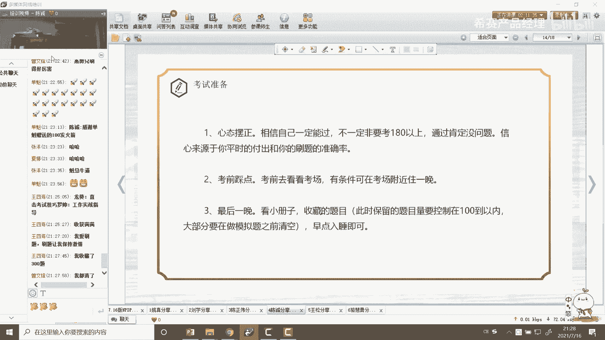

帮你刷题的一个准确率，就比如说我这就是刚刚可能大家看到我那张图，就比如说你会发现我做题，然后其实也没做到这么多，然后我的我的那个谁，就比如说那个那个谁就是你看视频，然后看了累计多少个小时。

其实这样的一些数据的话，你就是在你考试之前，你看这些东西来说的话，你还就是就会积累起你自己的就是一个自信，其实当时我我是学那个考试的话，就心态不是特别好的，但是我考试之前还蛮紧张的，还跟龙葵赚2000。

我说我说我感觉还还挺脏的，不知道自己，然后能不能考过，然后我哥还说，然后从你的那个就是考试的那个准确率来看，各方面的话应该是没有问题，你还是要相信自己，那后面考试的话，我觉得就是真正去考的时候。

你就会发现我那些考级，或者那就真的是就似曾相识的感觉，而且做的很快，基本上三个小时后我可能一个多小时，就反反正两个小时飘的样子就全部给做完了，后面然后还检查检查，然后1~2倍嘛，然后都还有半个小时。

然后就提前给交卷了，所以你就会发现的话，你真的是平时在这在这在这个转变过程中，你的时间所花的足够的话，你就会发现你做题的时候，各种速度真的是非常快，就是你一看题的话，他也知道答案是什么。

几乎会形成一种条件反射的那种感觉，然后第二的话就是提前，就是那个考前考前的素材点，如果有有条件的话，最好是在考试负责的最晚吧，因为尽可能去避免比如说堵车啊，或者说什么样的一些情况的意外情况。

这样的一些发生，然后就说一下最后一天晚上，考前最后一天晚上的话，然后我就只看了一下那个小测试，就刚刚讲到运气，其实小册子的话其实内容还是不少，都是有100多页拍的话，然后就是收藏的题目就很那个错题。

这时候的话我就讲的就是一定要把那个题目，然后控制到100道题以内，之前的话那些练习错题的话，就尽量的在做模拟题的时候，你要把它给清空了，然后晚上呢尽量的就是早点入睡，然后也不要就是不要太有太大的压力。

然后聊天去应考的其实就可以了，然后说一下其他收获吧，其他售后的话咱们是听t的话，就说你不仅收获了一个n p c可证书不上的话，就是其实也不知道原来产品经理的报，它有哪些方面的学。

就是需要掌握哪些方面的一些知识，就是会让你的知识体系更加的明确，因为其实像产品经理来说的话，他不像比如说那种做开发一样，可能它是一门专业，就比如说像软件工程啊，或者说比如说计算机科学与技术。

它是一门专业，但这其实产品经理的话，在大学里面，他是不会有这么一个专业去系统去培养你的，所以说这个的话，就说，你要想在产品经理这条道路上走的更远的话，你首先要知道做这个岗位，他需要掌握哪些技能。

哪些方面的，哪些领域的这样的一些知识，这东西好做的话，其实产品经理就帮你搭建好这么一个体系，接下来你就知道你自己要往哪些方面去，做一个提升，当第二的话就是很意外的，就是结识了一群志同道合的朋友。

比如说像上葵啊，还有就比如说像四海啊，还有像张扬，就是很多这样的一些朋友，就你就会发现有句话怎么说呢，就是以优秀的人为伍的话，你会变得更加优秀，这点其实我这一次，然后就感觉到特别的就是特别特别的感触。

特别的深刻，因为其实你看分享来，一起来分享了很多同学的话，他们在各个领域的话，其实都是一些很优秀的人，然后第三第三个的话，其实我觉得就算是一种自我实现吧，就是如果是你把人生分为不同的阶段的话。

其实你在每个阶段都要去实现你的目标，去完成你的一些事情，这话是怎么样去，你所理解的，就是其实从我的工作来看的话，其实我觉得工作的话应该是认为三个阶段的，然后第一个阶段的话可能叫做求生存。

就比如说可能我刚毕业做一个应届生长的时候，其实当时的话我可能就是怎么说呢，就是你要想在这个单位，然后站稳脚，那你肯定要想办法就是留下来，你至少你得转成哪个，你要通过吧，或者说什么样之类的。

然后这个第二阶段就要求生存，第二阶段的话叫做谋发展，就是然后你上脚以后的话，你要想办法，就是说把你自己的能力去做一个拓展，去做一个提升，这个时候的话就是你想看一下你在公司里面。

然后有一个很好的一个发展的话，你要在哪，就是说然后你的专业能力啊，或者说你的各方面的话，你要怎么样去做一个提升，至少怎么说，就是你的发展的方向也和公司的一个业务方向，其实就是想做一个就是做一个匹配。

这样的话，其实你这样的话，就是说相当于就比如说可能应届生来说的话，可能就比如说你才能够有，但其实然后过了这个阶段以后的话，那就是我我用的第三个阶段叫做修体系，就是这个时候的话，其实你会发现你真正的实力。

你要往上走的更更久的话，更远的话，其实你不光是你的职业方面的一些发展，就是可能就比如你的表达，你的思考比较深入思考，然后还有就是你的线上管理，线上管理就是它是一个很体系化的，这样的一些东西。

所以说然后我认为第三个阶段的话，就是一个修体系的这样的一个阶段，所以说其实就是说你真的是学了m p dp，以后的话，其实我就刚刚讲了，他就想把n就是把整个产品经理的这么一个，知识体系，然后给你搭建起来。

然后你就会知道哦，原来你说做产品设计，怎么去做市场调研，怎么样去做流程的管理，然后还有他的话，然后就是然后然后就是包括像团队管理的话，会用到哪些组织工具的这样的一些方法。

其实这样的话对你整个的一个体系化的一个，人类的成长，其实你就会有了这样的一个方向，所以说我就觉得这是考n p tp的话，就是给我不同维度的不同维度的一个收获，然后最后的话然后想给大家说的。

就说说一下的话，就是说p dp，然后考试通过的难度来源，就是真的是绝对的老心天赋的程度，其实大家其实能够感知到，你看就说怎么说呢，就是说大家的这个通过率也好，然后怎么样。

其实你就会发现只要你的时间花到位了，谈谈他就一定会通过的，那你一定没有花时间的，所以说就刚刚讲了，就是你把时间花在哪里，其实你的成就就在哪里，然后就像之前刚刚的，不管是松树也好，还有那个就是陈志伟也好。

他们就行了，很多人回来之后的话，比如说他不玩游戏，然后也不玩手机，然后也不会去看什么抖音之类的，怎么样之类的，这你会发现真的就是你把时间花在哪里，然后你的成就然后就在哪里。

感谢大家，然后下面那个老板是我的二维码，或者大家有什么问题的话也可以，大家欢欢迎大家求助，然后加我微信，然后相互构成，然后最后的话就是感谢西塞，然后也感谢一起奋斗的好友。

然后最后的话祝愿就是未来的学弟学妹们，然后能够顺利的通过一体机的考试，好谢谢大家好，谢谢晨晨同学发言，感谢他的分享。

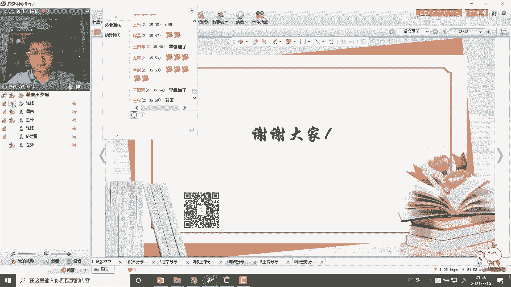