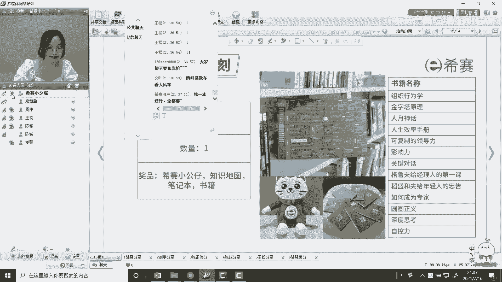
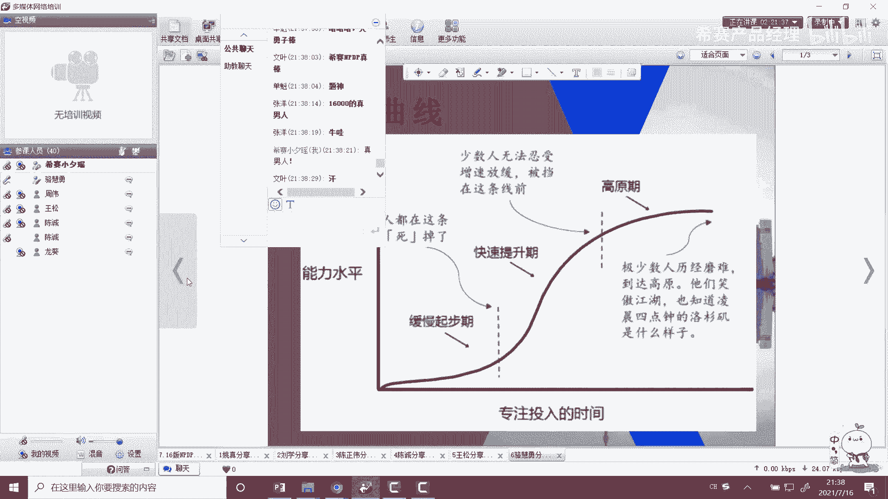
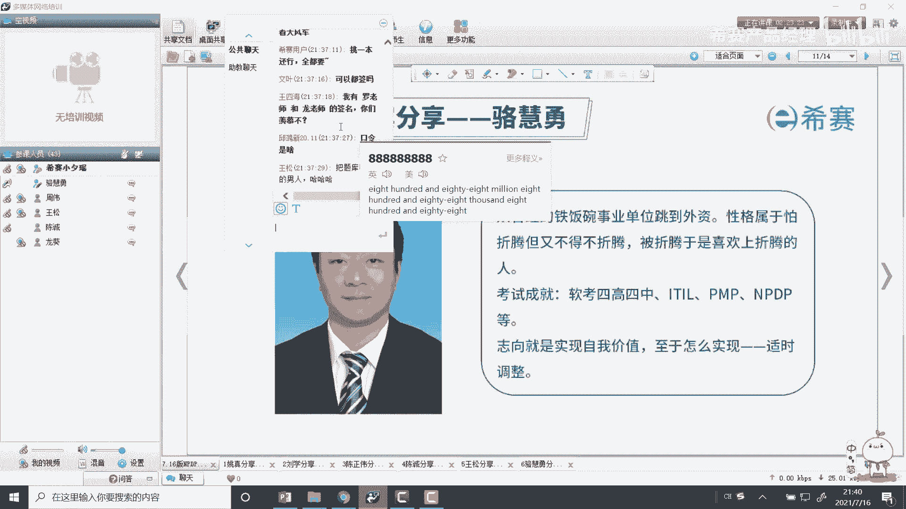
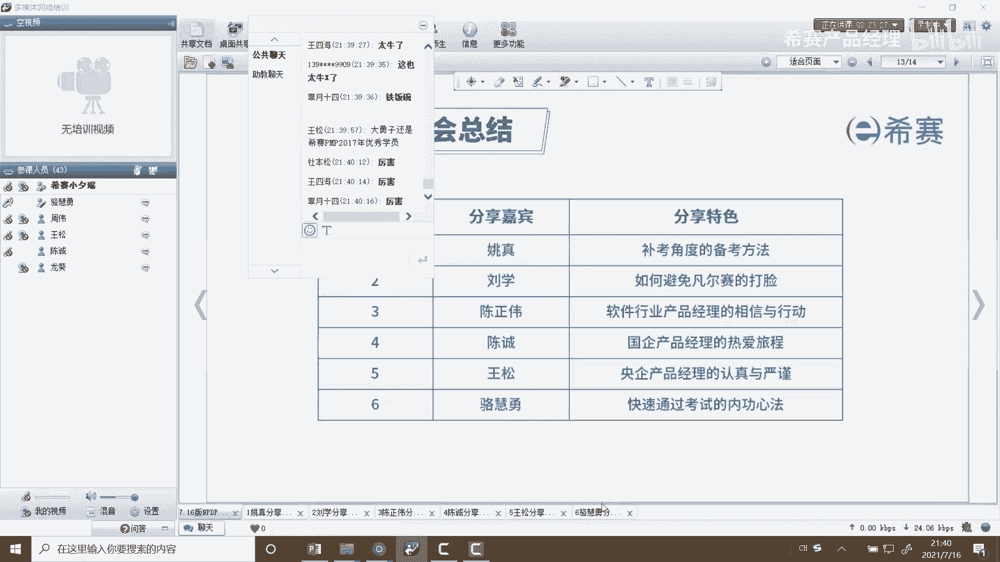
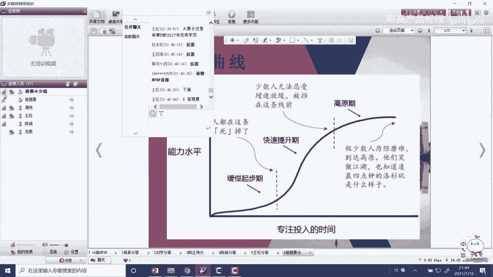
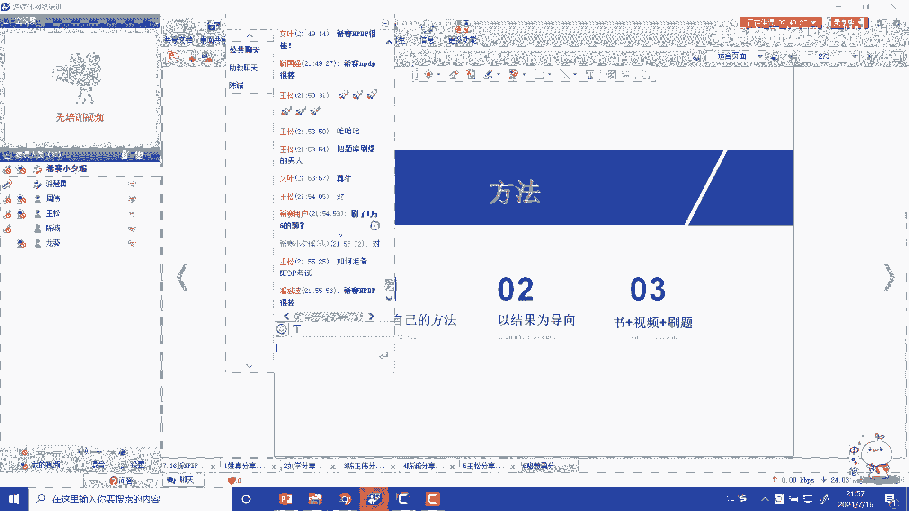
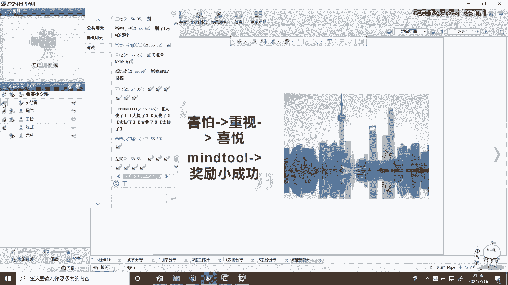

# NPDP2105班优秀学员分享-骆慧勇 - P1 - 希赛产品经理 - BV1kT41117R5

好那我们现在是有请诺永辉同学，那个西塞的老师，还有各位学弟学妹。

还有一些大神们啊，这个大家晚上好，这个是这样子的，这个我本来这次呢想分享一些内容，但是呢我也想一想嗯，估计大家大神们比较多，特别是我看到有很多这个同学啊，大神分享的他们做的一些笔记。

或者说做的一些呃这个这个p p t之类的，我感觉他们太厉害了，这个所以说从我的角度，我啊，我还是觉得他们他们分享的一些细节，更好一点啊，而且我刚刚也听了一些大家的分享，呃，真的分享得很好。

所以说呢我之前就做了一些计划，就是呢我从我想从我的角度就是一起分享，分享一下内心就会考生内心的一些需求，然后再去讲一些呃，怎么讲呢，我再讲一些我个人的一些备考的一些经验，再融合一些。

比如说别人的一些经验分享给大家，希望呢呃在这么多大神呢，起这个这个分享的前提下呢，大家在呃在听我的分享的时候呢，还能够呃有一定的收获，这是我的分享的一个一个出发点吧，应该怎么讲，这么讲啊，是这样的。

我那个老师能帮忙翻一下ppt吗。

好可以自己分了是吧，这样那我先做个自我介绍介绍啊，又跳到了外资，其实呢本身的个人性格还是属于那种，希望有一定的挑战，或者说喜欢折腾的啊，怎么说呢，就是也是被带上被折腾那条路啊。

折腾的那条路刚开始呢也是由于写工作，或者说由于一些真的是一些大神的带路啊，然后渐渐的走上了就是跟优秀的人在一起，自己也会变得优秀，渐渐的就是啊不停的参加考试，不停的学习，不停的做项目。

在不停的增强自己呃，然后考试的成就呢在软考这一方面呢，因为以前是事业单位嘛，这个主要是软考这一块，一共是四高，然后后来又四中，后来呢然后进了外资呢就开始考一些呃，就是老外这块的考试大概主要有ile。

就是相当于我们认为管理这一块的，然后还有p m p，还有n p d p p m p，当然之前老早之前考的啊，在还是那时候还在体制内，然后最近呢也是正在准备a c p，就是敏捷这块的东西啊。

安利一下敏捷啊，确实是很有作用，然后这次的分享，其实我也深受敏捷的一些思想的一些影响，所以说尽量做到简化，把一些要点给大家点出来，我觉得敏捷真的是跟p m p相结合是非常好的。

那志向呢就有自我实自我价值的实现，为什么跳出来，其实也就很早很有道理，就希望被人举所需要，或者说自己的价值能够得到更好的体现啊，至于怎么实现呢，我自己也没有搞清楚，正在怎么讲呢，一步步往前走吧。

慢慢的去走自己的路。

这是我的一个想法，然后啊不好意思，我来看一下我的ppt。

好像是，好像没放上去吗，呃呃老师在吗，哦哦哦我看到了我看到了，不好意思啊，看到了这样的，我首先想分分享一下学习曲线啊，我感觉这个是是怎么样的学习的一些方法啊，或者说呃学习的一些技巧啊。

我相信这个经过前几轮的这种大神们呢，他们的分享相信大家已经更重要，以很多点了，大家可以选取一些自己合适自己的一些方式，但是呢我在学习，特别是在考老外的这些考试当中呢，我有一个深有体会。

深有体会的就是什么呢，就是要更加关注一些自己内心的一些需求，就是怎么讲呢，就是你对整个备考过程，他的心态其实真的是跟那个学习的曲线，是很接近的啊，因为老外的考试它跟国内的考试有点不一样。

我稍微拓展开来讲一下啊，就是中中国的考试，更相当于是聚焦于一些知识点，但是呃怎么说呢，但是外国的考试呢，更相当于要要注重你的实际的应用，体现在题目上的，更体现的更多的是什么呢，就是一些情景题。

所以说呢经常刚开始的时候会，你会受到一些挫折啊，所以说这个呃怎么讲呢，这个是个时间曲线，是随着时间曲线啊，改变了一个一个，这个应该说是你更是一个内心的一个感受啊，的时候你比如说学习可能缓慢起步。

学习效果是不多，就是应该学习的效果不是那么明显啊，然后后来当你get到get到那个点的时候，什么意思呢，就比如说你请你听渐渐摸索到那个知识点，然后又把知识点又能拓展开来，然后知道怎么去把题目做对。

好说理解老外考试他的考试的一些要点，或者说怎么去理解出题人的一个思路的时候，然后你渐渐就会进入一个快速的提升期，这个时候你在做题的这个啊，哪怕你看书的这种效率好，说你做题的效率都会快速的提升。

但是当你到了比如说你的呃，当你到了一定程度的时候，你也开始个人其实其实也到了一个什么呢，就是疲倦的气，什么意思呢，就是啊你看的书也多了，然后做的题也多了，也到了一定程度了。

这个时候呢你就会进入一个高原期，什么意思呢，就是你那个时候感觉好像我怎么努力，好像也很难提高了，就比如刷分我可能刷到啊80 80几分的，但是要刷到90几分，就是越来越难，所以说经历过这三个阶段呢。

大概有怎么我怎么再分开来给给大家讲一下啊，第一个是缓缓慢的起缓慢的起步期呢，千万不要着急，就是你比如说我刚开始刷题，刷的不好啊，温度不高没有关系，一定要硬着头皮，因为老外的考试确实跟咱们的国内的拼知识。

拼记忆这种题有很大的不同，它是更拼的是对知识点的掌握，特别是如何把知识点应用到一些场景当中，就是一些理解题啊，然后到快速提升期呢，这个时候你已经把一些主要的知识点掌握了。

但是但是呢到了高原期又又进入疲倦了，什么意思呢，就是有些反复错的题还是在错，没有关系，大部分人都是这样子，就是要克服一个什么呢，就一个疲倦厌倦的这种情况，一定要坚持继续的去看视频，去看书。

把这些知识点遗漏的知识点再反复的去强化，就是避免把自己的一些错误的思维，不停的去强化，去调整自己的一些想法，一直到跟出题人的思路差不多，然后到最后能获得一个高分啊，这是我我想跟大家分享的。

就是关注于考生一个内心的一个东西啊。

一个曲线，我觉得这个这个曲线非常的好，跟大家分享一下，然后呢我的这个ppt做的也很简单啊，这个可能怎么讲呢，可能一个是我比较比较偷懒嘛，另外也可以说我是啊，受这个敏捷的这种思思维的这种影响。

尽量简化一点，当然了，还有一个最重要的原因就是前面大神分，大神们分享的东西真的非常的好，他们每个那个呃从自己牙号说，从一些他们的备考经验号说成，他从他们备考的几个阶段来说，真的是非常的棒啊。

所以说我是想尽量不重复给大家简单一下，就是把我通过考试的一些心得啊，还包括每包括每次怎么样去通过这些考试，进行一次总结，进行一次体验啊，我好了，我们回归主题啊，这是我的一个思路。

就是首先我借助这个这三个方法，或者说三个我想提炼出的三个点，只要你记住这三个点基本上就ok了啊，首先我先介绍一下啊，就是拓展开来讲，第一个点就pd c p d c a循环。

什么叫p d c a循环的就是plan do check action，就是我需要先做计划好，说先有个目标，然后我去做，然后我再回头去检查自己做的怎么样，到最后我再根据自己的检查结果再去提升自己。

再去做一些改善这个p d c a循环，嗯我相信呢大家嗯怎么讲呢，应该说人生当中，特别是咱们搞项目产品经理，我相信都是就是人生经历过大大小小的考试，应该无数次呢，应该都有，这心里都有个有个明白什么呢。

就是我考试他是为了什么都知道一个目标，那我考试肯定是为了通过，为了拿证，但是呢从我的角度呢，我希望大家再找一些深入的深入，去找一些自己想通过这个考试，想获得什么的一些东西，更贴近实际一点，我怎么讲呢。

就比如说我想啊通过n p大p呢，n p dp呢，我比如说我去啊展现一下自我，他说我吹个牛，他说我炫耀一下，话说甚至我是为了我就是为了升职加薪，就赤裸裸的我最想解决的我我一个痛点啊。

这些点就是说白了为什么要找到自己的自己的，一个一个一个目标呢，就是说白了也是根据自己的痛点，去找自己的目标啊，其实是为了让自己能够埋下头，对自己狠一点，刚才有几位大神也说过了，松松大神啊，他们都说过了。

自己都从来不肯不刷抖音，都不玩游戏，说白了都在考试期间，备考期间你一定要对自己狠一点，那么你一定要有一个非常明确的目标，而且这个目标确实是你的痛点啊，这个当然我刚才也介绍了，不要太高大上。

不要太过于细节，而是那种就能解决你痛点的目标啊，另外还有一个小的我个人的小tip，什么意思呢，就是大家可以考前多吹吹牛，从我的个人角度啊，就我是喜欢每次考试之前呢，都会跟自己的老板或者领导去沟通好。

我要准备过什么考试，这样一个什么好处呢，避免你在努力的过程中渐渐的懈怠了，刚才我讲了一个高原气候，所有什么初步的，刚开始你努力的时候，会有个慢慢的缓步的进步期，你会会渐渐的就会会。

是不是会给自己留一条后路，你自己吹牛了，你说我要一定要通过，今年我有什么计划，你立个flag，老板到最后监督你，他说你自己会考虑，我这个牛牛皮已经吹出去了，那么我一定要实现，就是男人嘛。

这个吹出的牛贵的都要实现了，这是一个对我来说是一个非常好的一个方法啊，当然了，每个人的方法都是不同的，可以借鉴啊，这我刚才各位大神们已经分享了，他们对自己的一些备考的一些方面，再说一个我们敏捷。

就是我们这段时间先敏捷，其实还有一个东西就是什么呢，要尊重自己，去找寻自己的方法，前面讲了，我要找寻自己的目标，然后后面我们要找寻自己的方法，就是我们这么多大神分享的，他们很多很多的备考的一些一些经验。

有些是从自己的备考的经历，有些是从阶段怎么还有说一些具体的方法，你们每位考生，我们学弟学妹们忙，你们去多看一看，多听一听，找到适合自己的，我说一个我自己在备考当中，我看跟很多同学不一样的东西啊。

就是我的在技巧上根本不一样的，就很多同学，他们他们可能是比如说喜欢把一些题目，特别是一些模拟题，牛顿有2~32到三个这种模拟真题放到，或者说就是模拟的那种比较好的题目，放在后面去对自己一些验证。

但是我的想法是不一样，我认为我刚开始就应该去刷题，因为我的目标是过是过了个考试，而不是说为了验证自己，考前验证一下我能不能过，所以说我刚开始就把人把对我的屏幕刷掉了，这也是我跟别人不一样的地方。

我觉得这个东西当然还是这话，你找你看看，你合不合不合适，是不是武德方法适不适合你，或者合不合你的思路去挑选自己的方法啊，当然还有一些同学，当然我觉得这个这个这个松松同学分享了，那个那个我记得那一页嗯。

怎么讲呢，就是手上的这个书上抄了好多，各种各样的颜色笔，抄的这个笔记也是像让我很震撼啊，就之前我也发了朋友圈，我真的很震撼，我是比较偷懒的，我是拿铅笔上面做的，所以说个人找个人的方法，只要适合你的就行。

当然还有一些很好的方法，比如说像一些组小城啊，然后大家分享啊，大家一起进步啊，这么多也非常好，还是那句话，找一找自己的组织在哪，自己的方法在哪啊，当然还有一个小的minor t啊，给大家分享一下。

这也是我在呃参加老这个老外的一些培训当中，就是就是得到的啊，这怎么讲呢，就是你在往那个目标努力的过程当中，我不希望你到最后拿到证了，我很开心，我希望你在比如说在学习的过程中，我能取得一点点小成就。

也要学会奖励自己，去激励自己，就是不光是苦中苦，我要学习，我要苦，我不玩游戏，我怎么的，而且要学会激励自己，比如说我这次考我这次模拟题，我模拟考试我花一个小时时间，我做下来成绩，比如说我计划是70分了。

结果这次我达到75分了，那么可以你给自己打个啊，当然这个咱们p m p m p dp是200分啊，我就按100分来计数，你就说你考到75，150分的啊，我我已经就是刚开始刷题，我觉得150分很满意。

那么我奖励自己一杯咖啡，或者说我去买一条花裙子之类的，给自己一个小的精力，让自己能够更好地往前走，这个曼德托尔我觉得是非常的棒啊啊，另外还有个到了这个第二个呢，就是啊这后面还有还有不好意思。

我还要弄了一点啊，就是就是早晨自己的方法当中还弄了一个小点，就是什么呢，就是每个高手啊都是从就是怎么说呢，从娃娃开始的啊，刚开始你刷题的时候，话说你看完一遍书，话说看两遍书的时候。

看完之后你再去刷题的时候，你往往看到你不适应老外的考试，这个没有关系，被虐是为了最后的成功，不要怕，所以说每次考试，特别是我感觉脑外的考试都是这样子的，就是一定要被虐，这才是一个完整的考试。

所以刚开始不要怕，不要怂，更不要放弃，要把自己的时间规划好啊，当然同时要跟家里家里人争取自己的时间，这就是啊这就是我我就是买，就是这是早晨自己的方法，这种当中的一个小点吧。

应该说就是也是符合我刚开始讲的，那个那个学习曲线的好了，这个第一点的这个早晨自己的方法，这一块我已经说完了，到了第二点就是以结果为导向，就是怎么讲呢，就是我在考试备考试当中。

我感觉啊就是怎么呢呃怎么说呢，就是呃n b d p呢，他的书真的是目前感觉感觉像那样是考试几门，p m p m p t p a c p，结果几门考试当中应该苏轼的书的编排，还有书的质量是非常高的。

但是你刚看你看完书之后，你会刷题，会感觉正确率很不高，但是不要担心，刚才我也强调了，只要有结果好就行啊，这个就克服一下心理的障碍啊，另外还有一个就是我一个我个人一个小tip，就是什么呢。

就是把一些错误酿出来，没有关系，比如说你组建了一个小神，把你一些错题跟大家分享，然后跟大家一起讨论，看看大家是怎么解决的，然后怎么去想呢，特别是情景题这个思路很重要啊，然后有时候也可以跟发到大群里面。

跟比如说跟你的老师去互动，去问他，去看看怎么去解决这个问题，当然要尊重老师，看看在上班时间啊，这个老师会集中的会帮你答复啊，要尊重，不能晚上你突然想起来了，放到车里面也不合适啊，这是一个呃怎么讲呢。

就是刷题的一个东西，就是怎么讲呢，就是你经过导向，不要怕错，不要怕前期有多丢人啊，这个你要知道前期有多丢人，后期就有就有多耀眼，也就是符合我们的以结果为导向的这个目标啊。

当然我再讲一下我的这个再讲一个小点，就是我的一个小题本，就是我的刷题呢基本是按迭代思路，我第一个月呢大概是我，我记得我好像是在过年前才决定报n p dp的，当时也是也是受到一些启发，然后去报这个。

大概我因为当时很紧张，大概花了过年，大概激励只有两天时间，我可能得出去玩的，大概其他时间全是在复习，然后他复习完了之后，就是书看完了之后，视频看完了之后，大概就是把提前的去年的视频看完之后啊。

然后就开始第一个月刷题，第一个月做了一把所有的题目刷了一遍，然后大概平均分在70几分的样子，然后第二个月第二个迭代呢，刷题就是大概半个月，这个时候刷到80级本，当然第三次迭代也是在也是大概半个月左右。

那就是把刷到了90几分啊，当然我这个在迭代的过程中，我也会不停的要求自己，比如说我就给自己定一个多长时间，比如说因为考试时间相对来说还是比较紧张的，会给多长时间，然后考多少分都会自己有一个目标。

然后呢到最后基本上我应该考前，应该基本上所有的模拟题都刷到了98，99啊，另外还不小心突破了这个西塞的，这个前期的记录，前人的记录文件大概到最后应该突破2000条吧，应该是15000多。

应该快16000了吧，啊当然了，这个我还是强调一个，这个刷题并不是目的啊，刷题是为了验证知识点的掌握情况，到最后再回过头来去看书再去，因为我书大概翻了5~6遍，虽然说我可能做笔记做的不那么认真。

我天生有点懒，但是我刷看书还是非常认真的啊，应该说奶奶会回到营地看，看了六遍往上了哈，呃另外还有一个就是在回归那个点，就是刷题跟看书都是为了以结果为导向啊，一定为通过所有东西都是为通过为准备。

另外我再讲一讲吧，这个这个结果我们考虑结果，当时你肯定要考虑你的，你的这个这个考试是个什么情况，我稍微讲一下啊，就是怎么讲呢，n p dp呢是我见过的，我怎么讲呢，应该说最正直的老外的考试呢。

应该说p m p a c p目前感觉是情景题，真的是很让人头疼的，np dp呢相对来说他的他的书也变得很好，他知识点相对来说比较集中，然后呢他的情景题呢也相对来说套路是比较，怎么说呢，比较可有迹可循的。

所以说呢简单来说呢，n t dp要多看书是吧，然后学有余力的同学把那个老师推荐的参考书，那个看一下，应该刚才松松总大神也也分享了，就是把那本那个应该说是呃，好像是一本小红书吧。

我记得我买我买我要买那本书，我过年前买那本书的时候，那个书涨价到100多块钱，哼到最后还是请西塞老师，应该是龙葵老师帮忙联系的，上一届的一位女同学帮忙啊，这个就是转转给我了，这个先把这个书的问题解决掉。

当时100多块钱还买不到啊，这个已经脱货了，好不容易才搞定这个书，这个书呢我参考书我觉得还真的是不错的，会建议大家看一看，当然一定是学学有余力，这个本身的教材编排质量已经非常高了。

第三个呢就是其实还是就是书视频加刷题，其实很灵验的，前面的几位大神也见到了非常非常多，前面我滴滴答也说过了，就是我再强调一下，重要的事情说三遍啊，就是书一定要往死里开。

因为真的np dp出纲的题目非常的少，基本就是抱着书考，好好翻书啊，这个不要以为说只要刷题就够了，这个是一个错误的思想啊，啊当然了，这个刚才几位大臣也分享了，比如说你看书嘛分为几个迭代。

包括西山老师也强调分几个迭代来看，第一个我初读一下，然后再精读啊，再怎么样结合一些考题的情况啊，那你做试题的一些情况，再回去看你的知识点的情况，这些东西我就不赘述了，因为大家都分享的很好啊。

当然了我再强调一下这个啊，再再再说一下我的这个刷题的理念啊，我的刷题理念就是刷题一定要趁早，咱们的目标是通过考试，没必要说这个为了考前检验，留留几道真题，到最后考试的时候，而而且特别是有时候到最后。

这个西餐老师会充实一下这个这个这个模拟题，会多出几条几道这个这个皮啊，这个怎么说呢，一些题目吧给大家做，这个时候你会感觉到很紧张，所以说我建议你们可以，如果你觉得我这个方法不合适，那么也就提前一个月。

你把这些听过先过一遍，这样子就给大家有就到最后的时候游刃有余，你可以到最后看看错题啊，看看张经常错的一些题目啊，再翻翻书之类的，就会非常轻松啊，好了，这是怎么讲呢，这是我的一个这个经历吧。

所以说我也是根据a c p的这种思想，就敏捷的这种思想，把一些方法提炼了一下，基本上就三句话就ok了，所以说大家听大家怎么讲呢，就是记住三句。

就是我的分享基本上就三点就ok了，然后最后一个呢我再强调一下，就是就是n p d p考试呢就是怎么讲呢，第一刚开始你就感觉刚开始看完书之后，做做题目感觉很不适应，没有关系，害怕这是非常正常的一件事情。

害怕才会让你重视重视呢，你只要努力就一定会得到一个让你满意的成果，就会喜悦是吧，然后另外还有一个minor tor，我刚才也提到了，我觉得其实那么多知识点，那么多方法什么东西的啊。

真的前面大神分享的很好，我再分享意义也不是特别大，我觉得mtor这个mor非常好，就是一个要经常奖励自己的小成功，让自己除了在学习体现这个苦之外，你还可以不停的用了一些小的成就，小的奖励。

然后再让自己不停的往前进，嗯好的，这个我基本上分享到这边应该都ok了，然后在此也特别感谢一下这个西菜，给我们提供了这个啊这个教育平台啊，给我们提供了这么好的机会，另外还感谢几位老师，像我们罗帅啊。

像我们我们还有一些服务的老师，真的是都非常棒，他们都非常的敬业，是我见过见过的最专业的老师，如果有机会，我现在已经报了西塞的a c p，我们我后期如果有新的这种课程，或者说有新的需要。

我还是继续在西塞上面继续这个继续去学习，当然在现在当中，还有个我觉得刚才大神们也分享了，就是我会遇到很多的好朋友，还有很多优秀的人带着我一起进步，我觉得真的是非常收获非常多，嗯好了。

基本上农的宿舍也说的差不多了，感谢大家让我把这个迈克在交换给老师，谢谢好。

