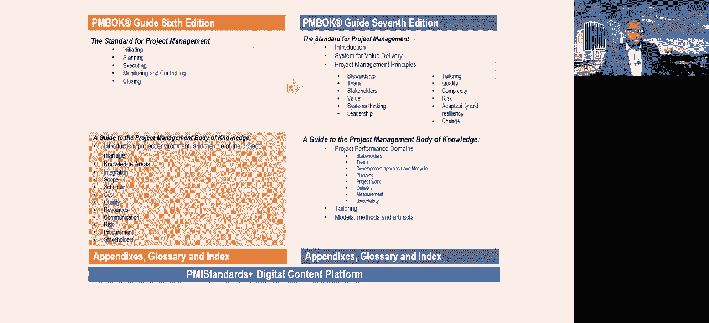
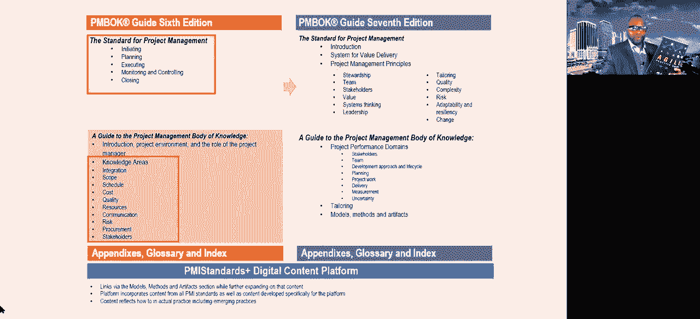
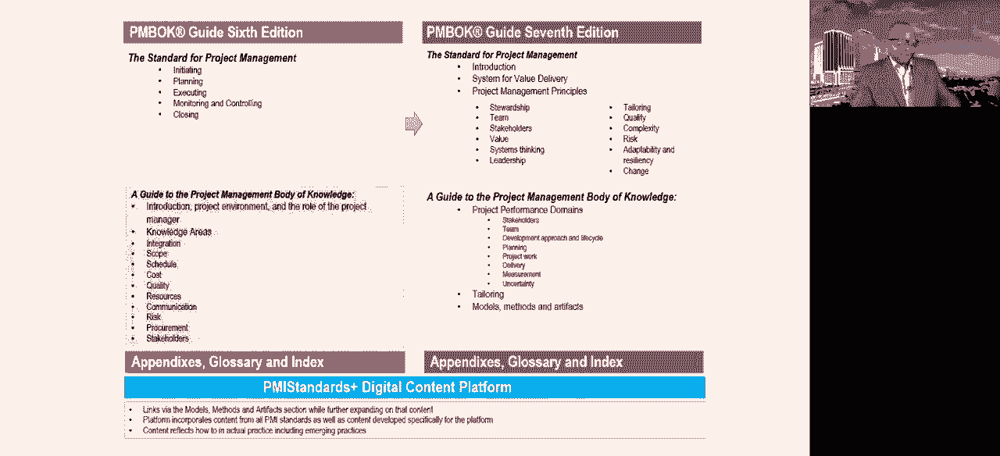
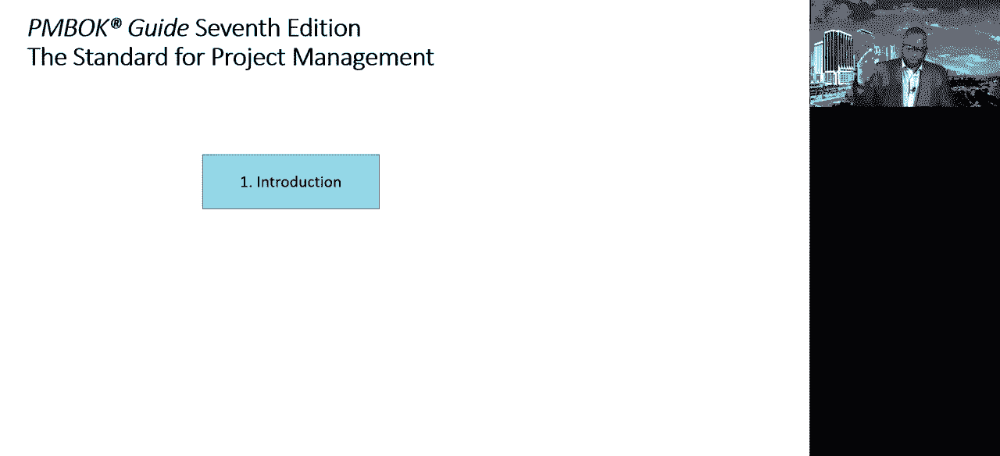
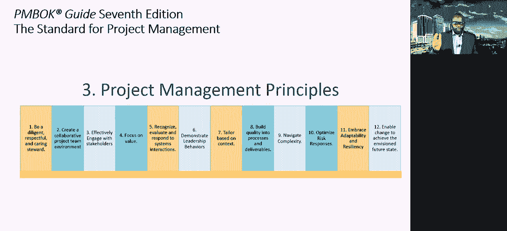
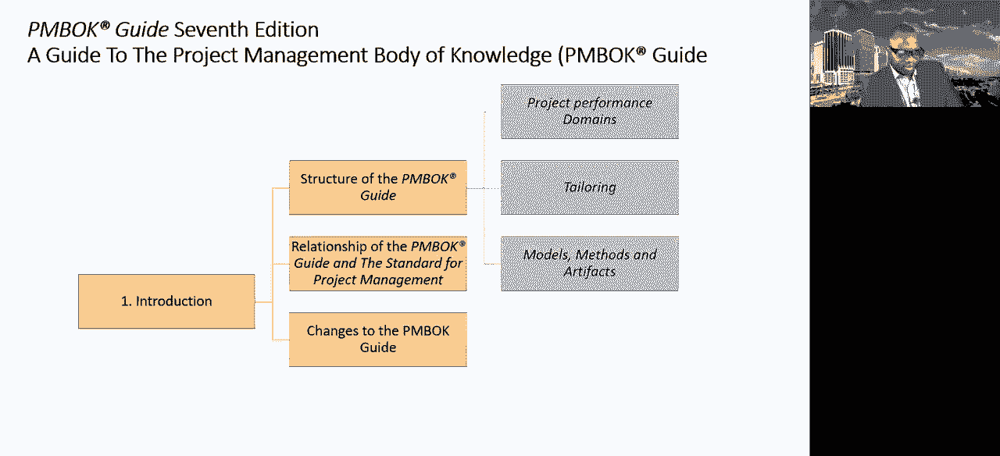
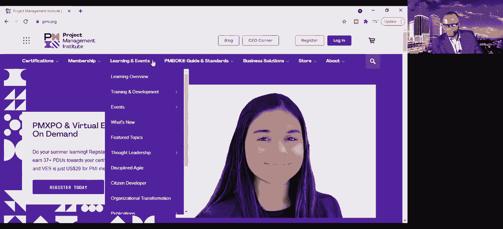
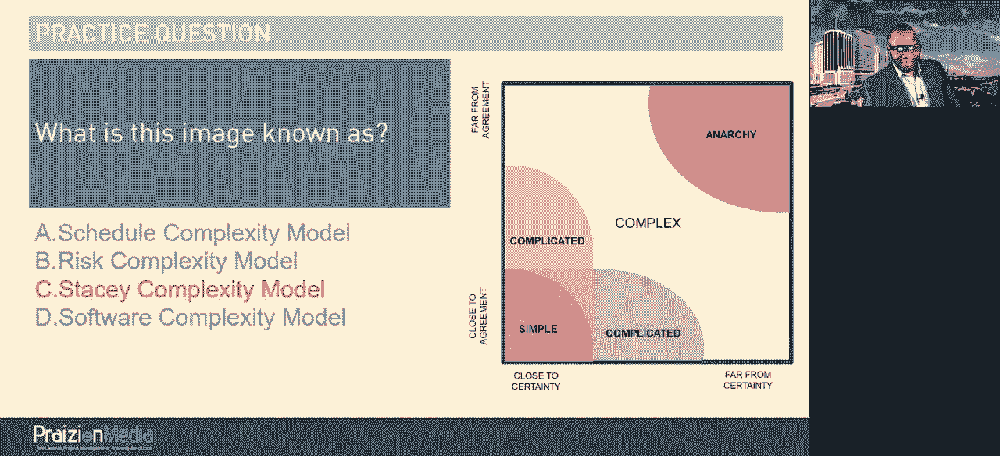
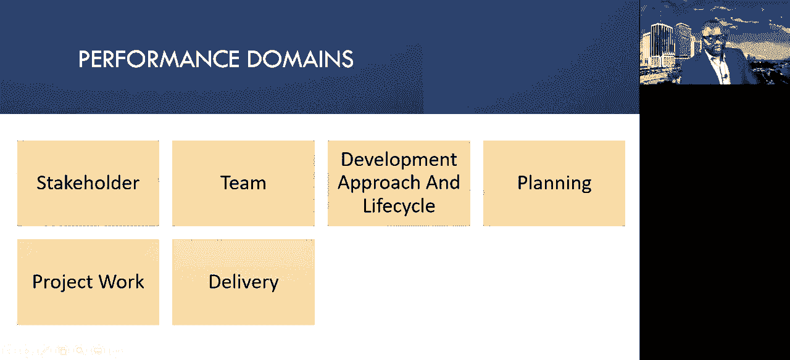
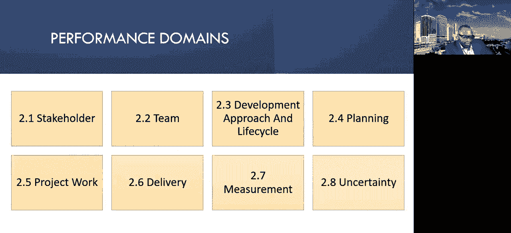

# PMBOK Guide 7th (Seventh) Training Course for PMPs - P1 - PumoSu - BV1qA4y1Z7rQ

Hello， my fellow project managers。 welcomelcome， Wele to a discussion about the Pembake Guide 7th edition。

 We're going to start off。By taking a look。At the sixth edition。Versus。The seventh edition。

Initiating planning， executing， monitoring and controlling and closing is what you have in the standard。

Got it。Okay。The 7 edition。Takes this。And gives you a new interpretation of the standard for project management。

 The bottom line is this， the7 edition。Takes。Project management and breaks it down like this。

You've got an introduction。You've got a discussion about system for value delivery。

 and then it goes into project management principles。

 These project management principles are meant to replace initiating planning， executing。

 monitoring and controlling and closing as being the standard for project management。

 So now the standard includes an introduction， system for value delivery and these principles。

 one stewardship。Being a good steward on the project。2。Team。All about the team，3， stakeholder。

4 value，5 systems thinking 6 leadership，7， tailoring 8 quality，9 complexity，10 risk。

11 adaptability and resiliency and 12 change。 And I went over these yesterday。

This is what the Pemba guide。6th edition。With the five process groups。

Now looks like in terms of the standard。 Okay， so while initiating， planning。

 executing monitoring and controlling and closing is buried under a section known as methods， models。

 artifacts， some to that degree。It has disappeared from the forefront of being the standard for project management。

All right。That's part one。 So in your company， if someone asks you the question。

 has initiating planning and all that stuff gone away， it's not gone away。

It is buried there in the 7 edition。But it is not emphasized as a standard。

It is buried in there as one of the models through which you can manage a project。

 Does that make sense。Okay， good。Let's move on。The next drastic change is。

What we call a guide to the project management body of knowledge， and to be quite honest， most of us。

 when we talk about the Pembake guide， this is what we actually see as the pemba guide， but it's not。

It's not this piece。 That's the standard。 It's part of the project management body of knowledge guide。

 but its， it's not the standard。 And I'm talking about the knowledge areas。 Okay。

 knowledge areas have been very useful in explaining to people what project management is， so。

A guide to the project management body of Knowledge 6 edition。This is what we have in there。

Introduction， project environment， the role of the project manager。

And then it goes smack dab into the knowledge areas， integration， scope， schedule， cost。

 quality resources， communication， risk procurement and stakeholders。

And that's how we know the guide， okay？Are you ready for this。7th edition。

It takes your understanding of the 10 knowledge areas。That， by the way。

 has been in existence for a very long time。And it transforms it。Into this new guide。

Project performance domains。And the project performance domains。

Let's zoom in so you can see them real well。Stakeholders。Team。Development approach and life cycle。

Planning。Project work， delivery。Measurement and uncertainty。So， I want you to reconcile。

The knowledge areas。That you see。And。The new performance domains， in other words。

These knowledge areas。Are no longer the meat of a guide to the project management body of knowledgege。

 Instead， it's these performance domains。All right。Like I said。

 I'm going to keep personal opinion out of it， but that's what it is。

So now you understand the breakdown at a high level。

 You know what the meat of the Pemba guideite 6th edition is。

 and you now know what the meat of the Pemba guideite 7th edition is。 Now。

 there are a few more pieces that I should throw in here。

 There is a chapter on tailoring and a chapter on models， methods and artifacts。 And that is where。

You're going to find a casual， if I may add mention of this。 You're going to find it inside models。

 methods and artifacts， as the second model mentioned。ok。Or method， whichever one they put it in。

 I believe it's。Message， I think。We're gonna take a look at all of this stuff eventually anyway， but。

Let me just really quickly refer to it so that those of you in。Speed。

 listen mode are gonna be able to see where this is。Okay， I believe this may be in the methods。

 So let's see， not in the models， but in the methods。So let me see this is on page  171。

So if you want to see where this is mentioned in a very casual and lacklut of fashion， if I may add。

 this is on page 1，71 of the 7th。Addition。Okay， you find mention of it and it reads project management processes can be organized into logical groupings of project management inputs。

 tools and techniques and outputs that are tailored to meet the needs of the organization。

 stakeholders and project。Groups of processes are not project phases。 The project。

 the process groups interact within each phase of a project life cycle。 And then on the next page。

 it goes into initiating， planning， executing， monitoring and control and closing what it is。

 It says these process groups are independent of the delivery approach。

Application areas such as marketing information， services and accounting or industry。

In a process based approach， the output of one process generally becomes an input to another。

 So what you can infer from this discussion， my friends， is that the PMI is not saying。

 forget about the process groups。Okay， it is the way the information is presented and emphasized。

That we can conclude it is less important。Based on their presentation of the material。

That's what it comes across as is our reality。 No， for that reason。

 I want to urge those of you that have project management offices。Pmo Os， program management offices。

 You're doing really well with your predictive projects， my friends in construction。Okay。

 my friends in the area of design， mechanical engineering。Automation。

Stay the cause of what works for you。Do not allow this to perturb you or throw you off instead。😡。

Be curious to understand the differences that are in this book。😡。

But I want to give you another layer。😡，Of perspective。And that is to understand the world of agile。

Because。The 7 edition。Does not really do that， believe it or not。Agile is so buried in the 7 edition。

 You may as well read the sixth， where it is emphasized in concepts。

 trans tailoring and considerations for agile。There is no topic here that is blatantly agile。

 It is so agnostic that it actually loses。It's character。 Okay， so for those of you that have PM Os。

You're in construction， you're in some heavy machinery， heavy process type industry。

 I want to encourage you to read the Agile practice guide and read the manifesto pages 8 and 9 and begin to apply that thinking to your projects。

 I didn't say that development approach。Thinking is different from development。 Okay。

 you could still be largely predictive， but agile in your thinking。

 and it will take you levels above as PMMI's research has shown。

 I've presented it many times on the channel that organizations that are agile in their thinking。

 but predictive。In their delivery are better， far better。Far more efficient。

Great greaterer productivity than those organizations that are predictive in their thinking。

And in their delivery。 All right， So you got to be agile。 that That's the summary of。

 of what I'm saying， your PMO。Don't start running all over the place， because。We are not doing away。

With the five process groups。I really want to emphasize that page 171 in the7 edition。

It lists the five process groups as one of the methods。Okay。 let's see。

 Let's let me get this straightray one second。Okay， so they listed as process groups。

 but it's under models。 Okay， let's get it straight。It's under models。 Okay， so that's models。 Good。

 so it's a model。 Okay， we call it a framework。 It's a framework， whatever。

 whatever you want to call it。 Just remember， page 1，71。In the Pembakeite 7th edition。Page 1，7，1。

Okay。So go back， tell your PMOs。It's okay。 We not forget about the five process groups。

 It's just not emphasized。The current standard is not built on it， but it doesn't disqualify it。

 okay。Great stuff。All right， let's move on to our next topic here。 So in the sixth edition。

 you got a bunch of appendices， the gloss3and the index in the same token。

 you got that in the seventh edition as well。There's a lot in the appendix。The glossary on the index。

 In fact， if you take a look at the count， the page count。The page count。

 it actually bumps up the page count。To 3070th。Pretty significant。Pretty significant。Okay。

 I also want to emphasize just so you don't get lost in the details here。

We have the standard for the 7th edition， right here。Numbered differently。Okay。

 you're gonna see a different numbering。Okay， then this。Okay。

 so if we're taking a look at the standard for project management on the  seventh edition。

 it goes from page one to page。60 hold on a second。Round about 67。 Okay， so this is number one。267。

 all right， so it's like having two documents in one。If you take a look at。

The guide to the project management body of Knowledge for the 7th edition。That goes from page 1。

To roughly page 200。And 74。So when you're going through it。Be aware that。

You got two different numbering schemes。Alright。😊，This one was just numbered straight on from page 1 to 756。

All right。When you really boil it down。You take a look at this。Plus， this。

And you take a look at the PDF。 the PDF just shows 370 pages。F the 7th edition。

So if you really wanted to get a。Perspective of， you know， ratio。307，370 to 756。

You could say that the new Pembak guide is about 0。48。That of the。6th edition， in other words，48%。

So he could say there's been a 52% reduction。They cut it in half。Okay， I applaud them for that。

 It's good to， to make it lean and mean。 I appreciate the， the less pages。 Thank goodness。All right。

So be aware of that breakdown， okay？So the summary on this page is if you have a project management office。

And you're worried about initiating and planning and executing monitoring and control and closing no longer been relevant。

 It's still relevant。 Now， a lot of what we had。In the sixth edition。

 by virtue of the tools and a lot of the things that I used。

PMI is not saying that this is now useless。They just made a mistake in the presentation in my mind。

 because how do you go from this。To this， how how do you make the transition。How。

Stakeholders is understandable。 Team is explainable。Development approach and life cycle。

 We had that in chapter 2。Now you just throw planning in here。

 It has no rhyme or reason because planning cuts across everything。

 So I know the question is going to be， but how do you plan， Well， planning in the 7 edition。

Is broken down。 And I'll just use these tiny little arrows to show you so that you can imagine how it is。

 Planning is broken out into。Get a smaller arrow。Planet is broken down into the usual tiny little bits that you would expect。

Okay， and this is just， for example。For example， so when you。

 when you get to this chapter on planning。You would see， of course。

 schedule talked about in some places， you'd find cost mention in some places。

 you'd find scope mentioned in some places and things such as that， okay？

They're not broken down like knowledge areas。 But as you kind of go around。The perimeter。

 you're going to find these things rolled up into。Different sections or explain to some degree。

 So a lot of the meat of the sixth edition that we had， you know，2，25，10，12，1。 we had 25 in planning。

Well， that's where half of the Pembogate is。 So what they've done is they've taken a lot of that planning stuff。

Which cut across all of the knowledge areas。Right。And they have unceremoniously。Assigned it， to。

Planning in the seventh edition， okay？Project work， delivery， measurement and uncertainty。 I mean。

 those cut across all the knowledge areas。 All they've done is taking the knowledge areas。

 broken them apart and reconfigured them。 There really is nothing new in this。

 And that's why for you， as a PMP。When you take a look at the new breakdown。

In a guide to the project management body of knowledge。

 you should be able to find your way around it pretty well。

You shouldn't be confused or you shouldn't be thrownn against the wall that you cannot present this to your organization is what I'm saying making sense as a PMP。

You should be able to break down to your firm that all the stuff in the sixth。

Has been reconfigured in appearance。 It's still there in nooks and crannies of the 7th。 Now。

 the I T T Os。Those have been broken out again。From putting them into processes， in fact。

 there's no process configuration in this。

What they've done。To give you a。Good idea of what has happened。 They've taken the I T T Os。Okay。😊。

The tools。Youll now see them referred to as methods。Okay， you find some of the tools。

A handful of them。Been referred to as methods。And you will also find the inputs and outputs。

You'll find those being referred to as artifacts。So you're going to find mention of this。

And the artifacts。Okay。So a lot of the stuff that you knew in the past is still there。

It's just scattered。Across different sections。Let me show you an example。 Okay。

 so when you take a look at the。Tools and techniques。Okay， tools and techniques。

 we have two broad categories， we have data gathering and analysis methods。We haveestating methods。

 we have meeting and event methods， and we have other methods。Okay。And these are under。Methodds。Okay。

We have a smattering of tools and techniques that made it in here。 We have alternatives analysis。

 assumptions and constraints analysis， benchmarking， business justification analysis。

 just talk about decision making， as far as project selection is concerned right MPV IRR cost benefit ratio or you know benefit cost ratio all that stuff is here check sheets。

 cost of quality decision tree analysis， earned value analysis， EMV expected monitoring value。

 forecast in influence diagrams， lifecycl assessment， make or by analysis。

 probability and impact matrix， process analysis， regression analysis， root cause analysis。

 sensitivity analysis， simulation， stakeholder analysis， what analysis， trend analysis。

 value stream mapping， variance analysis， what if scenario analysis and then on the next page we have affinity grouping analysis estimating。

Function points， multi point estimating， parametric， estimating， relative estimating。

 single point estimating story point estimation， wide band Delphi。 Co。

 you know you plan in poker backlog refinement， bidder conference。Change control board。

 daily stand up， iteration review， iteration planning， kickoff lessons learned planning。

 project closeout， project review， release planning， retrospective risk review， status。

 staringing committee。 And then we have other methods， impact mapping， modeling， net promoter score。

 prioritization schema and time box。 Bo just got done with all of those tools and techniques that is hilarious。

So tools and techniques。 you had hundreds of them in previous edition。 Now。

 you can see we only have a few。 I see my friend Brittanney has joined。 Brittany， How are you。

 How you doing， and what is your impression regarding these techniques and tools being presented in this way。

Hey Phil， yes， so it's much more streamlined， in my opinion， I like it。

Isn't it more streamlined It is。 They just took a handful。

 And instead of showing you hundreds and hundreds， I think you got at most maybe even maybe less than 40。

 I think Yeah， I think this is definitely gonna help PMmpP candidates a lot of the bottlenecks that I see is just there's such an overwhelming amount of information。

 especially in tools and techniques and then I forgot which pages it is it's like in the 600s in the 6 edition。

6 to 694。 Yeah you see you trained me well I think that that section in the seventh edition is gonna be much less intimidating to exactly that is that is one I gave them points for yes。

 So it's interesting to see how they've dismantled them from being latched on specific processes and they've now just put them kind of like use as you see fit but on page 183 Have you downloaded it。

Me。I haven't。 I need to go on and do that。 I just saw the post about it yesterday。

 Yeah I'll go and do that download it and let me know what you think。

 So the table that you're talking about 686 to 694 is now on page 182 and 183 and it's just two pages I think it's actually better that they put it in the front of the book because you get to it sooner and I know it shouldn't。

 but it'll place more emphasis on it and itll it'll make more people pay attention to it because I can't tell you how many students I talk to and they don't even go past the back of the like the end of what the closing process group in the back and I'm like there's all that other stuff too So this is good。

Very nice Brittany， thanks for your perspective， I appreciate that。

And we're just taking a look at the high level。 I'm going to go into a little bit more detail。

 And then you're going to be able to better help people who are getting ready for the test。

 I believe， somewhere 2022。 I've been telling folks。

 if you're taking the test in the next six months。 Don't read this book。 I've told folks。

 don't be on this call。 because there's a lot of other stuff and a lot of other configurations。

That is likely to throw people off。 So I've been trying to encourage people not to be on this call。

 says since the pages have been dropped by half。 does that mean Pembook 7 doesn't explain topics in that much detail as Pembo6 used to that is correct a。

 I believe that the PMI perspective here。 is's gonna be one of it's a standard it's not a textbook。

 So go read whatever you want to read elsewhere。 but we're going to just explain at a high level。

 And that's what they did。 Just take a look at the five process groups。 It's barely a paragraph。

 It's barely half a page。 you see， and that seems to be their disposition across the board。

 Can I make a comment on this two Phil。 Sure， I think that since in general。

 the PMmiI is leaning more towards people in people engagement， you know， it's less about specifics。

 like you said， like the standard， the formula， but it's more about working together。

as a team in honestly making your own perceptions based on the loose guide that they give you and then you know。

 using that to work on your individual projects in the real world with your teams exactly that that has been their disposition to be less prescriptive about what you should do。

And to give you like a blank template。 And， and while that is good。

 I see a lot of firms that have built their processes around these previous documents。

 I see a lot of them now thinking， oh， all of this is not good。 No， that's not what PM I say。

 PM I is not saying。 Forget about the sixth edition。

They're just presenting the information differently， you know， and like I said in the very beginning。

 I'm going keep my personal opinions out because I did a lot of that yesterday。

 and I know people just want to know what is new。 So a lot of what they've done is streamline。

 make it less cut it into and just give you the bare minimum。

 There's a lot of stuff in what you see on the screen called Standard plus that exists outside the view of the seventh edition right here。

PMI standards plus digital content platform。 So for templates and tools and some additional training and lessons。

They actually have a pretty good。Platform。To begin putting。

The extra stuff they did not present in the 7 edition。Okay。

 Suraj says PM I has gone for lean methodologies。 process improvement。

 It's good that the contents are more reduced。 absolutelysutely。

 I have absolutely nothing against reducing the volume。 It was a beast。

 and it didn need to be reduced。So go on to PMI standards plus take a look at what they've got there and you'll see that it's a pretty good platform。

 If you've got time， I might review it with you。Alright， so let's take a look at what is here。

 We've got links via the models， methods and artifacts section。

 A lot of stuff platform incorporates content from all PMI standards。

 as well as content develop specifically for the platform And when I see a boatload's there's all sorts of things in that platform。

 content reflects how to in actual practice。 including emerging practices。

 So they've made it very clear that there's going to be a lot added to this body of information。

 just not in the physical book， but online。Al right， so those are the huge monumental differences。

 Like I said， don't throw out the baby with a bathwater。 Okay。

 I want to speak specifically to my friends in government， hey。

Your agency is using the five process groups。 Don't get goofy now。 It's working for you。Use it， okay。

The 10 knowledge areas。It's working for you。That structure and configuration is working for you。

 Use it。The agile practice guide。 I really want to make this clear。

 because I know a lot of folks don't know this。 The agile practice guide has got references to the knowledge areas。

 So if in doubt， I want you to go to pages 19091 forward， it goes on till about page。

95。Take a look at the description of how to practice these areas of knowledge from an agile lens。

 And that will help you if you're going into a hybrid model。Okay。I see some else joined。 Hey， Keith。

 how are you， my buddy。Keith， what do you think about all of this？😀哈哈哈哈哈。😊，Let me know， Keith。

 Brittany asked a question。 Hey， Keith， how you doing， my friend， I'm doing well， How you doing。

 I'm doing awesome， It's good to hear your voice。 What， what are your， what are your thoughts。

 Have you downloaded it。😊，I haven't downloaded yet I that' why I jumped on the I was like I want to see what's happening you know trust I do see that I can see how the test has changed and I can see that they's kind of reflecting that change just about people in process like oh yeah absolutely and and that's a good point。

 Kaith to jump on what you just said and Brittany's question。When is the test changing？

The test has already changed。To reflect a lot of what you've seen in the 7 edition。

 it changed on 2 January。 They just didn't label it as changes based on the 7 edition。

 But what is on the current exam， A lot of it， it aligns to some of the topics in the 7 edition。

 But this is very important。If any of you non PMmpPs are eavesdropping because you think you're going to be missing out。

 you're actually not missing out。 Let me just make it very clear that the current PM exam is not based on a Pembook guide entirely or the agile practice guide entirely。

 No， it's based on a number of documents and books and bodies of knowledge。

So if anyone is looking for that perfect time when the exam becomes seventh edition focus。

 you already missed it， so it's already in that vein， okay？

Something else to mention is that the PMI have a study guide。Did you folks know， Keith， Brittany。

 did you folks know PMI has a study guide for the current exam that is not Pemba guide。

 That is not Did you know， is it different from the exam content outline。 Yep。

 different from the exam content outline。 PM I published。 Oh， no， I didn't know。 I'll。

 I'll go in and study that thing because I can help some of my students， too。 Well。

 the thing is you're gonna have to pay a pretty penny for it。

 It was produced by a company which will remain unnamed at this point。 But to be quite honest。

 it's a really bad guide。 It's not good。 It's not any good， but it exists。 So here's the point。

Because they already have a study guide and content for the exam that changed in January。

 Do you really think PMI is going to spend the funds and the effort changing an already poorly done study guide that could barely effectively reflect the  sixth edition to the 7。

 No， they're not。 And the point I'm making is the exam main change in is already changed。

 So what PM I have mentioned in their literature is。Normally， all throughout the year。

 they are making smaller increments to borrow from their agile practice guide lingo。

 They are introducing smaller increments of change all throughout the year。

 And that's why one moment you hear someone say， oh， I got this on my exam。

 And then you hear someone else say， what you talking about。 that doesn't exist on the exam。

 It's because it is like。I would like to use the Kanban analogy。

 Think about streams of value or streams of increments， just coming through the pipeline。 You know。

 so anyone looking out for a particular cut of point。 they've already missed a boat。2 of January。

 PM I， they're not going to tell you， oh， by the way， this is based on。like Keith said。

 the people focus， we already see it on the exam。Is what I'm saying making sense Brittany yes。

 it it is I just， you know I took the old exam so that's true yeah。Yeah well。

 thank you for the question and thank you Keith for weighing in there did that make sense， Keith。

 what I'm saying No， it makes sense， but I would say that I mean the I took the original the odor test as well and that test it was I feel like you could。

I think I think it's easier to study for， I was say because it was this one you don't know what you're getting。

 You may get chalia or a whole bunch of waterfall。 So you have to do the whole swath of the knowledge area now。

 very true area， know， very true Keith。 And I remember your lessons learned。

 you were one of my outlier students who said it was not a 75，25 was it for you。

 it was more predictive right， there was more predictive substance。 Yeah， I was multi predictive。

 probably 60% predictive there you go。 And that is a very good lesson for PM who are watching to know that everyone's exam has a different titration of these things。

 And I truly believe， you know， judging from what Keith just said。

 If you take a look at the 7 edition。 I mean， let me just go back and show you。

You take a look at the seventh edition， it is actually camouflaged。To still be， in my mind。

 maybe even 7030 in favor of predictive， because there's so much stuff talked about in the 7th edition that is of a predictive nature compared to the agile coverage。

Agile is covered。Pretty weekly。And there's not a lot of emphasis in my mind。 Now。

 in trying to make it agnostic， they've lost whatever agile presence they were looking to put in。

 It's not in the forefront。 So in my mind， if I was taking a look at this。

 I would say Pemba guide 6 edition， let me just give you this very interesting comparison and this when you folks take a look at it。

 actually， you let me know what you think， Keith and Brittany， But in my mind， I think Pemba guide。

6th edition is like 90% predictive。In my mind， and about 10% agile， I would agree with that。 Yeah。

 yeah， like that。Yeah， but insane though I took the test based on the sixth edition and I still had。

 I would say about 20 to 25% agile related content on my on my exam very good point Brittany and and that is because the PMI。

 they added the agile practice guide remember so yes they had this you know。

 if you look at the 1 hundred and sum pages then it now makes it an 8020 balance when you add the agile practice guide so yeah that that does make sense。

Now， if you take a look at the seventh edition。From from my limited review over the past 20。

 not even up to 24 hours， I would say it's 70% predictive。Pretty much in my mind。

 there's a lot of predictive stuff。 stuff you would never， ever hear in the world of agile。

 You say those things in the world of agile。 They're gonna look at you， like where are you from。

You know， where did you fall from， Phil？And 30% agile in， in my estimation of things。

 if I was going to be probably more analytical， I would say60% agile，60% predictive， I bigger pun。

10% hybrid。And I could actually be a little bit more。

ALi bit more liberal with my hybrid and I would say 30% agile。

So that kind of aligns with the exam that Keith took pretty much， it has agile and hybrid。

 you could say it was 50， but if you look at predictive and the elements of predictive are in hybrid you could say it was 60%。

Kind of kind of like that。 that that's how I see it。 So are you folks。

 Are you folks going to download it and read it， because this is meant to help you digest it。Better。

Yes， you will。 What about you， Keith。Yes， I will。 I'm not cool。 Well， hopefully， this can help you。

 Al right， so now that we're done talking about the high level changes。

 we're going to go now more into some of the depth。 So let's take a look。

 We got some questions from our friends。

Adsh says， yep， I do find that ITTO is a beast in Pembaka It's difficult to grasp for real。

 And Surrad says， yes， the ITtos are very much difficult。 Yes， also they are repeated Sagej。

 absolutelysly agree。 What is the best way to tackle ITtos Look for a physical model of the tool or technique。

😊，Do it like if it is something that you do like MCDA， for example， multicrit decision analysis。

 you create a matrix， do it yourself。 if it's a product analysis， do it yourself。

 if it's an output or input， look for an example。 I usually send my students， this link。

 I know Brittany and Keith， you folks， you already know the link。

 It's the CDC link check out that link。 if you want to see an example of an output or an input。

 look at that link。 Okay Sraj says I think we can refer to the seventh edition。

 it will be more easy as compared to the sixth edition。 it is not as comprehensive。

 and it's a little bit confusing， to be honest。 So is it is it smaller， Yes。

 I it more confusing as far as the presentation of the content to train project management。 Yes。

 it's rather it's rather confusing。 And that's why I'm doing this session so that when you train it。

 you。Going to train it using your own curriculum。 Okay。

 you're going to train it from the lens that works best for your company。 Some of you， your。

 your company is going to say no， We just want to go agile。 Then in that case。

Look for another solution， train them on some of the principles， perhaps。

 but just be aware that there are better principles in my mind in the Agile practice guide from the Agile manifesto。

 okay。Adash says for covering Agile is agile practice guide enough good question。

 The agile practice guide is definitely not enough so。

Out of the companies in the world who use agile， over 70% of them use Scrum， and therefore。

 you need to read the Scrum guide by Ken Schweber and Jeff Sutherland， absolutely read it。

 just Google or search on YouTube Praon scrum guide audio。

 We have a 40 minute audio thereabout of reading through the scrum guide。 It's only 13 pages。

 It's a very straightforward read。 I think it's even less。 Now maybe 20 minutes。 take a look。

 read the scrum guide。 right， and I would say get hooked into the source。 you know。

 go to Ken's website。 take a look at his practice tests and test your understanding of Scrum。 right。

 to make sure that you're thinking right about Scrum。Reginald says， if I study the sixth edition。

 will that be sufficient to pass the test， not just the sixth edition， Reginald， you need to study。

The sixth edition， the Agile practice guide， the PM exam content outline。 and also。

 I would say the Scrum guide， another material like a reliable study guide。

 We have reliable study guides， appraziian。 And we give our students that we also give our students a dose of hybrid。

 So in the next number of months。 Roy and I have a publication coming out that will help you see all of this。

 all the stuff， be it seventh edition， sixth edition， Scrum， agile all that stuff。

 We are coming out with an agile slash predictive slash hybrid presentation of the content。

 and it's broken down in a very agnostic way by domain， and it's it's got questions。

 it's got exercises。That would help because a lot of our students， Keith， you know this。

 you watched all those videos you were in the class when Roy and I created these hybrid thinking videos。

 weren't you， Keith。I was and they were extremely valuable to me pass because honestly。

 I don't think I would have if I didn't watch those videos like two or three times。 Wow， thank you。

 Keith， thank you。 and thanks for your lessons learned as well。

 I know that those lessons learned have helped a lot of folks who are getting ready for the test So why don't we jump in to talk about the meat Here is the meat Cha one。

 let's talk about chapter one now。 and we're talking about chapter one in the standard for project management。

Okay， so I don't know if you folks caught the number in。

 The numbering is different in this pemba guide。 It's broken down into the standard。

For project management。 And then we have the guide to the project management body of knowledge。

 So right now， I'm looking at the very first page in the first section。 Okay。

 be aware that they're gonna be two page ones，2 page twos，2 page3s。 Okay。

 I want to make this perfectly clear。 So let me， let me zoom in for second。 so you can see this。

 the standard for project management。 This is the first section。

 and it's numbered from number one page 1 all the way to page 60 thereabout。 Okay。

 then you have a second section。

Which is a guide to the project management body of knowledge。 That is section 2。

 and it's numbered from page 1 to like 1，71， something to that effect。 Okay。

 and there are a lot of Roman numeral numbered pages for the first section。

 And that brings the total of pages to 3，70。 So it's not as small as as you think it's。

 it's like almost。2 and a half times the agile practice guide。 Okay， it's still small。

 It's better than 756 pages。 Okay， but just be aware it's not super small。

 It has some substance still。 Okay， so let's take a look at the very first section and introduction。

Alright， so it's called the standard。 again， the standard for project management。

 That's where we're starting our lets go there。

All right， so it reads the standard for project management identifies project management principles that guide the behaviors and actions of project professionals and other stakeholders who work on or engage with projects。

And it's broken down into a number of tiny little pieces， which we'll take a look at。

Going straight into the second chapter。 The second chapter is titled a system for value delivery。

 So if you're with me， just go on to page 7。 All right。

 there are a number of things talked about here。 And I'm just giving you the top of the waves overarching ideas。

 The first piece is about creating value。 Think about it。 What is a project meant to do。

 It's meant to deliver。A product。Service or result that generates enough value to be justified in the first place。

 But when we think about value。Think about value as the net quantifiable benefits that you'll get in from the project。

 So in order to get value， there must be some benefit。

And these benefits here talked about exhaustively in the Pembagate 6 edition。 Goodwill。

 brand recognition， monetary assets， stockholder equity， things like that。

 So it says this section describes how projects operate within a system to produce value。

For organizations and their stakeholders， it says projects exist within a larger system。

This standard uses the term organization when referring to government agencies， enterprises。

 contractual arrangements and so on。 And it talks about value being identified whether in a portfolio。

 whether they in a project， whether in a program。 Okay。

 and and that's part of the discussion about value。

 And then it goes into information flow and a lot more stuff here。 But let's go to the next。

Overarching point。2。2。 And excuse my cobwebs。 Remember， this is less than 24 hours， so。

I put this together， pretty ad hoc。All right， so let's go through it again。2。

2 is organizational governance systems， and it says this section describes how governance supports a system for value delivery。

 So who， who remembers the definition for governance and taking you way back to your PM P governance is the framework。

Within which authority exercised， according to Pemba Guideite6 edition。

 So when we talk about governance， just remember， it's a framework for which authorities exercise。

 So let's read。 It says the governance system works alongside the value delivery system to enable smooth workflows。

 manage issues and support decision making。Governance systems provide a framework with functions and processes that guide activities。

 It's basically， just remember the definition。 governancen is the framework within which authority exercised。

 whether at the project level， at the organization level and what have you。Let's move on to 2。3。2。

3 is functions associated with projects。People drive project delivery。

 They do so by fulfilling functions necessary for the project to run effectively。 Now。

 let me just give you this。 take straight up。 This view in 2。

3 is largely from a predictive or at best hybrid lens。And the reason is this。

The very first one talks about providing oversight and coordination。

 People in this function help the project team achieve the project objectives typically by orchestrating the work of the project。

 Now， in a predictive world， orchestrating is done by the project manager。 Yes， yes， yes。 but in。

An agile world， it is done by the team。 So talking about functions associated with projects。

 We're really talking about integration on page 13。 Okay。

 The next one says present objectives and feedback。 People in this function， contribute perspectives。

 insight and clear direction from customers and end users。 We could say product owner。

 We could say team members and so on。The next one on page 14。

 it says facilitate and support now we're talking about servant leadership， scrum masters。

 some project managers on agile projects that are more agile in nature but with a predictive component。

And then it says perform work and contribute insights， that's the team obviously， apply expertise。

 provide business direction and insight， provide resources and direction。

 functional heads and people like that， and then we have maintain governance。ok。And however。

 you use the word governance。 Goverance is a pretty stern word。 It's not a word you come across。

 typically in the world of agile。 It's why we have to tread carefully using that word。

 And I I said yesterday， that is where you can lose a lot of agile audience。

 Some of these roles that are being mentioned here in the world of agile It's just team team。

 team team， team， team team。 world of scrum is just scrum team， Scrum team， scrumum team。Al right。

 All right， let's go on to 2。4。 The project environment。

 projects exist and operate within internal and external environment。

 The bottom line is this enterprise， environmental factors， internal and external。Okay， and OPAs。

 So they talk about internal environment。 They've done away with the term enterprise environmental factors。

 For the most part， they just say internal environment and external environment in internal environment。

 bear in mind that your beloved Opas your， your， your assets， your data assets。

 your governance documentation。All that stuff， they've just shuffled it into internal。

 No more stock mention of OPAs。 Okay， then if you go to the next page， external environment。

 we have marketplace conditions， social， regulatory。And so on。

 And that that is really code for your external EEFs。 All right， and that is on page 18。

Let's go to 2。5 product management considerations。It says the disciplines of project program。

 project and product management are becoming more interlinked。

 while portfolio program and product management are beyond scope of this standard。

 understanding each discipline and the relationships between them provides useful context for projects whose deliverables are products。

So they haven't forgotten about their product friends， they've tried to give some emphasis here。

 and on page 19 they have a sample product life cyclee and they're showing how the life cycle of a product。

It has a tangent of events。So they give you a little graph here， and it， it shows you。The peaks。

In the life of a product。 And it shows how different projects， Project 1， Project 2， Project 3。

 This is all product life， right， throughout the life of a product case in point， flash， now defunct。

 no longer no longer looked at as a product that is in operation， right， F went through a series。

 a smattering of increments and projects to make it better。 But the security just in cut it。

 And then it eventually got down to。Project N， and that was the final。

 And that was the end of the product life。 So they've got。Introduction of the product。

 The growth of the product。The maturity。 And you can see the peak right here。Kind of。

Is in that zone and then decline or retirement of the product。And that's a sample product life cycle。

All right， and that's pretty much it， you know， it talks about product management can exist at different levels。

Program management within a product lifecycle， project management within a product lifecycle and product management within a program。

 So here's the summary。These projects。They could exist individually。

 or they could be part of a project。 They could be part of a program or part of a portfolio。

 That's all they say。 All right， And that， again， is on page 19。 Okay。

 and that's the end of chapter 2。All right， let's go on to chapter 3。

Chapter 3 is where some of the fun begins。All right。All right， Reginnald said。

 when will you let everyone know about the event， Which event is that Reginald。

All rightLet's go into chapter three。Chapter 3。Chapter 3 is all about these project management principles。

 And you've heard me speak about these principles。 And I I said， PM I。

 why don't you just take the agile manifesto principles？ They are more far reaching。

 more profound in thought and in construction。 You should have just taken up。

But now they have their own principles。 Let's take a look at them。 One， be a diligent。

 respectful and caring steward。Says stewardship encompasses responsibilities within and external to the organization。

 Steewardship is all about integrity care， trustworthiness， compliance。

 A holistic view of stewardship considers financial， social。

 technical and sustainable environmental awareness， in other words。You've been given。

These resources to take care of this responsibility， to head， to lead， do it well。

 That's the summary。 integrityity， care， trustworthiness and compliance。

The next principle says create a collaborative project team environment。

Projects are delivered by project teams。 Project teams work within organizational and professional cultures and guidelines of often establishing their own local culture。

 in other words。Agile practice guide， page 49， page 50， talking about team structures。

 social contract， team contract， all that stuff is going to come into this discussion。

Right off the bat on page 29， they mentioned team agreements， like I said， page 49， 150。

 the Agile practice guide， they talk about organizational structures and they don't go off on the deep end talking about matrix。

 functional， projectized， project oriented and so on。

And that they talk about processes that teams use， they talk about authority， accountability。

 responsibility， right， accountability is ultimately answerable。

 responsibility means you're the doer， accountability means passing the buck stops here。

 responsibility means you are doing。Let's take a look at the next chapter here or the next section。

 its stakeholders and it states effectively engage with stakeholders。

 engagengage stakeholders proactively and to the degree needed to contribute to project success and customer satisfaction。

 stakeholdersholder influence projects， performance and outcomes。

 Project teams serve other stakeholders by engaging with them。

 Stholder engagement proactively advances value， delivery。😊，If you go into the details。

 it says stakeholders can affect pretty much just think about it like the knowledge areas， right。

 stakeholders can affect the overall success。 I often say success on a project。

 you could say fitness for use conformance to requirements， you could say on schedule and budget。

 But to be quite honest， customer satisfaction trumps all of those。

 So if your stakeholder does not see your project as a success。 It is not a success。 page 32。

 It says by defining success factors and participate in the evaluation of success。

 So those are some of the big things stakeholders do。 The next one is value。 focus on value。I mean。

Isn't that just so evident in white elephant projects。 you see， case in point， a firm I in。

 we came out with this deliverable， only to find out the deliverable was not being used。

 Why you not using the system。 Oh， there's another business unit in New York that have a very similar system。

 It does exactly the same thing。 We prefer to use that。 What。

 we just wasted a bunch of money on a system that is a white elephant project。

The project's already been done。 So that's focus in on value。 If youre really focus in on value。

 You want to ask， what value does it add， Has something similar already been built。

 How can we make a case for this thing， All right， so it says value is the ultimate indicator of project success。

 That project was a failure because no one used the system。

 Value can be realized value can be realized throughout the project at the end of the project or after the project is complete。

You already know that when we talk about value on a project。We， well， in agile circles。

 the code named for the product owner is chief value officer。

 The product owner should be all up in value。Is it going to add value， Leave it on the backlog。

 Is it not， Don't do it， How much value is it going to add minuscule value， What is the risk。

 High risk， minuscule value all the way down to the bottom。

All the way down to the bottom of that backlog， we want to do high value。High priority stuff。

High value， high priority， low risk。 That's your low hanging fruit。

 So that's some of the mindset you need to be thinking about when we talk about value。

 Let's go on to number 5 systems thinking。Recognize， evaluate and respond to system interactions。

It says， recognize， evaluate and respond to the dynamic circumstances within the surrounding and surrounding the project in a holistic way to positively affect project performance。

 Here's a summary， projects do not exist in a vacuum， projects exist within a system。

 and you need to understand the forces at play in that system。

 whether you're looking at the immediate system， the organization or a wider system。

 Market or wider system。Even wider than that， the geographic location， however， you want to identify。

 you should think about your project being in a system。

 and you should also think about your project being a system within system。

So think about a system of systems。 It says a project is a system of interdependent and interacting domains of activities。

 systems， thinking entails thinking， take a holistic view。

Of how project parts interact with each other and with external systems， get it。

 a system within a system。 systems are constantly changing。

 being responsive to system interaction allows project teams to leverage positive outcomes。

That's the summary。 And bear in mind， this is talked about in chapter。2 of the 6 edition。

 The next one says， demonstrate leadership behaviors。 This 1。

 I'm going keep my personal opinions out because， you know， I am a leadership junkie。

 I will not comment much on this， but I'll just read a high level。

 This is gonna to be for another day when I can sink my teeth into it。 It says。

 demonstrate and adapt leadership behaviors to support individual and team。

Effective leadership promotes project success and contributes to positive project outcomes。

Leadership is different than authority。 That is true。

Effective leaders adapt their style to the situation。

Effective leaders recognize differences in motivation among project team members。

Here's a trivia question。 I know some of you are getting ready for your PMP exam。

 You actually shouldn't be here， but which leadership style is that effective leaders recognize differences in motivation。

I wonder if you remember that one。 Leaders demonstrate desired behavior in errors of honesty。

 integrity and ethical conduct。 I like the fact they called leadership out。 I do think， however。

 leadership has been covered in a very robust way in the 6 edition that just off the bat。

 looking at this， this。It does not do like the  sixth edition。 Let's read page 42。

 It says when senior managers suffer conflict over priorities。

 neutral facilitation helps more than detailed recommendations， so。I see。

A lot of these questions that we find on our exams， we who have done the PMP exam， you know。

 the idea is not to solve every problem for the team。 and that's what this is really just saying。

 Allow the team to some degree sort themselves out a project team member deepens leadership acumen by adding in or practice in a combination of various skills or techniques。

And it goes into a number of bullet points。 It's a laundry list of bullet points。

Focus in a project team around agreed goals， articulating a motivating vision。

 seeking resources and support it goes on and on Next page says personal character matters as a leader。

Projects work best when leaders understand what motivates people。

 Effect leadership promotes project success and contributes to positive project outcomes。

 Additionally， business obligations can be fulfilled based on delegated responsibility and authority by blending styles。

 continuing scale， growth and leveraging motivators。

 any project team member or stakeholder can motivate influence coach and grow the project team very well said。

 I like that statement， because you've heard me say everything rises and falls on leadership。

 like my mentor， John C。 Maxwell said。 For those of you keen on knowing more about leadership。

 I want you to take a minute。 go explore the project leadership institute is gone down too。Project。

Leadership。Institute。Dot com。All right and Brittany knows this firsthand Brittany how does it feel to be in the project Leadship Institute you having a good time Yes。

 it feels amazing seriously guys it adds so much value so after you get your pPs like definitely consider joining us it is so helpful and continuing the journey after being certified。

Absolutely， and that's why I'm really glad。 Thank you， Brittany。

 Don't you feel excited to see a leadership principal here。 I do。 I actually do。 But I like you said。

 I like the descriptions in the breakdowns in the6 edition way better。 they do here。 I know you did。

 I know you did。 And， you know， Brittany has been not just， you know， one of our PMP guru。

 She's actually come back to help in training。 that is a sign of a true guru。 So thank you。

 Brittany for weighing in on that one。😊，You're welcome。 I guess。

 I guess servant leadership when you just asked that question too， you didn't say the answer。

 but I guess servant leadership Well， let's keep it a mystery。

 but I'll tell you when we get off the call。 It's a， it's a secret。 Let's see。

 Did anyone respond on YouTube I want them to go open up their Pemba guides Okay。

 I don't think anyone responded okay。😊，So let's continue along Brittany。

 So here we're moving into number7。 number7 is tailor based on context。

 So you got to tailor the project makes sense。 it says design the project development approach based on the context of the project。

 its objectives stakeholders governance。 In other words， tailor， according to the project。 All right。

 Each project is unique。 project success is based on adapting the unique context of the project to determine the most appropriate methods for producing the design outcome。

 All right， let's go on to our next one quality， build quality into processes and deliverables。

 That's a no brainup。 So it says project quality and tail satisfying stakeholder expectations and fulfilling project and product requirements。

 quality focuses on meeting acceptance criteria for deliverables。The reverse of your story card。

 right， Your user story card Project quality entails， ensuring projects。

Project processes are appropriate。 Yeah， so that's quality。

 We can talk about quality from a product perspective or from a project perspective。

 That's what they're saying。 All right， the next one is navigate complexity continually evaluate and navigate project complexity so that approaches and plans。

 enable the project team to successfully navigate the project lifecycle。

 So what are they saying in essence。 I want I want to take you to the agile practice guide page 14。

 because that's where the Staacy complexity model is。

 and that's where you begin to see the language of complexity complex。

 So we have the complicated space。 and we have the complexity space。 So you can have simple projects。

 you can have projects that are complicated， but you could still use are predictive。

 largely approach。 But then you're beginning to use a little bit more agile because they're tiny little components that are all part of the puzzle。

 And if you follow a predictive approach。 You could get complicated worked done。

 But by the time you getting。To complex complexity， you got to navigate it with an agile mindset。

 It says complex is the result of human behavior， systems interaction， uncertainty and ambiguity。

 So Brittany， you might recall that is in chapter 3， you know， before integration。

 do you recall that complexity topic。A bit， it's a bit hazy now， but yeah， do remember studying。

 it's in there。 it's the end of chapter3 and they covered it pretty well。

 So there's a lot of stuff here that is actually in the sixthth edition and this one on navigating complexity and integration within a complex environment。

😊，It's there in the sixthth edition， human behavior， system behavior， uncertainty and ambiguity。

 and then we talk about emergent behaviors and technology and social media。

 all this stuff is talked about in chapter three in the sixthth edition。All right。

 The next one is optimize risk responses， and it says continually evaluate exposure to risk。

 both opportunities and threats to maximize positive impacts and minimize negative impacts to the project and its outcomes。

 individual and overall risk can impact projects。 This is no different from what we know in the sixth edition。

 says responses should be appropriate for the significance of the risk， cost effective realistic。

 agreed to by stakeholders and owned by a responsible person。 All right， Again。

 that is a pretty predictive view， because in a world of agile， We just say team。All right。

 number 11， adaptability and resiliency。 It says build adaptability and resiliency into the organizations and project teams's approaches to help the project accommodate change。

 recover from setbacks and advance the work of the project。

 So talk about Covid-19 and how certain companies were resilient and others。 unfortunately。

 they've gone down to the basement， never to come back。

 So the the whole idea is to be adaptable so that you can survive the changing conditions。

 resiliency， the ability to absorb impacts and to recover quickly from a setback or failure。

A focus on outcomes rather than outputs facilitates adaptability。All right。

 we have one more in our principles here， and that's about change。

 and it says prepared those impacted for the adoption and sustainment of new and different behaviors and processes required for the transition from the current state to the intended future state。

There are a number of bullet points， but I'm going to take the top of the waves here it says a structured approach to change helps individuals and the PMI they've given you a smaing of change models that is one of the things that I'm really happy about I like the fact that they have included some of the models。

 you know they put some of the models in there for change the adcar model。

 the one I have coined the PhPs model from the PMI themselves， John Carter's change model。

 they've also put some information there bridges model， pretty much the Jacobcob。

Based on the Kubla Rus model， lots of great stuff further down。

 So that is one of the areas I got excited about if you watched the video from last night。

But the bottom line is that enabling change can be challenging。 and people need structure。

 People needs to understand， you know what。Impact the change will have on them。 And， in fact。

 that's why we're here today。 This is a change， you know， a change session。

 a sense making session for change。 because I know a lot of people are， oh， how am I going to cope。

 How how am I going to start doing this， Well， your buddy Phil wants to do some heavy lifting for you。

 And that's why I'm here to help you lift。 Okay， lift the  seventh edition。

 Look at what's under the rock， Understand the value and be able to position your PMO， Al right。

 so that was。

Page 60。2， and that's the end 62， actually，60。Where we go into the references。

 and that goes beyond 62 to 67。 Al right， so now we're going into part 2。

 I know some of you are like。You mean， there's another part。 Yes， So， so Brittany， did did you， you。

 of course， recognize this， But they， they actually flipped the standard from being at the back of the book to the front of the book。

 So now we've gone through the principles。 And that's like the standard。

 And now we're got to go into what we can call the domains。Okay。Yes。

 and that's how they have the content outline set up now。

 I believe with the three different content or the three different domains。Good point， Brittany。

 So when they say domains in the PMP exam content outline。

 if you go to page five of this new pemba guide， the domains are different。

 They' are three times the number of domains there are nine domains now in the seventh edition。 Yes。

 so I don't think the exam is going reflect these domains。

 which makes it even more confusing because you got domain domain like which domain So we've got we've got stakeholders team and a bunch of others。

 that that's what we're gonna to look at right now。Alright。

Okay。So let's jump straight in。Partt 2。Of the。Pemba guide。Okay， to round up the previous part。

 this is all of the principles all at once on the screen， okay。We're going into part 2。

A guide to the project management body of knowledgege。

So let's have a little drum roll for emphasis as I bring it up on the screen。Remember， this has been。

You know， pretty ad hoc。Because this time yesterday。

 very few people were even aware that the PM I was going to pull， ha was going to pull this one。

 We you surprised， Brittany to， to wake up and find， Oh oh， what did they do。

They did announce it was coming down the pike in August。

 So a lot of people were very surprised to find。Y know。That it came out earlier， all right。

Drummerral pot2。Partt 2， let's go straight into Cha 1， Okay， Cha 1。Partt2。It's an introduction。

And in chapter1， it first says an introduction to the Pemba guide。And here we have。I'll just read it。

 It says this section， the introduction。Describes important information about the Pemba Guide 7th edition。

 It describes the relationship of the Pemba guide standard for project management。

 changes to the Pemba guide， the relationship to standards plus。And it's broken out as follows。1。

1 structure of the pemba guide。The structure of the Pemba guide is。Project performance domains。

Taylorin。And models， methods and artifacts。 So he was going to break this down even further to give you a better understanding。

 And I think it's worth doing。 So let me try and do it here。

Goonna break it down so you really have a good understanding。Okay， structure of the pembroiteite，1。

Project。Performance。Doomains。That's one。2。Taylorin。And3。Models。Methods。And artifacts。

So when you talk about how this is broken down。That's it。 Okay， the structure of the pemba guide。

Project performance domains， tailor in and then models， methods and artifacts。Okay。

So there are many pieces。 This is what could make it a little bit challenging。 but， you know。

 I'm doing the heavy lifting for you。 All right， so。So far， we've covered this。

 Now we're going to cover 1。2。1。2 is the relationship of the Pemba guide and the standard for project management。

 It says work in the project performance domains is guided by the principles of project management。

 as described in the standard for project management， a principle is a fundamental norm。

 truth of value。 So they are saying that the principles we just looked at should drive the domains we are about to study。

 okay。Next section is changes to the Pemba guide。 It says this edition of the Pemba guide focuses on delivering outcomes。

 regardless of the approach used by the project team。 However。

 project practitioners using the Pemba guide also benefit from some level of understanding of how to deliver projects。

That's that。And then。It talks about the importance of tailoring。Let's go on to the next section。

Which says relationship to PMI standards plus。 So it says information in this guide is further elaborated。

 Let， let's just go there because I've talked about standards plus the scene is believing and seen picturesworth a thousand words。

 Let's just go on to PM I dot org。 Let me show you standards plus。It's actually not a bad platform。

 and Brittany， if you go back into our archives， you will see that this has been talked about in the Project Leadership Institute meetings。

 but going straight here， we go into learning and events， let's see if we can find it What's new。

 Let's click on what's new。

And there's a bunch of things new in the world of the PMI。And we are looking for standards plus。

 that's it right there。See that。 So let's click on standards plus PMMI standards plus， learn more。

Standards plus the PMite。org。Youve got to register to get in。Let's see if I can log in。Gotta log in。

And when you log in。You will see the plethora of content。 I did find it pleasantly surprising。

How much content was in here。 So they've got a video on definable work versus high uncertainty work。

 case studies。Another case study managing scope， the beauty of work packages。

That's gonna be fun to watch or read case study determining the desired future state。

 So they're trying to use， as you can see， the imagery and， you know， just the layout。 It's friendly。

t， won't you agree， Brittan， Doesn't it look friendly。😊，It does it does I like it Yeah。

 very friendly， friendly looking and they've got a bunch of videos。

 all sorts of stuff your techniques for managing dispersed teams， five keys to relationship building。

😊，Delivering project success with cross team collaboration， so there's a ton of stuff just so much。

Very inviting isn't it yeah yeah let's click on one of these I like that one with the kids there。

 let's click on that benefits of stakeholder analysis。Okay， and there you have it。

 Nice little document for you to。You know， read more about it developed by PMI for PMI standards plus with contributions from Muhammad。

L Haay。Halli， okay， very good。 So we've got some individual contributors here， apparently。

They've even got the social media like and save， share， you know。

 so this this proves to be a rather interesting repository where you can get some additional insights。

 There's a requirements documentation template See that。Interesting， good stuff， okay。

So this is one of the things I will say right off the bat。 PMI got right。

 This is going to facilitate learning。 A lot of people learn just by。

Browsing a site such as this and picking up some helpful stuff and the imagery is very welcoming。

 good stuff。Agile inaction， planning an event during Covid 19， that's going to be fun to read。

All right。Okay。So that's PMI standards plus。 Okay， now you've got an idea about what PMI standards plus looks like。

 Let's jump back in here。 So the relationship between Pembook guide and standard for project management。

 we've covered that changes to the Pembook guide。Kind of covered that。

 And we were at relationship to PMI standards plus， and standards plus。

 just look at it as an extension of what you have in the 7 edition to help you better understand some of the topics。

 So it says。PMI standards plus offers a dynamic body of knowledge。

 You've seen it with real time access and in depth information that is aligned to PMI standards。

 not just the Pemba guide， by the way， and carefully vetted by a panel of SMs subject matter experts representing a wide range range of expertise。

 It also says。The digital platform encompasses current and emerging practices and other useful information related to PMMI's Library of Standard。

 So PMI， well done on that one。Well done。 You got that one， right。 That's one good thing， okay。

Let's move on。 So chapter 3。Oh， I should say， chapter 2 is。Where more drama unfolds。Okay。

 this is where we now see the replacement。 What the replacement of the knowledge areas is in the context of the guide to the project management body of knowledge actually looks like。

 Okay， I'm going leave it up to you， folks。 You know。

 you go ahead and decide if this does it for you as far as。Replacing the knowledge areas。 Okay。

 so here we go。We got a boatload of stuff。 We got stakeholder。

 team development approach on life cycle， planning。Project work， delivery。

 measurement and uncertainty。So we're going to tackle these one by one in chapter 2。Okay。

 I'm going to reveal these kind of piecemeal as we go through them one by one。 Allright。

 so let's go to our next slide。So chapter 2 starts off with stakeholder performance domain。

And it reads the stakeholder performance domain addresses activities and functions associated with stakeholders。

 Your PMs are don't need to waste time on that。 Let's go to the next one。

 The next one is about the team。 and it says the team performance domain addresses activities and functions associated with the people who are responsible for providing or producing project deliverables that realize business outcomes。

 Let's take a look at some of the top of the waves here。

 It says effective execution of this performance domain results in the following desired outcomes。

 shared ownership， a high performing team and applicable leadership and other interpersonal skills demonstrated by all team members。

Okay。Let's go to our next one。The next one is on development approach and life cycle。

 So let's do a little bit of housekeeping here， development approach and life cycle。

 That is number 3。Now， you folks already know this， but we've got iterative。 we've got incremental。

 We've got agile。 we've got。Iterative， all that stuff。

And just remember that on the exam for people who you're training。

 they still need to refer to the Agile practice guide。 Okay。

 the Agile practice guide is going to help you。 Spea of the Agile practice guide。

You knew I couldn't do a session without asking you a question。 So I've got a question to ask you。

 All right， The question is， what is this image known as。

 I'm going to give you a little bit of time to think about it。 Think about it。

 Let me know what you think。Put a chat in the comment box if you're on YouTube and you know what this is。

I don' need a lot chats。 Come on now， Where are my YouTubeers。Have we gone for lunch。

Let's take a look。No crickets， crickets everywhere。 No one's answering。 All right。

 the answer to this one is a Stacy complexity model。

 This is on page 14 of the agile practice guide is still worth knowing when we're talking about these development approaches and life cycles。

 Okay， I won't question you any further on that one。 Let's move on。

Obviously， not a， not an exciting topic for some of us。 Let's move on。 Let's go to planning。

All right， going over to planningning。Planning domain is very， very far away。

And if I didn't make it very clear， the development approach and life cycle is on page 32。

Moving over to Planin。This is on page。51。 so someone says， Phil， that's a 19 page jump。

 What on earths to backtrack。 What on earth is in development approach and life cycle。

 Let's read the the high level topics。 Okay， they're going to make sense。The high level topics are。

Deliverable。Development approach， cadence， project phase， project life cycle。

 We could have single delivery。 We could have multiple deliveries。 We could have periodic deliveries。

We could have a predictive approach。 We could have a hybrid approach。

 We could have an adaptive approach。And these are the three talked about for the most part。

 They really didn't break it down any further like they did in the Agile practice guide into iterative and incremental。

 Instead， those are shown under hybrid in a figure figure 28。

 And that's where we see a fancy little schematic， which is pretty cool， by the way。

 of iterative and incremental。So what they show here， they show a cycle of feedback and adapt。

When it is in the iterative stage。And they also show。

The feedback and adapt mechanisms when it comes to incremental， with incremental。You see the build。

As it is coming to， in tiny little bits and pieces with iterative， you see。

More like a prototype approach with a wire frame or a storyboard moving into something that you can actually use to write。

 moving into a mouse and moving into a touch screen。 So they got。

 they got an interesting concept of that。 I know some people will kind of。

Have something to say about that page because when we talk about iterative versus incremental。

 the way it is in the Pemba guide was never well presented。 even the  sixth edition。

 it was never well presented。Instead， you would look at that as being flipped。See， so。

That's up for for， for some discussion and debate。 page 37 in Pembaka。

 the way they present iterative and incrementally， just seems flipped because iterative。

 we know iterative to be。One time delivery， according to the Agile practice guide， one time delivery。

 iterative is not frequent Small deliveries。 No， it's a one time delivery， as it's defined here。Okay。

 incremental， though， is frequent small deliveries。Smaller deliveries。

 So that the image in page 37 is kind of。At odds with the Agile practice guide understanding。

 instead， we would look at how they presented the information to be reversed between iterative and incremental。

 but anyway。Let's move on。Let's go to planning。 I said we were going on to planning。

 and I did spend a bit more time talking about that。 but let's go on planning。 Plan organizers。

 elaborates and coordinates project work throughout the project。 So here we have estating。

 talked about accuracy precision。 They have also put crash in and fast track in upfront and budget。

 I find that rather a rather interest in a choice of。You know， presenting the information。

So we have planning variables。In one section， development approach， project deliverables。

 organizational requirements。And things like that， Then we have delivery talked about。

 and thenestating。Okay， and then it goes into。Schedules。Okay talks about how to schedule。

 decompose project scope into specific activities， sequence related outcomes， estimate the effort。

 duration， people， physical resources， so it's take estimate activity resources and lumps that together with estimate activity durations。

And then it's also lumped in， allocating people。 So acquire team acquire resources is lumped in here。

Pretty much a lot of stuff all in one statement。 You go on to page 60。

 We talk about mandatory discretionary， external， internal dependencies。 So， so instead。

 I see what they're trying to do here。 What they're trying to do here is they're trying to look at planning as one big clump of stuff and。

To be quite honest， if you're in a world of agile， yes， we plan in iterations， we plan in sprints。

And we don't really go off into planning every single aspect the way we do in predictive。

 So it seems like they've taken some stuff from different knowledge areas and they've just lump them sprinkled them in to different topics here。

 So the first topic in planning。 Let me make this very clear。One of the one of the first topics。

 not the first under planning you have schedules talked about。Alright， the next one in 4。22。4。

2 point。4our is budget so let's show that。So we have schedule talked about there。

 then we have budget。Then we have， let's see。 Did we just get done with everything。

I think that was it。Is that awful wow？😀Ha ha。😊，That was quick。 Okay， no， that's not all。

That's not all。 Thank goodness。 I was a little bit concerned。

 Then we have project team composition and structure。So I just say team。Composition。

It's talked about。And for those who are just coming。

 we're taking a look at the planning section and we're trying to break down what the planning section in the seventh edition is all about。

They have schedules， budgets， team composition。And structure， team composition and structure。

All right， then we have communication。Then we have physical resources and procurement。

Then we have changes， metrics。Alignment。These are the different things they're saying you plan and then interactions with other performance domains。

And then。That's pretty much it Check in results。All right， and I've really spent time here because。

In our first section， we talked about how planning takes a lot of stuff from the knowledge areas。

 and it just presents it differently。 And， and that's pretty much what we're seeing here。

 So these are the subsections of planning schedules， budget team composition。

 So the the reason why I'm showing it to you like this。 since you're already PMmp， right， is so that。

 you know， nothing is missing instead， it's just a。Different configuration of how it's presented。

 Okay， does that make sense， Brittany， what I'm what I'm saying here。

It does it does and it especially clarified that because I downloaded it Oh good Yeah。

 I was looking at the different development and approach life cycles in the depictions they have in here a little Yeah a little confusing a little say Yeah。

 and they don't mention progressive elaboration here maybe I need to read it in depth。

 but I don't see that mentioned here Yeah， do an electronic search Did you do an electronic search and look for the word progressive It might be hiding somewhere。

😊，I would be shocked if that if that doesn't exist， I'm just， I'm， I'm just gonna shake my head。

 Okay， so it's in 3。8 under the deliverables。 It's in 2。1。1。2 the phrase progressively elaborates。

 So thank goodness。 It's not a loss okay， but I was looking at the descriptions of iterative and。

I was like， it would have been nice to put it in there。 absolutelysolutely。

 It would have been nice if they had put that word because it clears up so much stuff for people。

 But I'm really glad you're on on the call， Brittany because you're helping other people find stuff that they're looking for。

 and they're not able to reconcile。 So， so well done。 Thank you。 You're welcome。

 Thanks for doing this。 It helps me， too。 you're welcome。 Thanks for joining。

 I wish some of our other friends were here， But I know it's a。

 it's a workday for many people and they're not able to jump on。😊，Alright， so that is。

Going into a next。Doomain。Alright， the next domain here is project work。

And it says the Project work performance domain addresses activities and functions associated with establishing project processes。

 managing physical resources and fostering a learning environment。It's kind of new。

 but I want to look at this as director to manage project work and many other things。

 So it says effective execution of this performance domain results in efficient and effective project performance。

 project processes are appropriate， appropriate communication。

 efficient management of physical resources， effective management of procurement。

 improved team capability to be honest， really sounds like direct to manage project work。 Yeah。

 all right。So here they talk about bid documents， bid conferences。

 explicit knowledge and tacit knowledge， so this is really now I see the bigger picture。

 this is really executing right so they're really giving you a high level idea of how project work is managed from the top down they talk about competing constraints。

 maintaining team focus， project communication and engagement， managing physical resources。

 working with procurement， the bid process contracting。

 and then it goes into monitoring new work and changes。Learning throughout the project。

And then it goes into knowledge management。 tacit， knowledge and stuff is broken down。

 We're on page 77 now， then it goes into interactions with other performance domains。

 Let's just say integrating。 That's really it。 In。 Let's move on to our next one。Delivery。

 the delivery performance domain。The delivery performance domain addresses activities and functions associated with delivering the scope and quality that the project was undertaken to achieve。

It says projects contribute to business objectives and advancement of strategy projects realized the outcomes that were initiated to deliver。

Project benefits are realized in the time frame in which they were planned。

The project team has a clear understanding of requirements and stakeholders accept and are satisfied with project deliverable。

 So we got a potpori of things here。 It's very it sounds very much like scope in a way So we' got requirement WBS definition of done quality。

 costal quality。 These are terms you already know。 We've got delivery of value。

 we've got deliverables， and then we've got under deliverables。 we've got a subbu on requirements。

 So they go into requirements solicitation managing requirements， scope definition。

 scope decomposition， moving targets of completion。And this is a new term。 But， of course。

 you can infer from the title in the world of Agile。 Don't we always have moving targets。

 It says projects that operate in uncertainty and rapidly changing environment face the situation that a good enough for release or done goal may be subject to change。

 That's really the summary there。And then it goes into。Quality。And then， cost of quality。

Internal failure cost， external failure cost， cost of change， suboptimal outcomes。 Now。

 this is where I have to give my opinion。The content in here might be， okay， might be good。

But it's very poorly presented。 And I think。Where they missed the boat。

And I just have to say it here to realign our thinking， is this。

Okay， there there is no way you can take conveniently， think about it like this。 you got。

 you got a suitcase that has capability to store square packages。

 and then you've got another suitcase that is triangular in shape。 no matter how you try。

 you are going to find some difficulty and fit in those rectangular packages into a triangular suitcase。

The seventh edition is a triangular suitcase。 It's just going to be hot。

Sixth edition is a rectangular set of packages， and that's why as we're going through this。

 if you're looking at your your Pemba guide， seventh edition。

 you're going to find that it's hard to follow the narrative to a large degree， all right。

So the delivery chapter has a lot of stuff or section， I should say。 All right。

 it has a lot of stuff。To make this very clear。Want to make this very clear。

 I'm going to put some additional descriptions here。 So stakeholder。Is 2。1。

Cause I I don't want you confused about the number in stakeholders 2。1 Team is 2。2。

 Development approach and life cycle is 2。3。Plan is it's 2。4。Project work。2。5。Delivery，2。6。

Measurement，2。7。And uncertainty。Is 2。8。 So we're almost there。Almost hang in， hang in there with me。

Alright。So， let's go on to the。Next section here。Measurement，2。7。All right good。

 it's all numbered now， So it says the measurement performance domain evaluates the degree to which the project work done in the delivery performance domain is meeting the metrics identified。

 So it's it's pretty much looking at the delivery domain has been executed in some way to a large degree the measurement domain looks kind of like monitoring and controlling ish。

But it just adds a layer of confusion if you're not， you know， you don't have your wits about you。

 So what they have here is。It's a little bit draining because。You're going to be focusing where am I。

 which knowledge area am I。You're going to try to compartmentalize what you're seeing。

 but there's no compartmentalization here， unfortunately， to the degree you know it。

 So we've got establish effective measures。Okay， and then it says what to measure。

And then it says deliverable metrics。 And then it says you need to measure delivery。

 baseline performance， measure your resources。 We have unvalue talked about here。

 measure business value， measure your stakeholders engagement。 I believe that's what they're saying。

 It's saying stakeholder satisfaction。 Okay， so measure stakeholder satisfaction。

 So let let me give you some guiding bullet so that you don't pull your hair out here。 Let me。

 let me help you。Let me help you， this is going to help。So。What the PMI is saying in this one。

We have things to measure。 Alright， what to measure， What are you gonna measure。

 This is what they're saying。 measure deliverables。Okay。Measure your delivery。Measure。

Your baseline performance。Performance against the baseline， right， They have schedule variants， SI。

 CPI， C， all that stuff is here。 And we have a fancy little graph。 I like the graph from page 101。

Then we have。Resources。You're going to measure stuff relating to resources。

You're going to measure business value。How do you measure business value。Cost benefit ratio。

I don't know why they always choose to name it differently from what other people call it。

 We've always known it as BR。 My goodness。 Okay， plan benefits delivery compared to actual benefits delivery R O I NV net promoter score。

 and oh， now we're going into stakeholders now。 So stakeholders。 This is the next one。

 And this is where you have the net promoter score， MP。

 It says net promoter score measures the degree to which a stakeholder。

 usually the customer is willing to recommend a product or service to others。

 It measures a range from-00 or plus 100。 a high net promoter score not only measures satisfaction with a brand product or service。

 It is also an indicator of customer loyalty。There are many ways of measuring customer loyalty。

Share of wallet is another one that's not mentioned here。

 They are all sorts of them that you can use to measure。How happy your stakeholders are。

 And of course， we have a mood chart as well。We also have morale。On a scale of one to 5。

 I feel my work contributes to the overall outcome all the way to。No。I don't feel appreciated。

And things like that。 We have turnover is another way of finding out， you know。

 your team satisfaction。 All right， moving on， we've got forecasts。 And of course。

 this is where you expect to find ET C， E A， VAC， T CP PI。 thank goodness。

 they didn't throw those ones out。 We have regression analysis， and we have throughput analysis。

 This analysis， throughput analysis。This measures or assesses the number of items being completed in a fixed time frame。

 So talk about littles law。 You've definitely come across that。

If you're looking to learn more about little slow， look for my video on it on YouTube。Then， we have。

How do you present the information。All right， so for those who are just coming。

 we're talking about measurement。Okay， they're talking about how。You measure。

 and part of how you measure， it has all of these topics。 What are we going to measure， Deliables。

 delivery， baseline， all this stuff。 All right， so what do we measure all of this stuff。Okay。

 so think about it like this。What to measure。All of this stuff。

And then we're going into presenting the information。So presenting the information。

 you can do it in the form of dashboards， you've got a pretty little colorful dashboard example on page 107。

And then we go into the topic of information radiators， burn down charts， burnup charts， combine。

 burnup and burn down， we go into visual controls， task boards。

 burn charts and other types of charts， we go into the Kban board and there you see an example of what I was mentioning in little slow on page 110 where you can see cycle time lead time。

 and it's in this context of Kanban and little law that we talk about。Throughput。Alright。

 moving on to page 111， we're still in this realm of presenting the information。

 So we've got story points done。 we've got measurement pitfalls。So。Measurement pitfalls。

One of the measurement pitfalls they have here is called a Hawthorne effect is states that the very act of measuring something influences behavior。

 Therefore， take care and establish in metrics。Case employee poem a buddy Roy。

 He always laughs about a project he worked on where there was a metric they were using。

 And the metric was。😊，Defects found by the testing team。 So what did the testingin team do。

 They went in cahoots with the development team to generate some fake defects。

 just so the metric could go up。 That's the part of the Haworthorne effect。

 Be careful what you measure。We have Vanity metric。

 a Vanity metric is a measure that shows data but does not provide useful information。PMI。

 why do you put this there， You， Is this bait， Do you want me to really talk about a vanity metric。

 I'll give you a vanity metric right now。 Allright， I said I was gonna behave。 Let me move on。

Demoralization。I'm going to behave。 It's bait。 I'm gonna behave Brittany。 Don't worry。 I'm behaving。

 All right， demoralization。 It says if measures and goals are set that are not achievable。

 project team morale may fall as they continuously fail to meet targets That's a good one。

 misusing the metrics， regardless of the metrics used to measure performance。

 there is the opportunity for people to distort the measurements or focus on the wrong thing。

 That's an interesting one。 confirmation bias， good one as well as human beings。

 we tend to look for and see information that supports our preexisting point of view。

 and we have correlation versus causation， a common mistake is interpreting measurement data。

It says this is confusing the correlation of two variables with the idea that one causes the other。

All right， and then we have troubleshooting performance， why are we performing the way we are。

 growing and improving interaction with other performance domains。All right。 and lastly。

 it has check in results。Okay， so it says。Table 29 on page 115 identifies the outcomes from effective application of the measurement performance domain on the left and ways of checking them on the right。

 Okay， that is all。Stuff that people can read on their own。

 So let's go over to our final one in the performance domains。Final one in the performance domains。

We have uncertainty。It says the uncertainty performance remain addresses activities and functions associated with risk and uncertainty。

We all know that risk is uncertainty that can affect our project。 It's uncertainty。 as my body。

 the risk， doctor says it is uncertainty that matters。 So it's just repeating oneself here。

 But let's get into it。 So it has uncertainty， ambiguity， complexity， volatility and risk。

That's all semantics as far as the uncertainty versus risk。So you can read that on page 117。

It talks about general uncertainty。 I won't go into that， talks about ambiguity。

 And now Brittany hears what you were looking for on page 1，20， progressive elaboration。

This is the iterative process of increasing the level of detail in a project management plan as greater amounts of information and more accurate estimates become available。

 So So it is there， Brittany， thank goodness。It's little it's a little late right they could a little bit late in the day。

 Oh my goodness， all right， let's let's not go there， Brittany， Okay， it goes into complexity。

 volatility risk talks about threats， it's got impact and probability matrix。

 the product pretty much showing you the severity， so they're showing you on page。😊。

What is it page 1，24。 They're showing you。The risks over a period of time。

 Car has shown in January what the severity of the risk is in February in March。

 and then you can see risks number one permits obtained。 It just tapers off。

 You see that the severity becomes less and less on the flip side， number5 there。 pump capacity。

 You see that pump capacity， the severity goes from a 3 to a 6 to a 9。

 So what they're trying to say here is keep your eye on the risk over a period of time。

 this is a very good one that helps people conceptualize how to track risks。 page 1，24 figure 2 33。

And then it goes into opportunities， you know， your， your threats are talked about on page 1，23 your。

What do you call it your actions for for threats， your actions for opportunities talked about your risk response actions on page 125。

And then it shows you。How the risk impacts over a period of time， it tapers off。It says on page 126。

 taking an economic view of what prioritization allows a team to prioritize threat avoidance and reduction activities。

So。Over a period of time， those risks are going to taper off。 That's good to know。All right。

 and that's it for Chapter 2。 I mean， Chapter 2 is a beast。

 I don't know why they just didn' break it down into tinier， or I should say other chapters。

 because now we've got all the performance domains lumped up into chapterer 2。 but that's okay。

It's not about that。 Let's move on to our next one。 And we're almost done， believe it or not。

 I talked extensively about the methods， the modes， methods， models and artifacts yesterday。

 So I'll try not to go too much， too much into that。 But let's talk a look。

 Take a look about at tailoring。 Taoring is all about。Taior in what you're using。And I want。

 I can't say processes anymore。 See， I can't say process groups。 So knowledge areas。In this context。

 I'll just say tailoring whatever you're using。Right to the project。

 Let let's read what PMI says here。 page 1，31。 It says Taylororin is a deliberate adaptation of the project management approach。

 governance and pro oh， we can still say processes ha ha and processes to make them more suitable for the given environment and work at hand。

Within the topic of tailoring， we have the overview， which I'm going through right now。

Then we have Y Taylor。Taylor， because there's too much stuff in the world。

And if you try to use everything in the world of project management， you'll crash and burn。

 so think about the 8020 roof。Okay。Think about how 20%。Of your processes give you an 80% return。

 whatever that looks like。So you got 49 processes talked about in the 6 edition。 Don't do all 49。

 Just do 10 or 11。 You get a huge payoff by doing the right 11 the right way to the right degree。

 Now， that may not apply to every project。 I know there's a lot of facts on many projects。

 people are doing far more than they should。 but this is a good call to， to reality to Taylor。

 It says。Taylorin produces direct and indirect benefits to organizations。These include。

 but are not limited to more commitment。 Haven't you seen project teams that have tapped out。

The projectject teams have tapped out because you're straining them by doing too much。

 too too much process that offers no value。It says customer oriented focus。

And more efficient use of project resources。Then it goes into what to Tayloror。

Taylor the life cycle and development approach。Processes， engagement， tools， methods and artifacts。

Then it goes into the tailoring process。It says。As noted。

Projects exist in environments that may have influence on them。

Prior to tailoring the project environment needs。To be analyzed。And understood。

 tailoring typically begins by selecting a development and delivery approach。

 tailoring it for the organization， tailoring it for the project， and then implementing it。

Implementing its ongoing improvement。These steps in the process are shown in figure 3 dash1。

 So they've got choose a development approach。 In other words。

 select the initial development approach， tailor it for the organization， tailor it for the project。

 and then implement ongoing improvement。 That's the tailoring process。 That's pretty much it。Yeah。

All right。And then it goes into a section on tailoring the performance domains。

And this is the final one。And it says the work associated with each performance domain can also be tailored based on the uniqueness of the project。

I will not go into all of that because it doesn't really align with what you know very well。

 I would recommend reading it up。And then seeing， you know， stakeholder team， they isjointed。 So。

 you know， all the stuff that we looked at in the performance domains， PM I saying。Taylor it。

Can I make a comment， absolutely？I feel like the chapter three to tailoring should have come before chapter two project performance domains right because it's all about telling you know what you need to tailor why you need to tailor how you need to tailor in how to move forward with it but they presented everything else prior to this and then they're telling you I guess I don't know my head I get what the same Yeah I get what you mean。

Yeah， youre， so in that sense， it would be nice to know。😊。

What to look out for for my own unique circumstance Instead of showing me a bunch of stuff I don't need。

 And then you're saying， but wait， you can actually do away with all this stuff I just showed you and just take a tiny little sliver of it。

Exactly， exactly。I totally get it。 You see， you see Brity， that's why I said。

 I'm gonna to leave out my personal opinion。 I want to go down that alley。

 I'm going to go down that alley， probably tomorrow in another video。

 but I went down that alley yesterday。 I have two and a half hours of sharing my unfiltered opinion。

 That was the very first time。 I was seeing the seventh edition， and I shared that yesterday。

 but I totally agree with you， I mean。You know， there are many ways that one could have skinned this cat。

 And the general consensus is， well， I know Peter people won't like it。 Sorry， take backtrack。

 forget that。 There are many ways to cook a dish。 How about that。

 my Peter enusiasts that are gonna come at me。 So talking about birds and and one stone。

 They don't like it， talking about skinning anything。

 They don't like it talking about eating an elephant。 They don't like it。 So， you know， I got to be。

 I got to be PC， So anyway。烦。Let's move on。 So that's it for， for Taylororing。

 Let's move on to the final one。 And I really covered this in a lot of detail yesterday。

 So'm I'm not going to go into as much detail today。Top of the waves about models。

 methods and artifacts。Let's go in there。So。Let's break it down。I'm going to try andangle one by one。

All right， so here's the summary。All the stuff that you read in the Pemba Guide 6 edition。

Is somewhat buried in here， maybe about 25% to 30% of it。 But there's a lot of stuff that's new。

 Some of the stuff that they've added is pretty good。

I like the fact that they made some attribution to some of the originators of the models and they actually for once took a stand on some of the organizational methods or organizational theory we talk about like like McGreor is in there。

 I like the fact that included Herey and Blanchard in there。

 I like the fact that you've got the PhPs model， the acar model， the John Carterta model。

 I like that。Thank goodness。 They put the five process groups in there， You know。

 so I I went over this at length yesterday。 but let's go very quickly into the overview， it says。

This section provides a high level description of some commonly used models。

 methods and artifacts that are useful in managing projects。

The terms listed in this section are not intended to be exhaustive or prescriptive。

So they've got a model， a model is a thinking strategy to explain a process framework or phenomenon。

Method， a method is the means for achieving an outcome output result or project deliverable artifact。

 an artifact can be a template， document， output or project deliverable。 That's the summary， so。

Beyond the overview， let's talk about commonly reviewed， commonly used models。 All right， First one。

 One of my favorites is the situational leadership model。 And this is by Herey and Blanchard。

 All right， so they say situational leadership models。 And when you get to page 1，56。

 you see the very first situational leadership model。Hersey is the Herey Blanchard model。

 But they say they attributed to Ken Blanchard。 I don't know why they don't mention Paul Herscy there。

 I don't know。 So maybe someone can can explain that。

Then they've got the Oscar model outcome situation Cho， actions review。

 then they've got communication models， which is well known and within that they've got cross crosscural communication effectiveness of communication channels and they talk about Alia Cobin's model I also refer people to just Google Jeff Hodginson。

 who's PMP and he wrote a really good paper on Under communication channels on why we should care about that he is not mentioned here。

 but I know it's a good read and Jeff used to be out of Intel。

 the Intel organization here in Chandler， Arizona。Then we've got golf execution and evaluation。

 and then it goes into motivation models。And here we've got hygiene factors。

 We've got intrinsic versus extrinsic motivation。 And they quote the work of Daniel Pink。

 We've got theory of needs。 The McClellan's model， achievement power and affiliation drives people。

 We've got theoryory X， theoryory Y and theory Z， Of course， you know。

 McGreor is behind theory X and Y。And then they mentioned Maslow， right。

 seeing theory Z as a transcendent dimension to work where individuals are motivated by self realization。

 and then it talks about William Aci's version of theory Z。

 So that's an interesting one to look at as well。And then we go into change models。😡。

One of my favorite areas in the book now， we have the PhPs model。

 which I've developed a robust curriculum around。 This is actually PM's managing changing organizations。

 Thank goodness for once。 They quoted their own work， which is invaluable。 So page 1。

61 is a good mention of PM's gold。😊，Adcar model， which is well known in industry， you know。

 so I'll just talk about PhPMs model very quick。 It's formulate the change， plan to change。

 implement the change， manage to transition and sustain the change the a car model。

 which is not talked about in managing change in organizations to this degree。Or even a allll。

 if I recall， has awareness， desire， knowledgeability and reinforcement。

This really looks more at sequential steps that individuals undergo。

 Man changing organizations looks at broad organizational paintbrush。

Strokes for managing changes in organizations， the acar model pays more attention to humans and their perceptions。

 and then John Carter's eight step process， another one that I've developed stuff around curricula around very good mention here。

 eight step process。 I'll let you guys go read it and girls as well go read it。

 Then we've got the Virginia Sater change model Im not very familiar with that one。

 We've got the William Bridges transition model。 think about the J Cu and the Kubla Ross model。

And then we go into complexity models， sign f framework。

 the Stay matrixtri which I showed you earlier， and then we go into Tuckman's ladder。

 formingstorming， Nor Per and ajourx Drxler Sit team performance model not very familiar with that conflict model which is really the Thomas Kilman instrument。

 that model where we take a look at collaborate， compromise， smooth accommodate forcing。

 withdraw avoiding， they've now put a split in between problem solving and collaborating and they've said confront slash problem solving。

 it's really semantics in my mind but there you have it， we now have six instead of five。

If you want to know more about that， look out for my video on conflict management on YouTube。

 I go into that for about 3040 minutes there。Then we talk about negotiation， win， win， win， lose。

 lose， win， lose， lose， character trust and approach。Then it goes into planning。

 and then we finally get to process groups。 and I wasn't I wasn't really happy that process groups was thrown in to the pretty much bottom of the stack。

 like a forgotten artifact， but anyway。Then we go into the salience model， power。

 legitimacy and urgency。And that's pretty much it， so that's commonly used models。

And then we go into models apply across performance domains。

 There's a fancy little table on page 173 that shows you the mapping of models likely to be used。

 and， you know， the only downside with this mapping is that people get bent out of shape and start trying to cram it for the exam don't do it。

 It's not necessary。Okay， that's page 173。Moving on to the next one， commonly used methods。

A method is a means for achieving an outcome， output result or project deliverable。

 So we got these broad strokes。 Brittany， this is where we have the tools and techniques pretty much talked about。

 We've got data gathering and analysis， which goes on for a bit。 We've got estimating。

 We've got meetings and events。And then we've got other methods。

And then we've got methods applied across performance domains again。

 that fancy table in the6th edition page 686 to 694 has been whittled down into two pages and we were commenting that that is a good thing earlier。

Alright，4。6 commonly used artifacts。Business case， business model， canvas， project brief。

 a bunch of them。 project charter stuff that you would expect to see。 All right。

 And then it goes into plans。Various plans that you would expect to see in essence， page 89， right。

 all those tiny little outputs and inputs。 Then we've got hierarchy charts talked about。

 Let me backtrack for a second。Okay， plans is 4。6。3 hierarchy charts like ag charts。

 product breakdown structure， resource breakdown structure， risk breakdown structure。

 work breakdown structure， stuff like that， then it goes into baseline like the budget。

 project schedule go based on all that stuff， visual information， affinity diagrams， burnup charts。

 burndown charts， cause and effect diagram， CFD cumulative flow diagram cycle time， so much stuff。

 I can't mention them all。And then reports and then agreements and contracts and then other artifacts。

 So this page， Brittany， these pages， we've got three pages showing mapping to performance domains again。

 I feel sorry for those studying because you're gonna get bent out of shape thinking they need a crime It don't do it。

 Yeah， this is just wow， I dont because it's so well explained in the sixth edition and I mean it's just kind of run over here Yeah。

 yeah yeah， without being without being mapped back to an expansion on each of these like earlier in in the guide exactly。

 you get what I'm saying， Yeah what I'm saying students are really gonna be able to effectively set a study plan。

 Yeah， you see what I'm saying and that's why I tell people seriously。

 take it from me stick to your sixth stick sixth Okay， if you're a trainer you know what I'm saying。

If you're a trainer， if you're an educator， you need to give people a。

Comprehensive framework that you can hang things on and build things on。

 And that's why the PMs they didn't say6 edition isn't relevant anymore They just said this is additional but anyway。

 I'm not going there today that's move on I feel like the seventh should be looked at as kind of like a loose compacted guide can exactly Yeah。

 you can take it on the road with you right you your big， thick resource dictionary。

 which is a six edition exactly and you know what， Brittany I've told people。

People who are really keen of moving the organizations forward just be on the lookout for hybridprojectmanagement。

com because hybridprojectmanagement。com is going to help people that really want to train this in such a way that people will find value from it。

 not all over the place。 This stuff is all over the place。You need a much more leaner， mean。

 coherent breakdown to be able to use it as a model。

 and that's probably what folks are going to benefit from hybridproject managementment do co。Just。

Just don't forget in the next few months， you're gonna be seeing additional content to help you make sense because I would hate to see all of this stuff。

 right， this stuff， including the seventh edition。 you know。

 I would hate to see go to waste because folks could very well just be frustrated about it's all over the place。

 Like like you're looking at it and you're like， oh this。 Yeah， yeah。

 there's a better way of of presenting， it's one thing to have good ingredients。

 but if the if the food presentation isn't great。 you ain't going back to that restaurant。

 I can tell you， Yeah you're not gonna say， oh， it tasted good。 now。

 you're gonna be like the food was all over the place。 no matter how well it tasted， right。

 So we're gonna help people make more sense out of that。All right， well。This is it， my friends。

 We spend another two hours， almost。Going through。1 and a half hours going through the Pemba Guide 7 edition。

 And I've cut out my comments and stuff。 But if you haven't watched the video from last night。

 it's called Pemba Guide 7 edition live reaction and response。

 PMP boss party because I ask my bosses to come on and comment。

 And you can find that video on YouTube。If you really mean business and understanding， okay。

 what has changed， you know， what have they done， watch that。Okay， now before we close。

I am going to give you a quick reminder about the major changes， okay？Major changes。

The major changes。The process groups have been replaced by these principles， for the most part。

The knowledge areas have been replaced by these performance domains， for the most part。

There's also appendixes， glossary and index。And don't forget PMI standards plus the digital content platform。

 It has some great stuff。 We looked at that and very good information for teams to study on their own individually。

 All right， the next overarching thing I want you to be aware of is the detail in the principles and the performance domains。

High level。 look at the principles。Be a diligent， respectful and caring steward。

 create a collaborative project team environment， effectively engage with stakeholders。

 focuscus on value， recognize， evaluate and response to system interactions。

 demonstrate leadership behaviors， tailor based on context。

 build quality into processes and deliverables， navigategate complexity， optimize risk responses。

Embrace adaptability and resiliency and enable change to achieve the envisioned future state。

 That's it。 Okay， that's it one more time。 Give you a better screenshot。Part 2。

 we went into the intricacies of the performance domains， stakeholder team development。

 approach and lifecycl， planning， project work， delivery measurement and uncertainty。

Okay。And that concludes our review， my friends， of Pemba guide 7th edition。 If you are a PM。

 which I hope you are， cause you shouldn't be watching if you're not。

Because I don't want to confuse you if you're getting ready for the exam。

 that the purpose of this was to assure you that all the stuff you learned and studied for your previous exams has not gone to waste。

 What you do need to do from here on out is position yourself as a leader， Okay。

 and share the top of the waves。Okay， feel free to play this video for your thumb。

 then want to watch it to explain the changes。But I don't want you having palpitations thinking， oh。

 I need to study all over again， no。The people who got certified in 1995。

Are still adding tremendous value to firms。 You don't need to throw out all the great stuff you already know。

 Instead， like Brittanney said。Look at this7 edition guide as a loose leaf companion。2。The behemoth。

And。It's sidekick。 Okay， when you look at it in that regard。

You are not going to throw away your agile knowledge。 Honestly， this is solid， solid， solid。

Real solid document。know， if I was going to give PMI mods for this one。I'll give them like a 90。

I was going to give them marks for the seventh edition， probably be like a 30。Okay。

 I was gonna give them marks for the。6ixth edition， I'll probably give them an 85。Or an 80， okay？

So that is my perspective。 You have yours。 Don't begrudge me for sharing my perspective。

 You go create your own video。 There need to be more voices talking about this stuff。

 Too many people hiding under a rock。 or I don't want my colleagues who are in the development team you to be mad at me。

 Come on now。Come on。We talk about leadership in the seventh edition。 step up to the plate。

 be a leader， right， lead your PMO， lead your organization， Let them know Nothing has changed。

Except our attitude。Needs to be agile。That's the story。And I'm sticking to it。

Thank you very much for joining me。 If you got any questions， let me know， Brittany。

 any final comments。They like to share。Nope， I just want to reiterate if you have previous additions。

 make sure you use those as the correct guides and just reference this whenever you need a quick answer on the go。

Thank you。 Thank you， Brittany， absolutely。 we got one more。Reginald says， I see it。

 So not much has actually changed or switched around。Very， very correct， Reginald。

 it's been whittled down and switched around。Wellttle down， switched around。

 which can put your head in a2。 But you've got this video that's going to help， Mahesh says。Hi。

 what I heard is till December 2021， exam will be based on Pem 6。 Only I this correct。

 That is my sneak and hunch that。Then major the changes have already come。 Okay。

 anything that's going to change in my mind is going to be so minuscule because the changes already here。

 We've seen them already。 Okay， I wouldn't go off and start reading the 7 edition。 You know。

 like you exam tomorrow is going to be basically。 no， don't do that。 Don't， In fact。

 don't read the 7。 Don't read it。Not said。 thank you very much。 I'll see you folks。 hopefully。

 very soon， because there will be another video where I share my true opinion once again on the 7th edition。

😊，要 take care。Bye， for now。