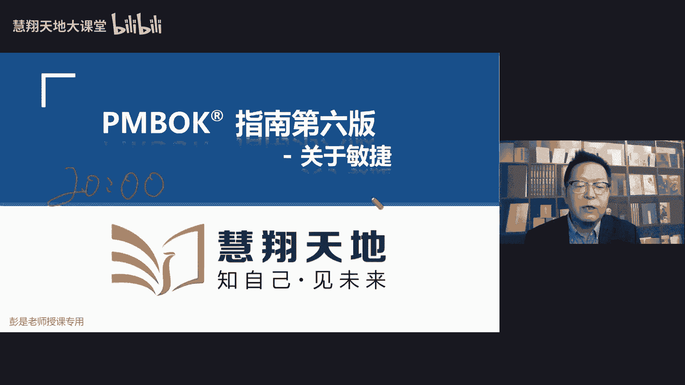
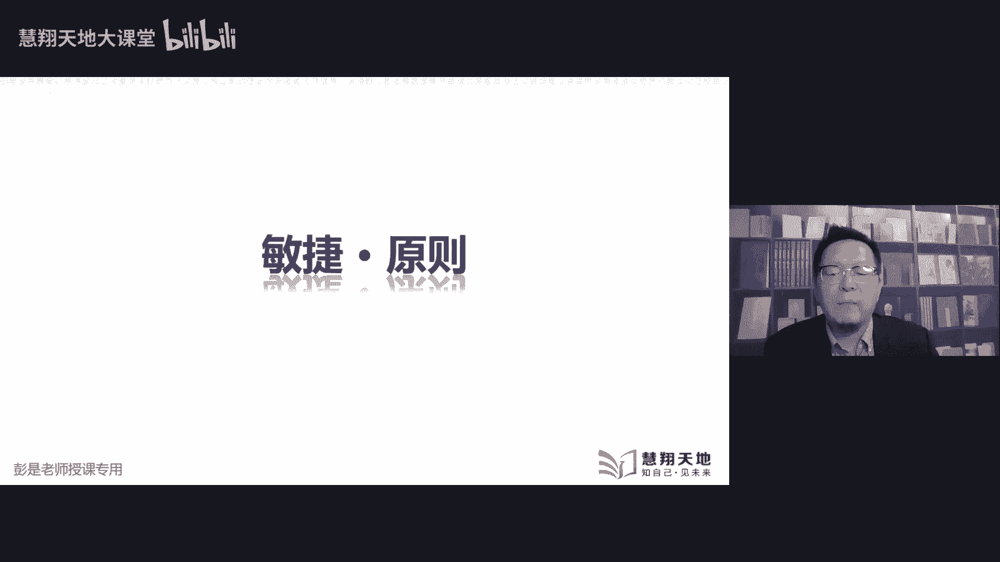

# PMBOK第六版&关于敏捷-VUCA时代／敏捷管理 - P1 - 慧翔天地软考 - BV1uj411d73A

就开始今天晚上的课程，不要自暴自弃，不要自暴自弃啊，过了震荡期了，号诶，知识点都抛出来哈，够了，震荡期不要灰心，不要灰心，还有等等等，算上手学不好，还有十十七天吧，18天还有18天呢，亲还有18天呢。

每天捞回来三分就50多个了，对不对，七八十分的同学不要焦虑，也不要焦虑，每天学三个知识点，每天捞三分也能到120，130的，可以的，对不对，越战越勇啊，好了，各位亲爱的同学，我们正式开始今天晚上的课程。

今天今天我们讲课还是干嘛呢，刷太多题其实没效果了，大家不知道各位各位同学有没有发现，不知道各位同学有没有发现这样的规律啊，现在好多同学应该基本上是这样一个状态，做题已经做蒙了，哎老师这道题为什么选A。

这道题为什么又选了B，看起来选项差不多呀，为什么看起来明明选项看起来差不多，差不场景也差不多，为什么为什么答案就不一样呢，所以呢今天今天我们说与其在题海里面去遨游，不如我们浪里边找点金子出来哈。

所以今天是讲课，今天是讲课，不做题了，不做题了，差不多了好了，那讲课，但今天我们是敏捷哈，所以给大家先回顾第一个重要的知识点，敏捷到底是为什么要用敏捷呢，就是解决乌卡这个讨厌鬼，不确定性，模糊性。

复杂性，未知的东西，就是因为变数多，在高度变化的环境下，范围不确定，需求不确定，所以呢为了迎合这种变化，我们采用了这种小步快跑的迭代方式，对不对，因为传统的方式是，我们把所有的需求把它分析完了。

然后去分析我们的产品服务成果，需要做成什么样定义范围啊，写好了范围，我们创建WBS，然后再定义活动，就得到了一大堆的活动清单，排排序，画个网络图，让张三李四王五赵六，按照我们的网络。

就按照我们的进度计划去干活，成果都产出来了，但是在敏捷环境之中，因为需求不确定，因为变化多，因为存在着很多未知的东西，因为复杂，为了解决这四个讨厌鬼，所以才有了敏捷的玩法。

我们不是一次把所有的需求都实现，我们干一点是一点，干一点是一点，这一定要记住这个核心的理念，对不对，干一点是一点，弄一个迭代办事项产出成果获得客户的反馈，再弄一个迭代代办事项，产出成果获得客户的反馈。

不断的把可可以使用的产品，要不断的把可以使用的产品让客户来体验，获得客户的反馈，避免我避免我们在错误的道路上越走越远，哎这就是敏捷最square那个最核心的东西，那今天讲课讲什么呢。

今天我们讲课讲课变成开放题，大家看到看到给足给大家抛出来的问题，能想到什么样的知识点呢，换一个玩法，团队目标或者是任务不明确，能想到什么东西，目标不明确，任务不明确，什么东西，目标目标，咱讲到传统项目。

传统项目里面那个东西，高屋建瓴，高屋建瓴，那个那个那个概念叫啥来着，章程吧，对不对，传统项目我们有项目章程，出章程，我们要告诉大家，为我们指明工作方向，里面有多快好，省范围，进度，成本质量。

告诉我们这整个项目的目的目标，总体要求为我们指明工作方向，那在敏捷环境之中，虽然变数多，我们也不能失去方向，大家做那个每日练习，有没有遇到过这样一道题，对不对，说为了解决短视的问题，为了解决短视的问题。

短视的问题是什么呢，是鼠目寸光，我们只研究自己这个什么产品，待办事项，迭代办事项，迭代办事项，迭代办事项，以此类推了啊，这就是短视，我们也需要有方向，所以团队目标或者是任务不明确，只要看到这样的场景。

你就找高建瓴，高建瓴呢我们这个关键词就叫章程，所以敏捷章程中，我们要明确关于目标的这一部分，包括预警啊，使命啊以及使命测试，关于现在课程这些单词，大家记不住的，没关系啊，使命测试就是怎么去分析。

我们达到了这个使命意志力推啊，总之最关键的关键词在前面记关键词就够了啊，章程章程章程章程章程为我们指明的就是方向，对不对，告诉我们前进的方向，告诉我们努力的方向，无论是在传统的预测型项目之中。

还是在这种新兴的敏捷项目之中，道理作用都一样的，道理都一样，为我们指明工作方向，要告诉我们目标好，第二个开放的问题是团队工作协议不明确，能想到什么呢，工作协议又是个什么鬼，看那章程了吧。

诶规则规则规则非常棒，恭喜各位同学答对了啊，如果如果回答不上来的同学，也不要焦虑，不要焦虑啊，回答不上来的同学，你现在至少学到了一个知识点，对不对，看到什么工作协议啊，就是大家怎么配合工作。

大家怎么配合工作，如何相互配合，这不是行为准则吗，行为准则再上升一个概念就叫基本规则，基本规则再往上找，我们那个专业术语就叫团队商场，所以呢敏捷章程中我们要关于一致性部分的，包括大家的价值观啊。

工作起来的什么原则呀，协议啊，协议就是如何做事情，如何做事情，是为什么要开回顾会，以此类推了所有的行为，包括会议的准则，沟通的准则，什么什么这种东西都放进去了，总之敏捷里面除了项目章程，还要有团队章程。

团队章程为我们指明指明这些行为准则，就约等于叫这个术语，基本规则，干活六关，干活的规矩，这玩意儿可不是建设团队的输出，不是建设团队的输出，那既然说到介绍团队的输入输出，这个东西还要顺便想一想啊。

团队章程对应的知识点，这个东西定的是越早越好，还是定的越晚越好呢，就讲了个大道理，规矩定的越早越好，还是越晚越好，早对不对，所以他肯定不是建设团队的输出了，没想到资源的一张建设条件，再往前找获取资源。

获取资源，再往前找公司活动资源，估算活动资源，再往前找，前面那个就叫规划资源管理，非常棒，所以呢这个管理过，这是规划资源管理这个管理过程的输出，因为规矩定的越早越好，避免大家产生不必要的误会。

不必要的误解，以此类推了诶，这是关于团队章程，第二个重要的知识点，第一个重要的知识点，它是我们的行为准则，包括了各种各样的基本规则，第二个事情是知识点，是这个东西定的越早越好，早立规矩，早立规矩。

规矩丑，话说在前面就这样想，然后呢，另外最后一个知识点，关于这个团队章程知识，这个东西也最好大家都参与其中，定规则定规则，我们还是要综合考虑各方的意见，不要项目经理一言堂好，这是今天第二个知识点了啊。

第三个知识点看看团队环境不明确，这事儿咋整，团队环境不明确，可不是可不是集中办公啊，集中办公解决的是啥问题呢，团队没有凝聚力，团队没有向心力，对不对，这种情况下我们考虑集中办公，这种看这种这种情况下啊。

什么叫团队环境变成大白话就是资源不明确，Z变成大白话就是资源不明确吧，诶好了，所以刚才各位同学达到了，达到了敏捷章程中关于环境的部分，我们要约定好边界，承诺的资产和前瞻性分析这三个词，大家记不住。

完全没关系啊，知道大道理就可以了，第一个大道理是什么呢，我们把权力的边界给他说清楚，PO负责做什么事情，开发团队负责做什么事情，敏捷教练项目经理，你们负责做什么事情，哎这个工作边界不就清楚了吗。

PO负责产品蛋白质项的创建和维护，你负责分析价值排序，对不对，开发团队交互团队，你负责想办法把这个需求变成成果，转化为成果，把它做出来，在制作的过程中，大家全都去基因协力，齐心协力，确保质量。

确保能得到一个可用的产品服务或成果，那敏捷教练你的权利权利权利干啥呢，你就保持保持这种服务性领导的风格，诶，虽然我们的整体大环境不确定对吧，那个变化需求范围不确定，但是我们关于团队的角色。

这是工作环境啊，这要说清楚，这要说清楚，因为在传统项目之中，大家提到了RACI非常棒，在传统项目之中，我们有了工作包，有了工作包，再往下细分，细化到了活动，那这个工作包大家的分工是啥。

这个活动大家的分工是啥，因为需求是固定的，所以我们可以提前分配RM和RACI责任分配矩阵，但是在敏捷环境之中做什么事，其实是不太确定的，相对来说不太确定啊，那在这种情况下，这些这些责任到底怎么分呢。

咱也不知道，那我们明只能明确这三个角色，PO你来搞需求，Po，你来搞需求开发团队，交付团队，你们最好变成一个通才，对不对，通才通才的自组织的成熟的这样一个团队，反正人家让干啥，我们都能干对吧。

人家让干啥，我们都能干，你们主要是负责产品的交互，开bug交互，然后呢，我们的项目经理，服务型领导，敏捷教练主要是创造环境，创造推进辅导，指导引导启发培训教育就那一大堆话。

然后承诺资产就是大家承诺资产啊，这个词其实翻译的不太好，承诺承诺更关注的是，既然环境不确定，希望大家最好最好能够专注它，其实背后对应这个单词，大家工作的时候最好最好专注，尽量的减少任务之间的切换。

最好专心致志的去做这个事情，对不对，因为我们要在极短的时间内把成果做出来，极短的时间内把成果做出来，所以希望大家最好能够达到一个专注，这样一个状态，要要要兑现，要要做出这样的承诺，然后前瞻性分析。

那就是既然环境不确定，需求不确定，我们要有前瞻性，就高屋建瓴那套东西了好了，第三个开放小第三个开放的小问题搞定了啊，这个问题超简单了，需求不明确，能想到这么咋整，好像刚才讲完了，需求不明确。

我们下面这是鼠目寸光的行为，就是不断的迭代和增量，不断的和迭代和增量来获得客户的反馈，那鼠目寸光上面还需要高屋建瓴，高屋建瓴，就是我们那些什么产品的愿景啊，路线图啊，发布计划呀。

哎最后变出来就是这就是这一这张图，这张图实际上在传在我们那个pm book里面，叫制定进度计划工具，敏捷发布规划，敏捷发布规划，关于敏捷在范围和进度的管理方法，与传统的预测型项目大相径庭，完全不一样的。

对不对，所以大家后面一定要去看，其实第一天上课就讲过了啊，看看范围内章的开篇进度，这一章的开篇，这两张在在整张前面那个概述那一大段，其实关于敏捷的游戏规则说的很清楚了。

然后再看一看制定运动计划里面这个工具，敏捷发布规划，把敏捷整个这个大脉络梳理清楚，所以呢最后总结出来就这么几个东西了，我们要帮助发起人和相关方制定产品的愿景，让大家至少虽然需求不明确。

但是方向不要失去方向，对不对，你要知道我们这个产品第一版，第二版，第三版大概是什么样，大概具有什么样的功能，然后我们可以考虑使用使用实例化的需求，用户故事地图和影响地图来构建产品路线图。

根据我们的产品愿景去分析我们产品第一版，第二版，第三版，第四版，每一版本它大概是一个什么样子，然后呢下面就是细化的事情了，我们让团队和产品负责人一起来，明确需求的期望和价值，为什么呢。

因为这么多的需求一定要去对它做排序，排序的时候一个重要的指标就是价值，什么东西价值高，什么东西价值低，对不对，什么东西价值高，什么东西价值低，所以这种这种这种场景的话，大家随便代入生活场景。

最后一定一定回去会用二随便带入到生活场景，去理解什么东西价值高，什么东西价值低，那现在我讲课讲讲，饿了，打算去餐厅吃饭，进门啊，人家说给你喝碗水吧，不渴，有没有现成现成的主食，先给我来吃一口。

我先垫一垫诶，这个东西这个需求对我来说目前价值最高，那餐厅就想办法，先把这个最有价值的东西交给我，对不对，不要弄什么酒水饮料，那个东西不解饿不解饿，就这个这个思路啊，所以我们要去对需求做排序。

分析什么东西价值高，什么东西价值低，PO来做这个决策，以价值为导向，优先考虑交交付最有价值的东西，然后呢，最后就是逐步把路线图分解为，具有更少具体需求的待办事项列表，就是从这个大方向。

我们把它细化细化到我们的产品待办事项列表，并且呢里面的这个需求需求，它最好规模差不多，我们要去评估每个需求，它的规模价值风险复杂程度来做排序，来做分分析，分析这些东西的优先级。

所以呢这最后最后就带出来那个会叫产品，待办事项，细化会议，细化会议呢又成为我们这个研讨会，署理会这个会就干这个事情，把这些需求弄得差不多，弄得差不多的规模，然后排排序就干这个事情，叫逐步。

为什么呢叫细化呀，它体现了我们渐进明细的这个这种方法好了，所以关于需求不明确，大概知道这几个思路啊，哎0477同学说的非常棒，最后呢关于需求，我们就把这个规模一梳理，就带出来那个那个那几个单词了。

最大个儿的需求叫史诗，然后比史诗小一点大特征特征，下面的就是我们的用户故事，它体现规模从大到小，史诗上面其实还可以有主题，还可以有主题，体现这些用户故事的规模颗粒度。

然后呢最后最后我们在迭代代办事项里边，以任务的形式来体现如何完成什么样的任务，这个需求对应的成果就做出来了，就是我们那个看板里面跟踪的那那一大堆东西，好了，这是关于需求不明确。

所以这一节课件非常非常重要，非常非常重要的，把这几个概念一定要给他搞扎实，再往下一个小问题，用户体验不佳，能想到啥，好像刚讲过，我也记不住了，用户体验不佳，用户体验用户体验用户体验能想到什么东西啊。

用户体验这玩意儿说不清，对不对，请一定要记住这个典型特征，用户体验这东西别人说不清楚的，我根本就不知道张三爱不爱吃麦当劳，我根本就不知道李四爱不爱吃肯德基，虽然我天天跟张三一起吃饭，我知道他喜欢吃啥。

但是他没吃过麦当劳，我不能带他去发发出这个声音，所以呢唉最后落落实到知识点，用户体验这种东西通常具有主观性，咱也不知道他喜不喜欢这个电影，咱也不知道他喜不喜欢这个电视剧，它带有主观性。

那我们一定要让客户来参与最后那个迭代评审，就这么一个知识点吧，所以前面就类似做过一道题，我不知道各位同学有没有印象啊，就是说说用户体验，用户感受，然后当时那个选项就是找客户参与，找用户参与。

所以开发团队的用户体验设计实践，我们应该尽早的让用户参与其中，尽早尽早让让客户参与其中，我们才能获得用户体验的反馈，对不对，您到底满意不满意，这个界面到底黑色好啊，白色好啊，红色好啊，对不对。

以此类推了，一定要获得客户的反馈，让客户持续地参与其中，别跑别跑，并且呢PO不一定这种情况下PO不一定，这就就他的意见不一定具有代表性了，一定要听听客户的心声，就这个基本基本这样一个重要的逻辑啊。

好了不一定要评审的时候还米小可同学，这个问题非常好，我们确定的是是需要在review这个会吧，一定要在review的时候让客户参与其中，但有没有可能在迭代过程中，就让客户参与其中呢，有可能有可能啊。

它其实背后对应两个知识点，第一个课后在我们产出成果之前参与其中，好不好呢，好好的可以帮助我们尽早的发现问题，但第二个问题呀，就是客户在成果出来之前参与进去，能不能给我们反馈到最终的体验呢。

不是一回事儿了吧，注意这个用词啊，成果都没做出来，记得吧，讲过吧，成果都没做出来呢，你让我体验啥，你让我体验啥对吧，这个菜还没炒好呢，写的写写字呼啦的，我体验不出来的。

所以呢敏捷敏捷在质量对那些那段就说了吧，质量是不可协商的，一定要做出一个可以使用的产品，只有这东西真正可以用，真正可以吃，客户才能去真正的进行体验，我们才能获得关于用户体验，用户感受的这种这种反馈。

好了，原型不行，原型是干嘛的，原型是干嘛的，想一想这个话题，原型是用来干嘛的对吧，我现在饿了饿了，餐厅说我给你炒个菜，鹏老师拿个照片，这是圆心法吧，拿个照片，您看看这个菜你想吃吗，我也不知道，我不知道。

感受不到，感受不到，它是用来确认需求的原型法，它的主要作用是用来确认需求，但是关于用户体验，它不一定让我能够体验得到，对不对，用户体验这方面的需求，它不一定不一定能够确认的，只有真正的东西，真正的成品。

我们才能才能真正的去体验它，好了，再往下看看下一个小话题，唉估算不准确咋整，估算不准确，估算不准确，咋办呢，怎么破，类比啊，敏捷里面没有类比啊，把类比换一个词，换一个词就对了，咱现在讲的是敏捷环境。

不是不是那个预测性项目，预测新项目可以考虑自下而上，预测型项目可以考虑自下而上啊，但敏捷里面其实也有类似的，类似的这种这种方法，只不过不叫自下而上，这个攻击技术叫什么呢，这是刚刚才给大家说的。

这个估算不准确，我们估算的对象，大家先达成共识，估算对象对象是什么来着，故事，故事吧好了，故事太大了，就容易估算的不精准，所以呢我们这些故事才有了那个层级吧，主题主题太大了，估不准呐，史诗史诗太大了。

估不准呐，特征特征太大了，估不准呐，哎用户故事达到一定一定，一定一定合适程度的颗粒度，所以才需要对我们的故事做分解，把大故事拆成小故事，虽然从字面意义上来说，它是一种自下而上的估算方法。

但敏捷里面我们叫千万不要选这个词啊，没有这个工具，没有这个工具，所以第一个叫分解，把大故事变成小故事，那第二个就是刚才各位同学说的，类比估算这个意思，但我们不用类比估算这个单词，我们用的什么相对估算。

对不对，也不是说估算啥，我们信，我们现在只能估算故事点，相对估算诶，在敏捷环境之中一定要找，一定要找这样的术语啊，我们虽然这种估算方法也可以称之为类比，但我们称之为相对估算，就想拿那几个估算方法。

什么扑克敏捷扑克，扑克游戏，先把什么咖啡杯估算T恤估算这种估算方法，我们找一个参照物，比如说这个需求，我们大家打打，大家一致认为他的故事点是一点，然后呢第二个需求和第一个需求做比较，大家出牌，大家出牌。

看看他的故事点是什么，三个五个八个十个非文达建筑列，以此类推了，叫相对估算好了，所以全打开了啊，所以就这么三个知识点，第一我们通过分解让大故事变得更小，变到我们可以合理的估算它的规模。

因为太大的故事太大太大的故事，第一我们实现它的周期比较长，周期长，成本就高，周期长成本就高，所以我们希望把这些故事切割成，切割成比较合适颗粒度的小故事，第一我们成本低，第二呢估算起来比较容易。

然后第二个是让整个团队使用相对估算，进行估算，就是我们的什么咖啡杯T恤这种这种东西，找找一个参照物，然后考虑考虑通过敏捷建模，或者是刺探来理解故事，刺探能想到哪个单词，这个单词最好记英文探针嘛。

来SPE不是spring sprint，是迭代spike s p i k e对吧，如果觉得没把握，如果什么看到什么高风险新技术拿不准没把握，就探探口风试试试一试，试一试，对不对。

如果觉得一个需求可能规模呀，复杂程度啊，创新程度啊，我们都没把握，没把握没把握给出一个合理的估算，没把握能够实现这个需求吗，我们只允许大家去刺探，去试一试，去试一试啊，它是用来用来解决这种不确定性的。

因为像创新啊，规模大小啊，打不准啊，没注意啊，都试一试，都试一试，鼓励团队去进行尝试好了，死亡边缘无限试探，说到啊，就这这这个大道理就可以了，好再往下看看下一个小话题是什么呢。

工作分配或者是工作进展不明确，建模啊，就是跟那个那个圆形法，圆形法建建模型，出个demo，可以什么抛弃型的原型啊，或者进化型的原型啊，也来解决需求不明确这种问题的好，回到这个这个知识点啊，工作任务。

工作分配或者是工作进展不明确，怎么办呢，想到啥说得准确一点啊，什么东西能够让我们知道每天的情况呢，什么东西让我们知道每天的情况呢，什么东西让我们知道这些这些活儿，大家谁在干什么呢，对不对。

就变成了who啊，写字写不上了啊，我就说了啊，互在做我的粗暴理解，就这东西吧，工作分配，工作分配就是互在做我的，谁在做什么事，谁在做什么事情，可以在通过什么东西让我们看到它呢，然后工作进展完成了啥。

打算做啥，工作中有没有遇到问题和阻碍，所以其实这两个东西总结出来，最后变质变成那个词了，叫过程，过程可视化，过程可视化的东西就两个字，两个字，一个叫看板，于是敏捷时间里面就提出这两个东西吧。

让我们知道大家都在忙啥，让我们知道整个团队知道整个项目的情况，第二个是通过看板，能够让我们对过程，对任务它的流动情况达到一个可视化，这样一个状态，可以及时的发现哪儿都哪儿，任务多了，哪任务阻塞了。

对不对，张三在做啥，李四在做啥，什么东西在测试什么东西在开发哎，这这两个东西啊好，所以带出来第一个工作任务，工作分配，工作进展不明确，我们要帮助团队认识到，他们要自己去管理这个事情，怎么自己管理呢。

第一个通过看板面板来查看工作的流程，大家勇于把我们每天在做什么事情，把它可视化，把它透明化，把它可视化，把它透明化，张三你去领任务，李四你去领任务，还意思累推了，然后呢。

会根据看板能够查看到整个工作的进展情况，完成了什么工作计划做什么事情，张三这活儿干了几天了，这活儿干了几天，该流动到下一个环节，但是现在没有流动下去，出现了阻塞，张三接到的任务太多了。

以色列这样就总之大大方向，就是这些东西加到一起，让我们能够做到过程可视化，过程可视化就做到了透明，透明呢我们就会及时的尽早的发现问题，及时的尽早的发现问题，这里面不涉及到敏捷环境中的RACL了啊。

预测预测型里面的RACL不要混到一谈，不要混到一起，分开说分开，说明天环境是自组织任务，这活到底谁干，咱也不知道，谁把这个任务任务领走了，我们才知道这活谁干对吧，所以叫拉动式精度进化呀。

那我们就没有办法预先制定RACI，责任分配举证，对不对，提前制定好RAMRACI，这是分配任务啊，现在是大家领任务好，所以带出来这两个非常非常重要的事件，一定要记住它最重要的作用过程过程可视化。

让我们以便于我们及时的发现问题，对不对，发现问题，发现阻碍敏捷，所有的游戏规则，我们的目的都是对事不对人，尽早的发现事情有没有问题好了，那团队面临障碍，团队面临障碍啊，阻碍呀，这种东西这种东西咋整。

这这事儿找谁，这事儿找谁，谁来扫清障碍，谁来扫清障碍，对吧，找服务员记得吗，找服务员对不对，所以大家比如说咱咱咱各位同学，咱们所在的微信群里面，班主任不就是我们的服务员吗，对吧。

给大家默默无闻的奉献奉献，他的时间来做服务好了，不讲不讲知识点，然后再在里面天天聊八卦，对你们的学习产生了阻碍，产生了障碍，你们就找服务员投诉去了吧，唉班主任就负责替大家排除我这个阻碍。

所以此类推哎仆人是领导，普洱市领导能够消除这些障碍，这些阻碍，如果团队不知道他们都有哪些可选方案，就要考虑聘请教练，聘请教练，聘你，聘请教练的目的，是给大家关于选择什么样的方案做指导辅导，启发引导。

这里面的选择方案可不是技术方案，而是敏捷的这些这些实践方案对吧，要不要结对编程啊，要不要用SRAM呀，要不要用看板的，以此类推，然后有时候团队或者是仆人式领导，无法消除障碍，团队就需要上报故事。

这个我们在按摩的时候，这个这个原则其实也也考到了叫什么来着，问题升级问题扔你吧，如果通过题目的描述明确的告诉我们了，说这个事儿啊，我们可能超出了团队姐姐解决权利的边界，我们搞不定了。

就上报和那个风险的上报，这些大道理都一样，总之解决不了的事情，我们就可以找管理层，但原则上是没事，尽量的不要找管理层，对不对，作为一个项目的项目经理，我们还有职业道德，那想办法。

积极主动解决项目中遇到的问题和困难好，就像小葛同学说的非常棒啊，像办公室政治这事这事我们就搞不定，对不对好了，所以面面对障碍，面对障碍，普人士领导不代表着不干活，不代表着什么事都不干。

我们还是要创造环境，消除障碍，然后这个领导是PO不是square master吧，唉这同学的问题就怎么说呢，就该听课，该看书了，PO搞不定这个事情，PO不干这事，不管这个事情了，PO和我们的开发团队。

他是仍然是在项目经理之下的，仍然是在项目经理之下的，对不对，项目经理啊，敏捷教练啊，仆人式领导啊，团队促进者呀，看看书看看书，PO不管搞不搞不定这个事情好了，再往下啊，下一个小问题叫什么呢，啊。

由于产品待办事项列表不够完善，导致工作延误或超时，这是找谁呢，这个显而易见，刚才说刚才说刚和诶和刚才同学那个问题，刚好刚好刚好就呼应上了，刚才问出那个问题的同学看一看，现在这个这个小问题。

这事找谁消除障碍，如何找敏捷教练，找项目经理，那产品待办事项列表出了问题，出了问题找谁呢，注意用词啊，不叫产品经理，产品经理是公司的职务，公司的工作岗位，项目上的这个角色叫，比如产品责任人，产品负责人。

Product owner，Product owner，所以产品他们是张列表不完善，导致我们工作延误，超时就找PO，他有这个责任和义务，这这这个锅这个锅就甩给他就可以了。

所以呢产品负责人和团队一起研讨故事，这话没毛没毛病吧，所以大家后面看看看教材，看多了的话，你就会发就会发现，其实在每年环境之中，大家基本上都是合作，对不对，虽然说PO可以创建和维护产品蛋白石项列表。

但是团队不参与他自己干，自己干也挺累的哈，大家合作起来，这个事情可行性更高，只不过产品蛋白，生肖列表里面的价值优先级，这种东西是PO做决策，注意这个用词哦，所以通常就是能合作的尽量合作。

只不过在某些环节，某些节点，某些人做决策而已，和传统的预测性项目讲的那个知识点一样的，智力项目章程谁爱写谁写，完全就不重要，但是呢章程的内容一定是发起人做决策，对不对，所以看到什么目的目标不明确。

要找发钱，他做主，他做主，咱做不了这个主，以此类推了，所以PO和团队一起研来研讨故事，做故事的梳理，因为我们要团队要估算故事的规模，他那个估值估算估值的规模，对不对，这玩意儿离不了开发同学的。

所以呢大家合作创建和维护那个产品，大概市场列表，但是里面的优先级一定是PO做决策的，然后为故事创建一个准备就绪的定义，这个其实基本上不大会考看到准备就绪的定义，这个单词大家应该能想到一个缩写啊。

一个缩写两个缩写哎，非常棒啊，手机尾号一直发的同学非常厉害，一个叫DR，一个叫DOD，能想到DR的同学，你们给我惊喜了，给我意外了，很厉害很厉害，DOD是验收标准吧。

Definition of time，已完成标准，DOOR呢就是准备好了标准，准备好的标准就是粗暴理解啊，我们这些小需求小需求，一个一个的用户故事，有的用户故事可能缺少一些重要信息对吧，就变成大白话。

就有的需求还没写清楚呢，有的需求还有问题呢，那它就不符合DOR，没有没有准备好，没有准备好啊，没有准备好的东西，我们就先不做，我们就先不做，所以definition of already，这就叫DOR。

Definition of done done，就是已完成的定义，一头一尾一头一尾，所以definition of，只有准备好的东西才能进入到，进入到我们那个看板里面，进入到看板里面，我们才能去干它。

否则呢他没准备好，我们就这活儿就不能干了，不能干了好了，所以呢我们每一个故事，都应都应该有一个准备就绪的定义，还有一个DOD还要有一个已完成的标准，这一定要明确这两个东西如果不明确，这活儿也没法干。

然后呢不完善有可能就是考虑他不完善，不完善可能就说明有些信息，有些信息不充分，不对吧，不充分，那就考虑拆分分解这种方法，不管在任何一个知识领域，不管在敏捷还是在预测，都是非常非常最底层的那个逻辑。

因为分解可以降低事物的规模，可以降低事物的复杂程度，这是大事化小，小事化了，这个大道理好，所以可以考虑把公式做进一步的拆分好了，这是关于不知道第几个了哈，下一个下一个看看，往缺陷，看到缺陷能想到啥。

其实刚才好像也说过了，质量哈，质量问题改进，但这里面这里面的缺陷啊，它其实其实有，又写不上字了，它实际上是有特指的，大家什么改进啊，这种东西都叫纠正措施对吧，纠正措施工作出现了失误，要纠正措施。

这里面的缺陷其实对标对标的，大家我们做了这么多题，需要对几个单词有印象，需要对几个单词有印象，理解不理解根本就不重要，这几个单词是什么呢，还记得测试测试驱动开发吗，还记得测试驱动开发这个单词吗。

还记得什么什么极限编程结对编程吗，不记得了不记得了，所以需要各位同学记得记得记得记得，就这玩意儿，所以我们要考虑特定环境有效的一些技术，技术层面的实践方法，因为它带有带有这种局限性吧，我就这么写了啊。

既然是技术层级技术层面的实践方法，所以它带有局限性，带有局限性的意思是说其他行业的同学对的，比如说不涉及到软件开发行业的同学，你可能听不懂，可能听不懂，可能不知道，所以呢他考备考到的概率比较低。

但是呢我们大概要知道它的中心思想，就可以了诶，重构技术债务，对同学提醒的非常好，对不对，说技术债务还有印象吗，技术债务，技术债务粗暴理解就是头疼医疼医头，脚痛医脚，拿拿拿男的，拿拿大棒子打一下我的胳膊。

哎，胳膊疼痛感超过了头疼，头就不疼了，这就是一种临时的解决方案对吧，因为我们要快速的把成把成果做出来，那在软件开发中或者是盖房子的过程中，可能大家会考虑采用这种折中的解决方案，它不一定完美。

有可能有瑕疵，有缺陷，可能不稳定，那这种债务这种债务积累的多了，积累积累积累的多了，早晚要还的，所以呢他对标的那个专业术语，这叫重构，资料要重构对吧，唉欠下的债早晚要还重新收拾收拾。

所以呢关于敏捷里面这几个比较专业，有专业知识的单词，大家需要有印象，大家需要有印象啊，他们都是来解决质量缺陷啊，这种问题的，像结对工作，好像昨天刚讲完吧，还是前天啊，记不住了，解决编程。

就是说它最主要的作用，就是让两个专家一起来干活，就长粗暴理解两个专家一起来干活，两个专家结对来工作，这样呢张张张三干活的时候，李四看着李四干活的时候，让张三看着，确保过确保过程的质量。

另外呢它可以顺便用来做老带新，然后集体的叫产品，集体负责制，说的是什么呢，就是在敏捷环境之中，质量是什么呢，全员参与，全员参与质量管理，大家一个都跑不了了，唉这叫集体不得志。

还记得pm上其实有明确明确的指出，在预测型项目之中，我们通常可能是专职成员来负责产品的质量，来负责我们的项目的质量，在敏捷环境之中，我们是全员参与的，全员参与，然后呢。

可以考虑采用一些敏捷里面一些特定的实践，叫测试系统方法呀，什么自动化测试啊，唉总之来帮助帮助我们尽量的减少缺陷好了，这是这几个单词要熟悉就可以了啊，呃节点工作，然后大家全员参与测试驱动开发。

测试驱动开发，还有什么技术，债务重构，有印象就够了，他怕被考到的概率比较低，因为它有局限性啊，好绝对工作是什么，讲过了，绝对就是那个X4P编程，极限编程里面的里面的一种方法，结对编程，结对工作一样的。

张三敲代码的时候，李四在旁边看着，看看他敲的代码有没有问题，李四敲代码的时候，张三在旁边看看，以此类推啊，好了，那工作没完成，咋整活没干完，活儿没干完，大家快速的搜索，回顾一下你做过的题，做过的题。

工作未完成，工作未完成，这个小问题放到这儿啊，不是说活没干完怎么办，是说工作没完成，工作没完成，我们要把完成不完成这个事先说清楚，他其实想说这个书上，书上写的那个那个记得那个那个原文不太好，所以这地啊。

这地儿这地儿给出的答案不是不是大家说的，扔回产品蛋白石项，不是这个知识点，是说工作完成没完成，到底什么叫完成，什么叫不完成，我们要把这个事儿说清楚，我们要把这个事儿说清楚。

所以呢团队来确定故事完成的定义，就是刚才说的DODDEV定性蛋，我们要把要把已完成这个规则先说清楚，要把已完成这个东西规则先说清楚啊，它主要就是包括验收标准，什么情况下这个东西已完成。

这个东西验收能不能验收通过，这东西一定要说清楚，因为已完成的验收通过的才能让客户去体验，尽量的避免外部失败成本，对不对，质量不可协商，不可调和，另外呢还要为项目补充我们的发布标准。

发布标准这个单词也有印象就可以了，什么叫发布标准呢，就是什么东西，什么情况下这个东西可以发布了，发布就是对外宣布吧，就这个意思吧，唉所以这些东西最终一头一尾，关于用户故事的什么，准备好了没有。

完成了没有它的价值，它的优先级，这玩意这玩意儿都是PO做决策的，然后才是后面大家一个知识点，如果我们在工作中真的活没干完，真的活没干完，没有达到DOD标准怎么办呢，扔回产品那办事项，扔回产品。

蛋白事项才是大家刚才说的那个东西啊，好然后关于发布标准，好像我也不确定讲没讲过了，大家这个单词有印象就可以了，现在基本上没咱偏僻，应该也不大会考，叫发布火车吧，讲过吧，发布火车，发布火车就想火车地铁。

他这个工作的特性，就想这个东西工作的特性，它是不等人的，对不对，到点就走，到点就走，火车飞机地铁，对不对，到点就走，所以呢我们在敏捷环境之中，如果是多团队敏捷，我们可以考虑弄一个发布火车。

看看各各个团队，各个团队你们有没有好，有没有准备好一些可以发布的东西，如果有好，我们打算发布，打算发布，你们就上车，如果没准备好，如果没准备好，就下一次再说，下一次再说，好了知道这个意思意思就可以了。

这个东西刚才讲过了吧，技术债务，看到技术债务能想到什么呢，你刚才说的那个最关键的最关键的就是重构，对不对，重构然后什么测试驱动开发呀，什么什么自动化，自动化学那些东西，它带有专业知识，所以了解就够了啊。

这玩意儿了解就可以了，大家记不住，完全没关系，变成没关系啊，考的概率比较低对吧，重构债早晚要还的，找时间找时间重新收拾，收拾就是叫重构，然后建模建模，其实建模建模这东西大家可以完全物理到，太专业。

不是什么什么测试啊，自动化测试啊，测试驱动开发呀，有印象就够了哈，他最有可能出的这个单词就是叫就叫重构，总之这一大堆东西都是解决质量问题的，技术方面的质量哈，好再往下，产品复杂性过高咋整呢。

产品复杂性过高，产品复杂性过高，分解分解分解分解分解到最后中心思想是啥，化繁回减吧，降低这个东西的规模，降低这个的这个东西的规模减少对吧，减少这个东西的复杂程度，所以呢制造出来一个单词叫什么来着。

我们先做一个可以用的，可以用的可以用的这个东西，MVP非常棒，我们要化繁为简，化繁为简，先做出来一个可以使用的东西，让客户看一看，可以使用的东西叫最小可行性产品，最少有价值的产品，就这玩意儿。

所以就带出来这么一个大道理，无论是软件项目还是非软件项目，我们应该且行长鼓励团队去思考，最简单的有效方法是什么，并应用简洁及尽最大可能减少不必要的工作，这是一门艺术，这样一个原则。

这样呢有助于降低复杂性，所以MVP产品大家如果还不熟悉的话，就看一看你手机里的微信，看一看你手机里的微信，如果我们打算做一个做一个差不多的产品，有必要把微信所有的功能全都给他全做出来吗。

万一做出来人家不不不喜欢用怎么办，对不对，就是这个道理吧，我们先做一个最小的最小的让客户能用的东西，比如能聊天啊，能发语音啊，能发表情包啊，甚至可以没有什么视频号，公众号，没有那些复杂的，乱七八糟的。

用不上的，我们把这些不必要的东西把它砍下去砍下去，唉所以分解分解分解分解完了之后呢，化繁为简，把不必要的东西去掉，轻装上阵，轻装上阵，先做出来一个可以使用的东西，让客户去用，让客户去用，不追求大而全。

我们追求小而美，记住这个中心思想，不追求大儿全，我们追求小的，这不是简简洁的吗，小而美，小而美，这个东西可以使用的，可以使用的，好了它不一定适合于不和，不一定适用于你整个工程项目。

但是在你工程项目中的某些环节，某些某些环节里面，肯定适用思考去思考这个事情，其实大家在实践中，在工作中，各行各业都有用到敏捷这种思维方式，对不对，工程图表就可以了吧，所以像像图表这种东西给大家有工程。

应该有工程工程的同学在在在听课啊，所以给大家粗暴理解一把，比如说比如说甲方那边要盖楼盖房子，我们说我们这个小区啊，一共40栋楼，我们希望每一栋楼都不太一样，每一栋楼都不太一样，什么什么。

这个是罗马式的风格，那个是什么欧洲的风格，以此类推了，那在这种情况下，你是一次把这四十四十张图全画出来吗，一次把40张图全都画出来，万一客户不喜欢，万一客户不喜欢，失败的代价非常高，那怎么办呢，敏捷呀。

对不对，画一张图，您看看画一张图，您看看，这不就是敏捷式的这种思维方式吗，迭代和增量，迭代和增量来降低失败的失败的可能性，降低一次交付失败的可能性，所以其实大家不一定整个项目都在用敏捷。

但是你工作中或多或少，某些环节肯定在用这种思维方式，想了一个大道理啊，好了看看这道题，团队合作过程进展缓慢或者是没有改善，唉大家现在吃一堑长一智，吃一堑长，这这用不到集中办公，看到没有凝聚力。

没有集体感，没有归属感，觉得孤单寂寞冷，再考虑集中办公啊，再考虑集中办公，现在原因不明，现在原因不明，为什么进展缓慢，为什么没有改善，所以找原因就想到唉，回顾回顾，回顾就这个单词带出来了吧。

所以我们要通过回顾会回顾的是什么呢，就是我们这一次迭代，这次迭代的过程，大家在过程中有没有遇到问题呀，阻碍呀，有没有有没有遇到一些问题，阻碍回我们这个过程，这次迭代的过程哪些差距啊，缺陷啊，不足啊。

最佳实践啊变成大白话，就是看看什么地方做得好，看看什么地方做的不好，有则改之，无则加勉，有则改之，有则改之，所以呢我们要提出一些改进的措施和建议，定改进的小目标，这些东西这些东西也不建议太多。

把改进的目标放回我们的产品待办事项好了，所以呢普人士领导就是帮助大家学习，怎样整合这些带感影响，所以大家做题的时候就看到有一些回顾，会回顾会普洱市领导该出手也要出手，可以提出我们的建议和见解。

因为呢我们要帮大家想办法，不断的不断的改进，改进的目的是为了让我们的绩效达到达到稳定，让我们的团队走向成熟，为了项目的技巧，哎所以pd c a这种这种大道理普遍适用的啊，价值流图，价值流图不在这。

用价值流图更关注的是监控发现透明，需要改进的就是很多呢看情况，二八同学一定要活学活用，活学活用，对不对，看情况看情况，看情况，改进的措施放回产品待办事项，放回产品的卖事项。

然后呢再根据我们下一次迭代规划的时候，在分析什么东西价值高，什么东西价值低，不是改，不是不是对产品做优化，产品是是结果，大家现在关于这个基本概念还分不清了，一个叫结果的质量，一个叫过程的质量。

结果的质量是我们那个review这个会评审会搞定了，过程的质量，关注的就是我们这个real，虽然说pet这是回顾会，他关注的是改进过程，改进过程优化过程好，再往下拉啊，看看下一个话题是什么玩意儿呢。

前期工作过多导致返工，工作过多导致返工，这就是传说中的什么呢，你在这评啊，好了各位同学答对了，就是这个w IP work in process，一定要记住这个缩写啊，Ww i p w i p。

再吃品限制多不一定是好事，贪多嚼不烂，记这个中心思想，对不对，贪多嚼不烂，贪多嚼不烂，所以记住这个其实他们都嚼不烂，这个这个道理不用讲了吧，就像我现在我现在讲课讲饿了，我要吃汉堡，一次买十个汉堡。

万一我吃俩就饱了，剩下八个就浪费了，剩下八个月就浪费了吧，唉有多大能力干多少事，有多大肚子吃多少汉堡，就这个思想，就这个思想对不对，小步快跑，小步快跑，所以不要不建议不建议承担太多的工作。

所以不要做过多的前期工作，而要考虑让团队通过刺探来学习，另外在项目开始时，我们要衡量再制品，看看哪些部分团队并不需要设计，只需要交付价值，另外呢我们要缩短迭代期，并创建一个稳健的完成的定义。

因为缩短迭代期，迭代周期越短，我们的成本越低，成本越低，试错的代价，试错的代价就越小，就越想，总之总之这段中心思想就是轻规划，重探索，记住这个记得这个原则吗，花了大量的时间精力去做规划。

最后呢一旦有了变化就白玩了，那不如先把东西尽快的做出来，先把东西尽快的做出来，所以我们这个time box，时间和迭代周期尽量的尽量的要短，通常两到四周对吧，甚至可能是一周，甚至可能是一周。

然后呢不要贪多，嚼不烂，我们要在我们的每次迭代里面设置暂时平，限制好了，就这么一个东西啊，请规划重探索，通过刺探来学习，对不对，然后我们要设置代制品限制，然后考虑迭代周期不要不要太长。

时间和不是不能变吗，这就是断章取义了，亲0917同学，时间和不能变，我们现在在规划这个原原画是在迭代的过程中，不能不能改变这个时间和它不是一回事儿了，看看哪些部分不需要设计，减少设计。

设计多了也不一定是好事，得看看哪些东西啊，能直接直接干，就先把它干出来再说，还是在说清规划中探索，不一定要标准化规范规范化的去设定的，不一定要标准化规范化的，大家做过这样知道好像这样一道题吧。

说有个人用用一个什么什么规范，给你提供了一个文档，然后什么什么适用于哪个敏捷原则，不一定规范化标准化，甚至可以，比如说像产品设计，甚至可以用手画草图也可以呀，对不对，好了，那错误的开始，前功尽弃。

稳定迭代适用吗，你的稳定迭代指的是什么呢，能不能把话说完整的清，错误的开始，错误的开始就是传说中的，在错误的道路上越走越远，所以呢我们这个方向方向对不对，要解决那个短视的问题。

短视的问题我们要有长期的规划，愿景路线图，就那玩意儿了吧，愿景路线图，愿景路线图不要一开始就做错了，用户明明要一个要一个什么什么淘宝，京东拼多多这样的电商软件，你上来给人家做一个做一个小合同。

这就不对了，这就不对了啊，所以呢关于需求啊，关于什么什么商业分析呀这种东西对吧，商业分析师这样的就是PO，让产品负责人成为团队不可分割的一分子，与分子一份子好了就离不开PO，离不开PO对吧。

到底要做什么，什么东西价值高，什么东西价值低，MVP产品到底包括什么样的功能，这玩意都要PO来定的，对不对，都要PO来决策的，所以它不可分割不可分割，所以其实大家之前做过好多道题啊。

说客户有个客户找成员来反馈需求，然后当时PO说这事不要离开我，我们站PO站PO，PO说的没错，PO说的没错呀，所以看到什么需求，看到和客户接触都找PO都找PO，不要跳过它，大家做了好几道题吧。

说有PO没时间没时间参加什么迭代会，我们要确保PO有时间参加那个会理了，你不行啊，离了你，我们整个缅甸团队玩不转，那就这个思路啊，好再往下拉看看下一个小话题是什么玩意儿呢，产品代办事项列表杂杂杂乱。

无序找谁PO不是老大，PO是老二，这张粗暴理解项目经理才是老大，权利可以可以转移，但责任出不去啊，记住这个中心思想啊，权利可以转移，责任出不去的项目经理还是要背锅的，产品代办事项列表杂乱无序。

那我们就想办法排排序，对不对，我们就想办法排排去，就这个就这个知识点，所以我们要对它里面的东西按照价值做排序，就粗暴理解，应该不知道他有没有做过这题，我都记不住了，一个故事点。

一个一个需求是五个故事点赚十块钱，还有一个需求是四个故事点赚十块钱，我们先做哪个需求呢，你就这么一出就这么一出啊，第二个故事可能一个故事点约等于赚二块，两块五，第一个故事点一个一个第一个需求。

一个故事连转两转两块，我们先做第二个，先做第二个，因为赚得多，因为赚得多，这个知识点又能掌握，第二个就是排序的方法诶，非常棒啊，拉面同学排序的方法，一个叫卡，那我模型，一个叫莫斯科方法都讲过了吧。

卡农模型基本需求期望需求，意外需求，什么无差异需求逆向需求，这需求做排序的，莫斯科呢就是必须有应该有可以有，不能有对需求做排序的唉，大概这样粗暴理解规模价值，对需求排排序，对需求排序。

知道这么一个重要的事项，然后像CD3这种东西，CD3在敏捷和在在在PMP考试不考，这么写的东西，敏捷里面反而要考ACP考试要考，咱可以可以忽略掉这个知识点，考虑延迟成本，持续时间和其他其他价值规模划分。

这是除了除了价值，除了规模，还要考虑那个排队时间周期时间这种东西，制造业制造业的同学你肯定知道好了，其他价值模型就是卡诺模型，莫斯科莫斯科方法，然后再往下下一个小话题看看啊，仓促等待不均匀的工作流程。

能想到什么玩意儿，这也讲过了吧，还持续稳定的输出，持续稳定的输出，所以它其实背后的底层逻辑啊，就是不管是敏捷呀，还是不管是跨吧，还是看还是看板中心思想都从这儿出来的，经济思想经历思想。

还friend t同学说的非常棒，终于把这个词看到了，叫杜绝浪费，我们这些游戏规则，最中心的思想就是想方设法地消除掉各种浪，背哇，这个字不会写了，消除浪费，消除浪费唉，精一把大浪费吧好了。

所以我们计划要应要对应团队的能力，而不是超出能力所及，计划要对应团队的能力，而不是超出能力所及，我们在开迭代规划的时候，一代规划会是根据团队的交付能力，来把需求搬过来吧，绝对能完成100个故事点。

我们搬过来搬过来，宁缺毋滥，宁可小于100，也不能让它大于100，因为贪多嚼不烂，因为贪多嚼不烂对吧，如果如果任务过多，就会积压，任务的积压就是一种浪费，对不对，干不完，干不完就是浪费了。

根据团队的交付能力，WIBIWAP更侧重于在看板中，指的是每个泳道，每个环节我们要设置暂时屏限制，开发人员只能接三个任务，测试人员只能接五个任务，我们要设置设置每个环节，每个环节他都在单制品好了。

然后要求人员停止多任务，为一个团队专注工作，刚才也说过这个东西了吧，要专注要专注，要专注，尽量的减少多任务之间的切换，因为多任务之间的任务切换也是一种浪费，也是一种浪费，浪费时间，对不对。

尽量的尽量的尽量的，专心致志地为我们这个项目工作，为项目所服务，并且呢大家领取任务，领取任务也不建议领取太多，记得吗，说讲的看板的时候，说张三今天说我这个任务完成了，我打算再领取一个新任务。

张三把任务放到开发完成之后，他打算领取任务，也不建议领取太多，通常每天一到两个任务就差不多了，因为呢尽量的减少你领领了太多的任务，你可能在多任务之间，就存在着切换的这种可能性。

这不我们要想办法降低这种可能性，领完一个是一个，领完一个是一个专心致志，专心致志啊，消除这种狼狈，然后呢请团队利用结对编程，群集啊，群体开发等方法平衡整个团队的能力，就是这种老带新就是说的吧。

顺便可以老带新结对编程，确保这个声去把这个这个生产过程的质量，让我们做好一次，把这个东西做出来，因为返工也是浪费啊，返工也是浪费，让大家让大家平衡整个团队的能力，是让我们能够做到稳定的。

持续的可靠的输出，OK了，所以这是关于消除浪费，来自来自于精益思想，精益求精，精益求精，消除各种各样的浪费，等会儿啊，我看看看看几点了，20。58好休息，正好讲了一半，还有还有后面后面还有第二小班。

今天预计下课时间应该是十点，目测是十点啊，说不准有可能不一定最乐观时间9。50，最悲观时间和上次课一样，10：30最可能时间是十点，那我们现在来个重大利好，现在是，8。59，我们休息，等等啊，数学不好。

休息到21。067分钟时间，7分钟时间，好了，各位同学准备啦准备啦，第二小段课程即将开始了，课件可以发吗，稍后揭秘，稍后揭秘，稍安勿躁，不要着急，先专心听，专心听啊，对吸烟有害健康，刚才那位同学说。

7分钟，8分钟取决于鹏老师在家还是在教室的同学，你把这心思用到学习上，这个这个分析过程，这个分析的这种思维方式去用到学习上，相信你肯定是3A了，好了，各位同学回到回到回到课堂上啊，我们继续往下讲。

看看下一页是什么玩意儿，下一页是什么东西呢，看，看相关方要求无法满足咋整，这个话题其实挺大，其实挺大家注意用词要求和需求不一样，要求和需求不一样，对不对，这会儿这会儿应该找谁呢。

许久找PO要求这个话题多大了吧，所以呢说是提倡这叫仆人式领导，因为涉及到外部接触面了，普洱市领导和这个相关方一起来合作，面对问题，解决问题就是这个思路吧，唉那如为什么用书上又写了，叫可能是产品负责人呢。

因为如果涉及到相关方的需求，关于我们产品服务成果的需求，这活就找PO其他方面的要求，其他方面的要求，我们是还是普通市领导，服务型领导要出面的，对不对，好了，知道这个中心思想就可以了。

需求涉及到产品服务成果的需求，肯定是PO的，PO是客户的代言人呢，那其他方面的事情还是要还是咱服务，咱项目经理该冲还是要冲的，帮助团队扫清障碍，干这个事情，他属于团队的工作外部环境之一。

那看看这个意想不到或者是不可预见的，不可预见的延误咋整呢，这玩意儿统称为什么玩意儿呢，不可预见关键词在这儿啊，想不到看不见，想不到看不见，在敏捷里面其实没有什么什么储备啊，什么什么应急储备啊。

不考量的知识点，想不到看不见，想不到看不见，所以呢就带出来这个东西啊，透明，我们让一切东西可视化，可以及时的发现问题，及时的发现阻碍，及时的干这个事的，他想做这个事情，不是单单不救，不是管理储备。

叫透明，想不到不可预见，那我们所以需要燃尽图，燃起图，甚至驾驶流图，甚至看板，让一切东西可视化，可视化，可视化，想不到哈，让一些东西可视化，所以呢让团队更频繁的检查。

使用看板面板检查我们的工作流和在制品限制，了解需求对产品对团队产生的影响，也可以在障碍板上跟踪障碍和障碍消除的情况，障碍版障碍版有的时候用障碍版，咱们的教材里面叫什么停车场区，也可能叫什么红灯区。

安灯安灯不叫红灯啊，口误口误安灯，安东这个词，PMP考试基本上也不出也不出好了，就是在停车场去跟踪这些问题，跟踪这些障碍，目前目前目前目前他的情况对遇到问题，遇到什么重大风险，先把它放进去，然后解决。

解决完了再出来，解决完了再出来，就这个东西啊，所以意想不到不可预见，我们要让它可视化这些问题阻碍，让让他及时的及时的能够呈现出来，呈现出来之后呢，使用使用使用障碍版或者是任务版或者停车场。

去来跟踪这个东西好，所以障碍版就相当于对标到传统，传统项目里面的问题日志，就这玩意儿，问题是治风险登记册，只不过现在我们临时把问题风险放到停车场区，放进去之后呢，在敏捷项目之中，你可以也可以有。

也可以有我们的问题日志，也可以有我们的风险登记册，但基本上不大会这么考，安装不是不是控制系统吗，它是控制系统，来来呈现什么，记住吗，来呈现什么问题啊，对不对，好看看这个这个大家应该问题不大，孤立的团队。

而不是跨职能的团队，孤立的团队，孤立的团队能想到啥，不是挂职能的，我们就要想办法让大家通财，就那个玩意儿了吧，这里面孤立，这里面孤立指不指的，不是那个那个物理上的孤立啊，指的是心理心灵上的孤立。

孤岛没错，指的是心灵上的孤立，什么叫心灵上的孤立呢，这事跟我没关系，这事儿我管不了，这事不归我管，这事儿我不懂这事我不懂诶，指的是这种孤岛孤岛这个词，那我们就要想办法让大家自组织，成熟的自组织通才。

就这种东西吧，我们让项目人员作为跨职能的团队来自我组织，跨职能的团队，就是大家合作合作合作，我们是一条船上的蚂蚱，一条线上的蚂蚱，每次说都说错啊，我们是一条线上的蚂蚱，大家不要自扫门前雪，各扫门前雪。

我们要合作合作，对不对，我们是为了一个目标一起努力的，所以大家最好最好能够变成通才，所以我们要使用普人生的领导技巧，帮助管理人员理解为什么敏捷需要跨职能团队，所以还要763同学说的非常棒了，不交流啊。

不沟通啊，不合作呀，什么推脱呀，摆烂啊，不负责呀，没有责任感啊，哎这种东西啊就是合作共赢，就是这个中心思想，合作共赢，确保每一个人都能够成功，不要只想你自己那一块对吧，整个项目好，大家就都好，项目不好。

大家都不好，这个思路啊，打破这种这种各扫门前雪，这种这种现象好了，基本上重要的东西就说完了，后面还刷题吗，是啊今天都是开放式的题，敏捷宣言从来没没给大家说过，其实没什么可说的啊，敏捷宣言，敏捷宣言。

提出了这四个四个非常非常著名的观点，停一停就完事儿了，第一个体和互动高于流程和工具，能明白意思吗，不要墨守成规，不要循规蹈矩，我们更关注的是为什么叫个体和互动呢，大家合作面对面的交流和沟通。

遇到问题解决问题，遇到问题解决问题对吧，你在那教条主义知道什么叫教条主义吧，哎这段这事流程没走完呢对吧，我们要走流程，比这种教条主义这种教条主义要好得多，因为变化多，因为变化多，因为变化快。

所以呢大家要持续地参与到项目之中，我们为了提高这种应变能力，这种适应性对不对，提高这种应变能力，这种适应性就有了这句话，规矩是死的，人是活的，非常棒非常棒，对我们一起商，一起合作，商量着来，一起合作。

商量着来，拥抱变化，好了，然后第二个呢叫可用的软件，高于详尽的文档，因为在预测型项目之中，我们是干完一个环节再进入下一个环节，干完一个环节进入下一个环节，它叫正文档，它更关注的是文档的标准化规范化。

因为你要把你的文档资料，交给下一个环节的同事，所以呢这个文档资料啊经常的写的规范，写的规矩，写的标准，尽量的写到详细，不然后面这个环节，后面这个环节这活没法干，但是在敏捷环境之中。

如果我们花了这么多的时间去写这个标准化，规范化的文档，一旦出现了变化，这玩意这玩意全都浪费了，那其实是为了消除这种浪费，那我们不如叫轻规划，重探索，不如叫新规划中探索吧。

尽快的尽快的把一个可用的软件做出来，比你写的花这么多时间去写文档，效果要来的好得多，所以呢我们尽快的尽快的把这个东西做出来，来获得客户的反馈好了，第三个叫客户协作高于和通谈判对吧，不要不要想着你死我活。

你死我活这种合同谈判的这种思维方式对吧，按合同来，按河东来，按河东走，咱有这时间，有这时间，你不如你们还是那个合作吧，不如商量着来商量着来，最后呢叫响应变化高于遵循计划，还是个大大道理吧。

所以其实敏捷宣言没啥问题，就是给我们一个中心思想，中心思想就是大家合作合作，面对问题，解决问题，对不对，然后呢尽量呢尽量的少花时间去做，去做这些文档，做这些规划，因为多变的环境下没有办法做这种文档啊。

什么什么规划呀，能规范化的文档，详细的计划没有可行性，没有可行性啊，还不如尽快的把东西做出来好，再往下就是根据这四个宣言，于是呢于是呢提出了12条传说中的原则，说大型项目时间长了，经验教训等于怎么做。

怎么动，这玩意你就持续更新呗，吃一堑长一智，吃一堑长智，遇到问题分析原因，形成经验教训，把大家工作中的诀窍，经验技巧，这些东西是适当的，适当的组织大家去什么什么信，还记得吗，那个信息管理，知识管理。

隐性知识显性化，将这些东西啊让大家交流讨论沟通，把这些知识呈现出来，记录下来，梳理出来，在组织大家交流沟通去学，学完了再学，以致用，以此类，这和预测型项目没什么区别的。

