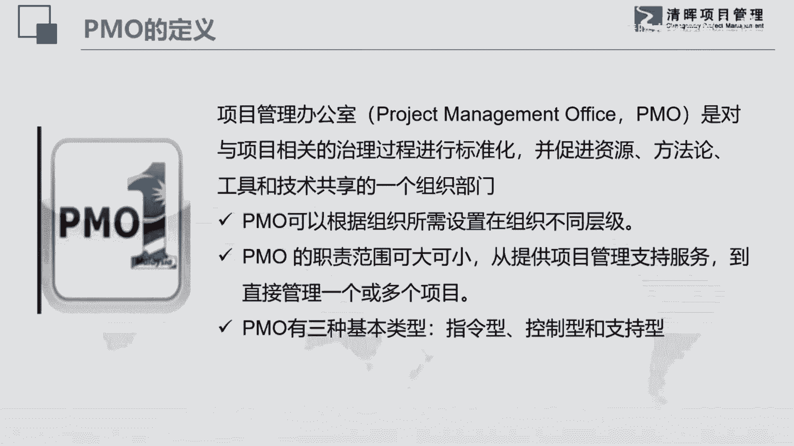
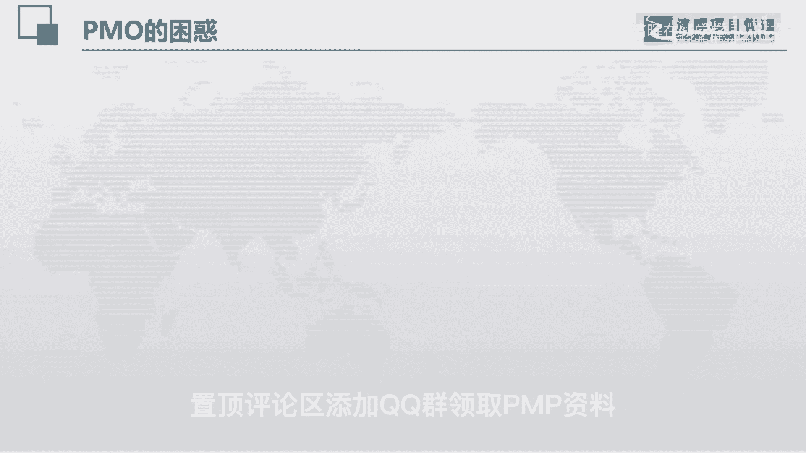
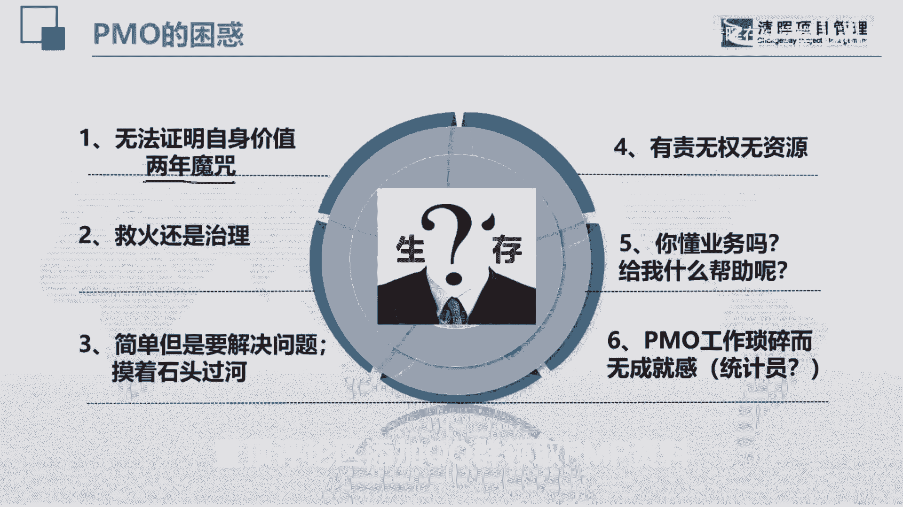

# PMO快速入门  如何快速组建PMO部门及组织？ - P4：PMO的困惑 - 清晖在线学堂 - BV1ZN411j7Dw

嗯我们来看一下啊，这是PMI组织对项目管理办公室的一个定义，这个大家也比较熟，如果你拿一拿着一本PB的话，那你一定能够看到这些东西，并且呢他会告诉你偏猫啊，他呢他要做一些标准化，促进资源方法论。

工具和技术的一些呃共享的一个组织部门，他是个部门，PO呢也可以根据组织所需要的，在各个层级都可以有PO的职责大小，看你管的项目的多少，而且PO有三种基本的类型，其实现在的外面PO啊有各种说法。

有仆人式的PO嗯，有那个就是什么服务式的PO啊，有顾问式PO啊，一堆啊，那么但是它核心呢他说有这样三种也行啊，我们其实觉得PO叫啥名字都无所谓啊，那只是一个代号，但是最主要的东西是你管的东西到底是什么。

那么我们来看一下啊，我们PO的困惑，既然呢在座各位呢有很多是我的同行啊，也是啊做PO的，那我相信在我们的过程当中，一定是有很多痛点的，来我想看看我们有没有人能给我打几个啊，我们等一会儿啊。

因为我们这个网络应该有30秒左右的啊，一个延迟啊，所以我等一等，看看大家在讨论区当中有没有跟我讨论的啊，我的PO的一些困惑，其实我们今天讲这个课的目的，其实一个呢是希望抛砖引玉啊。

能够给大家一个开拓一个思路，第二呢也可以解解惑啊，看一下我们在项目管理当中，我们最痛苦的最难的点到底是什么，所以我等一等啊，看一看大家啊，有没有有没有什么抒发一下情感，嗯嗯吐吐槽什么的也是可以的啊。

我们做pm的吐吐槽的事情可多了啊，作为一个中台部门，作为一个居委会老大妈啊，我们在职场当中啊，我们其实是受尽委屈的，对不对，来看看，加入新公司pm工作应该如何开展，这是个好问题啊，这是一个好问题。

那么正好我在后面会跟大家讲一下啊，我总结的PO的一些职能的工作啊，等会儿我们可以听一下这个会议题，在后面的PPT里可以直接回答，你出差有点受不了，哈哈哈啊，出差有点受不了，这个倒是真的。

就是不是所有的PO都是坐在办公室的对吧，那你应该是属于插手项目比较多的，嗯这个呢就是要看的你的职责，其实他可以和下面那句话有点相关，就是权限和职责不清晰，有责任但却没有权限。

这个呢我在今天没有重点讲这一块，其实在我的那个PO的那个两天的课程里，有关于这个权责职责这一块，以及和其他职能的边界这一块，其实我们讨论的是蛮多的啊，因为为啥呢，因为我们就是pm啊。

你会发现有很多的职能工作，其实是和其他部门是重复的啊，去重复的，比如说我们要去做项目经理的绩效，那他和hr是重复的，我们想做项目经理能力的培养，他也是和hr的职责有点重复的，我们想要去做项目的绩效。

或者是想要去做一些呃成本利润的一些分析，它和财务又是关联的啊，像有一些企业不仅有pm部门，还有项目管理部门，然后你就会发现呃，你想去管理项目啊，你想去收集项目的信息，你想去培养项目经理。

又和项目部门又是重复的啊，所以很多人都觉得，PO的职责和职权应该如何界定，这个东西其实是非常重要，因为在一开始的时候，我们就一定要把它设计好啊，这个点很重要的啊，还有项目参与感不强，项目参与感不强呢。

要看你是属于哪一种啊，应该要属于是哪一种嗯，PMO不是所有的东西都应该要强的，强不强，还要看你手上的权利，就是如果你有资源，那我觉得你可以把控的力度会更强一点，但是如果你手上没有资源。

那我也建议你不要瞎捞，捞了以后你又没有没有资源去顶的话，你发现你有了责任嗯，就是你的这个背不上啊，所以这个东西也挺难的，KPI的话，这个倒是要慢慢讨论了，因为KPI呢。

要根据每一个企业的实际情况进行衡量，还有吗，没有的话，我就要继续往下讲了啊，啊我们看看还有没有没有的话呢，我来给大家总结总结啊，就是我呢也调研了很多的企业的PO，因为接触多嘛。

然后也经常做这个方面的嗯那种培训啊，所以呢我们来看一下，首先第一个东西是pm，最大的困惑是什么呢，没有办法证明自身的价值，就是pm部门似乎是一个成本部门，是一个管理部门，但它又不像嗯hr部门和财务部门。

对于任何一个公司组织来说是不可或缺的，大家有没有发现这个问题啊，我自己在做pm期间，我就发现了这个问题，因为如果我是项目经理的话，我是公司的利润部门，我为公司创造利润的，所以我可牛气了，对不对。

但是做了PO以后，我发现我逢人都低低低一口气，因为什么我是一个成本部门啊，我不能够自身产生价值，所以的话呢它就容易产生一个什么呢，我们称它为叫两年魔咒，你们会在很多的企业当中发现一个问题。

就是公司的大老板觉得说嗯，我们公司现在需要加强项目管理，因为我们的项目越来越多了，所以呢我要加强项目管理，但是做了以后呢，半年一年以后，他突然之间发现说诶我为什么公司是上了天猫。

为什么这个项目还是这么难做，而依然呢还是存在着很多的问题，所以呢他就觉得你这个部门不值得拥有哈，是的真的，他会觉得你这个部门不值得拥有，然后怎么办呢，他说那么这样吧，你天猫部门和其他部门合并吧。

或者是解散吧，然后过了一个一年一年两年，发现没有pm还是不行，这么多项目没有pm没法管理，没有专职的人管理，所以他又成立，所以你会发现在一些大型的集团当中，在开始的几年里面，pm部门它是怎么样呢。

它是不断的反复的成立解散合并，成立解散合并，这是两年磨走，所以pm首先第一个要证明自身的价值在哪里，这一点非常的重要，等会我来给大家讲一讲我是怎么来玩的啊，第二呢是救火还是治理。

就是刚才我也看到有同学说啊，他说那个好像呃我参与上感的强不强，大家知道你要参与项目的时候，你有可能直接从项目的PMO啊，沦为项目经理了，大家有没有发现这个问题，当然了。

我们项目当中对于一些危机项目的一些拯救，这可以直接参与，但是我们要知道pm它到底是救火还是治理呢，救火就是说这里有一个项目做坏了，然后我跑过去救火大队队长，说句实话。

我连项目经理我都不希望他是救火大队队长，更何况是PO呢，我一直都说我自己在教项目管理的时候，我经常会说项目经理啊，很简单，一个是挖坑的项目经理，一个是填坑的项目经理。

你爱做哪一个填坑的项目经理不就是救火的吗，那你填项目经理填了坑不算，你还拉着PO去填坑，有意有意义吗，啊其实PO做的东西呢叫智力，大家知道什么叫治理吗，治理智这个词。

我觉得在这个中文的意思里面其实是非常好的，第一个治我们组些词治病，中国的治病是怎么治的，中医中医是头痛，治头脚痛，治脚吗，从来不是他把一个人体看成是一个整体，它会根据你的病因来确定，最后我应该怎么救治。

你对不对，用什么样的药，用什么样的方法，可能两个人的表征是一样的，但是他们的核心是不一样的，中医呢他认为人要生病不外乎两个东西，第一个呢是不良的习惯，第二个呢是你不良的情绪啊，就是你的喜怒哀乐。

这些都会导致你生病，他会根据你的这些特性，然后给你治病，所以他是因人而异，大家有没有看出来，第二个我们再举个例子，虽然至今为止，现在国际上依然啊那些白人的国家，但其实说句实在话，我们大家都知道。

他们现在偷偷的都在研究，他们就在想，为什么就能把我们的国家做的这样的欣欣向荣，其实他们在研究吗，他早就在研究了，只是他们嘴硬死活也不会愿意承认，他们不会承认他们的失败啊，所以这个大家知道，因势而治。

每一个国家，每一个民族不一样，所以它的治也是不一样的，所以大家知道什么叫治理吗，治理其实很简单，就是要因人而异，因事而治，因我们的组织而治，所以至今为止PO都没有一本书说这是我的东西，就叫规范。

你们未来有一套体系，像PMBOK项目管理是有一套体系的，而这套体系还真的很不错，但是PO至今为止都是各家的各自的观点，包括我今天讲的东西也是观点，什么叫观点呢，就是我自身站在我自己的经历。

我自己学到的文化啊，自己的文呃，也就是那个意识，然后从我的角度去看pm所看到的，我认为看到的东西把它描述下来，就叫观点，观点是可以不被大家认同的，所以在座各位其实是可以DISS我的。

你觉得你讲的这套方式我觉得不合适不好用，OK没有问题，但你也可以发表一下你的意见，所以治理才是PO最最核心的一个特点，它要根据企业的实际情况，把好脉写好方针，出好制度体系啊，所以他是要治理的。

第三个呢也是经常很多老板他们在做把PO呢，说要建立PO的时候，经常会跟我们说的一句话，他说哎我们PO哦就是做事情要简单啊，但是要解决问题啊，我们可以一步一步来摸着河头过河，就是你那PO管理要简单。

他不想弄得很复杂，他觉得很复杂呢，劳师动众，确实的pm如果要做的很复杂的话，全部都是流程制度，没有人喜欢，大家觉得吗，但是呢项目基恩，但是呢老板还告诉你后面一句话很烦，他说嗯但是要解决问题哦。

这可这就麻烦了对吧，你又要简单，但又要解决问题，因为大家都不知道应该怎么样，然后我觉得最经典的是我以前遇到过一个老大，他说嗯，我要做一个我们自己公司特色的PO的体系，哎呦，就是学那个我们中国的那个。

那么什么叫做他们组织的特色的项目管理呢，其实说白了就是各种的不规范，他希望能够在保留那么多的不规范的情况之下，还要能够解决问题啊，其实挺挺，就是对于我们这些专业人士来说，其实有一点想哭。

大家理解吗啊这是第三个问题，第四个呢就是有权无有责，无权无资源，我们很多pm啊，那下面这个衣服基本上没几个没几个兵啊，所以你你得自己要想好，说我这个PO下面到底要做些什么，当你没有资源的时候。

我就建议你不要管的太多，当你有资源的时候，那你可以把你的手呢可以往外伸一点，所以呢我们要知道我们手上掂量一下，我们有没有资源，第五个呢就是项目经理不卖账，因为你是PMO嘛。

很多企业的PMO其实和项目经理是不太对付的，很多的项目经理经常会说，哎呦这个pm烦得要死啊，我已经天天工作忙的要命了，你还要天天跟我追着要周报月报啊，是嫌我们不够忙啊，然后呢也没有任何意义。

甚至有一些冲的项目经理比较牛掰的啊，他们会说什么呢，他说你懂业务吗，你能给我什么帮助吗，你不能给我什么帮助，你为什么在我这儿唧唧歪歪呢，真的有有这样的项目经理，所以呢我们做pm的人还得怎么样。

有两把刷子，要不然的话你根本就镇不住下面的项目经理啊，那你怎么玩呢，对不对，还有PO工作，如果很多的工作都跟别人的重复之后，你会发现PO工作最后沦为什么呢，琐碎的一些统计的一些工作。

比如说设计项目的信息啊，感觉没有成就感啊，我们所做的东西呢跟别人都是dB的备份的啊，所以这个东西就是PO的一些困惑，大家想一想有没有在这个东西，但是在这六个里面，我觉得最大的一个困惑或问题就是生存。

因为很多片都有一个两年魔咒啊，两年魔咒的意思是啥呢，两年魔咒的意思就是说，我有可能甚至会被取消啊，如果我被取消了的话，那么我就没有生存的空间。

