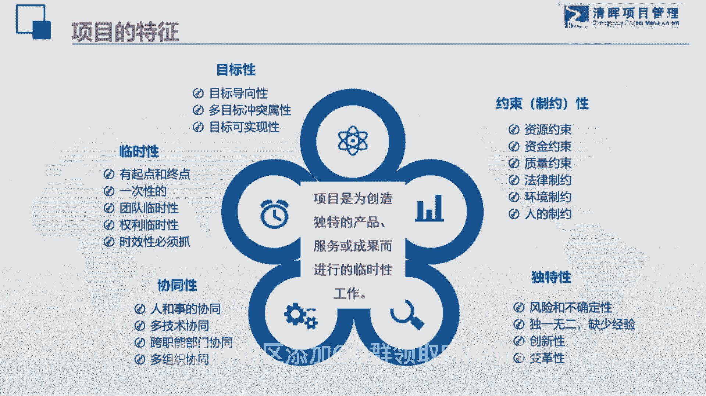
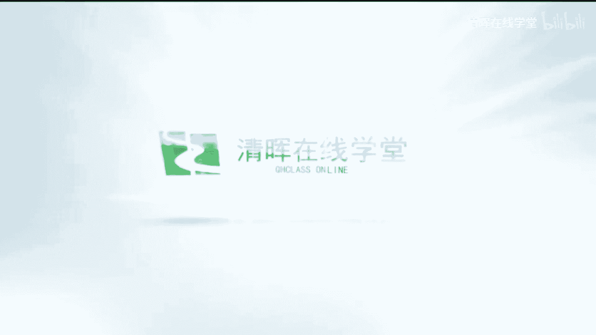

# PMO快速入门  如何快速组建PMO部门及组织？ - P1：01.项目的特征 - 清晖在线学堂 - BV1ZN411j7Dw

首先我们来再任，再次要认识一下我们项目管理的办公室，他管的是什么呢，管的是项目，那么我在这儿依然用了，我们PMI组织的项目的一个名词，项目是为了创造独特的产品服务和成果，而进行的一个临时性工作。

那么在这里呢带着大家，我们在一起梳理一下项目的特征，看看项目到底有些什么样的特征，首先第一个是目标性，这东西没有问题吧，我们做项目的时候，项目呢是有目视目标导向的，项目的目标性是极其强的。

这个是和其他的运营管理是无法批拟的，然后呢虽然目标导向性很强，但是我们在项目当中的干事人很多，所以每一个目标他之间啊，每一个干事人他的诉求其实是不一样的，所以呢他是多目标。

并且目标之间呢是容易怎么样产生冲突的，而且我们还要评判一下这个项目的，目标的可实现性，它真的能够实现吗，大家想一下啊，在我们的很多的项目，特别是一些研发类的项目，其实并没有我们想象中那么容易的实现。

大家有没有发现这是目标性，那么第二个特性也是我们最经常说的那个东西，对一个项目它是有起点，有终点，就是临时性的，所以我们在接一个项目的时候，都是奔着它的结束而去的，这点没有错吧。

其实这个临时性我还是蛮喜欢的，大家知道吗，因为我除了做职业讲师以外，我的另外两代两段生涯，一个呢是做项目经理，一个是做PO，相对来说，我还是觉得我在做项目经理的时候，还会更加的快乐一点，又为什么呢。

当你完成了一个项目以后，你有一种分杯感啊，你每完成一个项目，然后你再去接一个新项目，是有一个新鲜的感觉的，所以呢临时性其实也是有好的，临时性还告诉大家一个很重要的特点，就是什么呢，项目有可能是一次性的。

我们说一切皆项目，比如说我们日常工作当中的结婚，也是可以当一个项目去做的，对不对，那么结婚嘛对吧，最好一辈子就结一次，不要结太多，对不对，所以的话有的时候是一次性的，你是很难去找到有什么经验的，对不对。

还有呢在我们的零项目的临时性也决定着，如果我们的组织架构是矩阵型的话，我们的团队也是临时性的，项目经理的权利也是临时性的，甚至有一些项目经理告诉我说，我根本就没有权利，然后呢临时性时间还告诉了我们。

项目的有是有时间制约的，所以是一个时间非常紧迫的一件任务，所以你你我们大家做项目的人，一般都会发现一个什么特点，就是基本上项目都是啥，基本上都是急吼拉吼的，似乎就没有哪一个项目呢似乎就是特别轻松的。

大家有没有这种感觉，时间好像宽松的很少，基本上都是时间非常的紧迫，所以它有一个临时性，因此目标导向性挺好的，但是目标的不一致，给项目增加了难度，项目的时间紧张，也给我们项目造成了难度。

我们再来看看协同性，我们说项目管理呢其实是人和事的一个协同，我们很多的人员曾经有很多技术人员问我说嗯，我想转型做项目管理，我说你如果想做项目管理，那你一定要注意人和事的协同啊，我因为我这个人自己啊。

是本来就是自己是非常喜欢，就是那个道家的文化，所以我很喜欢那个阴阳鱼的那个土，我觉得人和事呢，就相对来说就是阴阳鱼里面的两半啊，我们在做任何的项目管理工作的时候，如果你从局限性的角度。

从人或从事单方面去考虑，那你就会发现你会把事情给做杂，所以人和事就是就是要协同的，所以技术人员，当他要转型做我们项目管理的时候，那他的思维结构是一定要有变化的，还有呢它呢是需要什么呢，多种技术协同的。

你会发现现在的项目几乎就没有什么事情，什么项目它是能够怎么样一种技术都能解决的，基本上是要多种技术相互配合的，并且呢在组织中也是跨职能部门协同的，大家已经慢慢的发现，在组织中有很多重要的工作。

都是需要多部门协作才能完成的，而这一类的项目呢其实是啊，这一类的任务其实是特别适合用项目管理的，但同样他也给项目管理造成了什么难度，还有呢多组织协同，现在我做的一些大型的集团企业。

他们做的一些大型的项目或项目集，或者是叫大项目，他们甚至会用到了多个什么呢，法定的组织也就是多个公司合作才能做成的，所以协同性也给项目造成了难度，就是这个项目是一个非常难做的啊。

这样的一件事情需要多方协同，多种技术配合，这个我们帮大家梳理一下啊，简单的梳理一下，然后呢要不是有制约性的，这个没有说没有的，得说了，成本的，资源的，资金的质量的，法律的环境的，还有人的制约啊。

这些制约因素也就告诉大家，我们的项目天然是有紧箍咒的啊，并不是你想做成什么样就怎么样的，说句实话，除了一些嗯政治上的一些项目之外，绝大多数企业的项目一般来说都是缺钱的，不会给你很痛快的相互的资源。

所以就是钱很少，时间很紧啊，需要多种技术，多种人来配合，目标还不统一的这么一个难做的项目，所以这个项目呢就是怎么样显性很强，一定能够成功的啊，然后呢它的独特性也告诉大家，它是带有创新的，是变革的独特性。

就告诉大家也是有很多风险的，我们都要有一些项目啊，他从一开始你就不知道他最后能不能成功，我们在好几年前有一个电影嘛，就是我不是药神，不知道大家有没有看过啊，那个电影看完了以后，你心情会比较沉重。

因为这里面没有一个角色，他是呃就是其实是真正的是坏的啊，他们每个人都在为自己的生存在奋斗，甚至那个很多人会怪那个药厂说，你为什么把药卖的那么贵，其实你的成本并不高。

但是大家要知道他的那个癌症的靶向性新药，在世界上它的研发的成功，而且失败率啊大概高达70%甚至到80，所以他好不容易研发出一个新药来，怎么地啊，他肯定要把这些研发成本要在新药上给收回来。

所以其实他也没有错，如果你不让他去收这个费用的话，那你就会发现什么呢，你就会发现以后再也没有人去做研发新药，因为这个成本hold不住，一旦成本超了的话，那么这个公司就会倒闭，也不会再有人去研发新药。

所以呢这个之间大家可以想一下，所以这就是项目从头到尾，我就是告诉大家，项目其实就是一个什么呢，一个相当难做的一个任务啊，这是因为有这样的一个事儿，而且现在大家会发现。

具有这种项目特征的任务是越来越多了啊。

是越来越多了。

