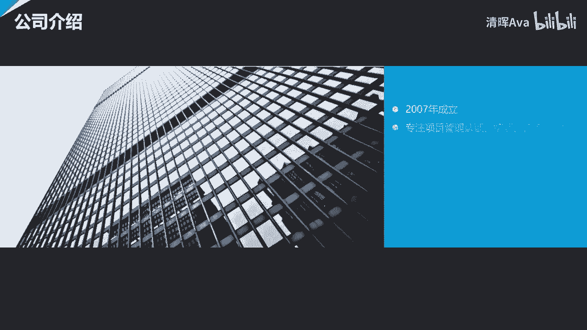

# PMO的五种定位及对应核心工作目标和评价指标 - P1 - 清晖Ava - BV13x4y157Yx

啊啊啊啊啊，啊。

啊啊啊啊。

今天是国家的未来领导人的年代，前进前进前进前进。

啊啊啊啊啊啊啊。

啊啊啊啊啊啊啊。

如果不能爱你的英雄。

你快回来，中国美国。

啊。

啊啊啊啊啊啊。

啊啊啊。

啊啊啊啊。

就在美国一美的美国。

啊啊啊啊啊。

hello，尊敬的各位学员，大家晚上好，欢迎大家在百忙之中抽出时间，来参加清晖在线课堂组织的项目组，项目管理办公室在线讲座，pmo呢作为一个企业中的新生部门，而且是一个和传统企业的原有部门。

所奉行的理念和工作方式有较大差异的部门，往往在一开始的阶段就会被大家所质疑和误会，甚至会造成pmo的负责人以及po的成员，对自己的工作目标和价值产生了怀疑，为了能让pmo部门和团队的负责。

能够更快速的定位自己对企业和大家的价值，因此呢就需要在早期的时候，就共同明确pmo的愿景使命定位，以及自己部门的核心工作目标和评价指标，以及其他部门和项目经理们的认同，在不同的企业中，由于其行业不同。

管理成熟度不同，战略不同，在组织中所处的位置不同，亦或是领导风格不同等各种各样的原因，会导致pmo在企业中会有多种多样的定位，因此也就导致了不同定位的pmo，会有完全不同的工作目标和评价指标。

那么在这样的一个大背景之下，今晚呢我们非常荣幸地邀请到了肖洋老师，来和大家分享，谈一谈如何让po走向成熟，pmo走向成熟后有哪几种，哪五种典型类型，不同类型的po，它的工作目标与评价指标都是什么。

以及其他部门和项目经理们的认同等问题，那在肖老师的分享结束之后呢，我们还设置了一个互动答疑的环节，由于网络有延迟，大家可以在听讲座的过程当中，把自己想要了解的问题发下来，我们会在讲座结束的时候。

请肖老师来给大家进行解答，那么讲座现在就开始了，请大家有请肖阳老师，各位嘉宾大家晚上好，很高兴地做客清辉在线学堂，今天呢我要给大家分享的主题是，p m o的5。5种定位，及对应的核心工作目标和评价指标。

准确的来讲呢，这次的分享其实是啊，我很多年前的时候曾经做过一个分享，只做过蛮多次的，就是po的定位和使命，那当时在我去做那个分享的时候呢，其实啊，我们也是沿用了之前的这个一种经典的分法。

把po的基础定位呢分成了五种不同的定位，然后那当时呢我们其实更多的讲的是说呢，p o呢它本身的这个定位啊，以及在这五种基础的定位的情况下，它大概会扮演什么样的角色和职责，这一次的分享呢。

相当于是pm的定位和使命的一个进阶版，那在这次的分享过程中呢，我们会针对于这五种不同的定位，那结合实际的工作，我们会去呢跟大家谈一谈，在这个不同的五种定位之下，那p mo具体的工作目标有什么不一样的。

那我们用什么样的评价方式去评价呢，po的这些工作目标到底做得好还是不好啊，这是我们今天晚上其实想跟大家分享的主题，今天晚上我们分享的主题呢会由十个部分组成，那这十个部分呢我们会分别谈一下呢。

战略型的pm在承接组织战略落地工作的时候，他的工作的目标和评价指标是什么啊，那战略型的p o呢，它也会有职责是推动企业的价值管理机制建设，那这个时候它会有哪些工作目标和评价指标。

第三点呢是说这个咨询型的p m o啊，咨询型的p m o呢，在推动企业的项目制和项目化工作的时候，会有哪些工作目标和评价指标嗯，咨询型的p o，在参与和推动企业产品制工作的时候。

会有哪些工作目标和评价指标，运营型的p o在开展项目组合管理时的，工作目标和评价指标，那运营型的po在开展多项目运营管理，工作室的工作目标和评价指标，那在这里边呢。

我其实是把项目组合管理和多项目的运营管理，拆开了，是因为呢他们合起来，可能被我们能称之为叫多项目管理，但其实多项目管理呢其实是一个很大一个框，那在这里边呢有一些是偏向于组合属性的工作。

那有些呢是偏向于运营属性的工作，所以这样的话呢我想分别的去解释一下，当我们的po在承担这两种不同类型工作的时候，那我们工作的侧重和目标以及评价方式是什么，第七点呢我们会为大家分享是控制型的pm。

那在参与这个项目和项目集或者叫项目群管理，工作室的工作目标和评价指标，然后第八点呢，支持型的po在参与项目和项目集群啊，工作室的工作目标和评价指标，所以这时候我们会看到的七和八呢。

其实我们主要谈的是控制型和知识型啊，他们都在去参与项目工作，或者项目集群工作的时候，他们会扮演什么样不同的角色，来承担哪些不同的职责，第九点和第十点呢又都是咨询性的pm。

那第九点呢重在讲这个咨询型的pmo呢，在企业内开展项目经理的能力建设，和职业发展路径建设的时候啊，会有哪些工作目标和评价指标，第十点呢是说这个咨询型的po，在推动组织级项目管理的体系建设的时候。

他的工作目标和评价指标，当然了，我们说这个po，其实还可以有更多的工作目标和评价指标，那鉴于这个时间的有限，那我们希望能够在今天晚上，那这短短的一个多小时的时间里面呢。

我们把这些最常用的最典型的平安包的定位，以及在企业中呢通常最需要p o来去做的工作，那关联起来看一看呢，他们在支撑这些工作要求的时候，到底应该有哪些工作的目标和评价指标，首先呢我们再来回顾一下啊。

就是项目管理办公室的五种基础定位，准确的来说呢，项目管理办公室的五种基础定位呢，其实是在办公室早年初期的时候，可能定位并不明确，就什么活都干，然后逐渐的走向成熟，当我们说走到成熟到一定阶段的时候呢。

他这个工作的定位就会产生分化，所以这时候我们会看到呢，在企业中呢就会存在定位侧重不太一样的，不同类型的po，那有的pmo呢，它其实侧重于成为一个企业的战略规划者，再换句话说。

其实他可能并不一定是真正的战略规划者，他应该是承接战略规划的这样的一个po，很多的时候企业是有战略规划部门的，那即使企业没有战略规划部门的，他一定会有很多非常宏伟的战略规划，3年的，5年的，10年的。

15年的，很多的时候企业做完了一个很好的战略规划，之后呢，他他这个战略规划是要落地的，那落地的形式呢，落地的载体其实就是我们说的项目啊，所以通常我们会说，其实项目呢是企业战略落地的载体。

那如果项目管理没有做好，那战略项目可能就落不了地，那如果战略项目落不了地呢，战略规划就没有办法实现，战略规划，没办法实现战略目标就实现不了，那这个时候呢企业即使有再好的想法，但因为战略规划落不了地。

那仍然会导致企业的这种转型，跟这个进一步的进阶会遇到问题，所以战略型的pmo呢，它其实往往呢其实是为了帮助我们企业的战略，如何让企业规划的战略任务或者战略举措落地。

而形成了这样的一个项目管理办公室的类型，所以呢他注定了会跟公司的上层，以及这个战略规划部门，有着非常好的跟非常紧密的关系，所以往往的这个战略型pmo呢，会从这个战略管理办公室分化出来。

或者是由呢总经办总裁办，然后董事长办公室，他往往会从这样的一些部门分化出来，那分化传递的原因呢，其实目的就是为了重点帮企业内，被称之为叫战略举措，或者是战略任务的这些东西的落地而形成的。

这是我们战略性pm，那所以他的主要工作其实是支持企业的战略，第二类呢就是我们说控制型的p m o，控制型的pmo呢，它其实侧重于呢，其实是这个确保项目开展工作过程中的合规性，那以及呢这个侧重于呢。

这个嗯项目管理的体系的这种的持续改进，然后那这种类型的p o呢，它其实最早的时候，其实往往是从这个很多的软件行业的质量，管理办公室分化出来的，因为很多的软件行业跟it行业的，他从很早的时候呢。

他的工作的交付方式，这都是项目，所以呢这时候呢它的质量管理部门呢，其实就变成了以项目为单位进行质量管理，那管理的管理的过程中呢，它其实一部分的质量管理的部门的工作，就分化出来了。

成为了这个偏重于质量的项目管理办公室，那传统的质量管理，尤其是体系管理，它其实本质上来说呢，其实就是确保大家日常工作的合规性，符合标准的要求，符合流程的要求，符合工作的要求，其目的是为了规避风险。

提升质量，然后呢提升过程控制，让大家少犯错误，那这个控制型的pmo呢，它往往会发挥相同的作用，他更多的也会变成了，是说呢首先呢这个建机制建流程，然后呢同时呢这个确保大家呢不同的角色。

那都按照这个项目管理的机制流程来开展工作，然后呢这样的话呢来去保障我们的实施过程，那让大家呢少犯错误，那规避风险，所以这时候呢就会形成了控制性的po，控制型pmo中的一个典型角色呢，就是我们说的q a。

那就是quality assurance啊，那这个项目保证啊，质量保证，或者换句话说叫项目质量保证和p q a project，quality assurance，那这样的一个角色呢。

它更多的其实是代表了这个公司的啊，对于项目工作的质量管理体系的要求，那更多的来确保大家在工作过程中呢，那这个按照公司的要求去开展项目管理工作，还有一种类型的pmo，就是我们的运作型的，那运作型pmo呢。

它的特点呢是说，它更多地承担了企业日常的这种项目，交付的主要职责，所以通常呢如果产生了运作型或运营型的p o，那通常呢项目经理呢是可以划归到p o的，换句话说它形成了一个项目经理的资源池。

再有呢是说这个贪很多的时候，他要对这个项目的成败的结果负责，那首先第一项目经理是在你这儿的，那这时候项目经理本身的资源调配，那项目经理能不能确保项目的成功，那这些的职责呢。

其实就都会变成了po的职责的一部分，所以呢我们通常会把这个运营型的p o，或者叫运作型的pmo呢，它称之为是项目的执行者，是因为他要对项目能否正确的实现项目的目标，项目的绩效，那去去做负责。

包括呢他承担了要去提升各个项目绩效的，这样的一个责任，还有一种类型这种说的支持性的pm，知识型的po呢，它其实更多的呢其实是给项目经理跟项目组，提供便利和工作和提供便利支持的，很多的时候呢。

知识性的pmo呢它里边没有项目经理，项目经理可能都在项目管理部，或者是说呢在其他的这种的职能部门啊，因为在有些企业里边的，项目管理部和po是分开的，项目管理部呢偏向于项目经理资源池，那都是项目经理。

pmo呢偏向于呢对这个各种的这种项目经理，所管辖的项目呢进行这种支持和管控，所以呢这个有一类型的这个p o呢，被我们称之为要支持型的，它里面的典型角色呢就是项目助理啊，或者是文控，那这一部分呢。

他的工作更多的其实是在项目中，扮演了其中的一个支持性的角色，那帮助项目经理和项目团队呢，去嗯处理那些他们并不太擅长的日常的，比如说像行政类的啦，文档管理了，配置管理了，其实偏向于去承担这些工作的职责。

变成了一种支持性，还有一种po呢就是我们所谓的咨询性p o啊，那咨询型p o呢，它更多的扮演的是一个咨询顾问的角色，那咨询顾问呢他其实往往呢他一定是专家啊，要不是老师，要么是顾问，要么是教练。

它更多的呢其实是用来教大家啊，帮助大家给大家赋能，然后帮助大家提升项目管理水平，然后呢或者是帮助大家进行体系建设，那或者是帮助项目团队呢，在过程中去识别一些他不擅长的风险，跟处理一些比较棘手的问题。

所以呢它往往是一种专家型的，所以很多的时候呢，当我们在企业，尤其是进行大规模的项目管理体系建设的时候，其实往往会邀请一些专家型的人，加入到项目管理办公室里面，其目的是为了帮助企业在较短的时间之内的。

能够用正确的方式去搭建我们的项目管理的机，制，流程体系，那能去培养更多的项目管理的人才，会形成形成这种咨询性的，很多的时候呢，我们说这五种类型它是五种基础定位，那也意味着说。

其实在我们的组织或我们的企业中呢，其实很多时候项目管理办公室，它不仅仅有这样一种定位，它其实很多的时候会是几种定位的叠加啊，所以呢比如说我们会看到一些项目管理办公室，比如说是战略控制型的。

有的可能是战略支持型的，可能也会有的是说这个咨询型的，支持型的和运作型的叠加对吧，也有可能是控制型的，咨询型的和支持型的叠加，总之呢，其实我们在企业中，会看到各种各样的项目管理办公室。

但是呢不管它具有什么样的职能和职责，它一定呢其实是由我们说的这五种基础定位，中的一种或几种叠加之后所形成的，接下来呢，我们其实就要重点给大家讲的是什么呢，这这五种不同类型的p o啊。

他在我们的企业中去支持，或者是去参与某一类非常具体的工作的时候，那他可能会承担哪些目标和指标，在这里边呢，其实我们并没有呢罗列特别多的目标和指标，因为呢其实呢这个嗯，pm可以承担的目标和指标特别多啊。

那但是呢因为时间有限，所以呢我们重点的把每一种类型的特定的po，在支持某一特定类型的工作的时候，的主要的目标和指标提炼出来了，所以可能每个里面我们大主要会讲三个啊。

首先呢给大家解释一下这个目标和指标的区别，通常呢我们说目标呢更多的是工作目标，工作目标是什么呢，工作目标就是说我们的职责是我们要做什么啊，所以很多时候工作目标和工作职责它相关联，它更多的谈的是说。

如果我们是这种类型的p o啊，我们应该要去做哪些事情，评价指标呢，更多的谈的是说评价方式，怎么去评价这个事做得好或不好，所以通常指标呢是可量化的，目标呢其实更多的强调的是我要做的事情。

所以这是他们俩的区别，所以当任何的时候，当我们要去定义一个pm的时候，尤其是定义po它本身的工作和职责，那首先呢我们一定要罗列出来，那我要干的事情是哪些，找目标，第二我用什么样的方式去评价。

我们这些工作做得好或不好对吧，这是我们的量化指标，就是评价指标，那在这里边呢，首先我们来看的是说战略型的pmo，战略型的pmo呢，它往往会承担一个非常重要的工作的职责，就是支撑组织的战略落地对吧。

这也是战略型po的最核心的工作之一，那如果我们的战略型的偏方在吃这个承接啊，组织战略落地的目标的时候呢，那这里边我们其实给他列了三个，比较重要的工作目标，那其中之一呢是协助战略规划部门。

分解和制定战略地图啊，这是什么概念呢，大家知道这个做战略规划呢，这个战略规划更多的其实是去思考，组织未来的3~5年甚至五到10年，那我们的路应该怎么样去走，如何去实现我们中长期的战略的目标。

然后但是呢这个战略规划要落地呢，其实很多时候我们会用到战略管理中，一个非常重要的工具，那这个重要的战略工具呢它叫做平衡积分卡，就是balance scc，那这个平衡积分卡呢，它其中的一种展现形式呢。

就是我们说的战略地图，那战略地图是什么呢，这种的战略的目标和指标啊逐层分解，从投资方所关心的财务层啊，分解到的客户层，那由客户层呢分解到内部的运营层，由运营层的分解到最底层的学习和成长层。

这样的话呢我们把一个高高在上的战略目标，那逐层分解分解到我们的企业和组织中，我们把最顶层的那战略层的战略指标，那把它也跟在各个不同组织，不同层面的大家的工作，评价工作的这个指标进行关联。

这样的话呢我们就形成了一个指标体系，在这个指标体系或这个指标数里边呢，然后每个不同层级的人，他各自的工作的指标的变化，会对其他的层面的人的指标变化所造成的影响，这是我们的战略地图和平衡积分卡。

这个呢不做过多的解释了，如果大家如果想具体了解的话，大家可以百度1下这个这个战略地图和平衡，积分卡，是战略这个落地过程中，一个一个非常重要的工具，那在这里边我们主要谈的是什么呢，po要干什么。

这个战略的管理部门，他要去制定战略地图跟平行基本卡的时候，他需要跟各个业务部门和职能部门一起，因为他要谈的是，如何把战略最顶上的目标和指标，分解到各个不同的业务部门和职能部门里面去。

当然这里边呢就会涉及到是说，其实分解完了之后，所有战略规划的工作，这个东西要落地，他其实很难落到日常运营里去，因为通常战略规划的都是之前没干过的事情，所以这时候他的落地一定会以各种项目为单位。

这就是我们说，其实战略规划分解出来的东西叫战略举措，战略举措落地的形式其实往往是战略项目，所以呢这时候呢那作为p o呢，它其实应该去帮助战略管理和战略规划部门，共同去做这些指标的分解，在这个过程中呢。

其实呢一方面熟悉战略规划，它所达成的目标和指标，第二方面呢尝试着去思考，是说帮助我们去解决，当我们立项的时候，当我们看到来自于各个不同层面的项目的时候，我们要去思考，有助于我们思考这些项目跟战略。

目标和指标之间的关联关系，所以呢通常呢我们一般需要我们的战略型po，协助战略规划管理部门共同去制定战略地图，第二呢是说对于战略型的pmo呢，在这项工作中呢，他还有一个非常重要的职责。

就是他要解决战略目标跟项目，目标之间的关联关系问题，很多的时候在很多企业里边呢，它会有一个不太好的现象，就是做战略规划的是做战略规划，做运营的是做运营的，做项目管理是做项目管理的，这是三条线。

但实际上呢它不应该是三条线，如果三条线大家各自干各自的，这时候其实真正在最基层开展项目工作的人，就会变得很分裂了，因为最后落地的形式都是以项目为单位的，换句话说，这职责最后落地的时候。

都是靠项目经理跟项目团队干出来的，所以呢我们通常呢一定要想办法解决的是说，战略规划的目标和指标跟项目的目标和指标，和运营的目标和指标之间的关系理清楚，理清楚之后呢，大家就能形成合力。

那首先至少在战略的目标和项目的目标，它是一个直接支撑关系，换句话说大家知道这个项目管理，尤其是战略类的项目，它一定有一个非常重要的评价的要素，叫战略一致性，换句话说，如果这个项目的目标。

不是为了支撑某一个战略的目标的话，这个项目根本就没有存在的必要，但是呢因为很多的时候项目是自下而上起来的，战略是自上而下定义出来的，很多的时候，做战略的人不能理解这个项目的目标，做这个做项目的人呢。

他很多时候不理解战略的目标，就会造成他们这样的脱节，所以呢这种脱节呢，对公司导致的结果就是战略可能被架空，项目呢因为跟战略没关系，得不到高层的支持，这样对双方都不好，所以呢战略型pmo呢。

要帮助大家去解决这个问题，我们要找到这个自下而上的这些项目的目标，和自上而下的一些战略的目标之间的关联关系，去看到每个不同的项目，到底支撑了组织内什么样的战略目标，和什么样的战略指标，这样的话呢。

我们就把自上而下，战略落地的这条线给打通了啊，然后所以我们就期望的说，这里面的第三点，就是，我们希望能够定期的通过项目指标的完成情况，去预测战略指标的实现情况，因为这个项目的目标本来就是支撑战略目标的。

这样呢这个项目的评价指标，那它的变化，那我们就能看到项目，就能预测项目未来目标的实现程度，那这个时候呢，如果我们之前又定义了项目的目标，和战略的目标之间的这种关联关系，那这时候我们就能通过它再去预测。

战略的目标的完成程度，这个时候呢我们就能够他衡量战略目标的，完成程度的方式，就是我们说的战略的指标，所以这时候我们就得到了一个结论，那我们可以通过在过程上对项目的这个指标的，监控的结果。

然后呢去预测战略未来指标可能实现的情况，所以这是我们说的这个三个目标，在这里边呢，如果我们想要对这项工作做做评价的话呢，其实我们可以定一些评价指标，那比如说呢对于第一项呢。

我们可以通过一个战略规划的支持度啊，更多的呢其实看的是说，那我们的战略型p m o，在参与组织战略规划工作时候的，我们参与多少呢，来评价我们的支持度，然后呢，当我们我们也可以去评价我们战略型pm的呢。

这个战略指标的达成率，这个时候呢虽然战略指标的达成率，其实它主要背的应该是战略部门，那但是呢我们说在这里面，为了能够让战略型po更好的去支持组织的战略，所以呢我们要跟他共担这个指标，换句话说。

我们把他们的指标变成我们指标的一部分，这样的话我们才能更积极的去帮助，我们组织的战略目标实现，第三个呢我们也可以去评价什么呢，战略指标达成情况的及时反馈率，那这个指标设置的目的呢。

其实是为了确保战略型的p m o呢，能够及时有效的根据这个项目的目标和指标，的实现情况，那把这个结果反馈给战略规划部门，这样的话呢，战略规划的团队才能更好的呢去及时的，根据项目的实现情况去调整战略规划。

同时判断的战略规划本身的合理性，这样的话才能够保证呢这个整个战略的闭环，形成这种说的战略性po的，这个在战略落地时的目标和指标，接下来呢我们谈一谈这个战略型pm，在价值管理工作中的目标和指标。

很多的时候呢，战略型po，它往往会承担这个价值管理的这个机制，建设的这个工作职责，所以在这里边呢，我们必须得讲讲什么叫价值管理啊，这个在这底下呢，这个右下方我们画了一张图。

这张图呢其实是我定义的一个这个项目的一个，整个生命周期的全景图，在这个生命周期的全景图里边呢，我们把这个项目最终所要实现的目标，继续地向公司高层所关心的愿景进行了延伸，就是这上面红色的这个部分啊。

所以在这个过程里面呢，我要给大家讲一个讲一个逻辑，这个逻辑是什么呢，站在企业的角度，那我们如何看待这个整个项目的过程和价值，首先呢如果站在企业的角度，我们知道每一个企业呢。

它最终的目标一定是为了实现企业的愿景，但那企业的愿景呢它往往实现周期很长，所以呢它往往首先呢很宏观很美很伟大，比如说很多企业呢，他都会把自己的愿景定义成了，是说我们一定要成为啊，在我们的细分领域中啊。

全国最一流的企业，或者是或者是说呢全球最一流的企业，但这个时候呢我们会发现，它其实这个目标是偏虚的，因为它不太好衡量，因为我们并不知道一流企业长什么样子，可能也不知道怎么样才能变成一流的企业。

但是呢不这个并不妨碍呢，我们把它作为我们的一个愿景啊，所以愿景它有的时候是虚的，但什么东西是实的呢，我们说我们中长期的战略目标，那比如说3~5年的，5年到10年的这个中长期的战略目标，必须是实的。

是可测量的，而且呢我们中长期的这个战略目标，它一定是支撑我们企业愿景的，所以呢这个通常战略目标，它其实往往必须可测量，它，可测量呢它就必须准确的定义我们要做什么，以及我们用什么样的方式去衡量它。

所以很多时候呢企业的战略目标呢，它其实可能往往定义成，比如说我们要扩大海外市场对吧，或者是说呢我们要创新出一些有竞争力的产品，这时候它会变成战略目标，但关于目标还不行，我们还要定义它的战略的评价指标。

那这时候呢比如说什么叫扩大海外市场呢，比如说我们要把我们海外市场的占有率，可能由原来的这个比如说在，比如说这个海外市场的占有率，由原来可能占3%变成10%，这时候就变成了一个战略目标。

那我的评价指标呢其实是全球市场的占有率，然后呢接下来呢我们可以开始关联到项目上，这时候呢我们要关联的是什么呢，我们如何去判断我们要不要去投资一些项目，大家知道这个站在企业的角度呢。

所有的对于项目的投入都是一种投资行为，换句话说呢，他就是先花钱后带来收益的这样的一种方式，那这时候呢那如果我们要投什么样的项目呢，我们应该首先关心的不是说这项目要干什么。

我们要关心的是这个项目为公司所带来的收益，如果项目为公司所带来的这个收益呢，能够直接支撑我们组织的战略目标，那这时候说明什么呢，说明这个项目对公司有价值，那如果是说这个项目所带来的收益。

它确实是实在它的收益，但是没有办法支撑我们组织的战略目标，那我们说明这个项目是一个有收益，但对我们没有价值的项目，那这时候我们站在公司的角度可能就要考虑，那我可能就不投入它了。

因为呢那如果是说它实现的收益，不是我们所需要的收益，那有可能这个收益要么是鸡肋，要么可能是对别人有收益的事，对吧，我们怎么能花我们公司宝贵的自己的钱，去干一个对别人有收益的事，或干一个很鸡肋的事情呢。

所以呢这时候呢，其实我们判断一个项目对公司是否有价值，其实不是仅仅看它是否有收益，而更多的要判断的是说，它是否实现的，是一个对公司战略目标有直接支撑的收益，那如果有直接的支撑。

我们说这件事叫做对公司有价值的项目，所以这时候我们会看到价值形成了，在接下来呢我们要关心的是说呢，到底什么样的成果，或者是说我们的公司，我们的项目，把我们的目标的客户和用户。

转变成一个什么样的状态的时候，我们才可以实现预期的收益，那这个我们把我们的目标，用户跟客户所转变之后的这个状态，就是我们所期望它所变成这个状态呢，通常被我们称为叫成果，所以这时候呢就回到了我们说这上面。

转化成果的这个点，我们通常认为呢成果转化是收益实现的，前序意味着是什么呢，这里面背后的逻辑是说，我们要首先把我们的目标的客户跟用户，转换到我们所期望的一个状态，那我们的目标客户和用户。

在被转变之后的这个状态达到了之后，它能够帮助我们实现我们所期望的收益，那如果他所实现的收益，恰好又是对我们组织战略目标，有直接支撑关系的收益的时候，那说明我们干了一个对公司有价值的事情。

然后呢我们说这个成果是哪来的呢，那我们通常在转换成果，或者是说推动用户转变的时候，我们需要借助工具，这个工具呢其实就是我们项目所创造的产品，所以这时候返回到如何去定义产品的，这件事儿上。

我们说在我们的日常的项目工作中，什么样的产品才是一个真正最优秀的产品呢，我们通常认为是说，这个产品一定是要一个，能够使我们的营销推广团队，比较容易地改变我们目标的用户和客户。

把它改变成一个我们所期望的状态，这个状态是它能够给我们带来所预期的收益，而且这个收益是对组织的战略目标，有直接支撑关系的收益的时候，那这个产品在我们看来它是有价值的，但除此之外呢，我们说光有价值还不够。

还有另外一个问题，我们能否实现的问题，所以这时候我们就得把实现产品，这个点再往前推，我们要去看一下，我们是否能够在我们当前的能力和有限的资源，及有限的时间下去实现这样一个将来，能够使我们更容易地改变。

我们目标的用户和客户，把它改变成我们所期望的一个状态，这个状态恰好是对我们能够，带来预期收益的状态，而且这个预期收益，恰好也是对我们组织战略目标，直接支撑关系的收益的时候。

那我们说这个产品是我们定义的一个，非常优秀的产品，那定义这个产品的过程呢，其实就是我们说产品经理要干的事情啊，所以呢我们说这时候这整个这条线打通了，那我说在这条线里，项目管理是干什么的呢。

项目管理是搭台子的，我们通常认为呢，其实项目呢是实现产品的一种组织保障形式，换句话说呢，其实项目上承载的是实现产品的过程，是承载的是成果转化的过程，实现的是实现预期收益的过程。

所以呢项目管理更多的是通过一种啊，非常科学的组织保障形式，能够让你实现产品的这个项目团队，那更容易的更顺利地去实现项目的产品，以及预期的成果收益以及最终的战略目标，所以这种说他们之间的关系。

当我们把这关系捋顺了之后呢，那我们接下来再去看po到底是干什么的，那对于pmo来说呢，大家知道这个po是管项目的，pmo的工作是确保每个项目啊，都能够更容易地去实现它的产品，它的成果，它的收益。

并且一定要保持跟战略目标的一致性对吧，所以刚刚我们说呢，把刚刚这条线实现这件事不是pmo的主要工作，这条这条线是项目经理的主要工作，那p m呢要确保所有的项目经理呢，他能把这条线更容易的实现。

所以这时候呢对于po来说呢，它能够做什么呢，首先呢它可以组织价值评定委员会，在项目群和项目的立项，结项和阶段评审的过程中，对它的价值进行评估和评定，为什么这样讲呢，因为很多的项目经理限于他的层级啊。

或者是限于他的工作的内容，他并不一定能够理解战略目标是什么，也不一定能够去想出来，他这个项目所实现的收益，和战略目标之间的关系，因为他就压根没参与过战略规划，所以这时候呢。

那我们就需要有人有参与过战略规划的这些人，去帮助他们去评定，那项目经理可以讲明白他的项目的成果和收益，但是我们需要一群知道战略规划和理解，价值管理的人，那在项目的立项和结项。

或者是一些关键的阶段评审过程中，帮助他们去判断他们的项目所实现的收益，是不是对公司战略目标直接支撑的收益，你来判断这是不是一个对公司有价值的事情，这是一个，所以这时候呢，得有人组织这个价值评定的委员会。

那往往po要干这个事，组织一群可以评定价值的人，在项目跟项目群的立项和结项的各个阶段，过程中，去评定，这个项目是不是在干一个对公司有价值的事情，第二呢就是说其实这个价值评定呢，它是需要建模的对吧。

我们说这个价值评定的模型，它其实背后它应该是一个量化的数学模型，不同类型的项目它会给公司带来不同的收益，会支撑不同的组织战略目标，那他的这种支撑程度，那到底有没有对什么样进行支撑。

这个建模的过程是需要有人去干这个事儿呢，也比较适合用战略型pm去干，再有就是很多的项目经理跟项目群经历，尤其是技术出身或者专业出身的，这些项目经理们，他其实只善于思考啊。

这个项目最终要实现的目标的验收标准是什么，他并不太善于去推演，那基于我们要实现的项目的目标，它到底能够转换成什么样的成果，给公司带来什么样的收益，所以这件事呢往往需要呢有一些专业。

擅长去定义收益和推演这个成果的人，来帮助他们去做这样的一个定义和量化的过程，所以很多时候战略型的pmo呢，你要去帮着那些技术出身的项目经理们，帮助他们去分析，他们的项目做完了到底对公司有什么收益对吧。

能够给公司带来什么价值，所以要有人去帮助他们做这些事情，那这个也可以成为代表pm的一项工作，那从评价指标的角度来说呢，对吧，我们主要关心的是价值，那所以首先呢我们会去关心每个项目的收，益的达成率啊。

那如果如果是说呢，这个项目的预期的收益都能够达成，那说明其实对价值管理是贡献之后呢，我们要去公，我们要去这个评价的，是说呢，这些项目呢对于这个公司本身的价值的贡献度，那比如说可以是对经济价值的贡献。

或者是对品牌价值的贡献，那我们可以把这些评价指标呢，定为p m o的评价指标，目的是什么呢，目的是希望通过po的努力，那我们有更多的项目能达成收益，有更多的项目能对公司的经济价值和品牌价值，有贡献啊。

所以这是我说他的目标和评价指标，接下来呢我们谈谈这个咨询型的p o啊，在这个项目制跟项目化工作中的目标和指标，在这里边呢，首先我来解释一下这个，我对项目质跟项目化这两个词的理解。

那这两个词呢其实它不是来源于这个pm i或者，英国体系的这些官方的词汇的，它其实往往呢其实是来源于国内的一些本土的，这个对项目的这种工作的理解，而产生出来的一些词啊，那项目制呢按照我的理解。

它的全称应该叫项目经理责任制，他更多的谈的是说呢，当我们以项目为单位去做一件事情的时候，他必须得有一个唯一的责任人，这个唯一的责任就是项目负责人或项目经理，那他要全权对项目的结果负责。

项目化呢谈的不是个人的问题，项目化也不是谈的一个项目的问题，项目化更多的谈的是说一个企业或一个组织，他呢要把原来职能型的这种工作啊，转化成项目型的工作，那这个转化的过程以及转化的结果。

它其实被我们称之为叫项目化，所以项目化其实往往涉及组织转型，换句话说呢会涉及到企业内把更多的工作，那由原来的传统的管理方式，转变成项目型的工作方式，而且呢转化之后是什么样子，其实是需要我们预先去思考的。

所以这是我们说的项目化，那接下来呢我们看过呢，其实为了推动项目制的实现和项目化的实现呢，往往我们需要咨询型的po，因为我们都有一批专家啊，那这批专家要干什么呢，这批专家要做的事情是说。

首先的第一要推动更多的工作，采用项目管理的方式来开展对吧，推行项目管理的工作方式和理念之后呢，我们可以干的事情呢，是帮助我们整个的公司跟组织去设计和推行，矩阵型的组织结构下的分层。

授权和绩效及激励的机制，这什么概念呢，这个传统的这种企业的管理模式呢，这个组织的分层授权考核和激励，他都是顺着职能线往下的，换句话说呢，他都是顺着职能部门一层一层的定目标，定考核指标。

然后呢定义你能花多少钱，你能用多少人，有多少编制，然后呢，考核的时候也是基于部门对于目标的实现情况，人员对目标实现情况去进行考核激励的，但是呢当我们企业内产生了项目之后呢。

这项目它有很多项目才是跨部门的，他变成了他游离于部门的之外了，当这些项目游离于部门之外的时候，就会产生一个问题，那传统的如果都是按照这个部门的这个层级，去进行组织的授权，考核和激励的话。

变成了这个事儿跟项目没什么关系了，那如果我们要想要成为一个矩阵型组织结构，那我们必须得让这个绩效考核激励跟分层授权，他得跟项目有关系才行，它最好是能够顺着项目线往下，什么是顺着项目线往下呢。

我们说其实在这个呃规范的这个，矩阵型的组织结构之中呢，其实理论上来说呢只能是一条线，项目是另外一条线，那当然我们说职能的考核激励，还是需要的分层授权，但是我们说对于项目来说，我们要把很多的工作啊。

那一个项目组合有哪些预算，会用到哪些人，有多大权限，项目组合下面有项目群，那由项目组合对吧，授权到项目群，比如说一个项目组合要有几个项目群，这几个项目群有多大的权限，能掌控多少预算对吧，能用多少人。

然后这个呢其实变成了项目群的这个这个授权，那项目群底下一堆项目，那每个项目群可能又可以，对底下的每个不同的项目，去定义它所要实现的目标，他可以动用的资源对吧，可以动用多少预算，可以花多少钱。

可以花多少人，所以这这种结构呢，其实是我们说是以项目为单位进行分层授权，换句话说预算下给项目组合，项目组合把它的预算分解到几个项目群上，项目群呢把它预算分解到几个项目上，然后项目呢。

当然把它预算分解到底下几个工作包上，这时候是一种基于项目的分层授权，然后呢如果说我们可以基于项目做分工授权呢，我们就可以基于项目组合去定义，项目组合的目标做任书，根据项目群定义项目群的目标责任书。

根据项目去定义项目的目标责任书，那基于呢各个的团队，对于他的目标责任书的实践情况，那我们再进行考核和激励，那这时候其实我们完成的是一个，基于项目的模式啊，基于项目线进行分层授权的这样的方式，那我们说呢。

如果我们作为一个咨询型的p m o呢，如果我们想推动我们公司更多的去按照，项目制跟项目化的工作的话，那我们必须要去想办法推行，把更多的那预算，按照项目的结构去进行分层的授权，当然了。

这个改变其实说起来容易，因为它涉及到了把很多的这个责权，由原有的传统的职能化的管理，转移到了项目线上，那这个变化其实实现起来还是有，比较大的挑战的，但这恰好也是咨询型pmo，一个非常重要的责任和使命。

再有的我们说这个自运行的pmo呢，还应该呢这个基于不同类别的项目管理的，这项项目的类型呢，去推行这种项目管理工作的规范化和标准化，大家知道这个企业中呢，这个项目是要分类分级的，为什么分类分级呢。

是因为项目是个载体，那像这个载体上可以承载各种类型的业务对吧，市场市场类的业务啊，这种it类的业务，那研发类的业务，工程类的业务，流程优化类的业务，他其实都可以叫项目，但是这项目上承载的业务不一样。

他这个项目类型就不一样对吧，项目我们分级对吧，我们说公司有战略级的，那有重点级的，那有一般级的，那不同的级别呢，它其实管控的模式跟力度它也不一样，那从项目管理的角度来说呢。

我们更多的希望的是通过推行项目的这种，规范化和标准化的管理方式呢，然后这样的来降低呢，这个项目对于项目经理和项目成员的挑战，换句话说呢，这个从组织的行为角度来说，从组织机制建设的角度来说。

这个项目管理的规范性越好啊，对于项目经理的用人能力要求越低，这个组织类的规范性越差，这个标准化程度越低，全靠拼项目经理个人能力，这时候其实对项目经理的能力要求就高。

因为对抗项目经理的个人能力去弥补很多组织，组织中的这种不规不规范所造成的问题，所以呢我们说从这个组织管理，成熟度提升的角度来说，我们一定是希望是说啊，我们的p o要不断的去推行。

那各种不同类型的项目管理的端到端的过程，项目管理的机制的规范化和标准化，其目的是为了降低我们对项目经理的，用能力要求，可以让很多能力不是很强的项目经理，那借助机制的力量也能把项目做成功。

所以这个一定是咨询型pmo的一项重要工作，当我们推行这种项目，管理的规范化和标准化的时候呢，那我们一定要关心的是说呢，这个项目要分类分级，那不能用同一套方法，通吃所有类别和级别的项目，那肯定是不行的。

复杂的项目按照复杂的方式管简单的项目，到简单的方式管，当我们任何时候，我们再去规范化这个项目的过程中呢，我们需要有几个必须要规范的点，其中包括项目的组织结构标准化，项目管理的流程标准化。

那项目的关键的这些阶段的评审点，那他的这个评审点评审的依据，评审的目标，评审的人也要规范化标准化，那项目过程中呢要选用合适的项目管理工具啊，然后呢要用合适的项目管理的模板，什么是模板呢。

比如说表单检查清单，那这些都是模板，然后呢针对于不同类类型的和级别的项目呢，它既要评价方式也不一样，所以最好也能规范化和标准化，不能大家都凭感觉拍脑袋，所以这是我们说的这个咨询型平模。

在项目制和项目化工作中的目标和指标，接下来呢我们再聊聊，这个自驱型p o，在产品制工作中的目标和指标啊，这很多的时候呢，大家知道这个产品管理跟项目管理，它确实是两条线，但他俩之间呢又相辅相成，密不可分。

就像我们刚刚之前有提到，我们说其实项目和产品的关系是什么呢，就是项目是实现产品的载体，其实产品呢是项目工作的目标，换句话说，正因为有了项目这种组织保障形式，那实现产品的过程才能变得更加顺畅。

那正因为有了实现产品这个有价值的事情，是因为这个产品是一个对公司有价值的事情，这样的话，项目管理的工作的价值才能够得到体现，所以这是他俩之间的关系，所以这也意味着是说呢，其实项目经理跟产品经理呢。

它其实是从两个不同的角度，其实都是要给我们创造价值这件事做贡献的，所以呢他俩应该是一对好搭档，他们要配合起来，当然了，我们说呢其实最好的配合是什么，俩人变一个人，那既懂产品管理，又懂项目管理。

那当然这很牛，但这拨人就是我们说的企业家和创业者对吧，前端能够定义产品，能把产品卖出去之后，在后台还能组织资源，组织把这活儿干出来，那这种的都是我们所说真正的牛人，那我说所有优秀的企业家。

其实都是这种兼具产品经理和项目经理，两种工作类型的人，但是我们在大多数企业中呢，他就可能很难找到这些既善于做产品管理，又善于做项目管理的，所以他很多时候可能会变成两个部门，两个团队，当成了两个部门。

两个团队的时候呢，p o呢其实主要是侧重在项目管理上的，它不是侧重在产品管理上的，但是当我们公司又要推行这种产品制，这时候那pmo呢一定有责任，需要帮助公司更好地去落地产品制，换句话说呢。

我们要通过项目管理机制的建设呢，帮助我们公司更容易的实现这种产品，管理机制的这种种模式，所以这时候po能干什么呢，其实我们知道pmo呢其中之一呢，它其实要针对不同产品类型的项目做分类分级，换句话说呢。

我们要根据产品的分类去尝试定义项目的分类，其目的呢是用更合适的方式，保障更合适的这种产品，不同类型的产品的实现过程之后呢，我们要尝试着推动项目管理工作和产品的产品，产品实现的工业务工作的融合。

因为很多时候我们很怕的是什么呢，这做项目管理变成了纯粹做项目管理，脱离业务了，这脱离业务了之后就变成了项目管理，搞得很教条，他呢很教条呢，可能就会造成一个现象，是说它其实并没有对实现产品的业务过程。

起到促进和帮助的作用，反而可能变成了一种阻碍，那这时候其实项目管理的价值就失去了，我们说如何证明项目管理的价值，当我们说项目管理的工作，能够使项目上实现产品的业务变得更快，更好的时候。

这个时候项目管理才有价值，所以项目管理其实本质上，其实是赋能实现产品的过程的，所以这时候呢我们要想办法，使项目管理的每一个控制点，其实呢刚好跟实现产品过程中的关键控制点，它得相吻合。

它得依据于业务的特点和属性去思考，项目管理到底管什么，那这个或者用什么形式管，这时候才能把他俩很好地融合在一起，所以换句话说呢，其实是基于业务特点设计项目管理的管理方式。

这件事呢并不是所有的项目经理都能做到的，很多的项目经理呢对于项目管理的掌握，比较教条，比较理论，导致的是说呢在跟实际业务开展的时候，发现还不如野路子干得好，反而用项目管理反而干不好了，这时候说明什么呢。

不是说项目管理有问题，说明没把项目管理用好，这个这个呢其实对于很多项目经理来说，它是要解决和突破的，项目经理学习项目管理知识的目的，不是为了照搬，而是为了要把它消化在自己的内心中。

你要把它能够真正的灵活运用起来，什么叫灵活运用，所谓灵活运用的概念，就是说你要根据不同的业务特点去调整，项目管理的管控的方式和落点，这个过程呢是要靠实践来解决的，他知道项目管理不是靠项目管理能力。

不是靠学习提升的，项目管理能力是靠实践提升的，提升项目管理能力，最快的方式是，先学习了理论知识和系统性的框架，以及各种工具跟技能，然后通过实际的项目工作去思考，这东西到底怎么用才能用起来。

当我们真正能把它用起来的时候，我们所具备的叫项目管理的能力，而不是项目管理的知识，学习解决的是获取项目管理知识的过程，然后理论联系实际的实践，帮助我们解决的是，构建我们自身的项目管理能力和套路的过程。

所以这件事是要靠，把项目管理工作和业务工作融合，才能把项目经理锻炼出来，但是呢这个过程很痛苦，真的痛苦，知行合一是一个非常不容易的事儿，我跟大家说，这学习是一个很快乐的事，因为听别人讲的东西。

听明白了一定挺开心的，但其实实践理论联系实践是一个很痛苦的事，因为我们突然会发现，其实听起来很有道理的事，怎么我就做不到呢，为什么别人就不能理解我呢，为什么我在运用的时候。

怎么就找不到一个能够切入的点呢，为什么我努力了之后就看不到结果呢，其实这时候说明什么呢，说明我们想问题理想化了，我们的世界是不理想的，学习的理论是理想的，我们个人的能力其实就是。

如何去把一个理想的理论方法，用到一个不理想的世界上，那这个过程其实是锻炼我们能力的过程，这个其实也是每一个项目经理，他必须要去锻炼和做到的，也是项目经理成长的一个必然过程，那我们pm要干什么呢。

po要帮着项目经理做到这一点，项目经理自己做不到，但是po我们是要帮助所有项目经理的，所以呢我们要帮助项目经理去解决，如何能让他们更容易的把项目管理的工作方式，和工作机制。

跟实际的以产品为导向的业务能融合起来，这时候才真正能让项目管理发挥出作用和价值，才能证明项项目经理自己才能有成就感，那个天猫要帮忙，然后呢我们说还可以做什么呢，可以客户为导向的进行这种端到端。

项目流程的梳理和规范化，我们说项目中的工作永远有三类啊，其中这里面会包括我们说这个端到端的实现，产品的业务流程，然后呢用来支撑组织这个业务流程实现的，而由我们的公司的后台的职能部门，承担的支持性的工作。

比如说像财务对吧，财务风险，什么信息化合规质量这些呢，其实很多的工作呢，它其实都是有组织的后台职能承担的，它相当于那是组织后台职能，承担了一部分项目中的工作，那这个时候呢，因为项目中有一些工作。

是组织后台职能承担的工作，那这时候你要跟后台协同好了的话，那这时候你这个活儿就干不下去了，所以就涉及到项目跟职能协同的问题，再有呢我们这项目管理呢其实是统筹协调的。

项目管理其实本质上来说呢是规划协调统筹啊，然后目的是为了帮助我们把项目端到端的过程，以及跟后台组织协同的过程，能够做的更加顺畅，更加整合，更加系统性，然后呢做事之前先预测，先规划。

不要靠试错来实现项目标，这是项目管理关系的问题，这中间有一条非常重要的这个价值流的主线，就是创造产品的这条线，这条线呢通常也被我们称之为是，以客户为导向的项目中的端到端的业务流程，那这个业务流程越清晰。

开展项目工作越容易，然后这个犯的错越少，这个端到端的业务流程不清楚，那过程中风险就多，不确定性就多，走的弯路就多，所以很多的时候呢，自运行的p m o呢要尝试的帮助我们，把各种不同类型的项目中的端到端。

实现产品的业务流程梳理出来，逐渐的清晰化标准化，这样的话呢会降低开展项目的风险和难度，为什么我说pm要干这件事呢，优秀的项目经理自己能做到，但是有很多新人的项目经理，或不优秀的项目经理。

所以搞不清楚中间的端到端业务流程是什么，所以很多时候pm呢他要帮助他们去做梳理，或者是说把优秀的项目经理梳理出来的，端到端的业务流程呢，形成一个标准的制度计划或模式。

然后呢复制到那些并不太擅长干这件事的，项目经理的工作上去，这样的话呢他即使自己也没想明白，但是照猫画虎地照着别人的东西也看明白了，这样的话也能去提升他们项目的成功率，所以呢这些事呢其实也是资讯型的po。

可以做的事情啊，当然我们说它有对应的一些评价指标，接下来呢我们再谈谈的这个运营型的po，要干什么，我们说运行的p o呢，我说有有两项工作在这里面，我们主要会谈一个叫项目组合。

还有一个就是后面讲的多项民营管理，项目组合呢，它其实侧重于从投资的角度看问题，什么叫从投资的角度看问题呢，这个大招运营呢，其实是从实现目标的角度看问题，他今儿这叫运营，运营跟投资是不一样的。

运营是确保大家把既定的目标和该做的事做了，投资不是投资要解决的问题，是确保我们现在所有投的钱，投资的资源所要干的事，最后所带来的回报是最大化的，所以呢这个运营型pmo，它有可能在这两种角色都扮演。

所以咱先看这个以投资为导向的项目组合，那以投资为导向的项目组合，它主要的工作是要干几件事儿，第一要挑选出来对公司战略目标支撑最大，对公司投资回报收益最大，价值最大的项目。

第二你要在这些项目过程中做优先级排列，确定哪些项目优先级高，哪些项目优先级第一，这样的话当我们在分配资源的时候，永远优先分配给那些优先级高的，第三呢在所有的项目在开展过程中的时候呢。

我们要帮助他们去评估风险，那帮助他们去制定风险应对措施，确保了他们实现收益和价值的几率更大，以及呢这些项目开展工作的过程中呢，我们要去监督他这个活干的怎么样，那监督的目的其实还是为了。

在所有的项目开展工作的过程中，我们要实时的去评估，这些项目给公司所带来的收益和价值，是变大了还是变小了，那如果有的项目，这个带来的收益跟价值变小了呢，我们要考虑到把它剔除掉，换句话说，把这些项目结束掉。

终止掉，我们要把更有价值的项目换进来，所以项目组合开展工作的方式呢，他跟这个项目集群或项目最大的区别是，它是可以干掉一些项目的，主动干掉一些项目，把那个价值小的项目干掉，把价值大的放进来。

哪些项目放一块投入产出回报最好，我们就用哪些项目对吧，我们说从投资的角度来说，投三个项目，投30个项目，其实到底投多少不重要，关键是投哪些项目投资回报率最大，这个时候才是他最关心的。

所以在这样的一项工作过程中呢，他往往其实会落在了项目管理办公室的身上，那项目管理办公室干什么呢，项目管理办公室，他首先的立项结项要组织评审，尤其是立项，我们对确保是说我们所有要投资的项目。

在立项评审过程中，其实我们会非常谨慎的组织所有的专家去评估，主要评的是什么，评这个项目到底对公司带来的价值的大小，所以这是第一个组织专家评审项目价值的大小，第二呢就是我们说的要进行项目优先级的排列。

所以我们要定义项目优先级排列的模型，然后呢要要不断的给项目进行优先级排列，这个这个优先级排列它是动态的，他每隔一段时间都要排一次对吧，根据项目的状态，根据组织的战略，然后所以呢它是排列和维护，第三呢。

我们要能够呢根据这个投资收益呢，去做风险管理，这个风险管理呢，它不是说对于项目目标能否实现的风险管理，它其实是对项目的收益能否实现，进行的风险管理，项目组合根本不关心项目目标能否实现的问题。

那是项目经理应该关心的问题，项目组合主要永远关心的是说，这项目将来目标实现了之后，到底能给公司带来什么样的收益和价值，所以他所关心的风险，其实也是对于项目收益跟价值影响的风险。

所以这是我们说的这个这个项目组合中的，工作的目标，那接下来呢我们再对比着看看，在这个多项目运营管理工作中的时候，他可以干什么，这个多项运营管理工作呢，它就像我们大多数企业的运营一样，它其实偏重于呢。

其实它偏重于考核，尤其是基于目标的考核，所以通常的多项目运营管理呢，它一定会包括对于项目跟项目群的计划预算啊，到底什么项目到底是什么时候做计划，组织各个项目做计划，组织各个项目做预算。

然后呢我们说呢那项目组合呢是组织大家评，评审这个项目的预算是否合理，但这个项目运营得组织大家干这个事儿之后呢，这个多项运营呢，他要负责呢收集项目的各个的信息，收集各个项目的进展，然后呢。

这个把这个东西呢提炼形成汇报材料对吧，这样的话呢决策的团队才能够做，决策之后呢，这个从运营的角度呢，我们要不断的思考这个资源的有效利用性问题，所以很多时候我们要去评估这个资源的能效。

换句话说呢去看我们整个项目资源的使用，这个能效是越来越大了呢，还是越来越小了呢，我们到底怎么样，才能让我们这个项目资源的利用率会更高一些，这也是运营关心的，再有呢就是组织各类的跟项目相关的。

集体决策的委员会对吧，包括落实会议的决决议，以及呢项目的配置管理，文档管理，知识管理，那这些其实通常都是多项运营管理，工作的目标和指标，所以很多时候有很多行政的职能呢，其实往往都是由运营的工作来承担的。

所以这时候呢我们也可以对它进行一些考核，那比如说项目信息收集的及时率啊，项目计划预算的准确率，项目会议决策的按时关闭率，包括了项目这种文档的完整性，所以这些呢它都可能是运营管理工作的一些，那主要工作。

所以呢运营管理工作呢，他很多时候会比较侧重于一些常态化的，这种定期的收集的这种规这个收集和管理工作，并且呢把这些东西形成汇报材料，交给决策委员会来做决策，接下来呢我们再谈谈这个控制型的po。

那控制型的pmo呢，首先我们看控制型p o，在这个呃，参与项目群和项目工作室的目标和指标，控制型p m的，就像我们之前所说的，它主要解决过程控制问题啊，过程控制呢它既不是立项，也不是结项。

它更多的管的是立项和结项中间的这一部分，那更多的是说确保，如何让大家，这个在立项和结项中间的这个部分呢，通过这种规范化的工作方式，然后呢能够尽量的规避风险，那减少不必要的问题。

所以呢这时候呢他的评价手段呢，其实跟这个传统的质量管理体系的评价手段，会有很多很相似的地方，只不过呢是因为项目的管理的特点是，往往沿着我们中间的关键控制点，这些关键的控制点呢。

被我们称之为各个阶段的阶段评审点，所以控制型pm呢他可以做的工作呢，比如说首先包括在项目的各个阶段，那这个优化我们的评审点，那其目的呢，其实是为了让我们的评审呢更加有效。

我们会发现有很多企业有很多项目呢，它是有阶段评审点，但这些评审点是失效的，其实对项目的目标的这个实现没有任何帮助，那这时候呢这些评审点是有是有问题的，那我们说作为控制型的po呢。

我们要确保是说项目中所有的过程控制点，它首先得有效，第二呢它的效果也越来越大对吧，所以这个呢其实是他的一个工作目标之一，第二个项目过程中呢，我们经常会有这种变更问题风险。

而且呢这些其实往往是也容易造成项目失控的，一些主要原因，所以呢如何确保项目中的这个变更管理问题，管理风险管理，那实实在在的管起来，落实下去，起到效果，这也是需要有人去管的，而且呢这个风险问题变更呢。

它都是属于非常态化的问题处理，而且呢它本身呢都会涉及到分层授权，换句话说呢，这个问题管理要分层对吧，多大的问题到谁那去决策和评审，多大的风险到哪个层级去决策和评审对吧。

然后影响多大的变更到哪个角色去进行评审，这些呢都是要有人去维护机制，跟确保项目中一旦出现了相关这种层级的问题，变更的风险，他必须得上升到相关的层级去，那这个事儿呢其实也可以由控制型的pm来去做。

再有呢有一些公司相对成熟了之后呢，就会建立了自己的项目管理的相关的制度，流程和要求，那即使没有相关的这个项目管理的制度，流程要求，它至少也得有公司常规的这些制度流程和要求，所以很多时候控制型的pmo呢。

尤其是我们所说的q a啊，project q a项目，q a，它呢其实像确保项目经理，跟所有开展项目工作的这些人，他得遵循公司的规范化的要求对吧，公司的制度，那或者是p o的项目管理的制度流程要求对吧。

所以他得做合规性的检查，甚至呢是项目的这种的内审或者审计，所以这是控制型pm motel做的事情，那如果我们要给它定义评价指标呢，他比如说他可以是说阶段评审的，规范性和有效性对吧。

主要评的是我们这个阶段评审的本身的，这个效率和效果的变更，管理问题，管理风险，管理的规范性和有效性，项目内审的不符合项的关闭率，那这些其实是可以，我们把它作为它的这个这个评价的指标的，接下来呢。

我们再对比的看看这个知识型的p o啊，就是我们说偏向于提供行政支持，这部分的p m o，在项目群和项目工作中的一些目标和指标，我们说支持性的p o的主要以帮助项目经理，一个项目团队为主要目的。

它不是以做管理为目的的，这个跟控制型是不一样的，所以一般的控制型的p o呢比较遭恨，因为老管别人嘛，我们说对于项目经理来说，其实最好的就是没人管啊，这个把钱给了，由着自个儿带着大家做项目。

这当然是对项目经理，尤其是优秀的项目经理来说，那最幸福的一件事情，所以呢很多时候po的出现呢，他老管项目经理达到这个控制型pmo的出现啊，其实对于，虽然我们说我们推行了很多规范化的流程，制度跟要求。

但其实对于最优秀的项目经理来说，它绝对是一种束缚，虽然对比较弱的项目经理来说，它是一种帮助，但是对于最优秀的项目经理来说，它变成一种束缚，因为最优秀的项目经理因为个人能力强，他其实是抢夺资源。

能力是比较强的，所以呢大家知道，这个在同一个企业里的项目经理和项目经理，他是个竞争关系，资源就那些优秀跟能力强的项目经理，永远能把稀缺的资源抢到自己这儿，那这时候呢占据了领先优势。

这比较弱的项目经理老抢不到资源，这项目就不容易做成功，我们po出现的目的其实是为了平衡，换句话说呢，其实是为了把弱的变强，强的变弱，所以这时候呢对于优秀的项目经理来说，他受限制了。

所以他其实往往可能会容易，去抵制这种控制型的pm，但支持型pm呢其实到哪都是非常受欢迎的，为什么呢，他这有点像打杂的，反正都是帮着别人干活嘛对吧，项目经理和项目团队不爱干什么活，我们把什么活干了。

而且呢又服务导向态度又好，那这时候其实往往是比较容易受欢迎的对吧，所以我说所有的人呢，其实谁都不希望这个出了个部门，出了几个人，天天管给自己提要求，光管着自己，谁都希望的是说的来的都是给自己打杂的。

把自己不爱干的活都干了，那当然了，这种po其实是最容易受欢迎的，所以呢很多的企业呢初期建立p m o的时候，往往都会去建立知识型的p m o，那知识型的原因是，因为我们希望的是说能够帮助大家。

首先提供一些工作，这样大家才认为骗猫有价值，这时候骗猫才能生存下去啊，那知性p m可以干什么呢，我们说知识型p m o可以做的事情呢，会包括协助项目计划的制定和项目文档的管理，在协助谁制定项目计划的。

肯定是协助项目经理制定计划啊，跟协助项目经理去收集文档，包括呢协助项目经理组织项目的会议，那以及呢去跟进落实会后的决议，进行各种项目信息的收集，那帮助项目经理写报告，汇报材料。

以及其他的各种行政类的工作，什么订酒店，订酒店，订机票啊，什么各种这些东西，那这些事儿呢其实往往对于项目经理来说，游戏技术出身的项目经理，这简直都是一堆特别烦，而且还很没有价值的事情。

这时候要是有人能帮着他把这些事儿干了，其实一定会非常开心的，这时候呢，如果我们给这个知识型的p m去做个评价的话，那我们可以评价什么呢，比如说项目信息这个收集的及时率和准确率，项目决议的按时关闭率。

那项目经理对这个项目助理和执行pm的满意度，那这些其实都可以作为这个po的评价指标对吧，因为知识型p m o是服务型的嘛，那对我们来说，项目经理和项目团队成了p o的客户了，所以这时候我们就可以。

那按照项目经理的满意度去评价，知识性pm工作的好坏，我们说的这个，接下来我们再看看这个咨询型的p r o a，在项目经理能力建设工作过程中的目标和指标，那这个项目经理的能力建设。

或者是项目管理从业人员的这种职业发展，其实一直以来呢其实都是其中非常重要的一项，而且这点一直一直以来也是我特别重视的一项，因为我一直觉得吧，这个企业呢，要想真正的建立企业级的项目管理能力，那这时候呢。

他必须得有更多的人，愿意从事项目管理工作才行，那大家在企业里，为什么愿意从事项目管理工作呢，那我说从中庸的角度来说，一定是因为干项目管理这事，比干别的事更有前途啊，然后更容易受到别人的尊敬和重视。

所以呢这时候呢就会产生一个问题，如果在我们的企业里边，那我们比如说项目管理的专业序列的话，那很多时候大家就不爱当项目经理，因为当项目经理等于走弯路，当了半天项目经理啊，废除了很多的辛苦，迎接了很多挑战。

升值的时候，又得回到原来的专业技术的通道上，而且专业技术通道里边，如果又没有把项目，项目这个管理经验，那这时候就变成了一个走弯路的事情，这时候就没人爱去干项目管理了，所以呢如果我们想要在企业中呢。

能能把项目管理能力建立起来，能让更多的人去从事项目管理的职业，这人多了才能形成项目管理文化，这项目的成功率才能更高，大家的配合度才能更高，那为了达到这一点呢，我们就得想办法在企业中呢去建立。

项目经理的职业发展通道，这样的话才能有更多的人愿意走上，项目管理的职业发展道路啊，所以这时候呢干这个事的人呢，往往是咨询性的pm对，因为这事儿呢不是四运行，pm也干不了，他必须得是一批专家跟顾问。

他才有可能在企业里面，生生的建立了一个项目经理的职业发展通道，那建立项目经理职业发展通道不容易，我们得首先定义在我们的企业里边，什么样的人适合当项目经理，那这件事呢其实有一个专业的叫法。

叫项目经理的画像，或者叫项目经理的能力模型，关键是说呢，我们光定义一个项目经理的能力模型还不行，我们还得分级，我们得定义各个层级的项目经理的能力模型，然后呢，以及呢根据项目经理不同的。

这个能层级的能力模型呢，我们要去在写中像其他的岗位一样，要定义出一个项目管理的职业发展通道啊，那如果这个通道形成了的话呢，那这时候其实就会能吸引到更多的项目经理，能让更多的项目经理的。

能够在自己的这个通道上，这时候他才能形成一支一个队伍，一个项目管理的从业人员的队伍，那为了把这个通道定义清楚呢，所以之前的时候我还写了本书，从项目经理到年薪百万的职场精英，其实写这本书的目的呢。

其实就是为了把项目管理从业人员的职业发展，通道的六个阶段定义清楚，准确的定义呢是在不同的阶段，大家到底有什么差别，那这个差别呢不光是能力，经验上的，更重要的是看问题的视角以及可能遇到的瓶颈。

所以这是当时其实写这么一本书，其实目的是为了，帮助更多的走项目管理道路的人，却能搞清楚这个自己的职业发展路径，当你分几个阶段，在不同的阶段，它到底卡在什么点上了，对吧。

他更多的其实不是卡在了知识和经验上，但是知识经验也很重要，但那个叫量变，很多的时候是卡在质变上，质变是什么呢，其实看问题的视角很多的时候，如果看问题的视角没有发生变化，其实人很难走到下一个层次上。

这几个不同的层次，他到底看问题，包括知识能力，经验上有什么区别，我们说除了这一块呢，这个资源型pmo还要做的事情，是说这个大家知道，这个但凡跟项目经理能力建设的时候，它肯定跟人力资源有关系。

所以在这件事上呢，po必须跟人力资源部门要合作，要协同，然后呢我们可以合作在一起干什么呢，共同设计啊，各种不同类型的项目经理的培养方案，比如说培训对吧，如何去那个比如说用3年，然后呢用3年的时间呢。

系统性的那让我们的项目经理上三个台阶，这时候变成了培训培养的方案，并且呢协助呢这个人力资源部门呢，去实施这些培训，能培养的方案和并评估效果，然后再有呢，这个po呢可以跟人力资源部门共同的。

这个定期的对各级的项目经理的能力做评估，并且给出一些发展建议，这两点呢，其实它背后共同蕴含的一个要求是什么呢，大家知道在现在很多企业中会有一个问题，就是该项目管理的人不懂人力资源。

那干人力资源的人呢不懂项目管理，那这时候呢那培养项目经理都遇到问题了，换句话说，懂项目管理的人不知道怎么培养项目经理，懂培养人的人，不知道项目管理是在干什么，不知道什么样的人才叫优秀的项目经理。

所以这时候呢需要两个部门配合，相互理解，共同合作，才有可能把这么一个跨界的事给干了，这个跨界是看跨的，就是说如何培养专业的项目管理人员，所以呢这个时候需要跟人力资源充分的合作，这一点呢我个人体会比较深。

因为我现在刚好隶属于集团人力资源，所以这个时候呢其实我会发现，如果我们跟人力资源的人好好合作的话，其实这件事对于培养广大的项目经理，其实特别有好处的一个事，但是这个做项目管理的好多都是做技术出身的。

这个做技术出身的人，特别不善于跟做人力资源的打交道，所以这种越不越不善于打交道呢，越导致的是说这个培养项目管理人员的，这个过程，他会遇到一些阻碍，所以呢这个还是要协作融合，共同去培养项目管理的人员。

接下来呢我们再谈一谈的是什么呢，这个咨询型的p m o呢，在组织及项目管理体系建设，工作过程中的目标和质量，这时候呢，其实我们把这个项目管理，这个工作的范围扩得更大了。

这时候呢p o呢它不仅仅是要帮助项目经理，不仅仅是要进行一些基本的，对项目和项目群的管控，它更重要的是呢，要去建立一个组织级项目管理的生态体系，生态体系是一个很大的范围，生态体系涉及到企业中。

各种跟项目管理相关的因素和要素，它更多的其实是打造一个，那有利于开展项目管理工作的环境，那这里边当然就包括我们说形成文化建立共识，然后从让各个相关的部门，都逐渐的去建立起一些。

有利于支持项目管理工作开展的机制，这个过程呢是我们说整个的一个体系建设，体系建设很庞大，它涉及到各种不同的机制，然后呢，而且这些项目管理相关的机制和机制，之间的关系，所以呢这个项目管理体系要落地呢。

它一定会产生一套文件体系，这套文件体系里边都是项目管理的文档，比如说从最顶层的项目管理的方针目标，然后项目管理的制度，底下的各类不同的项目管理的流程，那项目组合管理的制度流程，项目集群管理的制度流程。

项目管理的制度流程，那不同类别的项目的管理制度流程，然后接下来往下工具技术方法对吧，项目经理的能力模型，培养路径等等等等，包括项目管理的十大知识领域，那五大过程组各种不同的东西。

它其实都会逐渐的形成了制度化和流程化，当我们把这些不同的制度和流程，整合在一起的时候，它构建成了一个有利于实践项目目标，跟开展项目工作的这样的一个生态体系，这个生态体系是我们所说的，组织级项目管理体系。

那组织级项目管理体系的建设呢，其实我已经研究了很多年了，大概从67年前开始，就在不断的去思考，如何在组织内构建这样一个环境，当然这个过程中呢，随着在各种不同类型的企业中，不断的去建立项目管理办公室。

跟建立项目管理体系，然后呢也积累出了很多的这个，通过实践积累出了很多的经验，然后呢拿把这些经验呢它拼在一起之后，就形成了我自己的，当时的一个组织级项目管理的框架，那可能我们有些嘉宾见过那个框架。

因为框架呢我把主机项目管理的核心内容，分成四个部分，其中一部分是组织的部分，就是在组织内的需要高度统一的，包括建立项目管理的方针啊，目标啊，项目的分类，项目的分级，建立项目组合管理机制。

建立项目评价机制等等等等，另外那一大块呢，就是我们说的按照不同类别的项目呢，我们要引进各种不同类别的项目管理的方，法和工具去推行呢，基于不同类别跟级别的项目管理的标准化，规范化以及工具的定制化。

然后呢除此之外的项目总结，项目管理还会包括的一个方面呢，就是我们说整个项目的知识管理，信息管理啊，这一块，目的是为了形成了这个帮助我们的项目，管理的过程更加透明，形成组织过程，资产和知识积累。

再有一块呢就是项目经理，整个的从业人员的能力的培养，包括能力模型的定义，岗位序列的规划等等等等，这些东西呢，其实恰好在今年上半年的p m推出的，组织项目管理标准中呢，它其实也是定义了这四个方面。

那他定义的这四个方面呢，跟我其实之前所总结出来的四个方面，刚好是非常吻合的，这一点其实也是令我特别开心的，因为我也参与了这个pm，组织项目管理标准的翻译，尤其当翻译到这儿的时候，特别开心的发现。

这个我自己靠实践积累出来的这个框架，竟然跟pm出的标准是一致的，说明其实方向没走错，说明这个我走的这个路是对的，所以呢这个这里面其实主要想想，提的一点是什么呢，这个建立组织级的项目管理体系。

大家最好能有个依据，因为呢纯靠每个人都能够去提炼出，组织体系模型其实很难的，所以很多时候，其实我们已经有了一些现成的模型，像p m i的组织项目管理标准，或者是呢国际标准iso 21500。

这是呢这个iso呢项目管理标准化技术委员会，就是我们叫tc 258，那他们出的这个系列的标准都叫iso 21500，然后呢21500呢是一个标准，足他将来会有一系列的标准啊。

so 21502503504505等等等等，那这些标准呢已经有了一批标准呢，被我们的这个国家项目管理，标准化技术委员会呢，已经组织专家们把它翻译成中文了，而且呢变成了我们的国家标准。

那目前已经发布的标准呢，会包括我们说戈伯特37507~2019，项目管理指南，以及呢这个戈伯特37490跟2019项目，项目群和项目组合管理的指南，那这些呢它其实都是基于标准那所写出来的。

这个就项目管理的标准，那基于标准的进行体系建设，其实一直以来都是体系建设的一个基本逻辑，对吧，那不管是基于pi的组织及项目管理的标准，还是基于这个转化，来源于iso的国家项目管理标准。

那总算是给我们进行体系建设，他找到了一个非常合适的依据，做组织机的体系建设呢，必须要形成战略落地的闭环，所以在这个整个的闭环里面，就会包括那从公司最开始上面的战略，你根据我们的战略要求呢。

我们要去评估评判，那各种潜在的项目的任务，创意需求，然后去论证他们对公司的价值，就是说我们对战略目标的生程度，然后呢去营造了项目管理跟项目群，管理的环境啊，然后呢确保了项目管理流程的标准化。

项目群管理过程的规范化标准化，然后呢要去推动呢，我们项目的这些产生的这种产品交付跟成果，更容易的实现成果转化，然后呢进入到企业的日常运营管理工作中去，这时候就变成常态化工作。

那当我们在开展常态化的企业运营工作的时候，呢，要不断的去评估，那哪些项目给我们带来的投资收益率大，哪些投资收益率小，并且把这个结果呢反馈给公司的战略，这样的话呢，我们的下次制定战略。

跟进行战略的滚动调整的时候，就知道我们以后方向朝哪边走更好，以及呢我们选择哪些项目对公司更有价值，这样就形成了一个闭环，那这是我们一个构建体系的过程，那如果我们给这个过程去定一些评价指标呢。

我们可以定一些，比如说组织级项目管理体系的完整度，换句话说呢，作为组织及项目管理体系，我们到底需要哪些机制，那我们已经建设了多少对吧，再好的组织机相关管理体系的符合度和成熟度。

那我们可以每年的对我们的组织机相关体系，进行评估啊，看一下我们总结项目管理体系的管理成熟度，达到了一个什么样的情况对吧，比如说我们是一些广，是有套路呢，还是已经都有了制度流程呢。

还是说我们已经可以用量化的指标进行管理了，还是说我们已经可以做到自己的持续改进，能不断提升了，这些对我们来说都是不同程度的管理成熟度，除此之外呢，既然有了组织级项目管理体系嘛。

有了体系就要开展这种内部的审核检查工作，那如果检查出了各种的不符合项跟问题的话呢，我们就要组织去解决，那解决了之后才能关闭，这时候呢，其实我们是在不断的干一个持续改进的事情。

帮助我们的管理体系不断的成熟和成长啊，所以这个呢就是我们这个主机项目管理体系，建设的时候的一些目标和指标，干组织及项目it一建设这件事呢，其实也挺不容易的事情，因为大多数国内的企业还是偏向于职能管理的。

所以呢能够让大家呢嗯在整个生态体系里面的，逐渐的去接受项目管理的文化和理念，尤其是项目推行的这种集体决策的方式，项目推行的这种基于目标的管理模式，跨部门的协同，那这些东西呢其实呢在写内它都需要一个过程。

才能让大家逐渐的去接受，所以呢我们会需要一个咨询型的p o，那要有人善于给大家摆事实，讲道理，通过培训和讲课的方式转变大家的观念，然后通过手把手的去教大家做事情，让大家看到项目真正的价值。

所以这些过程呢，其实我们需要一些非常资深的项目经理，呃，不能叫项目经理，应该是资深的项目的这种咨询顾问老师教练，那然后呢来帮助更更大的范围之内，更多的人去呢建立项目管理的能力，和接受项目管理的认知。

这是我们说的组织体系建设，所以呢讲到这儿呢，其实呢我们今天晚上要跟大家分享的，这些内容就分享完了，然后呢这个分享的时间虽然不长，但其实呢信息量还是蛮大的，其实呢这里面包含了，其实我在这么多年以来。

不断的在去开展这种po的建设和组织，项目管理体系建设的心得体会和总结，所以呢我其实真心的很希望的是说啊，我自己的这些经验的积累和提炼，真正的能对各位在开展这个从事项目管理，这个办公室建设。

以及项目管理体系建设的，各位同仁和同伴或者伙伴们，能够真正的能够对你们有价值，能够帮助你们能少走些弯路，那更加的使我们的目标更明确，能够更容易的去把自己想做的事情做成，体现出了我们的pmo对企业的价值。

所以这个呢其实是我对大家的一些期望好，那接下来我们看看是不是，我们会有一些什么样的问题，然后我能够帮助大家解答一下，嗯这边我们会看到的一个问题是什么呢，就是我们这里面有的嘉宾问说。

价值管理是不是应该产品经理做，首先呢首先这件事呢从做项目管理的角度来说，那我我我对大家的一个经验跟要求，那这个不是说站在项目管理讲师，因为我一直在企业里，而且呢在企业中呢我也担任领导的工作。

那我管p o也管其他的部门，然后我也在辅导各个不同层级的领导去建设，那其实我自己是这样理解的，价值管理这件事情是是p o一定要去做的事情，因为价值管理对所有的企业来说，现在是一个很大的痛点。

就是因为公司内投资做了，花了很多钱所做的项目，做这些事，最后不知道对公司有没有价值，谁把这个问题解决了，谁就对公司有价值，如果我们不做一些对公司有价值的事情，我们就很难证明自己对公司有价值。

就很难去让别人去支持你和认同你，那至于价值管理是不是产品经理做，我们说产品经理他肯定也有关系，他肯定也得做，那po也需要去做，所有的人其实都是为了公司创造价值，要去努力和实现的。

所以很多时候我们需要关心的是，我们的欧邦公司带来什么价值，能够在价值管理中做到什么样的帮助和贡献，对吧，而不要是想着说这事是不是应该他们不是我做，当我们再去思考这件事是别人做的，不是我们做的时候。

这是一种本位主义的思考，是一种没有大局观的体现，这根本就不符合项目经理的行为，所以呢我们要主动的去参与，对公司最有价值的这部分事情，在这里边呢，我看到我们嗯有一位嘉宾的听众。

问的是说这个如何看待高层的要求，p o负责提升组织效率，如何衡量，那在这里边呢，其实我想说的一件事是什么呢，这个提升组织效率这件事，其实呢这个不光是对p o有要求，理论上组织发展到一定阶段。

肯定都会有要求，换句话说就是效率低呗，那效率低呢，其实是说明效率低的原因是有很多情况造成的，我说po呢他如果要提升组织效率，它只能通过去提升项目的开展的效率，来去帮助组织提升效率。

那所以呢站在pm的角度，因为他没有办法管运营的事，po的更多，他只能管项目的事情，那我们只能想办法，使我们的项目的交期变得更短啊，那这时候，那那其实p o d是如何能够，通过我们帮助项目经理。

那帮助我们去优化项目管理的机制，能够让我们项目的交期变得更短，那这时候其实它自然就会体现到效率需更高，对吧，好嘞非常感谢向阳老师呢精彩的分享，包括解答嗯，由于时间关系呢。

剩下的问题我们就等下次如果有机会的话，大家可以再看啊，大家的问题呢我也看了一下，基本上都是在跟pm相关的这个关键词上，那么现在呢大家可以看一下ppt上的这门课程，这门课程是由清晖项目管理组织的。

两天的一个工作坊形式的课程，是微权力下的项目管理办公室嗯，是11月7号和8号两天在北京开班，由肖阳老师主讲，这一门课程呢，也是向阳老师的一门自主版权课程，课程的原价培训费呢是3980。

那今晚参加本次活动的嘉宾呢，我们也给大家带来了福利，我们双11的活动价格呢，大家是可以享受到，2580这样的一个优惠价格，这个价格呢也是只有参加今晚讲座的学员，才可以享受到的。

也是这个课程的一个历史最低价格，那需要了解课程和报名的同学呢，可以联系到我们清辉的老师这边，刚才呢有学员问到说是否可以回看，是可以回看的，那接下来呢我会把咱们的上海需要啊，啊。

接下来我会把咱们本次活动的一个，问卷的二维码发到群里面，然后大家呢可以通过填写二维码嗯来进行签到，嗯刚才没有没有看到的学员，刚才没有看到的学员，是可以在这个链接里面进行回看的。

然后如果有需要的学员想了解这门课程的学员，可以联系到我们清辉的老师这边，今天的讲座就到这里了，关于我们下一期的讲座安排，大家可以关注清晖在线学堂，谢谢大家晚安。

