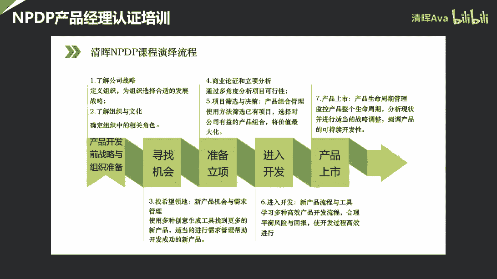

# PMO的五种定位及对应核心工作目标和评价指标 - P2：项目管理办公室（PMO）落地实践与解决方案 - 清晖Ava - BV13x4y157Yx

啊啊。

啊啊啊，啊啊啊啊哈哈哈哈哈哈哈。

啊啊啊啊。

啊啊啊啊，啊啊啊，啊啊啊啊。

啊啊啊啊。

啊啊啊啊。

啊啊啊啊啊。

嗯好时间差不多了啊，然后呃首先呃欢迎大家来参加，今天我们的一个沙龙的一个分享啊，然后线上的小伙伴看看我的声音是不是正常啊，如果正常的话呢，在讨论区给我个回复吧，啊具体音量音量情况怎么样了，一个分享啊。

然后线上的小伙伴看看我的，好的那我看到大家的回复了啊啊声音正常，那我们就正式开始啊，啊然后今天非常荣幸能够接受清辉的邀请，然后来跟大家来分享，关于我们p m o落地实践与解决方案，这个专题啊。

嗯之所以提到pm的落地实践呢，其实更多的嗯一定是从以往的经验中，会给大家呃，详细去列举一些我们所谓的一些具体的做法啊，包括我们的一些案例啊，一些具体的事例，甚至一些模板啊，然后希望能够尽量能给大家一呃。

能够提供一些价值或者帮助啊，但是其实我想说嗯所谓的具体的一些实践，并不是说嗯是绝对的，有对绝对的对和错，或者说我们是有异常不变的这种实践啊，更多的其实是要大家去结合自己实际的情况。

自己企业里的实际的项目和业务的情况，然后去考虑怎么去做呃相应的一些应用，或者说一些适配和裁剪啊，所以呃其实也愿意跟大家就这个话题。

我们做一个详细和深入的探讨吧，好那么首先我先做一下个人的一个自我介绍啊，那嗯我本人主要是聚焦在it服务行业啊，所以我今天所讲的一个主题里面的一些案例，也可能会聚焦在i t it领域啊。

那我早年可能更多的是集中在啊软件研发啊，后来又在做系统集成的项目啊，然后包括近几年可能更多是聚焦在it互联网啊，这种产品研发啊，那更多是产研测的嗯，我会习惯于给自己打这几个标签啊。

那这几个标签也便于大家来对我啊，有一个了解和认识，第一就是说啊，我本人所经历的这种啊，企业的这种性质上来讲呢，主要还是集中在国企和民企啊，这种两种类型的企业啊，然后另外就是说呃其实大公司和小公司呢。

主要想说明的就是说啊，大公司相对来说它的机制体制比较健全对吧，我们可能更多的是在一个既定的一个管理，成熟度的框架下，然后去考虑我们自己的一些管理的工作，怎么来做，那么小公司呢。

相对来说其实是一个初见的一个状态，所以你更多的要考虑怎么去从无到有，建立起一些相关的一些规章，嗯啊第三块的成熟期和初创期，那这两个可能更多会针对于我们的p o的一个，状态对吧。

那我们的p o有可能说是一个嗯成熟期的啊，一个从从有到优，你要去建立一些完善一些相关的一些制度，流程方法等等，那也可能是初创期，你从0~1啊，你要你要做的一些相关的一些尝试，嗯不好意思。

我看到有同学反映说麦的声音有点小是吗，那我再调一下啊，稍等，不是这个东西的视频的程度怎么样，好我们接着继续打吧，然后我现在是不是特别大的一个状态了啊，嗯然后提到初创期啊，初创期p m可能更多。

我们要考虑嗯，从0~1你要新建一些东西啊，所以其实第二块和第三块往往是一个交织的一，个状态对吧，那你说大公司它有可能是嗯，大公司可能更多的是一个成熟期的pm啊，但是大公司也有可能说。

我的项目发展到一定规模之后，然后我希望能够去初创啊，我希望能够去新建pm，会是这样的一个状态，那小公司一般我们一般是会新建这个，pm的状态啊，应该是自己的两种不同的经历和工作状态啊。

然后最后运营和项目管理，后面会给大家讲到，其实它是我们企业战略落地的时候的两个呃，比较重要的一个关联的方式，好落地的方式，好那这两种关联方式呢，其实呃我比较有幸就是之前在工作经历中，基本一半一半啊。

一半的经历是在做企业的宏观的呃，运营运营管理运营分析啊，然后另外一半呢就是在呃，可能说近10年可能更多的是在聚焦在项目管理，组织自己的p m v的整个的建设啊，好那今天呢想跟大家分享的一个主要的议题呢。

啊主要是分成这几个部分啊，那第一就是说想跟大家聊一聊，我们p o整个它的一个诞生啊，它是在什么样的环境下，在什么样的契机下啊，他会诞生这样一个组织，那可能会从宏观和微观两个层面。

我们都会去聊一聊pmo是怎么去产生的，然后在pmo产生之后呢，其实我们就要探讨它整体啊，他在组织里的一个具体的一个定位啊，那这个定位呢其实也关系到它整个的功能啊，或者说它的整个的价值的呈现啊。

我们的p m o到底会有什么样的价值啊，会去得到企业内部相关的管理层，还有包括我们的一线团队的认可，然后下面呢我们就会针对整个po的一个，核心的功能啊，给大家做一个详细的一个啊一个一个阐述啊。

可能会啊举一些相关的一些事例啊，然后最后就是我们整个对于p o的一个能力，评价的过程啊，那这个过程也非常重要，就是嗯po其实是要得到大家的一个认可对吧，所以其实呃要给他一个正确的能力的评价。

你才能够知道它整体在组织中，它具体的一个位置啊，和它所呈现的一个能力好，那么我们现在就进入到第一部分啊，关于po是如何诞生的，呃我我不好意思，我在看我们讨论区，我不知道现在我们的声音是不是正常。

然后还需要再我再调节一下吗，或者我再把声音再调大一点，这样的话呃大家可能或可能会啊，可能会大家会觉得声音如果很大的话，我可以再把大家可以再调小一点啊，这个基本上我声音两个两个地方。

两个地方的声音已经调到最大了，好那我们现在继续啊，那关于p m的诞生呢，啊那提到其实pm怎么诞生的呢，其实我们首先就会就会提到项目对吧，因为没有项目就不会有项目管理，那没有项目管理呢。

我们也不会去讨论p m，因为p m o更多的是在组织级的角度去考虑，项目管理工作怎么去部署安排对吧，那从这张图上呢，其实我们就可以看到啊，公司呢会有一个中长期的啊，我们所谓中长期的一个发展战略规划对吧。

它是我们一个中长期的3~5年的一个滚动的，一个嗯发展战略规划的一个目标对吧，那在这个目标的基础上呢，我们要讨论战略规划怎么落地的时候呢，其实从上到下呢，我们就会有一个纵向的一个分解，那大家看这个分解呢。

其实是从我们整体的一个年度的一个，经营计划啊，也就是说战略，首先35年的规划要分到年度对吧，年度我们可能会有面向外部的董事会的，那也有面向公司内部的啊，不管怎么怎么样，它是一个年度的经营计划。

然后再往下面走的话，就会到我们整个的项目和项目管理啊，整个这这个这样的一个定位啊，大家看到整个项目管理一个定位，也就是说从上到下，项目是相对来说我们最小的一个管理颗粒度。

或者说我们企业内部管理工作的一个，基本的工作单元对吧，那其实我们是通过项目管理，通过项目目标的实现项目的啊，这个逐渐的这个单个项目的成功的逐渐的累积，然后然后我们从下到上呢，我们去不断的去完成啊。

年度目标啊，乃至整个公司战略规划啊，战略目标的一个交付和实现啊，所以嗯大家可以看到，其实项目管理在我们整体战略落地中的一个，非常关键的一个地位，它可以说是我们公司企业里。

战略落地的一个关键的一个纽带对吧，这也是为什么我们近几年p o在嗯，整个本土内的企业，它的受重视的程度会越来越高，大家都希望把我们的p m做好，甚至说我们企业里曾经没有pm的企业，希望去新建pm啊。

去成立p m，然后这样能够促进整个组织级的项目，管理的成熟度的提高，好那说到战略啊，整个战略和项目的一个啊衔接呢，其实我们就会提到这个比较经典的这张图啊，这个来自我们pmi的项目组合管理标准啊。

那p m的项目组合管理标准呢，它会把我们企业内部的管理工作呢，会分成三个层面，第一个层面呢就是我们啊，大家看到我画圈的部分，第一个层面其实是我们要讨论组织的愿景，目标使命啊，包括他的战略规划啊。

这样的一个方向的一个工作啊，大家知道大家知道这样一般是我们的呃，企业内部的战略规划部啊，会承担这样的职责，他基本是要给企业定未来3~5年的方向啊，定方向的这样的类型的工作。

那下面就会从呃最高级的这个战略往下分解，那就会分解成两类的工作啊，第一类呢是我们企业内部的运营管理啊，那所谓的运营管理呢，其实它是大家知道运营的一个性质啊，它是周而复始的对吧，它是循环往复的。

我们在重复的做一些事情，但是其实这些重复的事情往往是，我们把它希望之前做的不错啊，做的挺好的，然后把它继续做好啊，继续进继续更好的去做下去，这是呃运营这类的工作，然后另外一个范畴呢。

就是我们所谓的项目管理啊，那这个项目管理呢从广义的角度来说呢，它其实是包括项目组和，项目机和单项目的管理啊，那这一部分的工作其实是说，我们之前可能没有做过的一件事情，我们希望把它立起来对吧，我们立个像。

或者说之前呢我们做的没有没有那么好的工作，我们希望把它用更好的方式去展现出来啊，所以所谓项目，一定是我们希望去转型，我们希望去突破，我们希望去创新一件事情，我们才考虑用项目来做。

所以今天我们其实探讨的课题呢，嗯恰恰是这一部分啊，这一部分那其实也是所谓的组织级的项目管理，组织级的项目管理，其实是通过我们整体啊项目组合，项目集和项目管理的一个，嗯持续的一个运行和实践。

然后从下到上去更好地去交付我们组织的战略，然后让我们的组织呈现出更好的绩效啊，更好的这种状态，以及整个在市场中竞争中的一个非常好的，一个持续的一个竞争地位和竞争优势，好那讲到这儿呢。

其实从宏观的角度上来讲呢，其实我已经讲到了，就是我们p o这个组织结构就诞生了啊，大家知道其实它承载的工作呢，其实就是从组织机的角度来考虑，我们的组织级项目管理怎么来做对吧，那po诞生之后呢。

我们企业内的项目管理工作呢，就可能会划分成这两个条件，大家看到第一个条件了，是我们的单向的执行管理，那单项的总体管理呢，更多的是我们要考虑单向的目标怎么去实现，对吧，我们有单向的要求。

但项目的相关的一个绩效啊，绩效的考量，然后我们每个项目都会呃，由我们的项目经理带领项目团队去完成，我的项目标，那第二个层面就是我们p o要考虑的就是，多项目的运营管理，多项目运营管理嗯，怎么理解呢。

其实就好像好像我们去开车一样啊，那么开车一定会在呃，比如说我们一定会在驾校里去学习一些，驾驶的一些规则对吧，那pm就好像是这样的一个驾校啊，他要告诉我们，具体行使的一些规则是什么样子的。

然后呢我们的司机就会上路对吧，你上路去把你的把你的每一辆车开好对吧，它就相当于是我们的单向在路上去行驶，所以行驶的时候其实你一定要考虑，就是说我既定的规则是什么，比如说你不能去闯红灯对吧，你不能压线啊。

然后你也不能去，比如说驶驶驶入一些公交车道啊，等等这样的规则啊，所以它其实是大家知道单项和多项目这么来看，其实他们两个两个之间的一个管理的一个，一个一个边界，其实是他们的关系是互为支撑，然后互为影响的。

而且呢也会我会因为定位等于他们两个之间，其实是以此去成就的这样的一个关系，也就是说我的多项目运营管，我要制定一些规则的时候，那我一定要考虑单项目，目前他的现状是什么样子的对吧。

就好像我们中国的这个中国的交规，和这个美国的这个驾驶规则为什么会不一样，对吧，你要考虑国情，你要考虑现状，而你的这个而你的多项目这边管理，制定规则的时候，其实你也会影响单项对吧。

你制定的规则一定会会会会干预到，具体我在驾驶的过程中，我怎么去怎么去更好的去把我的车开起来，把我的车在低风险的情况下，不会出现交通事故的情况，把车开得更好对吧，所以两个两个之间的关系应该是互相支撑。

然后也会互相影响，然后也会互相作用，而且是彼此牵制的好，那么其实前面聊的可能更多。

是我们从宏观的角度来讲，为什么会，呃不好意思，我现在声音正常吗，啊我可能要离麦稍微远一点啊，我现在再调一下啊，大家再听一下具体的一个情况啊，啊然后我们刚才讲到了，就是从宏观的角度来讲啊。

我们的整个pm就这样诞生了啊，那从微观的角度来讲呢，其实我们会每个企业里会不一样对吧，结合自己的企业内部的一些，业务和项目的发展情况会不一样，那么一般企业里会怎么去诞生p m o呢。

其实这里面也给大家做了一些举例啊，呃首先啊我们来我们来看一下啊，首先就是说啊缺少战略规划，项目目标的观点途径哎这个很重要，刚才其实讲了很多这方面的课题啊，就是我们企业内往往会可能会犯一个呃。

可能会有一个问题，就是我们战略是一套啊，然后项目又是另外一套，那你战略和项目之间如果没有任何的关联的话，会导致一个什么问题，其实往往是我们的战略是实现不了的对吧，因为说白了就是说一套做一套对吧。

上面说一套，下面做一套对吧，所以你怎么去战略建立这种关联关联途径对吧，这是p m要考虑的问题，第二难以协调多项目之间的资源冲突。

哎这个也比较常见，就是当我们如果只有啊像上一页ppt，我们只有单项目之间管理的时候，那么我们每个项目是不是为了实现自己的目标，会去增强企业内部非常优质的资源对吧。

一定希望自己的自己的自己的项目团队，全是专家啊，全是高级项目经理，那样才能保证你的目标完成对吧，那是不是需要一个机构去协调这种资源冲突，如果大家都去争抢优质的资源，企业内的优质资源毕竟是有限的对吧。

我们怎么能够保证嗯保证多项目的成功对吧，这个整个资源的协调啊，其实你要你要你要做整个项目组合管理，后面会给大家讲到啊，渠道缺失啊，这个也非常常见，就是我们会发现企业发展的，发展到一定规模之后啊。

企业非常大啊，业务非常广啊，项目也非常多，这个时候你会发现企业内部的高管或者说ceo，他每天在做什么呢啊很常见啊，ceo一般会在办公室里面，然后每天轮着跟几波高管在不同的不停的。

不同的高管在不停的开会啊，几波高管在开几波会议啊，往往是这么个状态啊，但是你会发现它其实可能对于公司的业务，只是一些嗯重大业务，重大专项啊，甚至战略级的项目，他很了解，但是普通的这种一线类的。

这种具体的一些执行工作，或者说一些中小型的项目啊，他不可能都知道的对吧，精力是有限的，而这种时候其实我们pm有一个很重要的功能，就是你要把高层，这个纵向的信息通道，你要把它打通啊。

其实你要把这个信息建立信息通道建立起来，如果你不把信息建立起来，这种输送的通道，你不把信息呈现出来，所谓现在比较流行的一个词叫信息的可视化，对吧，如果信息不可视化的话，那么你谈何去解决项目的问题对吧。

如果连最基本的项目的情况都不了解，那就就更谈何不了这个解决问题了对吧，所以这个是整个信息的一个互通啊，然后另外嗯第四和第五其实是有关联的，就是嗯所谓啊项目成功的经验无法复制啊，也是这个问题。

就是我们企业内部，可能仅仅是你去承担了一个标志性的一个，一个项目啊，比如说一个政府类的大项目，然后你就可以实现整个企业的一个成功，或者说企业品牌知名度的一个一个一个，真正打响了知名度嗯。

然后这个知名度其实是可以给你带来，源源不断的合作的，外部的合作机会，商业机会啊，各种各样的合作和洽谈嗯，但是后面带来的源源不断的项目，你怎么能够保证他们也同样和之前的项目一样，成功啊。

所以这个其实也反映了我们企业内部的，一个普遍的问题，高管亲自上，但是你可以把这个项目做成功，你这个项目是说白了就是纯人质啊，成功的后面的项目你都能上ceo去上马吗对吧，你都能让高管去亲自往前冲嘛对吧。

你怎么从法治的角度来考虑，我怎么去保证项目有一个成功运行的机制对吧，这个时候，其实pm的作用就会就会就会凸显出来啊，然后后面还包括嗯，缺少公司级的项目管理制度规范啊。

还有各业务部门项目管理水平参差不齐啊，这个也很常见，就是我们的我们的我们的各个事业部啊，大家如果没有，你没有从公司层面去考虑组织级项目管理，怎么去怎么去配置啊，那么就会呈现啊，你这个各个业务部门。

其实是一个百花齐放的一个状态啊，大家就是有的部门管理水平很高啊，把项目管的很好，基本上可以达到90分的水平，那有的部门呢可能就是一个60分，甚至不及格啊，50分的水平。

所以这种情况下其实是从组织机的角度，你要告诉大家啊，我要大家每个部门都要达到80分的水平对吧，那你而且你要告诉大家，80分的标准是什么对吧，主要是标准是什么，那你要把大家的水平都要拉到80分对吧。

那些90分的你当然有余力，你可以发挥啊，你可以做得更好，但是你这个五六十分的，我们一定要达到80分的水平，否则你这个五六十的五六十分的这个部门，一定他的项目会出问题，公司的企业内部的这些这些项目。

一定是会砸在这种五六十分的这种部门的，这个这个这个这个这个水平上啊，所以这个是其实是很危险的，这个时候你就要考虑，我怎么从公司级的角度去去去建立，这种规范化的这种制度和流程。

好那后面还其实还包括很多的原因啊，包括比如说跨部门战略级的项目啊，如果公司有一个这种类型的项目，谁来协调啊，谁来管，可能只有p m更合适对吧，还有项目经理的生产能力，这个我也挺常见的。

经常碰到很多企业会说，我的项目经理普遍水平能力很低，我其实需要一个p o，能够去去给项目经理赋能啊，给项目经理去做一些能力建设培训认证啊，整个能力的认证相关的工作，去提升大家的能力对吧。

然后你要提升能力，其实就关系到啊，你整个项目和项目经理的绩效评价怎么去设置，怎么去建立啊，这个后面也会给大家讲啊，最后包括我们整个嗯组织过程资产啊，这个也非常重要，就是我们如何把我们的嗯项目。

项目知识去把它储存下来，然后去做整个项目和项目之间横向的拉通，让大家去去去分享啊，然后去吸取教训，然后能够去嗯，能够去站在前人的肩膀上继续往前走，而不是去呃，而而不是去，不是去重复的去犯错误啊。

所以这些其实是我的一些列举啊，然后我后面其实还写了个未完待续，大家可以看到嗯，你你其实可以从你的角度来出发，去考虑我的企业内部去建立pm，他的一个契机和原因是什么啊。

然后你也可以给我们的管理层去提供建议，我们需要这样的一个组织啊，不并不一定一定要成立pm，但是你需要这样的一个角色和职责啊。

去旅行这个企业级的项目管理的工作，然后让我们把项目做得更好，让我把项目管得更好，呃好聊了这么这么多啊，那我的第一项议题基本上差不多啊，然后诞生了之后呢，我们其实就要考虑怎么去对我们的pm去定位啊，定位。

然后让它体现价值值好，那从pm的定位上来讲呢，呃首先我们呃我比较倾向于用pm box啊，因为它是我们的一套嗯，项目管理的行业内的一套圣经啊，它会拉起我们的一些概念和标准啊，那从pm box来讲呢。

它对pm的pm的定位呢，它会把pm分成这三种类型啊，第一种类型呢啊，第一种类型相对来说是一个低空，低控制力的类型啊，低控型的啊，那知识型的更多，他会担任这种顾问的角色。

然后让为我们的项目去提供啊所谓的模板啊，最佳实践啊，或者是一些培训啊，然后他们会给项目提供相关的一些信息和经验，教训啊，它相当于是一个项目的资源库，但是呢他不会对项目去行使具体的控制职责啊。

它仅仅是一个啊是信，是一个信息库的这样的一个角色啊，然后第二种类型相对来说中控一些的啊，对项目有一定控制力了啊，那控制型呢会在支持型的基础上，他会考虑，让我们的项目要服从他的一些治理要求啊。

比如说他要啊，让我们的项目去采用它的一些框架啊，一些方法论，一些模板，甚至一些格式或者工具啊，一些流程啊，他会要求项目去服从他的智力，然后最后呢最后比较高空的一个类型，就是我们这个指令型的啊。

指令型的它会直接去管理和控制项目啊，然后项目经理呢也会由p o去那么去派出啊，然后他也会向pm来报告，但是大家看到其实不管是低空中空还是高空啊，嗯我觉得是适合自己的就是最好的啊。

并不一定说你一定要达到指定型这种高，控制力啊，然后你才能够凸显你的价值，然后呢才能够对项目起到啊，起到真正的控制作用啊，其实并不是这样的，我们每一种类型的p o，可能在企业的不同的发展阶段啊。

啊由于它的定位啊，可能会产生各种各样不同的问题，需要他去解决啊，所以还是适合自己是最好的啊，那我们业界也有相关的专家啊，会把我们的p m分成更多的类型啊，后面这个图是大家可以看到它的类型。

会有这么多的类型啊，比如说嗯它会加一个顾问性，那顾问型的一般是指的是比较成功的，这种教练和导师啊，然后他会转型去做我们的pm啊，他就相当于一一个是那种嗯，资深的老专家的那种形象啊。

那这个老专家不仅仅是他的这个年龄老啊，还有就是他的这个资历啊，他真的是很资深，然后是一个专家型的这种任务，然后他就可以说是指点江山啊，然后告诉我们年轻的项目经理，哎你应该怎么去做项目啊。

你这个项目这么做会有问题啊，什么之类的，他就会这样来做啊，这也是一种类型的pm嗯，然后包括我们的战略型啊，那战略型呢更多的是刚才提到，其实我们企业内部有一个战略规划部，对吧，那我们的战略规划部呢。

它往往会考虑啊，我的战略不仅要考虑怎么去制定好，那你还要考虑，就是说战略怎么去具体的去落地啊，那你要到落地这个层面，就会涉及到具体的项目对吧，他会考虑整个的嗯战略的一个分解啊，然后到整个的项目啊。

我怎么去选择项目啊，怎么去批准项目啊，然后最后呢通过项目的累计，能够实现年度的目标，最终能够交付战略啊，所以嗯所以这个其实也会有一个问题啊，大家会带着问题会来思考啊，思考我们今天的一个主题啊。

啊如果企业内部已经有了一个战略规划部了，然后这时候又出现了一个pm啊，那么pm和企业本身的战略规划不在整个啊，这个战略解码啊，项目组合管理这块职责上面，他们就会有一个相关的一个边界啊。

那你这个边界应该怎么去设置，才能让这两个部门能够啊能够都其乐融融吧，能够多很好的协作，很好的去交付自己的部门的目标啊，其实这又是一个嗯另外一个探讨的一个课题了，啊，好那我们呃提到了整个pm的一个定位啊。

然后就会关联到它整个的一个价值啊，然后定位我再多说一句吧，就是呃其实我们往往会我们的企业，往往会从一个小切口切入啊，然后你去开始去组建pm啊，然后去解决企业当前的一个主要的问题啊。

因为pm往往是因为发起者，认为其在项目管理方面有欠缺，去成立了这样的结构啊，成立这样的机构，所以他一定一开始是为了解决问题，去去去去去找准他的定位啊，但是呢慢慢的你会去丰富啊，你会去完善啊。

让自己丰满起来，让自己的职责全面起来，这样的话你往往最终呢我们企业内部的p m嗯，一般会成为一个复合型的，或者说混合型的批发pm啊，并不一定是某一种类型占主导，它往往是一个混合型的pm啊。

那我们就来看看，如果pm是一个啊复合型的啊，或者说它的一个全功能的类型的p m啊，它的价值和整个的功能会分成什么样的一个，一个条件啊，嗯那我本人会比较倾向于把我们po的这个功能，或者价值分成嗯。

比较简单直接的分成两条主线啊，那第一条主线呢就是我们的啊知识服务，第二条主线呢叫监督控制啊，那所谓的支持服务呢其实是说啊，我们要从整个组织机的角度啊，你要考虑一些最基本的规章制度。

你要考虑呃去怎么为我们的项目，去要求项目服从我们的治理啊，那这里面举一些例子，比如说我们的整个的项目组合的优先级管理啊，那这个是关系到整个的战略解码啊，就包括我们整个要做啊，项目的一个相关的一个识别。

我们首先要识别项目对吧，然后你就要对项目去做分类，啊分类我们的项目，然后去做整个项目的一个评选，和相应项目的一个初选啊，你要把项目整个选择的一个过程，纳入到整个的这个组合管理中去，然后你选择项目之后。

你还要对项目去做排序对吧，你要只有排序的项目，你才能对项目有优先级的管理对吧，最后整个项目组合的平衡和批准的过程，也会在这里面啊，所以大家看到这一部分的工作呢，他会相对来说比较基础。

就是说你其实首先要把我的项目的数据库，或者说项目组合池，你要把它建立好对吧，后面你才能够考虑你这些项目你怎么去管啊，你要行使什么样的管理职责，或者说你怎么去监督控制对吧，首先你要先把项目建立起来啊。

所以这个项目组合，其实更多的是要解决你的项目的设立啊，首先是项目设立，然后才是项目的嗯，整个的评审啊，分类分级，然后整个的排序等等这样的问题啊，这是第一块，那我们呃有了项目之后，项目设立之后呢。

我们就会开展比较重要的两项工作啊，那一个是我们要考虑项目全生命周期的流程，制度建设啊，你要去设置相关的一些项目的一些节点啊，你要考虑怎么去把控这些节点啊，把控这些节点，你会通过整个流程制度啊。

包括评审的一些落实去把控，同时呢你的整个的信息系统建设啊，那这一部分其实是你的一个工具建设啊，就是说嗯有了制度流程，我怎么去固化啊，那如果是纯线下的一些手工的工作啊，你会发现嗯他就会啊。

大家没有那么容易去改变自己的一个，既有的习惯吧，我习惯之前那么做了，尽管你你提供我的方式很好，但是我我就是不习惯这么做啊，我经常会忘了应该怎么做对吧，那这个时候你其实是建立一套系统啊。

你往往可以把大家的一种行为去，把线下行为线上化，你把它搬到线上，然后大家就用你这套系统运行一段时间，大家就老用这套系统也没有办法啊，没有别的方式去做啊，然后就不得已就最后就慢慢就习惯了。

往往是这么个过程啊，所以你要去考虑整个系统建设，去固化一些东西对吧，而且也会更加方便大家的一个日常的一些，工作和行为，然后下面就会说我的整个的项目经理的培训啊，项目经理的能力建设啊，那这个培训呢。

其实我更想把这个培训这个词定义的更加呃，更加怎么说更加大一些啊，就是他可能不是说，你简简单单给项目经理去做个培训，然后给他充实一下它的知识体系就够了，其实你只要从组织的角度去考虑。

你怎么去让大家有这种所谓的，项目管理的这种意识啊，项目管理的这种思维啊，你要去从项目管理的文化的角度去普及啊，向大家去普及啊，我的项目管理的一些相关的一些方法论啊，然后让大家去去做项目的时候。

会用嗯这种比较比较项目，项目管理的标准方法论去思维去思考啊，去执行他的项目啊，那你说大家如果用这种思维方式去思考，和执行的话，那么大家一定要用规范的方法去做事情，那他出错的概率是不是就会很小对吧。

所以其实这是一个嗯，我觉得是一个细水长流的工作，反倒是应该呃缓慢的不断的去渗透啊，然后去普及文化，普及整个转变大家的思维和观念啊，然后另外就是说项目经理的能力建设啊，这个其实啊哎呀今天这个笔不太好用啊。

项目经理能力建设呢，可能更多的是你要考虑给大家一个啊，资质认证啊，你要给项目经理，po其实应该是嗯，我觉得做的好的pm应该是项目经理的家哈，那项目经理其实是在pm里能找到它的归属感。

然后也能找到他的嗯职业发展的一个通道啊，你会给他建立这样的一种资质，认证的一个体系啊，嗯然后再往下，其实这一部分呢又和我们的能力建设，直接相关啊，就是你怎么评价我们的项目经理啊，你可以从初级到中级啊。

或者说从中级到高级了对吧，一定是啊，你要去不断的去评价他目前的绩效，是什么样子的对吧，他的绩效好了，那你自然就可以给他去提高一个级别，让他去承担更高量级的项目对吧，那你要整个他的整个项目和。

涉涉及到项目经理的绩效评价的机制，你怎么去建立，好这就这这就是一点啊，然后最后就是关于我们的刚才提到，其实我们的项目的知识管理啊，那知识管理呢其实你是打通整个啊，刚才提到，其实我们纵向的信息共享对吧。

你要把它打通对吧，那么横向的信息共享，你其实是通过这种组织的经验教训的分享啊，这种知识库的这种积累啊，然后打通这种项目和项目之间的，横向的信息共享啊，所以这个也很重要。

就是你如何去让大家嗯建立一种分享的机制啊，然后大家一起去分享经验教训，然后考虑我怎么去把我的项目去啊，避免之前发生过的问题啊，呃避免之前做的不好的地方啊，然后让我的项目去做的更好，好那大家会发现嗯。

知识服务就像我刚才说的，他其实不会针对具体的项目啊，那他更多的是从组织层面考虑，我怎么去建立一种机制啊，然后下面就会到我们整个的一个，建筑控制的一个过程啊，那监督控制就会真的会是。

扎根到我们具体的项目里面，你要对项目去行行使监控的一个职责，嗯其实我还是想拿刚才的这个，拿了刚才的例子打比方啊，就是我们我们的我们的司机，绝对不是说在驾校里学了规则之后，然后你到马路上之后。

就没有人没有人帮助你去执行这些规则对吧，其实监控就是相当于我们的p o，其实要帮助大家去更好的运行这些规则，然后更好的去运用这些规则去啊，少犯错误啊，然后更好的去理解这些规则啊。

可能大家一开始是不理解的，所以你要带着大家一起去做对吧，只有有了这个过程，你其实才能够把规则真正去落地，好所以这里面会有啊，我们包括我们的流程的阶段性的评审，的一个组织啊。

那这块呢大家会发现它更多的是哦他会跟前面，它会跟我们这个整个制作流程的建设，会有一个直接的相关性对吧，你前面建了制度流程了啊，那我这块儿我就要去去把制度流程去落地，不要去通过阶段性的评审的组织。

然后考虑整个制度流程的过程中的一些时间啊，所以啊他们是互相去去验证的啊，然后另外就是啊，阅读里程碑状态的一个监控和汇报啊，这个提到，其实它是一个给高层的一个纵向的信息沟通，那它是两个层面的。

第一就是说项目经理他要去对pm啊，有一个有一个项目的汇报对吧，然后呢，我的p m o呢也要给我们的高层管理层啊，去呈现项目的一个项目，及项目组合的这块的一个状态汇报啊，所以它会有两个层面的信息互通。

嗯然后第三就是我们阶段性的复盘总结啊，其实这个也会跟呃也会跟前面有相关性对吧，就是你的复盘总结啊，其实就是你要考虑怎么去分享知识，怎么去经验教训总结啊，然后让大家能够借鉴，能够吸收能够借鉴啊。

嗯然后最后呢还会有这种嗯，我会单独把项目风险问题一个变更，管理单独提出来啊，就是其实p m o去管理项目的时候呢，你是要管理项目的十大知识领域的啊，但是呢风险问题和变更呢。

恰恰是最最重要或者说最难管的一个一个领域，它也是最综合的一个领域啊，那其实风险会增加很多风险，比如进度会有风险对吧，成本会有风险，然后我们的资源会有风险，感情的管理会有风险，我们的嗯。

我们的这个外包采购会有风险啊等等啊，其实很多很多事情都会关联到风险哦，那这个时候其实你啊，我觉得可以说我们不管是项目经理还是pm啊，其实你要能够把风险关好了，你其实就可以真的说是这个项目。

应该说已经成功一大半啊，所以会是这样的一个关系啊，这个这个这个风险的课题，其实大家是应该着重去考虑的，不管我们是做项目经理还是p m，嗯好，那我们继续啊，嗯然后后面最后一个就是我们整体的运营分析。

其实呃运营整个项目状态的运营分析，更多的是希望大家能够从啊，站在pm的角度来考虑，整个宏观的一个项目的一个运营情况，你要对项目做通盘的了解，这样的话，其实你才能够给管理层去提供相关的一些，决策的建议啊。

包括你对项目风险的把控啊，然后你对于项目整个状态的一个预判啊，其实我们之前会用这种呃项目信息的这种啊，指示灯的方式，比如说红灯黄灯，绿灯去给项目去打这个指示灯啊，打这个风险的一个一个一个报表啊。

那这个指示灯呢往往是po，你要通过对项目总体的一个运营情况的分析，然后你有自己的判断，然后你才能够给项目啊去打出这种灯，而不是说啊，然后你说我去问一下项目经理啊，这个项目应该是一个什么状态。

那如果是这样的话，其实你pm整整个你对项目的一个控制力度，你就其实是失去了你自己的话语权好，所以你要对项目，要通篇要用这种运营状况的一个了解，然后你才能够去给我们的管理层。

去提供相关的一个管理决策的一个建议，所以嗯这两部分呢呃我画的比较乱啊，其实标红框的这一部分呢，我还会在第三部分给大家做一个，详细的一个讲解啊，那这两部分不管是支持服务还是监督控制呢。

嗯其实嗯两部分其实也是会互相的去交叉啊，然后互相的去去牵制啊，然后当然你你你前面要定一些制度流程对吧，然后你要你要去实操的时候，去实际执行的时候，你要用监督控制去做，同时呢你通过实际的项目的监控。

你也会发现你之前既定的一些规则啊，是不是是不是纸上谈兵，是不是不切实际，对不对，是不是浮于表面，去做相应的一个修订啊，所以这两部分其实他们也是一个相辅相成，然后互相支撑，互相促进啊，两部分做得好。

这样的一个状态，好那最后呢我们呃我们来看一看嗯，具体的这个p o的整个发展过程啊，那这个是我自己的一个总结啊，那首先就是说啊，po呢，一般呃，第一阶段会经历整个基础建设的一个阶段啊。

包括你的整个的项目组合管理，你的项目的设立啊，信息的一个相关的一个统筹管理啊，然后你要考虑整个制度流程的建设啊，然后信息系统的建设，其实也是为了我们项目的一个可视化管理。

你要建设要建立整个组织级的项目数据库，对吧，嗯然后最后你还要考虑整个项目的一个，度量体系的一个建立，就是说这个什么意思呢，你的项目度量体系呢，嗯往往是你在嗯最开始的一个基础建设阶段。

你就要考虑我对项目分类分级之后，那我们每一类项目我怎么去评价我的项目对吧，你一定会考虑每一类项目会有什么样的，一系列的成功标尺，或者说你的一些啊度量度量指标啊，对去。

你可以去监控我的项目的一个整理执行对吧，然后你在过程中，或者说你在项目计划以及执行的阶段，你才会考虑我怎么去设定具体的目标值，以及呢我用实际的绩效来和我的目标值比对，然后我来查找偏差，我来纠偏，我来嗯。

我来有一些具体的改进措施，让我的项目能够符合我的目标啊，符合我的目标，达到一个比较好的执行状态，然后你在最后的项目结项的环节，你才会真正去做整个项目的绩效评价，也就是说最终评价我这个项目。

是不是呃一个达标的状态，或者说一个呃偏离目标的状态啊，所以大家会看到整个项目度量体系，在在这个头的地方，你就要把它建立起来啊，如果你不建立它的话，你其实没法去过程中取监控项目的执行对吧。

你去评价目标的偏离，那你在项目结项的时候，其实你也没法对项目做一个最终的一个评价啊，所以它实际是一个啊，你需要一开始就要去把它立起来的一件事情嗯，这个度量体系，一般我们在建立起了一些规章制度啊。

你就要考虑整个项目监控的工作啊，那这个监控呢其实也是要落实前面，你去制定一些方针和原则对吧，那就包括我们的关键流程节点啊，要去做评审工作的组织，确保我们整个项目管理过程的分啊。

整个合规和整个风险的一个可控啊，然后另外就是说啊状态报告啊，其实刚才提到，就是说我们要建立整个啊纵向的啊，这种信息互通的一个渠道啊，然后实施阶段的评审，就是我们要对重大的里程碑啊。

就要做相关的一些评审总结啊，这个也是整个啊成功标尺的一个回顾，我们要回顾他的一个成功标尺的一个啊，达成情况啊，然后你要适时的去决策，我这个项目是继续还是退出啊，是这样的一个状态啊，然后最后呢。

整个项目执行过程的一个推进落实啊，这个这个这个我会把这个职责写到p m，大家会考虑一下，为什么我们的项目执行的推进落实，是项目经理的职责对吗，但是p m o，为什么会在项目监控环节去把它纳入进来啊。

其实我想说的一点就是嗯，我们的p o呢，其实是一个啊组织级的项目管理部门对吧，它其实可以是它可以是很高的这么一个状态，他可以是高高在上的，他应该是高高在上的，但是你在做具体的工作的时候啊。

千万不要把自己变成一个，高高在上的一个状态啊，嗯就是你你其实是要去去对项目的执行过程，你要去深度参与的啊，而且你要让大家有一个感受，就是你其实是来帮我忙的啊，你不是来监控我的啊。

你也不是来看着我干活的啊，如果大家如果你和项目团队之间的关系，是大家觉得你是来看着我干活的，那你觉得你的你的这个pm的工作，可以可以开展的了吗，或者说你可以开展的很顺利，很正常吗，大家一定会防御。

你一定会抵制你的对吧，那当你真的和团队去打成一片的时候，其实你要去去做一些具体的工作，比如说帮我们的团队，去协助他的一些问题的解决啊，有一些问题其实是项目经理，很很很很困惑的问题啊，他解决不了的。

或者说是一些跨部门，跨项目的资源的一些协调啊，资源的一些冲突他解决不了啊，甚至是啊有一些问题，可能他这个层面他解决不了，他希望能够公司的高管啊，公司的更高级别的管理层去出面帮他解决，去给他提供支持对吧。

那这个时候，那他又往往感觉一个人孤军奋战的时候，其实po你恰恰能够帮助他，去去跟企业去要一些支持，要一些资源对吧，去为我们的项目经理去啊，总之是帮助他啊，其实是帮助他，而且是而且是啊。

你要把自己的目标和项目经理的目标，捆绑在一起，也就是说项目做好了，其实pm嗯也是有很大的成绩的对吧，那我们的目标其实是一样的，把项目做好，就是我们两个人共同的目标。

那我其实也是应该帮你去做很多呃推动的事情，然后帮你把项目落实，嗯所以这个其实也是一个切身的经验，就是我们pm和项目经理之间的一个关系啊，和项目团队之间的一个关系啊，恰恰就决定了整个pm工作的一个开展的。

一个深度和开展的一个程度，好，那最后呢嗯嗯，那我们企业往往是这两个阶段，会螺旋去滚动去做啊，就是说一开始可能是嗯基础建设先为主对吧，然后你做了一段时间之后，你就要做项目监控啊。

然后这两个阶段最后就是会一起来做啊，一起来进入到一个并行的一个状态啊，然后最后呢我会把我们的第三个阶段啊，平阳坡的第三个发展阶段定位为卓越中心啊，那卓越中心呢嗯不是一个新词啊。

那我这里的定义呢是卓越中心，是更多是要提炼组织内部和外部的一些，项目管理最佳实践，然后来组织所有的嗯项目团队都能够去享用啊，你所提供的最佳时间，或者说你的一些培训和研究成果，然后这样呢。

你能够去支持和指导我们的项目团队，从而呢最终提升整个类组织级的项目管理水平，那这里所包裹的工作呢大家看一下啊，那首先呢培训啊，其实刚才讲了很多培训了，那我所谓的培训更多的是提到，就是它是一种文化。

一种认知，一种思维方式的转变啊，需要我们的pm去缓慢去渗透，把这件事情慢慢的去嗯慢慢的去转变啊，其实我是发现啊，特别是我们的一些比较初级的一些嗯，一些嗯就是比较原始化的一些项目。

管理水平的一些一些企业哈，它往往这个过程其实你是很难去很难去做的啊，是需要一个很缓慢的过程啊，他如果在一个原始的状态，你会发现嗯p m o跟他说的一些东西吧，它其实不是特别能理解。

就是你们俩没有站在一个比较嗯比较平行的，这种互通的一个通道上去沟通啊，就完完全就感觉是鸡同鸭讲的这种感觉啊，就你跟他说一些东西，他完全不理解你在说什么，然后他提了一些问题呢，然后你也会感觉到啊。

这个这个思维，怎么会在这么一个比较初级的一个水平呢，真的会是这样啊，嗯然后所以你你其实嗯真的是要把这个东西，要给大家做传播啊，让大家这个认知水平首先要统一，你们才有整个对话的基础，对不对啊。

这个是第一第一方面啊，然后第二就是我们整个项目经理能力认证啊，那刚才其实提到，我们po需要给我们的项目经理去建立一个啊，我们的呃能力的认证体系啊，对吧，那cpo要从项目经理角度讲。

比如说初级中级高级专家总监啊，你要设置这样不同的级别啊，每一个级别你需要具备什么样的资质啊，什么样的经验啊，什么样的一个能力啊，甚至你什么样的证书对吧，你就要把这个通道给大家设立起来啊。

啊那这个工作其实很多企业啊，很多企业做很多企业在做，但是我认为呢，其实真的把这个把这个事做到家的企业，目前在我看来本土企业我是没有见到的啊，因为这个事情是比较复杂的一个什么事情呢，首先你要去把你的。

你要需要把整个企业内部的，项目经理的一个一个情况啊，你要做一个通篇的一个调研啊，呃你要了解现有的项目经理，他们是什么样的自制经验对吧，然后在这个基础上你去设计整个的通道啊，然后你让项目经理去修。

像嗯打怪升级一样，去一级一级的去升对吧，然后同时呢，去和我们的项目去匹配对吧，你的项目首先要有分类分级对吧，然后你的你的整个的项目经理的能力，你要和这个项目之间的级别，一定是高量级的项目经理啊。

去去做高量级的项目，要去做复杂的项目，然后低量级的项目经理去做简单的啊，初级的项目对吧，嗯然后你要把这个体系去做匹配，然后匹配的过程中你就会发现有问题，什么问题呢，往往一个比较比较显著的问题。

就是我的这个我的项目啊，发现都挺难做的啊，都挺复杂的，但是我现在的人呢，好像能承担高量级项目的人特别少啊，基本都是初级的初中级的项目经理啊，那我这个人能力差这么多怎么办呢。

啊然后你就会发现你这个整个的真正体系呢，你就要重新去考虑怎么设计啊，你要去，那你人你不可能重新去全都换一遍对吧，那你要不要考虑这些人，你怎么去提升能力了对吧，你会关联的这两个这两个就会关联啊。

其实这三个都会关联，然后你要考虑怎么去提升他的能力啊，然后你把这个体系真正建立起来，其实是一个嗯，它是一个符合学科，不是一个单一学科啊，他会和其他的很多的工作会产生关联，然后你需要有一个系统的思维。

系统的思考，你才能把大家把所有的这些方面，都要联动起来啊，然后把它建立起来，所以这个事情不是说我们企业做的不好，而是说它是一件比较比较不容易去，做好的事情啊，需要去系统思考啊。

嗯然后下面就是整个的绩效评价啊，那这部分其实又和我的能力认证是关联的啊，这这三部都很关联，关联性都很强，嗯大家会发现绩效评价其实不难做啊，就是评价项目吧对吧，我后面也会给大家讲，我们怎么去评价项目啊。

那评价项目不难，难的是什么呢，难的是你要通过你对象的评价啊，通过呃项目逐年累加的这种历史的评价，然后你去抽取和识别我们企业内部的最佳时间，好，那这个最佳实践一定是企业内部做的，比较好的项目。

你把它识别出来，作为你企业内部的最佳时间，也就相当于企业内部的一个标杆对吧，这个标杆你要去分享传播，然后让大家按照这个最佳时间去做啊，让大家按照最佳时间去效仿啊，去执行自己的项目啊，那你会发现啊。

这个过程的一个比较困惑的难点，就在于，我们企业往往识别不出所谓的最佳时间啊，为什么呢，因为你的这个整个的绩效评价啊，还是说到这个整个的项目绩效评价，衡量项目的一个标准啊，其实你是得不到企业内部的嗯。

所谓的广泛的认同，或者说客观的评价的，大家会往往觉得你对于我项目的评价标准，其实是啊没有那么的公正，或者说有一定的问题，有一定的瑕疵，那这种时候你用有瑕疵的评价项目的标准。

然后来识别企业内部的最佳实践啊，那你可能这条路就嗯就很难往下走对吧，你会你会碰壁啊，所以你会发现嗯卓越中心的工作真的很不好做，因为他是需要前面的工作有一定积累的，你如果前面做不扎实啊。

前面还有问题在徘徊，你其实是很难，我们的企业是很难走到卓越中心这一步的啊，你就算做的话，也可能是浅尝辄止，不可能把它做深入做全面做完善啊，但是大家要理解差，其实是我们整个p o的一个啊。

最终的一个目标啊，你的一个啊我们的职业理想，我们的职业追求吧，所以大家要考虑怎么来向着这个目标去努力，好那这一部分真的讲了很多啊，然后我们下面就详细来看一看，po的一个核心的一个功能。

啊那pm的核心功能呢，我想跟大家说以下这几点啊，这几点呢我觉得都比较重要，嗯而且呢大家也都目前的pm会都去践行啊，都去践行这些相关的一个职责啊，所以我们讨论起来会更加有更加有感觉。

好首先我们来看看嗯项目管理流程制度建设啊，嗯这个课题呢大家会发现，现在市面上所有的pm都在说，我要建设嗯全生命周期的项目管理制度流程啊，基本上pm都在做这件事情，我们来看看这件事情有什么雷啊，有什么坑。

我们要注意，那首先就是说嗯，我们项目管理流程在建立之初呢，啊这里想给大家就讲这一个点啊，嗯那我们项目领域在建立之初呢，大家一定要考虑自己的项目类型啊，或者说你的业务性质啊，根据你的项目类型和业务性质。

你要把项目分成两类啊，第一类呢是我们的市场化外部项目，什么叫市场化外部项目啊，更多的是他会有啊，我们也叫它是客户型的项目啊，这是有外部客户的，然后呢你需要去整个先关注客户啊。

然后去考虑客户的一个具体的一个，商机的一个推进啊，有了商机之后，我们确认商机，然后开始整个商机赢取招投标的过程，最后我们签订合同哎，会有前面整个销售管理的过程啊，那这个过程呢嗯主要的提示就是说你要考虑。

如果是市场化外部项目的话，你的项目管理的流程，整个的流程的环节的管控要前置啊，前置到什么时候要从销售立项开始啊，你就要开始考虑你的项目怎么管，一直到最后项目实施结项啊，会是这样的一个全链条的一个流程啊。

那为什么呢，因为你在销售立项的时候，其实你的项目经理就要介入了对吧，你其实要跟售前一起去看收钱的解决方案对吧，然后你的投标的过程，项目经理要参与对吧，你像投标书，我们我们的投标文件里。

往往会包括我的具体的实施方案啊，对这部分实施方案其实是以项目经理为主啊，项目经理其要要要要去亲自去参与去做的对吧，因为你是实施人啊对吧，你是最终的实施的，实施的这个角色要考虑实施的一个方案。

然后你整个的嗯，整个的这个售前的一些技术交流啊，你也要参与啊，其实是保证你对售前的这一块的一个一个一个，知晓的一个状状状态啊，嗯那那么和市场化的外部项目对应的，就是我们的非市场化的内部项目啊。

那这一部分项目呢其实就是说啊，没有收钱的环节啊，没有销售的环节啊，直接就可以取项目实施啊，那比如说我们的嗯往往是内部的，比如集团公司，集团公司有子公司对吧，那集团公司可能亲自给子公司一个项目。

让子公司去做啊，那其实你是根本不需要销售过程的对吧，还有就是我们呃公司内部的啊，公司内部部门和部门之间的这种项目的，这种这种这种承接啊，那其实你也不需要销售过程了对吧。

那这种类型的项目就相对来说比较简单，你就是从项目立项开始啊，一直管到整个实施和结项啊，管项目的执行管，管理的一段到端的项目管理流程啊，就可以了，嗯那好，那这里面我给大家举了举个例子啊，就是这两个事例。

一个是我们的销售管理流程，一个是我们的项目管理流程啊，其实它是一个啊会有一个衔接的关系啊，然后大家会看到嗯我们的销售管理流程呢，嗯它会分成这几个阶段啊，然后整个先首先关注客户对吧，然后啊商机确立之后呢。

我们其实啊这个是标志性的节点啊，现商机确立之后，我们就进入到整个的销售立项的一个，确认的一个环节，那销售立项的环节确认之后呢，我们就开始解决方案上了啊，我们开始给客户做这种定制化的解决方案啊。

啊然后啊差不多做了一段时间，我们就开始整个啊会有啊，可能会有招投标的这么一个商机赢取的过程啊，然后参与整个的投标评审啊，然后最后呢合同签订，然后我们进入到整个合同实施的一个环节啊，嗯所以大家会看到啊。

我们销售管理流程和项目管理流程，就会有个衔接对吧，我们项目管理流程呢整个是在啊立项前阶段啊，这里面呢其实就会啊清晰的描述，我们在整个销售管理的环节，我们项目经理要做的事情啊对吧。

包括他要整个去参与售前技术交流啊，然后去规划实施方案啊，然后参加投标评审啊，这个投标评审里面有内部的实施方案，是实际是需要项目经理去亲自去做的对吧，然后最后完成立项啊，完成立项呢。

我们一般还会建议就是到啊项目的计划阶段啊，这个计划阶段呢，我们项目经理一定会和我们的啊售前的团队啊，包括解决方案和销售经理，我们会有一个严格的一个售前交接的过程啊，就说售前你其实参与了对吧。

但是你只是一个参与的一个角色，你是一个辅助的角色，不盈利为主啊，那么售前的具体的情况，你其实是要有一个啊所谓的合同交底会啊，或者叫说啊叫做售前的一个项目交接对吧，你要跟销售和解决方案。

把售前的所有的情况都啊清晰的去让你知晓啊，相关的文件啊，相关的事事情都要交代交代清楚啊，然后你这个项目经理财可以什么，才可以开始做项目，比如说你要啊西华wb s组建项目团队。

然后去完成整个项目管理计划文档，然后开始keep off meeting，好项目启动会啊，回到整个项目实施的一个过程啊，嗯所以这里面其实想跟大家强调的一点呢，就是我们之前其实有一个很通用的词语啊。

我们这个词叫优生优育啊，一般我一般呃，我一般和别人提到这个词，大家都会笑啊，所谓的优生优育呢，就是说我们的项目其实就像我们的孩子一样，你这个孩子嗯，你这个孩子肯定不能等到他出生了之后，你再考虑啊。

怎么给他补充一些营养啊，或者说给他嗯报一些什么这个智力开发的，一些一些早教班啊等等之类的，你其实是在这个孩子孕育的过程中，你就要考虑去定期的去产检对吧，然后你要孕妇也要补充营养对吧。

你要把它优质的生下来吧，生下来之后你再考虑怎么去优质的去培养他，然后把他培养成才好，那其实我们的项目也一样，你如果在前期孕育的环节，你对他不闻不问啊，然后等到他合同签了啊，这个合同交到项目经理手里啊。

那这个时候其实会有一个普遍现象，就是我们项目经理往往一拿到合同之后就说啊，这个项目我肯定我肯定做不好，我肯定会做杂的，那项目经理为什么会这么说呢，就是会你会发现，我这个合同就是一个落不了地的合同啊。

我这个项目必定会失败啊，因为我前期已经孕育了，所有的风险和所有的过度承诺，然后把这个把这个合同交给我，他就是一个坑啊，让我项目经理去填啊，项目经理嗯，他是填不了这个坑的对吧。

这也是为什么我们经常说项目经理要背锅啊，那其实那你作为项目经理，你就要考虑怎么去怎么去，怎么去少少少填这种坑啊，或者说少背这种锅啊，少背你不应该去背的锅啊，所以你就要售前，你就要参与整个售前的环节。

去把你的整个项目管理过程去去去潜质啊，这个其实我我觉得是对嗯，对销售和解决方案，其实我是个人没有成见啊，但是大家要知道，我们我们做事情的出发点是不一样的，销售和解决方案一定是在售前。

他们的主要的一个目标是签合同对吧，他不会去考虑具体的项目实施，我先把合同拿到再说，拿到手再说，所以这时候他可能会把我们的项目啊，就是呃就是他做一些过度承诺，其实是是是是有可能的对吧。

那如果前面你其实项目经理能够配合他们，去把这个事情去更好的推进，其实你能够把关啊，然后纠偏对吧，能够把一些不切实际的这些这些过度程度，能够在一定程度上去去去减少啊，所以其实能更有利于你在拿到合同之后。

把项目更好的做成好，其实讲了很多项目经理的事情啊，所以这里面我其实也想说的是，po我们在考虑整个流程设置设置的时候，其实你要给项目经理把一个道关，你要给项目经理一个呃一个方向啊，一个一个一个正确的路啊。

让他去走啊，所以这也是po的一个非常重要的职责，好那我们在啊流程真正设置好之后呢，还会有整个审批的过程啊，那这个呢其实我就不再详细去讲啊，那我们的流程审批呢，你要结合你的企业内部的实际的情况。

你考虑审批的一个设置啊，那我们目前企业内的审批，往往会采用线下和线上结合的方式，那线下呢我们一般会啊，用这种召开评审会的方式啊，去把大家都组织在一起啊，群体决策啊，大家一起决议，一起讨论啊。

一起说出你的一些问题，和和你认为的一些风险一起讨论，然后线上呢我们也会去走一个流程，然后大家去点一点审批对吧，然后你也会上传相关的一些立项报告，一些文档啊，技能储存文档，然后你线上呢也能踩上。

每个人都踩个脚印对吧，能够最终呢也能够合规，也能够审计可查啊，会是这样的一个过程。

好那么嗯正好就说到线线上这个事情啊，线上这个事情呢，我们就来看看整个的信息系统建设这些工作啊，那这个整个项目管理信息系统的建设呢，也是我们啊企业内部啊非常重要的一项工作，因为涉及到整个管理工具啊。

那项目管理信息系统的选择呢，其实和其他的信息系统选择啊，我认为其实也有很多的啊相似的地方啊，其实没有什么所谓的啊绝对的差异啊，但是他唯一唯独的这个比较需要大家关注点的，话，就是所谓的对pm的一个挑战。

嗯嗯首先会提出一个问题啊，就是如何选择，或者研发一套较为合适的相关的信息系统啊，大家看到这个这个题目啊，嗯其实我已经揭示了我的两个两两个倾向啊，第一就是说什么叫较为合适，就这个事情其实没有绝对的合适。

然后你也别想去找到一套，完全和你的企业内部的管理成熟度，完全和你的项目的特点啊，你的业务的成熟度完全匹配的一条信息，你是找不到的啊，你能找到能够达到70%，或者甚至80%的一套新系统。

能匹配你的需求就已经相当不错了，我认为啊所以这个这个事情不用纠结，也不用追求完美啊，那一定是较为合适的，就就已经不错了啊，这是第一个观点啊，第二就是说啊如何选择或研发啊，其实就是嗯。

就是就是就是揭示了我们的两种两种方式啊，要不就是外购，要不就是自研了对吧，只有这两种方法，那么嗯外购这个事情呢大家可以看到啊，其实外购它的本身的一个含义不外乎是从市场，外部市场区嗯，多加比选。

去选择一个比较成熟的软件供应商，的成熟产品对吧，嗯他的一个嗯它的一个总体特点呢，一定是说嗯我买现成的对吧，买现成的其实我就不用不用自己研发嘛对吧，他一定是缩短研发时间啊，研发时间基本上是没有的。

然后你能够很快的推广使用啊，拿现成的东西就直接用对吧，那它的缺点是什么呢，缺点事实啊，前面省了啊，后面省了研发时间，那你前面选择的时间，你这个省不了对吧，而且你这个选择的时间往往还是嗯比较复杂。

选择的过程比较复杂，为什么，因为你你要对上啊，管理层要满意啊对吧，管理层他要去用这套系统去看项目信息，他要满意啊，然后对象呢你的用户啊，其实是你的一个大的一个系统，的一个使用的一个群体啊。

那这个群体其实也要对系统相对来说功能啊，可用性，易用性啊，各方面都要满意嗯，所以相对你要对上对下都能够统一达成一致啊，选择一个啊成熟的产品啊，所以其实这个过程啊来回来去的啊，不断的调研。

不断的征求意见啊，不断的讨论啊，这个过程其实就蛮漫长的对吧，然后另外就是说嗯，往往我们从大企业的角度来讲，你要去选择一个供应商，你还要进行比较严格的这种采购的流程啊，可能会招投标对吧。

在这个过程就相对来说就会耗时更长啊，所以这个大家要有心理准备，就是外购其实不是一件简单的事情对吧，然后呃自有程度会比较低啊，这个什么意思呢，就是啊你y go的系统，其实它的代码是不向你开放的对吧。

那你想去修修改改啊，其实没那么容易对吧啊，不是付钱那么简单啊，付钱可以改，但是有些东西底层架构的东西，我们付钱也改不了啊对吧，它的系统的一些底层的一些固定的一些架构，你是改不了的。

所以他一定会会让你感觉到，有些东西是完全是不适用我的企业，而且你无法改变的啊，你会很无奈啊，这是一个现状对吧，然后系统之间的对接复杂啊，啊，这个大家会理解，就是我们企业内部往往会有一个啊信息化统筹。

信息化建设的一个部门啊，然后他会考虑我们企业内部的所有的信息化系，统，怎么去进行相关的一个部署，和相关的一个规划对吧，那如果你的所有的系统都从外部去外购的话啊，那么就会涉及到对接的这个比较复杂性。

每套系统之间都要对接啊，那大家知道我们的项目管理系统，往往会成为比较焦点的一个对接系统对吧，你要去对接嗯，企业内部的hr系统吧对吧，你要去拿项目资源啊，然后你要对一些采购系统吧，你要考虑项目的外购。

然后你还有财务系统可能要对接了，因为有成本预算嘛，还有包括你oa系统对吧，你要走审批流，你要肯定是对接oa系统啊等等等等吧，总之项目管理系统这块对接会相对来说，相对来说比较复杂，然后最后就是嗯较难满足。

完全满足管理需要，这个也是刚才提到的啊，所以大家会看到这件事其实啊蛮不好做的啊，所以p m啊，整个的挑战就是说你要你要产品选择的挑战啊，耗时耗力还不一定大家都满意对吧，怎么去达到一个相对平衡的状态啊。

然后你的系统的响应速度啊，就是说你既然已经外购了，那么供应商的配合程度就要高才行，对不对，如果供应商配合不好，那直接也会影响整个系统的一个绩效呈现啊，然后还有就是可用性和易用性。

这个是关系到整个用户的一个使用感受，大家一定要知道嗯，你要做系统一定是用户为王啊，所有的用户是你最大的一个啊，使用的一个群体啊，大家一个满意度才是真正的满意度，绝对不是说上面管理层满意，然后大家不满意。

你这个系统也可以做的很好啊，肯定不是这个概念，好，那么呃其实嗯其实我们我们，我我以前所做过的一个公司啊，就是我们其实是外购的一个外购了，一套比较成熟的项目管理系统工具，然后我们在应用的过程中会发现啊。

有了这样那些的问题，然后我们觉得这套系统非常不好用啊，那恰好呢我们当时呢，公司内部也有这种自研的团队，有这种资源的能力啊，所以我们就在嗯一边用啊，然后我们自己又在一边自言啊。

然后就逐渐的去想把外购的这个系统替换，我们用的是这种方式去做啊，所以大家会发现啊，那我会讲到这块自研这块啊，那自然大家会发现它其实是，他其实条件和门槛是比较高的对吧。

首先你内部有研研发的这种团队和力量对吧，那光有研发还不够，你还要有设计的这种力量，就是你要去有这种系统系统规划啊，整个系统设计的能力啊，然后让研发团队去实现对吧，然后同时呢你还要有什么。

就是管理层支持这件事，管理层支持你投入人力物力，还投入时间很漫长的时间去研发啊，这个都是要有一个啊天时地利人和的条件，你才能过去这么做啊，所以大家看到啊，我们的自研这套系统呢它也会有啊。

你的外购啊所说这个不存在的这种啊，就是他的优点和缺点其实对对应的啊，那自研的这套系统相对来说，你自己有程度比较高对吧啊，你也可以实现管理执行度啊，你的系统对接也比较顺畅。

而且呢你可以根据管理需要灵活调整啊，就是我们企业永远都不是一成不变的对吧，你一定会嗯，特别是基本上可能每个月都在变对吧，那这个时候你你怎么去灵活去配置你的流程啊，你的系统去跑。

你的相关的一些管理的一些规则啊，那如果你嗯外购的话，就很难去实现这一点能够灵活调整，而且一般我们买一套系统就就挺贵的，然后过程中你再想去定制开发，你再想去修修补补，再去改啊，费用也挺高的啊。

所以这块呢啊关键是不灵活，而且关键是还还慢啊，他不会那么快给你改，他要排优先级对吧，那所以呢嗯其实我们自研这块嗯，优点是很明显的，但缺点就是说，我们是需要整个的自研团队的能力。

而且包括我们的整个的研发的周期会比较长啊，啊那p o的挑战其实也蛮大的，就是说啊，p o要整个主导这套自研的项目，的全生命周期管理，你要把这个系啊，把这个系统的研发啊。

把这个系统的整个从设计研发到推广上线，作为一个项目去管理，那p o你要占比较主导的一个作用啊，那我们之前的p o呢，其实它要从整个系统的一个规划啊，从系统的一个啊规划啊，总体的规划开始。

然后他要考虑整个需求的一个调研啊，然后他要去亲自去做整个系统的详细设计啊，所以pm里面会有一个相当于是产品的一个团队，啊啊做这件事情，然后然后后面我们会把整个的一个需求去啊。

整个设计的方案去跟研发团队去做沟通啊，然后这个时候你也会发现啊，又是一轮pk，就是研发团队和我们的呃，p o是两个平级的部门啊，他们是没有所谓的甲乙方的关系，那这个时候呢就会发现。

就是嗯就往往是你说的一个事儿啊，他们呢就会给你挡回来，然后说啊你这个不切实际，你这个需求不切实际，你这个需求啊那个是做不了啊，其实往往是不是真的做不了，而是实话嗯在实现基础难度上比较大啊，他们不想做好。

所以就会有这种pk，然后最后你的系统研发完之后要上线了对吧，你还要去考虑整个系统上线的一个啊，用户的这个啊，从用户角度来来说，你要做测试啊，你要做用户测试，然后你要做整个上线的培训宣贯，不好意思。

今天嗓子稍微有点不舒服，好我们继续嗯，然后整个玄幻上线之后，你还要考虑整个运营过程中的一些支持啊，因为用户他会提出各种各样的问题对吧，然后他会去啊，有一些是系统固有的一些bug对吧。

你需要去责成研发团队解决，还有一些就可能是可能是新的一些需求对吧，那这些需求你其实是需要去对接，你要考虑怎么去怎么去实施啊，然后去做还是不做，还有就是怎么做啊，优先级怎么排对吧，这些东西都是让你去考虑。

而不是说你让研发团队去考虑，这个东西怎么来做，研发团队是没有这个没有没有没有这个决策的，一个一个一个一个思维和能力的，好，然后嗯，所以其实我们更多的企业是，会从两者结合的方式啊，就是从外部市场去买。

然后买完了之后呢，我们再根据企业的特点去做一些二次的一些适，配，二次的开发啊，那这里面想做的一些提示，简单来说，第一就是说啊尽量能够选，其实前面我都已经说过了啊，啊尽量选择能够灵活配置。

简单易用的对吧啊，攻防配合程度也要比较好一些的系统啊，然后充分沟通调研啊，上下一致啊，这个是在前期你就要做好沟通调研，然后后面呢啊充分的一个上线准备，也就是说你其实要做整个用户的啊培训啊对吧。

然后让大家去很好的去把它用起来，而不是说我前面做了一套完美的系统，最后没有人用对吧，所以整个用户这一块的一个关注啊，你也要持续关注啊，然后定期的这种需求评审会议啊。

就是刚才提到大家会针对系统去提出新的需求，那你接到需求之后，你要考虑我的整个的需求，我怎么去去落实啊，哪些要落实，哪些不落实，还有优先级的排序，所以其实你是要形成一个整个的一个群体的。

一个决策的机制对吧，你要把这个东西啊拉相关的部门，相关的负责人一起来决策我们怎么来做，而不是说我pm就决定了这个事情做还是不做啊，那如果这样的话，你肯定是最后要背过的啊，嗯你要你要你要埋雷的哈。

这个事情是很危险的，然后最后呢实施和使用过程中，你还要注注重整个的一个用户的体验，和快速的响应，这个其实是还是说用户为王，大家对你的评价其实是最重要的啊，所以嗯所以多说一句，为什么一开始我们会外购。

然后后来会会会有自研呢，因为外购的时候会发现啊，这套系统真是就是系统不好用，然后骂的全是pmo，会是这样的一个状态，然后等自研了之后呢，其实也蛮好的，就是我内部研发团队研发对吧。

其实p o和研发团队两个部门，一起来承担用户的这个压力，那pm相对来说，它就会嗯稍微缓和一部分的一个压力吧，我觉得也会有这方面的一个层面的思考，嗯所以大家其实还是那句话，就是你要考虑啊。

适合你的才是最好的，什么样的方式是适合自己的，嗯然后去去考虑一个最终的一个选择吧，好那嗯关于系统这块其实说的比较多啊，千万不要去踩这些坑啊，这些坑往往是嗯，往往是会让自己变得嗯变得四面楚歌啊。

所以呢嗯然后大家也会去看，它往往里面是一些非功能性的需求啊，往往是非功能的需性的需求，会啊成为真正的一个致命点啊，比如说我的运转速度啊，稳定性啊什么之类的，像这种东西啊。

其实都嗯其实都都都是真正会起决定作用的，反倒是我们的功能性的需求啊，功能性的需求往往是你的，会跟你的整个的嗯流程，制度的设计的逻辑有关系，那这些逻辑往往我们不当不成熟的时候。

其实我们也不会去仓促去往系统上去推对吧，所以往往推上去的流程是成熟的，流程，只是说整个用户的一个使用过程中的。

一些感受啊，或者说一些问题啊，会导致我们整个的这个系统的这块的一个，绩效的一个满意度啊，会呈现比较比较比较欠佳的这样的一个绩效，好啊那啊真的是聊到了绩效评价啊，我们来看看项目的绩效怎么来评价，好嗯。

项目绩效，整个啊我们针对项目绩效评价的一个流程啊，大家看一下这个流程呢，首先呢我们会在啊立项阶段呢，我们会确定整个项目的一个，绩效评价的一个方案嗯，那针对绩效评价方案呢，我们在整个的项目计划阶段呢。

我们就会针对评价方案去确定，我们整体的一个啊各项的一个项目内部的一个，kpi的绩效目标啊，比如说我们的项目的进度，要达到什么样的程度啊，成本要达到什么样的一个可控啊。

甚至是我的一些收入和利润的一些指标啊，确认我的一个度量指标啊，然后在实施的过程中呢，我们就会监控整个目标的一个技巧，实现和我的这个指标的一个吻合度对吧，然后看看有没有偏离对吧。

有偏离我就偏要采取一些改进措施啊，保证我的项目目标能够顺利达成啊，然后最后呢，我们在接项阶段，就会要对项目去做一个完整的一个绩效评价，评价这个项目啊是不是一个啊，是不是一个比较成功的。

或者说是一个绩效比较好的一个项目啊，那嗯那整个项目的一个结项的一个评价呢，其实它也并不一定会在我们最终项目，结项阶段去做啊，有可能根据企业的性质，比如说你在项目的阶段过程中，就会去做相应的项目的评价啊。

或者是嗯，或者是你在嗯整个公司的一个自然年度中，比如年终啊或者是年底啊，这两个阶段啊，你也可以对项目去做相应的一个评价啊，所以这个就是啊具体是按需来做就可以了啊，总体来说这个流程是这样的好。

那我们来看看整个项目绩效评价的一个呃，一个体系啊，那这个体系其实也是一个模型啊，这个模型是一个以往的经验，那么呃首先呢我们的整个项目的绩效评价呢，我会定义为啊鸟对它的一个项目。

kpi目标完成的情况去做一个评价啊，那这是第一个维度，也是非常重要的一个维度，那所谓的项目的kpi目标呢，其实它是会最终会贡献到我们整体公司的一个，年度经营目标的完成对吧。

它会起到一个单项目的一个贡献的目标啊，比如说项目的刚才提到收入成本啊，利润啊，或者说它的进度啊，甚至是它的质量目标啊等等啊，这些目标呢会贡献到年度的公司的经营目标，经营绩效中去。

所以他嗯相对来说可能会也会占比，较大的一个权重，那项目光去贡献公司的经营目标还不够啊，它还会有一些自己的一些特性的一些指标啊，反映他的一些项目特性的一些指标，会成为他的一个嗯。

他的一个目标的达成的一个情况的反应啊，那这种指标就包括，比如说我会举一些互联网的，比如说我们互联网产品，一般会用这种注册用户数或者是活跃用户数啊，这种月活数啊，这种指标作为它的一个性指标啊。

反映它的一个产品特点啊，还有像我们的一些，比如说一些销售运营的一些转化啊，销售运营运营的一些系统，它会用这种订单转化率啊，作为他的一个绩效的一个指标哦，或者是我们我们会有嗯。

比如说我们会把线下人工的一些行为，去搬到线上去提高效率啊，那这种时候你可能会设置一些人效提升率，这种指标作为你的个性指标啊，这个给大家举个例子啊，大家明白一下这个个性指标指的是什么，就可以了啊。

那这两块指标呢其实是是一个硬硬性的指标啊，反映这个项目到底能不能够去实现一定的一个，一个主要的一个绩效啊，然后第二部分就会到我们整个项目的一个干净，人满意度，嗯项目干系人满意度这个事情呢。

其实大家会发现它在整个项目管理业界，它的重要性啊是越来越高啊，特别是从我们的pmbok第六版就能看出来，我们之前是九大知识领域，后来变成十大知识领域，其实加了整个干系人的一个维度。

就能看出整个从pmi的体系，对于干型人满意度的一个重要性的一个提升，而且呢特别是我们近2年啊，近几年一直在流行敏捷项目啊，大家知道敏捷项目其实我们也更强调，整个啊客户的反馈，干系的整体的满意啊。

我们会在每个迭代啊都去要求客户去评审啊，让客户及时给我们关于啊，嗯产品当前迭代的一个反馈，然后根据反馈呢我们再继续去执行啊，所以其实我们经常会说你的项目做成功了，一定是客户觉得你这个项目做的很好啊。

解决的问题，而不是说你满足了进度啊，然后你的成本也控制的很好，你质量也也也不错啊，然后也实现利润了，但是呢干系人说啊，这东西不是我想要的，你做的不是我想要的东西好，那如果是这样的话，其实你这个项目是。

是绝对不会说是定位成功的一个项目好，所以大家会看到呃，干型人满意度的一个一个一个重要性，其实我们完全可以去把他的这个权重啊，去做进一步的一个考量啊，所以其实权重是给大家建议。

权重大家可以结合自己的业务特点去调整啊，那整个维度是这样的啊，然后最后的第四个维度就是整个项目的合规性，那这个整个项目的合规性，其实也是我们po对于整个项目的一个执行了，一个过程的一个管控的一个要求。

他会要求我的项目去履行他的一些，合规性的要求啊，履行他在啊固定的一个项目这里的框架下啊，去执行我的项目，好啊，那下面就是除了这四个维度以外呢，我们还会有一些加减分项。

那加减分项呢会使这个体系变得更加的丰满啊，变得更加的完整啊，那你要酌情考虑一些加减分项，比如说我的项目，还存在一些比较严重的应收账款，或者说发生了运营故障啊，甚至有客户投诉，那这种负面的信息。

你可以把它设置成一些项目的减分项对吧，那相对来说你如果你项目有客户表扬，甚至说你这个项目可以申请一些一些特，定的专利啊，那这种情况下，你就可以把它设置成一些加分项啊，那这样呢。

其实这个维度就变得对一个项目的评价，就会更加的更加的立体啊，啊那好还是照例给大家一个设立啊，那实力能够帮助大家去落地啊，大家看一下这个企业呢，那我们会把整个的绩效评价的方案变成啊，这样的一个维度啊。

首先他会强调效益的部分啊，其实就是所谓的效益部分，就是我们整体的一个项目的kpi，目标的达成情况啊，你看他有回款成本控制进度，还有质量啊这些效益的目标啊，那在效益的基础上，我们要追求效率对吧。

那效率就包括了整个过程的复合性啊，这是合规性啊，p m的要求，包括公司的一些要求，还有相关方的满意度，其实这个是整个的一个干洗的满意啊，会有外部客户，还有内部的一个满意度啊。

用这种座位的方法方式来衡衡量这个项目啊，然后最后还有一些变啊，变量的一些指标啊，就是加减分项好，那大家看到这个事例呢，它有一个特点，就是啊我每一项呢除了要设置目标值以外啊，目标值和权重啊。

这两个当然是最基础的对吧，权重加起来一定是百分之百了对吧，最重要的就是你要考虑它的一个整个的一个，指标口径和计算方法啊，就是我们每个人对于目标值的理解是不一样的，比如说啊。

什么叫做预算完成率不超过百分之百啊，你要明确告诉大家，预算完成率是成本时期发生额比上成本预算啊，那这个比率啊低于100 百分之百，肯定就是在预算内了对吧，那高于百分之百，我怎么扣分的。

扣分规则是什么对吧，你看它是每超过一个百分点要扣0。5分啊，也就是说超过一个百分点，这个15%，这个15分就得不到满分，就只能是14。5，然后继续往下扣好，然后这样你其实有这个落地的规则。

你就能够呃最终有了实际值之后，你就可以把每一项的一个得分算出来，然后你这个项目整体的一个评价的一个打分，你就可以你就可以拿到了啊，然后你这个打分其实有很多的应用，后面就可以去用了啊。

所以这个是非常重要的一个落地的一个，一个措施，然后包括啊预算完成率，其实还好说，比如说什么叫进度计划偏离不超过10%啊，这个每个人理解都会不一样，所以你要具体定义什么叫进度计划偏离率，看到了吗。

嗯啊然后扣分规则对吧，什么样是满分的，然后怎么去扣分啊，啊这样具体的一些细细的规则，然后你把它定义下来，你才能够去最终去客观的评价项目啊，然后我们还会看整个的数据来源啊，谁能够哪个部门能够有权威的。

这种数据的一个出口啊，提供给你实际的发生，然后让你去跟计划做比对，然后你计算每一项的得分啊，所以你看一般财务的指标会有财务部来出具啊，然后其他还有包括其他的一些有p m的数据，有质量的啊。

这个客户发展中心，它是他是一个纯对客户的一个部门，他会评价购买意度啊等等等等吧，啊这个其实还是说嗯我们要考虑怎么去落地啊，嗯然后最后就是嗯最后就是这个权重哈，还是想提醒大家一下。

其实就是说你要考虑自己的项目的类型，是什么样子的考虑啊，设置什么样的权重，才能够去呃客观的评价你的项目啊，那我这个权重可能更多的是针对，常规的这种日常的项目，他一定为我们的公司要贡献他的现金流对吧。

他要成为一个日常的一个一个重要的一个呃，经营业绩的一个贡献单元，那你要考虑它的肯定是效益类的指标啊，会占有比较大的权重，那相反举一个极端的例子，比如说我是一个战略创新类的，战略创新类的业务。

那他呢往往是会嗯，为我们的企业去创造一个新的市场，那这种类型呢，其实往往嗯，我们是不追求它能够实现多少收入或者利润的，对吧，反而是我能够开拓一个新的市场对吧，我能够有这种市场开拓类的kpi啊。

反而是他的最终绩效的一个评价啊，所以你会考虑比如说用户数啊，或者说它能够达到一个落地城市的个数啊，甚至说是它能够洽谈的合作方的可数啊，这种市场开拓类的指标，反而是他的一个关键的一个kpi目标。

所以这个就真的是需要啊，需要去量体裁衣的吧，嗯好，那我们绩效评价我就想跟大家聊的就这么多啊，然后基本上其实我觉得每一个课题，我们都可以聊很多啊，然后今天我觉得是一个开篇，然后大家可以。

我们嗯我们线下在进一步的交流啊，每一个课题其实都有很多的细节啊，那下面的关于我们的关键流程节点的评审呢，嗯那这一块呃，首先还是说呃呃我我比较倾向于用pm不好看，大家对齐一个概念啊。

嗯然后我知道今天来听课的大部分学员，我其实都在我们星辉学过p m p啊啊，那我们pm book里明确提到，我们的项目是从开始和结束，会经历一系列的阶段对吧，那我们的项目阶段呢。

会每一个阶段会有一个或者多个可交付成果啊，作为整个阶段完成的一个标志啊，那所谓的阶段关口呢，其实是要对我们的每一个项目阶段，进行阶段过的审查啊，通过审查呢，我们决定这个项目的这个当前阶段。

完成的一个状况，同时呢我们就可以做出一些管理决策，比如说我们可不可以进入下一个阶段啊，或者是不是需要整改，还是说我们就结束项目就可以了，还是啊暂时要停留一下啊，还是说我们重复这个阶段啊。

所以其实我们要根据阶段啊，阶段关口的一个决策啊，我们要决定我们项目未来啊，具体要实施的一个管理动作，好那我们来看看啊，整个啊关键流程节点评审啊，那啊会倾向于这么来做啊，那这个事例大家看到。

其实他把项目阶段呢会分成这个项目，阶段的划分还是比较普世的啊，他会首先是立项啊，然后就是计划阶段，然后整个项目进入执行，然后最后验收和结项啊，然后大家会看到每一个阶段，我们都会在阶段关口设置一个节点啊。

这个节点啊所谓的这个重要的一个管控节点啊，这个节点我们管它叫pm点啊，是我们的项目的里程碑啊，项目的里程碑点，然后你看执行阶段呢，我就会有很多的pm点啊，但这里我就不再不再不再不再赘述啊。

因为你会结合你自己的项目和业务的情况，去设置不同的类型的项目的里程碑节点啊，在执行阶段啊，然后同时呢嗯这个横轴呢还会有一个，大家会看到上面有个pg点啊，什么叫p g点呢，那它是所谓的项目的控制门。

嗯这个怎么理解呢，控制门它其实是一个啊，是一个特别的一个里程碑点啊，他其实你看pc点前面里程没点，p m点是重叠的啊，那重叠的意思是说呢，它是一个比较大的里程碑点啊，为什么会这么来设置pc点呢。

就是因为我们的po啊，管理项目往往是会分层分分级的去管对吧，那当我们公司级别的pm的时候，他想去管理项目啊，他往往会用pg点去管理项目，就是比较大的里程碑点去管啊，然后到了具体的项目的一个pm点。

细节的这种里程碑点的管控，那么往往就会发下发下放给我们的事业部，给的p m啊，去管理这样的一个过程节点啊，用这种方式呢，其实你可以去做这种分层的管控，然后让我们的项目呢都能够啊。

在一个有条不紊的情况下去运行和去管理啊，那我的公司级别的po呢，你完全可以用抽查的方式，然后去抽查我的事业部及pm，对于pm点的一个管控的一个力度，和管控的一个效果对吧，这样呢其实你的项目去嗯。

理论上其实是可以都把他管得不错对吧，那具体还要看执行啊，好大家注意一下哈，这张图呢其实想跟大家说的一个最关键的点，就是大家会注意到我们每一个pm点，我们的每一个阶段关口，你要有一个完成标志。

这个完成标志实际是需要我们的p m，明确的告诉我们的项目团队，你这个节点啊，你的阶段关口如果能通过啊，你需要满足什么样的条件啊，什么叫做这个节点通过了，什么叫做这个节点完成了啊。

这个是要明确给到我们项目团队的啊，其实啊，其实完成标志跟我们敏捷项目里是对应的，是d o d啊，我们敏捷项目里会有d o d完工的一个定义啊，其实是和啊，其实是和这个概念是对应的啊。

大家如果了解敏捷的话，可以成像这么去对比，好啊，同时呢我们每一个节点，我们要去评审的一个内容，我们怎么去做评审好，评审什么东西对吧，这个是评审的东西，评审什么内容啊，这个是怎么评审评审的方式啊。

你看他是会用啊线下的评审会议以及检查单啊，既要开会要求检查单啊，然后我们来保证这个节点，你是不是满足了相关的条件，可以可以通过好，那这里也给大家举了一个检查单的例子，大家看一下啊。

那我的p p m100 点是我的啊，整个集成计划评审通过的点啊，那p o应该给我们的项目团队一个检查单，告诉大家这个节点你要完成，你要检查一些必备的一些项，好一些b选项你是不是已经完成了这个动作啊。

比如说从项目管理来讲，你的进度计划是不是批准啊，组织结构是不是建立了人力资源计划好，启动会是不是做完了对吧，还有你的技术，财务采购质量啊等等，所有的检查项都要有相关的输出物的一个要求。

而且呢我们的项目经理会在这个地方，不管你是线下填单还是系统填单，你去打勾啊，你去打你是不是已完成了，如果完成的话，你要告诉我完成时间，而且还有你的具体的输出物，你要上传相关的文档啊。

这样你每个检查点你都去通过的话，你其实才能证明我这个节点呃合规的啊，是安全的，然后呃是具备进入下一个环节的条件的对吧，我们其实是用这种方式去管理项目的啊，那如果你有一个节点不完成。

没有没有达到完成的状态，你可以去提交相关的说明，你去陈述，比如说这个节点不适用于我的项目，或者说我的项目有哪些特殊情况啊，没有达到这个要求啊，那我们再通过线下会议或者线上，我去评审的方式。

然后我来决定你能不能进入到下一个阶段哦，所以他会有这样的一个比较，比较严密的一个逻辑啊，然后让大家去去保证合规啊，其实更多的是保证我们的风险可控，而不是说我的项目，真正没有过程中的任何的这种管控。

然后到了结尾，到了项目快结账的时候，发现这个项目嗯，要不然就是亏的不能再亏了，要不就是做做的砸的不能再砸了啊，或者说过程中已经把客户关系呃，就是遭到了比较大的这种影响啊，等等啊等等，任何项目的问题。

我们不是到项目结项的时候才会发现，而是在过程中去加强整个过程中管理啊，建立这种过程管理机制，然后保证我们的项目嗯，能够能够能够在一个比较好的一个，状态下去执行，好那么最后呢我们就来看一看嗯。

也是pm比较核心的一个功能，叫做阶段性的复盘总结和经验分享，嗯复盘这个事情呢啊说到它的源头呢，其实是来自于我们联想柳传志，柳总的复盘工作法啊，那刘总呢提到我们的整个的复盘的工作，大到战略制定。

小到具体问题的解决，无论结果成功还是失败，我们都要把自己重新的去啊，百回到项目开始支持啊，重新演练一遍，重新审视，然后来看看我们的做法正确与否，条件是否变化啊，所以呃刘总提出复盘之后。

其实我们呃复盘这个概念其实特别流行，所以其实复盘其实它不一定限于项目复盘，我们可以对某一个呃大到战略复盘啊，讲到具体问题的复盘，甚至是某一个工作的复盘，甚至是我们日常中生活中某一件事情的复盘啊。

啊甚至是我们嗯其实可以说我今天做一个分享，我们也可以复盘啊，任何事情都可以复盘嗯，那今天我们主要可能还会聚焦在项目的复盘啊，因为项目的复盘是啊，使我们不管是项目经理还是p m，非常重要的一项工作啊。

那项目的复盘呢简单来说就是成功的项目啊，我要去传承成功的经验啊，然后让大家一起学习借鉴和吸收成功的经验，而失败的项目呢啊主要是我们要总结经验教训，我们要避免重蹈覆辙对吧，主要是这样的一个目的。

而在我们企业内部呢，其实更多的会对失败的项目去复盘啊，失败的项目复盘是做得更多啊，主要原因就是嗯怎么说，就是成功的项目，成功的项目都是一个样子的，然后失败的项目各有各的失败啊，差不多是这样。

所以啊其实我们要就是失败项目，它会有很多的失败的点啊，这些点呢都不一样，那你其实是希望大家能够，未来避免避免这些点啊再再次发生啊，所以其实失败项目的复盘对于企业来说，我觉得应该说是意义更大。

好复盘整体的一个工作步骤呢，就是我们首先会回顾啊，整体的一个项目的一个目标，当初期望的结果是什么样子的，然后我们就来做整个一个完成情况的一个评估，下一步我们就会分析整个事情成功或者失败的。

一个关键的一个决定原因，关键的因素啊，然后最后我们就总结经验，看看我们有没有什么规律性的东西，可以去遵循啊，或者说我们啊哪些可以去复制啊，复制的一些经验，一些教训，甚至是我们下一步的行动计划。

好那么复盘总结的角色呢，其实这里面更想说的是我们要做哪些事情啊，那首先是po啊，po呢，嗯pm的定位不仅仅是整个复盘会议的主持人啊，其实p o他要保证整个复盘流程的顺利执行性，他要成为流程的制定者啊。

流程的推进执行者，以及最终呢我们整个会议的一个引导啊，和遵循流程的一个制定执行啊，这样的一个一个一个推动者啊，所以po在这个整个啊复盘的环节，它会占有一个比较重要的重量级的一个角色啊，嗯大家会知道。

为什么我们我们项目的复盘会到po这个层面，因为嗯其实现在很多的项目自己会做复盘，我们会要求项目在结算环节去做回顾总结对吧，特别是我们的敏捷项目，我们每个迭代都会做这种啊迭代回顾对吧。

每个项目每个项目在敏捷的时候，我们每个迭代都会做复盘，那什么样的项目会纳入到整个pmo的层面，去做复盘啊，大家要考虑这个问题，那一定是我们从组织的角度，组织的层面。

希望能够通过p o去把项目之间的这种信息，去做横向的拉通啊，那项目的这种关键的经验教训，去做横向的共享啊，那这种类型这种事件当有这种契机的时候，其实恰恰是这个项目要到po这个层面去做。

做复盘的一个最根本的原因，所以其实大家可以考虑，后面也会给大家讲，就是什么样的项目，我们会到p o这个层面复盘啊，大家要结合自己的企业去考虑这个问题，好下面就是啊整体的一个嗯复盘的参与角色啊。

也是他的一个主导的一个呃，呃叙述这个复盘还原复盘事件的一个角色啊，那他可有可能会包括我们在销售环节的，销售经理和方案经理啊，然后以及我们整个项目实施团队的，这个项目经理，产品经理，研发团队啊。

相关的人员，那他会根据整个的亲身经历，去真实完整地去呈现我们的复盘事件啊，然后深入到细节里面，去提供相关最细致的事件信息，然后供大家一起来讨论，供大家一起来啊分析啊，甚至是去解决问题好。

然后再往下就是我们整体的一个啊，我们会请相关的一个呃角色，作为我们的所谓观察团，其实他是啊，他是来参与的啊，他是来听这个复盘会的啊，然后他呢会从自己的角度去提出问题，提出建议。

甚至是去他会去挖掘整个事情的一个本质啊，然后提出一些隐含的一些事情中的不足啊，所以这里就包括包括的各部门负责人对吧，你的项目组合，项目及经理啊，甚至是你的团队成员啊。

好那最后管理层会给我们做一些总结讲话啊，提出一些工作部署啊，这样也便于我们去形成管理闭环，好那复盘这个事情呢，从p o的角度来讲呢，给大家一些建议也很关键啊，那po呢嗯我看到大家会说啊，这块比较卡是吗。

这块会比较卡是吗，哦我看看啊，网络应该没有问题，嗯我们再看一下啊，我们再看一下具体的一个情况啊，我这边网络是没有问题的啊，嗯我们再讲一下啊，然后呃po这块整体呢会啊。

pmo会负责整整体复盘工作流程的一个指定啊，包括编制复盘的一个材料模板啊，那他是整个流程的一个规则和，包括规则的一个制定者啊，然后后面的pmo会整个呃，大家看到了这个关键的一个事项，就是选举复盘项目啊。

就是刚才提到了，就是我们的复盘项目怎么去选择啊，就是什么样的项目会纳入到公司这个级别，去组织复盘会议啊，那是不是我的一些战略级别的，甚至重大级别的项目，会整个到啊复盘这个啊。

p m复盘的这个环节去进行啊，甚至说我还是还有一种，可能就是说我的一些发生重大问题的项目啊，重大运营运营故障的项目啊，会到p o这个层面去复盘啊，所以其实你要结合具体的情况啊，具体你的业务的发展情况。

你的项目情况，你要考虑怎么去设置，选择pm复盘的这个项目的规则，然后你按照这个规则去选择，让pm去复盘的项目啊，这样的话呢就会分层，那一部分项目呢会在pm的层面去做复盘好。

另外一部分项目呢就会到项目团队，常规的一些项目，那么项目团队自己去总结，去结项啊，去复盘就可以了对吧，嗯好那么嗯你选取复盘项目之后呢，我们就会开始嗯跟项目团队去沟通落实啊。

也就是说po其实是指导项目团队去完成复盘的，整个的过程对吧，你要告诉大家怎么去做复盘啊，然后大家就会去按照你的要求去准备，相关的一些嗯汇报的一些材料啊，包括一些准备工作。

然后p m c这个过程中一定要去审核复盘材料，对吧啊，然后和项目团队沟通项目执行细节啊，就这个事情呢再多说一句，就是po千万不要说，你就仅仅是把这个事情制定完规则，然后就嗯然后就把这个事情组织起来。

我开个会，我做个会务就可以了啊，就是你其实要通过这个事情嗯，你你除了审核材料之后，你你其实这种关键的这种复盘项目，一定是非常重要啊，重要的，或者说重量级别的公司级别的项目，那这种项目你其实是要对细节。

比其他的项目还要格外去了解这个细节，所以其实你通过复盘这个事情，你其实是找到了一个非常好的一个机会，你能够更好的去了解项目对吧，所以你跟项目团队要去沟通具体的细节啊，通过这个工作。

你对项目能够更好的了解，然后呢你看准备复盘材料啊，就说这个材料不是说大家你发了模板，大家去写，然后你把它拼凑起来就行了，而是说在这个过程中po你也要组织你，你也要准备你自己的复盘的材料。

然后你要对这个项目去做出你的一些结论哦，你的一些一些建议，你的一些想法，甚至是p m l的一个主张啊，你对于这个项目你是怎么看的啊，你要在你要去在会议材料里，以及整个会议的过程中。

然后你要去你要去发出你的声音，所以是这样的一个一个过程，这个整个这个事情都是po要去主导的啊，所以千万不要把这个事情就把po就做做窄了，或者说你把它做浅了啊，然后你一定要把这个事情嗯。

变成嗯你去主导的一件事情啊，所以这样你才会显啊，才会去凸显整个pm的价值好，那最后呢其实结论就是最后的结果，你去组织整个的复盘会的召开，然后就相对来说会啊会是一个最终的一个结，结果，他反倒不是最重要的。

而且前面你要做很多很多的工作啊，然后这个复盘会议才会嗯，相对来说它的召开，应该是最终的一个比较顺利的，一个达成的一个目标啊，好，好这是我们呃复盘这块跟大家想分享的啊，想分享的内容，啊稍等我。

我看一下大家目前嗯声音这块都很正常吗，刚才有同学提示说有一点点卡顿哈，啊这样吧，就是复盘这一块，我看大家讨论就是说呃可能卡顿会比较厉害，嗯这块还需要我再重新再讲一下吗，我觉得如果有有有同学。

大部分同学融合能够提分的很清楚的话，我再重新讲一下的话，呃我觉得可能呃就是看大家嗯有没有这需要吧，因为大多数同学都听得清楚，我再讲一遍，大家也比较浪费时间，嗯这样吧我还是继续往下讲吧。

然后嗯我们继续把它讲完啊，然后复盘这一块，我其实想说的内容还是嗯还是挺重点的，然后其实总体来说就是就是嗯，就是我们可能会发现一个问题，就是pm会有很多困惑，然后我其实在准备这个材料的时候。

我单独单独想讲一张关于pm的困惑啊，因为我们经常会发现嗯，pm有时候经常会说，我觉得这个事情越做越没价值了，或者说有的po就做着做着把自己给作死了啊，或者说做着做着就觉得。

做着做着就觉得比自己被边缘化了啊，自己被可变的变得可有可无了啊，这个事就做着做着就做的，没没有没有没有没有味道了，所以其实我是想拿这个例子来说，你其实嗯你其实要通过一些具体的职责，一些一些具体的事情啊。

然后你要去把自己的价值去去呈现出来啊，嗯po的机会就在于你的每一件事工作啊，你怎么去把它做实做细啊，然后能把它嗯，能把他的整个的这个呃功能去体现出来啊，所以复盘这个事情啊，就是一个很好的例子。

嗯大家可以想这个事情，如果我要把它做成一个仅仅是组织一个会议，这么简单啊，那其实嗯我我我其实就不需要p o了啊，你完全可以是总裁办这样的部门，去组织这个事情对吧，但是如果你通过这个事情。

你能够发出自己非常专业的啊，项目管理的声音啊，那你其实就变得你变得不可替代，所以大家要考虑怎么去把自己变得不可替代啊，你的不可替代是孕育在你的每一项工作中的，所以这个其实是嗯比较切身的感受啊。

然后关于刚才提到其实想聊一聊pm的困惑啊，怎么去破局啊，这个专题呢讲的特别多，所以我就把把它从这个，整个今天的这个分享中拿掉了，然后大家如果有兴趣的话，我们可以再开一个专题给大家分享一下啊。

分享一下这个pm的困惑和破局啊，好那最后一个课题就是我们整个po的能力评价，嗯好那时间有点延迟啊，我尽量我尽量再把这一部分尽快讲完啊，那整个p m的能能力评价呢，我们会分成这两个部分，首先就是说啊。

po呢，它是一个推动组织及项目管理，成熟度的这样的一个部门对吧，那一定我的整个企业的项目管理，成熟度的一个能力的提升，或者说他的能力的一个定级，其实是反映了我的p o的整体的一个，推动的能力对吧。

所以这个是我呃，是我认为p o对pm能力评价的，一个非常重要的一个啊最主要的一个方面啊，那大家也知道，整个的我们组织级项目管理的程度评估，它其实是有嗯有两个维度的一个优势。

那第一个维度呢就是说从企业内部来讲，我们每年都都可以去做企业的项目，管理程度的评估啊，那通过每年度的评估，你可以发现你自己的一个能力的积累啊，你的一个上升的一个趋势对吧，你能够通过企业内部啊。

去年今年明年这样的一个纵向的比较，你会发现你自己的一个改进的方向，甚至是你的一个进阶的一个通道，是什么样子的对吧，那这是从企业内部来讲，那么第二个层面，从企业的外部来讲，我们通过外部的这种横向比较。

大家都在用同样的这种程度的评估模型，去做评估对吧，那我们可以和外部的企业去看，我们整个在市场竞争中的，我们的一个地位是什么样子的对吧，那这样你可以也通过外部的横向比较去考虑。

如何去提升组织在市场中的一个竞争力啊，所以这个模型相对来说是一个嗯，非常好用的一个东西，好那第二个层面呢，嗯好，第二个层面呢，就是说啊也会我也会经常会被问到一些问题。

就是pm窟这个部门怎么去评价这个部门啊，整个这个部门怎么去做绩效评估哈，所以这个问题啊也蛮有意思的啊，那首先呢我们来看看整个的呃，组织级的项目管理程度评估啊，大家知道我们嗯我会比较倾向于对齐。

这个pmi的标准，我们p m i其实出了一套关于我们怎么去评价，组织机的项目管理成熟度啊，叫o p m4 v，那这套模型呢，嗯其实呢pm出的这套模型其实是比较晚的，在他之前呢。

我们市面上已经有比较嗯比较多的这种啊，成熟度的评估的模型啊，可能会多达二三十种，然后来p m i才会出了这个标准，那不管是哪一套的成熟度的评估模型呢，其实大家嗯会看到，它普遍的一个思路会是一样的啊。

普遍的一个评估的思路是一样的，那都会首先呢就是说啊，我要嗯了解企业的一个现状啊对吧，然后我就开始要整个对企业的现状和能力啊，企业去具体的能力是什么样子的，我要去做相应的评估和度量，然后在度量之后呢。

我就要考虑怎么去识别，我需要具体去改进，改进的一个能力是什么样子的，然后制定相应的改进的计划，或者说我们要考虑整个要去创建针对啊，实现具体改进的一个路线图啊，我们要去怎么去分步骤，有计划的去实施改进啊。

然后我们就要去啊，下面有个计划，我们就要实施改进了对吧，然后最后呢通过重复这个过程啊，其实他是不断的往复的重复的这个过程，然后我们最后呢就会嗯，用系统化的方式去达成我们的最佳实践的目标，然后最后呢。

我们促进整体的一个项目管理能力的提高，然后最后呢能够更好的去交付，我们组织的战略啊，他都会是这样的一个思路，好那这里面就会嗯大家会看到，就是说嗯我们的o p m4 ring呢。

它会把我们的整个的呃评估的这个层次域，分成三个层次域啊，就是我们的项目，项目集和项目组合这三个层次域啊，然后这三个层次域呢，我们会根据这三个层次域里的，具体的过程和实践，我们去把具体的过程和活动。

我们会识别出适合我们企业内部的，一个最佳实践，然后根据这个实践呢，然后我们就去评估我们自己的能力啊，以及我们相应的一个能力的一个，改进的一个方案，他会按这个思路来来做。

然后大家也会发现我们基本o p m4 ，它会把我们的企业的项目管理，成熟度分为四级啊，第一集就是标准化，第二集就是可测量，然后还有可控制和持续改进啊，这四级啊，嗯所以其实我不知道大家对啊。

大大家o p m4 瑞了解多少啊，但是我讲到这，我不知道大家有没有引发一个思考啊，就是我们o p m4 呢，相对来说他的这个站位还是比较高的啊，为什么，因为你看嗯，首先他要你这个企业内不要对项目。

项目集和项目组合都应用的，相对来说是比较成熟啊，这个阶段你才可以去评估你的项目管理程度，对吧，如果你这个项目啊，如果你这个企业仅仅是对单项目去应用了，整个的一个一个pm的标准去管理，我的单项目管理。

你没有考虑项目集和项目组合怎么去管理的话，其实你是没法用嗯，o p m4 ，去评价你的整个的项目管理程度的对吧，这是第一，那第二呢，就是说大家看到我这个整个的评估体系的，第一集啊。

第一集是什么一个级别呢，就是最低的级别，他就已经是一个标准化的级别了啊，也就是说，如果你这个企业目前是在一个原始的一个，项目管理的水平啊，然后嗯或者说你只应用了单项目管理啊。

其实你连这个标准化的水平都没有达到，你其实是不用评级了，你就连第一季也达不到对吧，所以所以这也是为什么我会讲到啊，这个模型很好，但真正我们在本本土的企业里去应用项目管理，成熟度模型。

这套o p m4 的企业并不是很多啊，因为嗯就是嗯因为条件所限嘛，对吧嗯所以大家如果感兴趣的话，也可以去研读这本书啊，那嗯其实我也列举了一些，我们目前整个o p m4 的应用啊，还会有一些限制啊。

这些限制其实是需要我们去考虑啊，我们怎么从组织的层面去打破这些限制，然后把我们整个的这套模型去更好的应用啊，因为你只有应用了之后呢，其实你才能够对整个组织的啊，组织的这个项目管理的水平。

去做这种客观的评价，然后你的p o呢，其实也会有他自己的一个工作方向，和相应的一个改进的方向，然后让大家一起去考虑啊，怎么把这种组织级的项目管理工作做得更好，好那么嗯然后我们下面就讲一讲啊。

关于我们po这块的一个整体的，一个部门的绩效评价啊，然后这个也会啊，经常会跟大家探讨，大家怎么来评价po这个部门具体怎么样啊，那我们会啊也是一个模型啊，我这我这边有一个模型的一个建议啊。

大家会看到这个模型会分成四个层面，那第一个层面呢就是说呃组织的绩效啊，会占一个大约是30%的权重啊，什么叫组织的绩效呢，就是说啊，我的组织为了完成我今年的经营目标对吧。

我一定会有一些组织必然要达成的一个，kp m标，比如说我的市场销售的签单份额对吧，然后我的财务表现，我要达到什么样的收入和利润规模，才能够实现整体啊，年度的公司自己的经营目标对吧。

他这个目标往往就是说如果实现了的话啊，那我pm作为一个部门啊，其实我就啊一起跟着吃肉啊对吧，如果没有实现的话，那可能就只能喝喝一点汤对吧，所以这个是直接是一个相对来说，比较间接的一个指标啊。

但是往往是组织做的好啊，部门就自然会享受这个红利啊，就是做的不好的话，那部门可能也会有一定的呃，有一定的这种牵连对吧，所以这个指标其实也是大家比较能够理解的，一个指标啊，它是跟着组织绩效区去去联动的。

然后第二个指标呢，就是我们p o整体这个部门的一个绩效指标啊，我所谓的项目管理的一个绩效，那它也是占比较大的一个权重啊，那这个指标呢就会关联到你具体po，你要去管理项目。

你要去达到一个什么样的一个企业的要求，又会结合你的企业的业务和性质，来看这个目标怎么来设置啊，啊后面我给大家来举例啊，那大家知道这部分就是这个这个部分，就是说你整个部门的一个主要的一个绩效啊。

然后第三部分就是整体的一个能力建设啊，就是p o作为一个嗯，作为一个组织的，一个嗯职能性质的一个管理部门啊，你总是要考虑部门的体系建设，部门的制度建设啊，你的规章流程，然后你建设完了之后。

你怎么在部门内部推广，甚至到部门整个部门外部，整个公司机的推广，你怎么去做啊，一个整体的一个能力建设好，然后最后呢还是跟我们项目一样啊，会有一个加减分项啊，我们企业内部一般会设置一些安全或者合规的。

只要哦来规范我们整个部门的一个行为，好那还是看例子啊，因为例子会比较生动，好嗯嗯大家看到这个事例呢，呃它的前面这个整个的组织绩效啊，它会啊基本上这三个指标啊，市场市场销售和财务表现啊，然后呢。

下面这一部分的我们的项目管理的指标呢，因为整个这个p o这个部门呢，他是也会管采购这块的一个具体的执行工作啊，所以他会把呃项目管理和采购执行这块的工作，都会列为整个部门的一个一个一个个性化的。

特性指标啊，所以大家如果自己的pm是纯管项目管理的话，就把采购这块的指标就忽略掉就可以了啊，然后你看一下他的项目管理指标，会怎么来设置啊，第一就是说项目成本控制率，嗯那整个的项目成本。

是不是在整个的预算范围之内啊，这个是需要整个po的一个，非常关键的一个监控指标，那要求整个成本控制率是不超过百分之百的啊，也就是说要完全控制在预算范围之内，大家会看到它是一个啊成本相对来说比较严。

管控的这样的一个公司对吧，然后另外就是说交付项目，按合同约定的完成个数占比哦，也就是说比如说我今年要交付100个项目，那么按合同约定的完成项目的个数是90个，那我就达到了90%对吧。

所以你看他的目标是要求，达到90%以上啊，所以这个呢其实也可以跟大家说，这个这个企业的行业的性质啊，它是相对来说对成本和进度要求比较高的，这种企业啊，所以他会对这两个指标会看得比较重啊。

所以嗯大家会嗯大家也会看啊，就是自己的行业和业务性质会是什么样子的，然后你来考虑呃，我会重点会抓哪方面啊，然后他会成为整个项目的一个关键的绩效指标，然后也会成为我整个pm，你去评价他的绩效的一个。

非常关键的一个维度啊，所以这个其实是有很强的一个关联性的，好然后下面就是整个部门的能力建设啊，你看到他的整个部门能力建设，包括了形成配套的制度流程和模板，然后去呃整个总结部门的体系建设的，方法论对吧。

然后要形成整个部门内和公司级的推广啊，他要完成整个部门的工作建设啊，然后最后呢还有就是整个保密的一个指标，其实是一个加减分项啊，那嗯其实大家可以猜到这是什么行业啊，嗯我就不说了，大家可以猜到说什么行业。

你看他是啊盐成本管控，然后进度管控也要求很高，而且呢相对来说它还比较注重这种保密啊，泄密这种事情它是严格管控，如果发生泄密事件，他是啊完全的一个否决项啊，大家可以猜到这是什么样的一个行业啊。

所以啊其实还是说啊还是还是量体裁衣啊，大家要考虑自己的这个结合行业和业务的特点，去考虑去怎么来设置指标啊，然后所有的模型，那大家会看到它的整体的思路都会有啊，主要的分值啊，然后它具体的目标啊。

然后还有它的一个数据来源啊，最主要的是它的计算方法对吧，这个是落地的，你看具体的一个呃计算的一个口径啊，包括它的一个扣分的规则啊，都会在里面啊，所以相对来说你会拿到它之后，就会知道怎么去管理。

怎么去监控，怎么去具体去计算，还有相关的一个啊来源的部门啊，然后你会看到它的整个的评价方式啊，是季度分析，年终回顾修订，然后半年度考评，还有最终年终总结啊，总结评价啊，所以他会整个过程去管啊。

然后也会年年度年终的时候会会管理啊，然后可能会涉及到整个绩效的相关的一些啊，绩效奖金或者说整个绩效的一个呈现啊，都会在整个绩效评价的一个最终的输出里，好，那其实今天的主题内容，就我觉得就可能会这么多啊。

然后啊大家看一下，我整个今天讲了，我们一共讲了四部分的内容，然后这四部分内容呢，其实它是有啊，整体的一个逻辑的传承的关系的啊，然后呢也会说嗯，其实我是建议大家可以用这个思路去，去了解一个pm啊。

比如说啊你想了解一个企业的po，你就要问这四个问题啊，你的pm是为什么诞生的呀，啊谁成立他的呀，啊是什么样的契机下它诞生的呀对吧，那诞生之后p o是什么样的定位呢，啊它有什么样的一些功能啊。

体现什么样的价值呢对吧，第三就是说啊，我们pmo主要核心在做哪些事情对吧，最后呢嗯一般嗯领导是怎么评价我们po的，那一般他会注重看哪些环节呢，其实往往会反映到po的一个关键的一个，绩效的一个呈现对吧。

那往往你其实问了这四个问题，你就可以了解到这个企业内的pm 5，大致它目前在一个什么样的发展的阶段，或者说它大致是什么样的一个状态，你就已经很清楚了，好那这也是今天的啊总体的一个思路啊。

然后嗯我们下面就是我看时间也差不多，我们就会安排具体的一个答疑啊，然后大家可以把问题就发到啊我们的问题区，然后我尽量给大家答疑啊，如果我们想进一步的交流的话，也可以加我的微信啊。

然后备注一下pm o分享，好那我就嗯看一下大家的问题啊，ppt稍后我会给大家分享啊，然后跟我们的老师去要就可以了，这个关于pm的落地实践有没有书可以推荐，其实挺多的啊，嗯具体的书目呢。

其实呃我记得呃其实我觉得大家可以搜啊，就是有在在呃相关的一些网站上，大家可以搜有p m关键字的这种这种书，可以去看啊，或者是嗯我们的这个嗯，我记得有一本书叫业务驱动型pm啊，这本书还是不错的啊，啊。

然后还有一些pmo的一些具体的一些啊，运作的一些流程啊，一些方法，还有一些具体实践的书啊，然后也有一些之前的书，然后最近我觉得新书是比较少的，嗯然后其实我的，嗯其实我觉得po的书更多的。

大家要看一看pi的一些，组织机的项目管理标准啊，我这个我这个p p t里有介绍，包括我们的o p m4 ，还有前面的项目组合管理标准，项目机管理标准啊，其实里面就包含了我们pm要要去要去做事情。

其实你要从整个项目及项目组合的这种维度啊，你要从组织级的视角去考虑，我们的组织级项目管理工作怎么做啊，反正我是觉得啊p m l的一些标准，其实大家可以去反复的去吸收啊，反而把它运用到整个pm的工作中。

我觉得是啊是最经典的，这种业界的比较权威的教材，我反而比较建议大家去看啊，像复盘的目的，其实我刚才讲过了，就是嗯我不知道啊，我不知道我们这个同学具体想问的，出发点是什么。

我们项目复盘更多的是说你要去总结啊，你要去不断的去回顾啊，就像我们个人一样啊，我们每个人其实当你工作了一段时间，或者说你有了一段嗯，一个公司的一个相关的工作经历，其实你要不断的去总结。

然后你要去给自己做复盘，然后后面你才能够知道自己，怎么才能够更好的去改进，然后更好的去完善啊，其实我们项目复盘也是这样的一个目的，那么p o的项目复盘和项目，项目团队的项目玩的区别是什么。

其实我刚才也已经想到了，就是说嗯，哪些东西是在项目团队的层面去复盘就可以了，而哪些东西其实你要拿到公司层面，你要把它嗯，你要把它可视化，你要把你要把存在海底里的冰山，你要把它浮现出来。

然后让大家一起去讨论，一起去学习，一起去分享啊，你能够建立这样的一种学习的文化，其实也是一种嗯项目管理文化的一种传播，也是一种所谓的培训，也是一种所谓的改变大家的一种意识和思维。

那你其实是通过这些这些工作，然后去逐渐去呈现出来啊，我觉得这是整个项目复盘的一个目的和意义，如果项目发起人没有项目复盘的意识，怎么向发起人去建议开展项目复盘会议，其实呃你的项目复盘。

其实你的对象不是针对于项目发起人的对吧，你的嗯你的整个的项目复盘，其实我刚才提到的整个复盘的角色啊，大家会看到，其实它会涉及到啊各个部门的负责人对吧，项目组合和项目经理，甚至是你的公司的整个的高管团队。

你都可以把他们拉进来去做复盘，而且呢还有最关键的项目团队成员啊，这个项目团队成员不限于你自己的项目团队，还会有可能是呃其他的项目团队啊，你把他都可以拉进来，不管是相关的项目还是啊。

不相关的项目和其实项目的问题，往往是往往是相关性比较强的啊，你都可以把他们拉进来去复盘，所以其实复盘，并不是说要给项目发起的一个交代，而是说要给我们自己一个交代，而且让我们的组织的。

整个的项目的绩效去变得更好，让我们实现多项目的一个成功，嗯其实我今天讲的讲的内容里，因为我看大家有问到敏捷项目哈，其实我今天讲的内容里面，可能更多是针对我们的传统项目啊。

然后敏捷项目的其实是大家要考虑敏捷项目，怎么去做适配，而且敏捷项目的整个的项目的绩效呢，我建议大家就是说要针对啊，整个敏捷项目团队的不同的角色啊，要考虑它的整个的一个绩效的一个设计。

那所以说它的整个的项目的绩效，可能说除了项目本身的绩效以外，那不同的角色，比如p o啊，sm包括整个研发团队，你要去怎么去衡量他们的绩效，我觉得这个也其实是一个比较，比较比较大的课题啊。

其实完全可以我们再去分享，然后这一块呢，其实我们最近因为我知道敏敏捷这个业界，最近有一本比较新的一个书，也是在讨论敏捷绩效这一块的一个内容啊，所以这块也建议大家去阅读啊，比较新的一个书啊，应该是嗯啊。

具体我真的说不上来了，大家搜一下吧，敏捷绩效的这块的一个项目，绩效的一个评价，最近有新书啊，大家可以去看一下，嗯我再看看大家的问题啊，嗯有个同学问的一个问题比较不错啊。

就是他说各项目的一个人力的协调去找pm领导，不管项目的优先级，也不管人工费用，然后问pm应该怎么开展工作啊，其实这个呢建议大家要从系统的角度去思考，整个的项目的人力资源配置，我怎么去管对吧。

而不是说啊比如说这个项目嗯，比如比较普遍的一个问题，比如说我们这个项目，在用一个比较重要的资源啊，然后另外有一个突然有一个项目，就想把把现有项目的资源把他拉过去，然后就说哎我那个项目很着急，也很重要啊。

我这个项目非这个资源不可啊，那这种事这种事情发生的时候，我现有的这个项目资源怎么去对他进行安排，因为我毕竟不能影响我现有资源的工作对吧，那这种类型的事件和问题，就是说你其实要从组织的角度。

在整个项目组合管理优先级管理的时候，其实你就要考虑整个项目的优先级哦，那项目的优先级，比如说十个项目啊，从一到十，你把它的优先级排列出来啊，那么呃前面的这个项目比优先级会比，会比后面的项目高对吧。

那当你后面的项目发声，和前面的项目去争抢资源的时候，那你首先从pm的角度，你要告诉大家，就是说你要跟我说的，并不是说你这个项目有多重要啊，你要用什么样的资源，而是说你首先要把你自己的优先级提高。

那我才能够在前面的项目去给你协调相关的资，源，去给你去给到你对吧，所以你要整整个你整个的一套项目的优先级，或者资源的一套协调和管理机制，你要把它建立起来，而不是说我们发生了一个偶发的问题。

然后我们就这个问题去解决问题，那么p o的工作永远都是嗯没有程序，没有章法的啊，然后你会发现你不断的救火，你不断的去解决突发的问题嗯，而是说你自自己之前应该建立的一套体系，建立一套机制。

其实你是没有建立起来的啊，所以我们其实做pm的话，一定要有这种系统思维啊，系统的这种角度去考虑考虑问题啊，要把这种体系和系统思维建立起来，嗯有个同学问呃，项目目标和整个项目绩效评价的一个关系啊。

刚才其实我嗯可能会讲到一部分，我不知道能不能回答这个同学的主要的疑问啊，就是说嗯啊看到这一页啊，我的整个的呃项目目标，其实是整个的项目绩效评价体系的一个部分，对吧，我的项目的关键的指标啊。

项目的目标的一个完成，那同时呢我对于这个项目的评价呢，不仅仅是他要完成项目标，那像目标可能更多是从多快好省的角度来讲，比如进度怎么样啊，成本怎么样，质量怎么样啊，这样的一个呃一个角度去维度去讲。

那同时呢你其实是要考虑一个呃，内外部的干型的关系啊，除了干系人满意度的话，还包括我的整个的项目的合规性，其实合规性更多的是要求他要具备pm的满意度，还有公司高管层啊，高级管理层的一个满意度对吧。

然后再加上你的内外部的人员的一个满意度，还有包括你的项目有没有一些重大的问题，风险故障等等啊，那这样的一个全维度的一个对象的评价，其实才能够啊，对项目去建立起比较客观和全面的一个，评价体系啊。

那这个是整个目标和所谓的项目，绩效评价的一个关系，嗯项目组严重确认好几个关键的任务，没有一个专门的一个担当，对应啊，短期搞不到人，其实这个问题啊这个问题蛮有意思的啊，就是好像你问我的问题是啊。

说这个项目严重缺人，然后嗯我又没有合适的这个这个呃招聘的人员，或者说是呃领导也不让我招人怎么办的问题啊，啊其实啊我们我们我们在考虑这个问题的时候，就要考虑就是说嗯你的一些关键任务啊。

嗯其实你要把自己的团队啊，变成一个每一个人都各司其职啊，然后都变得很专业的一个团队，还是说大家可以互相补充啊，互相去互补啊，建立这样的一个角色的一个定位啊，也就是说比如说我的研发啊。

短期有一个比较关键的一个任务量，比较大的一个工作量比较大的任务啊，这个时候可能研发人员人手不够，那我的测试人员可不可以马上冲过去啊，能够应急救救活啊，或者是反过来我的测试人员不够。

我的研发能不能去帮忙啊，其实你其实是要建立整个这个人员的一个，互补的机制的啊，那也是现在目前我们比较流行敏捷项目，所谓的t型人才啊，t型人才就是中间的这一个啊，这中间的这个杠一个数呢。

其实是他的一个专业的一个精深度对吧，然后它上面这个t的一个横杠呢，其实是它的一个广度，也就是说你既要有一定的专业度，同时你也有一定的广度，这样的话你的项目团队才能够形成，人员之间的互相补位对吧。

人员之间的互补和互为支撑啊，这样的一个位置，如果短期你的项目团队的资源比较紧张，而且公司也不能达到你的一个招人的需求的话，那建议还是从人员的能力方面啊，能够给大家建立这样的一个嗯。

一个一个嗯t型人才的这样的一种一种机制啊，虽然很难，但是我觉得是我们项目经理的一个努力的方向，嗯好大家的问题我看嗯，因为嗯就是讨论区呃，我大家的问题区的这个问题，我基本上好像已经恢复完成了啊。

然后我不知道还有没有其他的一些问题，如果是发在讨论区的话，我可能就很难去查找，我再看一看大家的问题啊，项目的绩效可不可以成为pm绩效的一部分，其实是可以的，但是呢嗯就是p m的绩效。

是一个综合的一个情况啊，就是你要考虑项目的绩效，它是单项目的目标的实现对吧，比如说我的项目要达到什么样的嗯，什么样的呃，什么样的成本，什么样的收入，什么样的利润对吧，那你不能说pm的目标是嗯，我要我要。

我要保证项目的整体的一个利润的实现，是达到什么样的级别，你这样对tm的设置，就就和项目的目标现实重叠了对吧，那pmo可能更多是从管控的角度来讲啊，你怎么去更好的管理好项目。

那你更怎么怎么更好的去控制住项目的风险，你给项目设置了什么样的比较可运行，可实现的一些规则，然后让项目在你的既定的规则下去去行使啊，去驾驶，然后让它不会出现问题，不会出现呃项目失败的风险。

那从这个角度来讲，你考虑怎么去给pm去设置一些适合po的指标啊，所以我认为嗯我们这个同学的问题就是，项目的绩效会成为p o绩效的一部分吗，其实这个问题就是嗯他是分两点来看啊，可能会成为。

但是他又不直接会成为整个pm技巧的一部分，啊啊还有这个问呃，这个同学问题啊，楚天行歌的问题很好啊，有p m的组织有必要设置项目总监吗，啊那其实啊今天可能没有触及到这个问题，就是啊，我的p o和项目总监。

一定会在两个层面去行使他们的项目管理职责，啊，大家看一下，大家看一下这张这张图啊，这张图呢我的单项目的执行管理呢，会在我的项目交付中心，这样的一个部门去行使这样的职责。

所以项目交付中心呢一定会有很多的项目经理，或者说他的一个负责人，会是项目总监这样的一个角色啊，而我下面的多项目的运营管理呢，会在我的项目管理中心，也就p o这样的一个部门。

那会有p m总监这样的一个角色，那大家会看到我的项目总监和pm总监，其实他们两个会在是两个部门不同的部门，然后也会履行不同的职责，他会是这样的一个设置啊，那大家可能会问到一个问题。

就是说项目总监和p m的总监有什么区别，他们的职责啊，那他们的职责的区别也在于他们管控的，管控的一个一个力度啊，那项目总监更多是要保证我的所有的项目，是不是呃能够去按照正常的这种嗯。

项目的执行的一些目标去做好，项目的实施和执行的工作，那项目总监往上会直接去管理项目经理对吧，而我的p o呢更多是从组织的角度去考虑，我组织及的项目管理怎么去做呃，就流程机制的设置对吧。

我们怎么去考虑项目组和优先级的配置啊，然后怎么去做项目阶段性的评审汇报，然后去把控项目风险，最后呢我们还要做项目相关的这个，知识的传承啊等等这些工作，所以他们两个呢啊，也会是强强烈密切的这种配合的关系。

但他们两个行使的职责是不一样的，项目结束阶段有没有比较好的管理方式，或者相应的一个管理表单，我觉得嗯这个其实还是要看，我不知道你的问题啊，是不是要看整个结项评价啊，这一块相关的一个对项目的一个评。

价的一个内容，项目周期比较长，如果回款周期一般在项目完成12年，怎么评价项目成功啊，那其实项目比较长的这种项目，其实就是刚才提到你对项目的评价，其实你要去给他，给他去按周期去评价。

比如说你会把项目的里程碑，比如项目的进度啊，你会把他的项目的进度里程碑分成分成阶段啊，到到今年年底我要实现什么样的进度里程碑，然后到明年年底要实现什么样的，甚至到后年年底要实现什么样的里程碑。

那你针对今年年度的一个绩效评价，你其实就要评价今年的一个里程碑的一个，实际的一个执行情况，然后继而对项目呢具体的一个嗯，今年的一个绩效，你其实可以是按照这种分阶段去做评价啊，用这种方式啊。

所以我其实呃我其实举的例子，更多的是一个进度的评价，然后你回款也一样啊，委婉，你可以根据整个的一个回款的一个周期去拆解，然后看项目能不能按阶段去完成他的回款目标，嗯p o的项目管理绩效。

有同学还想让我再解释一下啊，其实我刚才已经提到了，就是说你还是要考虑整个p o，从整体的一个多项目运营管理的角度来讲啊，然后他怎么去实现他的这个整体的一个带动，项目团队的一个管理目标的一个实现。

所以一定要考虑他怎么去和项目团队，既要去设置一个指标，能够去啊，既要去设置一个指标，能够去和项目的评价的维度能够有所联动，同时呢你也要考虑整个pmo怎么去设置，它所谓的一个个性的一个指标。

然后能够体现他对于多项目管理的维度，嗯好啦，我觉得嗯苏菲亚你的问题我回答了啊，然后基本上我觉得大家那问题可能会，集中的焦点我都已经回答了，然后也特别感谢大家对于本次的分享，的一个支持啊。

然后我也特别感谢清辉，能够邀请我来参加这次分享，跟大家一起聊天，我觉得特别开心啊，然后进一步我们可以在微信，进一步交流和沟通啊，也许我们未来也会有进一步的合作机会。

