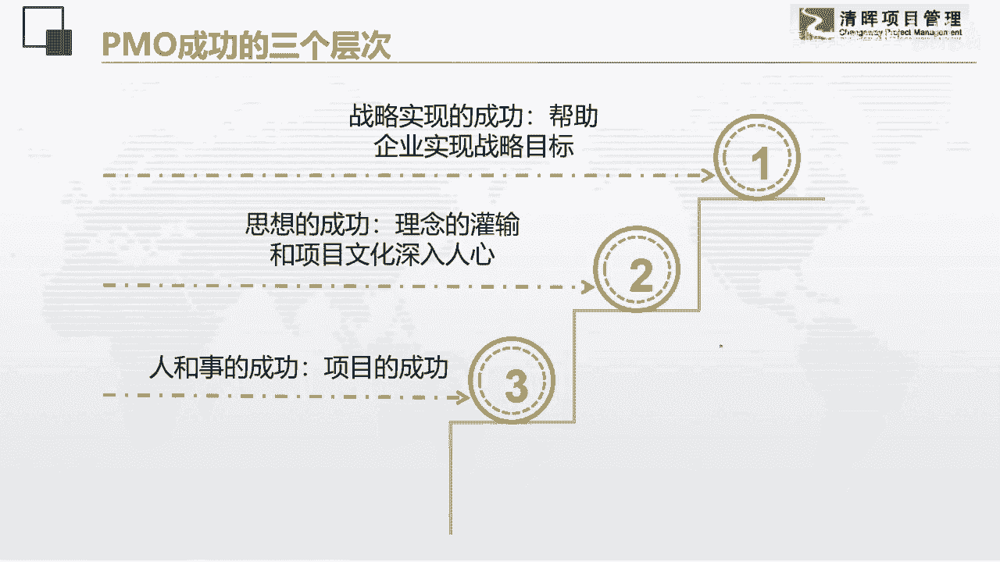

# PMO项目管理流程参考 - P14：14.PMO成功的三个层次 - 清晖在线学堂 - BV13N411C7qF

我们到了最后这一块的话。

我们来讲一讲啊，天猫成功的三个层次，我们说最底下的一个层次呢是人和事的成功啊。

项目的是成功的。

这个呢它是需要潜移默化啊，慢慢的往上去发展的啊。

第二个层次的话呢，它其实是什么呢，理念文化的灌输啊。

如果我们在项目，我们po如果能够把我们整个公司。

整个组织，每一个人脑袋里都有项目这样的一个概念。

都有项目的一个工作习惯的话，那也是一种胜利，那最大的胜利是什么呢。

并不是项目的成功，而是价值的成功，他如果能够帮助战略。

帮助企业的战略目标实现，那才是真正的成功。

所以大家知道吗，po部门杯的业绩指标，往往是和公司的战略绩效的指标是一致的，比如说你是一个事业部的，经常你的po背的就是这一个事业部。

全年的业绩指标，有的人说我天猫部门根本就跟业绩没关呀，对吧，我又不是实现部门。

我对业绩无能为力啊，我说谁告诉你的，po部门就是要帮助这些绩效业绩的完成，所以他要背的就是这个事业部的指标。

经常是有这样的事情的，所以大家一定要能够理解到，它是最重点的一个地方。

它是在逐年的上升的，然后p m的分布在各大产业当中呢，呃它的比例已经越来越高了，什么健康产业啊，啊就是像那些医疗仪器啊，医医医药国，医药研发呀，金融行业，it行业，还有一些专业服务。

比如说咨询培训啊等等，企他们的po呢分布概率已经非常高了，所以我们pmo呢这个部门这个职能呢啊，未来是一定有发展的道路的，但是呢我要现在要告诉大家的一个点，就是你先要想好我应该该怎么做，不是没有制造业。

制造业有制造业确实有，我今天这一页ppt没放进来，现在我们是做的是个性化制造，柔性制造，现在呢制造业企业的pmo已经非常重视了，已经非常重视了，因为我们现在是订单化的。

指的就是设计订单的这种模式的制造型企业，po一现在也是非常看重的啊，只是这个数据呢。