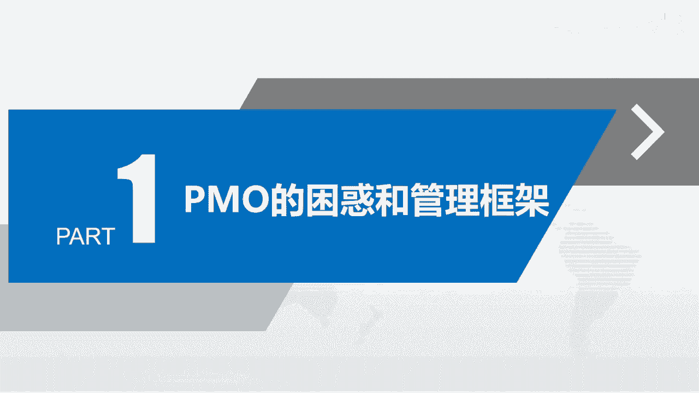
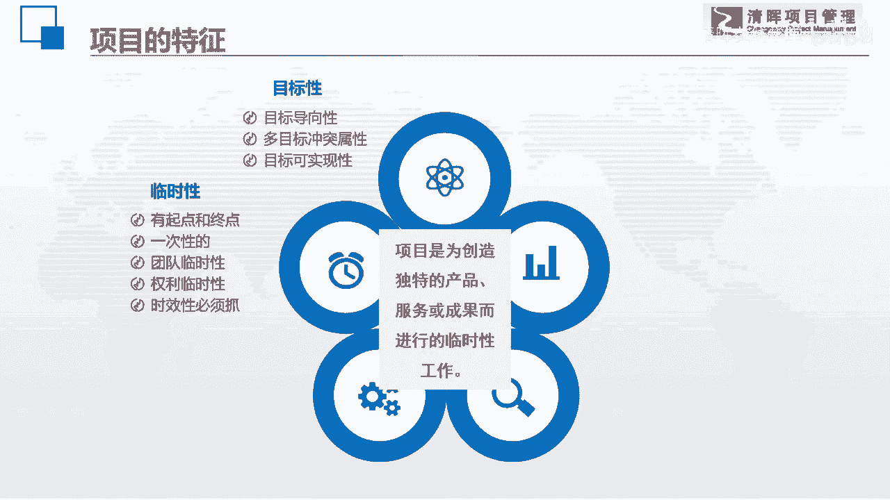

# PMO项目管理流程参考 - P2：1.我们为什么要做项目？项目的特征又是什么？ - 清晖在线学堂 - BV13N411C7qF

今天来讲一讲我们的项目管理，我们项目管理的一些困惑和一些管理框架的话。

我们还是要来了解一下，首先我们来再认，再次要认识一下我们项目管理的办公室，他管的是什么呢，管的是项目，那么我在这儿依然用了，我们pmi组织的项目的一个，因此项目是为了创造独特的产品服务和成果。

而进行的一个临时性工作，那么在这里呢带着大家，我们在一起梳理一下项目的特征，看看项目到底有一些什么样的特征，首先第一个是目标性，这东西没有问题吧，我们做项目的时候，项目呢是有目视目标导向的。

项目的目标性是极其强的，这个是和其他的运营管理是无法批拟的，然后呢虽然目标导向性很强，但是我们在项目当中的干事人很多，所以每一个目标他之间啊，每一个干事人他的诉求其实是不一样的，所以呢他是多目标。

并且目标之间呢是容易怎么样产生冲突的，而且我们还要评判一下这个项目的，目标的可实现性，它真的能够实现吗，大家想一下啊，在我们的很多的项目，特别是一些研发类的项目，其实并没有我们想象中那么容易的实现。

大家有没有发现这是目标性，那么第二个特性也是我们最经常说的那个东西，这一个项目它是有起点，有终点，就是临时性的，所以我们在这个项目的时候，都是奔着它的结束而去的，这点没有错吧。

其实这个临时听我还是蛮喜欢的，大家知道吗，因为我除了做职业讲师以外，我的另外两大两段生涯，一个呢是做项目经理，一个是做po，相对来说我还是觉得我在做项目经理的时候，还会更加的快乐一点，因为什么呢。

当你完成了一个项目以后，你有一种分配感啊，你每完成一个项目，然后你再去接一个新项目，是有一个新鲜的感觉的，所以呢临时性其实也是有好的，临时性还告诉大家一个很重要的特点，就是什么呢，项目有可能是一次性的。

我们说一切天项目，比如说我们日常工作当中的结婚，也是可以当一个项目去做的，对不对，那么结婚嘛对吧，最好一辈子就结一次哈，不要结太多，对不对，所以的话有的时候是一次性的，你是很难去找到有什么经验的。

对不对，还有呢在我们的零项目的临时性也决定着，如果我们的组织架构是矩阵型的话，我们的团队也是临时性的，项目经理的权利也是临时性的，甚至有一些项目经理告诉我说，我根本就没有权利，然后呢。

临时性时间还告诉了我们，项目的有是有时间制约的，所以是一个时间非常紧迫的一件任务，所以你你我们大家做项目的人，一般都会发现一个什么特点，就是基本上项目都是啥，基本上都是急货拉货的。

似乎就没有哪一个项目呢，似乎就是是特别轻松的，大家有没有这种感觉，时间好像宽松的很少。

基本上都是时间非常的紧迫，所以它有一个临时性，因此目标导向性挺好的，但是目标的不一致，给项目增加了难度，项目的时间紧张，也给我们项目造成了难度，我们再来看看协同性。

我们说项目管理呢其实是人和事的一个协同，我们很多的人员曾经有很多技术人员问我说嗯，我想转型做项目管理，我说你如果想做项目管理，那你一定要注意人和事的协同啊，我因为我这个人自己的是本来就是。

自己是非常喜欢，就是那个道家的文化，所以我很喜欢那个阴阳鱼的那个图，我觉得人和事呢就相对来说，就是阴阳语里面的两半啊，我们在做任何的项目管理工作的时候，如果你从局限性的角度，从人或从事单方面去考虑。

那你就会发现你会把事情给做杂，所以人和事就是啊就是要协同的，所以技术人员，当他要转型做我们项目管理的时候，那他的思维结构是一定要有变化的，还有呢他呢是需要什么呢，多种技术协同的。

你会发现现在的项目几乎就没有什么事情，什么项目它是能够怎么样一种技术就能解决的，基本上是要多种技术相互配合的，并且呢在组织中也是跨职能部门协同的，大家已经慢慢的发现，在组织中有很多重要的工作。

都是需要多部门协作才能完成的，而这一类的项目呢其实是啊，这一类的任务其实是特别适合用项目管理的，但同样它也给项目管理造成了什么难度，还有呢多组织协同，现在我做了一些大型的集团企业。

他们做的一些大型的项目或项目集，或者是叫大项目，他们甚至会用到了多个什么呢，法定的组织，也就是多个公司合作才能做成的，所以协同性也给项目造成了难度，就是这个项目是一个非常难做的啊。

这样的一件事情需要多方协同，多种技术配合，这个我们帮大家梳理一下啊，简单的梳理一下，然后呢要不是有制约性的，这个没有说没有得得说了，成本的，资源的，资金的，质量的，法律的环境的，还有人的制约啊。

这些制约因素也就告诉大家，我们的项目天然是有紧箍咒的啊，并不是你想做成什么样就怎么样的，说句实话，除了一些嗯政治上的一些项目之外，绝大多数企业的项目一般来说都是缺钱的，不会给你很痛快的相互的资源。

所以就是钱很少，时间很紧啊，需要多种技术，多种人来配合，目标还不统一的这么一个难做的项目，所以这个项目呢就是怎么样显性很强，一定能够成功的啊，然后呢它的独特性也告诉大家，它是带有创新的，是变革的独特性。

就告诉大家也是有很多风险的，我们都要有一些项目啊，他从一开始你就不知道他最后能不能成功，我们在好几年前有一个电影嘛，就是我不是药神，不知道大家有没有看过啊，那个电影看完了以后，你心情会比较沉重。

因为这里面没有一个角色，他是嗯就是其实是真正的是坏的啊，他们每个人都在为自己的生存在奋斗，甚至那个很多人会怪那个药厂说，你为什么把药卖的那么贵，其实你的成本并不高，但是大家要知道他的那个癌症的靶向行星。

要在世界上，它的研发的成功，而且失败率啊大概高达70%甚至到80，所以他好不容易研发出一个新药来，怎么地啊，他肯定要把这些研发成本要在新药上给收回来，所以其实他也没有错，如果你不让他去收这个费用的话。

那你就会发现什么呢，你就会发现以后再也没有人去做研发新药，因为这个成本hold不住，一旦成本超了的话，那么这个公司就会倒闭，也不会再有人去研发新药，所以呢这个时间大家就可以想一下。

所以这就是项目从头到尾，我就是告诉大家，项目其实就是一个什么呢，一个相当难做的一个任务啊，这是因为有这样的一个事儿，而且现在大家会发现，具有这种项目特征的任务是越来越多了啊，是越来越多了，所以的话呢。

我们说我们的企业开始慢慢的需要项目管理，我们来看一下我们整个一个社会的一个发展，我们说我们的上一个时代叫工业化时代，而工业化时代讲究的是什么呢，第一个是规模效应，第二呢是质量管理啊。

最最追求的是高质量大规模，所以你们可以看在工业化时代的时候，大家有没有发现，那些质量管理体系的培训是特别流行的，所以我自己当年也学了好一肚子的，那个质量管理的啊，这种啊标准体系什么六西格玛什么的啊。

这些都去学了啊，然后工业化时代呢是一种专业化分工的啊，每一个人各司其职，专业化的，然后呢标准化的他们像什么呢，像资源效率需要效益的，这是工业化时代，但是我们现在什么时代呢，方言现在大家已经发现了。

我们呢有的时候呢叫做知识经济时代，有的时候呢也称自己为信息化时代，我们在这个时代里面创新是主要的主流啊，信息化主导流程整合再造啊，我们的核心理论呢是整合管理啊，我们呢要讲究敏捷啊，要讲究高效啊。

说项目管理就是追求高效的，然后呢向资源的创新需要效率，所以它们之间呢整个的一个模式，形态都已经发生变化了，所以呢在工业化时代的时候呢，我们称它为叫运营机动性组织，在这样的组织里面呢。

我们的任务和一些事情啊，啊就事件他主要是在什么呢，职能部门内的完成任务啊，然后的话呢，呃我们呢，就是可能他没有清晰的一些战略和计划，或者是有，但是呢我们的运营人员在日常工作的时候，其实并没有和战略啊。

和这种管理机制和计划机制挂钩啊，然后我们有的一些任务呢它是模糊的，也没有人负责，呃高兴的时候就去做一下，不高兴的时候，可能就为了职能工作怎么样就要让位的，所以呢目标是冲突的，资源是不足的。

这个就是我们呃原来运营时代的时候，我们叫什么呢，我们叫它叫任务管理啊，或者叫事件管理啊，然后呢，慢慢慢慢，在我们的这个发展的过渡阶段的时候呢，就出现了混合式的组织，而且我可以告诉大家。

现在也是绝大多数的企业都是混合型模式，混合型模式的一个最大的特点就是什么呢，运营和项目管理这两个管理呢，在企业当中它将是并存的啊，在我们混合式模式里面呢，他呢就是开始出现项目了。

也知道有一些跨职能的东西，然后我们的目标也非常的清清晰，所以呢我们要对项目管理一个一个的去做好，这是一个新的思维方式，然后呢开始说啊，我要追求多快好省，其实这是一个有矛盾的东西。

所以呢我们就开始慢慢的接触呢，良好的一个方法论啊，完成项目，我们说我们要有一个项目管理，但是随着这个时间的一个驱动的话，我们发现有一些组织啊，他现在的主营业务就是一个一个项目啊。

比如说我们一些软件行业的乙方服务公司啊，那它就是一个项目驱动型的组织，当然了，我们现在呃当今社会的话，这两种形态都存在，一种是混合式，一种呢是项目的驱动型的组织，项目驱动型的组织呢，这个项目化的管理。

这个呢需要全面项目化管理，它就是把企业当中能够用项目管理的方式，都用项目来管理，这个时候我们就发现企业当中的项目呢，像雨后春笋一样，不是一个一个单个项目，我找一个项目经理把它倒腾完了。

ok就能把它搞定了，这个时候，企业当中不断的会产生各种各样的项目，所以呢他就需要的一个东西叫项目的治理啊，我们要把我们的公司的战略，全部都通过项目组合的方式来进行项目化，甚至公司里面的一些任务。

我们也可以当项目去做，这时候就提出了项目组合管理，项目集管理，然后呢也提出了项目化管理的思维和文化，什么叫项目化管理呢，项目化管理当中有一个最重要的点，就是你把什么东西看作是一个项目，我称它为布局。

我们等会儿会在呃po的那块的工作当中，我们会涉及这一块，因为为什么呢，就是项目的pmo管理啊，它是必须要去做项目布局的，我要知道我管辖的项目到底有哪些，我企业当中到底有哪些项目啊。

哪一些东西我是可以项目化的，这个点就非常的重要，那么从什么时候开始，我们po是有生存的空间了呢，啊那就是从混合式的组织开始，我们pmo开始有长足的发展，慢慢慢慢发展到现在。

现在有很多的企业都知道要做项目化管理啊，都知道要做项目的治理，这个时候我们的pm就有了我们的生存空间，也就有了我们今天这样的一个课程啊，也就是说我们来探讨一下在企业当中。

