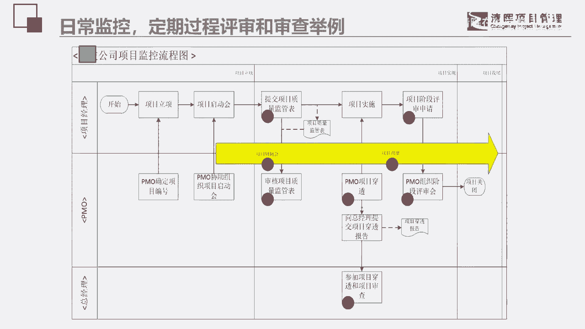
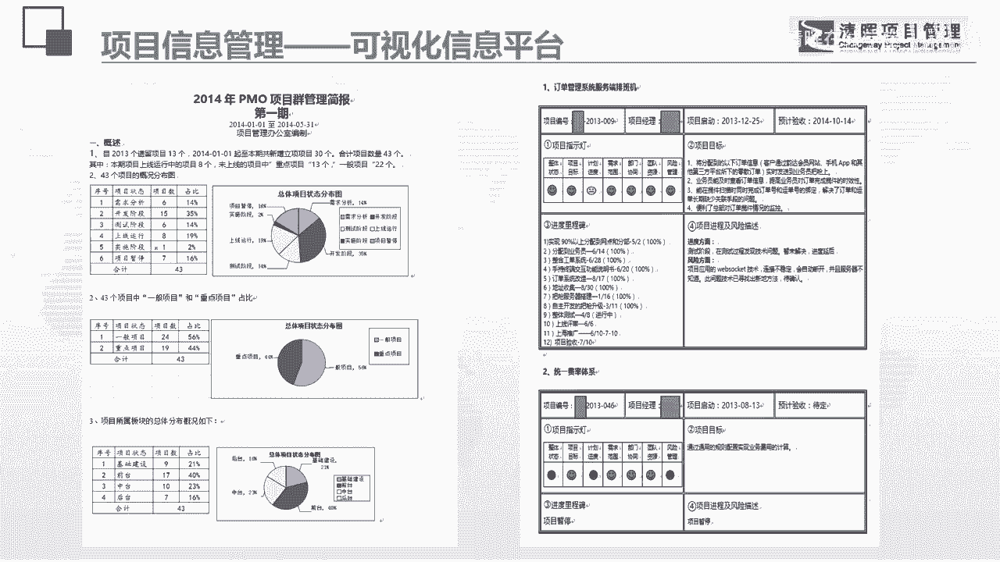
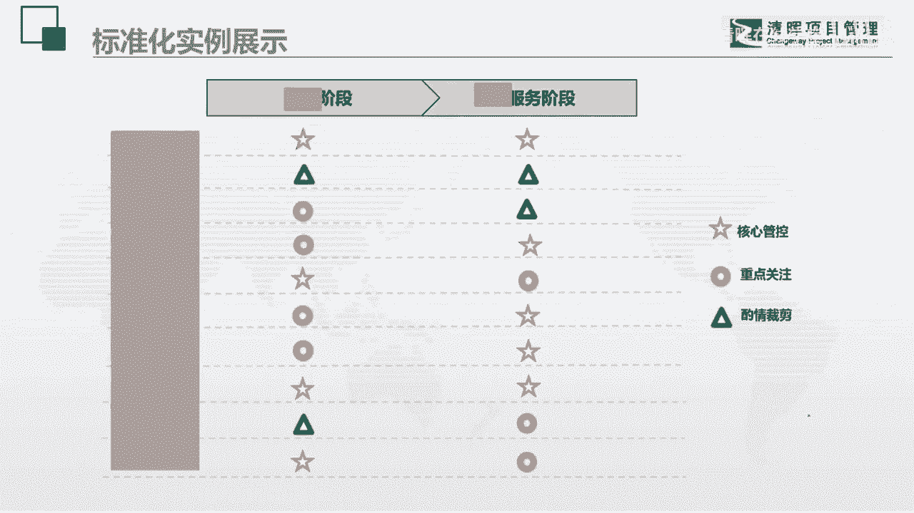
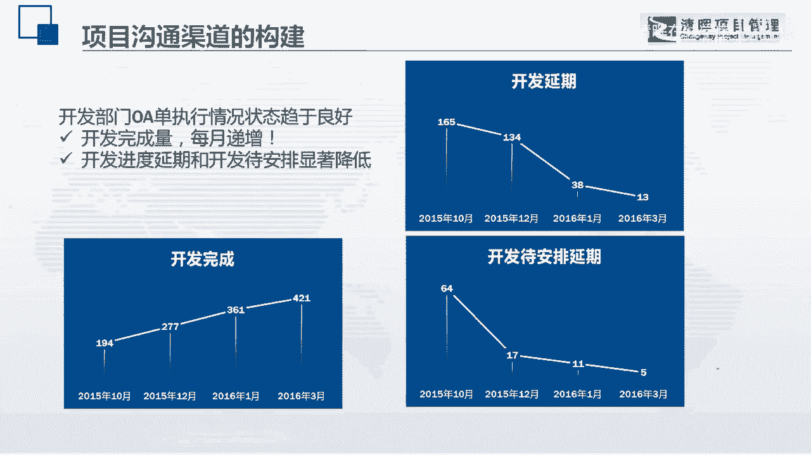

# PMO项目管理流程参考 - P1：12.PMO项目管理流程参考 - 清晖在线学堂 - BV13N411C7qF

像我们在做一些公司的时候，我们PMO到底这个就是一个呃插手项目，力度比较大的监控型的啊，控制型的呃，那个PMO他会告诉你，你在你的项目过程当中有哪一些点啊，是需要进行项目监控的啊，在哪里有些哪些东西啊。

这些东西，这个呢是一个呃日常监控的一个表格啊。

这个呢是一个可视化的信息平台，他可以告诉你啊，就是你的项目现在做到哪里了，他的一些呃你们都可以看到，我这里一直都有一个这些都是我曾经用过的，说说实在话啊，就是有一个词叫穿透。

这个这个词是我经常用的叫项目穿透，就是定期会对项目进行项目的一个梳理啊，然后呢可以让大家去看到啊，然后呢近期呢我们PMO有的时候有人说，我们PMO做起来没有价值。

对不对，其实我们也是可以有价值的啊，那么比如说的话呢我们可以看一下啊，这是一种可视化的平台，我们会把一些信息摘要出来，去做一些项目群的一些管理，说一些简报啊，做一些这样的一些东西。

那么这个呢呃也是可以的，我们PMO也是可以做宣传的嘛，对吧啊，别人不知道有我们，那么我们自己来宣传啊，我们定期拿一份那个项目呃，项目管理的简报放在各位老大的呃，那个呃就是桌子上。

你不觉得这个也是很有震撼力的吗，对不对啊，然后呢我们说我们在做项目管理的时候，记住啊，就是在做很多的制度体系的时候，一定要结合什么呢，结合一些啊业务的啊一些流程啊，因为我们的项目啊，我们的项目管理。

我们的所有的体系制度，都必须和公司的战略和业务模式，一定是要相融合的，所以这是帮一个企业，他做的一个项目全生命周期的一种标准的设定，下面的这个表格大家大家知道是什么吗，这个表格啊就是输入执行输出。

这是一个c park模型，c pk的模型是流程图的一种，我们学过偏僻的里面应该听到过这个名词，这就是一个CPA的那个工具啊，它是我我们经常用的一个表格，非常好用啊，我们经常在做业务咨询的时候。

和一些做融合的时候，就我们在做项目管理的时候，要懂得和我们的业务要有融合啊，这些呢都是一些标准化的一些事例，给大家都可以看一下，这也是这个是帮一个企业，他去做了好做的一个模仿了呃。

那个偏book的十大知识领域啊，所做的一个呃所做的一个呃知识域和过程的啊，一个一个一个规划啊，啊我们这里面就是这是模仿的啊，然后呢去做了这样的一个东西，每一个白色的块块其实都是有制度和体系的啊。

都有制度和体系哦，而且都有流程啊，其实这一块啊都是很不错的啊，可以啊，这些呢就是在这里面的一些空的一些，在什么样的阶段啊，应该在什么东西是一个重点的管控点啊。

这些东西都可以去啊，因为里面有一些涉及业务吧，所以没有把它放在，就是有些数据给我抹掉了啊，还有呢这个是一个什么东西呢，这其实是说在沟通渠道，我们PMO啊，其实可以打通一些沟通的渠道来解决和验证呢。

啊各种的呃就是过程当中他们的一些争议，部门和部门之间有很多的争议嘛，所以我们在这一块上啊。

