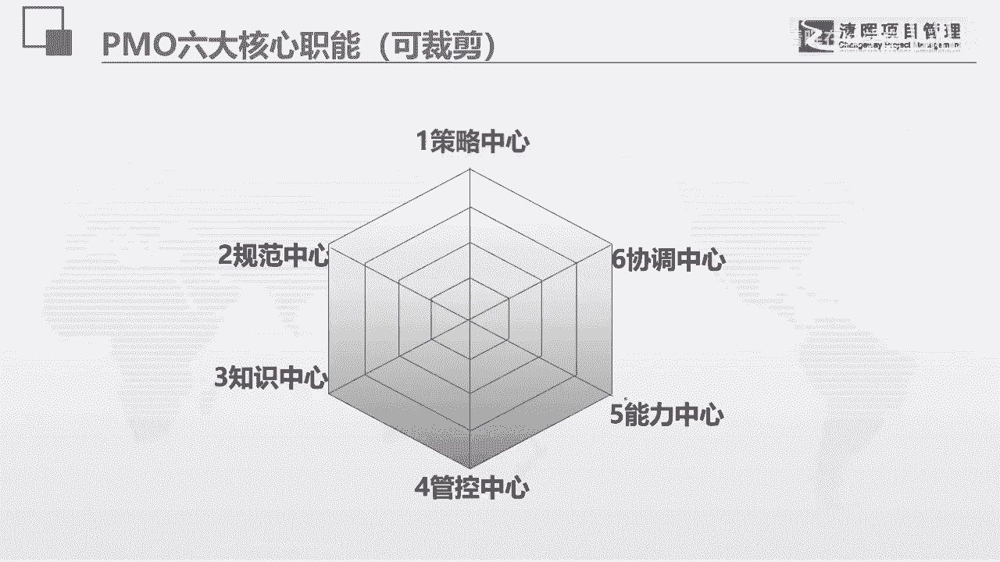

# PMO项目管理流程参考 - P12：11.PMO的六大核心职能 - 清晖在线学堂 - BV13N411C7qF

看一下啊。

这里面的很多东西都是可以裁剪，就是说是可以增加，可以减少的啊，所以这里面的一些具体的内容，我们今天呢就不会做太多的介绍，因为这个东西展开，那真的就是一天的讲解，策略中心，我们可以看看有哪些东西啊。

参与战略的规划理解分析分解组织战略和目标，做分解，不做战略部署，还有呢做一些项目的可行性研究的引导，和做一些立项的决策，保障和考核项目目标和利益的实现，特别是项目集，项目集其实是讲究利益的。

确保战略一致性，包括自己部门的规划和发展，还有项目中重大决策事项啊，它的一些处理规范中心呢，做一些定义和优化项目的类型，制定各种相关的制度体系，定义和优化pm部门的职能和组织框架啊。

规划和组织项目的持续改进工作啊，这个是什么呢，就是说如果你发现你的项目当中有一些阶段，会有一些任务，它本身是有改进的必要，有增值的，必要的时候，你都可以去做过程改进，还要制定一些我们最喜欢的一些模板啊。

都是可以添加的，各位啊，就是你们可以往里面添加，我一直都讲这个呃中性六个中心是可扩展的呃，知识中心的话呢，我们就可以看各种资产的管理呃，知识库的一些建设，经验教训的总结，个性化的培训的培训，课件的制定。

像我在帮有些企业做内训的时候，我们甚至去帮一些企业去做经典案例包装，然后就直接拿着这些经典案例，用他这个呃，我们客人的就是客户的实际的案例来做，就是项目管理的培养，经理的一些培养啊，做成课件。

这个就是杀伤力是非常大的，因为你们很多做的人就觉得这就是我的东西，我在我做的东西里面，我遇到了问题，所以我就是可以去解决的啊，然后呢管控中心项目的一些运营分析啊，项目的一些全生命周期的管理。

从启动到收尾，整个的绩效的各方面的管理，项目的的绩效报告啊，问题风险的管控，日常的一些监控，复查审计，还有危机项目整改辅导等等啊，第五个呢是能力中心，能力中心呢是项目经理能力的模型的管理啊。

那选拔晋升团队建设啊，成员的能力培养绩效的考核，培训规划管理啊等等，像我们的协调中心，它呢是项目的统筹安排，项目的分分配，项目经理的一些任命啊，组织的跨组织的协调冲突的管理啊，还有呢打造一些沟通的渠道。

建立一些项目管理的平台，因为协调中心有时候还管着一些信息的管理啊，等等等等，以及一些外包资源的管理，因为我们这个协调中心的要管资源，资源分内部和外部的资源，我就基本上把它分成这六块。

这也是我个人的一个体系啊，如果大家想用的话。

