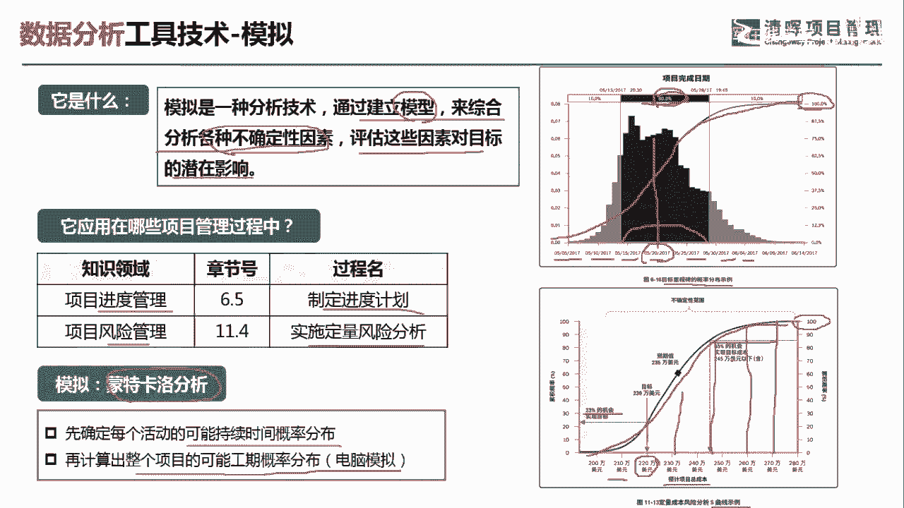
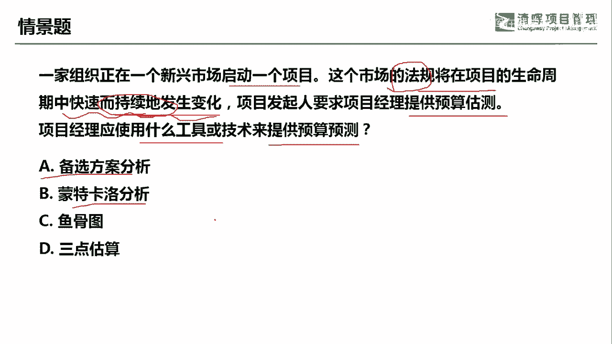
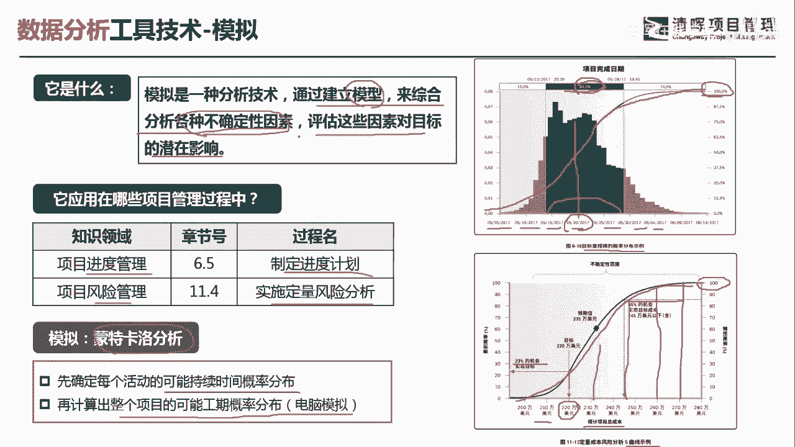
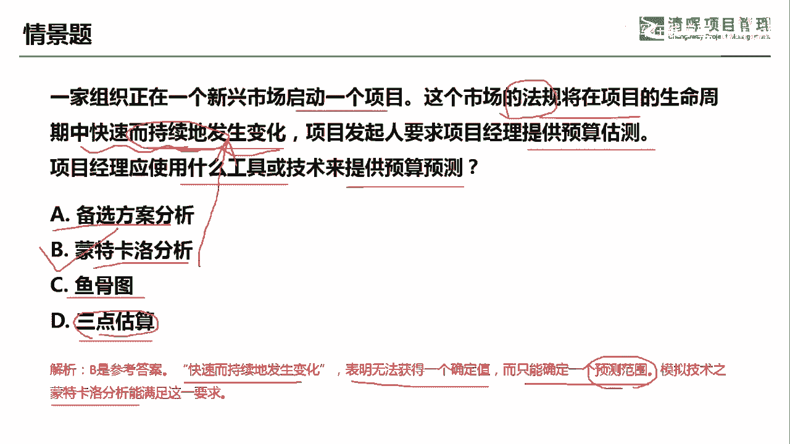

# PMO项目管理流程参考 - P22：模拟 - 清晖在线学堂 - BV13N411C7qF

各位同学大家好，我是宋老师。

今天我们来看模拟这个工具，模拟呢它是一种分析技术，主要是通过建立模型来综合分析，各种不确定性因素，评估这些因素对目标的潜在影响，好，它主要是通过建立模型综合分析呢，各种不确定性因素。

主要是评估这些不确定性因素呢，对目标的潜在影响，但是它是借助于模型的形式模拟这个工具呢，它主要是在进度管理的制定进度计划的过程中，这个制定进度计划呢，它其实主要是制定进度基准，在风险管理的实施。

定量风险分析的过程中也会使用，也会使用，那我们看到这个模拟当中呢，主要是有一个叫做蒙特卡洛分析呢，是作为一个代表，他呢是可以先确定每个活动的可能的，持续时间的概率分布啊，或者呢他在一个风险的概率分布。

然后再计算出整个项目的可能的，工期的概率分布，或者可能的风险的一个分布，还是用电脑来模拟的，比如说我们在右边看到这张图，一个呢是目标里程碑的概率是这个分布，目标里程碑是什么意思呢。

我们横向的这些下面的日期呢，全部都是目标的里程碑，每一个目标里程碑呢达到了它的这个时间之后，都可以看到这个项目完成了一个百分比啊，完成了一个百分比，那么在这个中间，比如说我们看到这个80%是什么意思呢。

80%是告诉我们，他这个项目从2017年5月15日，一直到2017年5月30日，这个当中呢，他总共完成了项目的概率的80%，完成了80%，那把所有的里程碑的这个完成概率累计起来呢。

我们就可以达到百分之百啊，这是一个项目完成的一个标志，下面的这张图呢是代表定量风险分析当中的，一个s曲线的示例，好，s曲线呢，其实上面的这个项目完成了这个里程碑，概率分布的这个汇总呢。

其实也是一个s曲线，只不过它挡住了，我们没看出来，下面的这张定量风险分析的s曲线呢，它是代表横向是预计的项目总成本，纵向呢是代表他的这个呃完成的一个概率啊，比如说我这个项目我投入的220万美元。

那在这种情境下呢，我实现了这个目标的概率大概是23%，那我如果投入了这个，比如说245万，245万，我这个时候呢大概是85%的概率，去完成这个项目，也就是简单的讲就是说我钱砸的越多。

我完成这个项目的这个成功概率会更高一点，不确定性会更加降低，那我们随着这个金额的投入越来越高，那这个项目呢到最后不确定性就消失了，那最后呢就完成这个项目的就达到了百分之百，这个也是一个累计的s曲线。

s曲线的是把每一个金额下的实现概率呢，把它用平滑先把它联系起连接起来。

这样就形成一个s曲线，好模拟呢，我们来举一个例子，一家组织正在新兴市场启动一个项目，这个市场的法规将在项目的生命周期中，快速而持续地发生变化，这个是法规持续的发生变化，一般我们遇到法规发生一些变化。

一般都是制约因素发生变化，总会带来一些不确定性，带来一些风险，项目发起人要求项目经理提供预算估测，提供预算估测，问项目经理应该使用什么工具或者技术，来提供预算的预测，a选项，备选方案分析，备选方案分析。

它并不能对应持续地发生变化，这种情景，蒙特卡洛分析，刚才我们在讲它的定义的时候啊。

大家会看到前面来综合分析各种不确定性因素。

评估这些因素对项目标的潜在影响，所以呢它是可以对应这种持续的不断变化的，这种法规环境的，鱼骨图呢也叫因果图或者叫实穿图，它主要是根本原因，发现根本原因的好，三点估算呢。

主要是告诉我们有这个三个值的情况下，三个点的值的情况下，我们做出一个相对这个科学的一个估算啊，比如说告诉我们最优的和最悲观的，以及最可能的估算点的时候，我们可以用三点估算。

它一般是出现一些这个风险的时候，我们看到三个值可以用这个工具好，我们既然是这个提供预算预测，在这种持续的变化的法规的情况下，那我们最适合的就是应该用蒙特卡罗分析，它其实就是蒙特卡罗模拟啊。

快速而持续的发生变化，表明无法获得一个确定的值，而只能确定一个预测的范围，模拟技术当中的蒙特卡的分析呢，能满足这一要求，好今天呢主要和大家分享的是模拟这个工具，我们下次再见。

