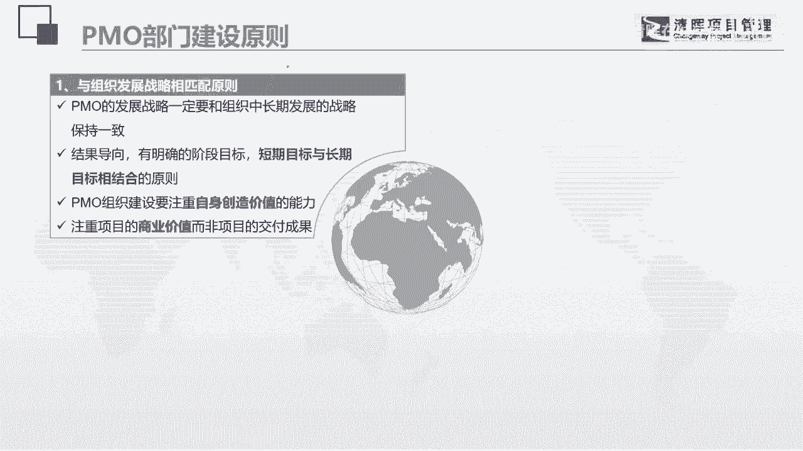

# PMO项目管理流程参考 - P8：7.PMO部门建设原则 - 清晖在线学堂 - BV13N411C7qF

这篇猫呢它其实是挺有用的。

那我在这儿呢给大家稍微做了一个总结，今天也不特别的展开啊，啊后来说了，我我没看到啊，联想对的对的联想啊，我这反应也慢啊，哈哈对的，卖给了联想诶，好那么我们来看一看啊，po部门的建设原则，建设原则的话呢。

第一个是要与组织发展战略相匹配的原则啊，这是一个非常重要的原则，就是什么呢，我的po部门一定要采，坚定地站在组织战略和组织战略保持一致啊，然后我可以啊，有明确的阶段目标，我的pmo的部门建设。

不要一口一口吃成一个大胖子，我可以有短期的目标，可以有长期的目标，待会我可以给你们看一些呃，那个po的雷达图，大家可以去想啊，我每1年我可以建设一部分啊，然后呢慢慢的去做完善，pm部门在建设的时候。

一定要注重自身的创造价值的能力，就是我的pm部门绝对不能是一个成本中心，我一定要在我们公司的价值链，利益链当中是有一席之地的，是有说话的分量的，那么这样子的话，你的po才真正的具有什么价值感啊。

而且我们在做项目管理的时候，也一定要注重项目的商业价值啊，有的人说我把项目做完了就可以了啊，我能够就是就是按时完成项目，那我这po就功德无量了，谁告诉你的啊，你要能够能够让项目是有价值的。

那你才能功德无量，第二呢与公司的组织结构，组织文化要相协调的东西，所以我们这有一条非常重要的东西，我们今天不能展开啊，我们来看一下，就是明确pm的管辖边界，权责分清并达成共识。

就是因为我们的po很多的工作，其实都和其他的职能部门之间，是有利益冲突的啊，所以别人会觉得你捞过界po又是一个新兴产物，相当于是一个新的诸侯国，在其他的诸侯林立的情况之下。

你要在这么多诸侯国之间要抢一块地盘，啃下一块肉来，其实是非常难的，所以呢我给大家建议就是什么呢，要联盟，而不是抢权，当别人想做的时候，那我就是一个辅助，当别人不想做的时候啊，然后当别人不想做的时候。

那我就拿过来做啊，通过这样1。1滴的打开自己部门的局面，这个点就比较重要，然后呢要注重呢项目管理的文化的传播，因为你不要以为别人对项目管理都是真的明白，人家只是喊个口号而已啊。

我知道我们现在有一个非常流行的管理，叫项目管理，项目管理到底好在哪，怎么管，具体做什么，思维模式是什么，其实很多人是不知道的啊，然后呢我们可以多层次，多组织集的去设计啊，去做融合。

然后我们再来看第三个要点，就是与主要的肝神利益需求要相一致的原则，首先第一点，pm呢是一个一把手工程，如果你的老板没有下定决心要去做的话，那其实挺难的啊，我们有很多的公司的p o。

真的就是老板没有下定决心，他是希望你做的简单，又希望你能解决问题，而一直在犹豫，道理嘛也有一点，因为po作为一个新兴的管理，要弄得不好，可能把这一潭水弄得更浑啊，所以呢也是有风险的。

但是呢他又希望你能够帮他解决问题，所以po部门是一个治理，是一个创新部门啊，你要啊那个披荆斩棘啊，要让老板能够看到你的价值啊，然后呢我们要满足主要干涉人的需求啊，po的目标部门职能的设立。

都要考虑各个干事的需求，尽可能的不要和别人产生利益上的冲突啊，尽可能的要做到共赢的原则，所以在一开始的时候，如果真的和其他的职能部门之间，有一些职能业务有冲突的话，能说句实在话啊，能让就让一下。

能做辅助的就做一下辅助啊，就是呃很多东西啊，慢慢慢慢的，当你在你的战略中占有一席地位之后，你慢慢会体现你的价值的，我在第一家公司的时候，我说每一个合同都是要赚钱的，那你知道我们当时在做的时候。

销售部门对我们是有多么的就是抵制呢，因为我们要去考核利润的时候，对于合同的签订是会造成时间拉长的，所以其实开始的时候，销售部门其实是都很痛恨的，但是在我们不断的一个组织战略的一个宣传。

他们的价值意识还是比较强的，慢慢慢慢做到后面，所有的公司最后都已经成型了，就是所有的合同都必须要到我们这来走，结果最后就成为一个文化一个流程的时候，大家最后也就慢慢遵守了，所以大家要知道啊。

就是大家一定要有这么一个，潜移默化的一个过程，所以他要迅速，并且呢呃就推进呢要兼顾循环渐进的原则，慢慢的做分阶段的做哪一块最体现价值的，就先做哪一块，在价值中最解决问题的就先做啊。

所以呢采取的是渐进式的导入模式啊，交付成果逐步的渐进啊等等这样的一些模式。

